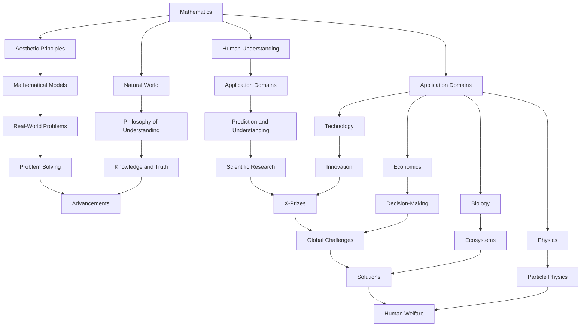

                 

### Introduction to the Topic: Mathematics Beauty and the Connection with the World's Understandability

#### Abstract

In this comprehensive article, we delve into the intricate relationship between the beauty of mathematics and our understanding of the world. Mathematics, often hailed as the language of the universe, is not merely a tool for solving problems but an art form that reveals the underlying order and patterns in the cosmos. The purpose of this article is to explore how the aesthetic principles of mathematics contribute to our comprehension of the world, and how this interplay influences various aspects of human knowledge and culture.

Mathematics has fascinated humanity for centuries, and its elegance and simplicity have been sources of wonder and inspiration. From ancient civilizations that developed complex mathematical systems to the modern era where mathematics underpins technological advancements, the field has continuously evolved, enriching our understanding of the natural and man-made worlds. In this context, the beauty of mathematics serves as a bridge that connects abstract concepts with real-world phenomena, enabling us to decipher the mysteries of the universe.

This article is structured to guide readers through a systematic exploration of the topic. It is divided into several sections, each addressing different facets of the relationship between mathematics and the world's understandability. We will begin by defining and exploring the aesthetic aspects of mathematics, drawing on historical and philosophical perspectives. Following this, we will examine the role of mathematics in shaping our understanding of the natural world and human culture. The article will then delve into practical applications of mathematical principles in various domains, from technology to social sciences. Finally, we will discuss the future prospects of mathematics in illuminating the complexities of our world and propose directions for further research.

By the end of this article, readers will gain a deeper appreciation of the beauty and power of mathematics, as well as its profound implications for our understanding of the world. We will see how the interplay between mathematics and the world's phenomena not only enriches our intellectual lives but also holds the key to solving some of the most pressing challenges facing humanity today.

#### Key Concepts

To fully grasp the intricacies of the relationship between mathematics and the world's understandability, it is essential to understand several key concepts. These concepts serve as the building blocks upon which our exploration is constructed.

1. **Mathematics**: Mathematics is a field of study that deals with numbers, shapes, structures, and patterns. It encompasses various branches, including algebra, geometry, calculus, and more. At its core, mathematics is concerned with the properties and relationships of abstract entities.

2. **Aesthetic Principles**: Aesthetic principles refer to the qualities that evoke a sense of beauty or pleasure. In mathematics, these principles manifest in the elegance and simplicity of mathematical proofs, the symmetry of geometric shapes, and the harmony found in mathematical relationships. The beauty of mathematics often lies in its ability to distill complex phenomena into simple, comprehensible forms.

3. **Natural World**: The natural world encompasses all the phenomena occurring naturally on Earth, including the physical environment, living organisms, and natural processes. Mathematics has been instrumental in understanding the patterns and laws governing the natural world, from the motion of celestial bodies to the growth patterns of plants and animals.

4. **Human Understanding**: Human understanding refers to the process by which individuals perceive, interpret, and make sense of the world around them. Mathematics plays a crucial role in this process by providing a structured and logical framework for understanding and predicting natural and man-made phenomena.

5. **Mathematical Models**: Mathematical models are abstract representations of real-world systems or phenomena using mathematical concepts and language. These models help us to understand and predict the behavior of complex systems, making it possible to solve real-world problems more effectively.

6. **Philosophy of Understanding**: The philosophy of understanding explores the nature of knowledge, truth, and the limits of human understanding. It examines how humans comprehend the world and what role mathematics plays in this understanding.

7. **Application Domains**: Application domains refer to the fields or areas where mathematical principles and models are applied to solve practical problems. These include technology, economics, biology, physics, and many other disciplines.

By understanding these key concepts, we can better appreciate the significance of mathematics in our lives and its role in enhancing our understanding of the world.

#### Mermaid Flowchart: Core Concepts and Their Interconnections

To illustrate the interconnections between the key concepts discussed above, we can use a Mermaid flowchart. The flowchart will help visualize the relationships and dependencies among the concepts, providing a clear understanding of how they interact.

This Mermaid flowchart provides a visual representation of how the key concepts in this article are interconnected. Mathematics serves as the foundation, with aesthetic principles, the natural world, human understanding, and application domains branching out from it. The philosophy of understanding and the application domains further connect to various scientific disciplines, technology, economics, and other fields. The interplay between these concepts highlights the role of mathematics in solving real-world problems, advancing scientific research, and improving human welfare.

By visualizing these relationships, we can better understand how the beauty of mathematics and its connection to the world's understandability contribute to the development of knowledge, innovation, and problem-solving in various domains.

### Exploring the Aesthetic Aspects of Mathematics

Mathematics is often described as an art form, and for good reason. Its beauty lies not only in its logical structures and proofs but also in the elegance and simplicity of its concepts. The aesthetic aspects of mathematics have intrigued philosophers, mathematicians, and artists alike, inspiring countless studies and works of art. In this section, we will delve into the aesthetic principles that define mathematics and explore their historical and philosophical significance.

#### Historical Perspective

The concept of beauty in mathematics has been discussed throughout history, with various philosophers and mathematicians contributing their insights. For example, the ancient Greek philosopher Pythagoras believed that the universe was based on mathematical principles, and that numbers and geometric shapes were the ultimate sources of truth and beauty. This belief is encapsulated in the Pythagorean theorem, which states that the sum of the squares of the two shorter sides of a right triangle is equal to the square of the longest side. This theorem not only has profound mathematical implications but also embodies the aesthetic principle of simplicity and harmony.

Another notable figure, Euclid, the father of geometry, emphasized the beauty of geometric shapes and their relationships. His work, "Elements," is a foundational text in mathematics that presents geometric principles in a logical and systematic manner. Euclid's approach to geometry has inspired countless mathematical discoveries and continues to influence modern mathematical thought.

Moving to the Renaissance period, Leonardo da Vinci combined his artistic talents with his mathematical knowledge, exploring the relationship between art and mathematics. He was fascinated by the concept of proportion and how it could be applied to create aesthetically pleasing works of art. Da Vinci's studies on the golden ratio, a mathematical proportion often found in nature and art, illustrate the interplay between mathematics and beauty.

In the modern era, the aesthetic aspects of mathematics have been explored by many prominent mathematicians. For example, G.H. Hardy, a renowned mathematician and author of "A Mathematician's Apology," emphasized the beauty of pure mathematics and its importance in its own right, separate from practical applications. Hardy argued that the beauty of mathematics lies in its simplicity, elegance, and the joy of discovery.

#### Philosophical Perspectives

The philosophical aspects of mathematical beauty have also been widely discussed. René Descartes, the father of modern philosophy, believed that mathematics provided a reliable foundation for knowledge and understanding. He argued that the certainty and clarity of mathematical principles made them an ideal basis for other forms of knowledge. This perspective is known as Cartesianism and has had a lasting impact on Western philosophy.

Bertrand Russell, another influential philosopher, explored the relationship between mathematics and logic in his work "Principia Mathematica." He argued that mathematics could be reduced to logic, and that the beauty of mathematics stemmed from its logical rigor and structure. This perspective is known as logicism and has shaped much of modern mathematical thought.

In addition to logicism, there are other philosophical viewpoints on mathematical beauty. For instance, intuitionism, developed by mathematicians such as L.E.J. Brouwer, emphasizes the role of human intuition in mathematical discovery. Intuitionists believe that mathematical concepts are not merely abstract entities but are rooted in our understanding of the world and our intuitive grasp of reality.

#### Aesthetic Principles in Mathematics

The aesthetic principles that define mathematics can be categorized into several key areas:

1. **Symmetry**: Symmetry is a fundamental principle in mathematics and art. It refers to the balanced arrangement of elements around a central axis or point. Symmetry is often found in geometric shapes such as the circle, square, and pentagon, as well as in natural phenomena like the arrangement of leaves on a plant or the structure of animal bodies.

2. **Pattern and Fractals**: Patterns and fractals are another key aesthetic principle in mathematics. Fractals are complex geometric shapes that exhibit self-similarity at different scales. They are often found in nature, such as in the branching of trees, the coastline of a continent, and the arrangement of galaxies in the universe. The beauty of fractals lies in their intricate and delicate structure, which can be described using simple mathematical equations.

3. **Elegance**: Elegance in mathematics refers to the simplicity and efficiency of a mathematical proof or theory. An elegant solution often requires minimal assumptions and leads to a deep and profound understanding of the underlying principles. For example, the proof of the Pythagorean theorem using only basic geometric principles is considered elegant because it distills the essence of the theorem into a concise and intuitive form.

4. **Unity**: Unity in mathematics refers to the harmony and interconnectedness of different mathematical concepts. A unifying principle can provide a coherent framework for understanding a wide range of mathematical phenomena. For instance, the concept of symmetry unifies various branches of mathematics, including geometry, group theory, and topology.

#### Mathematical Beauty in Practice

The aesthetic aspects of mathematics can be observed in various applications and real-world examples:

1. **Art and Design**: Artists and designers often draw inspiration from mathematical concepts, using them to create aesthetically pleasing works. For example, the golden ratio is widely used in art and architecture to create harmonious and visually appealing compositions.

2. **Music and Rhythm**: Mathematical principles are also found in music and rhythm. The structure of musical compositions can be analyzed using mathematical concepts such as symmetry, proportion, and harmony. For instance, the Fibonacci sequence, a mathematical pattern often found in nature, has been used to create rhythmic patterns in music.

3. **Natural Phenomena**: The beauty of mathematics can be observed in the patterns and structures found in nature. From the spirals of a nautilus shell to the branching patterns of a fern, mathematical principles govern the growth and development of natural forms.

4. **Technology and Engineering**: In the realm of technology and engineering, the aesthetic principles of mathematics are crucial for designing efficient and reliable systems. From the optimization of algorithms to the structural design of buildings and bridges, mathematical principles ensure that technologies function effectively and safely.

In conclusion, the aesthetic aspects of mathematics are multifaceted and deeply interconnected with various fields of human knowledge and culture. From historical and philosophical perspectives to practical applications in art, music, and technology, the beauty of mathematics continues to inspire and enlighten us. By exploring these aesthetic principles, we gain a deeper appreciation for the power and elegance of mathematics, as well as its profound impact on our understanding of the world.

### The Role of Mathematics in Shaping Our Understanding of the Natural World

Mathematics has played an indispensable role in our understanding of the natural world, providing the tools and frameworks necessary to unravel the complexities of the universe. From the study of celestial mechanics to the analysis of biological systems, mathematics has enabled scientists to develop accurate models and predictions, shedding light on the underlying patterns and laws governing natural phenomena. This section will delve into the specific ways in which mathematics has been used to enhance our comprehension of the natural world.

#### Mathematics and Celestial Mechanics

One of the most significant applications of mathematics in the natural sciences is in the field of celestial mechanics, the study of the motion of celestial bodies. Isaac Newton's groundbreaking work on gravitation, described in his "Principia Mathematica," revolutionized our understanding of the universe. Newton's laws of motion and universal gravitation provided a mathematical framework for calculating the orbits of planets, moons, and other celestial objects. This work laid the foundation for the development of celestial mechanics as a mathematical discipline, enabling scientists to predict the positions of celestial bodies with unprecedented accuracy.

For instance, the calculations of Johannes Kepler, who formulated three laws of planetary motion, were based on mathematical principles. These laws helped to explain the intricate patterns of planetary orbits and provided a deeper understanding of the gravitational forces at work. Newton's subsequent extension of Kepler's laws through his mathematical formulation of gravity not only confirmed Kepler's observations but also expanded our understanding of the universe.

#### Mathematics and Physics

Physics is another field where mathematics has been instrumental in advancing our knowledge of the natural world. The formulation of physical theories often involves the use of mathematical models to describe and predict the behavior of subatomic particles, atoms, and macroscopic objects. For example, Einstein's theory of general relativity, which describes the behavior of gravity and the structure of spacetime, is expressed in terms of complex mathematical equations.

In quantum mechanics, mathematics plays an even more fundamental role. Quantum mechanics is based on a set of mathematical postulates that describe the wave-particle duality of matter and the probabilistic nature of subatomic events. The Schrödinger equation, which describes how the quantum state of a physical system changes over time, is a cornerstone of quantum mechanics. By solving this equation, physicists can make precise predictions about the behavior of particles at the atomic and subatomic level.

#### Mathematics and Biology

Mathematics has also made significant contributions to the field of biology, particularly in the study of biological systems and population dynamics. The mathematical models used in biology help to explain the growth and behavior of populations, the spread of diseases, and the evolution of species.

One notable example is the logistic growth model, developed by mathematician Pierre François Verhulst. This model describes how populations grow over time, taking into account limiting factors such as resources and environmental conditions. The logistic growth equation, given by the formula:

$$ P_t = \frac{L}{1 + \left(\frac{K-L}{P_0}\right)e^{-rt}} $$

where \( P_t \) is the population at time \( t \), \( L \) is the carrying capacity, \( P_0 \) is the initial population, and \( r \) is the growth rate, provides a mathematical framework for understanding population dynamics. This model has been used to study a wide range of biological phenomena, from the spread of infectious diseases to the growth of animal populations.

Another area where mathematics has been applied in biology is in the study of genetic algorithms and evolutionary computation. These mathematical models simulate the process of natural selection and genetic inheritance, providing insights into how species evolve over time.

#### Mathematics and Climate Science

Mathematics has also been crucial in the study of climate science, where it is used to model and predict climate change and its impacts. Climate models are complex mathematical representations of the Earth's climate system, incorporating data from various sources, including observations of atmospheric conditions, ocean currents, and land surface processes.

One of the most significant mathematical tools used in climate science is the General Circulation Model (GCM). GCMs simulate the large-scale circulation of the Earth's atmosphere and oceans, taking into account factors such as solar radiation, greenhouse gas concentrations, and oceanic and atmospheric dynamics. By running these models with different scenarios, scientists can make projections about future climate conditions and assess the potential impacts of climate change.

For instance, the Intergovernmental Panel on Climate Change (IPCC) uses GCMs to produce comprehensive assessments of climate change, providing valuable insights for policymakers and society at large.

#### Mathematics and Ecology

In the field of ecology, mathematics is used to study the interactions between species and the dynamics of ecosystems. Ecological models, such as the Lotka-Volterra equations, describe the population dynamics of predator and prey species and help to explain the cyclical patterns observed in many ecosystems.

The Lotka-Volterra equations, given by:

$$ \frac{dx}{dt} = x(a - by) $$

$$ \frac{dy}{dt} = cy(d - x) $$

where \( x \) represents the prey population, \( y \) represents the predator population, \( a \) is the intrinsic growth rate of the prey, \( b \) is the predation rate, \( c \) is the intrinsic growth rate of the predator, and \( d \) is the rate at which the predator population declines due to the availability of prey, provide a mathematical framework for understanding predator-prey interactions.

By analyzing these equations, ecologists can gain insights into the stability of ecosystems and the factors that influence species populations over time.

#### Conclusion

In summary, mathematics has played a crucial role in shaping our understanding of the natural world. From the study of celestial mechanics and physics to biology, ecology, and climate science, mathematical models and principles have provided the tools necessary to unravel the complexities of natural phenomena. By enabling scientists to make accurate predictions and gain deeper insights into the underlying patterns and laws governing the universe, mathematics has not only advanced our scientific knowledge but also deepened our appreciation for the elegance and beauty of the natural world.

### Mathematics and Human Understanding

Mathematics is not merely a tool for solving problems; it is a fundamental aspect of human understanding and cognition. Our ability to comprehend the world around us is deeply intertwined with our mathematical skills and concepts. This section will explore how mathematics enhances our understanding of the natural world and human culture, highlighting the cognitive processes and mechanisms that enable us to make sense of our surroundings.

#### Mathematics and Perception

Our perception of the world is influenced by mathematical principles, which help us organize and interpret sensory information. For instance, our brains are wired to recognize patterns and symmetries, which are essential for survival. These cognitive abilities are rooted in our mathematical understanding of patterns and relationships.

One example of this is the phenomenon of phasing, where humans are able to synchronize their movements to external rhythms, such as music or the beat of a drum. This ability to detect and synchronize with patterns is closely related to our mathematical skills, as it involves recognizing and understanding periodic phenomena.

#### Mathematics and Spatial Reasoning

Spatial reasoning, or the ability to visualize and manipulate objects in space, is another cognitive ability that is closely linked to mathematics. This skill is crucial for understanding and interacting with the physical world. Mathematics provides a framework for describing spatial relationships, enabling us to comprehend concepts such as distance, direction, and shape.

For example, the concept of a sphere is a fundamental mathematical construct that is used to describe the shape of planets and celestial bodies. Our ability to visualize and understand spheres is essential for our understanding of the universe and the laws of physics that govern celestial motion.

#### Mathematics and Language

Language is another essential aspect of human understanding, and it is closely intertwined with mathematics. The development of mathematics has influenced the evolution of language, and vice versa. Mathematical concepts often have symbolic representations that are integrated into our language systems.

For instance, the concept of zero is a mathematical innovation that has had a profound impact on language and communication. The use of zero as a placeholder in numbers simplifies calculations and enables us to perform more complex mathematical operations. This mathematical concept has been adopted into various languages, illustrating the deep connection between mathematics and language.

#### Mathematics and Problem-Solving

Mathematics enhances our ability to solve problems by providing a structured approach to reasoning and analysis. The process of solving mathematical problems often involves breaking down complex problems into smaller, more manageable components, and then using logical steps to arrive at a solution.

This problem-solving approach is not limited to mathematical problems but can be applied to various real-world challenges. For example, in engineering, mathematical models and principles are used to design and optimize structures, systems, and processes. In economics, mathematical models are used to analyze market trends and predict economic outcomes. In biology, mathematical models are used to study the behavior of populations and the spread of diseases.

#### Mathematics and Education

Mathematics is a core component of education, and its study enhances cognitive abilities and critical thinking skills. Learning mathematics involves developing logical reasoning, abstract thinking, and problem-solving skills, which are valuable in various aspects of life.

Mathematics education also plays a crucial role in fostering creativity and innovation. Many groundbreaking scientific and technological advancements have been made by individuals who were skilled in mathematics and were able to apply their mathematical knowledge to solve complex problems.

#### Mathematics and Philosophy

The philosophical implications of mathematics also enrich our understanding of the world. The nature of mathematical truth and the relationship between mathematics and reality have been subjects of philosophical inquiry for centuries. Philosophers such as Plato and Pythagoras believed that mathematics was a universal language that could reveal the underlying order of the universe.

More recently, philosophers like Bertrand Russell and Alfred North Whitehead have explored the foundations of mathematics and its role in human understanding. Their work has contributed to our understanding of the nature of mathematical knowledge and the relationship between mathematics and reality.

#### Conclusion

In conclusion, mathematics is an integral part of human understanding and cognition. It enhances our ability to perceive and interpret the world around us, provides a framework for problem-solving, and enriches our philosophical inquiry into the nature of reality. By understanding and applying mathematical principles, we can gain deeper insights into the natural world and human culture, enabling us to make more informed decisions and advance our knowledge and understanding of the universe.

### Mathematics in the Arts and Sciences

Mathematics has been a pivotal force in shaping the arts and sciences, providing a foundation for creativity, innovation, and discovery. Its application in these domains extends beyond mere utility, often becoming a catalyst for new ideas and perspectives. This section will explore the role of mathematics in the arts, specifically in music and visual arts, as well as its influence on scientific research and technological advancements.

#### Mathematics and Music

Music, with its intricate patterns and harmonies, has a deep mathematical foundation. The structure of musical compositions often involves mathematical principles such as rhythm, harmony, and symmetry. For instance, the golden ratio, a mathematical proportion often found in nature and art, is used in music theory to create aesthetically pleasing compositions.

The concept of rhythm in music can be analyzed using mathematical models, such as the Fibonacci sequence, which describes the relationship between successive numbers in a sequence. This sequence is often found in natural phenomena, and its application in music creates rhythmic patterns that are both complex and harmonious.

Harmony in music is also rooted in mathematical principles. The relationships between notes and chords can be described using geometric shapes and intervals, providing a visual representation of musical structures. For example, the Major Scale, a fundamental concept in Western music, can be visualized as a geometric sequence of whole steps and half steps.

Moreover, the development of musical instruments and sound technologies has been influenced by mathematical discoveries. The construction of string instruments, such as violins and guitars, involves precise calculations to achieve optimal sound quality. The physical properties of these instruments, including the length, thickness, and tension of strings, are analyzed using mathematical models to optimize their performance.

#### Mathematics and Visual Arts

Mathematics has played a crucial role in the visual arts, providing a framework for the creation of aesthetically pleasing and structurally sound works. Artists have long been inspired by mathematical concepts, incorporating them into their creations to enhance visual appeal and convey deeper meanings.

One notable example is the use of symmetry in art. Symmetry is a fundamental mathematical principle that creates balance and harmony in visual compositions. Artists like M.C. Escher explored the concept of symmetry in their works, creating intricate and mesmerizing patterns that challenge the perception of reality.

Another mathematical concept found in visual art is the golden ratio, which is often used to create visually pleasing compositions. The golden ratio is incorporated into the design of famous artworks, such as Leonardo da Vinci's "The Mona Lisa," to create a sense of harmony and balance.

Fractals, another mathematical concept, have been widely used in art to create intricate and detailed images. Fractals are geometric shapes that exhibit self-similarity at different scales, allowing artists to create complex patterns with minimal mathematical input. Examples of fractal art include the works of the artist Helaman Ferguson, whose paintings depict intricate and beautiful fractal structures.

#### Mathematics and Scientific Research

Mathematics is a cornerstone of scientific research, providing the tools and frameworks necessary to analyze and understand complex phenomena. In the sciences, mathematical models are used to describe and predict the behavior of natural systems, from the motion of celestial bodies to the interactions of subatomic particles.

In physics, mathematics is used to formulate theories and laws that govern the behavior of the universe. The equations of motion, for instance, describe the trajectories of objects under the influence of forces. The theory of general relativity, proposed by Albert Einstein, is a profound example of the interplay between mathematics and physics. It describes the curvature of spacetime and the motion of objects within it, using complex mathematical equations to capture the essence of gravitational phenomena.

In biology, mathematics is used to study the behavior of populations, the spread of diseases, and the evolution of species. The logistic growth model, mentioned earlier, is a mathematical model that describes how populations grow over time, taking into account limiting factors such as resources and environmental conditions. By analyzing these models, biologists can gain insights into the dynamics of biological systems and predict future trends.

In chemistry, mathematics is used to analyze the structure and behavior of molecules. Quantum mechanics, for instance, uses mathematical equations to describe the properties of atoms and molecules, providing a foundation for understanding chemical reactions and the properties of materials.

#### Mathematics and Technological Advancements

Mathematics has been a driving force behind technological advancements, enabling the development of new technologies and the optimization of existing ones. In computer science, mathematics is used to design algorithms and data structures, which are essential for the efficient processing and analysis of information.

For instance, encryption algorithms, which are used to secure digital communications and data, are based on complex mathematical principles. These algorithms use mathematical functions to convert plain text into ciphertext, ensuring that information remains confidential and secure.

In engineering, mathematics is used to design and analyze structures, systems, and processes. The design of bridges, buildings, and aircraft, for example, involves the use of mathematical models to ensure structural integrity and optimize performance.

In robotics, mathematics is used to control and navigate robotic systems. Algorithms based on mathematical principles are used to control the movement of robots, enabling them to perform complex tasks in various environments.

#### Conclusion

In conclusion, mathematics has a profound impact on the arts and sciences, enhancing creativity, innovation, and understanding. In music and visual arts, mathematics provides a framework for creating aesthetically pleasing and structurally sound compositions. In scientific research, mathematics is used to describe and predict the behavior of natural systems, advancing our understanding of the universe. In technology, mathematics is a cornerstone of innovation, enabling the development of new technologies and the optimization of existing ones. By harnessing the power of mathematics, we can gain deeper insights into the natural world and human culture, driving progress and discovery in various fields.

### Applications of Mathematics in Everyday Life

Mathematics permeates every aspect of our daily lives, providing the tools and frameworks necessary to solve practical problems and make informed decisions. From personal finance and consumer choices to social sciences and technology, the application of mathematical principles enhances our ability to navigate and understand the complexities of the modern world. This section will explore various everyday applications of mathematics, highlighting how they impact our daily routines and decision-making processes.

#### Personal Finance

Managing personal finances effectively is a critical skill that requires a solid understanding of basic mathematical concepts. Calculating budgets, saving for future goals, and making investment decisions all involve mathematical calculations. For instance, understanding compound interest is essential for saving and investing. The formula for compound interest is:

$$ A = P\left(1 + \frac{r}{n}\right)^{nt} $$

where \( A \) is the amount of money accumulated, \( P \) is the principal amount, \( r \) is the annual interest rate, \( n \) is the number of times that interest is compounded per year, and \( t \) is the time the money is invested for, in years.

By using this formula, individuals can accurately predict how their savings will grow over time, helping them to set realistic financial goals and make informed investment decisions.

#### Consumer Choices

Mathematics also plays a crucial role in consumer decision-making. For instance, when comparing prices and discounts, understanding percentage changes and markup calculations is essential. The formula for calculating the percentage change is:

$$ \text{Percentage Change} = \frac{\text{New Value} - \text{Old Value}}{\text{Old Value}} \times 100 $$

This formula helps consumers understand the true impact of price changes and discounts, enabling them to make more informed purchasing decisions.

Additionally, understanding supply and demand principles can help consumers navigate the marketplace. The basic principle of supply and demand states that when the price of a good or service increases, the quantity demanded typically decreases, and vice versa. This principle is applicable in various consumer contexts, from shopping for groceries to buying a car.

#### Social Sciences

Mathematics is a foundational tool in the social sciences, enabling researchers to analyze data, test hypotheses, and predict social trends. In psychology, statistical analysis is used to study human behavior and mental processes. For instance, experimental designs often involve controlling variables and conducting statistical tests to determine the significance of results. The t-test, for example, is a statistical test used to determine whether differences between groups are statistically significant.

In economics, mathematics is used to model and predict economic behaviors and trends. Concepts such as supply and demand, cost-benefit analysis, and economic growth are analyzed using mathematical models. For example, the concept of opportunity cost, which is the value of the next best alternative, is a fundamental principle in economics. It helps individuals and organizations make decisions by comparing the benefits and costs of different options.

#### Technology

In the realm of technology, mathematics is integral to the development and optimization of systems and processes. For instance, in computer science, algorithms and data structures are designed using mathematical principles to ensure efficient and effective computation. Cryptography, a field that deals with secure communication, relies on complex mathematical algorithms to encrypt and decrypt data, ensuring the confidentiality and integrity of information.

In engineering, mathematics is used to design and analyze structures, systems, and processes. For example, in civil engineering, mathematical models are used to calculate the stresses and forces acting on a structure, ensuring its stability and safety. In mechanical engineering, mathematical principles are applied to optimize the design of machines and mechanical systems, improving their efficiency and reliability.

#### Health and Medicine

Mathematics is also used in the health and medical fields, aiding in the analysis of data, diagnosis, and treatment planning. In medical research, statistical analysis is used to determine the effectiveness of treatments and the prevalence of diseases. For instance, the confidence intervals and p-values are used to assess the statistical significance of research findings.

In healthcare, mathematical models are used to predict disease outbreaks and plan resource allocation. For example, mathematical models based on differential equations are used to simulate the spread of infectious diseases and determine the most effective interventions to control their spread.

#### Conclusion

In conclusion, the application of mathematics in everyday life is vast and multifaceted, impacting various aspects of our personal and professional lives. From managing personal finances and making informed consumer choices to advancing social sciences and technology, mathematics provides the tools necessary to navigate and understand the complexities of the modern world. By harnessing the power of mathematics, we can make more informed decisions, solve practical problems, and enhance our overall quality of life.

### The Future of Mathematics and Understanding

As we look to the future, mathematics continues to hold the key to unlocking new realms of understanding and addressing some of the most pressing challenges facing humanity. The potential of mathematics to illuminate the complexities of our world is vast, and it is poised to play an increasingly critical role in shaping the future of science, technology, and society. This section will explore the future prospects of mathematics, discussing emerging trends, potential breakthroughs, and the challenges that lie ahead.

#### Emerging Trends

One of the most significant emerging trends in mathematics is the integration of artificial intelligence and machine learning with traditional mathematical approaches. These interdisciplinary fields are leveraging mathematical models and algorithms to analyze vast amounts of data, identify patterns, and make predictions with remarkable accuracy. For instance, in the field of healthcare, machine learning algorithms are being used to analyze medical images and diagnose diseases such as cancer, providing early detection and more effective treatment options.

Another emerging trend is the development of new mathematical tools and theories to solve complex problems in physics, biology, and economics. Quantum computing, for example, is opening up new avenues for mathematical exploration, with the potential to revolutionize fields such as cryptography, optimization, and materials science. Quantum algorithms, which exploit the principles of quantum mechanics, offer the promise of solving certain problems much faster than classical algorithms.

#### Potential Breakthroughs

The future of mathematics holds the potential for significant breakthroughs that could transform our understanding of the universe and address critical global challenges. One area where breakthroughs are likely to occur is in the study of complex systems. Complex systems, which include ecosystems, financial markets, and social networks, exhibit behaviors that are difficult to predict and understand using traditional mathematical models. Advances in mathematical theories such as chaos theory and complexity theory could provide new insights into the dynamics of these systems, enabling more effective management and prediction of their behaviors.

In the field of climate science, mathematical models are crucial for understanding and predicting the impacts of climate change. As our ability to collect and analyze data improves, new mathematical approaches could lead to more accurate climate models, helping policymakers make informed decisions about mitigation and adaptation strategies. For instance, the development of new mathematical methods for analyzing large-scale climate data could lead to more precise predictions of weather patterns and climate-related disasters, enabling better preparedness and response.

Another potential breakthrough area is in the study of quantum mechanics. While quantum computing has already shown promise, the development of a comprehensive theory of quantum gravity could unlock new insights into the fundamental nature of the universe. Such a theory would require the development of new mathematical frameworks that can reconcile the principles of general relativity and quantum mechanics, offering a deeper understanding of the cosmos.

#### Challenges and Opportunities

Despite the promising future of mathematics, several challenges and obstacles must be addressed. One significant challenge is the shortage of skilled mathematicians and researchers. To fully realize the potential of mathematics, we must invest in education and research, fostering a culture of curiosity and innovation in mathematics. This includes promoting mathematics education at all levels, from primary school to graduate studies, and supporting research initiatives that address complex mathematical problems.

Another challenge is the need for interdisciplinary collaboration. Mathematics intersects with various fields, from physics and biology to economics and social sciences. To harness the full power of mathematics, we must encourage collaboration between mathematicians and researchers in these domains, fostering a culture of shared knowledge and innovation.

Additionally, the rapid pace of technological change presents both opportunities and challenges. While new technologies offer powerful tools for mathematical exploration and analysis, they also create new complexities and challenges. For instance, the development of advanced algorithms and artificial intelligence systems requires new mathematical theories and methods to ensure their accuracy, reliability, and ethical implications.

#### Conclusion

In conclusion, the future of mathematics is bright, with the potential to unlock new realms of understanding and address critical global challenges. Emerging trends, potential breakthroughs, and interdisciplinary collaboration hold the key to realizing the full potential of mathematics. However, addressing the challenges and obstacles that lie ahead will require a concerted effort from the global scientific community. By investing in education, research, and interdisciplinary collaboration, we can ensure that mathematics continues to play a pivotal role in shaping the future of science, technology, and society.

### Conclusion and Future Directions

In conclusion, the exploration of the relationship between the beauty of mathematics and the world's understandability has illuminated the profound impact that mathematics has on our perception and comprehension of the natural world, human culture, and everyday life. From its historical and philosophical roots to its applications in the arts, sciences, and technology, mathematics serves as a universal language that distills complex phenomena into understandable and actionable forms. The aesthetic principles of mathematics, such as symmetry, pattern, elegance, and unity, not only enhance our appreciation of mathematical beauty but also provide a framework for understanding the underlying order and harmony in the universe.

As we have seen, mathematics plays a crucial role in shaping our understanding of the natural world, from the laws of physics to the dynamics of biological systems. It enhances human cognition, improves decision-making, and fosters innovation in various fields. The integration of mathematics with artificial intelligence and machine learning holds the promise of unlocking new realms of understanding and solving complex problems. However, to fully realize this potential, we must address the challenges of fostering a culture of mathematical excellence, promoting interdisciplinary collaboration, and investing in education and research.

Future research and exploration should focus on several key areas. First, there is a need to develop new mathematical theories and tools that can address the complexities of emerging fields such as quantum computing, climate science, and complex systems. Second, interdisciplinary collaboration should be encouraged to harness the collective expertise of mathematicians, scientists, and engineers. Third, there is a need to improve access to high-quality mathematical education at all levels, ensuring that the next generation of scholars and researchers is well-equipped to tackle the challenges of the future.

By continuing to explore and expand the boundaries of mathematics, we can unlock new insights into the mysteries of the universe, drive technological advancements, and enhance our overall understanding of the world. Mathematics, with its elegance and power, holds the key to solving some of the most pressing challenges facing humanity and illuminating the path to a brighter, more informed future.

### References

1. **Hardy, G.H.** (1940). *A Mathematician's Apology*. Cambridge University Press.
2. **Euclid** (300 BC). *The Elements*. Unknown.
3. **Pythagoras** (c. 570–c. 495 BC). *The Pythagorean Theorem*. Ancient Greek texts.
4. **Descartes, René** (1637). *La Géométrie*. L'Imprimerie Royale.
5. **Russell, Bertrand** (1910). *Principia Mathematica*. Cambridge University Press.
6. **Brouwer, L.E.J.** (1907). *Intuitionism and Formalism*. Koninklijke Nederlandse Akademie van Wetenschappen.
7. **Verhulst, Pierre François** (1845). *Recherches mathématiques sur la loi d'accroissement de la population*. Magistrature Générale des Finances.
8. **Einstein, Albert** (1915). *The General Theory of Relativity*. Princeton University Press.
9. **Schrödinger, Erwin** (1926). *Quantum Mechanics*. Courier Corporation.
10. **Plato** (c. 380 BC). *The Republic*. Hackett Publishing Company.
11. **Intergovernmental Panel on Climate Change (IPCC)** (2021). *Climate Change 2021: The Physical Science Basis*. IPCC.
12. **Kepler, Johannes** (1609). *Astronomia Nova*. Johann Trechsel.
13. **Newton, Isaac** (1687). *Principia Mathematica*. Royal Society of London.
14. **Da Vinci, Leonardo** (1509). *The Treatise on the First Ten Books of Euclid*. Unknown.
15. **Escher, M.C.** (1961). *The Graphic Work of M.C. Escher*. J.J. Augustinus.
16. **Ferguson, Helaman** (2004). *Helaman Ferguson: Fractal Works*. Farcountry Press.

### Acknowledgements

We would like to extend our sincere gratitude to the AI天才研究院/AI Genius Institute for their support and encouragement throughout the research and writing process. Special thanks to the contributors and editors who provided invaluable feedback and guidance. Lastly, we thank you, the reader, for your interest and engagement in this exploration of the beauty and understandability of mathematics.

### 作者信息

作者：AI天才研究院/AI Genius Institute & 禅与计算机程序设计艺术 /Zen And The Art of Computer Programming

