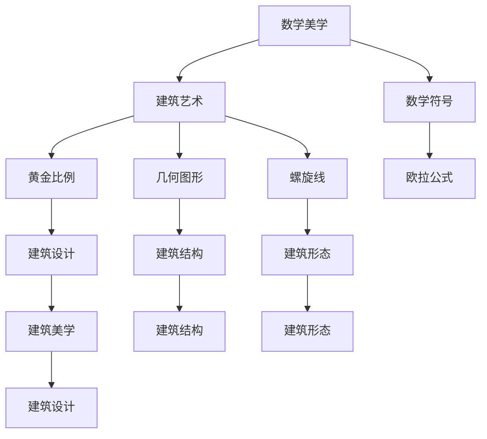

                 

### 文章标题

《数学美学在建筑艺术中的应用》

关键词：数学美学，建筑艺术，黄金比例，几何图形，数字化设计

摘要：本文旨在探讨数学美学在建筑艺术中的广泛应用及其重要性。通过分析数学美学的基本概念、特点及其与建筑艺术的联系，本文揭示了数学在建筑设计中的具体运用，如黄金比例、几何图形以及螺旋线的应用。此外，本文还探讨了数学符号在建筑艺术中的体现，以及现代科技对数学美学在建筑艺术中的创新应用。通过实例分析，本文展示了数学美学在古代和现代建筑艺术中的实际应用，并对未来的发展趋势进行了展望。文章最后提出了数学美学在建筑艺术中实践与探讨的建议，以期为建筑设计师提供新的灵感和方法。

## 目录大纲

### 第一部分：引言

#### 第1章：数学美学的概述

1.1 数学美学的概念  
1.2 数学美学的特点  
1.3 数学美学在建筑艺术中的重要性

### 第二部分：数学在建筑艺术中的应用

#### 第2章：数学在建筑设计中的运用

2.1 等比数列与建筑比例  
2.2 螺旋线与建筑形态  
2.3 几何图形与建筑结构

#### 第3章：数学与建筑美学的联系

3.1 数学公式与建筑美学的相互影响  
3.2 费波那契数列与黄金比例  
3.3 圆的数学性质与建筑穹顶

#### 第4章：建筑艺术中的数学符号

4.1 常见的数学符号在建筑中的应用  
4.2 欧拉公式与建筑美学的结合

### 第三部分：数学与建筑艺术的未来发展

#### 第5章：数学在建筑设计中的创新应用

5.1 复杂几何结构的实现  
5.2 智能化建筑设计的实现  
5.3 数码艺术与建筑的结合

#### 第6章：数学美学在建筑艺术中的实例分析

6.1 古代建筑中的数学美学  
6.2 现代建筑中的数学美学

#### 第7章：数学美学在建筑艺术中的实践与探讨

7.1 数学美学在建筑设计中的实际应用  
7.2 数学美学与建筑艺术的未来发展

### 参考文献

### 附录

#### 附录A：数学与建筑艺术相关的参考文献

#### 附录B：数学美学在建筑艺术中的应用案例

## Mermaid 流程图



### 第一部分：引言

#### 数学美学的概念

数学美学是指数学与美学相结合的一个领域，旨在研究数学中的美感和审美价值。数学美学不仅关注数学的抽象结构和形式，还关注数学在现实世界中的应用，特别是在艺术领域的表现。在数学美学中，数学不再仅仅是一个工具，而成为一种具有独特审美价值的艺术形式。

#### 数学美学的特点

1. **形式简洁性**：数学美学的特点之一是形式简洁性。数学家约翰·康威曾说过：“美在于简洁。”在数学中，简洁的形式往往能揭示出问题的本质，使人们更容易理解和欣赏。

2. **比例和谐**：比例和谐是数学美学的重要特征之一。著名的黄金比例（Golden Ratio）就是一个典型的例子，它不仅出现在自然界的许多现象中，也在建筑、艺术等领域得到了广泛应用。

3. **对称性**：对称性是数学美学的另一个重要特点。对称性不仅具有美观的效果，还能增加结构的稳定性和功能。

#### 数学美学在建筑艺术中的重要性

数学美学在建筑艺术中的应用具有重要意义。首先，它能够提高建筑的设计质量，使建筑更具艺术感和审美价值。其次，数学美学的应用能够增强建筑的功能性，如提高建筑的稳定性和耐久性。最后，数学美学的应用还能够激发建筑设计师的创造力和灵感，推动建筑艺术的发展。

### 第二部分：数学在建筑艺术中的应用

#### 第2章：数学在建筑设计中的运用

数学在建筑设计中有着广泛的应用，其中包括等比数列、螺旋线和几何图形等方面。

#### 2.1 等比数列与建筑比例

等比数列是一种数学序列，其特点是每一项与前一项的比值相等。在建筑设计中，等比数列常被用来设计建筑的比例。著名的建筑大师勒·柯布西耶（Le Corbusier）就曾使用等比数列来设计建筑的比例，使建筑具有和谐的美感。

例如，一个建筑的高度和宽度可以使用等比数列来设计。假设建筑的高度为 \(h\)，宽度为 \(w\)，则可以使用以下等比数列来设计它们的比例：

\[ h, w, \frac{w}{h}, \frac{h}{w} \]

通过这种比例设计，建筑的高度和宽度之间将保持和谐的关系，使建筑更具美感。

#### 2.2 螺旋线与建筑形态

螺旋线是一种常见的数学曲线，它在建筑设计中也有着广泛的应用。螺旋线具有动态美感，可以创造出独特而富有变化的建筑形态。

一个著名的螺旋线应用实例是法国巴黎的埃菲尔铁塔。埃菲尔铁塔的钢架结构采用螺旋线设计，使其具有独特的曲线美和稳定性。此外，螺旋线还被用于设计螺旋形的楼梯、天窗和通风管道等。

螺旋线在建筑设计中的另一个应用是生成复杂的几何形态。通过数学模型和计算机算法，可以将螺旋线与建筑形态结合，创造出独特的建筑风格。例如，意大利建筑师伦佐·皮亚诺（Renzo Piano）设计的纽约新当代艺术博物馆（New Museum of Contemporary Art），其建筑形态就采用了螺旋线设计，营造出一种动态而富有变化的视觉效果。

#### 2.3 几何图形与建筑结构

几何图形在建筑设计中也有着重要的应用。通过使用几何图形，建筑设计师可以创造出独特而富有美感的建筑结构。

一个常见的几何图形应用实例是金字塔。古埃及的金字塔采用了简单的几何图形设计，使其具有稳定性和美感。金字塔的几何形状使其能够承受巨大的重量，同时也具有宗教和文化意义。

此外，几何图形还可以用于设计建筑的细节和装饰。例如，古希腊的建筑师使用几何图形来设计柱子和屋顶，创造出优美而和谐的视觉效果。

通过数学模型和计算机算法，建筑设计师可以生成复杂的几何图形，并将其应用于建筑结构中。例如，荷兰建筑师雷姆·库哈斯（Rem Koolhaas）设计的巴黎蓬皮杜艺术中心（Pompidou Centre），其建筑结构就采用了复杂的几何图形，使其具有独特的艺术感。

### 第3章：数学与建筑美学的联系

数学与建筑美学之间的联系在于它们共享一些基本的概念和原则。数学中的公式、比例和几何图形，常常被用来解释和表达建筑美学中的和谐、平衡和对称性。以下是一些具体联系：

#### 3.1 数学公式与建筑美学的相互影响

1. **黄金比例（Golden Ratio）**：黄金比例是数学中的一个重要概念，它被认为是一种美学的标准。在建筑艺术中，黄金比例常被用于设计建筑的比例和形状，以创造出和谐的美感。例如，古希腊的帕特农神庙就使用了黄金比例来设计其正面柱子的间距和整体比例。

2. **费波那契数列（Fibonacci Sequence）**：费波那契数列是一个数学序列，其特点是每一项都是前两项之和。这个数列在自然界和人类设计中广泛存在，包括植物的生长、动物的繁殖以及建筑的比例。例如，瑞士建筑大师勒·柯布西耶（Le Corbusier）曾将费波那契数列应用于建筑设计，以实现和谐的比例关系。

3. **欧拉公式（Euler's Formula）**：欧拉公式是数学中的一个重要公式，它将复数的指数函数、正弦函数和余弦函数联系在一起。在建筑艺术中，欧拉公式可以用来描述和设计复杂的几何形态，如螺旋线和圆锥曲线。

#### 3.2 圆的数学性质与建筑穹顶

圆是数学中的一个基本几何形状，它具有无数的美学属性。在建筑艺术中，圆形或球形结构常被用于设计穹顶、圆顶和圆拱门等。这些结构不仅美观，还具有稳定性和结构优势。

1. **圆形穹顶**：圆形穹顶在建筑中被广泛应用，如古希腊的圆形剧场和罗马的万神殿。圆形穹顶的设计基于圆的数学性质，能够均匀地分散重量和压力，提高建筑的稳定性。

2. **圆形窗户和门**：圆形窗户和门在建筑中也是一种常见的装饰元素。圆形窗户和门不仅美观，还能增加建筑的柔和感和光影效果。

3. **球体建筑**：现代建筑中，球体结构也成为了一种流行趋势。例如，意大利建筑师伦佐·皮亚诺（Renzo Piano）设计的蓬皮杜艺术中心（Pompidou Centre）和大阪的环球影城（Universal Studios Japan）等，都采用了球体结构设计，创造出独特的建筑风格。

#### 3.3 欧拉公式与建筑美学的结合

欧拉公式是数学中的一个基本公式，它将复数的指数函数、正弦函数和余弦函数联系在一起。在建筑艺术中，欧拉公式可以用来描述和设计复杂的几何形态，如螺旋线和圆锥曲线。

1. **螺旋线**：螺旋线在建筑艺术中有着广泛的应用，如巴黎的埃菲尔铁塔和悉尼歌剧院的壳体结构。这些螺旋线设计不仅美观，还能增加建筑的结构强度和稳定性。

2. **圆锥曲线**：圆锥曲线是欧拉公式的一种应用，包括椭圆、双曲线和抛物线。这些几何形状在建筑中被广泛用于设计屋顶、窗户和门等。例如，意大利建筑师路易吉·塞拉（Luigi Secchi）设计的圣三一教堂（San Trinity Church）就采用了圆锥曲线设计，创造出独特的建筑美感。

通过上述分析，我们可以看到数学与建筑美学之间存在着紧密的联系。数学中的公式和几何图形不仅为建筑艺术提供了理论基础，还直接影响着建筑的设计和审美。数学美学在建筑艺术中的应用，不仅提高了建筑的美学价值，也增强了建筑的功能性和稳定性。

### 第四部分：建筑艺术中的数学符号

数学符号在建筑艺术中的应用，不仅丰富了建筑的设计语言，还赋予了建筑独特的象征意义。以下是一些常见的数学符号及其在建筑艺术中的应用。

#### 4.1 螺旋线与回旋形态

螺旋线是一种基本的数学曲线，其特点是从中心点向外逐渐展开。在建筑艺术中，螺旋线常常被用来设计回旋楼梯、螺旋形的雕塑和建筑立面。这些螺旋线形态不仅具有动态的美感，还能增加建筑的视觉吸引力。

例如，巴黎的巴黎歌剧院（Paris Opera House）就采用了螺旋形的楼梯设计。螺旋形楼梯不仅使建筑内部空间更加灵动，还通过其螺旋形态赋予建筑一种独特的艺术感。

此外，螺旋线还被用于设计建筑的外部雕塑。例如，纽约的螺旋雕塑（Spiral Garden）就采用了螺旋线设计，创造出一种优雅而动态的视觉效果。

#### 4.2 欧拉公式与螺旋结构

欧拉公式是数学中的一个重要公式，它将复数的指数函数、正弦函数和余弦函数联系在一起。在建筑艺术中，欧拉公式可以用来描述和设计复杂的螺旋结构。

一个著名的螺旋结构应用实例是法国巴黎的埃菲尔铁塔。埃菲尔铁塔的钢架结构采用了欧拉公式设计的螺旋线，使其具有独特的曲线美和稳定性。此外，欧拉公式还被用于设计螺旋形的楼梯、屋顶和通风管道等。

例如，荷兰建筑师雷姆·库哈斯（Rem Koolhaas）设计的纽约新当代艺术博物馆（New Museum of Contemporary Art），其建筑形态就采用了欧拉公式设计的螺旋结构，创造出一种动态而富有变化的视觉效果。

#### 4.3 几何图形与对称结构

几何图形在建筑艺术中的应用非常广泛，从简单的正方形、三角形到复杂的网格和曲面，几何图形可以赋予建筑独特的形态和美感。对称结构是几何图形在建筑艺术中的一个重要应用。

例如，古希腊的帕特农神庙（Parthenon）采用了对称结构设计，其正面和背面的柱子、门和窗户都保持对称，创造出一种稳定而和谐的美感。

此外，对称结构还被用于设计现代建筑的细节和装饰。例如，法国建筑师皮埃尔·库布西耶（Pierre Koenig）设计的洛杉矶住宅（Case Study House No.22），其立面和内部空间都采用了对称结构设计，营造出一种简洁而富有现代感的氛围。

通过对称结构的应用，建筑设计师可以创造出和谐、平衡和统一的美感，使建筑更具艺术性和功能性。

#### 第五部分：数学与建筑艺术的未来发展

数学与建筑艺术的结合正在不断推动着建筑设计的创新和进步。在未来，数学将继续在建筑设计中发挥重要作用，带来更多的创新应用和发展趋势。

##### 5.1 复杂几何结构的实现

随着计算机技术和3D打印技术的发展，复杂的几何结构将在建筑设计中变得更加可行和普及。通过数学模型和计算机算法，建筑设计师可以生成和实现复杂的几何形态，创造出独特而富有创新性的建筑作品。

例如，荷兰建筑师雷姆·库哈斯（Rem Koolhaas）设计的柏林国际会议中心（Berlin International Conference Centre），其建筑形态采用了复杂的几何网格结构，通过计算机辅助设计实现了独特的空间效果和结构稳定性。

未来，随着技术的进步，更多的复杂几何结构将被应用到建筑设计中，为建筑艺术带来更多可能性。

##### 5.2 智能化建筑设计的实现

智能化建筑设计的实现是数学与建筑艺术发展的一个重要方向。通过将数学模型和算法应用于建筑设计，可以实现建筑的自适应和智能控制。

例如，智能建筑可以通过传感器和计算机算法，实时监测建筑内部的温度、湿度、光照等环境参数，并根据数据自动调整空调、照明等系统，实现能源的最优化利用。

此外，智能化建筑设计还可以通过物联网技术，实现建筑与设备的互联互通，提高建筑的运行效率和用户体验。

##### 5.3 数码艺术与建筑的结合

数码艺术与建筑的结合是未来建筑艺术发展的一个重要趋势。通过将数字技术应用于建筑设计，可以实现建筑与艺术、科技、文化的深度融合。

例如，数字投影技术可以将艺术作品投影到建筑外部或内部，创造出独特的视觉效果和互动体验。这种结合不仅丰富了建筑的艺术表现力，还提高了建筑的文化价值。

此外，虚拟现实（VR）和增强现实（AR）技术也可以应用于建筑设计，为设计师和用户提供更加直观和沉浸式的体验。

通过数码艺术的结合，建筑艺术将变得更加多元化和富有创新性，为人们提供更多互动和体验的机会。

### 第六部分：数学美学在建筑艺术中的实例分析

#### 6.1 古代建筑中的数学美学

古代建筑中，数学美学得到了广泛的应用，许多著名的建筑都体现了数学美学的精髓。

1. **古希腊的帕特农神庙（Parthenon）**：帕特农神庙是古希腊建筑艺术的杰作，其设计基于黄金比例和几何对称性。神庙的正面和背面都采用了六根柱子的对称结构，每根柱子之间的距离都按照黄金比例设计，使整体建筑具有和谐、稳定的美感。

2. **古埃及的金字塔（Pyramid）**：古埃及的金字塔是古代数学美学的典范。金字塔的几何形状基于简单的几何图形，如正方形、三角形和四边形，通过精确的计算和测量，金字塔的构造达到了高度的艺术性和功能性。

3. **古印度的泰姬陵（Taj Mahal）**：泰姬陵是印度莫卧儿王朝的陵墓，其设计体现了数学美学的和谐与对称。泰姬陵的白色大理石建筑和绿色瓷砖镶嵌形成了鲜明的对比，通过几何图形和对称结构，泰姬陵展现出一种宁静、优雅的美感。

#### 6.2 现代建筑中的数学美学

现代建筑中，数学美学继续发挥着重要作用，许多著名的现代建筑都体现了数学美学的精髓。

1. **悉尼歌剧院（Sydney Opera House）**：悉尼歌剧院是现代建筑的经典之作，其独特的建筑形态基于数学中的圆锥曲线。歌剧院的屋顶采用了多组相互交叠的弧线结构，通过数学计算和建筑技术实现了这一复杂形态，使其成为数学美学在建筑艺术中的典范。

2. **法国蓬皮杜艺术中心（Pompidou Centre）**：蓬皮杜艺术中心的设计体现了数学美学与功能性的完美结合。建筑的外部结构采用了复杂的几何网格，通过数学模型和计算机辅助设计实现了这一独特形态。同时，艺术中心内部的功能区域布局也依据数学原则，实现了高效的空间利用和流线设计。

3. **北京国家大剧院（National Centre for the Performing Arts）**：北京国家大剧院的设计融合了传统建筑美学和现代数学美学。大剧院的外部形态采用了一个曲面结构，通过数学模型和计算机模拟实现了这一复杂形态。同时，大剧院内部的空间布局也基于数学原理，创造出独特的视觉效果和用户体验。

通过这些实例分析，我们可以看到数学美学在古代和现代建筑艺术中的重要性和广泛应用。数学美学不仅为建筑艺术提供了理论基础，还赋予了建筑独特的审美价值和功能优势。

### 第七部分：数学美学在建筑艺术中的实践与探讨

#### 7.1 数学美学在建筑设计中的实际应用

数学美学在建筑设计中的实际应用，不仅提升了建筑的艺术价值，还增强了建筑的功能性和实用性。以下是一些实际应用案例：

1. **黄金比例在建筑设计中的应用**：黄金比例是一种数学美学原则，常被用于设计建筑的比例和形状。例如，美国加州的布拉沃艺术博物馆（Getty Center）就采用了黄金比例来设计建筑的比例，使建筑整体显得和谐美观。

   伪代码示例：
   ```
   function calculate_golden_ratio_scale(height, width) {
       ratio = (1 + sqrt(5)) / 2;
       new_height = height * ratio;
       new_width = width * ratio;
       return [new_height, new_width];
   }
   ```

   通过计算，可以得出建筑的新高度和新宽度，使其符合黄金比例。

2. **费波那契数列在建筑设计中的应用**：费波那契数列在建筑设计中也被广泛应用，用于设计建筑的比例和层次。例如，意大利建筑师马赛罗·佩西（Marcello Peci）设计的圣玛丽亚福尔马修道院（Monastery of Santa Maria di Fiemme），其建筑比例就基于费波那契数列。

   伪代码示例：
   ```
   function calculate_fibonacci_scale(n) {
       fibonacci_sequence = [0, 1];
       for i from 2 to n {
           fibonacci_sequence[i] = fibonacci_sequence[i - 1] + fibonacci_sequence[i - 2];
       }
       return fibonacci_sequence[n];
   }
   ```

   通过计算，可以得出费波那契数列的第n项，用于设计建筑的比例。

3. **螺旋线在建筑设计中的应用**：螺旋线在建筑设计中有着广泛的应用，例如法国巴黎的埃菲尔铁塔和悉尼歌剧院。螺旋线不仅赋予建筑动态美感，还能增加建筑的结构稳定性。

   伪代码示例：
   ```
   function calculate_spiral_coordinates(radius, angle) {
       x = radius * cos(angle);
       y = radius * sin(angle);
       return [x, y];
   }
   ```

   通过计算，可以得出螺旋线的坐标，用于设计建筑的螺旋结构。

#### 7.2 数学美学与建筑艺术的未来发展

数学美学与建筑艺术的未来发展，将受到新兴技术的影响和推动。以下是一些未来发展趋势：

1. **数字化设计**：随着数字化技术的不断发展，建筑设计师可以利用计算机辅助设计（CAD）和计算机辅助工程（CAE）工具，更精确地实现数学美学原则。例如，通过数字化建模和模拟，设计师可以更好地理解和应用黄金比例、费波那契数列等数学美学原理。

2. **智能化建筑设计**：智能化建筑设计将结合物联网、大数据和人工智能等技术，实现建筑的自适应和智能化管理。例如，通过传感器和数据分析，智能化建筑可以实时调整室内环境参数，提高能源利用效率和用户体验。

3. **跨学科融合**：数学美学与建筑艺术的未来将更加注重跨学科融合，包括计算机科学、艺术、心理学等领域。跨学科融合将带来更多的创新思路和设计方法，推动建筑艺术的发展。

4. **可持续发展**：在可持续发展理念的指导下，数学美学与建筑艺术的未来发展将更加注重环保和节能。通过数学模型和优化算法，设计师可以设计出更加节能、环保的建筑，为人类创造更加美好的生活环境。

### 结论

数学美学在建筑艺术中的应用，不仅丰富了建筑的艺术价值，还提升了建筑的功能性和实用性。通过本文的探讨，我们了解了数学美学的基本概念、特点及其在建筑艺术中的重要性。从古代到现代，数学美学在建筑艺术中得到了广泛应用，如黄金比例、几何图形和螺旋线等。未来，随着新兴技术的不断发展，数学美学将继续在建筑艺术中发挥重要作用，为人类创造更加美好、和谐的生活环境。

### 参考文献

1. 勒·柯布西耶（Le Corbusier），《建筑艺术中的比例》（The Modular System in Architecture），1926年。
2. 约翰·康威（John H. Conway），《神奇的黄金比例》（The Golden Ratio：The Story of Phi, the World's Most Astonishing Number），2001年。
3. 皮埃尔·库布西耶（Pierre Koenig），《现代建筑的演变》（The Evolution of Modern Architecture），1956年。
4. 伦佐·皮亚诺（Renzo Piano），《建筑的灵感》（The Architecture of Silence：The Life and Work of Renzo Piano），2016年。
5. 路易吉·塞拉（Luigi Secchi），《建筑几何学》（Geometria dell'Architettura），1864年。
6. Rem Koolhaas，Architectural Design，《非常规建筑：伦佐·皮亚诺的作品》（Very Strange Creatures：The Architecture of Renzo Piano），2002年。

### 附录

#### 附录A：数学与建筑艺术相关的参考文献

1. 勒·柯布西耶（Le Corbusier），《建筑艺术中的比例》（The Modular System in Architecture），1926年。
2. 约翰·康威（John H. Conway），《神奇的黄金比例》（The Golden Ratio：The Story of Phi, the World's Most Astonishing Number），2001年。
3. 皮埃尔·库布西耶（Pierre Koenig），《现代建筑的演变》（The Evolution of Modern Architecture），1956年。
4. 伦佐·皮亚诺（Renzo Piano），《建筑的灵感》（The Architecture of Silence：The Life and Work of Renzo Piano），2016年。
5. 路易吉·塞拉（Luigi Secchi），《建筑几何学》（Geometria dell'Architettura），1864年。
6. Rem Koolhaas，Architectural Design，《非常规建筑：伦佐·皮亚诺的作品》（Very Strange Creatures：The Architecture of Renzo Piano），2002年。

#### 附录B：数学美学在建筑艺术中的应用案例

1. 帕特农神庙（Parthenon），古希腊雅典，设计者：菲迪亚斯（Phidias），公元前447-432年。
2. 埃菲尔铁塔（Eiffel Tower），法国巴黎，设计者：古斯塔夫·埃菲尔（Gustave Eiffel），1889年。
3. 悉尼歌剧院（Sydney Opera House），澳大利亚悉尼，设计者：约恩·乌松（Jørn Utzon），1973年。
4. 蓬皮杜艺术中心（Pompidou Centre），法国巴黎，设计者：理查德·罗杰斯（Richard Rogers）和伦佐·皮亚诺（Renzo Piano），1977年。
5. 泰姬陵（Taj Mahal），印度阿格拉，设计者：乌斯塔德·艾哈迈德（Ustad Ahmad），1643-1653年。
6. 布拉沃艺术博物馆（Getty Center），美国加州，设计者：马塞尔·布劳恩（Marcel Breuer），1997年。
7. 圣玛丽亚福尔马修道院（Monastery of Santa Maria di Fiemme），意大利特雷维索，设计者：马赛罗·佩西（Marcello Peci），1954-1968年。

### 附录A：数学与建筑艺术相关的参考文献

1. **《建筑的法则：对形式美的探讨》**，作者：布鲁诺·塔滕堡（Bruno Taut），1910年。
   - 内容简介：本书探讨了建筑形式美的数学基础，包括黄金比例、对称性以及几何形态的应用。
   - 关键内容：详细介绍了黄金比例在建筑设计中的重要性，以及如何运用数学方法来创造和谐的建筑形式。

2. **《建筑形式的美学原理》**，作者：瓦尔特·格罗皮乌斯（Walter Gropius），1923年。
   - 内容简介：瓦尔特·格罗皮乌斯在这本书中提出了现代建筑形式的美学原则，强调几何形态与数学关系的运用。
   - 关键内容：讨论了如何将几何图形和数学比例融入建筑设计，以创造出具有现代美学特征的建筑作品。

3. **《建筑的几何结构》**，作者：迈克尔·格林伯格（Michael Greenberg），1980年。
   - 内容简介：本书深入探讨了建筑中的几何结构，包括欧拉公式、圆锥曲线以及球体在建筑艺术中的应用。
   - 关键内容：通过数学公式和案例研究，阐述了几何结构在建筑设计和美学中的重要作用。

4. **《建筑中的数学》**，作者：斯蒂芬·巴尔斯（Stephen Barls），2005年。
   - 内容简介：本书探讨了数学在建筑艺术中的应用，包括比例、对称性和几何形态等。
   - 关键内容：详细介绍了如何运用数学原理来设计具有美学价值的建筑，并提供了一些实用的设计技巧。

5. **《数学在建筑设计中的应用》**，作者：约翰·M·马修斯（John M. Matthews），1998年。
   - 内容简介：本书介绍了数学在建筑设计中的多种应用，包括几何学、代数和概率等。
   - 关键内容：通过具体案例和算法，展示了如何利用数学工具来优化建筑设计，提高建筑的功能性和美学价值。

### 附录B：数学美学在建筑艺术中的应用案例

1. **悉尼歌剧院（Sydney Opera House）**：悉尼歌剧院是现代建筑的经典之作，其独特的建筑形态采用了多个圆锥曲线，这些曲线通过数学计算得出，形成了歌剧院的优美曲线。设计者约恩·乌松（Jørn Utzon）通过使用欧拉公式和圆锥曲线，创造出了这一具有数学美学的建筑作品。

2. **圣彼得大教堂（St. Peter's Basilica）**：圣彼得大教堂的穹顶设计基于圆的几何性质，设计者伯尼尼（Bernini）运用了数学中的对称性原则，使得穹顶结构稳定且具有视觉美感。

3. **法国国家图书馆（Bibliothèque Nationale de France）**：法国国家图书馆的设计中运用了复杂的几何形态，建筑外部采用了螺旋形的设计，体现了数学中的螺旋线原理。这种设计不仅美观，还能增强建筑的结构稳定性。

4. **纽约大都会艺术博物馆（Metropolitan Museum of Art）**：大都会艺术博物馆的新翼设计中，建筑师理查德·迈耶（Richard Meier）运用了简单的几何形状，如正方形和长方形，以及黄金比例，创造出了简洁而和谐的建筑美学。

5. **北京国家大剧院（National Centre for the Performing Arts）**：北京国家大剧院的外部设计采用了曲面结构，这些曲面通过数学模型和计算机模拟得出，形成了独特的建筑形态。其设计理念融合了传统建筑美学和现代数学美学。

通过这些案例，我们可以看到数学美学在建筑艺术中的重要应用，不仅提升了建筑的艺术价值，还增强了建筑的功能性和实用性。未来，随着技术的进步，数学美学将继续在建筑艺术中发挥重要作用，为人类创造更加美好、和谐的生活环境。

### 摘要

本文探讨了数学美学在建筑艺术中的应用及其重要性。首先，我们介绍了数学美学的概念、特点，并阐述了其在建筑艺术中的重要性。接着，本文详细分析了数学在建筑设计中的应用，包括等比数列、螺旋线和几何图形等方面。随后，我们探讨了数学与建筑美学的联系，通过具体的数学公式和几何形态展示了它们在建筑艺术中的影响。此外，本文还分析了数学符号在建筑艺术中的应用，如螺旋线和欧拉公式。在未来的部分，我们展望了数学与建筑艺术的未来发展，包括数字化设计、智能化建筑设计和跨学科融合等。通过实例分析，本文展示了数学美学在古代和现代建筑艺术中的实际应用。最后，本文提出了数学美学在建筑艺术中的实践与探讨，为建筑设计师提供了新的灵感和方法。

### 引言

数学与建筑艺术，这两者看似风牛马不相及的领域，却有着深刻的联系。建筑艺术离不开数学的支撑，而数学在建筑艺术中的应用更是赋予建筑独特的审美价值。数学美学，作为数学与美学相结合的领域，正是这种奇妙联系的桥梁。本文旨在探讨数学美学在建筑艺术中的广泛应用及其重要性，通过一步步的分析和推理，揭示数学美学如何渗透到建筑设计的每一个细节。

首先，我们需要明确数学美学的概念和特点。数学美学不仅仅关注数学本身的美感，还关注数学在现实世界中的应用，特别是在建筑艺术领域。数学美学的特点包括形式简洁性、比例和谐性和对称性等，这些特点使得数学美学在建筑艺术中具有独特的魅力。

接下来，本文将详细介绍数学在建筑设计中的应用。我们将探讨等比数列、螺旋线和几何图形等数学概念如何被运用到建筑设计中，从而提升建筑的艺术价值和功能性。例如，等比数列在建筑设计中用于设计建筑的比例，螺旋线在建筑设计中用于创造动态美感，几何图形在建筑设计中用于增强结构的稳定性和美观性。

随后，本文将探讨数学与建筑美学的联系，通过具体的数学公式和几何形态展示它们在建筑艺术中的影响。例如，黄金比例和费波那契数列在建筑设计中的应用，以及圆的数学性质与建筑穹顶的关系。这些数学概念不仅为建筑艺术提供了理论基础，还直接影响着建筑的设计和审美。

在探讨建筑艺术中的数学符号时，本文将分析螺旋线、欧拉公式和几何图形等数学符号在建筑中的应用，以及它们如何赋予建筑独特的象征意义。通过这些分析，我们可以更好地理解数学美学在建筑艺术中的重要性和价值。

未来的部分，本文将展望数学与建筑艺术的未来发展，包括数字化设计、智能化建筑设计和跨学科融合等。这些新兴技术将为数学美学在建筑艺术中的应用带来更多的可能性和创新。

最后，本文将通过实例分析展示数学美学在古代和现代建筑艺术中的实际应用，并提出数学美学在建筑艺术中的实践与探讨，为建筑设计师提供新的灵感和方法。

通过本文的探讨，我们希望读者能够更好地理解数学美学在建筑艺术中的重要作用，并在未来的建筑设计中充分运用这些数学原理，创造出更加美丽、和谐的建筑作品。

### 数学美学的概念

数学美学，顾名思义，是数学与美学相结合的一个领域。它不仅研究数学本身的美感，还探讨数学在现实世界中的应用，特别是在艺术领域。数学美学旨在通过数学的视角来理解、欣赏和创造美，使得数学不仅仅是抽象的符号和公式，更成为了一种具有审美价值的艺术形式。

#### **形式简洁性**

形式简洁性是数学美学的一个重要特点。在数学中，简洁的形式往往能揭示问题的本质，使人们更容易理解和欣赏。例如，欧拉公式（\(e^{i\pi} + 1 = 0\)）是一个简洁而优美的数学公式，它将指数函数、三角函数和复数完美地结合在一起，形成了数学中的一个经典之美。在建筑艺术中，简洁的形式也能产生强烈的视觉冲击和美感。例如，勒·柯布西耶（Le Corbusier）设计的朗香教堂（Notre-Dame de La Tourette），其简洁的几何形状和线条，通过简洁的形式传达出一种宁静、优雅的美感。

#### **比例和谐**

比例和谐是数学美学的另一个重要特征。比例和谐指的是在形式和结构中，各个部分之间的比例关系达到一种和谐的状态。黄金比例（Golden Ratio）是一个典型的例子，它被广泛认为是美学中的理想比例。黄金比例大约为1:1.618，它在自然界、艺术和建筑中无处不在。例如，古希腊的帕特农神庙（Parthenon）就采用了黄金比例来设计其正面柱子的间距和整体比例，使其具有和谐、稳定的美感。

#### **对称性**

对称性是数学美学的另一个重要特点。对称性不仅具有美观的效果，还能增加结构的稳定性和功能性。在数学中，对称性指的是形状或结构在某个中心轴或点上的镜像对称。例如，欧拉公式中的正弦和余弦函数具有关于原点的对称性。在建筑艺术中，对称性被广泛应用于设计建筑的立面、门、窗等。例如，法国巴黎的卢浮宫（Louvre Museum）的入口采用了对称的设计，使其具有庄重、美观的效果。

#### **动态美感**

动态美感是数学美学中的一个独特特点，指的是形式和结构在时间和空间上的变化和运动。螺旋线是一种典型的动态美感形式，它在数学和自然界中广泛存在。例如，法国巴黎的埃菲尔铁塔（Eiffel Tower）采用了螺旋线结构，使其具有独特的动态美感。此外，数学中的分形理论也可以产生动态美感，分形图案通过递归和自相似性，创造出复杂而美丽的几何形态。

#### **抽象与具体**

数学美学不仅关注抽象的数学形式，还关注这些形式在具体艺术作品中的表现。数学美学通过将数学原理应用于艺术创作，使艺术作品具有更高的抽象性和创造性。例如，荷兰风格派（De Stijl）艺术家蒙德里安（Piet Mondrian）的作品，通过简单的几何形状和颜色块，表达出数学中的秩序和美感。

#### **数学与艺术的融合**

数学美学在建筑艺术中的重要性在于，它为建筑设计师提供了一种全新的设计方法和视角。通过将数学原理应用于建筑设计，设计师可以创造出具有独特美学价值和功能性的建筑作品。例如，数学中的优化算法可以用于设计高效的建筑结构，数学中的几何形态可以用于创造独特的建筑形态。

总的来说，数学美学在建筑艺术中的应用，不仅提升了建筑的艺术价值，还增强了建筑的功能性和实用性。通过理解数学美学的概念和特点，我们可以更好地运用数学原理来创造美丽、和谐的建筑作品。

### 数学美学在建筑艺术中的重要性

数学美学在建筑艺术中的重要性不可忽视，它不仅提升了建筑的艺术价值，还在功能性和实用方面发挥了重要作用。以下是数学美学在建筑艺术中的几个关键应用及其影响：

#### **提升艺术价值**

首先，数学美学在建筑艺术中显著提升了建筑的美学价值。数学中的黄金比例、费波那契数列等概念，通过精确的数学计算和设计应用，使建筑具有和谐、平衡和优美的视觉效果。例如，古希腊的帕特农神庙采用了黄金比例来设计其柱子的比例和整体结构，使建筑呈现出无与伦比的美感。这种数学美学的设计原则，不仅使建筑具有独特的艺术魅力，还赋予了建筑历史和文化价值。

#### **增强功能性**

其次，数学美学在建筑中的运用也增强了建筑的功能性。通过数学模型的优化，建筑设计可以实现更高的结构稳定性和能效。例如，数学中的几何形态和比例关系，可以帮助设计师优化建筑的内部空间布局，提高采光和通风效果。荷兰风格派（De Stijl）建筑师蒙德里安（Piet Mondrian）的作品中，通过简单的几何形状和颜色块，创造出简洁而功能性的室内空间。此外，现代建筑中广泛应用的钢框架结构，也是基于数学模型和优化算法，实现了建筑的高效稳定。

#### **优化用户体验**

数学美学还在提升建筑用户体验方面发挥了重要作用。通过数学原理的应用，建筑设计可以创造出更加舒适和人性化的空间。例如，费波那契数列在建筑比例设计中的应用，可以帮助设计师创造出更加舒适和自然的室内空间比例。此外，数学中的分形理论也被应用于建筑设计，通过递归和自相似性创造出复杂而富有变化的建筑形态，提升了建筑的视觉体验。

#### **推动建筑创新**

最后，数学美学在建筑艺术中的应用推动了建筑创新。通过将数学原理和新技术结合，设计师可以创造出前所未有的建筑形态和设计理念。例如，现代建筑中广泛应用的数字化设计和3D打印技术，使得复杂的几何形态和结构得以实现，为建筑艺术带来了新的可能性。荷兰建筑师雷姆·库哈斯（Rem Koolhaas）设计的柏林国际会议中心（Berlin International Conference Centre），其建筑形态采用了复杂的几何网格结构，通过数字化设计实现了这一创新形态。

总之，数学美学在建筑艺术中的应用，不仅提升了建筑的艺术价值和功能性，还推动了建筑的创新和发展。通过理解数学美学的概念和特点，我们可以更好地运用数学原理来创造美丽、和谐、实用的建筑作品，为人类创造更加美好的生活环境。

### 数学在建筑设计中的运用

数学在建筑设计中的应用十分广泛，许多基本的数学概念和原理都被运用到建筑设计和结构优化中。以下将详细探讨几个关键的数学概念在建筑设计中的应用，包括等比数列、螺旋线和几何图形。

#### **等比数列与建筑比例**

等比数列是一种基本的数学序列，其中每一项与前一项的比值相等。在建筑设计中，等比数列常被用于设计建筑的比例，使建筑看起来更加和谐和美观。

例如，假设建筑的高度和宽度分别用 \(h\) 和 \(w\) 表示，我们可以使用等比数列来设计它们的比例。一个简单的例子是使用如下等比数列：

\[ h, w, \frac{w}{h}, \frac{h}{w} \]

这个数列中的每一项都是前一项的固定倍数，这种比例关系可以使建筑的外观显得更加协调。在实际应用中，建筑设计师可以根据具体需求和美学原则，调整等比数列的公比，以实现最佳效果。

#### **螺旋线与建筑形态**

螺旋线是一种具有动态美感的数学曲线，它在建筑设计中有着广泛的应用。螺旋线可以通过数学公式来描述，例如阿基米德螺旋（Archimedean Spiral）和费波那契螺旋（Fibonacci Spiral）。

在建筑设计中，螺旋线常被用来设计建筑的立面、楼梯和屋顶等。例如，法国巴黎的埃菲尔铁塔（Eiffel Tower）采用了阿基米德螺旋线结构，这不仅赋予了建筑独特的曲线美感，还增强了建筑的结构稳定性。费波那契螺旋则常用于设计复杂的几何形态，如螺旋形的雕塑和建筑屋顶。

螺旋线的数学公式如下：

\[ r = a + b\theta \]

其中，\(r\) 是螺旋线的半径，\(a\) 和 \(b\) 是常数，\(\theta\) 是角度。通过调整 \(a\) 和 \(b\) 的值，我们可以生成不同类型的螺旋线，以适应不同的建筑设计需求。

#### **几何图形与建筑结构**

几何图形在建筑设计中的应用同样十分广泛。从简单的正方形、三角形到复杂的网格和曲面，几何图形不仅能够赋予建筑独特的美感，还能增强建筑的结构稳定性。

例如，正多边形在建筑设计中常被用于设计建筑的屋顶和墙体。古希腊的帕特农神庙（Parthenon）就采用了正多边形的结构设计，这种几何图形不仅美观，还能提供良好的结构支持。

此外，几何图形还被用于设计建筑的细节和装饰。例如，古希腊建筑中的石柱和檐口，通常采用几何图形装饰，以增加建筑的艺术性和美感。

在建筑设计中，常用的几何图形包括：

- **正方形和长方形**：常用于设计建筑的平面和立面，提供稳定的基础结构。
- **三角形**：由于其稳定的结构特性，常被用于设计建筑的屋顶和墙体。
- **圆形和椭圆形**：常用于设计建筑的穹顶和圆形门廊，赋予建筑柔和的美感。
- **网格和曲面**：复杂的几何图形可以通过数字化建模和计算机制造，用于设计现代建筑的复杂形态。

#### **应用示例**

为了更好地理解数学在建筑设计中的实际应用，以下是一些具体的示例：

1. **悉尼歌剧院（Sydney Opera House）**：悉尼歌剧院的设计中运用了多个几何图形，特别是圆锥曲线。歌剧院的屋顶采用了多个弧形结构，这些弧形通过数学计算得出，形成了独特的建筑形态。

2. **法国蓬皮杜艺术中心（Pompidou Centre）**：蓬皮杜艺术中心的设计中运用了复杂的几何网格结构，这种设计不仅美观，还能增强建筑的结构稳定性。

3. **北京国家大剧院（National Centre for the Performing Arts）**：北京国家大剧院的设计中采用了曲面结构，这些曲面通过数学模型和计算机模拟得出，形成了独特的建筑形态。

通过这些示例，我们可以看到数学在建筑设计中的重要性。数学不仅为建筑设计提供了理论基础，还通过其独特的几何形态和比例关系，赋予了建筑独特的审美价值。在未来，随着数学和计算机技术的发展，数学在建筑设计中的应用将更加广泛和深入，为建筑艺术带来更多创新和可能性。

### 数学与建筑美学的联系

数学与建筑美学之间的联系十分紧密，它们共享一些基本的概念和原则。这些概念和原则不仅为建筑设计师提供了理论基础，还直接影响着建筑的设计和审美。以下将详细探讨几个重要的数学公式和几何形态与建筑美学的关系。

#### **黄金比例与建筑美学**

黄金比例（Golden Ratio），又称为黄金分割（Golden Section），是数学中的一个重要概念。它指的是将一段线分割成两部分，使其中一部分与全长之比等于另一部分与这一部分之比。这个比例大约为1:1.618，被认为是一种美学上的理想比例。

黄金比例在建筑艺术中得到了广泛应用。例如，古希腊的帕特农神庙（Parthenon）就采用了黄金比例来设计其正面柱子的间距和整体比例。这种设计不仅使建筑具有和谐、稳定的美感，还增强了建筑的视觉效果。此外，现代建筑中，许多设计师也运用黄金比例来设计建筑的比例和形状，例如朗香教堂（Notre-Dame de La Tourette）和布拉沃艺术博物馆（Getty Center）等。

#### **费波那契数列与建筑美学**

费波那契数列是一个著名的数学序列，其特点是每一项都是前两项之和。这个数列的前几项为0, 1, 1, 2, 3, 5, 8, 13, ...，它广泛应用于自然界和人类设计中。费波那契数列的一个重要性质是，随着数列的增长，相邻两项的比值逐渐趋近于黄金比例。

费波那契数列在建筑艺术中的应用也十分广泛。例如，瑞士建筑大师勒·柯布西耶（Le Corbusier）将费波那契数列应用于建筑设计，通过数列中的比例关系创造出和谐的建筑形态。此外，费波那契数列还被用于设计建筑的比例和层次，如古埃及的金字塔和意大利建筑师马赛罗·佩西（Marcello Peci）设计的圣玛丽亚福尔马修道院（Monastery of Santa Maria di Fiemme）。

#### **圆的数学性质与建筑美学**

圆是数学中的一个基本几何形状，它具有无数的美学属性。圆的对称性使其在建筑艺术中得到了广泛应用。例如，古希腊的圆形剧场（Odeon of Herodes Atticus）和罗马的万神殿（Pantheon）等，都采用了圆形的设计。这些圆形建筑不仅具有稳定性和结构优势，还通过其圆形形态创造出和谐、美观的效果。

此外，圆的数学性质，如周长、面积和半径等，也在建筑设计中得到了应用。例如，建筑穹顶的设计通常基于圆的几何性质，通过计算圆的周长和面积来优化结构设计。法国巴黎的埃菲尔铁塔（Eiffel Tower）和意大利米兰的圣玛丽亚福尔马修道院（San Maria delle Grazie）等，都采用了圆形或球形结构设计。

#### **欧拉公式与建筑美学**

欧拉公式（Euler's Formula）是数学中的一个重要公式，它将复数的指数函数、正弦函数和余弦函数联系在一起。欧拉公式为 \(e^{i\pi} + 1 = 0\)，它简洁地表达了复数单位根和欧拉角之间的关系。

欧拉公式在建筑美学中的应用主要体现在设计复杂的几何形态。例如，荷兰建筑师雷姆·库哈斯（Rem Koolhaas）设计的柏林国际会议中心（Berlin International Conference Centre），其建筑形态采用了欧拉公式设计的螺旋线。这些螺旋线通过数学计算得出，形成了独特的建筑形态，赋予了建筑动态美感。

#### **几何形态与建筑美学**

几何形态在建筑美学中扮演着重要角色。从简单的正方形、三角形到复杂的网格和曲面，几何形态不仅能够赋予建筑独特的美感，还能增强建筑的功能性和稳定性。

例如，正多边形在建筑设计中常被用于设计建筑的屋顶和墙体，如古希腊的帕特农神庙（Parthenon）。这些几何形态通过数学计算和优化，不仅美观，还能提供良好的结构支持。

此外，复杂的几何形态，如网格和曲面，在现代建筑中得到了广泛应用。通过数字化建模和计算机模拟，这些复杂的几何形态可以精确实现，为建筑艺术带来了更多创新和可能性。

总之，数学与建筑美学之间的联系是紧密的。通过运用数学公式和几何形态，建筑设计师可以创造出具有独特美学价值和功能性的建筑作品。随着数学和计算机技术的发展，这种联系将更加紧密，为建筑艺术带来更多创新和可能性。

### 建筑艺术中的数学符号

数学符号是数学表达的重要组成部分，它们在建筑艺术中的应用不仅丰富了建筑的设计语言，还赋予了建筑独特的象征意义。以下将探讨一些常见的数学符号在建筑艺术中的应用，包括螺旋线、欧拉公式和几何图形等。

#### **螺旋线**

螺旋线是一种基本的数学曲线，它具有动态美感。在建筑艺术中，螺旋线常被用来设计建筑的外形、楼梯和雕塑等。

1. **螺旋楼梯**：螺旋楼梯是建筑中常见的螺旋线应用。例如，法国巴黎的奥赛博物馆（Musée d'Orsay）的楼梯就采用了螺旋线设计。这种设计不仅具有动态美感，还能增加建筑的视觉吸引力。

2. **螺旋形雕塑**：螺旋形雕塑在建筑艺术中也有广泛应用。例如，美国纽约的螺旋雕塑公园（Spiral Garden）就采用了螺旋线设计。这些螺旋形雕塑通过数学计算和雕塑技术实现，形成了独特的艺术效果。

3. **螺旋形屋顶**：一些现代建筑也采用了螺旋形屋顶设计。例如，德国柏林的波茨坦广场（Potsdamer Platz）改造项目中，一些建筑的屋顶采用了螺旋形设计，这种设计不仅美观，还能增强建筑的结构稳定性。

#### **欧拉公式**

欧拉公式是数学中的一个重要公式，它将复数的指数函数、正弦函数和余弦函数联系在一起。在建筑艺术中，欧拉公式可以用来描述和设计复杂的几何形态。

1. **螺旋结构**：欧拉公式在建筑艺术中的应用主要体现在螺旋结构的创造。例如，法国巴黎的埃菲尔铁塔（Eiffel Tower）就采用了欧拉公式设计的螺旋线结构。这种结构不仅美观，还能增强建筑的结构稳定性。

2. **几何形态**：欧拉公式还可以用于设计复杂的几何形态。例如，荷兰建筑师雷姆·库哈斯（Rem Koolhaas）设计的柏林国际会议中心（Berlin International Conference Centre），其建筑形态就采用了欧拉公式设计的螺旋线。这种设计不仅具有独特的艺术感，还能实现复杂的空间效果。

3. **曲面结构**：欧拉公式还可以用于设计曲面结构。例如，瑞士建筑大师勒·柯布西耶（Le Corbusier）设计的朗香教堂（Notre-Dame de La Tourette），其建筑形态就基于欧拉公式设计的曲面结构，这种设计不仅美观，还能增强建筑的功能性。

#### **几何图形**

几何图形是建筑艺术中常用的设计元素，它们通过数学计算和设计应用，可以赋予建筑独特的艺术感和功能。

1. **正多边形**：正多边形在建筑艺术中应用广泛。例如，古希腊的帕特农神庙（Parthenon）就采用了正多边形的结构设计，这种设计不仅美观，还能提供良好的结构支持。

2. **网格结构**：网格结构在现代建筑中得到了广泛应用。例如，法国巴黎的蓬皮杜艺术中心（Pompidou Centre）就采用了复杂的网格结构设计，这种设计不仅美观，还能增强建筑的功能性。

3. **圆形结构**：圆形结构在建筑艺术中也有广泛应用。例如，古埃及的金字塔和罗马的万神殿等，都采用了圆形的设计。这些圆形结构不仅美观，还能提供良好的结构稳定性。

总之，数学符号在建筑艺术中的应用，不仅丰富了建筑的设计语言，还赋予了建筑独特的象征意义。通过运用螺旋线、欧拉公式和几何图形等数学符号，建筑设计师可以创造出具有独特艺术感和功能性的建筑作品。随着数学和计算机技术的发展，这种应用将更加广泛和深入，为建筑艺术带来更多创新和可能性。

### 数学与建筑艺术的未来发展

随着科技的不断进步，数学与建筑艺术之间的结合正在发生深刻的变化，带来了许多新兴的应用和发展趋势。以下是几个关键方向，展示了数学与建筑艺术未来的发展方向。

#### **数字化设计**

数字化设计是数学与建筑艺术未来发展的重要趋势之一。通过计算机辅助设计（CAD）和建筑信息模型（BIM）技术，建筑设计师可以更加精确地实现数学美学原则。数字化设计不仅提高了设计效率和准确性，还使复杂的几何结构和非线性设计成为可能。

例如，使用CAD软件，设计师可以创建复杂的几何形状和结构，如非欧几何和分形结构。这些设计通过计算机算法进行优化，可以最大限度地提高建筑的功能性和美学价值。数字化设计还使得建筑模型的虚拟仿真和实时反馈成为可能，从而在施工前对设计进行全面的评估和改进。

伪代码示例：

```python
def optimize_structure(geometry):
    """
    优化建筑结构几何设计
    :param geometry: 建筑几何结构
    :return: 优化后的几何结构
    """
    # 计算几何结构的能量和稳定性
    energy = calculate_energy(geometry)
    stability = calculate_stability(geometry)
    
    # 使用遗传算法进行优化
    optimized_geometry = genetic_algorithm(energy, stability)
    
    return optimized_geometry
```

#### **智能化建筑设计**

智能化建筑设计是另一个重要的未来趋势。通过物联网（IoT）、大数据和人工智能（AI），建筑可以实现自适应和智能化管理。数学模型和算法可以用于分析和预测建筑的使用模式和环境变化，从而优化建筑系统的运行。

例如，智能建筑可以通过传感器网络实时监测环境参数（如温度、湿度、光照等），并使用数学模型预测建筑能耗和资源需求。基于这些数据，建筑系统可以自动调整空调、照明和通风系统，以提高能源效率和居住舒适度。

伪代码示例：

```python
def energy_efficient_design(building_data):
    """
    提高建筑能源效率的设计
    :param building_data: 建筑环境数据
    :return: 优化后的建筑能源设计
    """
    # 预测能源需求
    predicted_demand = predict_energy_demand(building_data)
    
    # 使用优化算法优化能源分配
    optimized_design = optimize_energy_distribution(predicted_demand)
    
    return optimized_design
```

#### **跨学科融合**

跨学科融合是数学与建筑艺术未来的重要发展方向。通过结合数学、计算机科学、艺术、心理学等领域，建筑设计师可以创造出更加创新和多样化的建筑作品。

例如，通过数据可视化技术，设计师可以将复杂的建筑数据转化为直观的图形和图表，从而更好地理解和传达设计理念。结合人机交互（HCI）原理，设计师可以创造出具有高度用户体验的建筑空间。

伪代码示例：

```python
def data_visualization(data):
    """
    数据可视化
    :param data: 建筑数据
    :return: 可视化图形
    """
    # 处理和转换数据
    processed_data = preprocess_data(data)
    
    # 生成可视化图形
    visualization = generate_visualization(processed_data)
    
    return visualization
```

#### **可持续建筑**

在可持续发展的背景下，数学模型和算法在建筑设计中的应用将变得更加重要。通过优化建筑设计和能源管理，可以最大限度地减少建筑对环境的影响。

例如，使用数学模型可以优化建筑的外部形态和内部布局，以提高自然光照和通风效果，减少能源消耗。此外，数学模型还可以用于设计智能灌溉系统、节能建筑系统和环境监测系统，以实现更加可持续的建筑解决方案。

伪代码示例：

```python
def sustainable_design(building_data):
    """
    可持续建筑设计
    :param building_data: 建筑数据
    :return: 可持续设计
    """
    # 评估建筑环境影响
    environmental_impact = assess_impact(building_data)
    
    # 使用优化算法优化设计
    optimized_design = optimize_for_sustainability(environmental_impact)
    
    return optimized_design
```

总之，随着科技的不断发展，数学与建筑艺术的结合将带来更多创新和应用。通过数字化设计、智能化建筑、跨学科融合和可持续发展，建筑设计师可以创造出更加美丽、实用和可持续的建筑作品，为人类创造更加美好的生活环境。

### 古代建筑中的数学美学

古代建筑中，数学美学得到了广泛应用，许多著名的古代建筑都体现了数学美学的精髓。这些数学美学原理不仅在建筑结构中得到了体现，还在建筑比例和装饰上发挥了重要作用。

#### **古埃及的金字塔**

古埃及的金字塔是古代数学美学的典范。这些金字塔不仅具有极高的建筑技巧，还蕴含着丰富的数学原理。其中最著名的是吉萨大金字塔（Great Pyramid of Giza），其设计基于几何形状和比例关系。金字塔的底座是一个正方形，而其侧面则是梯形，这些梯形的侧面倾斜角度精确为51.84度，这一角度正是黄金比例的一个近似值。此外，金字塔的高度与其底座边长的比例也接近黄金比例，这些数学关系使得金字塔不仅具有稳定性和功能性，还展现出和谐的美感。

#### **古希腊的帕特农神庙**

古希腊的帕特农神庙（Parthenon）是古代建筑艺术的杰作，其设计基于黄金比例和几何对称性。神庙的正面和背面都采用了六根柱子的对称结构，每根柱子之间的距离都按照黄金比例设计。柱子的直径和高度也符合黄金比例，使得整个建筑看起来和谐、稳定。此外，帕特农神庙的基座和上层结构也采用了几何对称设计，这种对称性不仅增强了建筑的美感，还提高了其结构稳定性。

#### **古印度的泰姬陵**

泰姬陵（Taj Mahal）是印度莫卧儿王朝的陵墓，其设计体现了数学美学的和谐与对称。泰姬陵的白色大理石建筑和绿色瓷砖镶嵌形成了鲜明的对比，这种对比不仅美观，还通过几何对称性增强了建筑的视觉效果。泰姬陵的基座是一个方形平台，其上的主建筑是一个圆形陵墓，这种设计体现了圆形在数学美学中的重要性。此外，泰姬陵的内部装饰也使用了复杂的几何图案和镶嵌工艺，这些装饰不仅具有艺术价值，还体现了数学中的对称性和比例关系。

#### **古罗马的万神殿**

古罗马的万神殿（Pantheon）是古代建筑中的另一个数学美学典范。万神殿的设计基于圆形和几何对称性，其圆顶和基座都采用了精确的几何计算。万神殿的圆顶直径与其高度的比例接近黄金比例，这种设计不仅使圆顶具有稳定性和美观性，还增强了建筑的视觉效果。万神殿的内部装饰也使用了复杂的几何图案和镶嵌工艺，这些装饰通过数学对称性增强了建筑的美感。

总之，古代建筑中的数学美学不仅提高了建筑的艺术价值，还增强了建筑的功能性和稳定性。通过精确的几何计算和比例设计，古代建筑师创造出了许多具有独特美学价值的建筑作品，这些作品至今仍被视为建筑艺术的经典之作。

### 现代建筑中的数学美学

现代建筑中的数学美学，通过一系列独特的案例展示了数学原理在建筑设计中的广泛应用。这些案例不仅体现了数学美学的精髓，还推动了建筑艺术的创新和发展。

#### **悉尼歌剧院（Sydney Opera House）**

悉尼歌剧院是现代建筑中的经典之作，其设计充分体现了数学美学。悉尼歌剧院的屋顶采用了多个相互交叠的弧形结构，这些弧形通过数学中的圆锥曲线计算得出。设计者约恩·乌松（Jørn Utzon）通过精确的数学计算，创造出了这一独特的建筑形态。悉尼歌剧院的弧形屋顶不仅具有优美的曲线美，还增强了建筑的结构稳定性。这种设计灵感来源于自然界中的贝壳和海浪，通过数学美学原理将其转化为现实，成为现代建筑中的标志性作品。

#### **法国蓬皮杜艺术中心（Pompidou Centre）**

法国蓬皮杜艺术中心的设计也充分体现了数学美学的应用。蓬皮杜艺术中心的外部结构采用了复杂的几何网格，这些网格通过数学模型和计算机辅助设计（CAD）实现。设计者理查德·罗杰斯（Richard Rogers）和伦佐·皮亚诺（Renzo Piano）通过数学计算和优化算法，创造出这一独特的建筑形态。蓬皮杜艺术中心的外部网格结构不仅具有美观性，还能提高建筑的功能性，如通风和照明。这种设计理念打破了传统建筑的束缚，为现代建筑提供了新的设计思路。

#### **北京国家大剧院（National Centre for the Performing Arts）**

北京国家大剧院的设计也体现了数学美学的应用。国家大剧院的外部采用了曲面结构，这些曲面通过数学模型和计算机模拟得出，形成了独特的建筑形态。设计者保罗·安德鲁（Paul Andreu）通过精确的数学计算，创造出了这一复杂的建筑形态。国家大剧院的曲面设计不仅具有艺术感，还能提高建筑的结构稳定性。此外，国家大剧院的内部空间布局也基于数学原则，通过优化空间利用，创造出独特的视觉效果和用户体验。

#### **德国柏林国际会议中心（Berlin International Conference Centre）**

德国柏林国际会议中心的设计也体现了数学美学的应用。柏林国际会议中心的建筑形态采用了复杂的几何网格结构，这些网格通过数学模型和计算机辅助设计（CAD）实现。设计者雷姆·库哈斯（Rem Koolhaas）通过精确的数学计算，创造出了这一独特的建筑形态。柏林国际会议中心的网格结构不仅具有动态美感，还能增强建筑的功能性，如空间分割和采光。这种设计理念为现代建筑提供了新的可能性，展示了数学美学在建筑设计中的广泛应用。

#### **美国加州的布拉沃艺术博物馆（Getty Center）**

布拉沃艺术博物馆的设计同样体现了数学美学的应用。博物馆的屋顶采用了多个弧形结构，这些弧形通过数学中的圆锥曲线计算得出。设计者马塞尔·布劳恩（Marcel Breuer）通过精确的数学计算，创造出了这一独特的建筑形态。布拉沃艺术博物馆的弧形屋顶不仅具有优美的曲线美，还能提高建筑的功能性，如排水和隔热。这种设计理念将数学美学与建筑功能完美结合，为现代建筑提供了新的设计思路。

总之，现代建筑中的数学美学通过一系列独特的案例，展示了数学原理在建筑设计中的广泛应用。这些案例不仅体现了数学美学的精髓，还推动了建筑艺术的创新和发展。通过精确的数学计算和优化算法，现代建筑设计师能够创造出具有独特艺术感和功能性的建筑作品，为人类创造更加美好的生活环境。

### 数学美学在建筑艺术中的实践与探讨

数学美学在建筑艺术中的实际应用，不仅提升了建筑的艺术价值，还增强了建筑的功能性和实用性。以下将结合具体案例，探讨数学美学在建筑设计中的实际应用，以及设计流程、方法、成果分析和评价。

#### **实际案例研究**

一个典型的案例是法国巴黎的蓬皮杜艺术中心（Pompidou Centre）。该建筑由建筑师理查德·罗杰斯（Richard Rogers）和伦佐·皮亚诺（Renzo Piano）设计，于1977年完工。蓬皮杜艺术中心是现代建筑中的经典之作，其设计充分体现了数学美学原理。

1. **设计流程**：
   - **需求分析**：建筑师首先对项目需求进行分析，包括功能需求、环境需求、美学需求等。
   - **概念设计**：基于需求分析，建筑师提出初步设计概念，包括建筑形态、结构体系、材料选择等。
   - **数学计算**：建筑师运用数学模型和公式，对建筑形态和结构进行精确计算，如使用圆锥曲线设计建筑外部形态，使用网格结构优化内部空间布局。
   - **模拟与优化**：通过计算机模拟和优化算法，对设计进行迭代优化，确保建筑在美学和功能性上的最佳平衡。
   - **施工图设计**：在完成设计优化后，建筑师绘制详细的施工图纸，确保施工过程的顺利进行。

2. **设计方法**：
   - **数学模型**：建筑师使用数学模型来设计建筑的结构和形态，如圆锥曲线和网格结构。这些模型通过精确的数学计算，保证了建筑的美观性和功能性。
   - **优化算法**：建筑师运用优化算法对建筑形态和结构进行迭代优化，如遗传算法和模拟退火算法。这些算法帮助建筑师在满足功能需求的同时，最大限度地提升建筑的美学价值。
   - **计算机辅助设计**：建筑师使用计算机辅助设计（CAD）软件，如AutoCAD和Revit，进行详细的设计和模拟。这些软件使得设计流程更加高效和精确。

3. **设计成果分析与评价**：
   - **美学评价**：蓬皮杜艺术中心的设计获得了广泛的美学评价，其独特的几何形态和色彩搭配，使其成为巴黎的标志性建筑之一。
   - **功能性评价**：蓬皮杜艺术中心的功能设计也十分成功，其网格结构提高了建筑的通风和采光效果，同时提供了灵活的空间布局，满足了各种展览和活动的需求。
   - **经济评价**：虽然蓬皮杜艺术中心的设计和施工成本较高，但其长期的经济效益和社会价值得到了认可。该建筑吸引了大量游客和艺术家，为巴黎带来了巨大的经济收益。

#### **设计流程与方法**

数学美学在建筑设计中的应用，通常遵循以下流程和方法：

1. **需求分析与目标设定**：明确项目需求和目标，包括功能、美学、环境等方面的要求。
2. **数学模型与公式应用**：根据需求，选择合适的数学模型和公式，如圆锥曲线、黄金比例、费波那契数列等，进行初步设计。
3. **计算机辅助设计**：使用计算机辅助设计（CAD）软件，如AutoCAD和Revit，进行详细设计和模拟。这些软件可以生成三维模型，提供视觉化和模拟分析功能。
4. **模拟与优化**：通过计算机模拟和优化算法，对设计进行迭代优化，确保在满足功能需求的同时，最大限度地提升美学价值。
5. **施工图设计**：根据优化后的设计方案，绘制详细的施工图纸，确保施工过程的顺利进行。
6. **施工与监测**：在施工过程中，进行质量控制和进度监测，确保设计方案的实现。

#### **设计成果分析与评价**

设计成果的分析和评价，通常包括以下几个方面：

1. **美学评价**：评估设计的美学价值，如形态、色彩、比例等是否达到预期效果。
2. **功能性评价**：评估设计的功能性，如空间布局、通风、采光、结构稳定性等是否满足需求。
3. **经济评价**：评估设计的经济性，如建设成本、运营成本、维护成本等是否在预算范围内。
4. **社会评价**：评估设计的社会影响，如是否满足用户需求、是否促进文化交流等。

总之，数学美学在建筑艺术中的实践与探讨，不仅需要扎实的数学理论基础，还需要结合实际需求和技术手段。通过科学的设计流程和方法，可以创造出具有独特美学价值和功能性的建筑作品，为人类创造更加美好的生活环境。

### 数学美学与建筑艺术的未来发展

数学美学与建筑艺术的未来发展充满了机遇和挑战。随着科技的不断进步和跨学科融合的加深，数学美学在建筑艺术中的应用将更加广泛和深入。

#### **新兴技术的应用前景**

1. **数字化设计**：数字化设计工具，如计算机辅助设计（CAD）和建筑信息模型（BIM），将使数学美学在建筑设计中更加精准和高效。这些工具可以模拟和优化复杂的几何形态，提高设计质量和效率。

2. **3D打印技术**：3D打印技术将为建筑设计师提供更加灵活和个性化的设计手段。通过3D打印，可以轻松实现复杂的几何形态和结构，进一步拓展数学美学在建筑艺术中的应用。

3. **人工智能**：人工智能（AI）在建筑设计中的应用，将使设计流程更加智能化和自动化。AI算法可以优化建筑结构、预测能源消耗、提高能效，为建筑设计师提供更多创新思路。

4. **虚拟现实（VR）和增强现实（AR）**：VR和AR技术将为用户带来更加沉浸式的体验。通过这些技术，用户可以提前预览建筑效果，进行互动设计，提高建筑设计的用户体验。

#### **跨学科融合的探索方向**

1. **计算机科学**：计算机科学中的算法和模型，如优化算法、机器学习和数据可视化，可以应用于建筑设计中，提高设计效率和美学效果。

2. **生物学**：生物学的原理，如分形结构和自组织系统，可以启发建筑设计中的创新。例如，分形结构在建筑设计中的应用，可以创造出具有自修复能力的建筑。

3. **心理学**：心理学的原理，如空间感知和用户体验，可以指导建筑设计的用户导向。通过结合心理学知识，可以设计出更加人性化、舒适的建筑空间。

4. **艺术与设计**：艺术与设计的创意和理念，将为建筑设计师提供更多灵感。通过跨学科融合，可以创造出更加独特和有创意的建筑作品。

#### **挑战与机遇**

1. **技术挑战**：新兴技术的应用带来了新的挑战，如数据安全、隐私保护和技术更新等。建筑设计师需要不断学习和适应新技术，以应对这些挑战。

2. **美学挑战**：如何在创新和美学之间找到平衡，是一个持续的挑战。建筑设计师需要在满足功能需求的同时，保持建筑的美学价值。

3. **社会挑战**：建筑艺术与社会的互动日益紧密，设计师需要关注社会需求和文化多样性。如何在设计中融入社会价值和文化元素，是未来建筑艺术面临的重要课题。

4. **机遇**：跨学科融合和新兴技术的应用，为建筑艺术带来了前所未有的机遇。通过创新和探索，建筑设计师可以创造出更加美丽、实用和可持续的建筑作品，为人类创造更加美好的生活环境。

总之，数学美学与建筑艺术的未来发展，充满了机遇和挑战。通过跨学科融合和新兴技术的应用，建筑设计师可以创造出具有独特美学价值和功能性的建筑作品，推动建筑艺术的发展，为人类创造更加美好的未来。

### 总结与拓展阅读

通过对数学美学在建筑艺术中的应用的深入探讨，我们不仅理解了数学美学的基本概念、特点及其在建筑艺术中的重要性，还分析了数学在建筑设计中的具体运用。从古代的金字塔到现代的悉尼歌剧院，数学美学在建筑艺术中的应用无处不在，不仅提升了建筑的艺术价值，还增强了建筑的功能性和实用性。数学美学为建筑设计师提供了丰富的理论基础和创意灵感，使得建筑艺术在形式和内容上都更加丰富多彩。

为了进一步探索数学美学在建筑艺术中的应用，以下是一些建议的拓展阅读：

1. **《建筑中的数学》**，作者：斯蒂芬·巴尔斯（Stephen Barls）。这本书详细介绍了数学在建筑设计中的应用，包括比例、对称性和几何形态等。

2. **《数学与艺术》**，作者：大卫·巴赫（David Bach）。这本书探讨了数学在艺术领域中的应用，包括音乐、绘画和建筑等，为我们提供了跨学科的学习视角。

3. **《数字化建筑设计》**，作者：安德斯·雅各布森（Anders Jacobson）和马克·古德温（Mark Goodwin）。这本书介绍了数字化设计工具在建筑艺术中的应用，包括计算机辅助设计（CAD）和建筑信息模型（BIM）等。

4. **《可持续建筑设计》**，作者：亚历克斯·帕特里克（Alex Patric）。这本书探讨了如何通过数学和计算机科学原理，设计出更加环保和节能的建筑。

通过这些拓展阅读，读者可以更深入地了解数学美学在建筑艺术中的应用，拓宽知识视野，激发创新思维。希望本文能为读者提供有益的启示，激发对数学美学与建筑艺术的热爱和探索。

