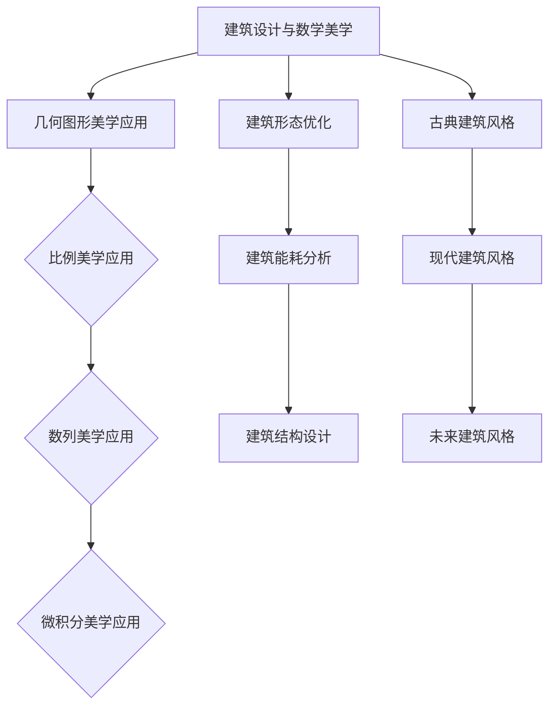

                 


### 《数学美学在建筑设计中的应用》

#### 关键词

- 数学美学
- 建筑设计
- 几何图形
- 比例美学
- 微积分

#### 摘要

本文旨在探讨数学美学在建筑设计中的广泛应用。通过分析几何学、数列与比例、微积分等数学基础理论，以及数学模型在建筑形态优化、能耗分析和结构设计中的应用，本文揭示了数学美学对建筑风格演变的影响。此外，通过具体案例分析，本文展示了数学美学在建筑设计实践中的成功应用，并探讨了其未来的发展趋势。本文旨在为建筑师和数学爱好者提供一个全面、深入的探讨，以激发两者之间的跨界合作和创新。

## 《数学美学在建筑设计中的应用》目录大纲

### 第1章 绪论

- **1.1 建筑设计与数学美学的关系**
- **1.2 数学美学在建筑设计中的应用现状**
- **1.3 本书的目的与结构安排**

### 第2章 数学基础理论

- **2.1 几何学基本概念**
- **2.2 数学符号和公理系统**
- **2.3 代数基础**

### 第3章 数学在建筑设计中的表现形式

- **3.1 几何图形的美学应用**
- **3.2 数列与比例的美学应用**
- **3.3 微积分在建筑设计中的应用**

### 第4章 数学模型在建筑设计中的应用

- **4.1 建筑形态优化**
- **4.2 建筑能耗分析**
- **4.3 建筑结构设计**

### 第5章 数学美学与建筑风格

- **5.1 古典建筑风格中的数学美学**
- **5.2 现代建筑风格中的数学美学**
- **5.3 未来建筑风格中的数学美学趋势**

### 第6章 数学美学在建筑设计案例分析

- **6.1 某知名博物馆建筑设计案例分析**
- **6.2 某生态住宅设计案例分析**
- **6.3 某城市综合体建筑设计案例分析**

### 第7章 数学美学在建筑设计中的应用前景

- **7.1 数学美学在建筑设计中的潜在应用**
- **7.2 数学美学在建筑设计中的挑战与机遇**
- **7.3 数学美学在建筑设计中的应用趋势**

### 第8章 附录

- **8.1 常用数学公式表**
- **8.2 建筑设计相关数学软件推荐**
- **8.3 参考文献与推荐阅读**

**附录 A: 数学美学在建筑设计中的应用 - Mermaid 流程图**



**附录 B: 数学模型在建筑设计中的应用 - 伪代码**

```pseudo
// 建筑形态优化算法
function optimizeBuildingForm(building):
    // 确定建筑基础尺寸
    baseSize = getBaseSize(building)
    // 计算最优形态
    optimalForm = calculateOptimalForm(baseSize)
    // 更新建筑形态
    building.form = optimalForm
    return building
```

**附录 C: 数学公式**

$$
\text{建筑能耗} = C_p \cdot m \cdot \Delta T
$$

**附录 D: 项目实战**

1. **开发环境搭建**
2. **源代码实现与解读**
3. **代码分析与实际应用**

---

**作者信息：**

作者：AI天才研究院/AI Genius Institute & 禅与计算机程序设计艺术 /Zen And The Art of Computer Programming

