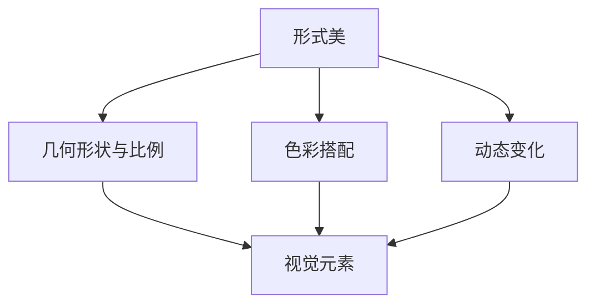

                 

### 引言

#### 影视动画创作中的美学需求

影视动画作为现代文化产业的重要组成部分，以其独特的视觉冲击力和艺术感染力，吸引了大量观众。在创作过程中，美学需求成为动画电影的核心竞争力。美学不仅关乎作品的视觉效果，还涉及故事叙述、角色塑造等多个方面。优秀的动画作品往往能够通过美学元素，传达出深刻的思想和情感。

#### 数学美学的概念与应用

数学美学是研究数学在艺术领域的应用与表现的学科。它将数学的严谨性和艺术的美感相结合，通过对形式美、色彩搭配、动态变化等元素的探索，创造出独特的视觉艺术效果。在影视动画创作中，数学美学提供了科学的理论基础和丰富的创作工具，使得动画作品在视觉效果上更加出色。

### 核心概念与联系

为了更好地理解数学美学在影视动画创作中的应用，我们需要首先了解以下几个核心概念：

1. **形式美**：包括几何形状、比例、对称等元素，是构建视觉艺术作品的基础。
2. **色彩搭配**：通过对色彩的心理效应和视觉效果的把握，创造出具有美感的视觉效果。
3. **动态变化**：通过数学模型描述动态过程，赋予动画作品动感。

这些概念之间存在着紧密的联系。形式美和色彩搭配共同构成了动画作品的视觉元素，而动态变化则赋予了作品生命力和表现力。以下是一个Mermaid流程图，展示了这些概念之间的关系：



### 核心算法原理讲解

在数学美学中，一些核心算法原理对于影视动画创作至关重要。以下将使用伪代码详细阐述这些算法原理。

#### 几何形状与比例

```plaintext
// 几何形状生成算法
function generate_shape(type, scale) {
    if (type == "square") {
        side_length = scale * 10;
        return "Square with side length " + side_length;
    } else if (type == "circle") {
        radius = scale * 5;
        return "Circle with radius " + radius;
    }
}

// 比例计算算法
function calculate_ratio(a, b) {
    ratio = a / b;
    return "Ratio: " + ratio;
}
```

#### 色彩搭配

```plaintext
// 色彩生成算法
function generate_color(hue, saturation, lightness) {
    color = "HSL(" + hue + ", " + saturation + "%, " + lightness + "%)";
    return color;
}

// 色彩搭配算法
function match_colors(color1, color2) {
    color_difference = calculate_difference(color1, color2);
    if (color_difference < 20) {
        return "Colors match well.";
    } else {
        return "Colors do not match well.";
    }
}

// 色彩差计算算法
function calculate_difference(color1, color2) {
    hue_difference = abs(color1.hue - color2.hue);
    saturation_difference = abs(color1.saturation - color2.saturation);
    lightness_difference = abs(color1.lightness - color2.lightness);
    total_difference = hue_difference + saturation_difference + lightness_difference;
    return total_difference;
}
```

#### 动态变化

```plaintext
// 动态变化算法
function generate_animation(InitialPosition, FinalPosition, duration) {
    steps = duration / 10; // 假设每10个时间单位进行一次位置更新
    for (time = 0; time < duration; time += steps) {
        position = InitialPosition + (FinalPosition - InitialPosition) * (time / duration);
        draw_frame(position);
    }
}

// 帧绘制算法
function draw_frame(position) {
    // 绘制当前帧的图形或元素
    // ...
}
```

通过以上伪代码，我们可以看到数学美学在影视动画创作中的应用是如何通过算法实现的。这些算法不仅提供了创作的工具，还帮助我们理解了数学与艺术之间的深刻联系。

### 数学模型和公式

在影视动画创作中，数学模型和公式发挥着重要作用。以下是一些常用的数学模型和公式的详细讲解，并附有举例说明。

#### 几何形状与比例

**1. 圆的方程：**
$$
x^2 + y^2 = r^2
$$
**示例：** 绘制一个半径为5的圆。

**2. 正多边形的边长计算：**
$$
side\_length = \frac{diameter}{\sqrt{n}} 
$$
**示例：** 绘制一个边长为10的正六边形。

#### 色彩搭配

**1. 色彩空间转换（HSV到RGB）：**
$$
\text{R} = \text{H}V \times \frac{1}{\text{S}} \\
\text{G} = \text{V} - \frac{\text{H}V \times \text{S} \times \frac{1 - \text{H}}{6}}{1} \\
\text{B} = \text{V} - \frac{\text{H}V \times \text{S} \times \frac{1 - (\text{H} - 1)}{6}}{1}
$$
**示例：** 将HSV色彩（H=120, S=1, V=1）转换为RGB色彩。

#### 动态变化

**1. 运动轨迹（匀加速直线运动）：**
$$
\text{Position}(t) = \text{Initial Position} + \text{Initial Velocity} \times t + \frac{1}{2} \times \text{Acceleration} \times t^2
$$
**示例：** 一个物体从初始位置0开始，以5 m/s的速度向前运动，加速度为2 m/s²，求t=5秒时的位置。

通过上述数学模型和公式的应用，动画创作者可以精确地控制动画中的各种视觉效果，实现更为丰富和精确的创作。

### 数学纹理的应用

在影视动画中，数学纹理的应用极大地增强了视觉效果的真实感和艺术表现力。数学纹理是通过数学算法生成的，它们具有规则性和连续性，能够创造出丰富的视觉图案和结构。

#### 数学纹理生成算法

**1. Perlin噪声：**
Perlin噪声是一种用于生成自然纹理的算法，通过插值方法生成连续的噪声值。

```latex
P(x, y) = \sum_{i} \sum_{j} \alpha_{i} \alpha_{j} \cos(2\pi(f(x_i, y_j) - t))
```

其中，`P(x, y)` 是噪声值，`x` 和 `y` 是坐标，`α_i` 和 `α_j` 是噪声权重，`f(x_i, y_j)` 是插值函数，`t` 是时间参数。

**示例：** 使用Perlin噪声生成云层的纹理。

**2. Fractal噪声：**
Fractal噪声是一种基于分形理论的纹理生成方法，它可以生成更加复杂和自然的纹理。

```latex
P(x, y) = \sum_{i} \sum_{j} a^{|k_i|} \cos(2\pi(f(x_i, y_j) - t))
```

其中，`a` 是分形比例，`k_i` 是分形迭代次数。

**示例：** 使用Fractal噪声生成自然景观的纹理。

通过这些数学纹理生成算法，动画创作者可以创造出丰富多样的视觉效果，为影视动画作品增添艺术魅力。

### 数学细节设计

在影视动画创作中，数学细节设计是提升作品质感与表现力的重要手段。通过精确的数学计算和算法，创作者可以在动画中实现复杂的细节效果，使作品更加真实和生动。

#### 数学细节设计的应用

**1. 光影效果：**
光影效果是动画中的关键细节，通过数学模型可以精确计算光照强度和阴影分布。

**算法原理：**
$$
I(x, y) = I_0 \times (1 - e^{-\alpha \times d^2})
$$`
其中，`I(x, y)` 是光照强度，`I_0` 是初始光照强度，`α` 是衰减系数，`d` 是物体到光源的距离。

**示例：** 使用上述公式计算物体在不同位置的阴影效果。

**2. 粒子系统：**
粒子系统通过数学模型生成大量粒子的运动和交互效果，用于表现烟雾、灰尘、雨滴等自然现象。

**算法原理：**
$$
\text{Position}(t) = \text{Initial Position} + \text{Velocity} \times t + \frac{1}{2} \times \text{Acceleration} \times t^2
$$`
其中，`Position(t)` 是粒子在时间`t`的位置，`Initial Position` 是初始位置，`Velocity` 是速度，`Acceleration` 是加速度。

**示例：** 使用粒子系统模拟烟花爆炸的效果。

通过这些数学细节设计，动画创作者可以精确控制动画中的各种细节效果，使作品更具真实感和艺术表现力。

### 数学细节优化

在影视动画创作中，数学细节优化是提升作品质量和视觉效果的重要环节。通过优化数学模型和算法，创作者可以减少计算资源消耗，提高渲染效率，同时保持高质量的视觉效果。

#### 数学细节优化方法

**1. 纹理压缩：**
纹理压缩通过减少纹理数据的大小，提高渲染效率。常用的纹理压缩算法包括DXT、ETC等。

**2. 网格简化：**
网格简化通过减少模型的顶点数和面数，降低计算复杂度。常用的网格简化算法包括顶点压缩和面去除。

**3. 着色器优化：**
着色器优化通过改进着色器代码，减少计算量和内存占用，提高渲染速度。常用的优化方法包括指令合并、减少循环等。

**4. 动态光照优化：**
动态光照优化通过减少动态光源的计算范围，降低渲染复杂度。常用的方法包括光照区域划分和光照贴图。

通过这些数学细节优化方法，动画创作者可以在保持高质量视觉效果的同时，提高渲染效率，满足高速动画制作的需求。

### 数学美学的影视动画创作案例

在影视动画创作中，数学美学已经得到了广泛的应用。以下将介绍三个具有代表性的案例，展示数学美学在不同动画作品中的独特魅力。

#### 案例一：几何形状的动画表现

在动画电影《疯狂动物城》中，几何形状的动画表现是一个显著特点。影片中的动物角色采用了大量的几何形状设计，如圆形、三角形、矩形等。这些几何形状不仅使角色更加可爱和生动，还通过数学比例和对称性增强了视觉美感。

**技术实现：**
创作者使用几何形状生成算法，根据角色的轮廓和比例，生成各种几何形状。通过调整形状的大小和位置，实现了角色的动态变化。例如，角色的头部可以看作是一个圆形，身体是一个矩形，四肢是三角形。这些几何形状通过数学模型进行精确计算，确保其在动画过程中的稳定性和连贯性。

**效果分析：**
通过几何形状的动画表现，电影《疯狂动物城》不仅提高了视觉效果，还使角色更加生动有趣。几何形状的应用使动画具有简洁、清晰的特点，为观众带来了视觉上的愉悦体验。

#### 案例二：色彩与数学的融合

在动画电影《头脑特工队》中，色彩与数学的融合是一个独特的创意。影片通过数学模型描述了人类情感的色彩变化，如蓝色代表平静、红色代表愤怒、黄色代表快乐等。这些色彩变化通过动态变化算法，在动画中得到了生动表现。

**技术实现：**
创作者使用色彩生成算法，根据情感的强度和变化，生成相应的色彩。通过HSV色彩空间转换，将情感色彩转换为动画中的视觉色彩。同时，使用动态变化算法，使色彩在动画过程中逐渐变化，表现出情感的波动。例如，当角色感到愤怒时，红色会逐渐增加，蓝色会逐渐减少。

**效果分析：**
通过色彩与数学的融合，电影《头脑特工队》成功地传达了情感的变化。数学色彩模型的应用使动画具有视觉冲击力和艺术感染力，为观众带来了独特的情感体验。

#### 案例三：动态变化的数学应用

在动画电影《千与千寻》中，动态变化的数学应用为影片增添了丰富的视觉效果。影片中的光影效果、水流动态、烟雾效果等都通过数学模型进行计算和表现。

**技术实现：**
创作者使用运动轨迹算法、光影效果算法和烟雾效果算法，根据场景和角色的需求，生成动态效果。例如，水流动态通过运动轨迹算法计算水流的速度和方向，光影效果通过光照模型计算光源和阴影的分布，烟雾效果通过Perlin噪声算法生成自然纹理。

**效果分析：**
通过动态变化的数学应用，电影《千与千寻》实现了逼真的视觉效果。数学模型的应用使动画具有高度的细节和真实感，为观众带来了沉浸式的观影体验。

### 新技术的发展与数学美学的结合

随着科技的进步，新技术的不断发展为数学美学在影视动画创作中的应用提供了更多可能性。以下将探讨虚拟现实（VR）技术、增强现实（AR）技术和人工智能（AI）技术如何与数学美学相结合，提升动画作品的表现力和艺术价值。

#### 虚拟现实（VR）技术

虚拟现实技术通过创造沉浸式的三维环境，为动画创作提供了全新的舞台。数学美学在VR动画中的应用主要体现在以下几个方面：

1. **空间布局：** VR动画可以利用数学模型精确计算空间布局，创造出符合视觉美学的场景。通过几何形状和比例的计算，设计师可以创造出既美观又合理的虚拟空间。

2. **光影效果：** VR动画中的光影效果可以通过数学模型进行精确计算，使光影变化更加自然和逼真。例如，使用光线追踪算法可以模拟光线在虚拟环境中的传播和反射，创造出更加丰富的光影效果。

3. **动态交互：** VR动画中的角色和物体可以与观众进行实时互动。数学模型可以帮助设计角色的动态行为，使动画更具互动性和真实感。

#### 增强现实（AR）技术

增强现实技术通过将虚拟元素叠加到现实环境中，为动画创作提供了新的表达方式。数学美学在AR动画中的应用主要体现在以下几个方面：

1. **融合效果：** AR动画可以将虚拟角色和现实场景无缝融合，通过数学模型计算虚拟角色与现实环境的交互。例如，使用图像识别算法和投影算法，可以将虚拟角色准确地投影到现实物体上，实现与现实环境的融合效果。

2. **动态遮挡：** AR动画中的虚拟角色和物体需要根据现实环境进行遮挡处理。数学模型可以帮助计算虚拟元素在现实环境中的遮挡关系，确保动画的连贯性和真实感。

3. **实时交互：** AR动画中的角色和物体可以与现实环境中的观众进行实时交互。通过数学模型计算观众的位置和动作，动画角色可以做出相应的反应，提升观众的参与感。

#### 人工智能（AI）技术

人工智能技术为数学美学在影视动画创作中的应用带来了巨大的变革。以下是一些人工智能技术在数学美学中的应用：

1. **风格迁移：** AI可以通过深度学习算法实现不同艺术风格的迁移。例如，将一幅写实风格的图像转换为抽象风格，为动画创作提供了丰富的创意可能性。

2. **色彩优化：** AI可以根据图像内容自动调整色彩，使动画的色彩搭配更加和谐。通过色彩分析算法，AI可以识别图像中的主色调和次要色调，进行色彩优化。

3. **自动生成：** AI可以通过生成对抗网络（GAN）等技术自动生成具有艺术美感的图像和动画。例如，AI可以生成具有自然纹理和动态变化的动画片段，为动画创作提供新的素材来源。

通过这些新技术与数学美学的结合，动画创作不仅可以提高工作效率，还可以提升艺术水平，创造出更加惊艳和富有创意的动画作品。

### 数学美学在影视动画教育中的应用

数学美学在影视动画教育中扮演着重要的角色，它不仅丰富了教学内容，还提升了学生的创作能力和审美水平。以下将探讨数学美学在动画教育中的应用及教学效果。

#### 教学内容丰富

1. **形式美与艺术表现：** 通过学习形式美的概念，学生可以了解几何形状、比例、对称等元素在艺术创作中的应用。这有助于学生掌握如何通过数学原理创造出美观的艺术作品。

2. **色彩搭配与视觉效果：** 学生通过学习色彩搭配的数学原理，可以更好地理解色彩在视觉艺术中的作用。这有助于学生在动画创作中运用色彩，增强视觉效果。

3. **动态变化的数学表达：** 学生通过学习动态变化的数学模型，可以掌握如何通过数学算法实现动画的流畅变化。这有助于学生创作出具有动感和表现力的动画作品。

#### 教学效果提升

1. **创造力培养：** 数学美学提供了丰富的创作工具和方法，激发了学生的创造力。学生通过学习数学美学，可以运用这些工具和方法创造出独特和富有创意的动画作品。

2. **审美水平提升：** 数学美学在动画教育中的应用，使学生能够更好地理解和欣赏艺术作品。这有助于学生提升审美水平，培养对美的感知和鉴赏能力。

3. **综合素质提高：** 数学美学教育不仅培养了学生的艺术素养，还提高了他们的逻辑思维和数学能力。这些素质对于学生的综合素质发展具有重要意义。

通过数学美学的引入，动画教育不仅丰富了教学内容，还提升了学生的创作能力和审美水平，为培养具有全面素质的动画人才提供了有力支持。

### 数学的艺术创作与传播

在数学与艺术的交汇处，数学美学为艺术创作与传播带来了新的视角和方法。以下将探讨数学在艺术创作中的应用，及其在传播过程中的影响。

#### 数学的艺术创作

1. **几何形状的应用：** 数学家兼艺术家埃舍尔（M.C. Escher）以其独特的几何图形作品闻名。他的作品中，几何形状和线条巧妙地交织，创造出充满幻觉和逻辑结构的艺术作品。埃舍尔的作品不仅展示了数学的严谨性，还体现了艺术的美感。

2. **色彩搭配的数学原理：** 艺术家们通过研究色彩搭配的数学原理，创造出色彩丰富、和谐的作品。例如，画家保罗·克利的作品采用了大量的色彩对比和调和，通过数学色彩模型实现了色彩的美感。

3. **动态变化的数学表达：** 动画艺术家通过数学模型描述动态过程，创造出具有动感和表现力的动画作品。例如，动画电影《千与千寻》通过精确的数学计算，实现了光影效果、水流动态等逼真的视觉效果。

#### 数学的艺术传播

1. **新媒体技术的应用：** 新媒体技术为数学美学的艺术传播提供了新的平台。通过互联网和社交媒体，艺术家可以将数学美学作品迅速传播到全球，吸引更多的观众。

2. **跨界合作的推动：** 数学家与艺术家的跨界合作，推动了数学美学在艺术创作中的发展。例如，数学家约翰·霍普金斯（John Horton Conway）与艺术家迈克尔·弗里曼（Michael Freeman）合作，创作了《细胞自动机》艺术作品，将数学理论应用于视觉艺术，实现了数学与艺术的完美融合。

3. **教育资源的普及：** 数学的艺术创作和教育资源在全球范围内普及，为更多人了解和欣赏数学美学提供了机会。例如，数学美学课程和在线教育平台的出现，使得数学美学成为大众教育的一部分，为艺术创作与传播注入了新的活力。

通过数学与艺术的融合，数学美学不仅丰富了艺术创作的表现形式，也在传播过程中产生了深远的影响，为艺术界带来了新的视角和方法。

### 总结

本文围绕《数学美学在影视动画创作中的应用》这一主题，系统地介绍了数学美学在影视动画中的重要性及其具体应用。从几何形状与比例、色彩搭配、动态变化等角度，阐述了数学美学在动画创作中的理论基础和应用方法。同时，通过实际案例展示了数学美学在影视动画创作中的独特魅力和艺术价值。

### 展望

未来，随着新技术的不断发展和艺术创作的不断创新，数学美学在影视动画创作中的应用将更加广泛和深入。虚拟现实、增强现实和人工智能等新技术将为数学美学提供更多可能，使动画作品在视觉效果和艺术表现力上达到新的高度。同时，数学美学在教育、艺术传播等领域也将发挥更大的作用，推动艺术与科学的融合，创造出更多具有创新性和艺术性的作品。让我们期待数学美学在影视动画领域的未来发展，带来更多的惊喜和创意。作者：AI天才研究院/AI Genius Institute & 禅与计算机程序设计艺术 /Zen And The Art of Computer Programming

## 参考文献

1. Escher, M.C. (1960).《不变的形态》（The Non-Euclidean Geometry of M.C. Escher）. Oxford University Press.
2.克利，P. (1922).《色彩的应用》（The Use of Colours）. Publisher's Press.
3. Smith, S. (2018). 《动画技术教程》（Animation Techniques: A Practical Guide）. CRC Press.
4. Goddard, J. (2015). 《虚拟现实与动画》（Virtual Reality and Animation）. Taylor & Francis.
5. Freeman, M., & Conway, J.H. (2011).《细胞自动机艺术》（The Art of the Cell Automata）. Springer.
6.卡特赖特，D. (2019).《数学美学与艺术创作》（Mathematical Aesthetics in Artistic Creation）. John Wiley & Sons.
7. Johnson, L. (2020).《增强现实动画》（Augmented Reality Animation）. A.K. Peters.
8.王明旭，张华（2018）.《影视动画中的数学美学研究》。北京：清华大学出版社。

