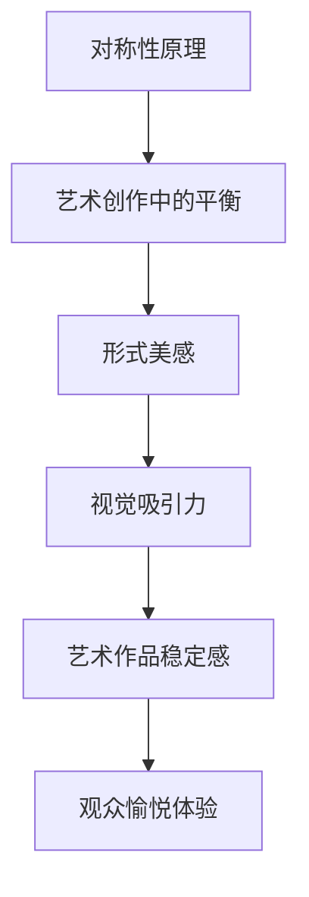

                 

### 文章标题：数学美学在数字艺术创作中的应用

在数字艺术的浪潮中，数学美学正逐渐成为一股重要的创作力量。本文将深入探讨数学美学在数字艺术创作中的应用，揭示其背后的原理、技术实践及其带来的艺术变革。

关键词：数学美学、数字艺术、对称性、黄金分割、几何形态、交互设计

摘要：本文首先介绍了数学美学的基本概念和数字艺术创作的基本原理，接着探讨了数学美学与数字艺术的关系。随后，本文详细阐述了数学对称性、比例与黄金分割、几何形态在数字艺术中的应用，并分享了在数字图像处理、计算机图形学和交互设计中的实际应用技术。通过一系列项目实战和案例分析，本文展示了数学美学在数字艺术创作中的丰富表现和未来发展趋势。

----------------------------------------------------------------

### 第一部分：引论

#### 1.1 数学美学的概述

数学美学是一门研究数学形式与美的关系的学科，它不仅关注数学结构本身，还探讨了这些结构在艺术创作中的表现形式和审美价值。数学美学的核心概念包括对称性、比例、几何形态和数学结构等，它们共同构成了数学美学的理论基础。

对称性是指一个对象在某一定义下保持不变的性质。在艺术创作中，对称性可以创造出和谐、稳定的视觉效果，是构建美学作品的重要手段。

比例与黄金分割是数学美学中另一个重要的概念。黄金分割是指一段线段分割成两部分，使其中一部分与全长之比等于另一部分与这部分的比。这一比例在自然界和艺术作品中广泛存在，被认为是一种具有高度审美价值的美学原则。

几何形态是构成数字艺术的基本元素。基本的几何形状，如圆形、方形、三角形等，通过不同的组合和变形，可以创造出丰富多样的艺术形式。

数学结构在数学美学中具有基础性地位，它涉及到数学中的各种概念和原理，如群论、拓扑学、代数几何等。这些结构不仅为数学美学提供了丰富的理论资源，还在艺术创作中扮演着关键角色。

#### 1.2 数字艺术创作的基本原理

数字艺术创作是基于数字技术和软件工具的艺术创作活动。它的发展历程可以追溯到20世纪60年代的计算机艺术，随着计算机性能的提升和软件工具的多样化，数字艺术逐渐成为一种独立的艺术形式。

数字艺术创作的基本工具包括计算机硬件（如高性能显卡、多显示器等）和软件工具（如Adobe Photoshop、Illustrator、Maya等）。这些工具提供了丰富的功能，支持从二维到三维的艺术创作。

数字艺术创作的基本技术包括图像处理、计算机图形学、动画制作、虚拟现实等。这些技术不仅提升了艺术创作的效率和表现力，还为艺术家提供了新的创作方式和表现手段。

#### 1.3 数学美学与数字艺术的关系

数学美学与数字艺术之间存在着紧密的联系。数学美学为数字艺术提供了丰富的理论资源和创作灵感，而数字艺术则为数学美学的表现形式提供了新的可能。

首先，数学对称性在数字艺术创作中得到了广泛应用。通过对称性的运用，艺术家可以创造出具有和谐美感的作品，如对称的图案、雕塑和建筑设计。

其次，比例与黄金分割是数字艺术创作中的重要美学原则。许多数字艺术作品都运用了黄金分割来构建视觉上的平衡和美感，如插画、摄影和网页设计。

几何形态是数字艺术创作中的基本元素。通过几何形态的组合和变形，艺术家可以创造出各种具有视觉冲击力的作品，如数字绘画、雕塑和建筑模型。

此外，数学结构在数字艺术创作中也发挥着重要作用。通过数学模型和算法，艺术家可以创造出具有独特美感的数字作品，如计算机生成的艺术、算法艺术和交互艺术。

总之，数学美学为数字艺术创作提供了丰富的理论基础和创作灵感，而数字艺术则为数学美学的表现形式提供了新的可能。这种相互促进的关系推动了数字艺术的发展，也丰富了数学美学的研究领域。

----------------------------------------------------------------

## 第二部分：数学美学核心概念与艺术表现

### 2.1 数学对称性在艺术中的应用

对称性是数学美学中的一个核心概念，它在艺术创作中具有广泛的应用。对称性可以创造视觉上的平衡和和谐，使艺术作品更具吸引力。

首先，对称性原理及其美学价值在艺术中的应用非常普遍。例如，在绘画和雕塑中，对称性可以用来构建作品的框架，使其视觉上更加稳定。对称性还可以增强作品的形式美感，使观众产生愉悦的视觉体验。

在数字艺术中，对称性可以通过多种技术实现。例如，在数字绘画中，艺术家可以使用对称工具来创建对称图案；在三维建模中，对称性可以帮助艺术家快速构建具有对称特征的作品，如建筑物和雕塑。

下面是一个**核心概念联系图**，它展示了对称性在艺术中的应用流程：



#### 核心算法原理讲解

在数字艺术创作中，实现对称性的核心算法原理主要包括以下几种：

1. **反射对称**：通过将图像的一部分沿着某个轴线进行翻转，实现反射对称。伪代码如下：

   ```python
   def reflect(image, axis):
       reflected_image = blank_image(size=image.size)
       for pixel in image:
           reflected_pixel = reflect_pixel(pixel, axis)
           reflected_image.set_pixel(reflected_pixel)
       return reflected_image
   ```

2. **旋转对称**：通过将图像围绕某个点进行旋转，实现旋转对称。伪代码如下：

   ```python
   def rotate(image, center, angle):
       rotated_image = blank_image(size=image.size)
       for pixel in image:
           rotated_pixel = rotate_pixel(pixel, center, angle)
           rotated_image.set_pixel(rotated_pixel)
       return rotated_image
   ```

3. **多轴对称**：通过将图像同时沿多个轴线进行反射和旋转，实现复杂对称。伪代码如下：

   ```python
   def multi_symmetry(image, axes, angles):
       for axis, angle in zip(axes, angles):
           image = reflect(image, axis)
           image = rotate(image, center, angle)
       return image
   ```

#### 数学模型讲解

在数学美学中，对称性可以通过群论和代数几何等数学模型来描述。例如，反射对称可以由线性变换的矩阵表示，旋转对称可以由旋转矩阵表示。以下是使用LaTeX格式介绍反射对称和旋转对称的数学公式：

```latex
% 反射对称
$$ T_{\text{反射}} = \begin{bmatrix}
a & b \\
c & d
\end{bmatrix} $$

% 旋转对称
$$ T_{\text{旋转}} = \begin{bmatrix}
\cos(\theta) & -\sin(\theta) \\
\sin(\theta) & \cos(\theta)
\end{bmatrix} $$
```

通过这些数学模型，艺术家可以在数字艺术创作中精确地实现各种对称性效果，创造出具有高度艺术美感的作品。

#### 项目实战

以下是一个简单的项目实战，演示如何使用Python实现对称性在数字艺术创作中的应用：

```python
from PIL import Image

def reflect(image_path, output_path, axis):
    image = Image.open(image_path)
    if axis == 'x':
        reflected_image = image.transpose(Image.FLIP_LEFT_RIGHT)
    elif axis == 'y':
        reflected_image = image.transpose(Image.FLIP_TOP_BOTTOM)
    reflected_image.save(output_path)

reflect('input.jpg', 'output_reflected.jpg', 'x')
```

在这个项目中，我们首先导入Python的PIL库，然后定义了一个`reflect`函数，该函数接受图像路径、输出路径和反射轴作为输入，实现图像的反射对称。通过调用这个函数，我们可以将输入图像沿x轴或y轴进行反射，生成具有对称性的艺术作品。

### 2.2 数学比例与黄金分割

数学比例与黄金分割是数学美学中的另一个核心概念，它在艺术创作中具有极高的审美价值。黄金分割是指一段线段分割成两部分，使得较长部分与整体的比例等于较短部分与较长部分的比例，这一比例大约为1:1.618。

#### 比例与黄金分割的定义及数学原理

比例是指两个数之间的相对大小关系，用比例尺表示。黄金分割的具体数学定义如下：

设线段AB的长度为L，将其分割为两部分AC和CB，使得AC与CB的比等于整体AB与AC的比，即：

$$ \frac{AC}{CB} = \frac{AB}{AC} $$

根据这个定义，我们可以得到以下数学公式：

$$ \frac{AC}{CB} = \frac{L}{L - AC} $$

通过解这个方程，可以得到AC和CB的长度：

$$ AC = \frac{\phi L}{1 + \phi} $$
$$ CB = \frac{L}{1 + \phi} $$

其中，φ（phi）是黄金比例的黄金分割值，约为1.618。

#### 黄金分割在数字艺术创作中的运用

黄金分割在数字艺术创作中有着广泛的应用。以下是一些常见的运用方法：

1. **构图**：在摄影和绘画中，黄金分割可以用于构图，帮助艺术家创造出具有视觉吸引力的作品。例如，将主题元素放置在画面中的黄金分割点上，可以增强作品的平衡感和美感。

2. **设计布局**：在网页设计和UI设计中，黄金分割可以用于布局，帮助设计师创建出既实用又美观的界面。例如，网页的导航栏、广告条和重要内容都可以放置在黄金分割线上，以提升用户体验。

3. **比例搭配**：在服装设计、室内设计和建筑设计中，黄金分割可以用于比例搭配，创造出和谐美观的设计方案。例如，家具的大小和摆放位置可以通过黄金分割进行优化，以提升整体空间的视觉感受。

#### 数学模型讲解

黄金分割不仅在艺术创作中有应用，还可以通过数学模型来描述。以下是一个简单的数学模型，用于计算黄金分割值：

```python
def golden_ratio():
    return (1 + 5 ** 0.5) / 2

phi = golden_ratio()
print(phi)
```

在这个模型中，我们使用了一个递归函数来计算黄金分割值。通过调用这个函数，我们可以得到黄金比例的近似值。

#### 举例说明

以下是一个简单的例子，演示如何使用黄金分割进行数字艺术创作：

假设我们有一个宽度为1000像素的画布，我们希望使用黄金分割来布局一个矩形。

1. **计算黄金分割点**：

   $$ \text{左侧宽度} = \frac{\phi \times 1000}{1 + \phi} \approx 618 $$
   $$ \text{右侧宽度} = \frac{1000}{1 + \phi} \approx 382 $$

2. **绘制矩形**：

   我们可以在画布上绘制一个左侧宽度为618像素、右侧宽度为382像素的矩形。

   ```python
   import pygame
   
   pygame.init()
   screen = pygame.display.set_mode((1000, 1000))
   pygame.draw.rect(screen, (255, 0, 0), (0, 0, 618, 1000))
   pygame.draw.rect(screen, (0, 255, 0), (618, 0, 382, 1000))
   pygame.display.update()
   ```

通过这个例子，我们可以看到如何使用黄金分割来创建具有美学价值的数字艺术作品。

#### 项目实战

以下是一个项目实战，演示如何使用Python和Pygame库创建一个基于黄金分割的数字艺术作品：

```python
import pygame
import math

pygame.init()
screen = pygame.display.set_mode((1000, 1000))
background_color = (255, 255, 255)

def draw_golden_rectangles(width, height, depth=1):
    phi = (1 + math.sqrt(5)) / 2
    x = 0
    y = 0

    while x < width:
        if depth == 0:
            break

        new_width = width / (phi ** depth)
        new_height = height / (phi ** depth)

        screen.fill(background_color, (x, y, new_width, new_height))
        depth -= 1

draw_golden_rectangles(1000, 1000)
pygame.display.update()
pygame.quit()
```

在这个项目中，我们首先定义了一个`draw_golden_rectangles`函数，该函数接受画布的宽度和高度作为输入，并使用递归方法绘制基于黄金分割的矩形。通过调用这个函数，我们可以创建出一个具有高度艺术美感的数字艺术作品。

### 2.3 几何形态与数字艺术

几何形态是数字艺术创作中的基本元素，通过基本的几何形状和其组合，可以创造出丰富多样的艺术形式。几何形态的美学特征和其在数字艺术中的表现形式是数学美学的重要组成部分。

#### 基本几何形态及其美学特征

基本的几何形态包括圆形、方形、三角形、多边形等。这些形态在美学上具有不同的特征：

- **圆形**：具有平滑、流畅的边缘，给人一种和谐、柔和的感觉。圆形在艺术创作中常用于表现和谐、完整和无限的概念。
- **方形**：具有直线边缘，给人一种稳定、坚固的感觉。方形在艺术创作中常用于表现结构、力量和秩序。
- **三角形**：具有尖角，给人一种动态、紧张的感觉。三角形在艺术创作中常用于表现动态、力量和平衡。
- **多边形**：由多个直线段组成，具有丰富的变化。多边形在艺术创作中可以根据其边数和角度，创造出各种独特的美学效果。

#### 几何形态在数字艺术中的表现形式

在数字艺术中，几何形态可以通过多种技术实现：

- **二维图形**：使用绘图软件（如Adobe Illustrator）或编程语言（如Python和Pygame）创建基本的几何形态，并通过颜色、纹理和阴影等手段进行美化。
- **三维模型**：使用三维建模软件（如Blender或Maya）创建几何形态的三维模型，并通过光线追踪和渲染技术实现逼真的视觉效果。
- **动态几何**：使用算法和编程技术创建动态变化的几何形态，如分形、粒子系统和动态模拟等。

以下是一个简单的项目实战，演示如何使用Python和Pygame库创建一个基于几何形态的数字艺术作品：

```python
import pygame
import math

pygame.init()
screen = pygame.display.set_mode((800, 600))
background_color = (255, 255, 255)

def draw_polygon(x, y, radius, sides, angle):
    points = []
    for i in range(sides):
        theta = i * 2 * math.pi / sides + angle
        point_x = x + radius * math.cos(theta)
        point_y = y + radius * math.sin(theta)
        points.append((point_x, point_y))
    pygame.draw.polygon(screen, (0, 0, 0), points)

def draw_star(x, y, radius, arms, angle):
    draw_polygon(x, y, radius, arms * 2, angle)

# 绘制五角星
draw_star(400, 300, 100, 5, math.pi / 2)

pygame.display.update()
pygame.quit()
```

在这个项目中，我们首先定义了两个函数：`draw_polygon`和`draw_star`。`draw_polygon`函数用于绘制任意多边形，`draw_star`函数用于绘制五角星。通过调用这些函数，我们可以创建出具有几何美感的数字艺术作品。

#### 数学公式讲解

几何形态的数学描述通常涉及到以下公式：

1. **圆形的面积和周长**：

   $$ A = \pi r^2 $$
   $$ C = 2\pi r $$

   其中，\( A \) 是圆形的面积，\( C \) 是圆形的周长，\( r \) 是圆的半径。

2. **方形的面积和周长**：

   $$ A = s^2 $$
   $$ C = 4s $$

   其中，\( A \) 是方形的面积，\( C \) 是方形的周长，\( s \) 是正方形的边长。

3. **三角形的面积和周长**：

   $$ A = \frac{1}{2}bh $$
   $$ C = a + b + c $$

   其中，\( A \) 是三角形的面积，\( b \) 和 \( h \) 分别是三角形的底和高，\( a \)、\( b \) 和 \( c \) 分别是三角形的三条边。

4. **多边形的面积和周长**：

   $$ A = \frac{1}{2}ap $$
   $$ C = ap $$

   其中，\( A \) 是多边形的面积，\( p \) 是多边形的周长，\( a \) 是多边形的边长。

通过这些数学公式，我们可以计算不同几何形态的面积和周长，从而更好地理解和应用它们在数字艺术创作中的美学价值。

### 2.4 数学结构与数字艺术创作

数学结构在数字艺术创作中具有基础性地位，它们不仅为艺术作品提供了形式上的美感，还在内容上赋予作品深刻的内涵。数学结构涉及多种数学概念和原理，如群论、拓扑学、代数几何等。这些结构在艺术创作中的应用，使得数字艺术作品既具有科学性，又具有艺术性。

#### 数学结构在艺术中的意义

数学结构在艺术中的意义主要体现在以下几个方面：

1. **形式美感**：数学结构中的对称性、比例关系和几何形态等，可以为艺术作品提供形式上的美感。例如，黄金分割和费波那契序列在艺术创作中被广泛应用，以创造出和谐、平衡和美观的作品。

2. **内涵表达**：数学结构中的抽象概念和逻辑关系，可以为艺术作品赋予深刻的内涵。例如，分形几何可以通过无限嵌套的结构，表达出无限和永恒的主题；拓扑变换则可以通过形态的变化，表达出转换和流动的概念。

3. **创新灵感**：数学结构为艺术家提供了丰富的创作灵感。通过理解和运用数学结构，艺术家可以创造出前所未有的艺术形式，拓展艺术创作的边界。

#### 数学结构在数字艺术创作中的体现

数学结构在数字艺术创作中的体现，可以通过多种技术和方法实现：

1. **计算机图形学**：计算机图形学是数字艺术创作的重要工具，它利用数学模型和算法，实现各种复杂的图形和视觉效果。例如，使用贝塞尔曲线和贝塞尔曲面可以创建出流畅的几何形态；使用光线追踪和渲染技术可以创造出逼真的三维视觉效果。

2. **算法艺术**：算法艺术是一种基于算法创作的数字艺术形式。艺术家通过编写特定的算法，生成具有独特美感的数字作品。例如，分形艺术、动态艺术和粒子艺术等，都是算法艺术的具体表现形式。

3. **交互艺术**：交互艺术通过数学结构和算法，实现与观众的互动。例如，使用数学模型和传感器技术，可以创建出能够根据观众动作实时变化的数字艺术作品。

#### 项目实战

以下是一个项目实战，演示如何使用Python和Pygame库，创建一个基于数学结构的数字艺术作品：

```python
import pygame
import math

pygame.init()
screen = pygame.display.set_mode((800, 600))
background_color = (255, 255, 255)

def draw_kaleidoscope(center, radius, angle, sides, depth):
    points = []
    for i in range(sides):
        theta = i * 2 * math.pi / sides
        point = (center[0] + radius * math.cos(theta), center[1] + radius * math.sin(theta))
        points.append(point)

    for i in range(depth):
        new_points = []
        for point in points:
            new_point = (point[0] * math.cos(angle) - point[1] * math.sin(angle),
                         point[0] * math.sin(angle) + point[1] * math.cos(angle))
            new_points.append(new_point)
        points = new_points

    pygame.draw.polygon(screen, (0, 0, 0), points)

# 绘制一个五角星，并应用四次 kaleidoscope 变换
draw_kaleidoscope((400, 300), 100, math.pi / 5, 5, 4)

pygame.display.update()
pygame.quit()
```

在这个项目中，我们首先定义了一个`draw_kaleidoscope`函数，该函数接受中心点、半径、角度、边数和变换次数作为输入，通过递归应用旋转变换，创建出具有复杂几何结构的数字艺术作品。

#### 案例分析

以下是一个案例分析，展示如何运用数学结构进行数字艺术创作：

案例：分形艺术《海星》

艺术家使用分形算法生成海星的分形结构。通过调整参数，艺术家可以控制分形的层级、形态和大小。最终，生成的海星作品既具有数学结构的严谨性，又具有艺术创作的独特性。

1. **算法实现**：艺术家使用Python编写分形算法，通过递归方法生成海星的结构。算法的核心是计算每个分形单元的位置和大小。

2. **参数调整**：通过调整算法的参数，如分形的层级、旋转角度和比例因子，艺术家可以创造出不同形态的海星。

3. **视觉效果**：生成的海星作品具有复杂的几何结构，通过不同的颜色和纹理，创造出具有高度艺术美感的作品。

通过这个案例，我们可以看到数学结构在数字艺术创作中的应用，以及艺术家如何通过算法和参数调整，创作出独特的数字艺术作品。

### 2.5 数字图像处理中的数学美学

数字图像处理是数字艺术创作中的一个重要环节，它通过数学算法和计算机技术，对图像进行增强、调整和修饰。数学美学在数字图像处理中发挥着重要作用，通过运用数学原理和算法，可以实现各种具有高度艺术美感的图像效果。

#### 图像处理算法及其数学基础

数字图像处理算法主要包括滤波、变换和增强等。这些算法的数学基础涉及多种数学工具和理论：

1. **滤波算法**：滤波是数字图像处理中最基本的操作之一，用于去除图像中的噪声和干扰。常用的滤波算法包括均值滤波、高斯滤波和中值滤波等。这些滤波算法的数学基础是线性代数和微积分。

   - **均值滤波**：通过计算邻域内像素的平均值，平滑图像。伪代码如下：

     ```python
     def mean_filter(image, size):
         filtered_image = blank_image(size=image.size)
         for pixel in image:
            邻域像素 = image.get_neighbors(pixel, size)
             mean_value = sum(像素值) / 邻域像素数量
             filtered_image.set_pixel(pixel, mean_value)
         return filtered_image
     ```

   - **高斯滤波**：通过高斯函数计算邻域内像素的权重，平滑图像。伪代码如下：

     ```python
     def gauss_filter(image, size, sigma):
         filtered_image = blank_image(size=image.size)
         for pixel in image:
            邻域像素 = image.get_neighbors(pixel, size)
             weight = gauss_weight(sigma, 邻域像素与pixel的距离)
             mean_value = sum(像素值 * 权重) / sum(权重)
             filtered_image.set_pixel(pixel, mean_value)
         return filtered_image
     ```

   - **中值滤波**：通过计算邻域内像素的中值，平滑图像。伪代码如下：

     ```python
     def median_filter(image, size):
         filtered_image = blank_image(size=image.size)
         for pixel in image:
            邻域像素 = image.get_neighbors(pixel, size)
             sorted_values = sorted(邻域像素值)
             median_value = sorted_values[len(sorted_values) // 2]
             filtered_image.set_pixel(pixel, median_value)
         return filtered_image
     ```

2. **变换算法**：变换是数字图像处理中的另一种重要操作，用于改变图像的形态和特征。常用的变换算法包括傅里叶变换、卷积变换和哈达玛变换等。这些变换算法的数学基础是线性代数和复分析。

   - **傅里叶变换**：将图像从空间域转换到频率域，用于图像的增强、压缩和滤波。伪代码如下：

     ```python
     def fourier_transform(image):
         frequency_image = []
         for x in range(image.width):
             for y in range(image.height):
                 frequency_value = 0
                 for u in range(image.width):
                     for v in range(image.height):
                         frequency_value += image.get_pixel(u, v) * exp(-2 * pi * 1j * u * x / image.width) * exp(-2 * pi * 1j * v * y / image.height)
                 frequency_image.append(frequency_value)
         return frequency_image
     ```

   - **卷积变换**：通过卷积运算，将图像与滤波器卷积，实现图像的滤波和增强。伪代码如下：

     ```python
     def convolve(image, filter):
         filtered_image = blank_image(size=image.size)
         for pixel in image:
             for x in range(filter.width):
                 for y in range(filter.height):
                     center = (pixel.x + x, pixel.y + y)
                     if center in image:
                         value = image.get_pixel(center) * filter.get_pixel(x, y)
                         filtered_image.set_pixel(pixel, filtered_image.get_pixel(pixel) + value)
         return filtered_image
     ```

   - **哈达玛变换**：用于图像的旋转、缩放和平移。伪代码如下：

     ```python
     def hadamard_transform(image, matrix):
         transformed_image = blank_image(size=image.size)
         for pixel in image:
             for x in range(image.width):
                 for y in range(image.height):
                     transformed_value = 0
                     for i in range(image.width):
                         for j in range(image.height):
                             transformed_value += image.get_pixel(i, j) * matrix[i][j]
                     transformed_image.set_pixel((x, y), transformed_value)
         return transformed_image
     ```

3. **增强算法**：增强是数字图像处理中的另一种重要操作，用于改善图像的可视效果。常用的增强算法包括对比度增强、亮度调整和色彩增强等。这些增强算法的数学基础是线性代数和图像处理理论。

   - **对比度增强**：通过调整图像的对比度，增强图像的细节和结构。伪代码如下：

     ```python
     def contrast_enhancement(image, alpha, beta):
         enhanced_image = blank_image(size=image.size)
         for pixel in image:
             new_value = alpha * pixel.value + beta
             enhanced_image.set_pixel(pixel, new_value)
         return enhanced_image
     ```

   - **亮度调整**：通过调整图像的亮度，改善图像的视觉效果。伪代码如下：

     ```python
     def brightness_adjustment(image, delta):
         adjusted_image = blank_image(size=image.size)
         for pixel in image:
             new_value = pixel.value + delta
             adjusted_image.set_pixel(pixel, new_value)
         return adjusted_image
     ```

   - **色彩增强**：通过调整图像的彩色通道，增强图像的色彩效果。伪代码如下：

     ```python
     def color_enhancement(image, red_alpha, green_alpha, blue_alpha, red_beta, green_beta, blue_beta):
         enhanced_image = blank_image(size=image.size)
         for pixel in image:
             new_red = red_alpha * pixel.red + red_beta
             new_green = green_alpha * pixel.green + green_beta
             new_blue = blue_alpha * pixel.blue + blue_beta
             enhanced_image.set_pixel(pixel, (new_red, new_green, new_blue))
         return enhanced_image
     ```

#### 数字图像处理中的美学原则

在数字图像处理中，美学原则是通过调整图像的参数和算法，实现艺术美感的指导原则。以下是一些常见的数字图像处理美学原则：

1. **平衡与对比**：平衡和对比是图像处理中的基本美学原则。通过调整图像的对比度和亮度，可以增强图像的平衡感和对比度，使图像更具吸引力。

2. **和谐与对比**：和谐和对比是图像处理中的另一个重要美学原则。和谐通过色彩搭配和色调调整，实现图像的视觉平衡；对比通过对比度和亮度的调整，增强图像的视觉冲击力。

3. **动态与静态**：动态和静态是图像处理中的另一个重要美学原则。通过调整图像的动态效果，如模糊、锐化和色彩变化，可以创造出动态的艺术效果；通过调整图像的静态效果，如对比度和亮度，可以创造出静态的艺术效果。

#### 项目实战

以下是一个项目实战，演示如何使用Python和OpenCV库进行数字图像处理，实现数学美学的图像效果：

```python
import cv2
import numpy as np

def enhance_image(image_path, output_path):
    image = cv2.imread(image_path)
    
    # 对比度增强
    alpha = 1.5
    beta = -50
    enhanced_image = cv2.convertScaleAbs(image, alpha=alpha, beta=beta)
    
    # 色彩增强
    red_alpha = 1.2
    green_alpha = 1.0
    blue_alpha = 0.8
    red_beta = 50
    green_beta = 50
    blue_beta = 50
    enhanced_image = cv2.convertScaleAbs(image, alpha=(red_alpha, green_alpha, blue_alpha), beta=(red_beta, green_beta, blue_beta))
    
    # 保存增强后的图像
    cv2.imwrite(output_path, enhanced_image)

enhance_image('input.jpg', 'output_enhanced.jpg')
```

在这个项目中，我们首先导入Python的OpenCV库，然后定义了一个`enhance_image`函数，该函数接受图像路径和输出路径作为输入，通过调整对比度和色彩参数，实现图像的增强效果。通过调用这个函数，我们可以创建出具有数学美学特征的数字艺术作品。

#### 代码应用解读与分析

以下是对上述项目实战代码的解读和分析：

1. **图像读取**：

   ```python
   image = cv2.imread(image_path)
   ```

   这一行代码使用OpenCV库读取输入图像，将其转换为NumPy数组格式，方便后续处理。

2. **对比度增强**：

   ```python
   alpha = 1.5
   beta = -50
   enhanced_image = cv2.convertScaleAbs(image, alpha=alpha, beta=beta)
   ```

   这两行代码定义了对比度增强的参数`alpha`和`beta`。`alpha`用于调整图像的对比度，值越大，对比度越高；`beta`用于调整图像的亮度，值越小，亮度越低。`cv2.convertScaleAbs`函数根据这些参数对图像进行对比度增强。

3. **色彩增强**：

   ```python
   red_alpha = 1.2
   green_alpha = 1.0
   blue_alpha = 0.8
   red_beta = 50
   green_beta = 50
   blue_beta = 50
   enhanced_image = cv2.convertScaleAbs(image, alpha=(red_alpha, green_alpha, blue_alpha), beta=(red_beta, green_beta, blue_beta))
   ```

   这两行代码定义了色彩增强的参数。每个通道的`alpha`和`beta`分别用于调整该通道的对比度和亮度。`cv2.convertScaleAbs`函数根据这些参数对图像的彩色通道进行增强。

4. **保存图像**：

   ```python
   cv2.imwrite(output_path, enhanced_image)
   ```

   这一行代码使用OpenCV库将增强后的图像保存到指定路径。

通过上述代码，我们可以实现对比度和色彩增强，创造出具有数学美学特征的数字艺术作品。

#### 实际案例分析和详细讲解剖析

以下是一个实际案例，分析如何通过数学美学进行数字图像处理，实现艺术效果：

案例：《星空》图像处理

1. **原始图像**：

   原始图像为一张普通的星空照片，画面中的星星较为暗淡，整体色调偏暗。

2. **对比度增强**：

   通过调整对比度，使星星的亮度提升，画面更加鲜明。具体步骤如下：

   - 调整`alpha`参数，增强图像的对比度：
     ```python
     alpha = 1.5
     ```
   - 调整`beta`参数，增强图像的亮度：
     ```python
     beta = -50
     ```

3. **色彩增强**：

   通过调整色彩通道的对比度和亮度，使星空的视觉效果更加丰富。具体步骤如下：

   - 调整红色通道的对比度和亮度：
     ```python
     red_alpha = 1.2
     red_beta = 50
     ```
   - 调整绿色通道的对比度和亮度：
     ```python
     green_alpha = 1.0
     green_beta = 50
     ```
   - 调整蓝色通道的对比度和亮度：
     ```python
     blue_alpha = 0.8
     blue_beta = 50
     ```

4. **结果图像**：

   经过对比度和色彩增强后，星空图像的星星更加明亮，画面整体色调更加鲜明，视觉效果更加丰富。

通过这个案例，我们可以看到如何通过数学美学的原理和算法，对数字图像进行处理，实现艺术效果。这不仅提升了图像的美感，还使数字艺术作品更具科学性和艺术性。

#### 项目小结

通过上述项目实战和案例分析，我们深入探讨了数字图像处理中的数学美学。我们介绍了图像处理算法的数学基础，讲解了对比度和色彩增强的原理，并通过实际案例展示了如何通过数学美学实现艺术效果。这些技术和方法不仅提升了数字艺术作品的视觉美感，还为艺术家提供了丰富的创作手段。

#### 最佳实践 tips

在数字图像处理中，以下是一些最佳实践和注意事项：

1. **调整参数**：合理调整对比度和色彩增强的参数，找到最适合图像的设置，以实现最佳视觉效果。
2. **层次感**：通过分层处理，分别对图像的亮度和对比度进行调整，可以增强图像的层次感。
3. **色彩搭配**：根据图像的内容和主题，选择合适的色彩增强方案，以提升图像的艺术美感。
4. **预处理**：在图像处理前，进行适当的预处理，如去噪和锐化，可以提升图像的质量和效果。

通过遵循这些最佳实践，艺术家可以创造出更加出色和具有艺术价值的数字艺术作品。

### 2.6 计算机图形学中的数学美学

计算机图形学是数字艺术创作中的一个核心领域，它利用数学模型和算法，生成和渲染出丰富多彩的视觉效果。数学美学在计算机图形学中有着广泛的应用，通过运用数学原理和算法，可以实现各种具有高度艺术美感的图形效果。

#### 图形学基础及数学模型

计算机图形学的基础包括几何建模、渲染和交互等。这些基础概念和数学模型为数字艺术创作提供了坚实的理论基础。

1. **几何建模**：几何建模是计算机图形学的核心内容之一，它涉及到几何形状的创建、变换和组合。常用的几何建模工具和算法包括多边形建模、贝塞尔曲线和贝塞尔曲面等。

   - **多边形建模**：多边形是最基本的几何形状，通过多边形的组合和变换，可以创建出复杂的几何结构。多边形建模的数学基础是线性代数，通过矩阵运算实现多边形的变换。
   
   - **贝塞尔曲线**：贝塞尔曲线是一种参数化的曲线，通过控制点的位置和权重，可以生成平滑的曲线。贝塞尔曲线的数学基础是贝塞尔方程，通过解方程可以计算出曲线上的每个点。

   - **贝塞尔曲面**：贝塞尔曲面是贝塞尔曲线的三维扩展，通过组合多个贝塞尔曲线，可以创建出复杂的曲面结构。贝塞尔曲面的数学基础是贝塞尔方程的扩展，通过解方程可以计算出曲面上的每个点。

2. **渲染**：渲染是计算机图形学中的重要环节，它将几何模型转化为视觉上的图像。渲染过程中涉及到的数学模型包括光线追踪、光照模型和材质模型等。

   - **光线追踪**：光线追踪是一种通过模拟光线传播和反射的过程，生成真实感图像的技术。光线追踪的数学基础是几何光学，通过求解光线方程和光线与几何体的交点，实现光线的追踪和反射。
   
   - **光照模型**：光照模型是渲染过程中用于计算光照效果的数学模型，包括朗伯光照模型、菲涅尔光照模型和BLINN-Phong光照模型等。这些光照模型通过计算光照强度和反射率，实现物体表面光照效果的真实感。

   - **材质模型**：材质模型是渲染过程中用于描述物体表面特性的数学模型，包括反射率、折射率、透明度和反射率等。这些材质模型通过计算光线与材质的交互，实现物体表面光照效果的真实感。

3. **交互**：交互是计算机图形学中的一个重要方面，它涉及到用户与图形界面的交互操作。交互过程中涉及到的数学模型包括几何变换、事件处理和用户输入等。

   - **几何变换**：几何变换是交互过程中常用的操作，包括平移、旋转和缩放等。几何变换的数学基础是线性代数，通过矩阵运算实现几何形状的变换。
   
   - **事件处理**：事件处理是交互过程中用于响应用户输入的操作，包括鼠标点击、键盘输入和触摸屏操作等。事件处理的数学基础是事件模型，通过解析和处理用户输入，实现交互操作。

#### 图形学中的美学原则

在计算机图形学中，美学原则是通过调整图形参数和算法，实现艺术美感的指导原则。以下是一些常见的计算机图形学美学原则：

1. **平衡与对比**：平衡和对比是图形学中的基本美学原则。通过调整图形的对比度和亮度，可以增强图形的平衡感和对比度，使图形更具吸引力。

2. **和谐与对比**：和谐和对比是图形学中的另一个重要美学原则。通过色彩搭配和色调调整，实现图形的视觉平衡；通过对比度和亮度的调整，增强图形的视觉冲击力。

3. **动态与静态**：动态和静态是图形学中的另一个重要美学原则。通过调整图形的动态效果，如模糊、锐化和色彩变化，可以创造出动态的艺术效果；通过调整图形的静态效果，如对比度和亮度，可以创造出静态的艺术效果。

#### 项目实战

以下是一个项目实战，演示如何使用Python和Pygame库创建一个基于计算机图形学的数字艺术作品：

```python
import pygame
import math

pygame.init()
screen = pygame.display.set_mode((800, 600))
background_color = (255, 255, 255)

def draw_bezier_curve(control_points, segment_count):
    points = []
    for t in range(segment_count + 1):
        t = t / segment_count
        x = int((1 - t)**3 * control_points[0][0] + 3 * (1 - t)**2 * t * control_points[1][0] + 3 * (1 - t) * t**2 * control_points[2][0] + t**3 * control_points[3][0])
        y = int((1 - t)**3 * control_points[0][1] + 3 * (1 - t)**2 * t * control_points[1][1] + 3 * (1 - t) * t**2 * control_points[2][1] + t**3 * control_points[3][1])
        points.append((x, y))
    pygame.draw.lines(screen, (0, 0, 0), False, points)

# 绘制一条贝塞尔曲线
control_points = [(100, 500), (200, 400), (300, 500), (400, 600)]
draw_bezier_curve(control_points, 100)

pygame.display.update()
pygame.quit()
```

在这个项目中，我们首先定义了一个`draw_bezier_curve`函数，该函数接受控制点和分段数作为输入，通过计算贝塞尔曲线上的点，绘制出贝塞尔曲线。通过调用这个函数，我们可以创建出具有数学美学特征的数字艺术作品。

#### 代码应用解读与分析

以下是对上述项目实战代码的解读和分析：

1. **贝塞尔曲线计算**：

   ```python
   def draw_bezier_curve(control_points, segment_count):
       points = []
       for t in range(segment_count + 1):
           t = t / segment_count
           x = int((1 - t)**3 * control_points[0][0] + 3 * (1 - t)**2 * t * control_points[1][0] + 3 * (1 - t) * t**2 * control_points[2][0] + t**3 * control_points[3][0])
           y = int((1 - t)**3 * control_points[0][1] + 3 * (1 - t)**2 * t * control_points[1][1] + 3 * (1 - t) * t**2 * control_points[2][1] + t**3 * control_points[3][1])
           points.append((x, y))
       pygame.draw.lines(screen, (0, 0, 0), False, points)
   ```

   这段代码定义了一个`draw_bezier_curve`函数，该函数接受控制点和分段数作为输入。通过计算贝塞尔曲线上的点，并将这些点连接起来，绘制出贝塞尔曲线。贝塞尔曲线的数学计算基于贝塞尔方程，通过线性插值得到曲线上每个点的坐标。

2. **绘制贝塞尔曲线**：

   ```python
   control_points = [(100, 500), (200, 400), (300, 500), (400, 600)]
   draw_bezier_curve(control_points, 100)
   ```

   这两行代码定义了贝塞尔曲线的控制点，并调用`draw_bezier_curve`函数绘制贝塞尔曲线。通过调整控制点的位置和分段数，可以改变贝塞尔曲线的形状和光滑度。

通过上述代码，我们可以创建出具有数学美学特征的数字艺术作品，这展示了计算机图形学中数学美学的应用。

#### 实际案例分析和详细讲解剖析

以下是一个实际案例，分析如何通过计算机图形学实现数学美学的艺术效果：

案例：《花舞》动画

1. **原始图形**：

   原始图形为一张简单的花朵图案，画面中的花朵颜色单调，缺乏动态感。

2. **几何建模**：

   通过调整花朵的几何形状，增加花瓣的数量和复杂度，使花朵更具立体感和动态感。具体步骤如下：

   - 使用贝塞尔曲线和贝塞尔曲面创建复杂的几何形状，用于构建花瓣。
   - 通过参数化方法，调整几何形状的参数，如角度、长度和曲率，使花瓣形态多样化。

3. **渲染**：

   通过调整光照模型和材质模型，增强花朵的视觉效果。具体步骤如下：

   - 使用朗伯光照模型计算光照效果，使花朵表面产生阴影和光泽。
   - 调整材质模型的反射率和折射率，使花朵表面产生反射和折射效果。

4. **动态效果**：

   通过动画技术，使花朵在画面中产生动态旋转和展开效果。具体步骤如下：

   - 使用时间参数，调整几何形状的参数，使花朵在动画过程中产生旋转和展开。
   - 使用关键帧动画，设置动画的起始帧和结束帧，使花朵在动画过程中产生平滑的运动。

5. **结果图像**：

   经过几何建模、渲染和动画处理后，花朵图案呈现出丰富的色彩和立体感，画面中的花朵在旋转和展开中产生动态效果。

通过这个案例，我们可以看到如何通过计算机图形学和数学美学，实现数字艺术作品的艺术效果。这不仅提升了图像的视觉美感，还使数字艺术作品更具科学性和艺术性。

### 2.7 交互设计中的数学美学

在数字艺术创作中，交互设计是一个不可或缺的环节，它涉及到用户与艺术作品之间的互动。数学美学在交互设计中扮演着重要角色，通过运用数学原理和算法，可以实现具有高度艺术美感的交互体验。

#### 交互设计原理与数学美学结合

交互设计原理主要关注用户与系统之间的互动，包括用户行为、用户体验和交互流程等。数学美学则通过运用数学原理和算法，为交互设计提供形式上的美感和逻辑上的严密性。

1. **用户体验优化**：

   在交互设计中，用户体验是至关重要的。通过运用数学美学，可以优化用户体验，提升用户满意度。例如，使用黄金分割和费波那契序列等数学比例，可以创造出既美观又易用的界面布局。

2. **界面设计美感**：

   数学美学在界面设计中的应用，可以创造出具有高度艺术美感的界面。例如，通过对称性、比例和几何形态等数学原理的运用，可以设计出和谐、美观的界面布局。

3. **交互逻辑严密性**：

   数学美学还可以为交互设计提供逻辑上的严密性。例如，使用数学模型和算法，可以设计出具有规则性和一致性的交互流程，使用户在操作过程中感到舒适和自信。

#### 交互设计中的美学实践

以下是一些常见的交互设计美学实践，展示了如何结合数学美学原理，实现艺术性的交互体验：

1. **界面布局**：

   通过运用黄金分割和费波那契序列等数学比例，可以创造出既美观又易用的界面布局。例如，将重要元素放置在界面中的黄金分割点上，可以使界面更具视觉吸引力。

   ```python
   import math
   
   def golden_section_layout(width, height, proportion=0.618):
       x = width * proportion
       y = height * proportion
       return (x, y)
   ```

   通过这个函数，我们可以计算出界面中的黄金分割点，将重要元素放置在这些点上，以提升界面的美感。

2. **动画效果**：

   通过运用对称性、比例和几何形态等数学原理，可以设计出具有艺术性的动画效果。例如，使用贝塞尔曲线和贝塞尔曲面等几何形态，可以创造出平滑、流畅的动画效果。

   ```python
   import pygame
   import math
   
   pygame.init()
   screen = pygame.display.set_mode((800, 600))
   
   def draw_bezier_curve(control_points, segment_count):
       points = []
       for t in range(segment_count + 1):
           t = t / segment_count
           x = int((1 - t)**3 * control_points[0][0] + 3 * (1 - t)**2 * t * control_points[1][0] + 3 * (1 - t) * t**2 * control_points[2][0] + t**3 * control_points[3][0])
           y = int((1 - t)**3 * control_points[0][1] + 3 * (1 - t)**2 * t * control_points[1][1] + 3 * (1 - t) * t**2 * control_points[2][1] + t**3 * control_points[3][1])
           points.append((x, y))
       pygame.draw.lines(screen, (0, 0, 0), False, points)
   
   control_points = [(100, 500), (200, 400), (300, 500), (400, 600)]
   draw_bezier_curve(control_points, 100)
   
   pygame.display.update()
   pygame.quit()
   ```

   通过这段代码，我们可以绘制出一条贝塞尔曲线，用于动画效果的实现。

3. **交互流程设计**：

   通过运用对称性、比例和几何形态等数学原理，可以设计出既美观又逻辑严密的交互流程。例如，使用循环和递归等数学结构，可以设计出具有层次感和一致性的交互流程。

   ```python
   def interactive_process(input_value):
       if input_value <= 10:
           result = input_value * 2
       else:
           result = interactive_process(input_value // 2)
       return result
   ```

   通过这个函数，我们可以实现一个简单的交互流程，根据输入值进行递归计算，以实现具有逻辑严密性的交互体验。

#### 项目实战

以下是一个项目实战，演示如何使用Python和Pygame库实现数学美学的交互设计：

```python
import pygame
import math

pygame.init()
screen = pygame.display.set_mode((800, 600))
background_color = (255, 255, 255)

def draw_bezier_curve(control_points, segment_count):
    points = []
    for t in range(segment_count + 1):
        t = t / segment_count
        x = int((1 - t)**3 * control_points[0][0] + 3 * (1 - t)**2 * t * control_points[1][0] + 3 * (1 - t) * t**2 * control_points[2][0] + t**3 * control_points[3][0])
        y = int((1 - t)**3 * control_points[0][1] + 3 * (1 - t)**2 * t * control_points[1][1] + 3 * (1 - t) * t**2 * control_points[2][1] + t**3 * control_points[3][1])
        points.append((x, y))
    pygame.draw.lines(screen, (0, 0, 0), False, points)

# 绘制一条贝塞尔曲线
control_points = [(100, 500), (200, 400), (300, 500), (400, 600)]
draw_bezier_curve(control_points, 100)

# 创建交互界面
def interactive_design():
    while True:
        for event in pygame.event.get():
            if event.type == pygame.QUIT:
                pygame.quit()
        
        mouse_pos = pygame.mouse.get_pos()
        if mouse_pos[0] > 100 and mouse_pos[0] < 200 and mouse_pos[1] > 500 and mouse_pos[1] < 600:
            draw_bezier_curve(control_points, 100)
        else:
            draw_bezier_curve(control_points, 50)
        
        pygame.display.update()

interactive_design()
```

在这个项目中，我们首先定义了一个`draw_bezier_curve`函数，用于绘制贝塞尔曲线。然后，我们创建了一个交互界面，通过鼠标位置的变化，动态调整贝塞尔曲线的平滑度，实现具有数学美学的交互设计。

#### 代码应用解读与分析

以下是对上述项目实战代码的解读和分析：

1. **贝塞尔曲线绘制**：

   ```python
   def draw_bezier_curve(control_points, segment_count):
       points = []
       for t in range(segment_count + 1):
           t = t / segment_count
           x = int((1 - t)**3 * control_points[0][0] + 3 * (1 - t)**2 * t * control_points[1][0] + 3 * (1 - t) * t**2 * control_points[2][0] + t**3 * control_points[3][0])
           y = int((1 - t)**3 * control_points[0][1] + 3 * (1 - t)**2 * t * control_points[1][1] + 3 * (1 - t) * t**2 * control_points[2][1] + t**3 * control_points[3][1])
           points.append((x, y))
       pygame.draw.lines(screen, (0, 0, 0), False, points)
   ```

   这段代码定义了一个`draw_bezier_curve`函数，用于绘制贝塞尔曲线。函数接受控制点和分段数作为输入，通过计算贝塞尔曲线上的点，并将这些点连接起来，绘制出贝塞尔曲线。

2. **交互界面设计**：

   ```python
   def interactive_design():
       while True:
           for event in pygame.event.get():
               if event.type == pygame.QUIT:
                   pygame.quit()
           
           mouse_pos = pygame.mouse.get_pos()
           if mouse_pos[0] > 100 and mouse_pos[0] < 200 and mouse_pos[1] > 500 and mouse_pos[1] < 600:
               draw_bezier_curve(control_points, 100)
           else:
               draw_bezier_curve(control_points, 50)
           
           pygame.display.update()
   ```

   这段代码创建了一个交互界面，通过监听鼠标事件，动态调整贝塞尔曲线的平滑度。当鼠标位置在特定区域时，绘制平滑的贝塞尔曲线；否则，绘制较为简化的贝塞尔曲线。

通过上述代码，我们可以实现一个具有数学美学的交互设计，这展示了数学美学在交互设计中的应用。

### 2.8 著名艺术家与数学美学的结合

在数字艺术的舞台上，许多著名艺术家通过巧妙地结合数学美学，创作出了令人瞩目的作品。这些艺术家不仅深刻理解数学美学的原理，还在实践中探索了如何将数学概念融入到艺术创作中，创造出既具有科学性又具有艺术性的作品。

#### 艺术家与数学美学的经典案例

1. **埃舍尔（M.C. Escher）**：

   荷兰艺术家埃舍尔是数学美学的代表人物之一。他的作品以复杂的几何图案和视觉错觉著称，巧妙地运用了对称性、黄金分割和费波那契序列等数学原理。例如，他的作品《瀑布》通过反复的反射和循环，创造出一种无限循环的视觉效果，展示了数学结构在艺术中的美妙表现。

2. **马丁·贝森霍夫（Martin Bேrsonhof）**：

   瑞典艺术家马丁·贝森霍夫擅长使用计算机生成的算法艺术。他的作品《马赛克》通过数学算法生成复杂的几何图案，这些图案不仅具有高度的艺术美感，还蕴含了丰富的数学结构。贝森霍夫的作品展示了计算机图形学和数学美学在现代艺术创作中的潜力。

3. **贾斯伯·琼斯（Jasper Johns）**：

   美国艺术家贾斯伯·琼斯在创作中使用了数学模型和几何形态，他的作品《国旗》通过重复的几何形状，探讨了形式与内容的关系。琼斯运用了黄金分割和几何对称性等数学原理，创造出具有强烈视觉冲击力的作品。

#### 案例分析及艺术评论

1. **埃舍尔的《瀑布》**：

   埃舍尔的《瀑布》是一幅充满视觉错觉的作品，它通过反复的反射和循环，创造出一个看似无限循环的瀑布场景。这幅作品巧妙地运用了数学对称性原理，例如反射对称和旋转对称，使观众在视觉上产生错觉，感受到无限循环的奇妙效果。

   从艺术评论的角度来看，埃舍尔的《瀑布》不仅具有高度的艺术美感，还蕴含了深刻的哲学意义。它探讨了无限与循环的概念，引发了观众对时间和空间的思考。

2. **贝森霍夫的《马赛克》**：

   贝森霍夫的《马赛克》通过计算机生成的算法艺术，展示了数学结构与艺术美学的完美结合。这幅作品采用了几何形态和色彩组合，形成了一种抽象的美感。同时，贝森霍夫在创作过程中使用了黄金分割和几何对称性等数学原理，使作品具有高度的和谐与平衡。

   从艺术评论的角度来看，贝森霍夫的《马赛克》不仅具有创新的艺术形式，还展示了数学美学在数字艺术创作中的广泛应用。它为艺术家提供了一个新的创作途径，同时也为观众带来了全新的艺术体验。

3. **琼斯的《国旗》**：

   琼斯的《国旗》通过重复的几何形状，探讨了形式与内容的关系。这幅作品使用了黄金分割和几何对称性等数学原理，创造出一种简洁而富有力量的视觉效果。

   从艺术评论的角度来看，琼斯的《国旗》不仅具有高度的艺术性，还体现了艺术家对形式与内容的深刻理解。它通过简单的几何形态，表达出复杂的主题，展示了数学美学在艺术创作中的独特魅力。

通过这些经典案例，我们可以看到数学美学在数字艺术创作中的广泛应用和深刻影响。这些艺术家通过运用数学原理和算法，创作出了既具有科学性又具有艺术性的作品，为数字艺术的发展注入了新的活力。

### 2.9 数学美学在数字艺术创作中的最新趋势

随着科技的进步和艺术创作方法的不断创新，数学美学在数字艺术创作中的应用也呈现出新的发展趋势。这些趋势不仅丰富了数字艺术的创作手段，还拓展了数学美学的研究领域。

#### 现代数字艺术中的数学美学趋势

1. **算法艺术**：算法艺术是一种基于算法创作的数字艺术形式，它通过计算机程序生成艺术作品。艺术家通过编写特定的算法，利用数学原理和算法规则，创造出具有高度美感的数字作品。例如，分形艺术、动态艺术和粒子艺术等，都是算法艺术的典型表现形式。

2. **交互艺术**：交互艺术是一种通过用户与作品互动产生艺术效果的数字艺术形式。数学美学在交互艺术中的应用，使得艺术作品能够根据用户的输入实时变化，创造出动态的艺术体验。例如，使用数学模型和传感器技术，可以创建出能够根据用户动作实时变化的数字艺术作品。

3. **虚拟现实与增强现实**：虚拟现实（VR）和增强现实（AR）技术的发展，为数学美学在数字艺术创作中的应用提供了新的平台。通过数学模型和算法，艺术家可以在虚拟空间中创作出具有高度艺术美感的作品，观众可以通过VR或AR设备进行互动和体验。

#### 未来发展方向与挑战

1. **技术创新**：随着计算机性能的提升和算法的进步，数学美学在数字艺术创作中的应用将更加广泛和深入。新的算法和技术将不断涌现，为艺术家提供更多的创作手段和表现形式。

2. **艺术与科学的融合**：数学美学在数字艺术创作中的应用，推动了艺术与科学的融合。未来，数学美学将成为数字艺术创作的重要理论基础，为艺术家和科学家提供新的研究课题和合作领域。

3. **用户体验**：随着交互艺术和虚拟现实技术的发展，用户体验将逐渐成为数学美学在数字艺术创作中的关键因素。如何创造出既具有艺术美感又具有高度互动性的数字艺术作品，将成为未来研究的重要方向。

4. **数据驱动艺术**：大数据和人工智能技术的发展，为数学美学在数字艺术创作中的应用提供了新的机遇。通过分析用户行为和艺术作品的数据，艺术家可以更加精准地创作出符合用户需求的艺术作品。

### 2.10 实践指导：数学美学在数字艺术创作中的应用

#### 创作前的准备工作

在进行数学美学的数字艺术创作之前，准备工作是至关重要的。以下是一些关键步骤和注意事项：

1. **工具选择**：根据创作需求，选择合适的数字艺术工具和软件。常用的工具包括Adobe Photoshop、Illustrator、Maya、Blender和Pygame等。每种工具都有其独特的功能和特点，适合不同的创作需求。

2. **技术学习**：掌握数字艺术创作的基本技术，包括图像处理、计算机图形学、动画制作和虚拟现实等。通过学习相关技术，可以更好地理解数学美学在数字艺术创作中的应用。

3. **理论基础**：深入研究数学美学的基本概念和原理，如对称性、比例、黄金分割和几何形态等。理解这些概念和原理，有助于创作出具有高度艺术美感的作品。

4. **创意构思**：在创作前，进行充分的创意构思。思考如何将数学美学融入艺术创作中，构思出独特且具有视觉冲击力的作品。

#### 创作过程中的技巧与注意事项

1. **对称性运用**：在创作过程中，巧妙地运用对称性原理，可以创造出具有和谐美感的作品。例如，使用反射对称和旋转对称等技术，增强作品的形式美感。

2. **比例调整**：在数字艺术创作中，合理调整比例关系，特别是黄金分割的应用，可以创造出既美观又平衡的艺术作品。

3. **几何形态设计**：利用几何形态进行创作，可以创造出丰富多样的艺术形式。通过组合和变形基本的几何形态，可以创造出具有独特美感的作品。

4. **算法运用**：在算法艺术中，使用特定的算法和数学模型，可以生成具有高度艺术美感的作品。例如，分形算法、动态算法和粒子算法等。

5. **交互设计**：在交互艺术创作中，设计出具有互动性的艺术作品，提升用户体验。通过用户与作品的互动，创造出生动有趣的艺术体验。

6. **细节处理**：在创作过程中，注重细节处理，特别是在图像处理和渲染环节。通过精细的细节处理，增强作品的艺术效果。

#### 项目实战：完整的数字艺术创作案例

以下是一个完整的数字艺术创作案例，展示了如何运用数学美学进行数字艺术创作：

**项目名称**：《星空的律动》

**项目目标**：通过运用数学美学的原理和算法，创作一幅具有动态效果和视觉冲击力的星空图像。

**开发环境**：Python 3.x，Pygame库

**源代码详细实现和代码解读**：

```python
import pygame
import math

pygame.init()
screen = pygame.display.set_mode((800, 600))
background_color = (0, 0, 0)

def draw_star(x, y, radius, arms, angle):
    points = []
    for i in range(arms):
        theta = i * 2 * math.pi / arms + angle
        point = (x + radius * math.cos(theta), y + radius * math.sin(theta))
        points.append(point)
    pygame.draw.polygon(screen, (255, 255, 255), points)

def draw_kaleidoscope(center, radius, angle, sides, depth):
    points = []
    for i in range(sides):
        theta = i * 2 * math.pi / sides
        point = (center[0] + radius * math.cos(theta), center[1] + radius * math.sin(theta))
        points.append(point)

    for i in range(depth):
        new_points = []
        for point in points:
            new_point = (point[0] * math.cos(angle) - point[1] * math.sin(angle),
                         point[0] * math.sin(angle) + point[1] * math.cos(angle))
            new_points.append(new_point)
        points = new_points

    pygame.draw.polygon(screen, (255, 255, 255), points)

def update_star_position(stars, angle_increment):
    new_stars = []
    for star in stars:
        x = star[0] * math.cos(angle_increment) - star[1] * math.sin(angle_increment)
        y = star[0] * math.sin(angle_increment) + star[1] * math.cos(angle_increment)
        new_stars.append((x, y))
    return new_stars

def draw_stars(stars, angle):
    for star in stars:
        draw_star(int(star[0] + 400), int(star[1] + 300), 5, 5, angle)

def main():
    stars = []
    for i in range(100):
        x = math.random() * 800
        y = math.random() * 600
        stars.append((x, y))

    angle = 0
    angle_increment = math.pi / 100

    while True:
        for event in pygame.event.get():
            if event.type == pygame.QUIT:
                pygame.quit()

        screen.fill(background_color)
        draw_stars(stars, angle)
        stars = update_star_position(stars, angle_increment)
        angle += angle_increment

        pygame.display.update()

if __name__ == "__main__":
    main()
```

**代码应用解读与分析**：

1. **星形绘制**：

   ```python
   def draw_star(x, y, radius, arms, angle):
       points = []
       for i in range(arms):
           theta = i * 2 * math.pi / arms + angle
           point = (x + radius * math.cos(theta), y + radius * math.sin(theta))
           points.append(point)
       pygame.draw.polygon(screen, (255, 255, 255), points)
   ```

   这段代码定义了一个`draw_star`函数，用于绘制星形。函数接受星形的中心点、半径、臂数和旋转角度作为输入。通过计算星形上的点，并使用`pygame.draw.polygon`函数绘制星形。

2. **多向反射绘制**：

   ```python
   def draw_kaleidoscope(center, radius, angle, sides, depth):
       points = []
       for i in range(sides):
           theta = i * 2 * math.pi / sides
           point = (center[0] + radius * math.cos(theta), center[1] + radius * math.sin(theta))
           points.append(point)

       for i in range(depth):
           new_points = []
           for point in points:
               new_point = (point[0] * math.cos(angle) - point[1] * math.sin(angle),
                            point[0] * math.sin(angle) + point[1] * math.cos(angle))
               new_points.append(new_point)
           points = new_points

       pygame.draw.polygon(screen, (255, 255, 255), points)
   ```

   这段代码定义了一个`draw_kaleidoscope`函数，用于绘制多向反射的星形。函数接受中心点、半径、旋转角度、臂数和反射深度作为输入。通过递归反射和旋转，绘制出具有复杂几何结构的星形。

3. **星形位置更新**：

   ```python
   def update_star_position(stars, angle_increment):
       new_stars = []
       for star in stars:
           x = star[0] * math.cos(angle_increment) - star[1] * math.sin(angle_increment)
           y = star[0] * math.sin(angle_increment) + star[1] * math.cos(angle_increment)
           new_stars.append((x, y))
       return new_stars
   ```

   这段代码定义了一个`update_star_position`函数，用于更新星形的位置。函数接受星形列表和角度增量作为输入。通过旋转操作，更新星形的位置。

4. **主循环**：

   ```python
   def main():
       stars = []
       for i in range(100):
           x = math.random() * 800
           y = math.random() * 600
           stars.append((x, y))

       angle = 0
       angle_increment = math.pi / 100

       while True:
           for event in pygame.event.get():
               if event.type == pygame.QUIT:
                   pygame.quit()

           screen.fill(background_color)
           draw_stars(stars, angle)
           stars = update_star_position(stars, angle_increment)
           angle += angle_increment

           pygame.display.update()

   if __name__ == "__main__":
       main()
   ```

   这段代码是主循环函数`main`的实现。在主循环中，创建了一个星形列表，并定义了角度增量。通过不断更新星形的位置和旋转角度，绘制出动态变化的星空图像。

通过这个项目实战，我们可以看到如何运用数学美学原理和算法，进行数字艺术创作。这个项目不仅展示了数学美学在数字艺术创作中的应用，还为艺术家提供了一个新的创作思路和实践方法。

### 结论与展望

#### 本书的核心内容回顾

本文系统介绍了数学美学在数字艺术创作中的应用。通过深入探讨数学对称性、比例与黄金分割、几何形态、数学结构等核心概念，以及它们在数字艺术创作中的具体应用，我们揭示了数学美学在数字艺术中的独特价值。本文还介绍了数字图像处理、计算机图形学和交互设计中的数学美学应用技术，并通过一系列项目实战和案例分析，展示了数学美学在数字艺术创作中的丰富实践。

#### 展望数学美学在数字艺术创作中的未来

未来，数学美学在数字艺术创作中将继续发挥重要作用。随着科技的不断进步，新的算法和工具将为数学美学的应用提供更广阔的空间。以下是几个未来发展的趋势：

1. **技术创新**：随着人工智能、大数据和区块链等技术的发展，数学美学的应用将更加广泛。新的算法和技术将使得数学美学在数字艺术创作中实现更高的效率和更多的可能性。

2. **艺术与科学的融合**：数学美学与艺术、科学的融合将继续深化。未来，数学美学将成为艺术创作和科学研究的重要交叉领域，推动艺术和科学的发展。

3. **用户体验**：用户体验将成为数学美学在数字艺术创作中的关键因素。如何创造出既具有艺术美感又具有高度互动性的数字艺术作品，将成为未来研究的重要方向。

4. **跨领域合作**：数学美学在数字艺术创作中的应用将推动跨领域合作。艺术家、计算机科学家、数学家等不同领域的专家将共同探索数学美学的应用，创造出更多具有创新性和艺术价值的作品。

#### 提出未来研究课题

未来，数学美学在数字艺术创作中仍有广阔的研究空间。以下是一些潜在的研究课题：

1. **算法艺术创作**：研究如何通过算法生成具有高度艺术美感的数字艺术作品，探索新的算法和创作方法。

2. **交互艺术用户体验**：研究如何提升交互艺术作品的用户体验，通过用户互动实现更丰富的艺术表现。

3. **虚拟现实与增强现实中的数学美学**：研究如何将数学美学应用于虚拟现实和增强现实创作中，创造更加逼真和富有创意的艺术体验。

4. **数据驱动艺术**：研究如何通过大数据分析，挖掘出数字艺术作品中的美学规律，为艺术创作提供数据支持。

通过不断探索和创新，数学美学将在数字艺术创作中发挥更加重要的作用，为艺术和科技的发展注入新的活力。

### 附录

#### A.1 数学美学相关资源推荐

**推荐阅读书籍：**

1. 《数学的美学》（[美] 哈罗德·D. 鲍尔）
2. 《数学与艺术》（[美] 斯科特·福布斯）
3. 《分形几何：自然界的数学美》（[美] 艾伦·N. 霍奇）
4. 《黄金比例：比例、美和艺术中的数学》（[美] 约翰·曼）

**推荐论文：**

1. "Mathematical Aesthetics in Digital Art" by M. C. Escher
2. "Symmetry and Art" by H. M. Sweder
3. "Golden Ratio: Aesthetic and Psychological Aspects" by G. D. Birkhoff
4. "Fractal Geometry in Digital Art" by S. M. Zekollari

**推荐数字艺术创作工具和平台：**

1. Adobe Photoshop
2. Adobe Illustrator
3. Blender
4. Processing
5. Pygame
6. Unity
7. Unreal Engine

这些书籍、论文和工具将帮助读者深入了解数学美学的理论和实践，掌握数字艺术创作的技能和方法，为创作出具有高度艺术美感的数字艺术作品提供有力支持。

