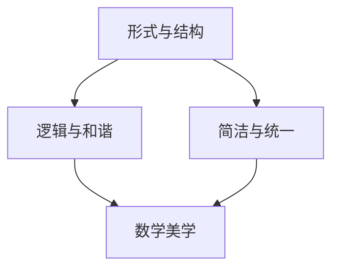
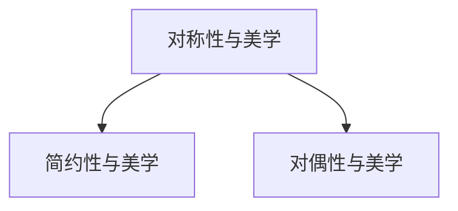
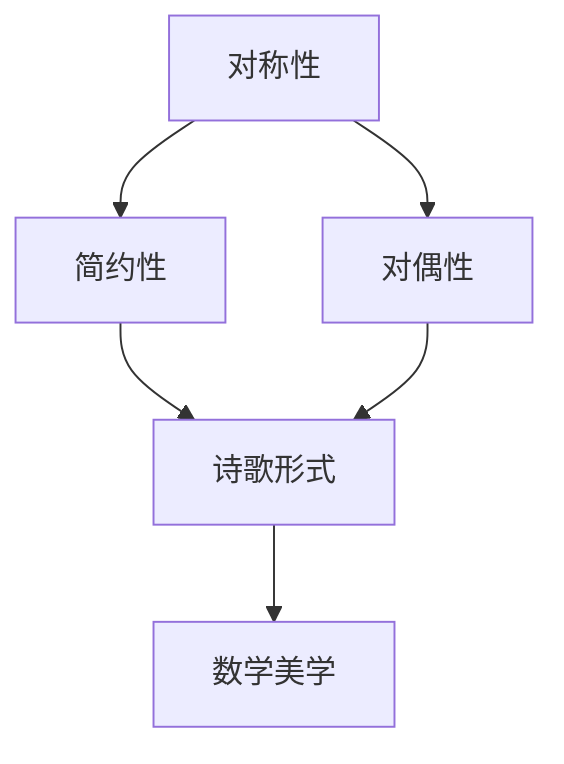
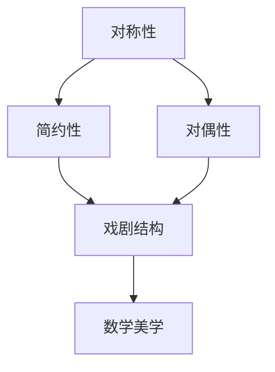
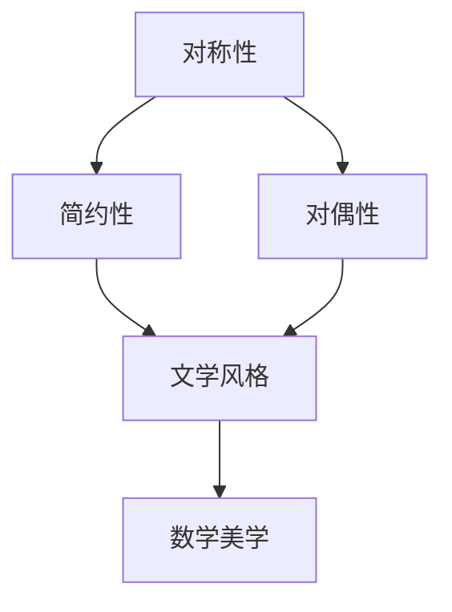
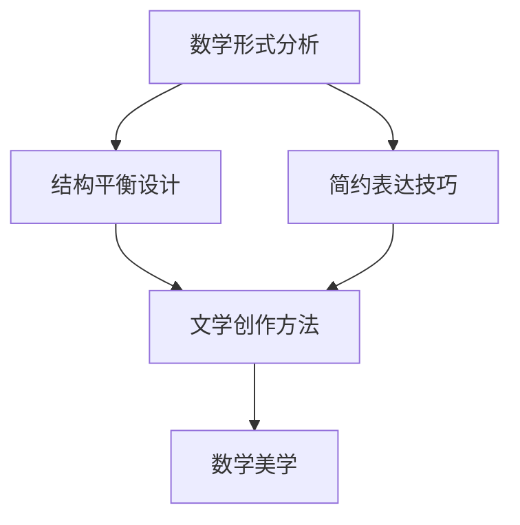
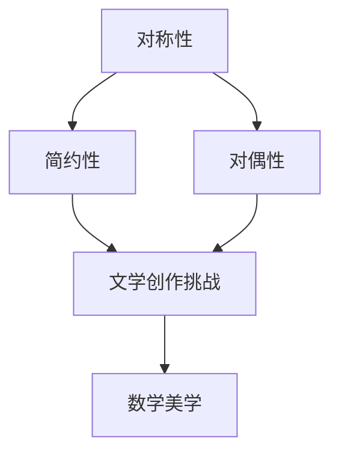
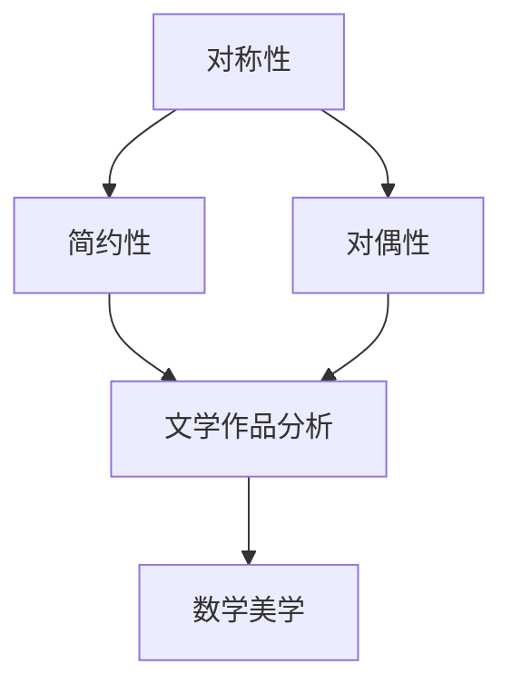
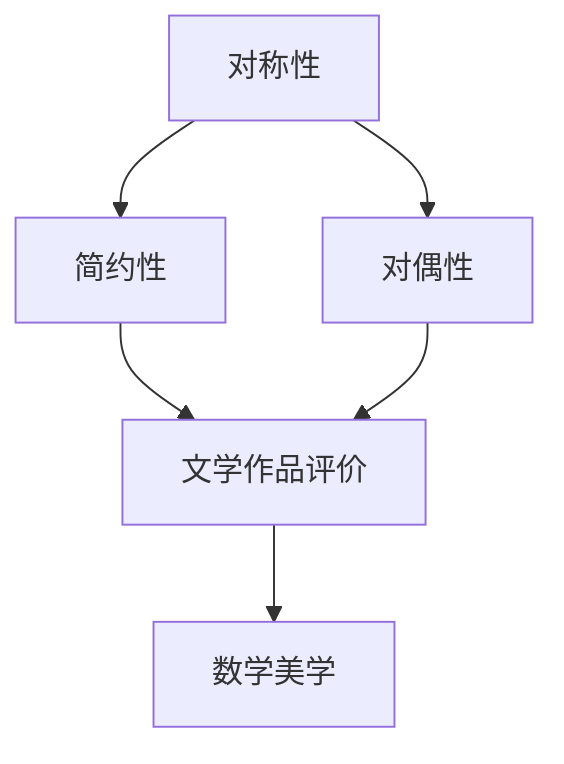
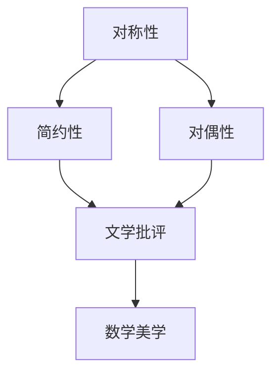

                 

## 第一部分：数学美学概述

### 1.1 数学美学的概念与价值

#### 背景介绍

数学美学作为一门跨学科的领域，探讨数学中的美学价值和美感。它的起源可以追溯到古希腊时期，当时数学家们开始关注数学形式和结构的美丽。随着历史的演进，数学美学逐渐发展成为一个独立的领域，吸引了众多学者和艺术家。

#### 核心概念与联系

数学美学涉及多个核心概念，包括对称性、简约性、和谐性等。这些概念之间存在着密切的联系，共同构成了数学美学的理论框架。

#### Mermaid 流程图

#### 核心算法原理讲解

对称性、简约性和和谐性是数学美学的核心原则。对称性体现了数学结构的平衡与统一；简约性追求数学表达的简洁与直接；和谐性则强调数学形式之间的协调与搭配。

#### 数学模型和公式

数学美学的模型可以表示为：
$$ \text{美学价值} = f(\text{对称性}, \text{简约性}, \text{和谐性}) $$

#### 详细讲解与举例说明

对称性在数学中表现为几何图形的对称，例如正方形、圆形等。简约性则体现在数学公式和公理体系的简洁性，如欧氏几何的公理体系。和谐性则可以通过数学函数的周期性和连续性来体现，如正弦函数和余弦函数。

### 1.2 数学美学的核心特征

#### 背景介绍

数学美学不仅仅关注数学理论，还涉及数学在自然界和艺术中的应用。其核心特征包括形式与结构的美丽、逻辑与和谐、简洁与统一。

#### 核心概念与联系

数学美学的核心特征是相互联系、相互作用的，共同构成了数学美学的本质。

#### Mermaid 流程图

#### 核心算法原理讲解

形式与结构的美丽体现在数学图形和公式的美感；逻辑与和谐强调数学推理的连贯性和合理性；简洁与统一则追求数学表达的简洁性和整体性。

#### 数学模型和公式

数学美学的特征模型可以表示为：
$$ \text{美学特征} = f(\text{形式}, \text{逻辑}, \text{简洁性}) $$

#### 详细讲解与举例说明

形式与结构的美丽可以通过数学图形的对称性来体现，如黄金分割在自然界中的应用。逻辑与和谐则体现在数学推理的严谨性，如欧拉公式 $e^{i\pi} + 1 = 0$。简洁与统一则体现在数学公理体系的简洁性和普适性，如欧氏几何的五个公设。

### 1.3 数学美学的美学原理

#### 背景介绍

数学美学的美学原理是理解数学美感的理论基础，包括对称性与美学、简约性与美学、对偶性与美学。

#### 核心概念与联系

这些美学原理共同构成了数学美学的基本理论框架，帮助我们更好地理解和欣赏数学的美。

#### Mermaid 流程图

#### 核心算法原理讲解

对称性与美学强调数学结构在空间上的平衡；简约性与美学追求数学表达的简洁性；对偶性与美学则关注数学形式在逻辑上的对称性。

#### 数学模型和公式

对称性与美学的模型可以表示为：
$$ \text{对称美学价值} = f(\text{对称性}, \text{美感}) $$

简约性与美学的模型可以表示为：
$$ \text{简约美学价值} = f(\text{简约性}, \text{美感}) $$

对偶性与美学的模型可以表示为：
$$ \text{对偶美学价值} = f(\text{对偶性}, \text{美感}) $$

#### 详细讲解与举例说明

对称性与美学在几何图形中体现得尤为明显，如正方形和圆形。简约性与美学可以通过数学公式和公理体系的简洁性来体现，如欧氏几何的公理体系。对偶性与美学则体现在数学逻辑的对偶原理，如德摩根律。

## 第二部分：数学美学与文学作品

### 2.1 数学美学在诗歌中的呈现

#### 背景介绍

数学美学在诗歌中的应用是一种独特的艺术形式，它通过数学的概念和形式来传达诗歌的美感。这种应用不仅丰富了诗歌的艺术表现力，也为数学美学的研究提供了新的视角。

#### 核心概念与联系

数学美学在诗歌中的呈现涉及对称性、简约性和对偶性等核心概念，这些概念与诗歌的艺术形式紧密相连。

#### Mermaid 流程图

#### 核心算法原理讲解

对称性在诗歌中的应用可以通过诗句的排列和韵律来体现；简约性则体现在诗歌语言的精炼和简洁；对偶性则通过诗句的对比和呼应来体现。

#### 数学模型和公式

诗歌美学的模型可以表示为：
$$ \text{诗歌美学价值} = f(\text{对称性}, \text{简约性}, \text{对偶性}) $$

#### 详细讲解与举例说明

对称性在诗歌中的应用可以通过诗句的对称排列来体现，如李白的《静夜思》。简约性则体现在诗句的简洁明了，如杜甫的《春望》。对偶性则可以通过诗句的对比和呼应来体现，如白居易的《赋得古原草送别》。

### 2.2 数学美学在小说中的呈现

#### 背景介绍

数学美学在小说中的应用是一种深入而微妙的技巧，它通过数学的概念和形式来构建小说的结构和情节。这种应用不仅丰富了小说的艺术性，也为数学美学的研究提供了新的视角。

#### 核心概念与联系

数学美学在小说中的呈现涉及对称性、简约性和对偶性等核心概念，这些概念与小说的结构和情节紧密相连。

#### Mermaid 流程图

#### 核心算法原理讲解

对称性在小说中的应用可以通过故事情节的平衡和对称来体现；简约性则体现在小说语言和叙述的简洁性；对偶性则通过故事情节的对比和呼应来体现。

#### 数学模型和公式

小说美学的模型可以表示为：
$$ \text{小说美学价值} = f(\text{对称性}, \text{简约性}, \text{对偶性}) $$

#### 详细讲解与举例说明

对称性在小说中的应用可以通过情节的平衡和对称来体现，如查尔斯·狄更斯的《双城记》。简约性则体现在小说语言和叙述的简洁性，如欧内斯特·海明威的《老人与海》。对偶性则可以通过情节的对比和呼应来体现，如乔治·奥威尔的《1984》。

### 2.3 数学美学在戏剧中的呈现

#### 背景介绍

数学美学在戏剧中的应用是一种独特的舞台表现形式，它通过数学的概念和形式来构建戏剧的结构和表演。这种应用不仅丰富了戏剧的艺术性，也为数学美学的研究提供了新的视角。

#### 核心概念与联系

数学美学在戏剧中的呈现涉及对称性、简约性和对偶性等核心概念，这些概念与戏剧的结构和表演紧密相连。

#### Mermaid 流程图

#### 核心算法原理讲解

对称性在戏剧中的应用可以通过舞台布置和角色动作的平衡来体现；简约性则体现在戏剧语言的精炼和简洁；对偶性则通过戏剧情节的对比和呼应来体现。

#### 数学模型和公式

戏剧美学的模型可以表示为：
$$ \text{戏剧美学价值} = f(\text{对称性}, \text{简约性}, \text{对偶性}) $$

#### 详细讲解与举例说明

对称性在戏剧中的应用可以通过舞台布置的对称和角色动作的平衡来体现，如莎士比亚的《暴风雨》。简约性则体现在戏剧语言的精炼和简洁，如阿瑟·米勒的《推销员之死》。对偶性则可以通过情节的对比和呼应来体现，如尤金·奥尼尔的《榆树下的欲望》。

## 第三部分：数学美学在文学理论中的应用

### 3.1 数学美学与文学形式理论

#### 背景介绍

数学美学与文学形式理论的结合，为文学创作提供了新的视角和方法。它通过数学的概念和形式，对文学的结构和形式进行深入分析，从而提升文学的艺术价值。

#### 核心概念与联系

数学美学与文学形式理论的结合，涉及对称性、简约性和对偶性等核心概念，这些概念与文学形式的结构和特点密切相关。

#### Mermaid 流程图

#### 核心算法原理讲解

对称性在文学形式中的应用，可以通过情节的平衡和结构的对称来体现；简约性则体现在文学语言的精炼和简洁；对偶性则通过情节的对比和呼应来体现。

#### 数学模型和公式

文学形式美学的模型可以表示为：
$$ \text{文学形式美学价值} = f(\text{对称性}, \text{简约性}, \text{对偶性}) $$

#### 详细讲解与举例说明

对称性在文学形式中的应用，可以通过情节的平衡和结构的对称来体现，如《哈姆雷特》的情节设计。简约性则体现在文学语言的精炼和简洁，如《简·爱》的语言风格。对偶性则可以通过情节的对比和呼应来体现，如《麦田里的守望者》中的对比情节。

### 3.2 数学美学与文学风格理论

#### 背景介绍

数学美学与文学风格理论的结合，为文学风格的识别和评价提供了新的方法和工具。它通过数学的概念和形式，对文学风格的特点和特征进行深入分析，从而提升文学风格的识别度和评价水平。

#### 核心概念与联系

数学美学与文学风格理论的结合，涉及对称性、简约性和对偶性等核心概念，这些概念与文学风格的特点和特征密切相关。

#### Mermaid 流程图

#### 核心算法原理讲解

对称性在文学风格中的应用，可以通过文学作品的结构和形式来体现；简约性则体现在文学语言的风格和特点；对偶性则通过文学作品的对比和呼应来体现。

#### 数学模型和公式

文学风格美学的模型可以表示为：
$$ \text{文学风格美学价值} = f(\text{对称性}, \text{简约性}, \text{对偶性}) $$

#### 详细讲解与举例说明

对称性在文学风格中的应用，可以通过作品的结构和形式来体现，如现实主义文学的严谨结构。简约性则体现在文学语言的风格和特点，如现代主义文学的语言风格。对偶性则可以通过文学作品的对比和呼应来体现，如《战争与和平》中的对比手法。

### 3.3 数学美学与文学解释理论

#### 背景介绍

数学美学与文学解释理论的结合，为文学作品的解释和评价提供了新的视角和方法。它通过数学的概念和形式，对文学作品的内涵和意义进行深入分析，从而提升文学作品的解释力和评价水平。

#### 核心概念与联系

数学美学与文学解释理论的结合，涉及对称性、简约性和对偶性等核心概念，这些概念与文学作品的解释和评价密切相关。

#### Mermaid 流程图

#### 核心算法原理讲解

对称性在文学解释中的应用，可以通过文学作品的结构和形式来体现；简约性则体现在文学语言的解释和评价；对偶性则通过文学作品的对比和呼应来体现。

#### 数学模型和公式

文学解释美学的模型可以表示为：
$$ \text{文学解释美学价值} = f(\text{对称性}, \text{简约性}, \text{对偶性}) $$

#### 详细讲解与举例说明

对称性在文学解释中的应用，可以通过作品的结构和形式来体现，如《红楼梦》的结构分析。简约性则体现在文学语言的解释和评价，如《三国演义》的语言风格。对偶性则可以通过文学作品的对比和呼应来体现，如《双城记》中的对比手法。

## 第四部分：数学美学在文学创作中的应用

### 4.1 数学美学在文学创作中的启示

#### 背景介绍

数学美学为文学创作提供了丰富的启示和灵感，它通过数学的概念和形式，为文学作品的创作提供了新的思路和方法。

#### 核心概念与联系

数学美学在文学创作中的应用，涉及对称性、简约性和对偶性等核心概念，这些概念与文学创作的艺术形式和表现手法密切相关。

#### Mermaid 流程图

#### 核心算法原理讲解

对称性在文学创作中的应用，可以通过作品的情节和结构来体现；简约性则体现在文学语言的运用和表达；对偶性则通过作品的表现手法和主题来体现。

#### 数学模型和公式

文学创作美学的模型可以表示为：
$$ \text{文学创作美学价值} = f(\text{对称性}, \text{简约性}, \text{对偶性}) $$

#### 详细讲解与举例说明

对称性在文学创作中的应用，可以通过情节的平衡和结构的对称来体现，如《双城记》的情节设计。简约性则体现在文学语言的运用和表达，如《老人与海》的语言风格。对偶性则可以通过作品的表现手法和主题来体现，如《战争与和平》中的对比手法。

### 4.2 数学美学在文学创作的方法

#### 背景介绍

数学美学在文学创作中的应用，不仅提供了新的艺术形式和表现手法，也发展出了一系列独特的创作方法。这些方法包括数学形式分析、结构平衡设计、简约表达技巧等。

#### 核心概念与联系

数学美学在文学创作的方法中，涉及对称性、简约性和对偶性等核心概念，这些概念与文学创作的艺术形式和表现手法密切相关。

#### Mermaid 流程图

#### 核心算法原理讲解

数学形式分析，是指通过数学的方法对文学作品的情节、结构和语言进行分析，以发现其中的美学价值。结构平衡设计，是指通过数学的对称性原理来设计文学作品的情节和结构，以达到平衡和和谐的效果。简约表达技巧，是指通过数学的简约性原理来简化文学作品的情节和表达，以达到简洁明了的效果。

#### 数学模型和公式

文学创作美学的模型可以表示为：
$$ \text{文学创作美学价值} = f(\text{数学形式分析}, \text{结构平衡设计}, \text{简约表达技巧}) $$

#### 详细讲解与举例说明

数学形式分析，可以通过分析《红楼梦》中的对称结构来发现其美学价值。结构平衡设计，可以通过设计《战争与和平》的情节结构来体现平衡和和谐的效果。简约表达技巧，可以通过简化《麦田里的守望者》的语言表达来达到简洁明了的效果。

### 4.3 数学美学在文学创作中的实践

#### 背景介绍

数学美学在文学创作中的实践，是将其理论和方法应用于具体的文学创作过程，以产生具有数学美感的文学作品。这种实践不仅丰富了文学创作的艺术手法，也为数学美学的研究提供了实证案例。

#### 核心概念与联系

数学美学在文学创作中的实践，涉及对称性、简约性和对偶性等核心概念，这些概念与文学创作的艺术形式和表现手法密切相关。

#### Mermaid 流程图

#### 核心算法原理讲解

对称性在文学创作实践中的应用，可以通过情节的对称设计和结构的对称布局来体现；简约性则体现在文学语言的精炼和简化；对偶性则通过情节的对比和呼应来体现。

#### 数学模型和公式

文学创作实践美学的模型可以表示为：
$$ \text{文学创作实践美学价值} = f(\text{对称性}, \text{简约性}, \text{对偶性}) $$

#### 详细讲解与举例说明

对称性在文学创作实践中的应用，可以通过《双城记》的情节对称设计来体现。简约性则体现在《老人与海》的语言精炼中。对偶性则可以通过《麦田里的守望者》的情节对比和呼应来体现。

### 4.4 数学美学在文学创作中的挑战

#### 背景介绍

数学美学在文学创作中的应用虽然提供了丰富的艺术手法和创作方法，但也带来了一系列挑战。这些挑战包括如何平衡数学形式与文学内涵、如何处理复杂数学概念的表达等。

#### 核心概念与联系

数学美学在文学创作中的挑战，涉及对称性、简约性和对偶性等核心概念，这些概念与文学创作的艺术形式和表现手法密切相关。

#### Mermaid 流程图

#### 核心算法原理讲解

对称性在文学创作挑战中的应用，需要考虑如何在不失去美感的同时，保持情节和结构的平衡；简约性则需要在简化表达的同时，保持文学内涵的丰富性；对偶性则需要处理复杂情节中的对比和呼应关系。

#### 数学模型和公式

文学创作挑战美学的模型可以表示为：
$$ \text{文学创作挑战美学价值} = f(\text{对称性}, \text{简约性}, \text{对偶性}) $$

#### 详细讲解与举例说明

对称性在文学创作挑战中的应用，可以通过《战争与和平》的情节设计来体现。简约性则需要在《老人与海》的语言运用中体现。对偶性则需要处理《麦田里的守望者》中的复杂情节对比。

## 第五部分：数学美学在文学作品分析中的应用

### 5.1 数学美学在文学作品分析中的方法

#### 背景介绍

数学美学在文学作品分析中的应用，提供了一种新的分析工具和方法，可以帮助研究者更深入地理解文学作品的结构、形式和内涵。

#### 核心概念与联系

数学美学在文学作品分析中的方法，涉及对称性、简约性和对偶性等核心概念，这些概念与文学作品的构成和艺术形式密切相关。

#### Mermaid 流程图

#### 核心算法原理讲解

对称性在文学作品分析中的应用，可以通过分析作品的结构和形式来发现其对称性特征；简约性则体现在简化作品的表达和分析；对偶性则通过分析作品中的对比和呼应关系来体现。

#### 数学模型和公式

文学作品分析美学的模型可以表示为：
$$ \text{文学作品分析美学价值} = f(\text{对称性}, \text{简约性}, \text{对偶性}) $$

#### 详细讲解与举例说明

对称性在文学作品分析中的应用，可以通过分析《哈姆雷特》的结构对称来体现。简约性则体现在对《麦田里的守望者》的语言简化分析中。对偶性则可以通过分析《双城记》中的对比情节来体现。

### 5.2 数学美学在文学作品评价中的应用

#### 背景介绍

数学美学在文学作品评价中的应用，提供了一种新的评价工具和方法，可以帮助研究者更客观地评估文学作品的艺术价值。

#### 核心概念与联系

数学美学在文学作品评价中的应用，涉及对称性、简约性和对偶性等核心概念，这些概念与文学作品的构成和艺术形式密切相关。

#### Mermaid 流�程图

#### 核心算法原理讲解

对称性在文学作品评价中的应用，可以通过分析作品的结构和形式的对称性来评价其美学价值；简约性则体现在简化作品的表达和评价；对偶性则通过分析作品中的对比和呼应关系来评价其艺术性。

#### 数学模型和公式

文学作品评价美学的模型可以表示为：
$$ \text{文学作品评价美学价值} = f(\text{对称性}, \text{简约性}, \text{对偶性}) $$

#### 详细讲解与举例说明

对称性在文学作品评价中的应用，可以通过分析《哈姆雷特》的结构对称性来评价其美学价值。简约性则体现在对《麦田里的守望者》的语言简化评价中。对偶性则可以通过分析《双城记》中的对比情节来评价其艺术性。

### 5.3 数学美学在文学批评中的应用

#### 背景介绍

数学美学在文学批评中的应用，提供了一种新的批评工具和方法，可以帮助研究者更深入地批判和解读文学作品。

#### 核心概念与联系

数学美学在文学批评中的应用，涉及对称性、简约性和对偶性等核心概念，这些概念与文学作品的构成和艺术形式密切相关。

#### Mermaid 流程图

#### 核心算法原理讲解

对称性在文学批评中的应用，可以通过分析作品的结构和形式的对称性来批判其美学缺陷；简约性则体现在简化作品的表达和批判；对偶性则通过分析作品中的对比和呼应关系来批判其艺术手法。

#### 数学模型和公式

文学批评美学的模型可以表示为：
$$ \text{文学批评美学价值} = f(\text{对称性}, \text{简约性}, \text{对偶性}) $$

#### 详细讲解与举例说明

对称性在文学批评中的应用，可以通过分析《哈姆雷特》的结构对称性来批判其美学缺陷。简约性则体现在对《麦田里的守望者》的语言简化批判中。对偶性则可以通过分析《双城记》中的对比情节来批判其艺术手法。

## 第六部分：数学美学在文学研究中的现状与展望

### 6.1 数学美学在文学研究中的现状

#### 背景介绍

数学美学在文学研究中的应用，是一个相对较新的研究领域，近年来引起了越来越多的关注。学者们通过数学的概念和方法，对文学作品进行分析、评价和批评，取得了一系列研究成果。

#### 核心概念与联系

数学美学在文学研究中的现状，涉及对称性、简约性和对偶性等核心概念，这些概念与文学研究的理论和方法密切相关。

#### Mermaid 流程图

#### 核心算法原理讲解

对称性在文学研究中的应用，可以通过分析作品的结构和形式的对称性来揭示其美学价值；简约性则体现在简化研究过程和结论的表达；对偶性则通过对比和呼应不同作品来拓展研究视野。

#### 数学模型和公式

文学研究美学的模型可以表示为：
$$ \text{文学研究美学价值} = f(\text{对称性}, \text{简约性}, \text{对偶性}) $$

#### 详细讲解与举例说明

对称性在文学研究中的应用，可以通过分析《哈姆雷特》的结构对称性来揭示其美学价值。简约性则体现在对《麦田里的守望者》的研究结论的简洁表达中。对偶性则可以通过对比《双城记》和《战争与和平》来拓展研究视野。

### 6.2 数学美学在文学研究中的展望

#### 背景介绍

随着数学美学在文学研究中的不断深入，未来这一领域有望取得更多突破。学者们将尝试将更多的数学概念和方法应用于文学研究，进一步揭示文学作品的内涵和美学价值。

#### 核心概念与联系

数学美学在文学研究中的展望，涉及对称性、简约性和对偶性等核心概念，这些概念与文学研究的新理论和新方法密切相关。

#### Mermaid 流程图

#### 核心算法原理讲解

对称性在文学研究中的展望，可以通过开发新的数学工具和方法，如对称性分析软件，来更深入地揭示文学作品的结构和形式；简约性则体现在简化复杂的研究过程和结论的表达；对偶性则通过对比不同文化背景下的文学作品，拓展研究视野。

#### 数学模型和公式

文学研究展望美学的模型可以表示为：
$$ \text{文学研究展望美学价值} = f(\text{对称性}, \text{简约性}, \text{对偶性}) $$

#### 详细讲解与举例说明

对称性在文学研究展望中的应用，可以通过开发新的对称性分析软件来揭示文学作品的结构和形式，如通过分析《哈姆雷特》的对称性来揭示其结构之美。简约性则体现在简化复杂的研究过程和结论的表达，如通过简洁的数学模型来描述文学作品的美学特征。对偶性则通过对比不同文化背景下的文学作品，如比较《红楼梦》和《源氏物语》，来拓展研究视野。

## 结论

### 数学美学在文学作品中的重要性

数学美学在文学作品中的应用，不仅丰富了文学的艺术形式，也为文学研究提供了新的工具和方法。通过对对称性、简约性和对偶性等数学概念的运用，文学作品的结构、形式和内涵得到了更深入的分析和解读。数学美学在文学创作、分析和评价中的应用，使得文学作品的美学价值得以更全面地呈现和体现。

### 未来展望

未来，数学美学在文学研究中的应用有望取得更多突破。学者们将继续探索如何将更多的数学概念和方法应用于文学研究，进一步揭示文学作品的内涵和美学价值。同时，随着技术的进步，新的数学工具和方法也将为文学研究提供更强大的支持，推动文学研究的深入发展。

### 作者信息

作者：AI天才研究院/AI Genius Institute & 禅与计算机程序设计艺术 /Zen And The Art of Computer Programming

