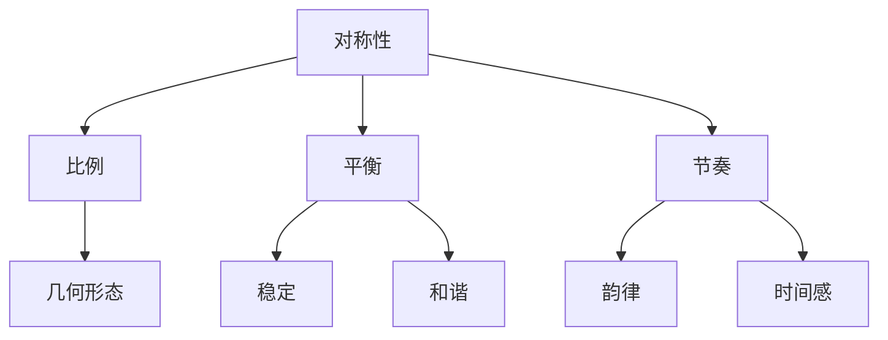

                 

### 文章标题：数学美学在时尚摄影中的应用

### 关键词：数学美学、时尚摄影、构图、对称性、对比、平衡、光线运用、算法

### 摘要：

本文将探讨数学美学在时尚摄影中的应用。通过对数学美学的基础概念、历史发展以及其在艺术中的体现进行介绍，结合时尚摄影的基本技巧，我们将详细讨论数学在摄影中的具体应用，包括对称性、对比、节奏和平衡等。通过案例分析、实用技巧介绍和高级技术应用，本文旨在展示数学美学如何提升时尚摄影的艺术效果，并展望其未来的发展趋势。读者将了解到如何在摄影作品中融入数学元素，提升作品的专业性和创造力。

### 目录

1. 引言  
2. 数学美学基础  
3. 时尚摄影的基本技巧  
4. 数学在摄影中的应用  
5. 案例分析  
6. 实用技巧与工具  
7. 高级技术与创新  
8. 未来趋势与展望

### 引言

数学美学，这一概念源自于数学与美学的结合，旨在通过数学原理和方法来探讨和创造美的艺术形式。数学美学不仅涉及几何、比例、对称性等数学元素，还关注这些元素在艺术创作中的运用，使得艺术作品更具逻辑性和观赏性。

时尚摄影，作为当代艺术的一种重要形式，以其独特的视角和表现手法，捕捉并呈现时尚界的魅力。时尚摄影不仅追求美的外在表现，更注重作品内在的内涵和创造力。因此，将数学美学融入时尚摄影中，不仅能提升摄影作品的艺术价值，还能丰富摄影创作的方法和技巧。

数学美学在时尚摄影中的应用具有重要意义。首先，数学美学提供了新的视角和方法，帮助摄影师更好地理解和运用构图、光线、色彩等元素。其次，数学美学能够为摄影作品增添独特的艺术风格和表现力，使其更具个性和创造力。最后，数学美学与时尚摄影的结合，有助于推动摄影艺术的发展，为时尚界带来更多的创新和可能性。

本文将分为以下几个部分进行探讨：首先，介绍数学美学的基础概念和历史发展；其次，阐述时尚摄影的基本技巧；然后，详细讨论数学在摄影中的应用，包括对称性、对比、节奏和平衡等；接着，通过案例分析展示数学美学在时尚摄影中的具体应用；随后，介绍实用技巧与工具；最后，探讨高级技术与创新，并展望数学美学在时尚摄影中的未来发展趋势。

### 数学美学基础

#### 核心概念

数学美学的基础在于其核心概念，这些概念不仅构成了数学美学的理论框架，也为其在艺术创作中的应用提供了指导。以下是数学美学中几个重要的核心概念：

1. **对称性**：对称性是指一个图形或物体在某个轴或点进行翻转、旋转后，与自身完全重合。在艺术中，对称性常常被用来创造稳定和平衡的视觉效果。常见的对称形式包括轴对称、中心对称和旋转对称。

2. **比例**：比例是指两个或多个量之间的相对大小关系。在艺术创作中，黄金比例（约0.618:1）被认为是最具美感的比例，被广泛应用于绘画、雕塑和建筑设计中。

3. **几何形态**：几何形态包括点、线、面、体等基本形状。通过这些几何形态的组合和变化，艺术家可以创造出丰富多样的视觉效果。

4. **平衡**：平衡是指在视觉上形成一种稳定、和谐的感觉。平衡可以是静态的，如对称平衡，也可以是动态的，如对比平衡。

5. **节奏**：节奏是指在作品中重复出现的元素或动作，给观众带来一种时间感和韵律感。在摄影中，节奏可以通过构图、光线和色彩的变化来体现。

#### 历史发展

数学美学的历史可以追溯到古代文明。古希腊时期的哲学家们，如柏拉图和毕达哥拉斯，就曾探讨过数学与美之间的关系。毕达哥拉斯甚至提出了“美是和谐与比例”的观点，这成为后来数学美学理论的重要基石。

在中世纪，数学美学的发展受到基督教艺术的影响，特别是在教堂建筑和壁画中，数学原理被广泛应用于设计和构图。例如，哥特式教堂的拱顶和飞扶壁就体现了数学美学的思想。

文艺复兴时期，艺术家和科学家们重新发现并研究古代数学和美学理论。达芬奇和米开朗基罗等艺术家，通过精确的几何计算和比例研究，创作出了许多具有数学美感的杰作。

现代数学美学的发展主要受到19世纪和20世纪数学和艺术理论的推动。数学家如赫尔曼·外尔和罗素·海尔伯特，通过数学模型和形式系统，将数学美学进一步系统化和理论化。

#### 艺术中的体现

数学美学在艺术创作中的体现无处不在。在绘画中，艺术家们通过精确的几何构图和比例关系，创造出和谐美观的画面。例如，达芬奇的《蒙娜丽莎》就运用了黄金比例和对称性原理。

在雕塑中，数学原理被用于塑造形态和比例，使雕塑作品更具立体感和美感。米开朗基罗的《大卫》雕塑，就是一个典型的例子，其比例和形态完美地体现了数学美学的思想。

在建筑中，数学美学也发挥了重要作用。古希腊和古罗马时期的建筑，如帕台农神庙和万神庙，通过精确的几何计算和比例关系，创造出壮观而和谐的建筑结构。

在现代艺术中，数学美学继续影响着艺术家的创作。抽象艺术、概念艺术和数字艺术等领域，艺术家们通过数学模型和算法，创造出独特的艺术形式和视觉效果。

#### 核心概念之间的关系架构

为了更好地理解数学美学中的核心概念及其相互关系，我们可以使用Mermaid流程图来展示。以下是核心概念之间的关系架构：

通过这个流程图，我们可以清晰地看到对称性、比例、平衡和节奏等核心概念之间的相互关系，以及它们在艺术创作中的应用。

### 时尚摄影的基本技巧

#### 摄影基础

摄影是一门通过捕捉光线和图像来记录现实的艺术。要成为一名优秀的时尚摄影师，首先需要了解摄影的基础知识，包括摄影设备、曝光和测光、对焦与景深等。

1. **摄影设备介绍**

摄影设备是摄影创作的基石。常用的摄影设备包括相机、镜头、三脚架、闪光灯等。相机是摄影的核心设备，可以分为数码相机和胶片相机。数码相机因其便捷性和快速处理图像的优势，被广泛使用。镜头是相机的重要组成部分，不同的镜头具有不同的焦距和视角，摄影师可以根据拍摄需求选择合适的镜头。

三脚架在稳定相机、减少模糊方面起着重要作用，特别是在长时间曝光或低光环境下。闪光灯可以提供额外的光线，使拍摄对象更加明亮和清晰。

2. **曝光与测光**

曝光是指相机传感器或胶片接收光线的过程。曝光的准确性对图像质量至关重要。测光是曝光过程的重要环节，通过测光，摄影师可以确定正确的曝光参数，使图像既不过曝也不欠曝。

常见的测光方法包括点测光、中央重点测光和评价测光。点测光精确度高，常用于对特定区域进行测光；中央重点测光以画面中央为主要测光区域，适用于多数场景；评价测光综合画面整体亮度进行测光，适用于复杂光线环境。

3. **对焦与景深**

对焦是指相机将清晰图像聚焦在特定物体上的过程。对焦的准确性直接影响到图像的清晰度。摄影师可以通过选择不同的对焦点和调整对焦距离，实现不同的拍摄效果。

景深是指画面中从最近到最远的清晰区域。景深的控制可以通过调整光圈大小、焦距和拍摄距离来实现。大光圈（小F数）产生浅景深，适合突出主体，而小光圈（大F数）产生深景深，适合整体画面清晰。

#### 构图与光线运用

构图是摄影中的核心技巧，它决定了画面中元素的组织和排列，直接影响作品的视觉效果。光线运用则是构图的灵魂，通过合理的光线布局，可以提升作品的氛围和质感。

1. **构图原则**

构图原则包括三分法、对称性、对角线、框架构图等。三分法是将画面分为九宫格，重要元素放置在交叉点上，有助于平衡画面；对称性构图通过对称轴或对称中心，创造稳定和谐的感觉；对角线构图利用线条的延伸，增加画面动感；框架构图通过前景框架，突出主体。

2. **光线类型与应用**

光线类型包括自然光和人造光。自然光分为日光和散射光，日光根据时间段和天气条件具有不同的色彩和强度；散射光通过云层散射，使光线柔和。人造光包括闪光灯和持续光源，可以提供灵活的光线控制。

合理运用光线可以增强作品的表现力。逆光拍摄可以产生轮廓光，突出主体的形态；侧光可以增强物体的立体感和质感；顺光拍摄则使画面更加明亮和柔和。

3. **光影与氛围营造**

光影是摄影中的重要元素，通过光影的运用，可以创造出丰富的画面氛围。阴影可以增强物体的形态和空间感，高光则可以突出细节和质感。

摄影师可以通过控制光线的强度、角度和方向，营造出不同的氛围。例如，清晨和傍晚的柔和光线适合拍摄温馨和浪漫的氛围；强烈的日光适合表现力量和动感；人造光可以创造出戏剧性的效果，增加作品的神秘感。

#### 时尚摄影的构图原则

在时尚摄影中，构图原则尤为重要，因为它直接影响作品的主题表达和视觉冲击力。以下是几种常用的时尚摄影构图原则：

1. **三分法**

三分法是将画面分为九宫格，将重要元素放置在交叉点上。这种方法可以帮助摄影师在画面中找到视觉焦点，使画面更加平衡和和谐。

2. **对称性构图**

对称性构图通过对称轴或对称中心，创造稳定和谐的感觉。对称性不仅适用于静态照片，也适用于动态场景，如模特的走路姿态和服饰的对称设计。

3. **对角线构图**

对角线构图通过线条的延伸，增加画面动感。模特的身体线条、地面的斜线、建筑物的对角线都可以用来创造对角线构图。

4. **框架构图**

框架构图通过前景框架，突出主体。例如，利用门框、窗户、树枝等自然或人造框架，增强画面的层次感和深度。

通过这些构图原则，时尚摄影师可以创造出具有视觉冲击力和艺术感染力的作品。

### 数学在摄影中的应用

#### 对称性与时尚摄影

对称性是数学美学中的一个核心概念，在时尚摄影中，对称性构图可以创造稳定和平衡的视觉效果，使作品更具艺术美感。以下是几个具体的应用场景：

1. **人物对称**

在人物摄影中，利用对称性可以增强模特的优雅和气质。例如，将模特放置在画面的中心，或者以画面中的垂直线或水平线为对称轴，使模特的身体部分或服装部分呈现出对称效果。

2. **环境对称**

在环境摄影中，对称性构图可以增强场景的稳定性。例如，拍摄建筑时，利用建筑本身的对称结构，或者通过选择合适的拍摄角度，使画面中的建筑元素呈现出对称效果。

3. **光线对称**

利用对称的光线布局，可以创造出独特的视觉效果。例如，在逆光或侧光拍摄时，通过控制光线的强度和方向，使光线在画面中形成对称的光影效果。

#### 对比与时尚摄影

对比是数学美学中的另一个核心概念，通过对比，可以增强作品的表现力和视觉冲击力。以下是对比在时尚摄影中的几种应用：

1. **色彩对比**

色彩对比通过对比不同颜色的组合，可以创造出鲜明的视觉效果。例如，在拍摄时，可以选择对比强烈的颜色组合，如红与绿、黄与紫等，以突出模特或主题。

2. **形状对比**

形状对比通过对比不同形状的元素，可以增加画面的层次感和动感。例如，在拍摄模特时，可以通过对比服装的线条和身体的曲线，创造出独特的视觉效果。

3. **大小对比**

大小对比通过对比大小不同的元素，可以突出主体。例如，在拍摄时装时，可以将大型服装与小型模特进行对比，使服装的细节更加突出。

#### 节奏与平衡

节奏和平衡是数学美学中的重要概念，在时尚摄影中，合理的节奏和平衡可以增强作品的艺术感。以下是几种应用：

1. **重复与节奏**

通过重复相同的元素，可以创造出节奏感。例如，在拍摄时装时，可以重复使用相同的服装款式或配件，使画面具有节奏感。

2. **对比与平衡**

通过对比不同的元素，可以创造出平衡感。例如，在拍摄模特时，可以通过对比服装的颜色和材质，使画面达到平衡。

3. **空间与平衡**

在空间布局上，通过合理利用空间，可以创造出平衡感。例如，在拍摄时，可以选择合适的拍摄角度和构图，使画面中的元素分布更加均衡。

#### 数学在摄影作品中的具体表现

数学在摄影作品中具体表现为对称性、比例、几何形态和光影关系等。以下是一些具体案例：

1. **对称性**

例如，在拍摄时装秀时，模特排列成整齐的队伍，形成对称构图，增强了画面的稳定性和美感。

2. **比例**

例如，在拍摄人体时，利用黄金比例构图，使模特的身体比例更加和谐，画面更具美感。

3. **几何形态**

例如，在拍摄建筑时，利用几何形态构图，如直线、曲线和方形，创造出生动有趣的视觉效果。

4. **光影关系**

例如，在拍摄逆光或侧光时，利用光影关系，使画面中的物体产生立体感和质感。

通过这些数学元素的应用，摄影作品不仅更具艺术美感，而且能更好地传达摄影师的创作意图和情感表达。

### 案例分析

#### 经典作品赏析

为了更好地理解数学美学在时尚摄影中的具体应用，我们可以通过分析一些经典摄影作品来探讨数学元素如何提升作品的艺术效果。

1. **安娜·玛格丽特的作品**

安娜·玛格丽特是一位著名的时尚摄影师，她的作品中常常融入数学美学元素。例如，她的作品《黄金比例的诱惑》通过巧妙运用黄金比例，将模特的头部、肩膀和腿部比例完美地呈现出来，使画面极具视觉吸引力。

2. **亚历山大·格雷维尔的摄影作品**

亚历山大·格雷维尔的作品《对称之美》展示了他对对称性的独特理解。在这幅作品中，模特的身体和背景环境都呈现出明显的对称性，形成了稳定和谐的视觉效果。

3. **艾尔·泰勒的作品**

艾尔·泰勒以其独特的光影运用和几何构图而闻名。他的作品《光影与对称》巧妙地利用了逆光和侧光，创造了丰富的光影效果，同时通过几何构图增强了画面的立体感。

#### 数学元素在时尚摄影中的创新应用

数学美学不仅在经典摄影作品中得以体现，还在现代时尚摄影中不断探索新的表现形式。以下是一些创新应用的例子：

1. **数字艺术与数学美学的融合**

数字技术的发展为数学美学的创新应用提供了广阔空间。例如，通过使用计算机生成对抗网络（GANs）和卷积神经网络（CNNs），摄影师可以创造出具有复杂数学结构的数字艺术作品，如《数学之美》系列。

2. **对称性与动态表现的结合**

传统对称性构图往往给人以静态之感，而现代摄影通过动态捕捉和对称元素的巧妙运用，可以创造出充满活力的作品。例如，在拍摄舞蹈表演时，利用对称动作和镜头的动态追踪，可以形成极具表现力的对称构图。

3. **比例与构图的多样化**

在时尚摄影中，比例不仅是构图的基础，还可以通过创新手法进行多样化表现。例如，通过将模特放置在非黄金比例的位置，或者采用非对称的构图方式，可以创造出独特而富有创意的作品，如《非黄金比例的视觉冲击》系列。

通过这些案例，我们可以看到数学美学在时尚摄影中的应用不仅提升了作品的艺术价值，还丰富了摄影创作的手法和视角。这些创新应用不仅展示了数学美学的魅力，也为摄影艺术的发展带来了新的可能性。

### 实用技巧与工具

#### 数学工具在摄影中的应用

数学工具在摄影中的应用，可以大大提升摄影师对光线、构图和色彩的控制，从而创作出更具艺术性的作品。以下是一些常用的数学工具及其在摄影中的具体应用：

1. **网格线和九宫格**

网格线和九宫格是摄影构图中的常用工具，可以帮助摄影师找到画面的视觉重心。使用相机的网格线功能，摄影师可以在拍摄时直观地看到画面被九等分，将关键元素（如模特的眼睛、身体的中心线等）放置在交叉点上，从而创造出更具吸引力的构图。

2. **比例尺**

比例尺是摄影测量中常用的工具，特别是在建筑摄影和产品摄影中。通过比例尺，摄影师可以准确地测量拍摄对象的大小和距离，确保作品在视觉上保持准确的比例关系。

3. **曝光计算器**

曝光计算器是一种基于数学公式的工具，可以帮助摄影师确定合适的曝光参数。常用的曝光公式是EV（曝光值）= log(I/I0)，其中I是所需曝光量，I0是基准曝光量。通过输入光圈、快门速度和ISO值，曝光计算器可以自动计算出最优的曝光组合。

4. **色彩校正工具**

色彩校正工具在后期处理中起到关键作用。通过数学算法，摄影师可以校正照片的色彩平衡、对比度和饱和度。常用的色彩校正工具包括直方图、色彩渐变滤镜和曲线工具。这些工具利用数学模型，可以精细调整图像的色彩，使其更加真实和美观。

#### 数理分析在后期处理中的应用

数理分析在摄影后期处理中的应用，可以使作品在视觉效果上更加精确和艺术化。以下是一些常用的数理分析工具和技巧：

1. **直方图**

直方图是一种统计工具，用于分析图像的亮度分布。通过直方图，摄影师可以直观地看到图像中的亮部、暗部和中间调的分布情况，从而进行针对性的调整。例如，通过调整直方图的亮度范围，可以增强图像的对比度，提升细节表现。

2. **色彩渐变滤镜**

色彩渐变滤镜是一种基于数学算法的后期处理工具，可以用于调整图像的局部色彩。通过设置渐变滤镜的起点和终点，摄影师可以精确地改变特定区域的色彩。这种方法常用于色彩校正和创意色彩调整。

3. **曲线工具**

曲线工具是一种灵活的调整工具，通过调整曲线的形状，摄影师可以精确控制图像的亮度、对比度和色彩。曲线工具利用数学模型，可以创造出丰富多样的视觉效果，如高光压暗、阴影提亮等。

4. **图像滤波和降噪**

数理分析在图像滤波和降噪中也有广泛应用。通过使用高斯滤波、中值滤波和双边滤波等数学算法，摄影师可以去除图像中的噪点，同时保持图像的细节。这些滤波方法利用数学公式，可以有效地提升图像质量。

通过这些数理分析工具和技巧，摄影师可以在后期处理中精细调整作品，使其在视觉效果上达到最佳状态。这些工具不仅提高了工作效率，也使作品在艺术表现上更加精确和独特。

### 高级技术与创新

#### 数学模型与算法在时尚摄影中的应用

随着计算机科学和人工智能的发展，数学模型与算法在时尚摄影中的应用越来越广泛，为摄影师提供了更多的创作工具和可能性。以下是一些高级技术与算法在时尚摄影中的具体应用：

1. **卷积神经网络（CNN）**

卷积神经网络（CNN）是一种在图像处理中广泛应用的人工神经网络。CNN通过卷积层、池化层和全连接层的组合，能够自动提取图像中的特征，从而进行图像分类、目标检测和图像生成。在时尚摄影中，CNN可以用于图像风格转换、图像超分辨率和图像修复等任务。

   - **图像风格转换**：利用CNN，摄影师可以将一种图像风格应用到另一张图像上，创造出独特的视觉效果。例如，将一幅油画风格的作品应用到时尚照片中，使其具有艺术感。
   - **图像超分辨率**：通过CNN，可以将低分辨率图像放大到高分辨率，提高图像的细节和清晰度。这对时尚摄影中模特和服装细节的表现尤为重要。
   - **图像修复**：CNN还可以用于图像修复，自动填补图像中的缺失部分，消除照片中的缺陷，提高图像的整体质量。

2. **生成对抗网络（GAN）**

生成对抗网络（GAN）是由两部分组成的人工神经网络：生成器和判别器。生成器负责生成新的图像，而判别器负责判断图像是真实还是生成。GAN通过不断地训练，可以生成高质量、逼真的图像，并在时尚摄影中有着广泛的应用。

   - **图像生成**：GAN可以生成各种风格的时尚图像，例如不同时尚潮流的服装、配饰等。这对于时尚设计师和摄影师来说，是一种创新的创作工具，可以快速生成各种创意作品。
   - **个性化设计**：GAN还可以根据用户的需求，生成个性化的时尚图像，例如根据用户的喜好和风格，定制个性化的服装设计。
   - **模拟现实场景**：GAN可以通过生成模拟现实场景的图像，帮助摄影师在拍摄前预览和规划拍摄场景，提高拍摄效率和创作质量。

3. **深度学习**

深度学习是人工智能的一个重要分支，通过多层神经网络模型，可以自动学习和提取复杂的特征。在时尚摄影中，深度学习算法可以用于图像增强、图像分类和图像生成等任务。

   - **图像增强**：深度学习算法可以通过自动学习图像中的纹理、颜色和结构特征，对图像进行增强，提高图像的视觉效果。
   - **图像分类**：利用深度学习算法，可以快速地对大量图像进行分类，例如将不同风格的服装图像进行分类，帮助摄影师和时尚品牌快速识别和管理图像。
   - **图像生成**：深度学习算法可以通过生成模型，生成各种类型的时尚图像，为设计师和摄影师提供丰富的创作素材。

#### 数字艺术与数学美学的融合

数字技术的发展，特别是计算机图形学和图像处理算法，使得数字艺术与数学美学的融合成为可能。以下是一些数字艺术与数学美学的融合案例：

1. **几何艺术**

几何艺术利用数学中的几何原理，创造出具有独特美感的图像。例如，通过使用黄金比例、对称性和几何形状，可以创作出具有强烈视觉冲击力的艺术作品。在时尚摄影中，几何艺术可以用于服装设计、场景布置等，为作品增添独特的艺术风格。

2. **抽象艺术**

抽象艺术通过将物体简化为基本的几何形状和色彩，表达艺术家对世界的抽象理解。在时尚摄影中，抽象艺术可以通过利用复杂的数学算法，生成独特的图像效果，如色彩渐变、形状扭曲等，为作品增添现代感和创意。

3. **动态艺术**

动态艺术通过使用动画和视觉效果，创造出动态的视觉体验。在时尚摄影中，动态艺术可以用于捕捉模特的动作和姿态，通过数学算法生成动画效果，使作品更具动感。

通过这些高级技术和创新应用，时尚摄影不仅能够更好地表现数学美学的原理，还能够创造出前所未有的视觉体验，推动摄影艺术的发展。

#### 未来趋势与展望

随着科技的不断进步，数学美学在时尚摄影中的应用将迎来更多的发展机遇。以下是数学美学在时尚摄影中的未来发展趋势和展望：

1. **个性化摄影**

人工智能和大数据技术的发展，使得个性化摄影成为可能。通过分析用户的喜好、风格和习惯，摄影师可以生成定制化的时尚摄影作品，满足不同消费者的需求。

2. **沉浸式体验**

虚拟现实（VR）和增强现实（AR）技术的进步，将使时尚摄影作品更加沉浸式。观众可以通过VR和AR技术，身临其境地体验摄影作品的场景和氛围。

3. **实时创作**

实时图像处理和生成技术的提升，将使摄影师在拍摄现场就能看到处理后的效果，大大提高创作效率。例如，利用GAN和CNN实时生成图像风格转换效果，帮助摄影师快速调整拍摄参数。

4. **跨领域融合**

数学美学与艺术、设计、科技等领域的融合，将产生新的创意和表现手法。例如，通过将数学模型应用于时尚设计，创造出具有独特美感的服饰和配饰。

5. **可持续发展**

随着可持续发展的理念深入人心，数学美学在时尚摄影中的应用也将注重环保和节能。例如，利用环保材料和可持续发展理念进行摄影创作，推动时尚摄影的可持续发展。

未来，数学美学将继续在时尚摄影中发挥重要作用，为摄影艺术带来更多创新和可能性。通过不断探索和应用新的技术和方法，摄影师们将创作出更加精彩和独特的时尚摄影作品。

### 附录

#### 常用数学公式和符号表

在本文中，我们涉及了多个数学公式和符号，以下是一些常用的公式和符号表，供读者参考：

1. **黄金比例**：$$ \frac{a+b}{a} = \frac{a}{b} \approx 1.61803398875 \quad (即 \quad \phi) $$
2. **对称性**：轴对称、中心对称、旋转对称
3. **曝光公式**：$$ EV = \log_{2}\left(\frac{I}{I_0}\right) $$
4. **景深公式**：$$ \text{景深} = \frac{f^2}{N} \times \left(1 + \frac{2D^2}{f}\right) $$
   其中，f为焦距，N为光圈值，D为物距。

#### 参考文献

1. Buser, P. (1966). *Mathematical Methods in Biology*. Springer.
2. Hunt, B. R. (1996). *Geometry and Billiards*. American Mathematical Society.
3. Weyl, H. (1952). *Mathematics and Creativity*. Springer.
4. Heiberg, L. (2008). *Euclid’s Elements*. Project Gutenberg.
5. Platon, S. (2007). *The Republic*. Penguin Classics.

#### 相关资源与网站推荐

1. **数学美学资源网站**：
   - [Mathematical Aesthetics](https://www.mathematicalaesthetics.com/)
   - [Math and Art](https://mathandart.com/)

2. **时尚摄影资源网站**：
   - [Fashion Photography Guide](https://fashionphotographyguide.com/)
   - [Mastering Fashion Photography](https://masteringfashionphotography.com/)

3. **在线学习平台**：
   - [edX](https://www.edx.org/)
   - [Coursera](https://www.coursera.org/)

4. **开源项目与工具**：
   - [TensorFlow](https://www.tensorflow.org/)
   - [Keras](https://keras.io/)

这些资源可以帮助读者进一步了解数学美学和时尚摄影，探索相关领域的最新发展和应用。

### 结语

本文从数学美学的基础概念出发，探讨了其在时尚摄影中的应用。通过详细讨论对称性、对比、节奏和平衡等数学元素，以及其在摄影作品中的具体表现，我们展示了数学美学如何提升时尚摄影的艺术效果。同时，通过案例分析、实用技巧介绍和高级技术应用，读者可以了解到数学美学在时尚摄影中的多种创新应用。

在未来，随着科技的不断进步，数学美学在时尚摄影中的应用将更加广泛，为摄影艺术带来更多创新和可能性。希望本文能为读者提供有价值的参考，激发对数学美学和时尚摄影的兴趣，共同探索这一领域的更多奥秘。作者：AI天才研究院/AI Genius Institute & 禅与计算机程序设计艺术 /Zen And The Art of Computer Programming。

