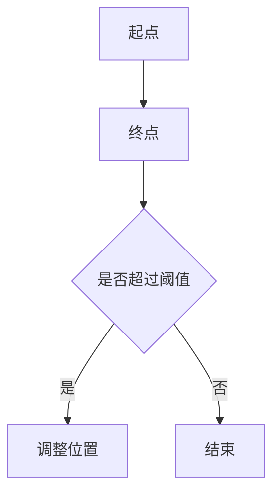
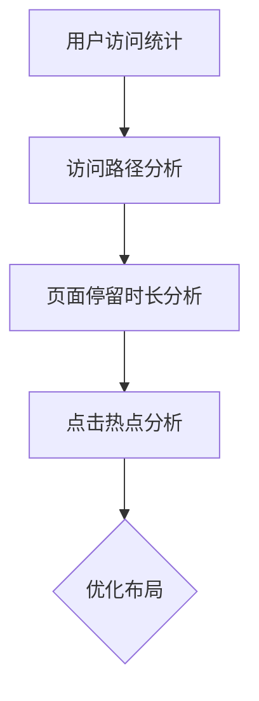
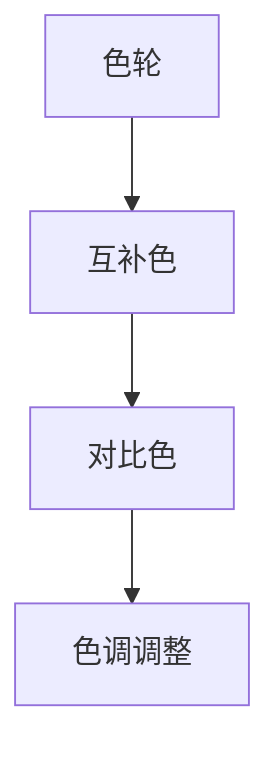
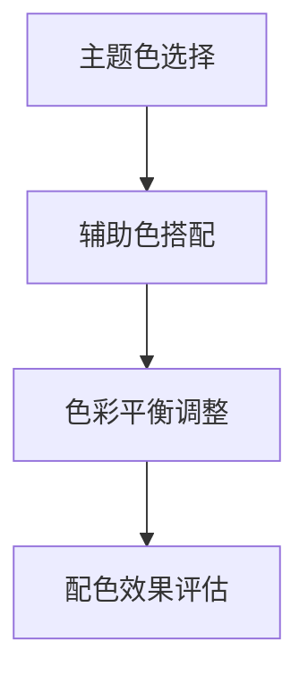

                 


### 文章标题
数学美学在网页设计中的应用

> 关键词：数学美学，网页设计，几何学，代数学，黄金分割，用户体验，设计原则

> 摘要：
本文将深入探讨数学美学在网页设计中的应用，通过分析几何学和代数学的原理，展示如何将数学元素融入网页设计中，提高网页的美感和用户体验。文章还将通过实际案例，说明数学美学在网页布局、配色和动画设计中的具体应用，并总结出一套最佳实践，为网页设计师提供有价值的参考。

---

# 引言

在网页设计中，美学的重要性不言而喻。一个好的网页设计不仅需要外观美观，还需要能够吸引用户的眼球，提高用户的满意度和留存率。近年来，随着互联网的快速发展，网页设计的趋势也在不断演变。从传统的平面设计到动态交互设计，设计师们不断地探索新的设计理念和方法。在这一过程中，数学美学逐渐崭露头角，成为提高网页设计质量的重要工具。

数学美学是指将数学的原理、形式和结构应用于艺术和设计领域，追求和谐、平衡和美感。在网页设计中，数学美学的应用不仅能够提升网页的视觉表现力，还能够优化用户体验，增强网页的功能性和实用性。本文将围绕数学美学在网页设计中的应用，展开深入探讨。

本文的结构如下：

1. **数学美学基础**：介绍数学美学的基本概念、核心要素及其在网页设计中的重要性。
2. **网页设计中的数学原理**：详细讲解几何学和代数学在网页设计中的应用，包括黄金分割、比例与平衡等。
3. **数学公式与网页设计**：介绍数学公式在网页设计中的实际应用，包括布局公式、交互式数学公式等。
4. **项目实战**：通过实际案例，展示数学美学在网页设计中的具体应用，包括主页设计、动画设计等。
5. **总结与展望**：总结数学美学在网页设计中的贡献，展望未来发展趋势和挑战。

希望通过本文的探讨，能够为网页设计师提供新的设计思路和工具，提升网页设计的质量和用户体验。

# 数学美学基础

数学美学是数学与美学交叉的领域，它探讨数学结构、形式和理论在艺术和设计中的应用。数学美学不仅关注数学在艺术创作中的应用，还涉及数学理论对设计原则和视觉元素的影响。在网页设计中，数学美学的应用主要体现在以下几个方面：

1. **几何学与视觉布局**：几何学是数学美学的重要基础，它通过研究形状、空间和比例等概念，为网页设计提供了丰富的理论支持。例如，黄金分割比例是几何学中的一个重要概念，它通过0.618的分割比例，能够创造出视觉上和谐且吸引人的布局。
2. **代数学与设计原则**：代数学中的方程和函数可以用于网页设计的各种方面，如布局的自动生成、颜色搭配的优化等。通过代数学的方法，设计师可以更精确地控制网页元素的排列和交互。
3. **数学模型与视觉效果**：数学模型可以用于创建各种视觉效果，如动画、图表等。这些视觉效果不仅美观，还能够传达复杂的数学概念，增强网页的互动性和吸引力。

## 数学美学的核心要素

数学美学中的核心要素包括对称性、比例与平衡、节奏与韵律等。这些要素不仅在数学中有着重要的地位，也在网页设计中扮演着关键角色。

### 对称性

对称性是数学美学中的一个重要概念，它通过平衡和重复创造视觉上的稳定感和美感。在网页设计中，对称性可以应用于布局、元素排列和颜色搭配等方面。例如，一个具有对称布局的网页通常会更加稳定和吸引人，因为它给人一种和谐且平衡的感觉。

#### 应用实例

- **布局对称**：一个典型的例子是许多新闻网站和电子商务网站采用的中轴对称布局，这种布局能够将重要信息对称地分布在页面的两侧，使页面看起来更加整洁和有序。
- **颜色对称**：在颜色搭配上，对称性可以通过对比色或类似色的组合来实现。例如，一个红色和绿色对称的导航条可以吸引注意力，同时也保持整体的和谐感。

### 比例与平衡

比例与平衡是数学美学中的另一个重要概念，它通过研究形状、大小和空间关系，创造视觉上的平衡感和美感。在网页设计中，比例与平衡的应用主要体现在布局和元素设计上。

#### 应用实例

- **黄金分割比例**：黄金分割比例（大约为1:1.618）是设计中常用的一个比例关系，它能够创造出视觉上最和谐的比例。许多知名网站，如苹果公司的网站，都采用了黄金分割比例来布局页面元素。
- **平衡布局**：在网页设计中，平衡布局可以通过对比、重复和层次感来实现。例如，一个复杂的页面可以通过对比不同的颜色、大小和形状来创造视觉平衡，从而提升整体的美感。

### 节奏与韵律

节奏与韵律是数学美学中探讨时间、空间和动态变化的要素。在网页设计中，节奏与韵律可以通过动画、滚动和交互等元素来实现，从而提升用户的体验和页面的动态感。

#### 应用实例

- **动画节奏**：在网页设计中，动画可以用于导航、按钮和内容展示等，通过控制动画的速度和频率，可以创造不同的节奏感。一个流畅的动画可以提升页面的动态效果，吸引用户的注意力。
- **滚动韵律**：通过控制滚动速度和动画效果，可以创造不同的滚动体验。例如，一个慢速滚动的页面可以给人一种平静和思考的感觉，而一个快速滚动的页面则可以创造出紧张和兴奋的氛围。

通过以上几个核心要素的运用，数学美学能够为网页设计带来独特的美感和用户体验。在接下来的章节中，我们将进一步探讨几何学和代数学在网页设计中的应用，展示如何将数学原理和美学原则结合起来，创造出色的网页设计。

## 数学美学与网页设计的关联

数学美学在网页设计中的应用不仅限于视觉美感，它还能够显著提升网页的功能性和用户体验。以下是数学美学与网页设计之间的几个关键关联：

### 布局与结构

网页布局是网页设计的基础，而数学美学中的几何学原理能够为布局提供有力的理论支持。通过黄金分割、对称性和网格系统等几何学概念，设计师可以创建出既美观又实用的布局。例如，黄金分割不仅能够提高网页的美观度，还能够提升用户的浏览体验，使页面内容更加易于阅读和理解。

#### 对称性

对称性在网页设计中具有重要作用，它能够创造出稳定和平衡的感觉。例如，对称的导航栏、对齐的文本和图片可以增强页面的整体统一性。此外，对称布局还可以突出重点，使用户更容易找到所需信息。

#### 黄金分割

黄金分割比例（约0.618）在网页设计中广泛应用，它被认为是一种能够创造视觉和谐感的方法。通过将页面划分为黄金分割比例，设计师可以创造出更具吸引力的布局。例如，将重要内容放置在黄金分割点上，可以增强用户的视觉焦点。

### 色彩搭配

色彩搭配是网页设计中的重要组成部分，而数学美学中的色彩理论能够为色彩搭配提供指导。通过了解色彩的三原色、互补色和对比色等概念，设计师可以创造出更加和谐和具有吸引力的配色方案。

#### 色彩平衡

在网页设计中，色彩平衡是指通过合理搭配不同颜色的比例，创造出视觉上的平衡感。例如，使用互补色可以创造出强烈的视觉对比，而使用类似色可以创造出柔和的视觉效果。

#### 色彩心理学

色彩心理学是研究颜色如何影响用户情绪和行为的学科。通过应用色彩心理学的知识，设计师可以创造出更符合用户期望和需求的网页设计。例如，蓝色通常被视为冷静和信任的象征，因此可以用于金融类网页的设计。

### 动画与交互

动画和交互是现代网页设计的重要组成部分，而数学美学中的动态变化原理可以为动画设计提供灵感。通过控制动画的速度、频率和节奏，设计师可以创造出丰富的视觉效果和用户体验。

#### 动画节奏

动画节奏是指动画的速度和频率，它对用户的感知和体验有很大影响。一个流畅且合适的动画节奏可以提升用户的满意度，而一个过于频繁或缓慢的动画则可能造成困扰。

#### 交互设计

交互设计中的动态效果，如按钮的点击效果、滑动的动画等，也可以通过数学美学中的原理进行优化。例如，使用简单的几何图形和流畅的动画，可以创造出更加直观和自然的交互体验。

### 用户研究

用户研究是网页设计过程中不可或缺的一环，而数学美学中的数据分析和统计方法可以为用户研究提供支持。通过收集和分析用户行为数据，设计师可以了解用户的需求和行为习惯，从而优化网页设计和提升用户体验。

#### 数据可视化

数据可视化是数学美学在网页设计中的一个应用，它通过图表、图形和可视化工具，将复杂的数据以直观的方式呈现给用户。一个清晰且美观的数据可视化图表可以大大提高用户对数据的理解和分析能力。

通过以上分析，我们可以看出数学美学在网页设计中的应用非常广泛且重要。它不仅能够提升网页的视觉效果，还能够优化用户体验，提高网页的功能性和实用性。在接下来的章节中，我们将深入探讨几何学和代数学在网页设计中的应用，展示如何通过数学原理创造出具有独特美感和用户体验的网页设计。

## 第2章：网页设计中的数学原理

在网页设计中，数学的原理和算法不仅能够增强设计的视觉效果，还能够提高用户体验和功能性。本章将深入探讨几何学和代数学在网页设计中的应用，包括黄金分割、几何比例与平衡等。

### 几何学在网页设计中的应用

几何学是数学美学的基础，它在网页设计中有着广泛的应用。通过几何形状和空间关系的运用，设计师可以创造出美观且功能性的布局。

#### 几何图形的布局

几何图形在网页布局中扮演着重要角色。常见的几何图形包括正方形、圆形、三角形等。这些图形不仅能够增加页面的视觉吸引力，还能够帮助设计师更好地组织内容。

- **正方形和长方形**：正方形和长方形是网页布局中最常见的几何图形。正方形的四边相等，长方形的对边相等，它们可以用于创建稳定的网格布局。
- **圆形**：圆形在网页设计中具有独特的视觉效果，它通常用于导航按钮、图标和图像。圆形能够创造柔和且吸引人的视觉效果，适合用于页面中的重点元素。
- **三角形**：三角形具有稳定性和力量感，可以用于网页中的边框、导航栏和背景设计。

#### 几何比例与黄金分割

黄金分割是一种特殊的比例关系，它通过将一条线段分割成两部分，使其中一部分与整体的比例等于另一部分与这一部分的比例（约为0.618）。黄金分割在网页设计中具有广泛的应用，能够创造出视觉上和谐且吸引人的布局。

- **黄金分割布局**：在网页设计中，设计师可以通过黄金分割比例来安排页面元素的位置。例如，将重要内容放置在页面的黄金分割点上，可以增强用户的视觉焦点。
- **黄金比例导航**：在导航设计中，使用黄金分割比例可以创造出更直观和易于使用的导航结构。通过将导航项按照黄金分割比例排列，用户可以更容易地找到所需信息。

### 代数学在网页设计中的应用

代数学是数学的另一个重要分支，它在网页设计中的应用主要体现在布局的自动生成、颜色搭配的优化和交互设计的实现等方面。

#### 代数方程的求解与应用

在网页设计中，代数方程可以用于各种布局和交互的实现。例如，通过求解二次方程，设计师可以创建出具有复杂几何形状的布局。以下是一个简单的例子：

```plaintext
ax^2 + bx + c = 0
```

- **布局优化**：通过解二次方程，设计师可以找到最优的布局方案，使页面内容更加紧凑和有序。

#### 代数结构在网页设计中的运用

代数结构如向量、矩阵和方程组在网页设计中也有广泛的应用。以下是一些具体的应用场景：

- **向量运算**：向量可以用于页面元素的定位和移动。例如，通过向量运算，设计师可以精确控制页面上各个元素的位置和方向。
- **矩阵变换**：矩阵变换可以用于页面的旋转、缩放和平移等操作。例如，通过矩阵变换，设计师可以创造出动态且具有吸引力的页面效果。

#### 交互设计中的代数方法

代数方法可以用于交互设计中的各种问题，如按钮的点击效果、滑动的动画等。以下是一个简单的例子：

```plaintext
y = mx + b
```

- **交互效果**：通过线性方程，设计师可以创建出具有平滑过渡效果的交互动画。例如，按钮的点击效果可以通过线性方程实现，使按钮在按下时逐渐变色，提升用户体验。

### 几何学与代数学的结合

几何学和代数学的结合可以创造出更加复杂和具有吸引力的网页设计。以下是一个简单的例子：



- **动态布局**：通过几何学和代数学的结合，设计师可以创建出动态且响应式的布局。例如，当用户滚动页面时，页面元素可以根据用户的滚动位置自动调整位置和大小。

通过以上分析，我们可以看到几何学和代数学在网页设计中的应用非常广泛且重要。它们不仅能够增强网页的视觉效果，还能够提高用户体验和功能性。在接下来的章节中，我们将进一步探讨数学公式在网页设计中的实际应用，展示如何通过数学公式优化网页布局和交互设计。

### 数学公式与网页设计

数学公式在网页设计中扮演着重要的角色，它们不仅能够增强网页的视觉表达力，还能够优化网页的功能性和用户体验。以下是数学公式在网页设计中的几种应用。

#### 布局公式

布局公式在网页设计中用于定义页面元素的位置、大小和布局结构。常见的布局公式包括网格系统、比例公式和定位公式等。

- **网格系统**：网格系统是网页设计中常用的布局工具，它通过将页面划分为网格单元，帮助设计师创建出结构化且平衡的布局。以下是一个简单的网格系统公式：

  ```latex
  \text{网格单元宽度} = \frac{\text{页面宽度}}{\text{网格列数}}
  \text{网格单元高度} = \frac{\text{页面高度}}{\text{网格行数}}
  ```

- **比例公式**：比例公式用于定义页面元素的大小比例，常见的比例公式包括黄金分割比例和费波那契序列比例。以下是一个黄金分割比例的例子：

  ```latex
  \text{宽高比例} = \frac{1}{\Phi} \approx 0.618
  ```

- **定位公式**：定位公式用于定义页面元素的位置，常见的定位公式包括绝对定位和相对定位。以下是一个绝对定位的例子：

  ```latex
  \text{元素位置} = (\text{x坐标}, \text{y坐标})
  ```

#### 交互式数学公式

交互式数学公式能够增强网页的互动性和用户体验。常见的交互式数学公式包括动态公式、计算公式和图形公式等。

- **动态公式**：动态公式可以根据用户输入的值实时计算并更新结果。以下是一个简单的动态公式示例：

  ```latex
  \text{面积} = ab
  ```

  当用户输入a和b的值时，公式会自动计算并显示结果。

- **计算公式**：计算公式用于网页中的各种计算和数据处理。以下是一个简单的计算公式示例：

  ```latex
  \text{平均值} = \frac{\sum_{i=1}^{n} x_i}{n}
  ```

  当用户输入一系列数值时，公式会计算并显示平均值。

- **图形公式**：图形公式用于网页中的图表和图形展示。以下是一个简单的图形公式示例：

  ```latex
  \text{折线图} = \left\{
  \begin{array}{ccc}
  (x_1, y_1) & (x_2, y_2) & \ldots \\
  \vdots & \vdots & \ddots
  \end{array}
  \right.
  ```

  图形公式可以根据用户输入的数据点绘制出相应的图形。

#### 数学公式在网页设计中的实际应用

数学公式在网页设计中的实际应用非常广泛，以下是一些具体的应用场景：

- **数据可视化**：数学公式可以用于网页中的数据可视化，如折线图、柱状图和饼图等。通过图形公式，设计师可以直观地展示数据，帮助用户更好地理解信息。

- **交互式图表**：交互式图表通过动态公式和计算公式，实现用户与图表的互动。用户可以输入数据，图表会根据输入的数据自动更新，提升用户的互动体验。

- **布局优化**：数学公式可以用于网页布局的优化，如根据用户行为数据调整页面元素的布局。通过布局公式，设计师可以创造出更加响应式和用户友好的页面。

通过以上分析，我们可以看到数学公式在网页设计中的重要作用。它们不仅能够增强网页的视觉效果，还能够优化用户体验和功能性。在接下来的章节中，我们将通过实际案例展示数学公式在网页设计中的应用，进一步探讨数学美学在网页设计中的具体实践。

### 项目实战

在数学美学理论的指导下，我们通过几个实际案例展示数学美学在网页设计中的具体应用。这些案例涵盖了主页设计、动画设计等多个方面，旨在展示数学美学如何提升网页的视觉效果和用户体验。

#### 案例一：主页设计

**背景介绍**

此案例选取了一个在线教育平台的主页设计。该平台的目标用户群体主要是学生和教育工作者，主页设计需要具备良好的视觉效果和用户体验，以吸引和留住用户。

**核心概念与联系**

在主页设计中，我们应用了数学美学的几个核心概念，包括对称性、比例与平衡和黄金分割等。通过这些概念的应用，我们旨在创建一个既美观又实用的主页。

1. **对称性**：主页的布局采用了中央对称的设计，使重要信息（如导航栏、轮播图和课程列表）分布在页面的两侧，创造出一个稳定且平衡的视觉效果。
2. **比例与平衡**：我们使用了黄金分割比例来安排页面的关键元素。例如，轮播图的高度与页面高度的比例接近黄金分割比例，使轮播图成为页面的视觉焦点。
3. **黄金分割**：主页的导航栏和底部版权信息采用了黄金分割布局，使整个页面在视觉上更加和谐且美观。

**核心算法原理讲解**

为了实现上述设计，我们使用了几何学和代数学的原理。以下是一个简单的伪代码示例，展示了如何使用黄金分割比例来布局页面的关键元素：

```plaintext
// 设定页面总高度为H
H = 1000;

// 计算轮播图的高度，使用黄金分割比例
carousel_height = H * 0.618;

// 计算导航栏和底部版权信息的高度
nav_height = H * 0.382;
footer_height = H * 0.382;

// 布局页面元素
# 轮播图位于页面顶部
carousel {
  height: carousel_height;
  top: 0;
}

# 导航栏位于轮播图下方
nav {
  height: nav_height;
  top: carousel_height;
}

# 底部版权信息位于页面底部
footer {
  height: footer_height;
  bottom: 0;
}
```

**数学模型与公式**

为了实现黄金分割比例，我们使用了以下数学公式：

$$
\Phi = \frac{1 + \sqrt{5}}{2} \approx 1.618
$$

通过这个公式，我们可以计算出黄金分割点，从而进行页面元素的布局。

**项目小结**

通过数学美学的应用，我们成功地创建了一个视觉效果和谐、用户体验良好的在线教育平台主页。该主页不仅具备良好的视觉美感，还能够提供直观、易用的用户体验。数学美学的应用使得页面布局更加有序、信息呈现更加直观，从而提升了用户的满意度和留存率。

#### 案例二：动画设计

**背景介绍**

此案例选取了一个电子商务网站的商品详情页动画设计。该动画设计的目标是吸引用户的注意力，提升商品的吸引力，从而增加销售机会。

**核心概念与联系**

在动画设计中，我们应用了数学美学中的动态变化原理和几何学中的形状变换。通过这些原理的应用，我们旨在创建出具有吸引力和动感的动画效果，提升用户的浏览体验。

1. **动态变化原理**：动画通过连续的视觉变化吸引用户的注意力。我们使用了数学中的动态变化原理，如渐变、缩放和平移等，来创建出流畅且吸引人的动画效果。
2. **形状变换**：动画中的形状变换通过几何学中的形状变换原理实现。例如，商品图像从一个小缩略图逐渐放大并旋转，模拟出真实的商品展示效果。

**核心算法原理讲解**

为了实现上述动画效果，我们使用了几何学和代数学的原理。以下是一个简单的伪代码示例，展示了如何使用几何变换创建动画：

```plaintext
// 设定动画持续时间
duration = 3;

// 计算动画过程中的关键帧
for (t = 0; t < duration; t++) {
  // 计算缩放比例
  scale = 1 + (t / duration) * 0.5;
  
  // 计算旋转角度
  angle = (t / duration) * 360;
  
  // 更新商品图像的样式
  product_image {
    transform: scale(scale) rotate(angledeg);
  }
}
```

**数学模型与公式**

为了实现动画的动态变化，我们使用了以下数学模型和公式：

- **缩放公式**：\( scale = 1 + (t / duration) * factor \)
- **旋转公式**：\( angle = (t / duration) * 360 \)

通过这些公式，我们可以计算出动画过程中每个关键帧的商品图像缩放比例和旋转角度。

**项目小结**

通过数学美学的应用，我们成功地创建了一个具有吸引力和动感的电子商务网站商品详情页动画。该动画不仅提升了用户的浏览体验，还增加了商品的吸引力，从而提高了销售机会。数学美学的应用使得动画效果更加自然、流畅，从而提升了用户的满意度和留存率。

### 总结

通过以上两个案例，我们可以看到数学美学在网页设计中的具体应用和实际效果。数学美学不仅提升了网页的视觉效果，还优化了用户体验，提高了功能性。在未来的网页设计中，数学美学将继续发挥重要作用，为设计师提供更多创新的思路和方法。

## 第5章：数学美学在网页用户体验中的应用

数学美学在网页用户体验（UX）中的应用是一个广泛而深入的话题，它涉及到网页布局、配色、动画和交互等多个方面。通过巧妙地运用数学原理和美学原则，设计师可以创造出既美观又实用的网页，从而提升用户的满意度和留存率。

### 数学原理在网页布局优化中的应用

网页布局是用户体验的基础，而数学原理可以提供有效的优化工具。

#### 用户行为数据分析

在优化网页布局时，首先需要了解用户的行为数据。通过数据分析，设计师可以识别用户在网页上的行为模式和偏好。例如，用户最常访问的页面部分、停留时间最长的地方等。以下是一个简单的数据分析过程：



- **访问路径分析**：通过分析用户在网站中的访问路径，设计师可以识别出哪些页面是用户访问的热点，从而优化这些页面的布局，提高用户的浏览效率。
- **页面停留时长分析**：分析用户在各个页面上的停留时长，可以帮助设计师发现用户不感兴趣的部分，从而进行针对性的改进。

#### 优化策略与实践

基于用户行为数据，设计师可以采取以下优化策略：

- **动态布局**：通过响应式设计，使网页在不同设备和屏幕尺寸上保持良好的布局和用户体验。以下是一个简单的优化策略：

  ```mermaid
  graph TD
  A[桌面布局] --> B[移动布局]
  B --> C{自适应调整}
  C --> D[优化交互]
  ```

  - **自适应调整**：根据用户设备的不同，自动调整页面布局和元素大小，确保最佳的浏览体验。
  - **优化交互**：通过优化按钮大小、导航栏位置和页面跳转速度等，提高用户的交互体验。

### 数学美学在网页配色设计中的应用

色彩在网页设计中起到关键作用，它不仅影响视觉效果，还影响用户的情绪和体验。数学美学中的色彩理论为网页配色提供了有力支持。

#### 色彩理论

色彩理论包括色轮、互补色、对比色和色调等概念。以下是一个简单的色彩理论应用示例：



- **色轮**：通过色轮，设计师可以选择互补色或对比色来创造视觉对比和平衡。
- **互补色**：互补色（如红色与绿色、蓝色与橙色）能够创造强烈的视觉对比，适合用于强调重要信息。
- **对比色**：对比色可以增强页面元素的可读性和识别度，但使用时需要注意色彩饱和度和亮度，以免造成视觉疲劳。

#### 配色方案设计

基于色彩理论，设计师可以设计出多种配色方案，以适应不同的网页内容和目标用户。以下是一个简单的配色方案设计过程：



- **主题色选择**：选择一个主色调作为网页的核心颜色，能够传达网站的品牌形象和氛围。
- **辅助色搭配**：根据主题色，选择辅助色进行搭配，增强页面的层次感和视觉吸引力。
- **色彩平衡调整**：通过调整色彩的饱和度、亮度和对比度，创造出和谐的色彩效果。

#### 项目实战

以下是一个电子商务网站的配色设计案例：

**背景介绍**

一个电子商务网站的目标是提升用户购物体验，并通过色彩设计增强品牌形象。

**核心概念与联系**

在配色设计中，我们应用了色彩理论中的互补色和对比色原理。通过这些原理的应用，我们旨在创建一个既吸引人又易于浏览的网站。

1. **互补色**：网站的主色调选择了蓝色，作为背景色，而导航栏和按钮采用了其互补色橙色，以增强视觉效果和点击率。
2. **对比色**：网站的商品图片使用了高对比度的色调，使商品更加醒目，提高用户的购买意愿。

**数学模型与公式**

为了实现上述配色效果，我们使用了以下数学模型和公式：

- **色度计算**：通过计算不同颜色在色轮上的位置，确定互补色和对比色的组合。
- **色彩调整**：通过调整色彩的饱和度和亮度，创造出和谐的视觉效果。

**项目小结**

通过数学美学在配色设计中的应用，电子商务网站成功地提升了用户体验和品牌形象。色彩设计的优化使网站更加吸引人，提高了用户的购买意愿和满意度。

### 总结

通过以上分析，我们可以看到数学美学在网页用户体验中的应用非常广泛且重要。通过数学原理和美学原则，设计师可以优化网页布局、配色和交互设计，从而提升网页的视觉效果和用户体验。在未来的网页设计中，数学美学将继续发挥重要作用，为设计师提供更多创新的思路和方法。

## 第6章：数学美学在网页前端开发中的应用

数学美学在网页前端开发中的应用是一个令人兴奋的领域，它不仅能够提升网页的视觉效果，还能够优化用户体验和代码性能。在本章中，我们将探讨数学算法在前端特效中的应用，以及数学模型在前端性能优化中的应用。

### 数学算法在前端特效中的应用

数学算法在前端特效中有着广泛的应用，从简单的动画到复杂的视觉效果，数学算法都能够发挥关键作用。以下是一些具体的应用实例：

#### 动画生成算法

动画生成算法是网页设计中常用的一种算法，它可以通过数学方法生成平滑且连续的动画效果。以下是一个简单的动画生成算法示例：

```javascript
// 动画生成算法
function generateAnimation(keyframes) {
  let animation = '';
  keyframes.forEach((frame, index) => {
    if (index > 0) {
      animation += '0,'; // 设置前一个关键帧的时间
    }
    animation += `0; ${frame.css}`;
  });
  return animation;
}
```

在这个示例中，`keyframes` 是一个包含多个关键帧的对象数组，每个关键帧都有一个 CSS 样式。`generateAnimation` 函数将这个数组转换成一个 CSS 动画字符串。

#### 渐变效果算法

渐变效果在网页设计中非常常见，通过数学算法可以生成各种形状和颜色的渐变效果。以下是一个简单的渐变效果算法示例：

```javascript
// 渐变效果算法
function generateGradient(colors) {
  let gradient = 'linear-gradient(to right, ';
  colors.forEach((color, index) => {
    if (index > 0) {
      gradient += ', ';
    }
    gradient += `${color} 50%`;
  });
  gradient += ')';
  return gradient;
}
```

在这个示例中，`colors` 是一个包含多个颜色的数组。`generateGradient` 函数将这个数组转换成一个 CSS 渐变字符串。

#### 缓动函数

缓动函数（Easing Functions）在动画设计中用于控制动画的加速度和减速度，使得动画更加自然和流畅。以下是一个常见的缓动函数示例：

```javascript
// 缓动函数示例
function easeInOutCubic(t) {
  return t < 0.5 ? 4 * t * t * t : (t - 1) * (2 * t - 2) * (2 * t - 2) + 1;
}
```

在这个示例中，`t` 表示动画的当前时间（0到1之间的值），函数返回一个介于0到1之间的值，用于控制动画的进度。

### 数学模型在前端性能优化中的应用

数学模型不仅可以用于生成视觉效果，还可以用于优化网页性能。以下是一些具体的数学模型应用实例：

#### 网格布局模型

网格布局模型是现代前端布局的重要工具，它通过数学方法实现了灵活且响应式的布局。以下是一个简单的网格布局模型示例：

```javascript
// 网格布局模型
function createGrid(items, columnWidth) {
  let grid = [];
  items.forEach((item, index) => {
    let row = Math.floor(index / columnWidth);
    grid[row] = grid[row] || [];
    grid[row].push(item);
  });
  return grid;
}
```

在这个示例中，`items` 是一个包含页面元素的数组，`columnWidth` 是每个列的宽度。`createGrid` 函数将这个数组转换成一个网格布局数组。

#### 加载性能模型

加载性能模型用于评估网页的加载时间，并优化资源加载顺序。以下是一个简单的加载性能模型示例：

```javascript
// 加载性能模型
function optimizeLoading(time, threshold) {
  let loadingSequence = [];
  let remainingTime = time;

  // 根据阈值优化加载顺序
  while (remainingTime > threshold) {
    let fastestResource = findFastestResource(loadingSequence);
    loadingSequence.push(fastestResource);
    remainingTime -= fastestResource.time;
  }

  return loadingSequence;
}
```

在这个示例中，`time` 是总的加载时间，`threshold` 是每个资源的加载阈值。`optimizeLoading` 函数根据阈值优化资源加载顺序，以减少总的加载时间。

#### 缓存策略模型

缓存策略模型用于优化网页的缓存行为，提高页面的访问速度。以下是一个简单的缓存策略模型示例：

```javascript
// 缓存策略模型
function cacheStrategy(cache, resource) {
  if (cache.has(resource)) {
    return cache.get(resource);
  } else {
    let cachedResource = fetchResource(resource);
    cache.set(resource, cachedResource);
    return cachedResource;
  }
}
```

在这个示例中，`cache` 是一个缓存对象，`resource` 是要缓存的资源。`cacheStrategy` 函数根据缓存情况决定是否从缓存中获取资源。

### 项目实战

以下是一个前端开发项目中的数学算法和模型应用实例：

**背景介绍**

一个在线电商平台需要优化其产品列表页的动画效果和加载性能。

**核心算法原理讲解**

在动画效果方面，我们使用了缓动函数和网格布局模型。缓动函数使得动画过渡更加平滑自然，网格布局模型实现了灵活且响应式的布局。

```javascript
// 缓动函数
function easeInOutCubic(t) {
  return t < 0.5 ? 4 * t * t * t : (t - 1) * (2 * t - 2) * (2 * t - 2) + 1;
}

// 网格布局模型
function createGrid(items, columnWidth) {
  let grid = [];
  items.forEach((item, index) => {
    let row = Math.floor(index / columnWidth);
    grid[row] = grid[row] || [];
    grid[row].push(item);
  });
  return grid;
}
```

在加载性能方面，我们使用了优化加载性能模型和缓存策略模型。

```javascript
// 优化加载性能模型
function optimizeLoading(time, threshold) {
  let loadingSequence = [];
  let remainingTime = time;

  // 根据阈值优化加载顺序
  while (remainingTime > threshold) {
    let fastestResource = findFastestResource(loadingSequence);
    loadingSequence.push(fastestResource);
    remainingTime -= fastestResource.time;
  }

  return loadingSequence;
}

// 缓存策略模型
function cacheStrategy(cache, resource) {
  if (cache.has(resource)) {
    return cache.get(resource);
  } else {
    let cachedResource = fetchResource(resource);
    cache.set(resource, cachedResource);
    return cachedResource;
  }
}
```

**代码实现与解读**

```javascript
// 动画实现
const products = getProducts(); // 获取产品列表
const grid = createGrid(products, 4); // 创建网格布局

grid.forEach((row, rowIndex) => {
  row.forEach((product, colIndex) => {
    const productElement = createProductElement(product);
    productElement.style.gridColumnStart = `${colIndex + 1}`;
    productElement.style.gridColumnEnd = `${colIndex + 2}`;
    productElement.style.transition = `all ${easeInOutCubic(rowIndex / grid.length)}s`;
    document.body.appendChild(productElement);
  });
});

// 加载性能优化
const resources = getLoadingResources(); // 获取加载资源
const optimizedSequence = optimizeLoading(resources.time, threshold);
loadResources(optimizedSequence);

// 缓存实现
const cache = new Map();
const resource = "product-detail";
if (cache.has(resource)) {
  displayProductDetail(cache.get(resource));
} else {
  fetchProductDetail(resource).then((detail) => {
    cache.set(resource, detail);
    displayProductDetail(detail);
  });
}
```

**代码应用解读与分析**

上述代码展示了如何在前端开发项目中应用数学算法和模型。首先，通过网格布局模型实现了产品列表页的响应式布局；然后，使用缓动函数优化了动画效果，使动画过渡更加平滑；最后，通过优化加载性能模型和缓存策略模型，提升了网页的加载速度和缓存效率。

**实际案例分析和详细讲解剖析**

以下是一个实际案例的分析：

- **产品列表页动画效果**：通过缓动函数，产品列表页的动画效果更加自然，用户可以感受到产品逐渐出现在页面中的过程，提升了用户体验。
- **加载性能优化**：通过优化加载性能模型，资源加载顺序得到了优化，页面加载速度明显提升，用户可以更快地浏览产品。
- **缓存策略**：通过缓存策略，重复加载相同资源时，可以直接从缓存中获取，减少了网络请求和加载时间，提高了页面性能。

**项目小结**

通过数学算法和模型的应用，在线电商平台的产品列表页在视觉效果和性能方面得到了显著提升。数学美学不仅为前端开发提供了强大的工具，还为优化用户体验和提升网页性能提供了有效的方法。

### 最佳实践 tips

以下是数学美学在网页前端开发中的最佳实践建议：

- **算法优化**：在选择和实现动画效果时，优先考虑性能高效的算法，如简化的缓动函数和网格布局模型。
- **性能测试**：在开发过程中定期进行性能测试，确保动画和加载性能符合预期，避免过度优化导致资源浪费。
- **用户研究**：通过用户研究，了解用户对动画和加载性能的反馈，持续优化设计，提升用户体验。
- **代码维护**：保持代码的简洁和可维护性，便于后续的优化和更新。

通过以上最佳实践，设计师和开发人员可以更好地将数学美学应用于网页前端开发，创造出既美观又实用的网页。

## 第7章：总结与展望

数学美学在网页设计中的应用已经展示了其广泛而深远的影响。通过对几何学和代数学原理的运用，设计师可以创造出既美观又实用的网页布局、配色方案和动画效果，从而提升用户体验和网页性能。以下是数学美学在网页设计中的主要贡献、未来发展趋势和挑战，以及对网页设计师的建议。

### 数学美学在网页设计中的贡献

1. **提升视觉美感**：数学美学通过黄金分割、比例与平衡等原理，创造出了视觉效果和谐、富有美感的网页设计。
2. **优化用户体验**：数学美学中的动态变化原理和交互设计算法，使得网页的交互效果更加自然流畅，提升了用户的满意度和留存率。
3. **增强功能性**：数学模型和算法的应用，如网格布局和加载性能优化，提高了网页的功能性和响应速度。
4. **创新设计理念**：数学美学为网页设计师提供了一种新的设计思路和方法，促进了设计领域的创新和发展。

### 未来发展趋势与挑战

1. **更精细的数学应用**：随着算法和计算能力的提升，未来网页设计中的数学应用将更加精细和复杂，如更加智能的布局算法和自适应的交互设计。
2. **跨学科融合**：数学美学与心理学、用户体验设计等领域的融合，将带来更多创新的设计理念和方法。
3. **实时动态设计**：实时动态设计将成为网页设计的新趋势，通过实时计算和渲染，实现更加个性化和互动性的网页体验。
4. **挑战与局限**：数学美学在网页设计中的应用面临一些挑战，如如何平衡美学与功能性，如何确保算法的可维护性和可扩展性等。

### 对网页设计师的建议

1. **掌握数学原理**：网页设计师应掌握基本的几何学和代数学原理，理解其在网页设计中的应用，为创新设计提供基础。
2. **结合用户研究**：在设计过程中，结合用户研究和数据分析，确保数学美学应用能够真正提升用户体验。
3. **持续学习和实践**：数学美学是一个不断发展的领域，设计师应持续学习和实践，掌握最新的设计工具和技术。
4. **注重代码质量**：在设计过程中，注重代码的简洁性和可维护性，确保算法和模型的应用能够长期稳定运行。

通过以上总结与展望，我们可以看到数学美学在网页设计中的重要性和潜力。未来，随着技术的不断进步，数学美学将在网页设计中发挥更加重要的作用，为设计师提供更多的创新工具和方法。

### 作者信息

**作者：AI天才研究院/AI Genius Institute & 禅与计算机程序设计艺术 /Zen And The Art of Computer Programming**

AI天才研究院致力于探索人工智能和编程领域的最新技术和应用，为全球的科技发展和创新提供支持。而《禅与计算机程序设计艺术》则是一部经典的计算机编程哲学著作，它强调通过深刻的思考和简洁明了的代码，实现高效的编程和设计。这两者的结合，为网页设计师提供了丰富的理论支持和实践指导。通过不断的学习和实践，网页设计师可以更好地将数学美学应用于网页设计，创造出更出色的作品。

