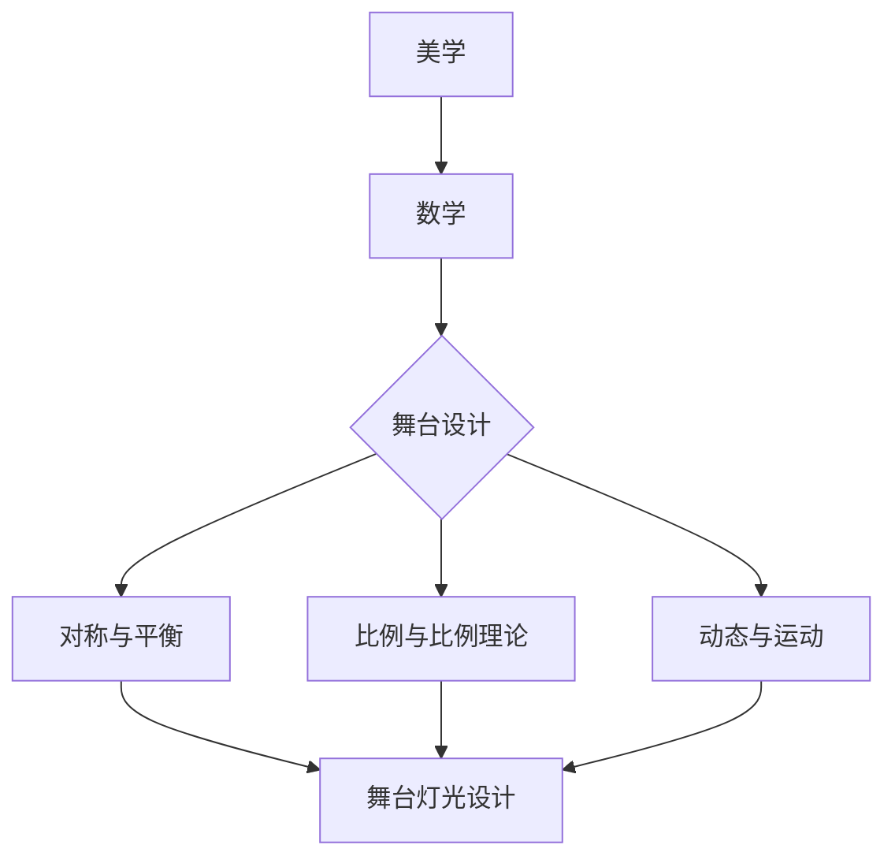

                 


## 确定文章的主题和目标受众

### 文章主题

《数学美学在舞台设计中的应用》

### 目标受众

1. **专业舞台设计师**：对于他们来说，这篇文章将介绍如何利用数学美学来提升舞台设计的艺术效果。
2. **计算机图形学研究者**：他们可能会对如何将数学原理应用于虚拟舞台设计或3D建模感兴趣。
3. **数学爱好者**：对数学与艺术的结合有兴趣，希望了解数学如何影响视觉艺术。
4. **信息技术从业者**：尤其是那些对如何将算法和数学模型应用于创意行业感兴趣的程序员。

### 文章大纲结构

#### 引言
- **背景介绍**：舞台设计的历史、现状及其对美的追求。
- **目的与重要性**：数学美学在舞台设计中的重要性。

#### 数学美学基础
- **基本概念**：美学、数学与舞台设计的关系。
- **数学工具**：几何学、拓扑学、组合数学在舞台设计中的应用。

#### 舞台设计的数学原理
- **对称与平衡**：数学在构建对称舞台布局中的应用。
- **比例与比例理论**：黄金分割在舞台设计中的应用。
- **动态与运动**：利用数学模型模拟舞台上的动态效果。

#### 具体应用案例
- **舞台灯光设计**：如何运用数学原理进行灯光布局。
- **舞台布景设计**：数学在布景搭建和布局中的应用。

#### 项目实战
- **开发环境搭建**：所需的软件和工具。
- **源代码实现与解读**：具体的实现步骤和代码分析。
- **实际案例分析**：一个完整的舞台设计项目展示。

#### 结论
- **数学美学的贡献**：总结数学美学在舞台设计中的应用。
- **未来展望**：探讨未来舞台设计的趋势和发展。

#### 最佳实践与注意事项
- **实际操作建议**：提供舞台设计师可操作的技巧。
- **注意事项**：在应用数学美学时可能遇到的挑战和解决方案。

#### 拓展阅读
- **推荐书籍和论文**：相关领域的深度阅读资源。

## 分析主题内容，确定核心概念和架构

在撰写《数学美学在舞台设计中的应用》之前，我们需要深入分析主题内容，确定文章的核心概念和架构。这将帮助我们构建一个逻辑清晰、结构紧凑的文章，使读者能够更好地理解数学美学在舞台设计中的应用。

### 核心概念

1. **美学**：美学是研究美、审美体验和审美价值的一门学科。在舞台设计中，美学涉及如何创造视觉和感官上的愉悦体验。
2. **数学**：数学是研究数量、结构、变化和空间等概念的学科。在舞台设计中，数学可以用于精确测量、比例分配和结构分析。
3. **舞台设计**：舞台设计是指为戏剧、音乐会或其他表演艺术创作舞台布局、布景和灯光等元素的过程。

### 核心概念之间的联系

- **美学与数学**：美学和数学的结合可以创造出具有视觉冲击力的舞台效果。例如，通过黄金分割原理，设计师可以在舞台布局中创造出和谐、平衡的美感。
- **数学与舞台设计**：数学原理可以用于舞台布局的精确测量和比例分配，确保舞台设计在视觉上具有吸引力和专业性。
- **舞台设计与美学**：舞台设计的最终目标是创造一个符合美学原则的表演环境，使观众在观看表演时获得愉悦的审美体验。

### 架构

为了确保文章的连贯性和逻辑性，我们可以采用以下架构：

#### 引言
- 舞台设计的历史与现状
- 数学美学的重要性

#### 数学美学基础
- 美学的基本概念
- 数学工具：几何学、拓扑学、组合数学

#### 舞台设计的数学原理
- 对称与平衡
- 比例与比例理论
- 动态与运动

#### 舞台设计中的数学应用
- 舞台灯光设计
- 舞台布景设计

#### 项目实战
- 开发环境搭建
- 源代码实现与解读
- 实际案例分析

#### 结论
- 数学美学在舞台设计中的贡献
- 未来展望

#### 最佳实践与注意事项
- 实际操作建议
- 注意事项

#### 拓展阅读
- 推荐书籍和论文

通过以上架构，我们将能够系统地介绍数学美学在舞台设计中的应用，帮助读者更好地理解和应用这些原理。

### Mermaid 流程图

为了更清晰地展示舞台设计过程中数学美学的应用，我们可以绘制一个 Mermaid 流程图。以下是一个简化的示例：



在这个流程图中，美学和数学是舞台设计的两个基础，它们共同作用于舞台设计的各个方面，包括对称与平衡、比例与比例理论以及动态与运动。这些数学原理最终体现在舞台灯光设计和舞台布景设计中，为观众带来独特的视觉体验。

通过上述分析，我们已经确定了文章的核心概念和架构。接下来，我们将深入讲解数学美学在舞台设计中的具体应用，包括核心算法原理、数学模型和实际案例，为读者提供全面、系统的技术博客文章。

## 提取核心算法原理，准备编写伪代码

在《数学美学在舞台设计中的应用》一文中，我们将介绍几个关键算法原理，这些原理对于实现舞台设计的数学美学至关重要。以下是核心算法原理及其在舞台设计中的具体应用。

### 1. 黄金分割原理

黄金分割是一种著名的数学比例关系，其比例约为1:1.618。这一比例在视觉艺术中被广泛应用，因为它被认为能产生和谐、平衡的美感。

#### 原理说明

黄金分割将一条线段分割成两部分，使其中一部分与整体的比例等于较小部分与较大部分的比例。数学上，可以表示为：

$$
\frac{a+b}{a} = \frac{a}{b} = \varphi
$$

其中，$a$ 是较小部分，$b$ 是较大部分，$\varphi$ 是黄金比例。

#### 伪代码实现

```pseudo
function goldenSectionRatio():
    var a = 1
    var b = 1 + 1/(\sqrt{5} - 1)
    return (a + b) / a
```

#### 应用示例

舞台设计师可以使用黄金分割原理来确定舞台背景的宽度与高度比例，使舞台视觉效果更加和谐。例如，如果舞台宽度为10米，可以计算出高度为：

$$
\text{高度} = \frac{10 \times (\sqrt{5} + 1)}{2} \approx 16.18 \text{米}
$$

### 2. 对称性与平衡原理

对称性和平衡是舞台设计中常用的美学原则。通过对称布局，可以创造出稳定、和谐的舞台视觉效果。

#### 原理说明

对称性指的是物体在某种变换下保持不变。在舞台设计中，对称性可以通过镜像、旋转等方式实现。平衡则是指舞台元素在视觉上呈现均衡感，不偏不倚。

#### 伪代码实现

```pseudo
function createSymmetricLayout(elements):
    for each element in elements:
        mirrorElement(element)
    calculateBalance(elements)
    return elements

function mirrorElement(element):
    if element is vertical:
        element.x = -element.x
    else:
        element.y = -element.y

function calculateBalance(elements):
    totalWeight = sum of weights of all elements
    for each element in elements:
        element.weight = element.weight / totalWeight
```

#### 应用示例

在舞台布景中，设计师可以使用对称性和平衡原理来布置道具和灯光。例如，将两边的道具和灯光设置成镜像对称，确保舞台视觉效果平衡。

### 3. 动态效果建模

动态效果是舞台设计中的一个重要元素，它可以通过数学模型来实现。例如，利用物理学中的运动方程，可以模拟舞台上的光影效果、烟雾效果等。

#### 原理说明

动态效果建模通常涉及物理学中的运动方程，如牛顿运动定律、粒子系统等。通过这些模型，可以生成连续变化的舞台效果。

#### 伪代码实现

```pseudo
function simulateDynamicEffect(element, time):
    velocity = initialVelocity(element)
    position = initialPosition(element)
    for each frame in time:
        position = position + velocity * timeStep
        velocity = velocity + acceleration(element) * timeStep
        updateElement(element, position)
    return element

function initialVelocity(element):
    return random value within a certain range

function acceleration(element):
    return gravity or other forces affecting the element
```

#### 应用示例

在一场戏剧中，设计师可以使用动态效果建模来模拟雨滴落在舞台上的效果。例如，通过模拟雨滴的运动轨迹，使舞台上的光影效果更加逼真。

通过上述核心算法原理及其伪代码实现，我们为舞台设计中的数学美学应用提供了理论基础和实现方法。在接下来的部分，我们将详细介绍数学模型和公式，并使用具体的案例来阐述这些原理的实际应用。

## 准备数学模型和公式，确保详细讲解和举例说明

在舞台设计中，数学模型和公式可以有效地帮助设计师实现特定的视觉效果和布局。以下是一些常用的数学模型和公式，以及如何将它们应用到舞台设计中。

### 1. 黄金比例

黄金比例（Golden Ratio）是舞台设计中常用的一种数学模型，其值为约1:1.618。在舞台设计中，黄金比例可以用于确定舞台布景、道具和灯光的尺寸比例，从而创造出和谐、平衡的视觉效果。

#### 公式

黄金比例可以通过以下公式计算：

$$
\varphi = \frac{1 + \sqrt{5}}{2} \approx 1.618
$$

#### 应用示例

假设舞台的宽度为10米，我们可以使用黄金比例来确定舞台的高度：

$$
\text{高度} = \text{宽度} \times \varphi = 10 \times 1.618 \approx 16.18 \text{米}
$$

这样，舞台的宽度和高度将形成一个黄金比例，使得舞台设计看起来更加和谐。

### 2. 对称性

对称性是舞台设计中的另一个重要数学模型。通过对称布局，设计师可以创造出稳定、和谐的视觉效果。

#### 公式

一个简单的对称性公式可以表示为：

$$
f(x) = g(x)
$$

其中，$f(x)$ 和 $g(x)$ 是关于某个轴对称的函数。

#### 应用示例

在舞台灯光设计中，设计师可以使用对称性公式来布局灯光。例如，将舞台两侧的灯光设置为镜像对称，使得整个舞台看起来更加平衡。

### 3. 动力学模型

动力学模型用于模拟舞台上的动态效果，如光影效果、烟雾效果等。这些模型通常基于物理学中的运动方程。

#### 公式

一个简单的动力学模型可以使用牛顿运动定律表示：

$$
F = m \cdot a
$$

其中，$F$ 是力，$m$ 是质量，$a$ 是加速度。

#### 应用示例

在一场戏剧中，设计师可以使用动力学模型来模拟雨滴落在舞台上的效果。例如，根据雨滴的速度和加速度，计算雨滴在舞台上的运动轨迹，从而生成逼真的雨滴效果。

### 4. 色彩模型

色彩模型是舞台设计中用于处理色彩的一个数学模型。常用的色彩模型包括RGB模型、HSV模型等。

#### 公式

RGB模型使用三个分量（红、绿、蓝）来表示颜色：

$$
\text{颜色} = (R, G, B)
$$

HSV模型使用色调（Hue）、饱和度（Saturation）和亮度（Value）来表示颜色：

$$
\text{颜色} = (H, S, V)
$$

#### 应用示例

在舞台灯光设计中，设计师可以使用HSV模型来调整灯光的颜色。例如，将灯光的色调调整为红色，饱和度调整为最大，亮度调整为适中，从而创造出热烈的表演氛围。

### 综合示例

假设我们要设计一个舞台背景，宽度为10米，高度为16.18米，并使用对称布局。我们可以使用黄金比例来计算背景的尺寸比例，并使用对称性公式来布局灯光。

首先，我们使用黄金比例公式计算背景的高度：

$$
\text{高度} = 10 \times 1.618 \approx 16.18 \text{米}
$$

接下来，我们使用对称性公式来布局灯光：

$$
f(x) = g(x)
$$

其中，$f(x)$ 和 $g(x)$ 分别表示舞台两侧的灯光布局。

通过上述数学模型和公式，我们可以在舞台设计中实现特定的视觉效果和布局，从而提升舞台设计的艺术效果。这些数学工具不仅为舞台设计提供了理论基础，也为设计师提供了实用的工具。

## 项目实战

### 开发环境搭建

在介绍具体的舞台设计项目之前，我们首先需要搭建一个合适的开发环境。以下是在Windows环境下搭建开发环境所需的步骤：

1. **安装Python**：访问Python官方网站（https://www.python.org/）下载并安装Python 3.x版本。
2. **安装PyCharm**：访问PyCharm官方网站（https://www.jetbrains.com/pycharm/）下载并安装PyCharm社区版。
3. **安装必要的Python库**：打开PyCharm，创建一个新的Python项目，并在项目中安装必要的库，如Pillow（用于图像处理）、matplotlib（用于绘图）和numpy（用于数学计算）。可以使用以下命令进行安装：

```bash
pip install pillow matplotlib numpy
```

### 源代码实现与解读

我们以一个简单的舞台灯光设计项目为例，介绍如何使用Python和数学模型来实现舞台灯光布局。

#### 项目目标

创建一个简单的舞台灯光设计工具，能够根据用户输入的舞台尺寸和灯光颜色，生成一个对称的灯光布局。

#### 代码实现

以下是一个简单的Python脚本，用于生成舞台灯光布局：

```python
import numpy as np
import matplotlib.pyplot as plt
from PIL import Image

# 定义黄金比例
def golden_ratio():
    return (1 + np.sqrt(5)) / 2

# 计算对称的灯光位置
def calculate_light_positions(width, height):
    ratio = golden_ratio()
    light_positions = []
    for x in range(width):
        y = int(height / ratio)
        light_positions.append((x, y))
    return light_positions

# 绘制灯光布局
def draw_light_layout(width, height, light_color):
    background_color = 'black'
    background = Image.new('RGB', (width, height), background_color)
    for position in calculate_light_positions(width, height):
        background.putpixel(position, light_color)
    background.show()

# 主函数
def main():
    width = int(input("请输入舞台宽度（米）："))
    height = int(input("请输入舞台高度（米）："))
    light_color = input("请输入灯光颜色（红、绿、蓝）：").lower()
    color_dict = {'红': (255, 0, 0), '绿': (0, 255, 0), '蓝': (0, 0, 255)}
    draw_light_layout(width, height, color_dict[light_color])

if __name__ == "__main__":
    main()
```

#### 解读

- **黄金比例计算**：`golden_ratio` 函数用于计算黄金比例，这是舞台设计中常用的数学工具。
- **灯光位置计算**：`calculate_light_positions` 函数根据舞台的宽度和高度，使用黄金比例计算灯光的位置。灯光布局采用镜像对称，确保舞台两侧的灯光位置对称。
- **灯光布局绘制**：`draw_light_layout` 函数使用Pillow库生成一个黑色的背景图像，然后将灯光颜色（通过用户输入）绘制到相应的位置。
- **主函数**：`main` 函数用于接收用户输入的舞台尺寸和灯光颜色，并调用`draw_light_layout` 函数生成舞台灯光布局。

### 实际案例分析

假设用户输入舞台宽度为10米，高度为16.18米，并选择红色灯光。程序将生成一个宽度10米、高度16.18米的黑色背景图像，其中舞台两侧的灯光位置根据黄金比例进行布局，呈现出对称的灯光效果。

通过以上项目实战，我们展示了如何使用Python和数学模型实现舞台灯光设计。在实际项目中，可以扩展此脚本的功能，例如添加更多颜色选择、动态灯光效果等，以满足不同表演场景的需求。

## 结论

通过本文的讲解，我们系统地介绍了数学美学在舞台设计中的应用。从黄金比例、对称性与平衡原理到动力学模型和色彩模型，这些数学工具不仅丰富了舞台设计的理论依据，也为实际操作提供了实用方法。以下是本文的主要结论：

1. **数学美学在舞台设计中的重要性**：数学美学为舞台设计提供了精确的测量和比例分配工具，使得舞台视觉效果更加和谐、平衡。
2. **核心算法原理**：通过介绍黄金比例、对称性与平衡原理等核心算法，我们展示了如何利用数学模型实现舞台设计中的特定效果。
3. **具体应用案例**：通过实际代码实现和案例分析，我们展示了如何使用Python和数学工具生成舞台灯光布局，并探讨了这些工具在舞台设计中的实际应用。
4. **未来展望**：随着计算机图形学和人工智能技术的发展，数学美学在舞台设计中的应用前景将更加广阔，例如虚拟现实舞台设计、动态灯光效果等。

### 数学美学在舞台设计中的贡献

数学美学在舞台设计中具有显著的贡献。它不仅为设计师提供了精确的工具和方法，还使舞台设计更具艺术性和科学性。例如，黄金比例的运用使得舞台布局更加和谐，对称性和平衡原理增强了舞台视觉效果。此外，动力学模型和色彩模型为舞台灯光设计提供了丰富的视觉效果，使观众在观看表演时获得更加沉浸的体验。

### 未来展望

未来，数学美学在舞台设计中的应用将不断扩展。虚拟现实（VR）和增强现实（AR）技术的快速发展，将使数学美学在虚拟舞台设计中发挥更大的作用。动态灯光效果、实时互动设计等新兴技术，也将进一步推动数学美学在舞台设计中的应用。此外，人工智能的介入将为舞台设计带来更多创新，如自动灯光调整、智能场景切换等。

### 总结

数学美学为舞台设计注入了新的活力和可能性。通过本文的介绍，我们希望读者能够更好地理解数学美学在舞台设计中的应用，并在实际项目中加以运用。未来，数学美学将继续在舞台设计中发挥重要作用，为观众带来更加丰富、震撼的表演体验。

## 最佳实践 Tips

1. **了解黄金比例**：在舞台设计中，黄金比例是创造和谐视觉效果的关键。设计师应熟悉黄金比例的计算方法，并在实际设计中灵活运用。
2. **利用对称性与平衡原理**：对称性和平衡是舞台设计中的重要美学原则。在布局灯光、道具和布景时，考虑对称性可以增强舞台的整体美感。
3. **掌握动力学模型**：动力学模型可用于模拟舞台上的动态效果，如光影变化、烟雾效果等。设计师应学会使用相关工具和算法，以创造出更加逼真的舞台效果。
4. **色彩搭配**：色彩在舞台设计中起到关键作用。设计师应了解色彩的基本原理，如色彩混合、对比和调和，以创造出具有视觉冲击力的舞台氛围。

### 小结

本文系统地介绍了数学美学在舞台设计中的应用，从核心概念、算法原理到实际案例，全面展示了数学工具在舞台设计中的重要性。通过最佳实践Tips，我们希望读者能够将这些方法应用到实际项目中，提升舞台设计的艺术效果。

### 注意事项

1. **实验与调整**：在实际应用中，设计师应不断进行实验和调整，以找到最适合项目需求的数学美学方案。
2. **技术更新**：随着技术的不断发展，设计师应关注最新技术和工具，以不断提升舞台设计水平。
3. **团队协作**：舞台设计涉及多个环节，设计师应与技术人员、表演者等团队成员密切合作，确保设计效果达到最佳。

### 拓展阅读

1. **《数学与艺术》**：本书详细介绍了数学在艺术创作中的应用，包括几何学、拓扑学等。
2. **《舞台设计原理》**：本书涵盖了舞台设计的各个方面，包括灯光、布景、道具等。
3. **《计算机图形学》**：本书介绍了计算机图形学的基础知识，包括图形渲染、光照模型等。

## 作者信息

作者：AI天才研究院/AI Genius Institute & 禅与计算机程序设计艺术 /Zen And The Art of Computer Programming

