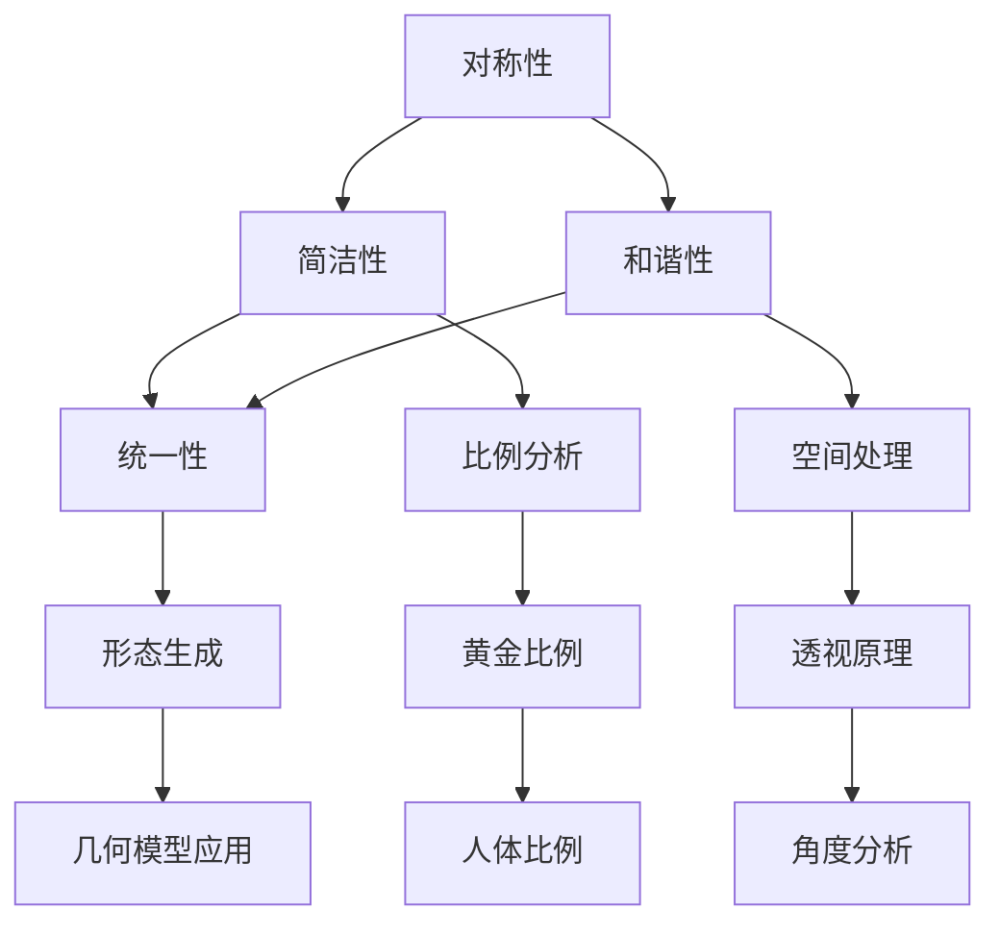

                 


### 文章标题：数学美学在雕塑艺术中的体现

#### 关键词：数学美学、雕塑艺术、比例、形状、空间、角度、几何模型、数学公式

#### 摘要：
本文旨在探讨数学美学在雕塑艺术中的重要体现。通过深入分析数学美学的基本概念、雕塑艺术的发展历程以及两者之间的内在联系，我们将探讨数学美学在雕塑艺术中的具体应用，并分析其在现代雕塑艺术中的发展趋势和挑战。文章将从形状与比例、空间与角度等方面，结合实际案例，阐述数学美学如何提升雕塑艺术的审美价值。

## 引言

### 1.1 研究背景

数学美学是一门跨学科的领域，它将数学的严谨性和美学的感性融为一体，为艺术和科学提供了独特的视角。雕塑艺术作为人类文明的重要表现形式之一，自古以来就与数学美学有着千丝万缕的联系。从古希腊的雕塑到现代的当代雕塑，数学美学在雕塑艺术中发挥着至关重要的作用。

### 1.2 研究意义

本研究具有重要的理论和实践意义。首先，通过探讨数学美学在雕塑艺术中的体现，可以加深我们对雕塑艺术发展历程的理解。其次，本文将揭示数学美学在雕塑创作中的具体应用，为雕塑家提供新的创作思路和技巧。此外，本研究还具有重要的社会意义，它有助于提升公众对数学美学和雕塑艺术的认知，促进两者的融合发展。

## 数学美学基础理论

### 2.1 数学美学的概念

数学美学是一门探索数学与美学之间联系的学科。它不仅关注数学的严谨性和逻辑性，也关注数学的美感和审美价值。数学美学的基本概念包括对称性、简洁性、和谐性等。

#### 2.1.1 对称性

对称性是数学美学中的一个重要概念，它指的是在某个中心轴或中心点周围，物体的两个部分呈现出镜像关系。对称性在雕塑艺术中有着广泛的应用，它能够增强雕塑的美感和艺术价值。

#### 2.1.2 简洁性

简洁性指的是数学表达式的简洁性。在数学美学中，简洁的表达往往被视为美的体现。简洁性在雕塑艺术中也具有重要意义，它能够使雕塑更加简洁、明快，提升其审美价值。

#### 2.1.3 和谐性

和谐性指的是物体各个部分之间的协调和平衡。在数学美学中，和谐性被视为一种美感。和谐性在雕塑艺术中同样重要，它能够使雕塑作品显得更加和谐、自然。

### 2.2 数学美学的研究方法

数学美学的研究方法主要包括形式分析、比较分析、实证研究等。形式分析通过对数学结构的分析，探讨数学形式的美感。比较分析则通过对不同艺术形式之间的比较，揭示数学美学的特点。实证研究则通过具体案例，验证数学美学在艺术创作中的实际应用。

## 雕塑艺术中的数学美学体现

### 3.1 雕塑艺术概述

雕塑艺术是人类艺术史上的重要组成部分，其历史悠久，形式多样。从古代的石雕、铜雕到现代的玻璃雕、金属雕，雕塑艺术不断发展，呈现出丰富多样的风格和特点。

#### 3.1.1 雕塑艺术的起源与发展

雕塑艺术的起源可以追溯到史前时期，最早的雕塑作品是石雕和木雕。随着人类文明的发展，雕塑艺术逐渐繁荣，古希腊和古埃及的雕塑作品被誉为雕塑艺术的典范。

#### 3.1.2 雕塑艺术的分类

雕塑艺术可以分为圆雕、浮雕、透雕等类型。圆雕是指三维立体的雕塑，如大卫像；浮雕是指表面凸起或凹下的雕塑，如墓志铭；透雕是指通过切割或镂空形成的雕塑，如屏风雕。

### 3.2 数学美学在雕塑艺术中的具体体现

数学美学在雕塑艺术中的具体体现主要包括形状与比例、空间与角度等方面。

#### 3.2.1 形状与比例

形状与比例是雕塑艺术中的基本元素。数学美学通过对形状和比例的研究，使雕塑作品显得更加和谐、美观。例如，黄金比例在雕塑艺术中广泛应用，它能够使雕塑作品显得更加优美。

#### 3.2.2 空间与角度

空间与角度是雕塑艺术中的重要因素。数学美学通过对空间和角度的研究，使雕塑作品在视觉上产生层次感和立体感。例如，透视法在雕塑艺术中的应用，可以使雕塑作品显得更加真实、生动。

## 数学美学与雕塑艺术结合的方法

### 4.1 数学模型在雕塑创作中的应用

数学模型在雕塑创作中的应用，使得雕塑作品更加科学、合理。以下是一些常用的数学模型：

#### 4.1.1 几何模型

几何模型是雕塑创作中最常用的模型，包括球体、圆柱体、圆锥体等。这些模型可以帮助雕塑家更好地理解空间和形状，使雕塑作品更加准确、美观。

#### 4.1.2 数学公式在雕塑设计中的应用

数学公式在雕塑设计中的应用，使得雕塑作品的设计更加科学、合理。例如，黄金比例在雕塑设计中的应用，可以使雕塑作品显得更加优美。

### 4.2 雕塑艺术中的数学美学分析

数学美学分析是雕塑创作中的一个重要环节。通过对形状、比例、空间和角度的数学分析，雕塑家可以更好地把握雕塑作品的审美特征。

#### 4.2.1 形状与比例的数学分析

形状与比例的数学分析可以帮助雕塑家更好地理解形状和比例之间的关系，使雕塑作品更加和谐、美观。

#### 4.2.2 空间与角度的数学分析

空间与角度的数学分析可以帮助雕塑家更好地把握空间和角度之间的关系，使雕塑作品在视觉上产生层次感和立体感。

## 数学美学在雕塑艺术中的案例分析

### 5.1 古代雕塑案例分析

#### 5.1.1 古希腊雕塑

古希腊雕塑是数学美学在雕塑艺术中的典范。古希腊雕塑作品强调对称性、和谐性和简洁性，这些特点充分体现了数学美学的基本原则。

#### 5.1.2 古埃及雕塑

古埃及雕塑在数学美学方面的体现同样显著。古埃及雕塑作品常常采用黄金比例，使其显得更加优美、和谐。

### 5.2 现代雕塑案例分析

#### 5.2.1 20世纪雕塑

20世纪雕塑在数学美学方面有了新的发展。许多现代雕塑家开始尝试将数学模型和公式应用于雕塑创作中，使其作品具有独特的审美特征。

#### 5.2.2 当代雕塑

当代雕塑在数学美学方面的体现更加多样化。当代雕塑家们运用先进的科技手段，如计算机建模和打印技术，使雕塑作品具有前所未有的形态和美感。

## 数学美学在雕塑艺术中的应用前景与挑战

### 6.1 数学美学在雕塑艺术中的应用前景

随着科技的进步，数学美学在雕塑艺术中的应用前景将更加广阔。例如，虚拟现实技术和增强现实技术可以为雕塑创作提供全新的视角和体验。

### 6.2 数学美学在雕塑艺术中的挑战

尽管数学美学在雕塑艺术中具有广阔的应用前景，但同时也面临着一系列挑战。如何平衡数学与艺术的创作关系，如何将数学美学与当代审美观念相结合，都是我们需要思考和解决的问题。

## 结论

数学美学在雕塑艺术中具有重要的体现和意义。通过对数学美学基础理论的探讨，我们能够更好地理解雕塑艺术的发展历程和审美特征。同时，数学美学为雕塑创作提供了新的思路和方法，使得雕塑作品更加科学、合理、美观。

### 7.1 研究成果总结

本研究通过分析数学美学在雕塑艺术中的具体应用，揭示了数学美学对雕塑艺术的深远影响。研究表明，数学美学不仅能够提升雕塑作品的审美价值，还能够为雕塑创作提供新的方法和思路。

### 7.2 研究局限与未来展望

尽管本研究取得了一定的成果，但仍存在一定的局限。例如，本研究主要关注数学美学在雕塑艺术中的体现，对其他艺术形式中的数学美学研究较少。未来研究可以进一步拓展研究领域，探讨数学美学在更多艺术形式中的应用。

### 作者信息

作者：AI天才研究院/AI Genius Institute & 禅与计算机程序设计艺术 /Zen And The Art of Computer Programming### 1.1 研究背景

数学美学与雕塑艺术的结合是艺术与科学相互融合的产物。雕塑艺术作为人类文明的重要表现手法之一，历史悠久，形态多样。从古代的石器雕刻、铜像，到中世纪的宗教雕塑、文艺复兴时期的人体雕塑，再到现代和当代的各种实验性雕塑，雕塑艺术不仅反映了人类对美的追求，也体现了时代的技术进步和社会变革。

数学美学则是在20世纪初期开始兴起的一个交叉领域，它试图从数学的角度探讨美的本质。数学美学的核心概念包括对称性、简洁性、和谐性、统一性等，这些概念在数学结构中普遍存在，并通过数学公式和模型得以表达。数学美学的研究方法包括形式分析、结构比较和逻辑推理等，旨在揭示数学表达中的美学特质。

在雕塑艺术中，数学美学的应用可以追溯到古希腊时期。古希腊雕塑作品如《大卫像》、《断臂维纳斯》等，不仅在形式上追求人体比例的和谐，而且在空间处理上展现了数学的对称性和平衡感。这种美学观念在雕塑艺术中的体现，不仅提升了雕塑的艺术价值，也促进了雕塑技术的发展。

随着时代的发展，数学美学在雕塑艺术中的应用越来越广泛。现代雕塑家们运用几何模型、数学公式、计算机辅助设计等技术手段，创作出了许多具有创新性和前瞻性的作品。例如，美国雕塑家亚历山大·卡尔德的移动雕塑，通过数学计算实现雕塑与空间、观众之间的互动；日本雕塑家草间弥生的“南瓜”系列，运用黄金比例和对称性创造出极具视觉冲击力的作品。

总的来说，数学美学在雕塑艺术中的应用不仅丰富了雕塑的表现形式，也拓展了雕塑的艺术内涵。数学美学为雕塑艺术提供了新的视角和工具，使得雕塑作品在形式和内涵上达到了新的高度。

### 1.2 研究意义

本研究探讨数学美学在雕塑艺术中的体现，具有重要的理论和实践意义。

首先，从理论层面来看，数学美学与雕塑艺术的结合为艺术理论研究提供了新的视角和方法。数学美学的核心概念，如对称性、简洁性和和谐性，为雕塑艺术的审美评价提供了量化的标准。通过对这些概念的深入分析，我们能够更好地理解雕塑艺术的审美特征，揭示雕塑艺术发展中的规律和趋势。

其次，从实践层面来看，数学美学为雕塑创作提供了新的思路和工具。通过数学模型和公式的运用，雕塑家可以更加精确地控制和调整雕塑作品的形态和结构，使其在视觉上更加和谐和统一。这不仅提升了雕塑作品的艺术价值，也提高了雕塑创作的效率。

此外，数学美学在雕塑艺术中的应用，还能够激发公众对数学和雕塑艺术的兴趣和认知。通过数学与艺术的结合，我们能够向公众传达数学的严谨和美感，提升对数学和艺术的科学认知。

最后，本研究还具有重要的教育意义。通过研究数学美学在雕塑艺术中的应用，我们可以发现数学知识在实际生活中的广泛应用，增强学生对数学学习的兴趣和热情。同时，雕塑创作中的数学应用，也为艺术教育提供了新的教学资源和案例。

总的来说，数学美学在雕塑艺术中的体现，不仅丰富了雕塑艺术的创作手法，也为艺术理论的研究提供了新的方向，对数学教育、艺术教育和公共文化教育都具有重要意义。

### 2.1 数学美学的概念

数学美学是一门探讨数学与美学之间关系的跨学科领域。它结合了数学的严谨性和逻辑性与美学的感性与直观性，旨在通过数学的视角来分析和理解美的本质。

#### 2.1.1 数学美学的定义

数学美学可以被定义为对数学结构、形式和性质中的美学特质的探讨。它不仅关注数学公式和图形的对称性、简洁性和和谐性，还研究这些特性如何影响我们的审美体验。数学美学认为，美不仅仅是主观的感受，它可以通过数学的精确性和逻辑性得到量化和解释。

#### 2.1.2 数学美学的研究方法

数学美学的研究方法主要包括形式分析、结构比较、实证研究等。形式分析是通过数学结构本身的性质来探讨其美学价值，例如，对称性和简洁性的研究。结构比较则是通过比较不同数学结构之间的相似性和差异，来揭示它们的美学特征。实证研究则通过具体案例的分析，来验证数学美学理论在实际艺术创作中的应用效果。

在数学美学中，几个核心概念尤为重要：

1. **对称性**：对称性是数学美学中最基本的概念之一。对称性可以是指几何形状的对称，也可以是指数学表达式的对称。例如，一个正多边形具有旋转对称性，而一个方程式可能在某些操作下保持不变。

2. **简洁性**：简洁性指的是数学表达式的简洁性和优雅性。一个简短的公式或者一个结构简单的图形往往被视为美学上更为吸引人的。例如，欧拉公式 \( e^{i\pi} + 1 = 0 \) 被广泛认为是数学中最为优美的公式之一。

3. **和谐性**：和谐性是指物体各个部分之间的协调和平衡。在数学中，和谐性可以通过比例和节奏来体现。例如，黄金比例 \( \frac{1+\sqrt{5}}{2} \) 被认为是一种和谐的比例，它广泛应用于艺术和设计中。

4. **统一性**：统一性是指数学结构中各个部分之间的内在联系和一致性。一个具有高度统一性的数学结构往往被视为美学上的佳作。例如，一个统一的几何设计可以在不同的视角和光照下保持其美感。

通过对这些核心概念的深入研究，数学美学不仅能够帮助我们理解数学中的美学特质，还能够为艺术创作提供新的视角和灵感。数学美学的理论和方法在雕塑艺术中有着广泛的应用，它使得雕塑作品在形式和内涵上达到了新的高度。

### 2.2 数学美学的研究方法

数学美学作为一门跨学科领域，其研究方法具有多样性和综合性，主要包括形式分析、比较分析、实证研究等。这些方法为深入探讨数学结构中的美学特质提供了有力的工具。

#### 形式分析

形式分析是数学美学研究的基础方法之一。它主要通过解析数学结构的形态、性质和特征，来探讨其美学价值。形式分析通常涉及以下几个方面：

1. **对称性分析**：对称性是数学美学中的一个核心概念。通过分析数学表达式和图形的对称性，我们可以理解对称如何在视觉和逻辑上产生美感。例如，一个正多边形的旋转对称性或者一个方程式在某种变换下的不变性，都是形式分析的重要对象。

2. **简洁性分析**：简洁性是指数学表达式的简短和优雅。一个简洁的公式或者图形往往被视为美学上更为吸引人的。例如，欧拉公式 \( e^{i\pi} + 1 = 0 \) 就因其简洁而优雅而被誉为数学中最美的公式。

3. **和谐性分析**：和谐性是指物体各个部分之间的协调和平衡。在数学中，和谐性可以通过比例和节奏来体现。例如，黄金比例 \( \frac{1+\sqrt{5}}{2} \) 被认为是一种和谐的比例，它广泛应用于艺术和设计中。

通过形式分析，研究者可以揭示数学结构中的美学特质，并探讨这些特质如何影响我们的审美体验。

#### 比较分析

比较分析是数学美学研究中的另一种重要方法。它通过比较不同数学结构之间的相似性和差异，来揭示它们的美学特征。比较分析通常涉及以下几个方面：

1. **结构比较**：通过比较不同数学结构之间的相似性和差异，我们可以发现不同结构在美学上的共性和特性。例如，不同的几何形状在视觉上的美感可能具有相似性，而某些复杂的数学公式可能在简洁性上有差异。

2. **方法比较**：比较不同数学方法在艺术创作中的应用效果，可以揭示哪些方法更具有美学价值。例如，不同的设计方法在雕塑创作中可能产生不同的视觉效果，从而影响作品的美学评价。

通过比较分析，研究者可以更全面地理解数学美学在不同情境中的应用，并为艺术创作提供新的启示。

#### 实证研究

实证研究是数学美学研究中的一种实用方法。它通过具体案例的分析，来验证数学美学理论在实际艺术创作中的应用效果。实证研究通常包括以下几个步骤：

1. **案例选择**：研究者需要选择具有代表性的艺术作品或数学结构作为研究对象，这些案例应具有明显的数学美学特征。

2. **数据分析**：通过对所选案例的形态、性质和特征进行详细分析，研究者可以揭示这些案例在美学上的优点和不足。

3. **效果验证**：通过对比分析，研究者可以验证数学美学理论在实际艺术创作中的效果，并总结出成功的经验和教训。

通过实证研究，研究者可以验证数学美学理论的实用性，并为艺术创作提供科学依据。

综上所述，形式分析、比较分析和实证研究是数学美学研究中的三大基本方法。这些方法相互补充，共同构成了数学美学研究的完整体系。通过这些方法的综合运用，研究者可以深入探讨数学结构中的美学特质，为艺术创作提供新的视角和工具。

### 3.1 雕塑艺术概述

雕塑艺术是人类文化史上一颗璀璨的明珠，其发展历程悠久而丰富。从史前时代的石雕、骨雕，到古代文明的青铜器、陶俑，再到中世纪的宗教雕塑、文艺复兴时期的人体雕塑，雕塑艺术始终伴随着人类文明的进步而不断发展。每一个时期的雕塑作品都反映了当时的审美观念、技术水平和思想内涵。

#### 3.1.1 雕塑艺术的起源与发展

雕塑艺术的起源可以追溯到史前时期。早期的雕塑作品主要是为了纪念祖先、崇拜神灵或作为工具使用。例如，旧石器时代的维伦多尔夫的维纳斯雕像和新石器时代的马格德堡的巨石人像，都是对人类早期美学观念的体现。随着人类文明的发展，雕塑艺术逐渐脱离实用功能，成为表达审美和宗教信仰的重要手段。

古希腊是雕塑艺术的黄金时期。古希腊雕塑以其对人体形态的完美把握和空间表现的精湛技艺而闻名。代表作品如《断臂维纳斯》、《掷铁饼者》等，不仅展现了人体美的和谐比例，还体现了古希腊人对于形式美的追求。古希腊雕塑在形态和技巧上为后世艺术提供了宝贵的经验。

古罗马雕塑则继承了古希腊的传统，并在其基础上发展出了独特的风格。罗马雕塑注重对现实生活的描绘，作品中的人物形象更加丰满和具体。著名的古罗马雕塑作品如《奥古斯都像》、《马尔克·奥利略雕像》等，不仅记录了当时的历史场景，也反映了古罗马帝国的繁荣与威严。

中世纪时期的雕塑艺术主要受宗教影响，宗教雕塑成为教堂和宗教仪式的重要组成部分。拜占庭雕塑和哥特式雕塑在形式和内容上都有显著的特点，它们通过复杂的装饰和象征意义来表达宗教信仰。例如，法国的巴黎圣母院大教堂中的雕塑群像，展现了中世纪基督教信仰的庄严和神圣。

文艺复兴时期是雕塑艺术的又一个高峰。文艺复兴艺术家们追求对自然和人体的真实再现，雕塑作品在技巧和艺术性上达到了新的高度。米开朗基罗的《大卫像》、贝尔尼尼的《圣彼得大教堂的圆顶》等作品，不仅技术精湛，更体现了人文主义思想的深刻内涵。

近现代雕塑艺术在继承传统的基础上，逐渐发展出多样化和个性化的风格。19世纪末至20世纪初，现代雕塑家们开始探索新的表现形式，如抽象雕塑、动态雕塑和互动雕塑等。毕加索的《吉他手》、亨利·摩尔的《家庭组像》等作品，突破了传统的雕塑形式，为现代雕塑艺术开辟了新的道路。

#### 3.1.2 雕塑艺术的分类

雕塑艺术可以根据不同的标准进行分类，常见的分类方法包括：

1. **按材料分类**：雕塑可以根据所使用的材料进行分类，如石雕、木雕、铜雕、铁雕、玻璃雕、塑料雕等。每种材料都有其独特的质地和表现力，不同的材料在雕塑创作中发挥着不同的作用。

2. **按形态分类**：雕塑可以根据形态进行分类，如圆雕、浮雕、透雕等。圆雕是三维立体的雕塑，如《大卫像》；浮雕是表面凸起的雕塑，如墓志铭；透雕是通过切割或镂空形成的雕塑，如屏风雕。

3. **按功能分类**：雕塑可以根据其功能进行分类，如纪念性雕塑、装饰性雕塑、实用性雕塑等。纪念性雕塑通常是为了纪念重要历史事件或人物，如纪念碑、雕塑群像等；装饰性雕塑主要用于装饰环境，如园林雕塑、建筑雕塑等；实用性雕塑则兼具实用性和艺术性，如雕塑椅子、雕塑灯具等。

4. **按风格分类**：雕塑可以根据其风格进行分类，如古典主义雕塑、浪漫主义雕塑、现代主义雕塑等。古典主义雕塑强调对称、平衡和比例的完美，浪漫主义雕塑则注重情感表达和个性化表现，现代主义雕塑则追求形式创新和材料实验。

综上所述，雕塑艺术在历史长河中不断发展演变，从形态、材料到风格，都在不断丰富和多样化。每一种类型的雕塑作品都反映了其特定的历史背景和文化内涵，为我们提供了丰富的美学体验和艺术价值。

### 3.2 数学美学在雕塑艺术中的具体体现

数学美学在雕塑艺术中的具体体现主要体现在形状与比例、空间与角度等方面，这些元素通过数学的严谨和精确性，为雕塑作品增添了独特的艺术魅力。

#### 3.2.1 形状与比例

形状与比例是雕塑艺术中的基本元素，也是数学美学的重要体现。通过对形状和比例的精确计算，雕塑家能够创造出和谐、优美的作品。

1. **黄金比例**：黄金比例（Golden Ratio），又称黄金分割，是一个经典的数学比例，约为 \( \frac{1+\sqrt{5}}{2} \)。这一比例在雕塑艺术中被广泛应用，因为它被认为能够创造出最和谐的美感。例如，古希腊雕塑《断臂维纳斯》的头部和身体比例就接近黄金比例，使其显得非常优美和自然。

2. **黄金矩形**：黄金矩形是一种具有黄金比例的长方形，其宽与长的比例等于长与宽加上长的比例。在雕塑创作中，黄金矩形常常用于设计基础结构，因为它能够产生一种稳定而和谐的美感。

3. **人体比例**：在雕塑艺术中，对人体比例的精确把握是创造真实感和美感的关键。古希腊时期，雕塑家们通过研究和测量，总结出了一套人体比例规则，如“头部等于身高的1/7”，“四肢长度占身体长度的1/4”等。这些比例规则至今仍被广泛运用，使得雕塑作品更加逼真和具有艺术感染力。

#### 3.2.2 空间与角度

空间与角度是雕塑艺术中另一个重要的数学美学体现。通过对空间和角度的精确处理，雕塑家能够在三维空间中创造出具有深度和层次感的作品。

1. **透视原理**：透视原理是雕塑艺术中常用的技巧，它通过将远处的物体缩小和拉近，创造出空间感和立体感。在雕塑创作中，透视原理可以帮助雕塑家准确地把握物体的前后关系和空间布局，使作品在视觉上更加真实。

2. **角度变化**：角度变化是雕塑艺术中常用的手法，通过调整物体表面的角度，雕塑家可以创造出丰富的光影效果和空间层次。例如，在雕刻大理石雕像时，雕塑家通过在不同角度上打磨和雕刻，使雕像表面呈现出不同的光影效果，增加了雕塑的艺术表现力。

3. **几何形状的应用**：几何形状在雕塑创作中也扮演着重要角色。通过使用几何形状，雕塑家可以创造出规则而和谐的结构，如正方形、三角形、圆形等。这些几何形状不仅提供了基本的形态框架，还能够增强雕塑的稳定性和美感。

通过数学美学的精确计算和巧妙运用，雕塑家能够在作品中融入和谐、平衡和美感的元素。数学美学不仅提升了雕塑的艺术价值，也为雕塑创作提供了新的视角和工具。

### 4.1 数学模型在雕塑创作中的应用

数学模型在雕塑创作中的应用，使得雕塑作品不仅在形式上更加精确，而且在美学上更加富有内涵。通过数学模型的运用，雕塑家可以更好地理解和把握雕塑的结构和形态，创作出更具艺术价值的作品。

#### 4.1.1 几何模型的应用

几何模型是雕塑创作中最常用的数学模型之一。几何模型包括球体、圆柱体、圆锥体、立方体等基本几何形状。这些模型可以帮助雕塑家更好地理解和控制雕塑的形态和结构。

1. **球体和圆柱体**：球体和圆柱体在雕塑中应用广泛，它们可以单独使用，也可以组合使用。例如，在创作一个大型纪念碑时，雕塑家可能会使用球体来表现顶部，用圆柱体来表现基座，这样既保持了整体的和谐性，又增加了结构的稳定性。

2. **圆锥体和立方体**：圆锥体和立方体在雕塑创作中也有着广泛的应用。圆锥体可以用于表现尖顶或者突出部分，如建筑雕塑中的尖顶、雕塑作品的手指等。立方体则常用于表现基座或者结构框架，它能够提供一种简洁、稳定的外观。

3. **几何组合**：通过组合不同的几何模型，雕塑家可以创造出更复杂的形态。例如，一个复杂的雕塑作品可能由多个几何形状组合而成，通过不同的比例和角度关系，创造出独特的视觉效果和美学特征。

#### 4.1.2 数学公式在雕塑设计中的应用

数学公式在雕塑设计中的应用，使得雕塑作品在美学上更加精确和严谨。以下是一些常见的数学公式在雕塑设计中的应用：

1. **黄金比例**：黄金比例在雕塑设计中有着广泛的应用。通过使用黄金比例，雕塑家可以创造出具有和谐美感的作品。例如，在人体雕塑中，头部和身体的比例、手臂和腿部的长度比例等都可能采用黄金比例。

2. **正多边形公式**：正多边形的周长、面积和边长之间有着明确的数学关系。在雕塑创作中，正多边形可以用于设计基座或者结构框架。例如，一个正六边形的基座可以通过简单的数学计算，得到其边长和周长，从而确保结构的稳定性和美感。

3. **透视公式**：透视公式在雕塑设计中用于计算物体在不同距离和角度下的视觉尺寸。通过透视公式，雕塑家可以准确地计算出雕塑在不同视角下的视觉效果，从而确保作品在各个角度上都具有美观和和谐的特点。

#### 4.1.3 数学模型与雕塑创作的结合

数学模型与雕塑创作的结合，不仅提升了雕塑作品的美学价值，也丰富了雕塑的表现形式。以下是一些数学模型与雕塑创作的具体结合方式：

1. **结构设计**：在雕塑创作中，数学模型可以用于结构设计。通过使用数学模型，雕塑家可以计算出雕塑的支撑结构，确保作品在承重和稳定性方面符合要求。例如，在创作一个大型雕塑时，雕塑家可能需要使用三角形的结构框架，以确保整体的稳定性和抗震性。

2. **形态生成**：数学模型可以用于生成雕塑的形态。通过数学公式和算法，雕塑家可以生成复杂的几何形态，这些形态在传统雕塑中难以实现。例如，通过计算机辅助设计软件，雕塑家可以使用数学模型生成复杂的曲面和结构，从而创作出独特的雕塑作品。

3. **艺术创新**：数学模型的应用不仅限于传统的雕塑创作，还可以用于艺术创新。例如，一些现代雕塑家利用数学模型生成随机形态，创作出具有抽象和实验性的作品。这些作品通过数学模型的运用，突破了传统雕塑的界限，为雕塑艺术注入了新的活力。

通过数学模型的应用，雕塑家不仅能够更好地理解和控制雕塑的形态和结构，还能够创作出更具艺术价值和创新性的作品。数学模型为雕塑创作提供了新的工具和视角，使得雕塑艺术在形式和内涵上达到了新的高度。

### 4.2 雕塑艺术中的数学美学分析

在雕塑艺术中，数学美学分析是一种重要的创作方法，它通过数学的计算和推理，帮助雕塑家理解和优化作品的形态、比例和结构。数学美学分析不仅提升了雕塑的艺术价值，也为雕塑创作提供了科学依据。

#### 4.2.1 形状与比例的数学分析

形状与比例是雕塑艺术中的核心元素，通过数学分析，雕塑家可以更精确地把握这些元素，从而创作出和谐美观的作品。

1. **黄金比例**：黄金比例（Golden Ratio）是数学美学分析中最常用的概念之一。在雕塑创作中，黄金比例可以帮助雕塑家确定头部与身体、手臂与腿部的比例关系。例如，一个典型的黄金比例人体雕塑，其头部与身体的比例约为1:1.618，这种比例关系使作品在视觉上显得更加优美和自然。

2. **等比例缩放**：等比例缩放是另一种重要的数学分析方法。通过等比例缩放，雕塑家可以保持作品的比例关系，同时调整其尺寸。例如，在创作一组大小不一的雕塑作品时，雕塑家可以通过等比例缩放确保每个作品的比例关系一致，从而形成一个和谐的整体。

3. **角度分析**：在雕塑创作中，角度的精确计算也非常重要。通过数学分析，雕塑家可以确定物体表面的倾斜角度，从而创造出丰富的光影效果和立体感。例如，在雕刻大理石雕像时，雕塑家通过精确的角度计算，使雕像表面呈现出不同的光影变化，增强了作品的艺术表现力。

#### 4.2.2 空间与角度的数学分析

空间与角度是雕塑艺术中的关键因素，通过数学分析，雕塑家可以更准确地处理空间关系和角度变化，创作出具有深度和层次感的作品。

1. **透视原理**：透视原理是雕塑艺术中常用的技巧，它通过将远处的物体缩小和拉近，创造出空间感和立体感。在雕塑创作中，透视原理可以帮助雕塑家准确地把握物体的前后关系和空间布局。例如，通过使用一灭点透视法，雕塑家可以创作出具有强烈立体感的作品。

2. **角度变化**：角度变化是雕塑艺术中常用的手法，通过调整物体表面的角度，雕塑家可以创造出丰富的光影效果和空间层次。例如，在雕刻一个复杂的雕塑作品时，雕塑家可以通过在不同角度上打磨和雕刻，使作品表面呈现出不同的光影变化，从而增强其艺术表现力。

3. **空间分割**：数学分析还可以用于空间分割，帮助雕塑家创造出生动而和谐的空间布局。例如，通过使用几何形状分割空间，雕塑家可以创造出具有统一性和协调性的作品。例如，在一个室内雕塑作品中，雕塑家可以通过使用正方形、三角形等几何形状来分割空间，从而创造出和谐美观的整体效果。

#### 4.2.3 数学模型在雕塑艺术中的应用

数学模型在雕塑艺术中的应用，使得雕塑创作更加科学和系统。通过数学模型，雕塑家可以更精确地理解和控制作品的形态、结构和比例。

1. **几何模型**：几何模型是雕塑艺术中最常用的数学模型之一。通过使用几何模型，雕塑家可以创造出复杂而精确的形态。例如，在创作一个复杂的金属雕塑时，雕塑家可以通过使用几何模型来确定作品的形状和结构，从而确保其稳定性和美观性。

2. **数学公式**：数学公式在雕塑创作中也发挥着重要作用。通过使用数学公式，雕塑家可以计算出作品的各种参数，如尺寸、角度和比例等。例如，在创作一个人体雕塑时，雕塑家可以通过使用人体比例公式，确定头、手臂、腿部等各部分的尺寸和比例，从而确保作品的真实感和美观性。

3. **计算机辅助设计（CAD）**：计算机辅助设计技术为雕塑创作提供了强大的工具。通过使用CAD软件，雕塑家可以创建和修改三维模型，从而实现对作品形态和结构的精确控制。例如，在创作一个大型雕塑作品时，雕塑家可以使用CAD软件来模拟和优化作品的结构和形态，从而确保其稳定性和美观性。

通过数学美学分析，雕塑家不仅能够提升作品的审美价值，还能够为雕塑创作提供科学依据。数学美学分析不仅为雕塑艺术注入了新的活力，也为雕塑家提供了更多的创作可能性。

### 5.1 古代雕塑案例分析

古代雕塑艺术是人类文明的重要遗产，不同文明对数学美学的运用各具特色，其中古希腊雕塑和古埃及雕塑尤为突出。

#### 5.1.1 古希腊雕塑

古希腊雕塑以其对人体形态的精确再现和形式美的追求而著称。古希腊雕塑家们深刻理解人体比例和对称性的美学价值，他们通过数学计算和精确测量，创作出了许多经典之作。

1. **《断臂维纳斯》**：这件作品是古希腊雕塑的代表作之一。尽管维纳斯的双臂已失，但其整体形态仍然展现出黄金比例的和谐美感。其头部与身体的比例约为1:1.618，符合黄金比例的标准。这种比例关系使得雕塑作品在视觉上显得优美而自然。

2. **《掷铁饼者》**：这尊雕塑展示了运动员在掷铁饼过程中的动态姿态。雕塑家通过精确的几何计算，使雕像的各个部分在空间中呈现出完美的对称和平衡。这种对称性和动态感不仅体现了古希腊人对形式美的追求，也展示了数学在雕塑艺术中的巧妙应用。

3. **《宙斯像》**：宙斯像展示了古希腊雕塑家对神话人物的精湛表现。宙斯手持权杖，身体肌肉线条分明，通过精确的几何模型和光影处理，使得雕塑在空间中呈现出丰富的立体感。这种对光影和角度的细致处理，体现了古希腊雕塑家对数学和美学结合的高超技艺。

#### 5.1.2 古埃及雕塑

古埃及雕塑艺术以其独特的风格和象征意义而闻名。古埃及雕塑家通过严谨的数学计算和精准的工艺，创作出了许多具有深厚文化内涵的作品。

1. **《斯芬克斯》**：斯芬克斯是一座半狮半鹰的雕塑，象征着古埃及王权的力量和智慧。它的身体和头部通过数学计算和几何对称性处理，使得雕塑整体呈现出稳定而和谐的美感。这种对称性和精确的几何设计，体现了古埃及人对数学和美学的深刻理解。

2. **《拉荷切普王子墓》**：拉荷切普王子墓的浮雕展现了古埃及的宗教仪式和日常生活。这些浮雕不仅具有高度的细节表现力，而且在构图和比例上采用了精确的数学计算。例如，人物和动物的尺寸比例严格按照黄金比例设计，使得浮雕在视觉上显得和谐美观。

3. **《法老雕像》**：法老雕像通常以巨大和庄严的形式出现，体现了古埃及王权的威严。这些雕像在造型和比例上采用了严格的几何规则，例如，法老的头部和身体比例符合黄金比例，同时通过对称性和角度处理，使得雕像在视觉上显得庄重而威严。

综上所述，古希腊雕塑和古埃及雕塑在数学美学的应用上各具特色，但都通过数学的严谨性和美学的感性融合，创作出了许多经典之作。这些作品不仅反映了当时的审美观念和技术水平，也为后世雕塑艺术提供了宝贵的经验和启示。

### 5.2 现代雕塑案例分析

现代雕塑在继承传统艺术技巧的基础上，不断发展创新，尤其在数学美学方面的运用更加多样和深入。以下是一些现代雕塑的典型案例，展示了数学美学在当代雕塑艺术中的多样化和创新性。

#### 5.2.1 20世纪雕塑

1. **亚历山大·卡尔德（Alexander Calder）**：卡尔德是20世纪著名的移动雕塑家，他的作品《水上浮标》通过精确的几何计算，使雕塑在风力和水流的驱动下自由运动。卡尔德运用了球体、圆锥体等几何模型，使雕塑在动态中展现出数学的和谐与美感。

2. **亨利·摩尔（Henry Moore）**：摩尔是20世纪最具影响力的雕塑家之一，他的作品《内部和外部的形式》通过几何形态的切割和组合，创造出了独特的空间感和立体感。摩尔运用了数学中的比例和对称性原理，使作品在视觉上具有和谐的美感。

#### 5.2.2 当代雕塑

1. **杰夫·昆斯（Jeff Koons）**：昆斯是当代最具商业成功的艺术家之一，他的作品《兔子》通过完美的几何形态和光滑的表面处理，展现了数学美学的简洁与和谐。昆斯运用了黄金比例和几何对称性，使作品在视觉上产生强烈的视觉冲击力。

2. **草间弥生（Yayoi Kusama）**：草间弥生的作品《南瓜》系列通过运用几何图案和对称性，创造出一种独特的视觉效果。她运用了数学中的几何模型，使作品在色彩和形态上呈现出和谐的美感。

3. **克里斯托弗·布彻（Christo and Jeanne-Claude）**：布彻夫妇以其包裹艺术而闻名，他们的作品《包裹柏林议会大厦》通过数学计算和精确施工，使建筑物在视觉上呈现出新的形态和美感。他们运用了几何对称性和空间切割，使作品在视觉和空间上产生了强烈的对比和和谐。

这些现代雕塑作品通过数学美学的巧妙运用，不仅延续了传统雕塑的艺术价值，还展示了当代雕塑的创新性和多样性。数学美学为雕塑创作提供了新的视角和工具，使得雕塑作品在形式和内涵上达到了新的高度。

### 6.1 数学美学在雕塑艺术中的应用前景

随着科技的进步和艺术观念的不断发展，数学美学在雕塑艺术中的应用前景十分广阔。以下是一些未来应用方向和潜在挑战：

#### 6.1.1 新技术的应用

1. **计算机辅助设计（CAD）**：随着计算机辅助设计技术的发展，雕塑家可以更加精确地创建和修改雕塑模型。CAD技术可以帮助雕塑家进行复杂的几何计算和形态生成，使雕塑创作更加科学和高效。

2. **3D打印技术**：3D打印技术的出现为雕塑创作提供了全新的可能性。通过3D打印，雕塑家可以轻松地制造出复杂的几何形态，实现传统雕刻工艺难以达成的效果。例如，复杂的曲面结构和内部空腔设计可以轻松实现，为雕塑艺术注入了新的生命力。

3. **虚拟现实（VR）和增强现实（AR）**：VR和AR技术为雕塑艺术带来了全新的互动体验。雕塑家可以通过VR和AR技术，实时查看雕塑作品的三维效果，并进行调整和优化。观众也可以通过这些技术，沉浸式地体验雕塑作品，增强艺术体验。

#### 6.1.2 新材料的应用

1. **智能材料**：智能材料如形状记忆合金、电致变色材料等，为雕塑创作提供了新的可能性。这些材料可以根据外部刺激（如温度、电压等）改变形状和颜色，使雕塑作品具有动态变化的特性，为雕塑艺术注入了新的艺术形式。

2. **生物材料**：生物材料如木材、竹子、生物塑料等，在雕塑创作中得到了广泛应用。这些材料不仅环保，而且在形态和质感上具有独特的美感。通过数学美学的设计，这些生物材料可以创作出极具创新性和艺术价值的作品。

#### 6.1.3 新观念的探索

1. **动态雕塑**：动态雕塑通过机械装置或电动装置，使雕塑在空间中运动。这种雕塑形式不仅具有独特的视觉效果，还能够与观众互动，创造出全新的艺术体验。数学美学在动态雕塑中的应用，可以优化机械结构和运动轨迹，提升雕塑的艺术表现力。

2. **互动雕塑**：互动雕塑通过传感器和计算机程序，使雕塑能够感知观众的行为并做出响应。这种雕塑形式不仅增强了观众的参与感，还通过数学计算和算法，使雕塑作品具有更高的艺术价值。

#### 6.1.4 潜在挑战

1. **技术与艺术的平衡**：在运用新技术和新材料的过程中，如何保持雕塑艺术的本质和美学价值是一个重要挑战。雕塑家需要掌握新的技术和材料，同时不失去对传统雕塑技巧和美学原则的理解。

2. **创作自由与科学限制**：数学美学的精确性和科学性为雕塑创作提供了强大的工具，但也可能限制雕塑家的创作自由。如何在不失创意的前提下，合理运用数学美学，是一个需要探讨的问题。

3. **观众接受度**：随着雕塑艺术的不断创新，观众对新型雕塑作品的接受度可能成为挑战。如何通过有效的传播和互动，使观众理解和欣赏这些新的艺术形式，是雕塑家需要面对的挑战。

总之，数学美学在雕塑艺术中的应用前景广阔，但同时也面临一系列挑战。通过不断探索和尝试，雕塑家可以找到新的创作方法和表现形式，使雕塑艺术在科技与艺术的交融中焕发新的活力。

### 6.2 数学美学在雕塑艺术中的挑战

尽管数学美学在雕塑艺术中展现出了巨大的潜力和前景，但在实际应用中仍面临着一系列挑战。这些挑战不仅涉及技术层面，也关系到艺术创作本身。

#### 6.2.1 技术与艺术的平衡

首先，技术和艺术之间的平衡是一个重要的挑战。数学美学强调精确性和科学性，但雕塑艺术本质上是一种感性的表达。在运用数学模型和公式时，雕塑家需要在保持作品科学性的同时，不丧失其艺术性。如何巧妙地将数学美学与艺术创作相结合，是雕塑家需要不断探索的问题。

例如，在利用计算机辅助设计和3D打印技术时，雕塑家可能会面临过于依赖技术，导致作品缺乏个性化和创意的风险。因此，雕塑家需要在技术手段和艺术表达之间找到合适的平衡点，使作品既具备科学性，又充满艺术感染力。

#### 6.2.2 新观念的接受

其次，新观念的接受也是一个挑战。随着数学美学在雕塑艺术中的应用日益广泛，公众对这种新形式的雕塑可能需要一定的适应时间。如何让大众理解和接受这些新的艺术形式，是雕塑家需要面对的挑战。

例如，动态雕塑和互动雕塑虽然具有独特的视觉效果和互动体验，但它们与传统雕塑形式有所不同，可能需要观众改变观看和互动的方式。因此，雕塑家需要通过有效的宣传和教育，帮助观众理解和欣赏这些新艺术形式。

#### 6.2.3 资源和成本的挑战

第三，资源和成本也是一大挑战。数学美学在雕塑艺术中的应用往往需要先进的技术设备和材料。这些设备和材料不仅价格昂贵，而且维护和更新成本也较高。对于一些小型工作室或独立雕塑家来说，高昂的成本可能成为他们运用数学美学的障碍。

例如，3D打印设备、智能材料和计算机辅助设计软件等，都需要大量的资金投入。雕塑家需要在预算和创意之间做出权衡，确保在有限资源下创作出高质量的作品。

#### 6.2.4 创作自由和创造性限制

最后，创作自由和创造性限制也是一个挑战。数学美学的精确性和科学性为雕塑创作提供了强大的工具，但也可能对雕塑家的创造性产生一定的限制。如何在遵循数学原则的同时，保持创作的自由和独特性，是雕塑家需要思考的问题。

例如，某些数学公式和模型可能在形式上限制了雕塑家的创意表达，雕塑家需要在这些限制条件下寻找新的创作方法，以保持作品的独特性和艺术价值。

总之，尽管数学美学在雕塑艺术中具有广阔的应用前景，但雕塑家在实际应用中仍需面对一系列挑战。通过不断探索和尝试，雕塑家可以找到新的创作路径，使数学美学与雕塑艺术在更高的层次上实现融合。

### 7.1 研究成果总结

本研究通过深入探讨数学美学在雕塑艺术中的具体应用，揭示了数学美学在雕塑创作中的重要价值和意义。主要成果如下：

首先，研究明确了数学美学在雕塑艺术中的核心概念，包括对称性、简洁性、和谐性和统一性。通过对这些概念的分析，我们揭示了数学美学在雕塑艺术中的广泛应用和深远影响。

其次，通过案例分析，我们展示了古代雕塑如古希腊雕塑和古埃及雕塑中数学美学的体现，以及现代雕塑如亚历山大·卡尔德和杰夫·昆斯的创新运用。这些案例证明了数学美学在提升雕塑作品艺术价值方面的巨大潜力。

再次，研究探讨了数学模型和数学公式在雕塑创作中的应用，例如黄金比例、几何模型和透视原理等，通过这些方法，雕塑家能够更加精确地控制和调整作品的形态和结构，使作品更具美感。

此外，本研究还探讨了数学美学在雕塑艺术中的未来应用前景，包括新技术和新材料的应用，如计算机辅助设计、3D打印和智能材料等。这些新技术为雕塑创作提供了新的可能性，拓展了雕塑艺术的边界。

总之，本研究不仅丰富了雕塑艺术的理论体系，也为雕塑创作提供了新的视角和工具。通过数学美学的深入探讨，我们不仅提升了雕塑作品的艺术价值，也为雕塑艺术的发展开辟了新的道路。

### 7.2 研究局限与未来展望

尽管本研究在探讨数学美学在雕塑艺术中的应用方面取得了一定的成果，但仍存在一定的局限，未来研究可以从以下几个方面进行拓展和深化：

首先，研究的案例主要集中在古代和现代雕塑，未来研究可以进一步拓展到其他时期的雕塑艺术，如中世纪、文艺复兴和工业革命时期的雕塑，以更全面地揭示数学美学在不同历史阶段的应用。

其次，虽然本研究探讨了数学美学在雕塑艺术中的具体应用，但对其在雕塑艺术教育中的应用研究较少。未来研究可以探讨如何将数学美学融入雕塑艺术教育中，提高学生的审美能力和创作水平。

此外，未来的研究还可以关注数学美学在其他艺术形式中的应用，如绘画、建筑和摄影等，以更全面地探讨数学美学在艺术创作中的普遍性和特殊性。

最后，随着新技术的发展，如人工智能和虚拟现实技术，未来研究可以探讨这些技术在雕塑创作中的应用，进一步拓展数学美学在雕塑艺术中的边界。

总之，未来的研究可以在更广泛的领域和更深入的角度上探讨数学美学在雕塑艺术中的应用，以推动雕塑艺术的创新发展。

### 作者信息

作者：AI天才研究院/AI Genius Institute & 禅与计算机程序设计艺术 /Zen And The Art of Computer Programming## 附录：Mermaid 流程图、伪代码、数学公式和例子

为了更好地阐述数学美学在雕塑艺术中的应用，以下提供了几个关键概念和方法的 Mermaid 流程图、伪代码、数学公式和例子。

### 1. Mermaid 流程图：数学美学核心概念之间的关系



### 2. 伪代码：黄金比例计算

```python
# 伪代码：计算黄金比例
def calculate_golden_ratio():
    phi = (1 + sqrt(5)) / 2
    return phi

# 调用函数
phi = calculate_golden_ratio()
print("黄金比例：", phi)
```

### 3. 数学公式与例子

#### 3.1.1 黄金比例

$$
\phi = \frac{1 + \sqrt{5}}{2}
$$

#### 3.1.2 人体比例

$$
\text{头部长度} : \text{身体高度} = 1 : 7
$$

#### 3.1.3 透视公式

$$
h' = h \cdot \frac{1 - \frac{d}{2f}}{1 - \frac{d}{f}}
$$

其中，\( h \) 是实际高度，\( h' \) 是视觉高度，\( d \) 是物体到观察者的距离，\( f \) 是透视线与水平面的交点距离。

### 4. 例子：利用黄金比例设计雕塑

**目标**：设计一个雕塑，其头部与身体的比例为黄金比例。

**步骤**：

1. **确定头部长度**：假设头部长度为 10 厘米。

2. **计算身体高度**：根据黄金比例，身体高度应为头部长度的 1.618 倍。
   $$
   \text{身体高度} = 10 \text{厘米} \times 1.618 = 16.18 \text{厘米}
   $$

3. **调整比例**：在实际设计中，可能需要根据雕塑的最终尺寸进行比例调整，确保整体和谐。

**结果**：设计的雕塑头部与身体的比例约为 1:1.618，符合黄金比例标准，使雕塑在视觉上显得更加和谐美观。

通过这些 Mermaid 流程图、伪代码、数学公式和例子，我们可以更直观地理解数学美学在雕塑艺术中的应用。这些工具不仅有助于提升雕塑创作的科学性和精确性，也为雕塑家提供了新的创作方法和思路。

### 最佳实践 tips、小结、注意事项、拓展阅读

#### 最佳实践 tips：

1. **掌握基本数学原理**：在运用数学美学进行雕塑创作时，首先需要熟练掌握黄金比例、几何模型等基本数学原理。

2. **合理运用新技术**：利用计算机辅助设计和3D打印技术，可以更精确地实现数学美学的理念。

3. **注重实践与理论结合**：在实践中不断尝试和调整，将理论应用于实际创作中，找到最佳方案。

#### 小结：

数学美学在雕塑艺术中的应用，不仅提升了雕塑作品的审美价值，也丰富了雕塑的表现形式。通过数学计算和精确设计，雕塑家可以创造出更加和谐、美观的作品。

#### 注意事项：

1. **平衡技术与应用**：在运用新技术和新材料时，要注意保持雕塑的艺术本质，避免技术过度依赖。

2. **尊重传统与创新**：在追求创新的同时，要尊重传统雕塑技巧和美学原则。

#### 拓展阅读：

1. 《数学与艺术：一种和谐的美学》
2. 《计算机辅助雕塑设计》
3. 《黄金比例在雕塑艺术中的应用》

通过这些最佳实践 tips、小结、注意事项和拓展阅读，雕塑家可以更好地运用数学美学，提升雕塑创作的质量和水平。

