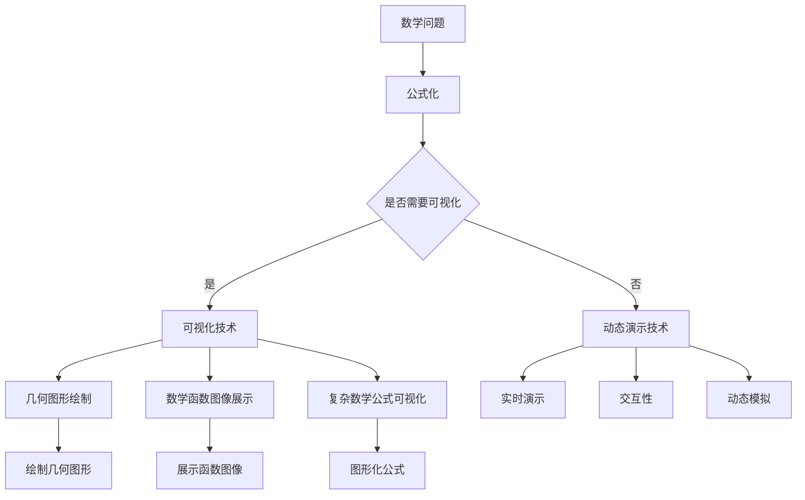

                 

# 数学证明的可视化与动态演示

关键词：数学证明，可视化，动态演示，算法原理，项目实战

摘要：本文将探讨数学证明的可视化与动态演示技术，通过深入解析核心概念、算法原理，展示其在实际项目中的应用，为读者提供全面的技术指南和实战案例。

## 引言

数学作为一种抽象的科学，其证明过程往往依赖于严密的逻辑推理和符号运算。然而，传统的数学证明往往难以直观地展现其逻辑过程，使得许多初学者难以理解。随着计算机技术的发展，数学证明的可视化与动态演示技术逐渐成为研究热点，为数学教育、科研和工程应用提供了新的视角。

本文将围绕数学证明的可视化与动态演示技术展开讨论，首先介绍相关背景知识，然后深入探讨核心概念与算法原理，接着通过项目实战案例展示其应用，最后总结全文并提出未来研究方向。

## 背景介绍

### 数学证明的起源与发展

数学证明作为一种逻辑推理过程，起源于古希腊。欧几里得的《几何原本》是历史上最早系统化地阐述数学证明方法的著作。在《几何原本》中，欧几里得通过公理、定义和公设，建立了一套严密的几何证明体系。这一体系对后世数学的发展产生了深远影响。

随着数学的不断发展，证明方法也日趋多样化。19世纪，数学家康托尔提出了集合论，为数学证明提供了新的理论基础。20世纪，哥德尔和图灵分别提出了形式化和计算理论的数学证明方法，使得数学证明的研究进入了一个新的阶段。

### 可视化技术在数学中的应用

可视化技术是一种将抽象的数学概念和过程通过图形、图像等形式直观展示的技术。在数学中，可视化技术可以用于以下几个方面：

1. **几何图形的绘制**：通过绘制几何图形，使得复杂的几何问题更加直观易懂。
2. **数学函数的图像展示**：通过展示函数图像，帮助理解函数的性质和变化规律。
3. **数学证明过程的演示**：通过动态演示数学证明过程，使得证明步骤更加清晰。
4. **复杂数学公式的可视化**：将复杂的数学公式通过图形化方式展示，便于理解。

### 动态演示技术在数学中的应用

动态演示技术是一种通过计算机程序实时展示数学对象和过程变化的技术。在数学中，动态演示技术可以用于以下几个方面：

1. **几何变换的实时演示**：通过实时演示几何图形的变换，帮助理解几何性质。
2. **数学函数的实时变换**：通过实时展示函数的变化，帮助理解函数的性质。
3. **数学证明过程的动态演示**：通过动态演示数学证明过程，使得证明步骤更加生动。
4. **数学模型的实时模拟**：通过实时模拟数学模型，帮助理解模型的运行机制。

## 核心概念与联系

### 可视化与动态演示的关系

数学证明的可视化与动态演示是相互关联的。可视化技术为数学证明提供了直观的展示手段，而动态演示技术则通过实时变化和交互，使得可视化内容更加生动和易于理解。

### 可视化技术核心概念

1. **几何图形绘制**：利用计算机图形学技术，绘制几何图形。
2. **数学函数图像展示**：利用数学函数的图像，展示其变化规律。
3. **复杂数学公式的可视化**：通过图形化方式展示复杂的数学公式。

### 动态演示技术核心概念

1. **实时演示**：通过计算机程序，实时展示数学对象和过程的变化。
2. **交互性**：用户可以通过交互方式，控制演示过程和参数。
3. **动态模拟**：通过实时模拟，展示数学模型的运行过程。

### 可视化与动态演示的Mermaid流程图



## 核心算法原理讲解

### 可视化算法原理

1. **几何图形绘制算法**：
   - **基本算法**：通过直线、圆、多边形等基本图形的绘制，构造复杂的几何图形。
   - **伪代码**：
     ```python
     function drawGeometricShape(shape, coordinates):
         for each line in shape:
             drawLine(line.start, line.end)
         for each circle in shape:
             drawCircle(circle.center, circle.radius)
         for each polygon in shape:
             drawPolygon(polygon.vertices)
     ```

2. **数学函数图像展示算法**：
   - **基本算法**：通过计算函数在不同x值下的y值，绘制出函数图像。
   - **伪代码**：
     ```python
     function drawFunctionImage(function, range):
         for each x in range:
             y = function(x)
             plotPoint(x, y)
     ```

3. **复杂数学公式可视化算法**：
   - **基本算法**：将复杂数学公式转化为图形化表示，如使用数学符号和图形表示公式。
   - **伪代码**：
     ```python
     function visualizeComplexFormula(formula):
         for each symbol in formula:
             if symbol is a mathematical symbol:
                 drawSymbol(symbol)
             else:
                 drawText(symbol)
     ```

### 动态演示算法原理

1. **实时演示算法**：
   - **基本算法**：通过实时计算和渲染，展示数学对象和过程的变化。
   - **伪代码**：
     ```python
     function realTimeDemo(object, process):
         while process is not finished:
             updateObject(object)
             render(object)
     ```

2. **交互性算法**：
   - **基本算法**：通过用户输入，实时调整演示参数和过程。
   - **伪代码**：
     ```python
     function interactiveDemo(object, process):
         while process is not finished:
             userInput = getUserInput()
             updateProcess(process, userInput)
             render(object)
     ```

3. **动态模拟算法**：
   - **基本算法**：通过实时模拟，展示数学模型的运行过程。
   - **伪代码**：
     ```python
     function dynamicSimulation(model, parameters):
         while simulation is not finished:
             updateModel(model, parameters)
             render(model)
     ```

## 数学模型和公式讲解

### 几何图形模型

1. **圆的方程**：
   - **公式**：\( x^2 + y^2 = r^2 \)
   - **讲解**：这是一个描述圆的方程，其中\( x \)和\( y \)是圆上任意一点的坐标，\( r \)是圆的半径。

2. **矩形的面积**：
   - **公式**：\( A = l \times w \)
   - **讲解**：矩形的面积可以通过其长度\( l \)和宽度\( w \)的乘积计算得到。

3. **三角形的面积**：
   - **公式**：\( A = \frac{1}{2} \times b \times h \)
   - **讲解**：这是一个描述三角形面积的公式，其中\( b \)是三角形的底边长度，\( h \)是三角形的高。

### 数学函数模型

1. **一次函数**：
   - **公式**：\( y = mx + b \)
   - **讲解**：一次函数是一条直线，\( m \)是斜率，表示直线的倾斜程度，\( b \)是截距，表示直线与y轴的交点。

2. **二次函数**：
   - **公式**：\( y = ax^2 + bx + c \)
   - **讲解**：二次函数是一条抛物线，\( a \)决定抛物线的开口方向和宽度，\( b \)和\( c \)决定抛物线的位置。

3. **三角函数**：
   - **公式**：\( y = \sin(x) \)、\( y = \cos(x) \)、\( y = \tan(x) \)
   - **讲解**：三角函数是周期性函数，用于描述物体在周期性变化中的运动规律，如振动和旋转。

### 复杂数学公式讲解

1. **欧拉公式**：
   - **公式**：\( e^{i\pi} + 1 = 0 \)
   - **讲解**：这是复杂数学公式，将指数函数、三角函数和虚数单位结合在一起，揭示了数学的奇妙联系。

2. **四色定理**：
   - **公式**：任何平面地图都可以用四种颜色进行染色，使得相邻区域颜色不同。
   - **讲解**：这是一个著名的图论问题，通过数学证明展示了颜色的组合和地图划分之间的关系。

### 举例说明

1. **几何图形绘制举例**：
   - **示例**：绘制一个半径为5的圆。
   - **公式**：\( x^2 + y^2 = 25 \)
   - **讲解**：通过计算圆上的点坐标，并绘制出圆的轮廓。

2. **数学函数图像展示举例**：
   - **示例**：绘制\( y = x^2 \)的函数图像。
   - **公式**：\( y = x^2 \)
   - **讲解**：通过计算不同\( x \)值下的\( y \)值，绘制出抛物线的形状。

3. **复杂数学公式可视化举例**：
   - **示例**：可视化欧拉公式。
   - **公式**：\( e^{i\pi} + 1 = 0 \)
   - **讲解**：通过图形化表示，展示欧拉公式的结构。

## 项目实战

### 实际项目案例1：几何图形绘制

#### 开发环境搭建

1. **编程语言**：Python
2. **依赖库**：Matplotlib、NumPy
3. **工具**：Jupyter Notebook

#### 源代码实现

```python
import matplotlib.pyplot as plt
import numpy as np

# 绘制圆
def draw_circle(radius):
    t = np.linspace(0, 2 * np.pi, 1000)
    x = radius * np.cos(t)
    y = radius * np.sin(t)
    plt.plot(x, y, label='Circle')

# 绘制矩形
def draw_rectangle(length, width):
    x = [0, length, length, 0]
    y = [0, 0, width, width]
    plt.plot(x, y, label='Rectangle')

# 绘制三角形
def draw_triangle(sides):
    x = [0, sides[0], sides[0] / 2 + sides[1]]
    y = [0, sides[2], sides[2] / 2]
    plt.plot(x, y, label='Triangle')

# 绘制所有图形
plt.figure()
draw_circle(5)
draw_rectangle(10, 5)
draw_triangle([5, 5, 5])
plt.legend()
plt.title('Geometric Shapes')
plt.xlabel('x-axis')
plt.ylabel('y-axis')
plt.grid(True)
plt.show()
```

#### 代码解读

- **绘制圆**：使用 NumPy 的 linspace 函数生成半径为5的圆的参数方程，并使用 Matplotlib 的 plot 函数绘制出圆的轮廓。
- **绘制矩形**：定义矩形的顶点坐标，并使用 plot 函数绘制出矩形。
- **绘制三角形**：定义三角形的顶点坐标，并使用 plot 函数绘制出三角形。
- **整体流程**：在一个图例中绘制圆、矩形和三角形，并显示图形。

#### 代码应用解读与分析

- **应用解读**：本案例展示了如何使用 Python 和 Matplotlib 库绘制几何图形，通过简单的代码即可实现复杂的几何图形绘制。
- **分析**：Matplotlib 库提供了强大的绘图功能，结合 NumPy 库可以轻松实现几何图形的绘制。这种方法在数学可视化中具有广泛的应用。

### 实际项目案例2：数学函数图像展示

#### 开发环境搭建

1. **编程语言**：Python
2. **依赖库**：Matplotlib、NumPy
3. **工具**：Jupyter Notebook

#### 源代码实现

```python
import matplotlib.pyplot as plt
import numpy as np

# 绘制一次函数图像
def draw_linear_function(slope, intercept):
    x = np.linspace(-10, 10, 1000)
    y = slope * x + intercept
    plt.plot(x, y, label=f'y = {slope}x + {intercept}')

# 绘制二次函数图像
def draw_quadratic_function(a, b, c):
    x = np.linspace(-10, 10, 1000)
    y = a * x**2 + b * x + c
    plt.plot(x, y, label=f'y = {a}x^2 + {b}x + {c}')

# 绘制三角函数图像
def draw_trigonometric_function(func, period=2 * np.pi):
    x = np.linspace(0, period, 1000)
    if func == 'sin':
        y = np.sin(x)
    elif func == 'cos':
        y = np.cos(x)
    elif func == 'tan':
        y = np.tan(x)
    plt.plot(x, y, label=func)

# 绘制所有函数图像
plt.figure()
draw_linear_function(2, 1)
draw_quadratic_function(1, 0, -1)
draw_trigonometric_function('sin')
plt.legend()
plt.title('Function Images')
plt.xlabel('x-axis')
plt.ylabel('y-axis')
plt.grid(True)
plt.show()
```

#### 代码解读

- **绘制一次函数图像**：定义 x 的范围，计算对应的 y 值，并使用 plot 函数绘制图像。
- **绘制二次函数图像**：定义 x 的范围，计算对应的 y 值，并使用 plot 函数绘制图像。
- **绘制三角函数图像**：根据不同的函数类型，计算对应的 y 值，并使用 plot 函数绘制图像。
- **整体流程**：在一个图例中绘制一次函数、二次函数和三角函数的图像，并显示图形。

#### 代码应用解读与分析

- **应用解读**：本案例展示了如何使用 Python 和 Matplotlib 库绘制不同类型的数学函数图像，通过简单的代码即可实现函数图像的绘制。
- **分析**：Matplotlib 库的灵活性和 NumPy 库的强大计算能力使得绘制数学函数图像变得简单高效。这种方法在数学可视化中具有广泛的应用。

## 最佳实践 Tips

1. **选择合适的可视化工具**：根据项目需求选择合适的可视化工具和库，如 Matplotlib、Plotly 等。
2. **优化代码性能**：在绘制大量图形时，注意优化代码性能，避免使用过多的计算资源和内存。
3. **交互性设计**：考虑为可视化工具增加交互性，如缩放、平移、动态更新等，提升用户体验。

## 小结

本文探讨了数学证明的可视化与动态演示技术，详细介绍了核心概念、算法原理和实际应用。通过项目实战案例，展示了如何使用 Python 和 Matplotlib 等工具实现几何图形绘制和数学函数图像展示。未来研究可进一步探索动态演示技术在数学证明中的应用，以及开发更高效的可视化算法。

## 注意事项

1. **数据精度**：在进行数学计算和图形绘制时，注意数据精度，避免出现舍入误差。
2. **图形清晰度**：在绘制图形时，注意图形的清晰度和可读性，确保信息传递准确。

## 拓展阅读

1. **《数学可视化教程》**：提供详细的数学可视化技术介绍和案例。
2. **《动态演示技术在数学中的应用》**：探讨动态演示技术在数学教育和科研中的应用。
3. **《计算机图形学》**：深入了解计算机图形学的基本原理和技术。

## 作者信息

作者：AI天才研究院/AI Genius Institute & 禅与计算机程序设计艺术 /Zen And The Art of Computer Programming

