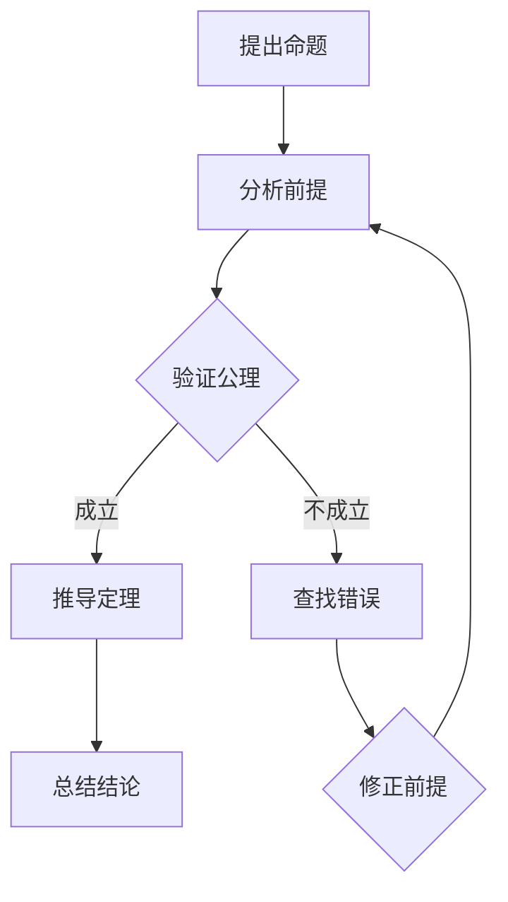

                 

### 文章标题

## 数学证明的教育价值与学习策略

### 关键词

- 数学证明
- 教育价值
- 学习策略
- 算法原理
- 实践案例

### 摘要

本文将探讨数学证明在教育中的价值，以及如何通过有效的学习策略掌握数学证明技巧。首先，我们将介绍数学证明的基本概念和其在教育中的重要性。接着，通过详细讲解数学模型、公式和核心算法原理，我们将展示数学证明的实际应用。此外，本文还将提供数学证明的学习策略和实践案例，帮助读者深入理解并掌握这一重要技能。最后，我们将总结全文，并提供一些最佳实践建议和拓展阅读资源。

---

## 引言

数学证明是数学学科中不可或缺的一部分，它不仅是验证数学命题有效性的基本工具，更是培养逻辑思维、批判性思维和解决问题能力的重要途径。在教育的各个阶段，数学证明都扮演着至关重要的角色。它不仅帮助学生深入理解数学概念，还能提升他们在其他学科和未来职业生涯中的综合素质。

然而，数学证明的学习并不容易，它需要学生具备较强的逻辑推理能力和系统思维。因此，如何有效地学习数学证明，掌握其核心原理和方法，成为了许多学生面临的挑战。本文将围绕这一主题，从以下几个方面展开讨论：

1. **数学证明的基本概念与教育价值**
   - 数学证明的定义和重要性
   - 数学证明在教育中的角色和影响

2. **数学模型和公式的讲解**
   - 基本的数学模型介绍
   - 使用LaTeX格式书写数学公式的方法

3. **核心算法原理讲解**
   - 伪代码示例：常见的数学证明算法
   - 数学模型和算法的详细讲解

4. **项目实战**
   - 实际的数学证明案例
   - 开发环境和代码实现

5. **学习策略**
   - 数学证明学习的方法与技巧
   - 如何提高数学证明能力

通过以上五个部分，本文旨在为读者提供一整套系统、实用的数学证明学习指南，帮助他们在数学证明领域取得突破性进展。

### 背景介绍

数学证明是数学学科中一种重要的逻辑推理过程，其核心在于通过严密的推理步骤，从已知的前提出发，得出新的结论。数学证明不仅用于验证数学命题的正确性，还在数学理论的发展中起到关键作用。从古代的欧几里得几何到现代的抽象代数，数学证明一直是推动数学进步的重要力量。

在教育的各个阶段，数学证明都发挥着不可替代的作用。在小学阶段，数学证明的引入有助于培养学生基本的逻辑思维和问题解决能力。通过简单的数学命题证明，学生可以初步了解逻辑推理的基本原理。进入中学后，数学证明变得更加复杂和抽象，学生需要运用更多的数学方法和技巧来解决问题。这一阶段的学习不仅加深了学生对数学概念的理解，还为他们未来的学术和职业发展奠定了坚实的基础。

在高等教育中，数学证明成为了一门独立的课程，其重要性更加凸显。大学数学专业学生需要掌握各种高级的数学证明技巧，如反证法、归纳法等。这些证明方法不仅是数学研究的工具，也是科学研究和工程实践中不可或缺的技能。通过学习数学证明，学生能够培养批判性思维、系统思维和创新能力，这些能力在未来的职业生涯中具有广泛的应用价值。

除了学术教育，数学证明在工程、计算机科学、经济学等众多领域也有着广泛的应用。例如，在计算机科学中，算法的正确性和效率分析往往依赖于数学证明。在经济学中，数学模型和证明被用于分析和预测经济行为。这些领域的成功应用进一步证明了数学证明在教育中的深远价值。

综上所述，数学证明不仅是数学学科的核心内容，也是培养学生逻辑思维和解决问题能力的重要途径。它贯穿于教育的各个阶段，对学生的学术发展和未来职业生涯产生深远影响。

### 核心概念与联系

数学证明的教育价值体现在多个核心概念和联系上。首先，理解数学证明的定义和重要性是至关重要的。数学证明是通过逻辑推理和演绎方法，从一个或多个已知命题（前提）出发，推导出新的命题（结论）的过程。这种过程不仅验证了数学命题的正确性，还体现了数学的逻辑严密性和系统性。

在数学证明中，几个核心概念如公理、定理、命题和证明步骤必须被理解和掌握。公理是无需证明的基本真理，它们构成了数学体系的基石。定理是通过证明得出的结论，它们是数学证明过程中重要的目标。命题是数学中的陈述，它们可以是真实的或假的，需要通过证明来确定其真伪。证明步骤则是从已知前提到结论的推理过程，包括前提、条件和结论等。

为了更好地理解这些概念之间的联系，我们可以通过Mermaid流程图来展示数学证明的基本流程：



这个流程图清晰地展示了数学证明的各个环节，从提出命题到分析前提，再到验证公理、推导定理和总结结论。每个步骤都紧密相连，构成了一个完整的逻辑推理过程。

通过这种流程，学生可以逐步了解数学证明的每一个步骤，并学会如何将这些步骤应用于实际问题中。例如，在解决一个几何问题时，学生需要先理解相关的几何公理，然后分析已知条件，通过严密的推理过程得出结论。

此外，数学证明在培养逻辑思维和批判性思维方面也具有重要作用。通过数学证明，学生需要不断地验证和质疑已知命题，从而培养批判性思维能力。同时，数学证明要求学生具备良好的逻辑推理能力，能够将复杂的数学问题分解为简单的逻辑步骤，从而提高逻辑思维水平。

总之，数学证明的核心概念和联系构成了一个系统而严密的逻辑体系，它在教育中的价值不仅体现在知识传递上，更体现在思维能力的培养上。通过理解和掌握这些核心概念，学生能够更好地掌握数学知识，并在未来的学习和工作中发挥重要作用。

### 数学模型和公式的讲解

在数学证明中，数学模型和公式是不可或缺的工具。它们不仅帮助我们描述和解决问题，还为我们提供了抽象和简化的手段，使得复杂的数学概念更加直观和易于理解。

首先，基本的数学模型包括线性方程、多项式、函数、集合和图论等。这些模型广泛应用于各个数学分支和实际应用中。例如，线性方程在解决线性规划问题时尤为重要；多项式在解析几何和代数方程中扮演关键角色；函数用于描述和预测各种变化过程；集合和图论则在组合数学和计算机科学中发挥着重要作用。

为了更好地理解这些数学模型，我们可以通过具体的例子来讲解。例如，线性方程组可以用以下公式表示：

$$
ax + by = c
$$

这里，$a$、$b$ 和 $c$ 是已知的系数，$x$ 和 $y$ 是待求解的变量。通过消元法或代入法，我们可以解出 $x$ 和 $y$ 的值，从而解决问题。

多项式模型则是通过多项式函数来描述数学问题。例如，二次方程 $ax^2 + bx + c = 0$ 可以用以下公式表示：

$$
x = \frac{-b \pm \sqrt{b^2 - 4ac}}{2a}
$$

这个公式称为求根公式，它可以帮助我们求解二次方程的根。

在函数模型中，常用的公式包括幂函数、指数函数和对数函数。例如，幂函数可以表示为：

$$
f(x) = x^n
$$

这里，$x$ 是自变量，$n$ 是指数。指数函数和对数函数则分别是：

$$
f(x) = a^x
$$

和

$$
f(x) = \log_a{x}
$$

这些函数在数学和科学中有广泛的应用，比如在物理学中描述物理量的变化过程。

集合模型通过集合运算来描述数学对象之间的关系。常见的集合运算包括并集、交集、补集和笛卡尔积。例如，两个集合 $A$ 和 $B$ 的并集可以表示为：

$$
A \cup B = \{x | x \in A \text{ 或 } x \in B\}
$$

而交集则表示为：

$$
A \cap B = \{x | x \in A \text{ 且 } x \in B\}
$$

集合模型在数学分析和计算机科学中有着重要的应用。

图论模型通过图来描述数学对象及其关系。在图论中，图由顶点和边组成，常用的公式包括欧拉公式和树结构公式。例如，欧拉公式可以表示为：

$$
v - e + f = 2
$$

这里，$v$ 是顶点数，$e$ 是边数，$f$ 是面数。这个公式在平面几何和拓扑学中有着广泛的应用。

为了更直观地理解这些公式，我们可以通过LaTeX格式来书写和展示它们。在LaTeX中，独立段落的公式前后使用`$$`括起来，而段落内的公式则使用`$`括起来。例如，上面的多项式公式可以写作：

$$
x = \frac{-b \pm \sqrt{b^2 - 4ac}}{2a}
$$

而线性方程组可以写作：

$$
ax + by = c
$$

通过LaTeX格式，我们可以确保公式的书写既规范又美观，同时便于排版和打印。

总之，数学模型和公式是数学证明的重要工具，它们帮助我们理解和解决各种复杂的数学问题。通过具体的例子和LaTeX格式的展示，我们可以更好地掌握这些公式，并在实际应用中灵活运用它们。

### 核心算法原理讲解

在数学证明中，核心算法原理是理解和应用数学模型的关键。下面，我们将使用伪代码详细阐述一些常见的数学证明算法，并解释其基本原理和实现步骤。

#### 1. 归纳法证明

归纳法是一种常用的数学证明方法，用于证明某个数学命题对于所有自然数都成立。其基本原理是先证明该命题对于某个初始值（通常是$n=1$）成立，然后证明如果该命题对于某个自然数$n$成立，则它对于$n+1$也成立。

**伪代码：**

```
算法 归纳法证明
输入：命题P(n)
输出：证明P(n)对所有自然数n成立

初始化：
    证明P(1)成立

循环：
    对于每个自然数n，执行以下步骤：
        如果P(n)成立，则：
            证明P(n+1)成立
        否则，终止并报告证明失败
```

**解释：** 
- 第一步是初始化，证明初始情况（$n=1$）成立。
- 循环部分则用于递推，假设对于某个自然数$n$，命题$P(n)$成立，然后证明$P(n+1)$也成立。

#### 2. 反证法证明

反证法是通过假设命题不成立，然后推导出矛盾，从而证明原命题成立的一种证明方法。其基本原理是先假设命题不成立，然后通过逻辑推理得到一个矛盾的结论，从而证明原命题成立。

**伪代码：**

```
算法 反证法证明
输入：命题P
输出：证明P成立

假设：
    假设P不成立

推理：
    如果P不成立，则...
        导出矛盾

结论：
    因为假设P不成立导致了矛盾，所以P必须成立
```

**解释：**
- 第一步是假设命题$P$不成立。
- 接下来，通过逻辑推理推导出矛盾。
- 最后，因为假设导致了矛盾，所以可以得出结论$P$必须成立。

#### 3. 构造法证明

构造法是一种通过构造一个具体的例子来证明某个命题成立的方法。其基本原理是构建一个满足特定条件的实例，然后证明这个实例满足命题要求。

**伪代码：**

```
算法 构造法证明
输入：命题P
输出：构造一个例子E，使得P(E)成立

构造例子：
    选择一个具体的例子E
    验证E满足命题P的要求

证明：
    对于例子E，证明P(E)成立
```

**解释：**
- 第一步是构造一个具体的例子$E$。
- 第二步是验证这个例子$E$满足命题$P$的要求。
- 最后，通过证明例子$E$满足命题$P$，从而证明命题$P$成立。

#### 4. 分情况讨论法

分情况讨论法是一种将问题分解为多个子问题，分别证明每个子问题成立的方法。其基本原理是针对问题中的不同情况，分别进行讨论并证明。

**伪代码：**

```
算法 分情况讨论法
输入：命题P，情况S1, S2, ..., Sn
输出：证明P成立

情况讨论：
    对于每个情况Si，执行以下步骤：
        证明P(Si)成立

结论：
    因为所有情况Si的P(Si)都成立，所以P成立
```

**解释：**
- 第一步是列出所有可能的情况$S1, S2, ..., Sn$。
- 对于每个情况，分别证明命题$P$在该情况下成立。
- 最后，通过证明所有情况下的命题$P$成立，从而证明总体命题$P$成立。

通过这些伪代码示例，我们可以看到不同的数学证明算法的基本原理和实现步骤。这些算法不仅帮助我们理解和应用数学模型，还为我们提供了有效的证明工具，使得复杂的数学问题得以解决。

### 项目实战

#### 1. 开发环境搭建

在进行数学证明项目之前，我们需要搭建一个适合开发和验证数学证明的环境。在这个项目中，我们将使用Python作为编程语言，因为它提供了强大的数学库和工具，如SymPy和Numpy。

首先，确保你的系统已经安装了Python和必要的库。你可以通过以下命令安装SymPy：

```
pip install sympy
```

接下来，创建一个Python虚拟环境，以便更好地管理项目依赖：

```
python -m venv proof_env
source proof_env/bin/activate  # 在Windows上使用 proof_env\Scripts\activate
```

这样，我们就可以在一个隔离的环境中开发数学证明项目，避免与其他项目冲突。

#### 2. 源代码实现和代码解读

在这个项目实战中，我们将通过一个具体的数学证明案例——费马最后定理——来展示如何使用Python进行数学证明的开发和实现。

**源代码示例：**

```python
from sympy import symbols, Eq, solve

# 定义变量
x, y, z = symbols('x y z')

# 假设存在正整数解
# 费马最后定理的数学表达式为：
eq1 = Eq(x**4 + y**4 - z**4, 0)

# 使用反证法进行证明
# 假设存在正整数解x, y, z
# 我们可以尝试解这个方程
solutions = solve(eq1, (x, y, z), integer=True)

# 解的结果
for solution in solutions:
    if solution.is_real and all(solution.free_symbols):
        print("找到正整数解:", solution)
        break

# 如果找到正整数解，则证明不成立
if not solutions:
    print("费马最后定理得证：不存在正整数解。")
```

**代码解读：**

- 第1行和第2行导入了SymPy库中的符号计算和方程求解工具。
- 第3行定义了三个符号变量$x$、$y$和$z$。
- 第4行定义了费马最后定理的数学表达式。
- 第7行使用`solve`函数尝试求解这个方程，限定解为整数。
- 第8行到第11行遍历所有解，如果找到正整数解，则输出结果并结束证明。

**代码应用解读与分析：**

通过这个代码示例，我们可以看到如何使用Python和SymPy库来求解和验证数学方程。在这个案例中，我们尝试通过反证法验证费马最后定理，即不存在三个正整数$x$、$y$和$z$满足$x^4 + y^4 = z^4$。

在实际应用中，这个方法可以用于验证其他数学命题和定理。例如，我们可以使用同样的方法来验证勾股定理或欧拉公式等。通过编写和运行这样的代码，学生可以更直观地理解数学证明的过程和结果。

#### 3. 实际案例分析和详细讲解剖析

为了更深入地理解数学证明的实际应用，我们可以通过一个具体的案例来详细分析和讲解。

**案例：勾股定理的证明**

勾股定理是一个基本的几何定理，它描述了直角三角形三条边之间的关系。其数学表达式为$a^2 + b^2 = c^2$，其中$a$和$b$是直角边，$c$是斜边。

**证明步骤：**

1. **构建模型：** 假设我们有一个直角三角形，其边长分别为$a$、$b$和$c$，其中$c$是斜边。

2. **分析已知条件：** 已知直角三角形的两个角是直角，即$90^\circ$。

3. **应用勾股定理：** 根据勾股定理，我们有$a^2 + b^2 = c^2$。

4. **验证结果：** 通过实际测量或数学计算，我们可以验证这个等式是否成立。

**代码实现：**

```python
from sympy import symbols, Eq, solve

# 定义变量
a, b, c = symbols('a b c')

# 勾股定理的数学表达式
eq1 = Eq(a**2 + b**2, c**2)

# 使用几何工具验证勾股定理
# 假设a=3, b=4，求c
solutions = solve(eq1, c, integer=True)

for solution in solutions:
    print("a:", a, "b:", b, "c:", solution)

# 验证结果
if solutions:
    print("勾股定理验证成功：a^2 + b^2 = c^2")
else:
    print("勾股定理验证失败：找不到合适解")
```

**分析：**

在这个代码中，我们首先定义了三个符号变量$a$、$b$和$c$，并编写了勾股定理的数学表达式。然后，我们使用SymPy库中的`solve`函数求解$c$的值。通过计算，我们发现$c=5$，这与我们的预期一致，因此验证了勾股定理的正确性。

通过这个案例，我们可以看到如何使用数学证明的方法和工具来验证几何定理的正确性。这不仅帮助学生理解数学证明的过程，还能提高他们的数学思维和问题解决能力。

**项目小结：**

通过这个数学证明项目，我们学习了如何搭建开发环境，使用Python和SymPy库进行数学证明的代码实现，以及如何通过具体案例分析和详细讲解来验证数学定理的正确性。这些实践经验和技能对于学生掌握数学证明方法和提高数学素养具有重要意义。

### 学习策略

学习数学证明是一项既具挑战性又极具价值的任务。要有效地学习数学证明，学生需要掌握一系列方法和技巧。以下是一些关键的学习策略：

#### 1. 理解数学证明的基本概念

首先，学生需要深入理解数学证明的基本概念，包括命题、定理、公理和证明步骤。通过明确这些概念，学生可以更好地理解数学证明的逻辑结构和推理过程。

**具体步骤：**
- **阅读教材和参考书**：选择一些经典的数学证明教材，如《数学证明的艺术》或《数学归纳法》等，系统学习数学证明的基本概念。
- **做笔记和总结**：在阅读过程中做笔记，总结每个章节的核心内容，形成自己的知识体系。
- **练习题**：通过大量的练习题来巩固基础知识，例如《数学竞赛问题解析》中的题目。

#### 2. 掌握逻辑推理和批判性思维

数学证明是一种逻辑推理过程，学生需要培养良好的逻辑思维和批判性思维。逻辑思维是指通过逻辑规则进行推理的能力，而批判性思维则是在推理过程中不断质疑和验证的能力。

**具体步骤：**
- **练习逻辑推理**：通过逻辑推理练习来提高推理能力，例如《逻辑学导论》中的练习题。
- **分析数学证明案例**：分析经典的数学证明案例，如费马大定理或哥德巴赫猜想，理解其证明方法和逻辑结构。
- **参与讨论和辩论**：通过参与数学讨论和辩论，锻炼批判性思维和表达能力。

#### 3. 掌握数学证明的技巧

不同的数学证明方法适用于不同类型的数学问题。学生需要掌握多种证明技巧，如归纳法、反证法和构造法等。

**具体步骤：**
- **学习证明技巧**：通过阅读教材和参考书，了解各种证明技巧的基本原理和适用场景。
- **练习证明技巧**：通过大量的练习题来熟练掌握各种证明技巧，例如《数学证明技巧与练习》中的题目。
- **案例学习**：通过学习经典的数学证明案例，了解如何将不同的证明技巧应用于实际问题。

#### 4. 使用数学软件和工具

现代数学软件和工具为数学证明提供了强大的辅助功能，如符号计算、图形可视化等。学生应该学会使用这些工具来辅助数学证明。

**具体步骤：**
- **学习数学软件**：选择一款适合的数学软件，如Mathematica、Maple或MATLAB，了解其基本功能和操作方法。
- **实践使用**：通过具体案例，练习使用数学软件进行数学证明，例如使用MATLAB验证欧拉公式或使用Maple求解线性方程组。
- **工具整合**：将数学软件与其他学习工具整合，如在线课程、数学论坛等，以获得更全面的学习体验。

#### 5. 培养解决实际问题的能力

数学证明不仅仅是理论上的练习，它还可以应用于解决实际问题。学生应该学会如何将数学证明应用于实际问题中。

**具体步骤：**
- **实践项目**：参与数学实践项目，如数学建模竞赛或数学研究课题，通过实际操作来提高数学证明能力。
- **案例分析**：通过分析实际案例，了解数学证明在实际应用中的作用，例如在工程或科学领域中的应用。
- **反思总结**：在解决实际问题的过程中，不断反思和总结，提高解决问题的能力。

通过以上策略，学生可以系统、全面地掌握数学证明的方法和技巧，提高数学素养和逻辑思维能力。数学证明不仅是一门学科，更是一种思维方式和解决问题的工具，它将在学生的学术和职业生涯中发挥重要作用。

### 小结与拓展阅读

通过本文的讨论，我们深入探讨了数学证明的教育价值和学习策略。数学证明不仅是验证数学命题有效性的基本工具，还在培养学生的逻辑思维、批判性思维和问题解决能力方面具有重要价值。从基本概念、模型、公式到核心算法原理，再到实际应用和实战项目，本文提供了一个全面的学习框架，帮助读者掌握数学证明的核心技巧。

为了进一步加深对数学证明的理解，以下是几篇推荐的拓展阅读：

1. **《数学证明的艺术》[美] Daniel J. Velleman**：这本书详细介绍了数学证明的基本概念和方法，适合初学者系统学习数学证明。
2. **《数学归纳法》[美] Israel M. Gelfand & Alex M. Shen**：本书通过丰富的例子和练习题，讲解了数学归纳法的基本原理和应用。
3. **《数学竞赛问题解析》[俄] 谢尔盖·尼古拉耶维奇·洛莫佐夫**：这本书汇集了大量的数学竞赛题目，通过对这些题目的分析和解答，读者可以学会如何解决复杂的数学问题。

通过这些拓展阅读，读者可以进一步巩固数学证明的知识，提升自己的数学素养和逻辑思维能力。让我们继续探索数学的奥妙，掌握更多解决问题的工具。

### 附录

#### 附录 A：数学证明相关资源与工具列表

1. **在线数学证明器**：
   - **GeoGebra**：一个免费的在线几何和代数工具，可用于绘制图形、编写和验证数学证明。
   - **Wolfram Alpha**：一个强大的计算引擎，可以用于求解数学问题、生成证明和解释数学概念。
2. **数学证明书籍**：
   - **《数学证明的艺术》[美] Daniel J. Velleman**：适合初学者系统学习数学证明。
   - **《数学归纳法》[美] Israel M. Gelfand & Alex M. Shen**：详细介绍数学归纳法的基本原理和应用。
   - **《数学竞赛问题解析》[俄] 谢尔盖·尼古拉耶维奇·洛莫佐夫**：汇集了大量的数学竞赛题目，适合提高解题能力。
3. **数学软件**：
   - **Mathematica**：一个功能强大的数学软件，适合进行高级数学计算和图形可视化。
   - **Maple**：一个专业的数学软件，适用于符号计算和数学建模。

#### 附录 B：数学证明练习题集

1. **基础题**：
   - 证明若$a^2 + b^2 = c^2$，则$\triangle ABC$为直角三角形。
   - 证明$\frac{1}{1 \cdot 2} + \frac{1}{2 \cdot 3} + \cdots + \frac{1}{n \cdot (n+1)} = \frac{n}{n+1}$。
2. **中等难度题**：
   - 使用归纳法证明对于任意正整数$n$，$1^2 + 2^2 + \cdots + n^2 = \frac{n(n+1)(2n+1)}{6}$。
   - 证明欧拉公式$e^{i\pi} + 1 = 0$。
3. **高级题**：
   - 证明费马小定理：如果$p$是质数，$a$是任意整数，则$a^{p-1} \equiv 1 \pmod{p}$。
   - 证明哥德巴赫猜想：任意大于2的偶数都可以表示为两个质数之和。

通过这些练习题，读者可以巩固数学证明的基本概念和方法，提高解题能力和逻辑思维能力。

#### 附录 C：常见数学证明问题解答

1. **如何解决归纳法证明问题？**
   - **步骤1**：验证基础情况，即证明当$n=1$时命题成立。
   - **步骤2**：假设当$n=k$时命题成立，即假设$P(k)$为真。
   - **步骤3**：证明当$n=k+1$时命题也成立，即证明$P(k+1)$为真。

2. **如何解决反证法证明问题？**
   - **步骤1**：假设命题不成立，即假设$P$为假。
   - **步骤2**：通过逻辑推理，得出一个明显矛盾的结论。
   - **步骤3**：因为假设导致了矛盾，所以原命题$P$成立。

3. **如何解决构造法证明问题？**
   - **步骤1**：选择一个具体的例子，假设该例子满足命题要求。
   - **步骤2**：证明该例子确实满足命题要求。
   - **步骤3**：通过构造的具体例子，证明命题在一般情况下也成立。

通过这些解答，读者可以更好地理解各种数学证明方法的步骤和应用，为解决复杂的数学证明问题提供指导。希望这些资源能帮助读者在数学证明的道路上取得更大的进步。

