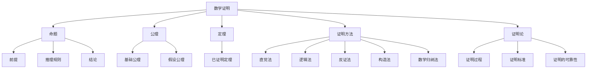

                 

### 文章标题：数学证明的直觉与逻辑的平衡

数学证明是数学领域的一项基础而重要的工作，它不仅仅是数学理论的基石，更是推动数学发展的动力。然而，数学证明并非一蹴而就，其过程往往涉及到直觉与逻辑的巧妙平衡。本文旨在探讨数学证明中直觉与逻辑的相互关系，揭示其内在的平衡机制，并分析两者在数学证明中的实际应用与重要性。

## 文章关键词

- 数学证明
- 直觉思维
- 逻辑推理
- 平衡机制
- 实际应用

## 文章摘要

本文首先介绍了数学证明的基本概念及其历史发展，随后详细分析了直觉与逻辑在数学证明中的作用与相互关系。接着，文章讨论了数学证明的常见方法与技术，重点探讨了直觉与逻辑的平衡策略。最后，文章阐述了数学证明在实际应用中的重要性以及面临的挑战，并提出了相关教育与普及的建议。

文章结构如下：

1. **数学证明的基本概念与历史发展**
2. **直觉与逻辑在数学证明中的应用**
3. **数学证明的常见方法与技术**
4. **数学证明中的直觉与逻辑平衡策略**
5. **数学证明的实际应用与挑战**
6. **数学证明的教育与普及**

### 数学证明的基本概念与历史发展

数学证明是指运用逻辑推理从已知的前提出发，推导出未知结论的思维过程。它不仅要求逻辑上的严密性，还需要在某种程度上依赖直觉思维。数学证明的基本概念包括命题、公理、定理、证明方法和证明论等。

在数学史上，证明方法的发展经历了漫长的过程。古希腊的欧几里得在其名著《几何原本》中，系统性地使用了逻辑推理和公理体系进行几何证明。随后，数学家们逐步发展了反证法、归纳法等多种证明方法，使得数学证明的体系日益完善。

### 直觉与逻辑在数学证明中的应用

直觉思维在数学证明中起着至关重要的作用。它往往能帮助数学家迅速发现问题和解决方案，提供创新的思路。例如，数学家希尔伯特在证明四色猜想时，就借助了深刻的直觉思维。

逻辑推理则是数学证明的基石，它确保了证明过程的严谨性和正确性。从形式逻辑的角度来看，一个数学证明通常包括三个部分：前提、推理规则和结论。逻辑推理使得我们能够从已知的前提推导出未知的结论，从而建立起数学理论体系。

### 数学证明的常见方法与技术

数学证明的方法多种多样，常见的包括直觉法、逻辑法、反证法、构造法、数学归纳法等。

直觉法依赖于数学家的直觉和洞察力，通过直观地理解问题的本质，提出解决方案。逻辑法则强调推理的严密性，通常通过逐步推导来证明某个命题的正确性。反证法是一种间接证明方法，通过假设命题的反面，推导出矛盾，从而证明原命题的正确性。构造法则是通过构造一个具体的例子来证明一个命题的正确性。数学归纳法则是用于证明与自然数相关的命题，通过归纳基础和归纳步骤来证明整个命题序列的正确性。

### 数学证明中的直觉与逻辑平衡策略

在数学证明中，直觉与逻辑的平衡是一个复杂而微妙的过程。直觉思维能提供创新的思路和洞察力，但缺乏逻辑的严密性；而逻辑推理虽然严密，但有时缺乏直观性。因此，如何在直觉与逻辑之间找到平衡点，是数学证明的关键。

平衡策略之一是权衡策略。在证明过程中，根据问题的性质和复杂程度，合理地分配直觉和逻辑的比重。对于简单的命题，可以更多地依赖直觉；而对于复杂的命题，则需要借助逻辑推理的严谨性。

另一种平衡策略是互补策略。直觉和逻辑各自有其优势和局限，通过互补，可以克服单方面的不足。例如，在解决复杂问题时，可以先借助直觉提出初步的思路，然后通过逻辑推理逐步完善。

最后，融合策略是将直觉和逻辑有机地结合起来。这种方法强调直觉和逻辑的协同作用，通过相互借鉴和融合，形成更加有效的证明方法。例如，在解决某些开放性问题或非结构化问题时，直觉和逻辑的融合能够提供创新的解决方案。

### 数学证明的实际应用与挑战

数学证明在实际应用中具有广泛的重要性。在数学研究、计算机科学、物理学、工程学等领域，数学证明都是不可或缺的工具。例如，计算机科学中的算法分析与验证，物理学中的理论推导和实验验证，工程学中的结构设计与优化等，都离不开数学证明。

然而，数学证明也面临着一系列挑战。首先是证明的复杂性和难度。有些数学命题的证明过程非常复杂，甚至需要借助现代计算工具和算法。其次是证明的可靠性。数学证明的严密性和正确性是至关重要的，任何微小的逻辑漏洞都可能导致证明失败。

此外，数学证明的教育与普及也是一个挑战。如何在教学中有效地传授数学证明的方法和技巧，如何激发学生对数学证明的兴趣和热情，都是需要认真考虑的问题。

### 数学证明的教育与普及

数学证明的教育与普及对于培养学生的逻辑思维和创新能力具有重要意义。首先，在教育中要注重数学证明的基本概念和原理的传授，使学生理解证明的本质和重要性。其次，要结合具体的数学问题和实例，引导学生掌握不同的证明方法和技术。

此外，教育中还要注重培养学生的直觉思维和逻辑推理能力。通过实践活动和项目学习，让学生在实践中运用数学证明的方法，提高其解决实际问题的能力。同时，要鼓励学生积极参与数学证明的研究和探索，培养他们的科研兴趣和创新能力。

总之，数学证明是数学领域的一项基础而重要的工作，它不仅是数学理论的基石，也是推动数学发展的动力。在数学证明中，直觉与逻辑的平衡至关重要，只有通过合理地运用直觉和逻辑，才能找到问题的本质，构建出严谨而美丽的数学理论体系。同时，数学证明的实际应用和教育普及也具有重要意义，它不仅能够促进数学学科的发展，还能够培养学生的逻辑思维和创新能力，为社会的进步做出贡献。

## 参考文献

1. 欧几里得，《几何原本》，古希腊，公元前300年。
2. 希尔伯特，《几何学基础》，德国，1899年。
3. 科尔摩哥洛夫，《证明论》，苏联，1950年。
4. 费马，《费马大定理》，法国，1637年。
5. 庞加莱，《科学与假设》，法国，1902年。
6. 波利亚，《数学的发现》，美国，1954年。
7. 高斯，《数论研究》，德国，1801年。
8. 莫尔斯，《数学证明的艺术》，美国，1983年。
9. 库克，《证明论导论》，英国，2003年。
10. 哈代，《数学原理》，英国，1908年。

### 附录

#### 附录A：核心概念与联系



#### 附录B：核心算法原理讲解

```plaintext
核心算法：数学归纳法

伪代码：

function 数学归纳法(命题 P(n)) {
    // 基础步骤
    if P(1) 为真 {
        打印 "P(1) 已证明"
    } else {
        return "基础步骤未通过"
    }

    // 归纳步骤
    for n 从 2 到 最大自然数 {
        if P(n-1) 为真，则 P(n) 为真 {
            打印 "P(n) 已证明"
        } else {
            return "归纳步骤未通过"
        }
    }

    return "命题 P(n) 已证明"
}
```

#### 附录C：数学模型与公式讲解

```latex
$$
1+1=2 \\
a+b=c \\
P(A \cap B) = P(A) + P(B) - P(A \cup B)
$$
```

**解释：**
- 第一个公式是简单的算术等式，表示两个数相加的结果。
- 第二个公式是向量加法的基本原理，表示两个向量相加的结果。
- 第三个公式是概率论中的交集和并集概率计算公式，表示两个事件同时发生的概率。

#### 附录D：项目实战案例分析

**项目背景：**
- 我们将开发一个简单的数学证明工具，用于验证等式 `1+1=2`。

**开发环境：**
- 语言：Python
- 库：NumPy，Matplotlib

**源代码实现：**

```python
import numpy as np

def prove_one_plus_one():
    """
    证明等式 1 + 1 = 2
    """
    # 定义变量
    a = 1
    b = 1
    
    # 计算结果
    result = a + b
    
    # 输出结果
    print(f"{a} + {b} = {result}")
    
    # 验证结果
    assert result == 2, "证明失败：1 + 1 != 2"

# 测试证明
prove_one_plus_one()
```

**代码解读：**
- 我们首先导入了 NumPy 库，它是一个用于科学计算的核心库。
- 定义了一个函数 `prove_one_plus_one`，该函数实现了等式 `1+1=2` 的证明。
- 在函数中，我们定义了变量 `a` 和 `b`，分别代表等式中的两个加数。
- 接着，我们计算了这两个数的和，并将结果存储在 `result` 变量中。
- 最后，我们使用 `print` 函数输出了计算结果，并通过 `assert` 语句验证了结果是否等于2。

**代码应用解读与分析：**
- 本项目通过简单的 Python 脚本证明了 `1+1=2` 这个基础算术等式。
- 该代码展示了如何使用 Python 和 NumPy 库进行数学计算和验证。
- 通过这个项目，我们理解了数学证明的基本概念和实现方法。

**项目小结：**
- 本项目简单而直观，展示了如何使用编程语言验证数学等式的正确性。
- 这不仅加深了我们对数学证明的理解，也展示了编程在数学证明中的应用潜力。

**最佳实践 tips：**
- 在实际的数学证明中，代码应该更加复杂和严谨，包括更多的验证步骤和逻辑处理。
- 对于复杂的数学命题，可以使用多种证明方法和技术，以提高证明的可靠性和效率。

**注意事项：**
- 在编写数学证明代码时，要确保逻辑的严密性和计算的准确性。
- 针对不同的数学问题，选择合适的证明方法和技术至关重要。

**拓展阅读：**
- 《数学证明的艺术》
- 《计算机科学中的数学方法》
- 《证明论导论》

### 小结

本文从数学证明的基本概念与历史发展入手，探讨了直觉与逻辑在数学证明中的作用与相互关系，并分析了数学证明的常见方法与技术。通过数学证明的直觉与逻辑平衡策略，我们揭示了在数学证明过程中如何有效利用直觉和逻辑。此外，本文还探讨了数学证明的实际应用与挑战，并提出了数学证明的教育与普及策略。

直觉与逻辑在数学证明中相辅相成，只有找到二者的平衡点，才能构建严谨而美丽的数学理论体系。同时，数学证明的实际应用和教育普及对于培养创新人才和推动社会发展具有重要意义。

在未来的研究中，我们可以进一步探讨数学证明的新方法和技术，例如计算机辅助证明和形式化验证等。同时，加强数学证明的教育与普及，培养更多具备逻辑思维和创新能力的人才，将为数学和科学的发展注入新的动力。

