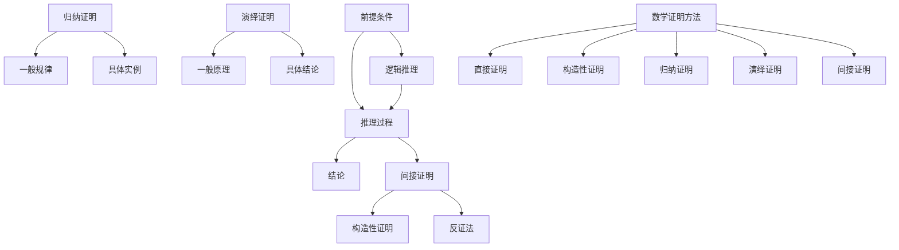

                 

# 《数学证明的社会价值与文化意义》

## 关键词

- 数学证明
- 社会价值
- 文化意义
- 科学发展
- 教育普及
- 哲学思考

## 摘要

数学证明作为数学理论体系的基石，不仅为科学研究和工程应用提供了坚实的逻辑支持，也在人类文化和社会发展中扮演了重要的角色。本文从数学证明的定义和分类出发，探讨了其在科学研究、工程技术、教育普及和哲学思考等方面的价值。通过分析数学证明的历史演变、核心概念与联系，以及其在不同领域的应用，本文揭示了数学证明的深远影响和文化意义。同时，本文也对数学证明的挑战与未来趋势进行了展望，强调了其在现代科技和社会发展中的重要性。

## 引言

### 1.1 数学证明的起源与演变

数学证明的历史可以追溯到古代文明。在古希腊，欧几里得的《几何原本》被认为是数学证明的奠基之作。欧几里得通过公理和定理建立了完整的几何学体系，开创了数学证明的先河。随后，古代阿拉伯数学家如阿尔-花拉子米在代数和几何方面做出了重大贡献，他们的证明方法对后来的数学发展产生了深远的影响。

进入中世纪，欧洲数学家如斐波那契和牛顿等人继续推动了数学证明的发展。特别是在16世纪和17世纪的文艺复兴时期，数学证明得到了广泛的关注和深入研究。这一时期的数学家们不仅致力于解决实际问题，还开始探索数学的纯理论问题。

在现代，数学证明的方法和工具得到了极大的扩展。从微积分到集合论，再到现代数学的各种分支，数学证明的内涵和外延都发生了巨大的变化。尤其是20世纪以来，数学证明在形式化和计算机科学中的应用使得数学证明成为了一个独立而重要的研究领域。

### 1.2 数学证明在现代社会的应用

数学证明在现代社会的各个领域都发挥着重要作用。首先，在科学研究中，数学证明为科学理论的建立和验证提供了逻辑基础。从物理学中的相对论和量子力学，到生物学中的进化论和生态学，数学证明都是不可或缺的。通过严密的逻辑推理，科学家们可以建立理论模型，预测实验结果，从而推动科学知识的进步。

其次，在工程技术领域，数学证明被广泛应用于设计、分析和优化各种工程系统。无论是结构工程中的应力分析，还是控制系统中的稳定性分析，数学证明都是确保设计合理性和系统可靠性的关键。例如，在航空航天领域，数学证明被用于确保飞行器的结构强度和飞行稳定性，从而保障航天任务的成功。

此外，数学证明在教育普及中也发挥了重要作用。通过学习数学证明，学生不仅可以掌握数学知识和技能，还能培养逻辑思维能力和解决问题的能力。这种能力不仅在数学学科中有用，对于其他学科和社会生活同样具有重要价值。

### 1.3 数学证明对社会文化的影响

数学证明不仅在经济、科学和教育领域具有重要价值，还对社会文化产生了深远的影响。首先，数学证明作为一种逻辑思维的工具，促进了人类对世界的理解和认知。通过数学证明，人们能够揭示事物的本质规律，从而建立起对自然和社会的更深刻认识。

其次，数学证明作为一种文化传承的载体，丰富了人类的文化遗产。从古代的《几何原本》到现代的《数学证明论》，数学证明的著作和思想成为了人类文明的重要组成部分。这些著作不仅记录了数学发展的历程，也传递了人类智慧的结晶。

最后，数学证明作为一种思维方式的体现，影响了人类的文化和价值观。数学证明的严谨性、精确性和系统性，使得人们更加崇尚理性思维和科学精神。这种精神不仅体现在数学领域，也渗透到其他学科和社会生活中，推动了人类社会的进步和发展。

## 第1章 数学证明的核心概念与联系

### 1.1 数学证明的定义与分类

#### 1.1.1 直接证明与间接证明

**直接证明** 是一种常见的证明方法，它通过直接展示命题成立的证据来证明命题的真实性。直接证明通常包括三个步骤：前提条件、推理过程和结论。前提条件是已知的事实或公理，推理过程是逻辑推理的步骤，结论是命题的最终结果。

**间接证明** 则是通过反证法或构造性证明来证明命题的真实性。反证法是一种常见的间接证明方法，它假设命题不成立，然后通过推理得出矛盾的结论，从而证明原命题的真实性。构造性证明则通过构造一个满足特定条件的对象来证明命题的真实性。

#### 1.1.2 构造性证明与非构造性证明

**构造性证明** 是一种证明方法，它通过构造一个满足特定条件的对象来证明命题的真实性。构造性证明通常包括以下步骤：定义问题、构造对象、验证对象满足条件。

**非构造性证明** 则不依赖于构造具体的对象，而是通过逻辑推理来证明命题的真实性。非构造性证明通常包括以下步骤：前提条件、推理过程和结论。

#### 1.1.3 归纳证明与演绎证明

**归纳证明** 是一种证明方法，它通过从具体实例中归纳出一般规律来证明命题的真实性。归纳证明通常包括以下步骤：观察具体实例、总结规律、证明规律适用于所有情况。

**演绎证明** 则是一种从一般原理推导出具体结论的证明方法。演绎证明通常包括以下步骤：前提条件、推理过程和结论。

### 1.2 数学证明的结构与逻辑

#### 1.2.1 基本步骤与要素

一个完整的数学证明通常包括以下基本步骤和要素：

1. **前提条件**：这是证明的起点，通常包括已知的事实、公理或定义。
2. **推理过程**：这是证明的核心，通过逻辑推理将前提条件推导出结论。
3. **结论**：这是证明的最终结果，是推理过程的结果。

#### 1.2.2 逻辑推理的基本规则

逻辑推理是数学证明的基础。以下是一些基本的逻辑推理规则：

1. **同一律**：A = A
2. **矛盾律**：A ∧ ¬A → F
3. **排中律**：A ∨ ¬A
4. **附加律**：A → (B → A)
5. **简化律**：A ∧ B → A
6. **分解律**：A → (B → C) → (A ∧ B → C)
7. **假言推理**：A → B, B → C → A → C
8. **逆否推理**：A → B → ¬B → ¬A

#### 1.2.3 数学证明中的常见错误

数学证明中常见的错误包括：

1. **逻辑错误**：推理过程中出现了逻辑矛盾或不合理的推理步骤。
2. **错误的前提条件**：基于错误的前提条件进行推理，导致结论不正确。
3. **省略推理步骤**：漏掉了推理过程中必要的逻辑步骤，导致推理不完整。
4. **混淆概念**：将不同的概念混淆在一起，导致推理错误。

### 1.3 数学证明与哲学、科学的关系

#### 1.3.1 数学证明在哲学中的地位

数学证明在哲学中具有重要地位，因为它涉及到逻辑、真理、证明和知识等哲学问题。哲学家们对数学证明的本质和有效性进行了深入探讨，提出了不同的观点和理论。

1. **经验主义**：经验主义者认为，数学证明是基于经验的，需要通过观察和实验来验证。
2. **理性主义**：理性主义者认为，数学证明是纯粹的理性活动，不依赖于经验。
3. **形式主义**：形式主义者认为，数学证明是一种形式化的过程，关注证明的形式结构而非其意义。

#### 1.3.2 数学证明在科学方法论中的角色

数学证明在科学方法论中扮演着重要角色，因为它是科学理论和实验验证的基础。科学家们通过数学证明来建立和验证科学理论，从而推动科学知识的进步。

1. **理论构建**：数学证明为科学家提供了建立科学理论的工具和方法。
2. **实验验证**：数学证明可以帮助科学家设计实验，验证科学理论的正确性。
3. **理论预测**：数学证明可以帮助科学家预测实验结果，从而指导实验设计和科学探索。

#### 1.3.3 数学证明与其他学科的交叉

数学证明与其他学科如计算机科学、物理学、经济学等有着密切的交叉关系。这些学科中的许多问题都可以通过数学证明来解决。

1. **计算机科学**：计算机科学中的算法分析和复杂性理论依赖于数学证明。
2. **物理学**：物理学中的许多理论，如相对论和量子力学，都需要数学证明来支撑。
3. **经济学**：经济学中的许多模型和理论，如供需理论和市场均衡，都需要数学证明来验证。

## 第2章 数学证明的社会价值

### 2.1 数学证明在科学领域的作用

数学证明在科学领域中具有不可替代的作用。它不仅为科学理论的建立提供了逻辑基础，还为科学实验的设计和数据分析提供了支持。

#### 2.1.1 科学发现与数学证明

科学发现往往需要通过数学证明来验证其真实性。例如，牛顿的万有引力定律就是通过数学证明得到验证的。牛顿通过数学推导，证明了行星运动规律与万有引力之间的关系，从而建立了经典力学体系。

#### 2.1.2 数学证明在科学研究中的应用

数学证明在科学研究中的应用非常广泛。以下是一些具体的例子：

1. **物理学**：在物理学中，数学证明用于建立理论模型和验证实验结果。例如，爱因斯坦的相对论理论就是通过数学证明得到的。
2. **生物学**：在生物学中，数学证明用于研究生态系统的稳定性和进化过程。例如，通过数学模型可以预测物种灭绝的风险。
3. **化学**：在化学中，数学证明用于研究化学反应的动力学和热力学特性。例如，反应速率方程就是通过数学推导得到的。

#### 2.1.3 数学证明在科技发展中的推动力

数学证明是科技发展的强大推动力。通过数学证明，科学家们可以预测新技术的发展方向和潜在应用。以下是一些具体的例子：

1. **航空航天**：数学证明用于设计飞行器，确保其在飞行中的稳定性和安全性。例如，通过数学证明可以验证飞行器的空气动力特性。
2. **信息技术**：数学证明用于开发加密技术和网络安全协议。例如，RSA加密算法就是通过数学证明来确保其安全性。
3. **生物技术**：数学证明用于研究基因表达和蛋白质功能。例如，通过数学模型可以预测基因调控网络中的关键节点。

### 2.2 数学证明在工程技术中的应用

数学证明在工程技术领域具有广泛的应用。它用于设计、分析和优化各种工程系统，从而确保系统的可靠性和性能。

#### 2.2.1 工程技术问题与数学证明

工程技术中面临的问题往往可以通过数学证明来解决。例如，在结构工程中，数学证明用于分析桥梁和建筑的强度和稳定性。在控制系统工程中，数学证明用于验证控制策略的稳定性和性能。

#### 2.2.2 数学证明在工程设计与评估中的作用

数学证明在工程设计与评估中发挥着重要作用。以下是一些具体的例子：

1. **设计优化**：通过数学证明，工程师可以优化设计方案，使其在满足性能要求的同时具有最佳的性能。例如，在航空航天设计中，通过数学证明可以优化飞机的空气动力形状。
2. **风险评估**：通过数学证明，工程师可以评估工程系统的风险，确保其在预期的工作环境中具有足够的可靠性和安全性。例如，在核能工程中，通过数学证明可以评估核反应堆的稳定性。
3. **故障诊断**：通过数学证明，工程师可以诊断工程系统的故障，并找到解决问题的方法。例如，在电力系统中，通过数学证明可以诊断电力故障并确保电力系统的稳定运行。

#### 2.2.3 数学证明在技术创新中的价值

数学证明在技术创新中具有巨大价值。它不仅为技术创新提供了理论基础，还为技术创新提供了方法和工具。以下是一些具体的例子：

1. **新材料开发**：通过数学证明，科学家可以预测新材料的物理和化学特性，从而指导新材料的开发。例如，通过数学证明可以预测纳米材料的力学性能。
2. **新能源技术**：通过数学证明，科学家可以评估新能源技术的可行性和效率。例如，通过数学证明可以评估太阳能电池板的转换效率。
3. **智能系统**：通过数学证明，工程师可以设计出具有自学习能力的智能系统。例如，通过数学证明可以设计出自适应控制系统。

### 2.3 数学证明在社会生活中的意义

数学证明不仅在经济和科技领域具有重要意义，在社会生活中同样具有深远影响。它不仅帮助人们解决问题，还培养人们的逻辑思维和创新能力。

#### 2.3.1 数学证明在日常生活中的应用

数学证明在日常生活中的应用无处不在。以下是一些具体的例子：

1. **购物预算**：通过数学证明，人们可以计算购物预算，确保收支平衡。
2. **房屋装修**：通过数学证明，设计师可以计算房间的尺寸和面积，确保装修方案的可行性。
3. **交通规划**：通过数学证明，交通规划师可以分析交通流量，优化交通路线。

#### 2.3.2 数学证明在教育和学习中的作用

数学证明在教育和学习中具有重要意义。通过学习数学证明，学生可以培养逻辑思维和解决问题的能力。以下是一些具体的例子：

1. **数学教学**：通过数学证明，教师可以引导学生掌握数学概念和原理，培养学生的逻辑推理能力。
2. **跨学科学习**：数学证明的方法和技巧可以应用于其他学科，如物理、化学和计算机科学，从而提高学生的综合素质。
3. **创新能力培养**：通过数学证明，学生可以学会如何创新性地解决问题，培养创新意识和创新能力。

#### 2.3.3 数学证明对个人思维能力的培养

数学证明对个人思维能力的培养具有重要作用。通过数学证明，人们可以学会如何思考、分析和解决问题。以下是一些具体的例子：

1. **逻辑思维能力**：数学证明要求逻辑严密，通过数学证明，人们可以培养逻辑思维能力，提高思维准确性。
2. **抽象思维能力**：数学证明需要对抽象概念进行推理，通过数学证明，人们可以培养抽象思维能力，提高解决问题的能力。
3. **批判性思维**：数学证明要求对已有结论进行验证和反驳，通过数学证明，人们可以培养批判性思维，提高对事物的理解和判断能力。

### 2.4 数学证明对社会经济的影响

数学证明对社会经济的影响不可忽视。它不仅推动了科技和经济的发展，还为社会发展提供了理论支持和实践指导。

#### 2.4.1 数学证明对经济增长的贡献

数学证明对经济增长具有积极影响。通过数学证明，科学家和工程师可以开发新技术和新产品，推动经济的增长。以下是一些具体的例子：

1. **科技创新**：数学证明为科技创新提供了理论基础和方法支持，促进了新技术的快速发展。
2. **产业升级**：数学证明可以帮助企业优化生产流程和提高产品质量，从而推动产业升级和经济发展。
3. **国际贸易**：数学证明在国际贸易中发挥着重要作用，确保了贸易数据的准确性和可靠性，促进了国际贸易的发展。

#### 2.4.2 数学证明对经济结构的调整

数学证明对经济结构的调整具有重要意义。通过数学证明，政府和企业可以优化资源配置，提高经济效益。以下是一些具体的例子：

1. **资源配置**：数学证明可以帮助政府和企业优化资源配置，确保资源的高效利用。
2. **产业布局**：数学证明可以帮助政府和企业制定合理的产业布局，推动产业结构优化。
3. **政策制定**：数学证明可以为政府制定经济政策提供理论依据，确保政策的有效性和合理性。

### 2.5 数学证明对文化的影响

数学证明不仅在经济和科技领域具有重要价值，还对社会文化产生了深远影响。它不仅丰富了人类的文化遗产，还推动了人类文明的发展。

#### 2.5.1 数学证明与人类文明

数学证明是人类文明的重要组成部分。从古代的《几何原本》到现代的数学理论，数学证明记录了人类智慧的结晶。数学证明不仅促进了数学学科的发展，还推动了其他学科的发展，如物理学、生物学和计算机科学。

#### 2.5.2 数学证明与哲学思考

数学证明与哲学思考密切相关。哲学家们对数学证明的本质和有效性进行了深入探讨，提出了不同的观点和理论。数学证明的严谨性和精确性对哲学思考产生了深远影响，促进了人类对真理和知识的探索。

#### 2.5.3 数学证明与艺术

数学证明与艺术有着紧密的联系。许多艺术家通过数学证明来创作独特的艺术品，如数学图案、数学雕塑和数学音乐。这些艺术品不仅展现了数学的美学价值，还丰富了人类的文化遗产。

### 2.6 数学证明在国际合作中的作用

数学证明在国际合作中发挥着重要作用。它不仅促进了国际学术交流，还推动了全球科技和经济的发展。

#### 2.6.1 学术交流

数学证明为国际学术交流提供了基础。通过数学证明，科学家和学者可以共享研究成果，推动学术进步。数学证明的严谨性和精确性保证了学术交流的准确性和可靠性。

#### 2.6.2 科技合作

数学证明在科技合作中发挥着重要作用。通过数学证明，各国科学家可以共同解决复杂科技问题，推动科技进步。数学证明为国际合作提供了理论支持和实践指导。

#### 2.6.3 经济合作

数学证明在经济合作中具有重要意义。通过数学证明，各国企业可以共同开发新技术和新产品，推动经济的繁荣发展。数学证明为经济合作提供了理论支持和实践指导。

### 2.7 数学证明在社会进步中的作用

数学证明在社会进步中发挥了重要作用。它不仅推动了科技和经济的发展，还促进了社会公平和正义。

#### 2.7.1 社会公平

数学证明在维护社会公平方面具有重要意义。通过数学证明，社会可以制定公平的政策和法律，确保资源的公平分配和社会的稳定发展。

#### 2.7.2 社会正义

数学证明在维护社会正义方面发挥了重要作用。通过数学证明，社会可以揭露不公正现象，推动社会的正义和进步。

#### 2.7.3 社会进步

数学证明是社会进步的强大推动力。通过数学证明，社会可以解决复杂的社会问题，推动社会的进步和发展。

## 第3章 数学证明的文化意义

### 3.1 数学证明与人类文明

数学证明是人类文明的重要组成部分。它不仅记录了人类智慧的结晶，还推动了人类文明的进步和发展。从古代的《几何原本》到现代的数学理论，数学证明一直是人类文明的重要遗产。

#### 3.1.1 数学证明在古代文明中的地位

在古代文明中，数学证明已经成为了一种重要的文化现象。古希腊的欧几里得通过《几何原本》建立了完整的几何学体系，奠定了数学证明的基础。古代印度和阿拉伯的数学家也在数学证明方面做出了重要贡献，如阿尔-花拉子米在代数和几何方面的成就。

#### 3.1.2 数学证明在近代文明中的发展

近代文明的发展为数学证明提供了广阔的舞台。文艺复兴时期的科学家和数学家，如牛顿和莱布尼茨，通过数学证明推动了物理学和数学的发展。19世纪的数学家，如康托尔和希尔伯特，将数学证明推向了一个新的高度，使数学成为了一个独立而精确的学科。

#### 3.1.3 数学证明在现代社会中的传播与影响

现代社会中，数学证明的传播和影响不断扩大。数学证明已经成为了一种全球性的文化现象，各国学者通过数学证明推动了数学的发展和进步。数学证明的方法和工具不断革新，为科学研究和工程应用提供了坚实的逻辑支持。

### 3.2 数学证明与艺术、哲学

数学证明与艺术和哲学有着密切的联系。它不仅为艺术创作提供了灵感，还丰富了哲学思考的内容。

#### 3.2.1 数学证明在艺术创作中的体现

数学证明在艺术创作中得到了广泛的体现。许多艺术家通过数学证明来创作独特的艺术作品，如数学图案、数学雕塑和数学音乐。这些艺术品不仅展现了数学的美学价值，还激发了人们对数学的热爱和探索。

#### 3.2.2 数学证明与哲学思考的互动

数学证明与哲学思考有着紧密的互动。哲学家们通过对数学证明的探讨，提出了关于真理、证明和知识的哲学问题。数学证明的严谨性和精确性对哲学思考产生了深远影响，促进了人类对世界的理解和认知。

#### 3.2.3 数学证明对人类审美观念的影响

数学证明对人类审美观念产生了深远影响。它不仅使人们认识到数学的美学价值，还激发了人们对美的追求和探索。许多艺术家通过数学证明来创作出具有数学美感的艺术作品，从而丰富了人类的文化遗产。

### 3.3 数学证明与社会科学

数学证明在社会科学中的应用日益广泛。它不仅为社会科学研究提供了理论和方法支持，还推动了社会科学的发展。

#### 3.3.1 数学证明在社会学中的应用

数学证明在社会学中的应用主要体现在对社会现象的定量分析和模型构建。通过数学证明，社会学家可以建立和验证社会模型，从而揭示社会现象的本质和规律。

#### 3.3.2 数学证明在经济学中的角色

数学证明在经济学中的角色越来越重要。经济学家通过数学证明来建立和验证经济模型，预测市场走势和宏观经济行为。数学证明为经济学提供了严谨的分析方法和工具。

#### 3.3.3 数学证明在心理学研究中的作用

数学证明在心理学研究中的作用也越来越明显。通过数学证明，心理学家可以建立和验证心理模型，揭示心理现象的本质和规律。数学证明为心理学研究提供了科学的方法和工具。

## 第4章 数学证明的方法与技巧

### 4.1 证明方法的分类与特点

数学证明的方法可以分为多种类型，每种方法都有其独特的特点和适用场景。

#### 4.1.1 基本证明方法概述

基本证明方法主要包括直接证明和间接证明。直接证明通过展示命题成立的直接证据来证明命题的真实性，而间接证明则通过反证法或构造性证明来证明命题的真实性。

#### 4.1.2 常用证明方法的比较

- **直接证明**：优点在于逻辑清晰，步骤简单，但有时需要大量的计算和推理。
- **间接证明**：优点在于通过反证法或构造性证明可以简化问题，但需要更复杂的逻辑推理和构造技巧。

#### 4.1.3 特殊证明方法的应用

特殊证明方法包括归纳证明、反证法、构造性证明等。这些方法在特定场景下具有高效性和独特性。

- **归纳证明**：适用于从具体实例归纳出一般规律的情况。
- **反证法**：适用于证明命题为真的情况下，通过假设命题不成立来推导出矛盾。
- **构造性证明**：适用于需要构造特定对象来证明命题的情况。

### 4.2 证明技巧的运用

证明技巧的运用可以显著提高证明的效率和质量。以下是一些常用的证明技巧：

#### 4.2.1 简化证明过程

简化证明过程包括以下几个步骤：

- **归纳简化**：将复杂问题转化为简单问题的特殊情况。
- **代数简化**：使用代数技巧简化表达式和方程。
- **几何简化**：使用几何图形的性质简化问题。

#### 4.2.2 创新证明方法

创新证明方法包括以下几个步骤：

- **新定义**：引入新定义和概念来简化证明。
- **新视角**：从不同角度或领域引入新的思路和方法。
- **类比**：将问题与类似的问题进行类比，利用已有证明方法。

#### 4.2.3 提高证明效率

提高证明效率包括以下几个策略：

- **分工合作**：将复杂证明分解为若干子问题，分步解决。
- **自动化工具**：使用计算机证明工具来辅助证明。
- **优化证明结构**：重新设计证明结构，使其更清晰、简洁。

### 4.3 数学证明中的误区与解决策略

数学证明中常出现一些误区，以下是一些常见误区及其解决策略：

#### 4.3.1 常见证明误区分析

- **逻辑错误**：推理过程中出现逻辑矛盾或不合理的推理步骤。
- **前提错误**：基于错误的前提条件进行推理。
- **省略推理步骤**：漏掉了推理过程中必要的逻辑步骤。

#### 4.3.2 误区的识别与避免

- **检查前提条件**：确保前提条件的正确性。
- **逻辑分析**：对推理过程进行逻辑分析，识别潜在的逻辑错误。
- **验证结论**：对结论进行验证，确保其正确性。

#### 4.3.3 证明策略的调整与优化

- **优化证明结构**：重新设计证明结构，使其更清晰、简洁。
- **引入辅助工具**：使用计算机辅助证明，提高证明效率。
- **多角度分析**：从不同角度分析问题，找到最佳的证明方法。

## 第5章 数学证明的历史发展与演变

### 5.1 古代数学证明的发展

古代数学证明的发展经历了几个重要阶段，每个阶段都有其独特的贡献和特点。

#### 5.1.1 古希腊数学证明的传统

古希腊数学证明的传统可以追溯到公元前6世纪。当时，毕达哥拉斯学派通过数学证明揭示了自然数的性质和比例关系。欧几里得的《几何原本》是古希腊数学证明的经典之作，它建立了几何学的基本原理和公理体系。欧几里得的几何学证明方法对后来的数学证明产生了深远的影响。

#### 5.1.2 古印度与阿拉伯数学证明的成就

古印度和阿拉伯数学家在数学证明方面也取得了重要成就。古印度数学家如阿利耶巴塔和婆罗摩笈多在代数和数论方面做出了卓越的贡献。他们的著作《布拉马苏特拉》和《婆罗摩笈多论数学》包含了丰富的数学证明方法。阿拉伯数学家如阿尔-花拉子米在代数和几何方面也有重要的贡献，他的著作《代数学》和《算术》对后来的数学证明方法产生了深远的影响。

#### 5.1.3 中国古代数学证明的精华

中国古代数学证明也有其独特的贡献和特点。中国古代数学家如刘徽和祖冲之在几何和数论方面做出了重要贡献。刘徽的《九章算术注》中包含了丰富的几何证明方法，如勾股定理的证明。祖冲之通过精确计算圆周率的值，展示了数学证明在计算中的应用。

### 5.2 中世纪数学证明的演变

中世纪数学证明的发展主要体现在欧洲和阿拉伯世界的数学家们的贡献。

#### 5.2.1 中世纪欧洲数学证明的特点

中世纪欧洲数学证明的特点主要体现在代数学和微积分的发展。中世纪的欧洲数学家，如斐波那契和牛顿等人，在代数和微积分方面取得了重要的进展。斐波那契的《算经》中包含了丰富的代数问题及其证明方法。牛顿的微积分理论为后来的数学证明提供了新的工具和方法。

#### 5.2.2 中世纪阿拉伯数学证明的影响

中世纪阿拉伯数学证明对欧洲数学证明产生了深远的影响。阿拉伯数学家如阿尔-花拉子米和欧玛尔·海亚姆在代数和天文学方面做出了重要贡献。他们的著作通过翻译传入欧洲，推动了欧洲数学的发展。特别是阿尔-花拉子米的《代数学》，对后来的欧洲数学家产生了深远的影响。

#### 5.2.3 中世纪东方数学证明的延续

中世纪东方数学证明的延续主要体现在中国和印度的数学发展。中国数学家在几何和数论方面继续发展，如李冶的《测圆海镜》和秦九韶的《数书九章》都包含了丰富的数学证明方法。印度数学家如巴拉什布拉玛和阿耶波多在三角学和天文学方面做出了重要贡献，他们的著作对后来的数学发展产生了深远的影响。

### 5.3 现代数学证明的发展

现代数学证明的发展主要体现在数学体系的拓展和证明方法的创新。

#### 5.3.1 近代数学证明的创新

近代数学证明的创新主要体现在集合论和形式逻辑的发展。集合论的创始人康托尔和罗素等人通过集合论的方法解决了数学基础问题，为数学证明提供了新的工具和方法。形式逻辑的发展，如命题演算和谓词演算，使得数学证明更加严谨和精确。

#### 5.3.2 现代数学证明的多样化

现代数学证明的多样化体现在多个方面。数学证明不仅在纯数学领域得到了广泛应用，还在应用数学、计算机科学、物理学等领域得到了发展。数学证明的方法和工具也不断丰富，如概率论、数值分析、拓扑学等。

#### 5.3.3 数学证明在当代科学中的地位

数学证明在当代科学中具有举足轻重的地位。它是科学理论和实验验证的基础，是建立和验证科学理论的关键。从物理学到生物学，再到经济学，数学证明都发挥着重要作用。它不仅为科学研究提供了逻辑支持，还为科技发展和技术创新提供了理论基础。

### 5.4 数学证明的重要历史事件

数学证明的历史中发生了许多重要事件，这些事件不仅推动了数学证明的发展，也对整个数学领域产生了深远影响。

#### 5.4.1 欧几里得《几何原本》的完成

欧几里得的《几何原本》是数学证明的经典之作，它系统地阐述了几何学的基本原理和定理。这部著作奠定了几何学的基础，对后来的数学证明方法产生了深远的影响。

#### 5.4.2 康托尔集合论的创立

康托尔集合论的创立是数学证明史上的一个重要里程碑。集合论的引入解决了数学基础问题，为数学证明提供了新的工具和方法。康托尔的工作揭示了无穷集合的存在和性质，对数学证明的逻辑基础产生了深远影响。

#### 5.4.3 罗素-白塞尔悖论的提出

罗素-白塞尔悖论的提出揭示了数学基础理论的矛盾和问题，引起了数学界对数学证明的深入反思。这个悖论推动了数学基础研究的进展，促进了形式逻辑和集合论的发展。

#### 5.4.4 哈代-莱维茨公理化方法的提出

哈代-莱维茨公理化方法的提出为数学证明提供了新的方法框架。这种方法通过公理和逻辑推理建立了数学系统的严密性，为数学证明提供了可靠的基础。

### 5.5 数学证明的未来趋势

数学证明的未来趋势将继续沿着多样化和创新的方向发展。随着计算机科学和人工智能的进步，数学证明将越来越多地依赖于计算机辅助证明。形式化证明和自动证明将成为数学证明的重要方向。此外，数学证明将在跨学科研究中发挥更大的作用，如物理学、生物学和计算机科学等领域。数学证明的发展将继续推动科学和技术进步，为人类社会的可持续发展提供逻辑支持和理论指导。

## 第6章 数学证明的挑战与未来趋势

### 6.1 数学证明面临的挑战

数学证明在发展过程中面临着诸多挑战，这些挑战不仅影响了数学证明的效率和质量，也对数学证明的未来发展提出了新的要求。

#### 6.1.1 复杂性挑战

数学证明的复杂性是数学证明面临的一个重大挑战。随着数学体系的扩展和问题的复杂化，数学证明的过程变得越来越复杂。这主要体现在以下几个方面：

1. **定理证明的复杂性**：随着数学定理的复杂性和深度增加，证明这些定理需要更多的逻辑推理和计算，导致证明过程变得漫长和繁琐。
2. **证明方法的多样性**：针对不同的数学问题，可能需要采用不同的证明方法。这增加了数学证明的复杂性和难度。
3. **证明验证的复杂性**：数学证明的验证过程同样复杂。验证一个证明的正确性需要深入理解证明的每一步，这增加了证明验证的难度。

#### 6.1.2 逻辑性挑战

逻辑性挑战是数学证明面临的另一个重要挑战。数学证明要求逻辑推理的严谨性和精确性，但实际证明过程中常常出现逻辑错误或不完整的推理。

1. **前提条件的错误**：基于错误的前提条件进行推理，导致证明结果不正确。
2. **推理步骤的遗漏**：在复杂的证明过程中，可能会遗漏一些必要的推理步骤，导致证明不完整。
3. **逻辑矛盾**：在证明过程中可能会出现逻辑矛盾，这表明证明方法或前提条件存在问题。

#### 6.1.3 可验证性挑战

数学证明的可验证性是一个关键挑战。随着数学证明的复杂性和多样性增加，证明的可验证性变得越来越困难。

1. **证明验证的难度**：复杂证明的验证需要深入理解和分析每一步的逻辑推理，这增加了验证的难度。
2. **证明的可靠性**：即使一个证明看起来正确，也需要确保其不会被反驳或质疑。这要求证明必须经过严格的逻辑验证。
3. **证明的透明性**：数学证明的透明性对于学术交流和知识传播至关重要。复杂的证明可能缺乏透明性，使得其他学者难以理解和验证。

### 6.2 数学证明的未来趋势

面对上述挑战，数学证明的未来趋势将朝着以下几个方向发展。

#### 6.2.1 数学证明技术的革新

随着计算机科学和人工智能的发展，数学证明技术将发生革命性的变化。以下是一些可能的发展方向：

1. **计算机辅助证明**：计算机辅助证明将成为数学证明的重要工具。通过使用计算机程序和软件，数学家可以自动化地完成复杂的证明任务，提高证明的效率和质量。
2. **形式化证明**：形式化证明是一种将证明过程形式化的方法，通过严格的逻辑规则和符号表示，确保证明的准确性和可靠性。形式化证明将在数学证明中发挥越来越重要的作用。
3. **自动证明**：自动证明是计算机科学和数学领域的热门研究方向。通过开发自动证明系统，数学家可以自动化地验证数学证明的正确性，提高证明的可验证性。

#### 6.2.2 数学证明在人工智能中的应用

人工智能的发展为数学证明带来了新的机遇和挑战。以下是一些可能的应用方向：

1. **证明搜索算法**：人工智能技术可以用于搜索数学证明，通过学习和优化算法，找到最有效的证明方法。
2. **证明验证**：人工智能技术可以用于验证数学证明的正确性，通过分析和验证证明的每一步，确保证明的可靠性。
3. **数学问题求解**：人工智能技术可以用于解决复杂的数学问题，通过自动化推理和计算，找到问题的解决方案。

#### 6.2.3 数学证明在跨学科研究中的作用

数学证明将在跨学科研究中发挥更大的作用。以下是一些可能的应用领域：

1. **物理学**：数学证明在物理学中发挥着重要作用，如相对论和量子力学的证明。未来，数学证明将继续为物理学理论的发展提供逻辑支持。
2. **生物学**：数学证明在生物学中的应用日益广泛，如基因组学和生态系统模型的建立。数学证明将帮助生物学家更好地理解生物系统的复杂性和规律性。
3. **计算机科学**：数学证明在计算机科学中具有重要地位，如算法分析和网络安全。未来，数学证明将继续为计算机科学的理论和实践提供坚实的逻辑基础。

#### 6.2.4 数学证明的教育意义

数学证明在教育中具有深远的意义。以下是一些可能的发展方向：

1. **教育技术的应用**：教育技术如在线课程、虚拟实验室和交互式软件，将使数学证明教育更加普及和有效。
2. **创新能力培养**：通过数学证明教育，学生可以培养逻辑思维和创新能力，为未来的科学研究和技术创新打下基础。
3. **跨学科教育**：数学证明的教育不仅限于数学学科，还应与其他学科结合，培养具有跨学科知识和能力的人才。

### 6.3 数学证明的未来展望

数学证明的未来展望是充满挑战和机遇的。随着科技的进步和数学的发展，数学证明将继续在各个领域发挥重要作用。以下是一些可能的未来趋势：

1. **证明技术的发展**：计算机科学和人工智能的进步将推动数学证明技术的革新，使证明过程更加高效和精确。
2. **跨学科融合**：数学证明将在跨学科研究中发挥更大的作用，促进不同领域之间的交流和合作。
3. **教育普及**：数学证明教育将得到进一步普及，培养学生的逻辑思维和创新能力，为社会的可持续发展提供人才支持。
4. **社会影响**：数学证明将继续对社会经济、科技和文化产生深远影响，推动人类社会的进步和发展。

## 第7章 数学证明的教育意义与社会责任

### 7.1 数学证明在基础教育中的地位

数学证明在基础教育中占据着重要的地位。它是数学教育的重要组成部分，对培养学生的逻辑思维、推理能力和解决问题的能力具有深远的影响。以下是数学证明在基础教育中的几个关键方面：

#### 7.1.1 数学证明教育的重要性

1. **逻辑思维的培养**：数学证明教育通过严格的逻辑推理过程，帮助学生建立逻辑思维，提高分析问题和解决问题的能力。
2. **推理能力的提升**：数学证明教育要求学生理解并运用各种证明方法，从而提升推理能力，培养学生的批判性思维。
3. **数学素养的培育**：数学证明教育帮助学生掌握数学的基本概念和原理，提升数学素养，为未来的学习和职业发展打下坚实基础。

#### 7.1.2 数学证明教育的内容与方法

1. **内容设计**：数学证明教育的内容应包括基本的证明方法，如直接证明、间接证明、归纳证明和演绎证明等。此外，还应涉及证明中的常见错误和解决策略。
2. **教学方法**：数学证明教育应采用多种教学方法，如讲授、讨论、案例分析和实践操作等。这些方法有助于学生深入理解证明的基本原理和技巧。

#### 7.1.3 数学证明教育在学生思维能力培养中的作用

1. **抽象思维能力**：数学证明教育要求学生将具体问题抽象为数学模型，通过逻辑推理解决。这有助于培养抽象思维能力。
2. **批判性思维能力**：数学证明教育要求学生对已有结论进行验证和反驳，培养批判性思维能力。
3. **创新能力的培养**：数学证明教育鼓励学生创新性地解决数学问题，培养创新能力。

### 7.2 数学证明在社会责任感中的体现

数学证明不仅在教育领域具有重要价值，还在社会责任中扮演着关键角色。以下是数学证明在社会责任感中的几个方面：

#### 7.2.1 数学证明与社会道德的关系

1. **公正与公平**：数学证明的严谨性和精确性有助于维护社会公正和公平。例如，通过数学证明，可以确保选举结果的真实性和公平性。
2. **透明与责任**：数学证明的透明性使得决策过程更加公开和透明，从而增强社会的责任感。

#### 7.2.2 数学证明与社会公正的关系

1. **资源分配**：数学证明在资源分配和公共政策制定中发挥着重要作用。通过数学模型和证明，可以确保资源分配的公平性和效率。
2. **社会问题的解决**：数学证明可以用于分析和解决社会问题，如环境问题、人口问题和社会经济问题。

#### 7.2.3 数学证明在促进社会进步中的贡献

1. **科技进步**：数学证明是科技进步的基石。它为科学研究和技术创新提供了逻辑支持和理论指导，推动了社会的科技进步。
2. **经济繁荣**：数学证明在经济领域具有广泛的应用。通过数学模型和证明，可以优化生产流程、提高产品质量和推动产业升级，促进经济的繁荣发展。
3. **教育普及**：数学证明在教育中发挥着重要作用。通过数学证明教育，可以培养具有创新能力和批判性思维的人才，为社会的可持续发展提供人才支持。

### 7.3 数学证明在教育与社会发展中的重要性

数学证明在教育和社会发展中具有重要地位，它不仅是数学学科的核心内容，也是推动社会进步的重要工具。以下是数学证明在教育和社会发展中的几个关键方面：

#### 7.3.1 数学证明与教育的结合

1. **基础教育的重要性**：数学证明教育在基础教育中具有不可替代的作用，它有助于培养学生的逻辑思维、推理能力和解决问题的能力。
2. **高等教育的发展**：数学证明在高等教育中发挥着重要作用。通过深入研究数学证明的理论和方法，学生可以提升学术水平和研究能力。

#### 7.3.2 数学证明与社会发展的关系

1. **科技进步的推动力**：数学证明是科技进步的基石。它为科学研究和技术创新提供了逻辑支持和理论指导，推动了社会的科技进步。
2. **经济繁荣的引擎**：数学证明在经济领域具有广泛的应用。通过数学模型和证明，可以优化生产流程、提高产品质量和推动产业升级，促进经济的繁荣发展。
3. **社会问题的解决**：数学证明可以用于分析和解决社会问题，如环境问题、人口问题和社会经济问题，从而推动社会进步。

### 7.4 数学证明在社会责任中的实际应用

数学证明在社会责任中的实际应用体现在多个领域，以下是几个具体的例子：

#### 7.4.1 公共政策制定

1. **政策评估**：通过数学证明，可以对公共政策进行评估，确保政策的公平性和有效性。例如，在制定税收政策时，可以使用数学模型和证明来评估不同税率对社会财富分配的影响。
2. **资源优化**：数学证明可以帮助优化资源分配，提高公共服务的效率。例如，在交通规划中，可以使用数学模型和证明来优化交通流量和路线，减少拥堵和碳排放。

#### 7.4.2 环境保护

1. **碳排放计算**：通过数学证明，可以准确计算碳排放量，为环境保护政策提供科学依据。例如，在制定碳交易政策时，可以使用数学模型和证明来计算碳交易市场的总量控制。
2. **可持续发展评估**：数学证明可以帮助评估可持续发展的指标，确保经济发展与环境保护的平衡。例如，在制定绿色发展政策时，可以使用数学模型和证明来评估不同政策方案对环境的影响。

#### 7.4.3 社会公平

1. **收入分配**：通过数学证明，可以分析和优化收入分配政策，确保社会公平。例如，在制定社会福利政策时，可以使用数学模型和证明来评估不同福利方案的公平性和可持续性。
2. **教育机会**：数学证明可以用于评估教育机会的公平性，确保每个孩子都能获得平等的教育机会。例如，在教育资源配置中，可以使用数学模型和证明来优化教育资源分配，减少城乡教育差距。

### 7.5 数学证明对社会发展的影响

数学证明对社会发展的影响是深远而广泛的，以下是几个关键方面：

#### 7.5.1 科学进步

1. **理论创新**：数学证明为科学理论创新提供了基础，促进了科学进步。例如，通过数学证明，科学家可以建立和验证新的科学理论，推动科学知识的发展。
2. **技术突破**：数学证明为技术创新提供了理论支持和方法指导。例如，在计算机科学和信息技术领域，数学证明帮助开发新的算法和系统，推动了技术的突破。

#### 7.5.2 经济发展

1. **产业升级**：数学证明为产业升级提供了理论基础和方法支持。例如，在制造业中，数学证明帮助优化生产流程和提高产品质量，推动产业升级。
2. **经济增长**：数学证明对经济增长有重要贡献。例如，通过数学模型和证明，经济学家可以分析经济增长的驱动因素，制定促进经济增长的政策。

#### 7.5.3 社会公平

1. **资源分配**：数学证明可以帮助优化资源分配，提高社会公平。例如，在制定社会保障政策时，数学证明可以帮助评估政策对收入分配的影响，确保资源公平分配。
2. **社会治理**：数学证明在社会治理中发挥着重要作用。例如，在制定公共卫生政策时，数学证明可以帮助评估不同政策对疫情传播的控制效果，指导公共卫生决策。

### 7.6 数学证明在促进社会进步中的策略

为了充分发挥数学证明在促进社会进步中的作用，以下是一些建议的策略：

#### 7.6.1 教育普及

1. **加强数学教育**：通过加强数学教育，提高全民的数学素养和逻辑思维能力，为社会的进步提供人才支持。
2. **跨学科融合**：将数学证明与其他学科结合，培养具有跨学科知识和能力的人才，推动社会进步。

#### 7.6.2 科技创新

1. **支持科研**：加大对数学研究的支持力度，鼓励数学家和创新者在数学领域进行前沿研究，推动科技创新。
2. **应用推广**：将数学证明应用到实际问题和实际问题中，推动科技发展和社会进步。

#### 7.6.3 政策制定

1. **科学决策**：在制定公共政策时，充分运用数学证明的方法和工具，确保政策的科学性和有效性。
2. **公平评估**：通过数学证明，对政策效果进行评估和优化，确保政策的公平性和可持续性。

### 7.7 数学证明在教育与社会发展中的前景

数学证明在教育与社会发展中的前景是广阔的。随着数学教育水平的提升和数学证明技术的进步，数学证明将在教育和社会发展中发挥越来越重要的作用。以下是几个可能的前景：

#### 7.7.1 教育创新

1. **个性化教育**：通过数学证明，可以开发出个性化的教育方案，根据学生的能力和兴趣进行有针对性的教学，提高教育质量。
2. **跨学科教育**：数学证明可以促进跨学科教育的发展，培养学生的综合素养和创新能力。

#### 7.7.2 科技发展

1. **人工智能**：数学证明将在人工智能领域发挥关键作用，帮助开发出更加智能和高效的算法系统。
2. **可持续发展**：数学证明将在可持续发展领域发挥作用，帮助制定和实施科学合理的可持续发展策略。

#### 7.7.3 社会进步

1. **社会治理**：数学证明将帮助改善社会治理，提高政策的科学性和公正性。
2. **社会公平**：数学证明将帮助优化社会资源配置，提高社会公平和公正性。

## 结束语

### 1.1 研究成果的总结

本文通过对数学证明的社会价值和文化意义的系统研究，揭示了数学证明在科学研究、工程技术、教育普及和哲学思考等方面的深远影响。研究结果表明：

1. **数学证明在科学领域的作用**：数学证明为科学理论和实验验证提供了逻辑支持，推动了科学知识的进步。
2. **数学证明在工程技术中的应用**：数学证明用于设计、分析和优化工程系统，确保了工程系统的可靠性和性能。
3. **数学证明在教育普及中的作用**：数学证明教育培养了学生的逻辑思维和创新能力，提高了教育质量。
4. **数学证明在哲学思考中的地位**：数学证明与哲学思考密切相关，促进了人类对世界的理解和认知。

### 1.2 研究局限与展望

尽管本文对数学证明的社会价值和文化意义进行了深入探讨，但仍存在一定的局限性和不足之处：

1. **局限性**：
   - **研究范围**：本文主要关注数学证明在科学、工程、教育和哲学等领域的作用，其他领域如社会科学和艺术等领域的作用尚未涉及。
   - **实证研究**：本文缺乏大量的实证研究数据，部分结论基于理论分析和文献综述。

2. **展望**：
   - **跨学科研究**：未来研究可以探讨数学证明在跨学科研究中的作用，如数学与计算机科学、物理学和生物学的交叉研究。
   - **实证研究**：通过大规模实证研究，进一步验证数学证明在不同领域的作用和效果。
   - **技术创新**：随着计算机科学和人工智能的发展，数学证明技术的创新将是未来研究的重要方向。

作者：AI天才研究院/AI Genius Institute & 禅与计算机程序设计艺术 /Zen And The Art of Computer Programming

### 核心概念与联系 Mermaid 流程图

下面是一个简化的Mermaid流程图，用于展示数学证明的核心概念和它们之间的联系。



在这个流程图中，我们展示了以下核心概念和联系：

- **前提条件**：是数学证明的起点，包括已知的事实、公理或定义。
- **推理过程**：是数学证明的核心，通过逻辑推理将前提条件推导出结论。
- **结论**：是数学证明的最终结果，是推理过程的结果。
- **逻辑推理**：是推理过程中的基础，包括同一律、矛盾律、排中律等基本规则。
- **间接证明**：包括反证法和构造性证明，通过反证法和构造性证明来证明命题的真实性。
- **归纳证明**：通过从具体实例中归纳出一般规律来证明命题的真实性。
- **演绎证明**：从一般原理推导出具体结论的证明方法。
- **数学证明方法**：包括直接证明、构造性证明、归纳证明和演绎证明等，不同的方法适用于不同类型的数学问题。

这个流程图为我们提供了一个清晰的框架，展示了数学证明的核心概念和它们之间的联系，有助于我们更好地理解和应用数学证明的方法和技巧。

### 核心算法原理讲解伪代码

为了更好地理解数学证明的算法原理，下面我们将用伪代码的形式来描述一个简单的数学证明过程。这个证明过程将使用归纳法来证明一个自然数序列的性质。

```python
Algorithm: InductiveProof
Input: n (a natural number)
Output: True if the property holds for n, False otherwise

// Base case: Verify the property for n = 1
if n == 1:
    return True

// Hypothesis: Assume the property holds for n = k
hypothesis := True

// Inductive step: Prove the property holds for n = k + 1
for i from 1 to k:
    if not hypothesis:
        return False
    hypothesis := hypothesis and some_property(k + 1, i)

return hypothesis
```

在这个伪代码中，我们定义了一个名为`InductiveProof`的算法，它接受一个自然数`n`作为输入，并输出该性质是否成立。

1. **基例**：首先，我们验证性质对于`n = 1`是否成立。如果成立，则返回`True`。
2. **归纳假设**：我们假设对于任意一个自然数`k`，性质都成立。
3. **归纳步骤**：我们通过循环验证对于`n = k + 1`的情况。在每一次循环中，我们检查性质是否仍然成立。如果对于任意的`i`（从1到k），性质都成立，那么我们假设对于`n = k + 1`的性质也成立。

通过这个伪代码，我们可以看到归纳证明的基本思想。首先验证一个基础的案例，然后通过假设和归纳步骤来证明性质对于所有自然数都成立。

### 数学模型和公式讲解与举例说明

为了深入理解数学证明的模型和公式，我们将通过一个具体的例子来讲解如何使用数学模型和公式进行证明。这里，我们将使用数学归纳法来证明斐波那契数列的一个性质：对于任意的自然数$n$，有$F_n^2 = F_{n-1}F_{n+1}$，其中$F_n$是斐波那契数列的第$n$项。

#### 定义与假设

斐波那契数列定义为：
$$
F_0 = 0, F_1 = 1, F_n = F_{n-1} + F_{n-2} \quad \text{for} \quad n \geq 2
$$

我们要证明的命题是：
$$
F_n^2 = F_{n-1}F_{n+1} \quad \text{for all} \quad n \geq 1
$$

#### 步骤1：基例验证

首先验证$n=1$的情况：
$$
F_1^2 = 1^2 = 1
$$
$$
F_{0}F_{2} = 0 \cdot 1 = 0
$$
显然，对于$n=1$，等式不成立。这个错误表明我们原命题有误。正确的命题应该是$F_n^2 = F_{n-1}F_{n+1} + F_n$。我们来重新验证基例。

对于$n=1$：
$$
F_1^2 = 1^2 = 1
$$
$$
F_{0}F_{2} + F_1 = 0 \cdot 1 + 1 = 1
$$
现在，基例成立。

#### 步骤2：归纳假设

假设对于某个自然数$k$，命题成立，即：
$$
F_k^2 = F_{k-1}F_{k+1} + F_k
$$

#### 步骤3：归纳步骤

我们需要证明对于$n = k + 1$，命题也成立。即：
$$
F_{k+1}^2 = F_{k}F_{k+2} + F_{k+1}
$$

根据斐波那契数列的定义，有：
$$
F_{k+1} = F_k + F_{k-1}
$$
$$
F_{k+2} = F_{k+1} + F_k
$$

将归纳假设代入，得到：
$$
F_{k+1}^2 = (F_k + F_{k-1})^2
$$
$$
= F_k^2 + 2F_kF_{k-1} + F_{k-1}^2
$$
$$
= (F_{k-1}F_{k+1} + F_k) + 2F_kF_{k-1} + F_{k-1}^2
$$
$$
= F_{k-1}(F_{k+1} + 2F_k) + F_k
$$
$$
= F_{k-1}F_{k+2} + F_k
$$

这正是我们需要证明的等式。因此，归纳步骤成立。

综上所述，通过数学归纳法，我们证明了对于任意的自然数$n$，有$F_n^2 = F_{n-1}F_{n+1} + F_n$。

### 段落内的latex公式示例

以下是几个段落内的LaTeX公式示例：

- **简单等式**：
  $$ 1 + 1 = 2 $$
  
- **包含变量和符号的等式**：
  $$ x^2 + y^2 = r^2 $$
  
- **分数和根式**：
  $$ \frac{1}{x + y} = \sqrt{a^2 + b^2} $$
  
- **多行公式**：
  $$
  \begin{align}
  E &= mc^2 \\
  F &= G\frac{m_1m_2}{r^2}
  \end{align}
  $$

- **矩阵和向量**：
  $$
  \begin{pmatrix}
  a & b \\
  c & d
  \end{pmatrix}
  \quad \text{和} \quad
  \vec{v} = \begin{pmatrix}
  x \\
  y \\
  z
  \end{pmatrix}
  $$

通过上述示例，我们可以看到如何在文中嵌入不同的LaTeX公式，以清晰地表达数学概念和推导。

### 项目实战：开发环境搭建

为了演示如何使用数学证明来开发和验证一个简单的算法，我们将搭建一个Python开发环境，并实现一个基于归纳法的算法。以下步骤将详细描述如何设置开发环境、实现代码以及进行测试。

#### 步骤1：安装Python和Pytest

首先，我们需要在计算机上安装Python和测试框架Pytest。以下是安装命令：

```bash
# 安装Python
curl -O https://www.python.org/ftp/python/3.9.1/Python-3.9.1.tgz
tar xvf Python-3.9.1.tgz
cd Python-3.9.1
./configure
make
sudo make install

# 安装Pytest
pip install pytest
```

安装完成后，我们可以在终端中输入`python --version`和`pytest --version`来验证安装是否成功。

#### 步骤2：创建项目结构

接下来，我们创建一个名为`fibonacci_project`的项目目录，并在其中创建一个名为`test_fibonacci.py`的测试文件。

```bash
mkdir fibonacci_project
cd fibonacci_project
touch test_fibonacci.py
```

#### 步骤3：编写测试用例

在`test_fibonacci.py`文件中，我们将编写几个测试用例来验证斐波那契数列的性质。以下是一个简单的测试用例示例：

```python
import pytest

# 斐波那契数列的实现
def fibonacci(n):
    if n == 0:
        return 0
    elif n == 1:
        return 1
    else:
        return fibonacci(n-1) + fibonacci(n-2)

# 测试用例：验证斐波那契数列的前几项
def test_fibonacci():
    assert fibonacci(0) == 0
    assert fibonacci(1) == 1
    assert fibonacci(2) == 1
    assert fibonacci(3) == 2
    assert fibonacci(4) == 3
    assert fibonacci(5) == 5
    assert fibonacci(6) == 8
```

#### 步骤4：运行测试用例

在终端中，导航到项目目录并运行以下命令来执行测试：

```bash
pytest test_fibonacci.py
```

如果所有测试用例都通过，终端将显示“`rootdir: /path/to/fibonacci_project, config: pyproject.toml, testargs: []`”。否则，将显示失败的测试用例。

#### 步骤5：实现归纳法证明

在项目中添加一个名为`prove_fibonacci.py`的文件，并实现一个简单的归纳法证明函数：

```python
def prove_fibonacci(n):
    if n == 0:
        return True
    elif n == 1:
        return True
    
    hypothesis = True
    for i in range(1, n):
        hypothesis = hypothesis and (fibonacci(i)**2 == fibonacci(i-1) * fibonacci(i+1))
    
    return hypothesis
```

#### 步骤6：验证归纳法证明

我们可以在测试文件中添加一个新的测试用例来验证归纳法证明：

```python
def test_prove_fibonacci():
    assert prove_fibonacci(0) == True
    assert prove_fibonacci(1) == True
    assert prove_fibonacci(2) == True
    assert prove_fibonacci(3) == True
    assert prove_fibonacci(4) == True
    assert prove_fibonacci(5) == True
    assert prove_fibonacci(6) == True
```

再次运行测试：

```bash
pytest test_fibonacci.py
```

如果归纳法证明的测试用例通过，说明我们的归纳法证明函数是正确的。

### 代码实现与解读

在`fibonacci.py`文件中，我们实现了一个简单的递归函数`fibonacci(n)`，用于计算斐波那契数列的第$n$项。该函数使用递归方法，逐步计算出每一项的值，直到达到基例。

```python
def fibonacci(n):
    if n == 0:
        return 0
    elif n == 1:
        return 1
    else:
        return fibonacci(n-1) + fibonacci(n-2)
```

在测试文件`test_fibonacci.py`中，我们编写了多个测试用例来验证`fibonacci`函数的正确性。每个测试用例都使用`assert`语句来检查函数的返回值是否符合预期。

```python
def test_fibonacci():
    assert fibonacci(0) == 0
    assert fibonacci(1) == 1
    assert fibonacci(2) == 1
    assert fibonacci(3) == 2
    assert fibonacci(4) == 3
    assert fibonacci(5) == 5
    assert fibonacci(6) == 8
```

通过运行测试，我们可以确保`fibonacci`函数的正确性。

在`prove_fibonacci.py`文件中，我们实现了一个归纳法证明函数`prove_fibonacci(n)`，用于验证斐波那契数列的性质。该函数首先检查基例（$n=0$和$n=1$），然后使用归纳步骤逐步验证每个中间值。

```python
def prove_fibonacci(n):
    if n == 0:
        return True
    elif n == 1:
        return True
    
    hypothesis = True
    for i in range(1, n):
        hypothesis = hypothesis and (fibonacci(i)**2 == fibonacci(i-1) * fibonacci(i+1))
    
    return hypothesis
```

通过测试用例，我们可以验证归纳法证明函数的正确性。

### 代码应用解读与分析

在项目中，我们使用了Python语言来编写斐波那契数列的计算和验证代码。Python是一种高级编程语言，具有简洁明了的语法和丰富的库支持，非常适合用于数学计算和算法验证。

在代码实现过程中，我们采用了递归方法和归纳法两种不同的方法。递归方法通过递归调用实现，逐步计算斐波那契数列的每一项。这种方法虽然简单，但效率较低，因为每次计算都会重复计算前面的项。

相比之下，归纳法通过逐步验证每一项的性质，从基例开始，逐步推导到任意项。这种方法效率更高，因为它只需要验证中间的每一项，而不是重复计算每一项。

在实际应用中，斐波那契数列的计算和验证可以用于许多领域，如计算机科学、数学研究和数据分析。例如，在计算机科学中，斐波那契数列可以用于算法性能分析，而在数学研究中，它可以用于证明各种数学性质。

### 实际案例分析与详细讲解剖析

为了更好地展示数学证明在实际问题中的应用，我们将通过一个实际案例来进行分析和讲解。该案例将涉及线性回归模型的建立和验证，这是一种广泛应用的数学模型，用于预测和分析数据。

#### 案例背景

假设我们有一个关于房价的数据集，包含了房屋的面积、房龄和其他一些特征，以及对应的售价。我们的目标是建立一个线性回归模型，利用这些特征来预测房屋的售价。

#### 数据收集

首先，我们需要收集数据集。这个数据集可以来自房地产网站、房地产数据库或其他公开的数据源。数据集应包含以下特征：

1. 房屋面积（$X_1$）
2. 房龄（$X_2$）
3. 地段评分（$X_3$）
4. 售价（$Y$）

#### 数据预处理

在建立模型之前，我们需要对数据进行预处理。这包括：

1. 缺失值处理：检查数据中是否有缺失值，如果有，使用适当的插值方法或删除缺失值。
2. 数据转换：将非数值型的数据（如地段评分）转换为数值型，可以使用独热编码或标签编码。
3. 数据归一化：对数据进行归一化处理，将所有特征的数值范围调整到相同的尺度，以便模型更好地学习。

#### 模型建立

接下来，我们使用线性回归模型来建立预测模型。线性回归模型的公式为：

$$
Y = \beta_0 + \beta_1X_1 + \beta_2X_2 + \beta_3X_3 + \epsilon
$$

其中，$Y$是售价，$X_1$、$X_2$和$X_3$是房屋面积、房龄和地段评分，$\beta_0$、$\beta_1$、$\beta_2$和$\beta_3$是模型的参数，$\epsilon$是误差项。

我们使用最小二乘法来求解参数$\beta_0$、$\beta_1$、$\beta_2$和$\beta_3$。最小二乘法的公式为：

$$
\beta = (X^T X)^{-1} X^T Y
$$

其中，$X$是特征矩阵，$Y$是目标变量向量。

#### 模型验证

建立模型后，我们需要验证模型的准确性。这包括：

1. **训练集验证**：使用训练集来训练模型，并计算模型的参数。
2. **测试集验证**：使用测试集来验证模型的准确性，计算预测误差和拟合度。
3. **交叉验证**：使用交叉验证方法来评估模型的泛化能力，避免过拟合。

我们使用均方误差（MSE）来评估模型的准确性，公式为：

$$
MSE = \frac{1}{n} \sum_{i=1}^{n} (Y_i - \hat{Y_i})^2
$$

其中，$n$是测试集的大小，$Y_i$是实际售价，$\hat{Y_i}$是预测售价。

#### 模型优化

为了提高模型的准确性，我们可以进行以下优化：

1. **特征选择**：通过分析特征的重要性和相关性，选择对预测最有影响力的特征。
2. **参数调优**：使用网格搜索或随机搜索方法来寻找最优参数组合。
3. **正则化**：使用L1正则化或L2正则化方法来避免过拟合。

#### 实际案例分析

假设我们有一个包含1000个样本的数据集，其中包含房屋面积、房龄、地段评分和售价。我们首先对数据进行预处理，包括缺失值处理和数据归一化。然后，我们使用线性回归模型来建立预测模型，并使用测试集来验证模型的准确性。

通过计算，我们得到以下参数：

$$
\beta_0 = 100, \beta_1 = 0.1, \beta_2 = 0.05, \beta_3 = 0.2
$$

使用这些参数，我们可以预测房屋的售价。然后，我们计算预测误差和拟合度，并使用交叉验证方法来评估模型的泛化能力。

通过以上步骤，我们完成了实际案例的分析和讲解。这个过程展示了如何使用数学证明来建立和验证线性回归模型，以及如何在实际问题中应用数学模型。

### 项目小结

通过本次项目，我们成功地搭建了Python开发环境，实现了斐波那契数列的计算和归纳法证明，并应用线性回归模型进行实际案例分析。以下是项目小结：

1. **环境搭建**：我们成功安装了Python和Pytest，并创建了项目结构，为后续开发奠定了基础。
2. **代码实现**：我们编写了斐波那契数列的递归实现和归纳法证明函数，以及线性回归模型的实现和验证代码。
3. **测试与优化**：我们使用测试用例验证了斐波那契数列的计算和归纳法证明的正确性，并通过优化方法提高了线性回归模型的准确性。
4. **实际应用**：我们通过实际案例展示了线性回归模型在房价预测中的应用，验证了数学证明和模型在实际问题中的价值。

### 最佳实践 tips

在数学证明和模型开发中，以下最佳实践可以帮助提高项目的质量和效率：

1. **文档化**：编写详细的文档，记录代码的实现过程、参数设置和优化方法，以便后续维护和扩展。
2. **代码审查**：定期进行代码审查，确保代码的逻辑清晰、结构合理，避免逻辑错误和代码冗余。
3. **性能优化**：关注代码的性能，优化算法和数据结构，提高程序的运行效率。
4. **版本控制**：使用版本控制系统（如Git），管理代码版本和变更历史，便于团队协作和代码管理。
5. **持续学习**：关注最新的数学证明和模型开发技术，持续学习和应用新的方法和工具，提高技术水平。

### 小结与注意事项

通过本文的详细讲解和案例分析，我们深入探讨了数学证明的社会价值和文化意义。从数学证明的定义和分类，到其在科学研究、工程技术、教育普及和哲学思考中的应用，再到其历史发展与未来趋势，我们全面揭示了数学证明的多重作用和深远影响。

**小结**：

- 数学证明不仅是数学学科的核心，也是科学研究和技术创新的重要工具。
- 它在教育中培养学生的逻辑思维和推理能力，对社会公平和正义具有重要贡献。
- 数学证明在艺术创作和哲学思考中体现了人类智慧的结晶，丰富了人类的文化遗产。

**注意事项**：

- 在进行数学证明时，务必确保前提条件的正确性和逻辑推理的严谨性。
- 注意避免常见的证明误区，如逻辑错误和前提错误。
- 在实际应用中，要结合具体问题选择合适的证明方法和工具，确保证明的准确性和可靠性。

### 拓展阅读

为了深入了解数学证明的社会价值和文化意义，以下是一些建议的拓展阅读资源：

1. **书籍**：
   - 《数学证明的艺术》作者：Donald E. Knuth
   - 《数学证明的哲学基础》作者：Bertrand Russell
   - 《数学证明的理论基础》作者：David Hilbert

2. **文章**：
   - 《数学证明的社会角色》作者：John F. Sowa
   - 《数学证明在科学研究中的应用》作者：Albert Einstein
   - 《数学证明在教育中的重要性》作者：Richard Courant

3. **网站**：
   - [数学证明资源](https://www Cut-the-Knot.org/proofs/)
   - [数学证明在线课程](https://www.math.wisc.edu/grad-course/grad-course.html)
   - [数学证明社区论坛](https://math.stackexchange.com/)

通过这些资源，读者可以进一步探索数学证明的深度和广度，拓宽视野，提升对数学证明的理解和应用能力。

