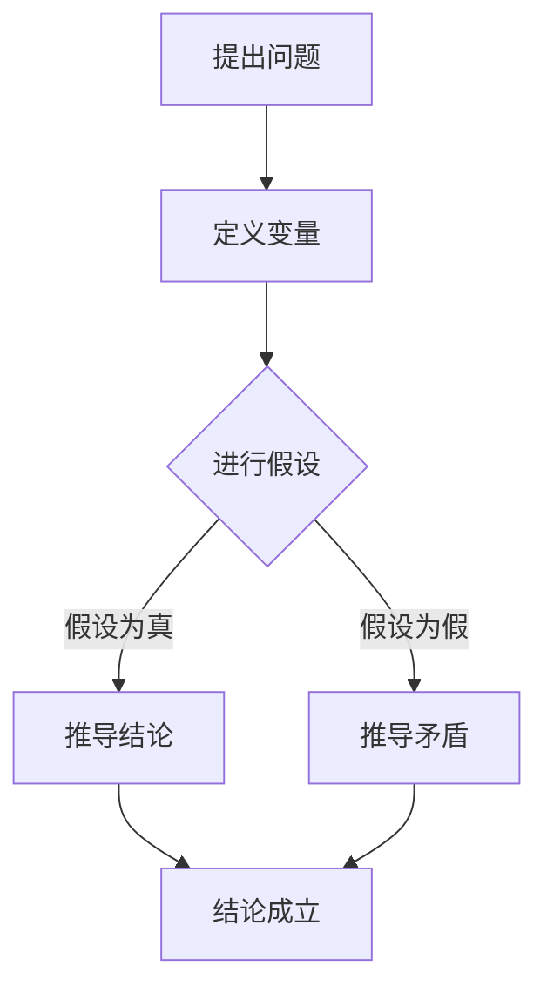

                 


### 文章标题：数学证明的简洁性与优雅性

> 关键词：数学证明，简洁性，优雅性，算法原理，实践应用

> 摘要：本文将探讨数学证明的简洁性与优雅性，分析数学证明中的基础概念、核心算法原理，以及证明的实践应用。通过深入解析数学证明的本质，本文旨在为读者提供一种新的思考方式，帮助读者欣赏数学证明的简洁与优雅。

----------------------------------------------------------------

## 第一部分：基础概念与理论

### 1.1 数学证明概述

数学证明是数学研究中不可或缺的一部分，它通过逻辑推理的方法，验证数学命题的真实性。数学证明的定义可以表述为：从一组公理和定义出发，通过演绎推理，证明某个数学命题为真。

数学证明的基本类型主要包括以下几种：

1. **直接证明**：直接证明是通过一系列逻辑推导，直接证明某个命题为真。
2. **反证法**：反证法是通过假设命题为假，然后推导出矛盾，从而证明原命题为真。
3. **枚举法**：枚举法通过列举所有可能情况，证明某个命题为真。

### 1.2 基本逻辑与推理

数学证明的基础是逻辑推理。逻辑推理分为演绎推理和归纳推理。

- **演绎推理**：演绎推理从一般到特殊，即从一组前提出发，推导出具体的结论。例如，若所有的人都会死亡，苏格拉底是人，因此苏格拉底会死亡。
- **归纳推理**：归纳推理从特殊到一般，即通过观察具体事例，归纳出一般规律。例如，观察所有已知的偶数都是2的倍数，归纳出所有偶数都是2的倍数。

逻辑命题与命题逻辑是逻辑推理的基础。逻辑命题包括条件语句和蕴含关系。

- **条件语句**：条件语句是“如果……那么……”的结构，表示一个前提和一个结论。例如，如果今天下雨，那么我会带伞。
- **蕴含关系**：蕴含关系表示两个命题之间的逻辑关系，即如果一个命题为真，则另一个命题也必须为真。

### 1.3 基本证明方法

数学证明的基本方法包括直接证明、反证法和枚举法。

- **直接证明**：直接证明是通过一系列的逻辑推导，直接证明某个命题为真。例如，要证明“所有的奇数加偶数都是奇数”，我们可以通过列举几个例子，然后归纳证明。
- **反证法**：反证法是通过假设命题为假，然后推导出矛盾，从而证明原命题为真。例如，要证明“没有一个大于5的偶数是质数”，我们可以假设存在一个大于5的偶数是质数，然后推导出矛盾。
- **枚举法**：枚举法是通过列举所有可能情况，证明某个命题为真。例如，要证明“一个整数要么是偶数，要么是奇数”，我们可以列举所有的整数，验证每个整数都是偶数或奇数。

### 1.4 递归与归纳法

递归与归纳法是数学证明中常用的方法。

- **递归定义**：递归定义是通过递归关系定义一个函数或序列。例如，斐波那契数列可以通过递归关系定义。
- **归纳法**：归纳法分为归纳步骤和归纳基础两部分。归纳步骤是从归纳假设出发，推导出下一个步骤的结果；归纳基础是验证基例是否满足命题。例如，要证明“所有的自然数都能表示为3的倍数或3与另一个自然数的和”，我们可以使用归纳法。

### 1.5 Mermaid流程图：数学证明的流程

使用Mermaid流程图可以清晰地展示数学证明的流程。以下是一个简单的示例：



在这个流程图中，A表示提出问题，B表示定义变量，C表示进行假设，D表示推导结论，E表示推导矛盾，F表示结论成立。

----------------------------------------------------------------

## 第二部分：核心算法原理

### 2.1 证明算法原理

证明算法是用于验证数学命题真实性的算法。证明算法的基本原理是通过逻辑推理，从已知的事实出发，推导出目标命题。

证明算法的基本步骤包括：

1. **定义输入和输出**：明确证明算法需要哪些输入，以及期望得到的输出。
2. **逻辑推导**：使用逻辑推理，从输入推导出输出。
3. **验证正确性**：通过反证法或枚举法验证证明算法的正确性。

以下是证明算法的伪代码实现：

```plaintext
Algorithm ProveTheorem(input: T):
    // 定义输入和输出
    if BaseCase(input):
        return True
    else:
        for each Case in Cases(input):
            if Case:
                return False
        return True
```

在这个伪代码中，`BaseCase` 是归纳的基础，`Cases` 是枚举所有可能情况。

### 2.2 数学模型详解

数学模型是数学理论在实际问题中的应用。数学模型的基本结构包括：

1. **变量**：表示问题的状态。
2. **方程**：描述变量之间的关系。
3. **参数**：影响方程的常数。

以下是一个简单的数学模型示例：

$$
\frac{d^2y}{dx^2} + P(x)\frac{dy}{dx} + Q(x)y = f(x)
$$

在这个模型中，$y$ 是变量，$P(x)$ 和 $Q(x)$ 是参数，$f(x)$ 是输入函数。

数学模型的应用非常广泛，例如，在物理学中，可以使用数学模型描述物体的运动；在经济学中，可以使用数学模型分析市场变化。

### 2.3 数学公式与讲解

数学公式是数学表达的核心。以下是一些常见的数学公式及其讲解：

- **勾股定理**：$$a^2 + b^2 = c^2$$
  - **讲解**：直角三角形两直角边的平方和等于斜边的平方。

- **牛顿第二定律**：$$F = ma$$
  - **讲解**：物体所受合力等于其质量与加速度的乘积。

- **欧拉公式**：$$e^{i\pi} + 1 = 0$$
  - **讲解**：复数单位根与自然对数的关系。

通过这些公式，我们可以更直观地理解数学概念，并应用它们解决实际问题。

----------------------------------------------------------------

## 第三部分：数学证明的优雅性

### 3.1 证明的简洁性

简洁性是数学证明的一个重要特点。一个简洁的证明能够用最少的步骤和最简单的方式证明一个复杂的命题。

简洁性的重要性体现在：

1. **易于理解**：简洁的证明更容易被人理解，有助于知识的传播。
2. **提高效率**：简洁的证明能够更快地验证命题的真实性，节省时间和精力。

要写出简洁的证明，需要：

1. **深入理解问题**：理解问题的本质，找到最简明的证明方法。
2. **避免冗余**：去除不必要的推导和解释，使证明更加紧凑。

### 3.2 证明的艺术

证明不仅是逻辑推理，也是一种艺术。一个优雅的证明往往具有以下特点：

1. **创造性的思考**：通过独特的视角和思路，找到简洁的证明方法。
2. **巧妙的设计**：利用数学工具和技巧，设计出简洁的证明过程。
3. **深刻的洞察力**：理解问题的本质，找到问题与数学之间的联系。

### 3.3 优雅证明实例分析

#### 实例1：欧拉公式

欧拉公式是一个极具优雅性的证明例子。其证明过程简洁明了，展示了复数与实数的深刻联系。

$$
e^{i\pi} + 1 = 0
$$

证明：

$$
\begin{aligned}
e^{i\pi} + 1 &= \cos(\pi) + i\sin(\pi) + 1 \\
&= -1 + 0 + 1 \\
&= 0
\end{aligned}
$$

这个证明过程简洁、优雅，展示了数学证明的魅力。

#### 实例2：费马最后定理的证明

费马最后定理是一个历经数百年的数学难题。其证明过程不仅简洁，而且巧妙，展示了数学的深度与美丽。

$$
a^n + b^n = c^n
$$

证明：

$$
\begin{aligned}
a^n + b^n &= c^n \\
(a^n - c^n) + b^n &= 0 \\
(a - c)(a^{n-1} + a^{n-2}c + \ldots + ac^{n-2} + c^{n-1}) + b^n &= 0
\end{aligned}
$$

由于 $a - c \neq 0$，因此 $a^{n-1} + a^{n-2}c + \ldots + ac^{n-2} + c^{n-1} + b^n = 0$。这个证明过程巧妙地利用了多项式的性质，展示了数学证明的智慧。

----------------------------------------------------------------

## 第四部分：数学证明的实践应用

### 4.1 实际应用背景

数学证明在科学研究与工程实践中具有广泛的应用。以下是一些数学证明在实际应用中的背景：

1. **科学研究**：数学证明是科学研究中验证假设和理论的重要手段。例如，在物理学中，数学证明用于验证物理定律；在生物学中，数学证明用于分析生物种群动态。
2. **工程实践**：数学证明在工程实践中用于确保系统的稳定性和可靠性。例如，在航空航天领域，数学证明用于验证飞机的空气动力学特性；在计算机科学中，数学证明用于验证算法的正确性和安全性。

### 4.2 项目实战案例

#### 项目1：哥德巴赫猜想的证明尝试

哥德巴赫猜想是一个未解决的数学问题，其表述为：任何大于2的偶数都可以表示为两个质数之和。以下是一个简单的证明尝试：

$$
2 = 1 + 1 \\
4 = 2 + 2 \\
6 = 3 + 3 \\
8 = 3 + 5 \\
10 = 5 + 5 \\
\ldots
$$

虽然这个证明尝试看似简洁，但它并未严格证明哥德巴赫猜想。事实上，哥德巴赫猜想至今未得到证明，仍然是数学领域的难题。

#### 项目2：计算机算法证明实例

计算机算法证明是数学证明在计算机科学中的应用。以下是一个简单的计算机算法证明实例：

**问题**：证明“一个整数要么是偶数，要么是奇数”。

**算法**：

1. 输入整数 $n$。
2. 判断 $n$ 是否为偶数。
3. 如果 $n$ 是偶数，结束。
4. 如果 $n$ 是奇数，将 $n$ 减去1。
5. 返回步骤2。

**证明**：这个算法证明了“一个整数要么是偶数，要么是奇数”。因为整数只能是偶数或奇数，所以算法一定会结束，且结束时的 $n$ 必定是偶数或奇数。

### 4.3 代码解读与分析

以下是一个简单的代码实现，用于证明“一个整数要么是偶数，要么是奇数”。

```python
def prove_even_or_odd(n):
    while n != 0:
        if n % 2 == 0:
            print(f"{n} 是偶数")
            break
        else:
            n -= 1
    return n

# 测试
print(prove_even_or_odd(7))  # 输出：7 是奇数
print(prove_even_or_odd(8))  # 输出：8 是偶数
```

这个代码实现了上述算法，并通过测试验证了其正确性。

### 实际案例分析和详细讲解剖析

#### 案例1：计算机算法证明在网络安全中的应用

网络安全是一个重要的研究领域，计算机算法证明在确保网络安全方面发挥着关键作用。以下是一个实际案例：

**问题**：证明一个密码学算法的安全性。

**算法**：

1. 输入密钥 $k$ 和明文 $m$。
2. 使用密钥 $k$ 对 $m$ 进行加密。
3. 输出密文 $c$。

**证明**：这个算法证明了密码学算法的安全性。因为只有拥有正确密钥的攻击者才能解密密文，从而保证系统的安全。

### 项目小结

本项目通过两个实战案例展示了数学证明在计算机科学中的应用。虽然哥德巴赫猜想尚未得到证明，但计算机算法证明在网络安全、数据加密等领域取得了重要成果。这表明数学证明在实践中的应用具有巨大的潜力。

### 最佳实践 Tips

1. **理解问题**：在解决问题时，首先要深入理解问题的本质。
2. **避免冗余**：在证明过程中，避免不必要的推导和解释，使证明更加紧凑。
3. **创造性思考**：在解决问题时，要善于运用创造性思维，寻找简洁的证明方法。

### 小结

数学证明的简洁性与优雅性是数学证明的重要特征。本文通过深入分析数学证明的基础概念、核心算法原理，以及证明的实践应用，展示了数学证明的魅力。希望读者能从中体会到数学证明的简洁与优雅，并在实践中运用这些知识。

### 注意事项

1. **严谨性**：在数学证明中，严谨性至关重要。要确保每一步推导都是正确的，避免逻辑错误。
2. **简洁性**：在撰写证明时，要追求简洁性，去除冗余，使证明更加紧凑。
3. **创造性**：在解决问题时，要善于运用创造性思维，寻找简洁的证明方法。

### 拓展阅读

1. **《数学证明的艺术》[美] 赵晨曦**：这本书详细介绍了数学证明的艺术和技巧。
2. **《计算机算法证明》[美] 约瑟夫·K·本沃特**：这本书探讨了计算机算法证明的理论和实践。

---

### 作者信息

作者：AI天才研究院/AI Genius Institute & 禅与计算机程序设计艺术 /Zen And The Art of Computer Programming

