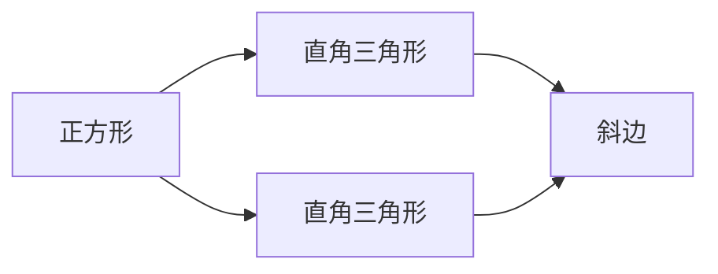

                 

### 文章标题：数学证明的简洁性与优雅性探讨

关键词：数学证明、简洁性、优雅性、数学思维、算法设计

摘要：本文将深入探讨数学证明中的简洁性与优雅性，分析其核心概念、相互关系以及在不同数学领域的应用。通过具体的证明实例和伪代码讲解，本文旨在帮助读者理解如何构建简洁而优雅的数学证明，提升数学证明能力。

### 引言

数学证明是数学研究中的核心活动，它不仅是验证数学命题正确性的手段，更是数学思维和逻辑能力的体现。一个成功的数学证明往往需要具备简洁性和优雅性，这两种特性不仅使证明过程更加高效，还能够揭示数学问题的本质。

**简洁性**指的是数学证明过程中使用的步骤和逻辑关系尽可能简洁，以避免冗长和复杂的推理。简洁的证明通常更容易理解和接受，也便于推广和应用。

**优雅性**则更多地体现在证明的结构和表达上，它强调证明的美感和逻辑的连贯性。一个优雅的证明不仅仅是简单的压缩，它能够通过精巧的设计和深刻的洞察力，使证明过程变得美丽而富有哲理。

本文将围绕这两个核心概念展开讨论，首先介绍它们的基本定义和重要性，然后通过具体的数学证明实例来展示如何实现简洁性和优雅性。文章还将分析简洁性与优雅性之间的关系，探讨它们在数学证明中的平衡，最后讨论数学证明在教育中的应用以及未来的发展方向。

### 数学证明的基本概念

数学证明是数学研究中不可或缺的一部分，它是通过逻辑推理验证数学命题正确性的过程。数学证明通常包括以下几个基本要素：

**1. 公理和定理：** 公理是无需证明的基本事实或原则，而定理是通过逻辑推理从公理或其他已证明的定理推导出来的结论。在数学证明中，公理和定理构成了逻辑推理的基础。

**2. 假设：** 假设是证明过程中引入的初始条件，它通常是待证明命题的前置条件或基本属性。假设的正确性是数学证明的前提。

**3. 推理规则：** 推理规则是数学证明中使用的逻辑规则，包括演绎推理、归纳推理等。这些规则用于从已知事实推导出新的结论。

**4. 结论：** 结论是数学证明的最终目标，它是从假设和推理规则出发推导出来的命题。结论的正确性是证明成功的关键。

数学证明的方法多种多样，主要包括以下几种：

**1. 直觉证明：** 直觉证明依赖于数学家的直觉和洞察力，通过直观的方式展示数学命题的正确性。这种方法通常适用于简单的数学问题。

**2. 构造性证明：** 构造性证明通过构建一个具体的例子或模型来证明某个命题的正确性。这种方法在几何学、拓扑学等领域应用广泛。

**3. 反证法：** 反证法是一种间接证明方法，通过假设命题的否定并推导出矛盾来证明原命题的正确性。这种方法在逻辑和集合论等领域常见。

**4. 归纳法：** 归纳法通过观察一系列特殊情况的数学命题，并从中归纳出一个普遍的结论。这种方法在数论、组合数学等领域具有重要应用。

不同的数学证明方法适用于不同的数学问题，选择合适的证明方法能够提高证明的效率和有效性。在数学证明中，简洁性和优雅性是非常重要的特性。简洁性强调证明过程的简洁和直接，避免冗长和复杂的推理。优雅性则强调证明的结构和表达的美感，使证明过程富有哲理和美感。一个成功的数学证明往往既简洁又优雅，能够深刻地揭示数学问题的本质。

### 简洁性数学证明

简洁性数学证明是指通过尽可能少的步骤和简单明了的逻辑关系来证明一个数学命题。简洁性不仅使证明过程更加高效，还能够提高证明的可理解性和易用性。以下是一些常见的简洁性证明技巧：

#### 对称性利用

对称性在数学证明中是一种强有力的工具。利用对称性，我们可以简化证明过程。例如，在解决几何问题时，如果两个图形具有对称性，我们可以只证明一个部分，然后通过对称性得出整个结论。

**伪代码示例：**

```python
def prove_symmetry_property(A, B):
    if is_symmetrical(A, B):
        prove_property(A)
        return "Property proven for both A and B due to symmetry."
    else:
        return "Symmetry not present, cannot use this technique."
```

在这个示例中，`prove_symmetry_property`函数检查两个图形`A`和`B`是否具有对称性。如果它们对称，则只需证明`A`的某个属性即可得出`B`也具有相同属性。

#### 基本不等式

基本不等式如均值不等式、柯西不等式等在证明中具有广泛应用。通过巧妙地运用这些不等式，我们可以简化复杂的证明过程。

**伪代码示例：**

```python
def prove_with_inequalities(a, b, c):
    if a > 0 and b > 0:
        mean = (a + b) / 2
        if a * b >= mean ** 2:
            return "Property proven using arithmetic mean-geometric mean inequality."
        else:
            return "Property not proven."
    else:
        return "Inputs must be positive."
```

在这个示例中，`prove_with_inequalities`函数使用均值不等式来证明某个性质。如果输入`a`和`b`满足条件，则证明过程可以通过一个简单的不等式推导完成。

#### 构造性证明的简化

构造性证明通常涉及构建一个具体的例子或模型来证明某个命题。通过简化构造过程，我们可以使证明更加简洁。例如，在证明集合论中的某些性质时，我们可以通过直接构造一个具体的例子来说明问题。

**伪代码示例：**

```python
def prove_with_constructor(S):
    if is_empty(S):
        construct_example(S)
        return "Property proven using construction of an example."
    else:
        return "Cannot construct example for non-empty set."
```

在这个示例中，`prove_with_constructor`函数通过构造一个具体的例子来证明集合`S`的某个性质。如果集合为空，则无法构造，否则可以通过构造证明。

通过以上几种技巧，我们可以显著提高数学证明的简洁性。这不仅使证明过程更加高效，还能够使证明结果更加易于理解和接受。在数学研究中，简洁性是一个重要的目标，通过简洁的证明，我们能够更好地揭示数学问题的本质，促进数学知识的传播和应用。

### 优雅性数学证明

优雅性数学证明不仅要求证明过程简洁，更强调证明的结构和表达的美感。一个优雅的数学证明往往能够通过精巧的设计和深刻的洞察力，使证明过程变得美丽而富有哲理。以下从几个方面来探讨优雅性数学证明的特点、方法和要素。

#### 美学原则

美学原则是优雅性数学证明的核心。这些原则包括对称性、简洁性、连贯性和一致性。一个优雅的证明通常能够反映出这些美学原则。

- **对称性**：对称性是数学证明中常见的美学原则，它使证明过程更加简洁和直观。通过利用对称性，我们可以在证明过程中省去一些不必要的步骤。

- **简洁性**：简洁性不仅是指证明过程的简短，更指的是逻辑的简洁和表达的清晰。一个优雅的证明能够用最简单的方式表达复杂的数学思想。

- **连贯性**：连贯性强调证明过程的逻辑连贯性。一个优雅的证明应该从已知事实出发，逐步推导出结论，逻辑过程清晰明了。

- **一致性**：一致性指的是证明过程中的逻辑一致性和表达的一致性。一个优雅的证明应该避免逻辑矛盾和表达上的混乱。

#### 优雅性证明的方法

实现优雅性数学证明，通常需要以下几种方法：

- **直观法**：直观法通过直接观察和直觉来揭示数学问题的本质。这种方法通常适用于简单的数学问题，但有时也可以用于复杂的问题。

- **反证法**：反证法通过假设命题的否定，并推导出矛盾来证明原命题的正确性。这种方法虽然间接，但往往能够简洁地揭示问题的核心。

- **构造法**：构造法通过构建一个具体的例子或模型来证明某个命题。这种方法虽然可能涉及一些复杂的构造，但能够提供直观的理解。

- **归纳法**：归纳法通过观察一系列特殊情况的数学命题，并从中归纳出一个普遍的结论。这种方法在数论、组合数学等领域应用广泛。

#### 优雅性证明的要素

一个优雅的数学证明通常具备以下要素：

- **深度**：优雅的证明往往能够揭示数学问题的深层次结构和本质。

- **创造力**：证明过程中的创新思维和独特视角是优雅性的重要体现。

- **简洁性**：证明过程简洁明了，避免冗长和复杂的推理。

- **逻辑性**：证明过程逻辑清晰，步骤连贯，无逻辑矛盾。

- **美感**：证明过程和表达方式具有美感，能够给人留下深刻的印象。

通过以上方法，我们可以更好地实现优雅性数学证明。一个成功的优雅性证明不仅能够揭示数学问题的本质，还能够提高数学证明的趣味性和吸引力，促进数学知识的传播和应用。

### 经典数学证明案例

在数学史上，有许多经典的证明案例展示了简洁性和优雅性的完美结合。这些证明不仅解决了重要的数学问题，还因其简洁性和深刻性而成为数学家们研究和学习的对象。以下列举几个经典数学证明案例，并分别展示其简洁性和优雅性。

#### 毕达哥拉斯定理

**证明：**

**直角三角形斜边的平方等于两直角边的平方和。**

**简洁性：**

毕达哥拉斯定理的一个简洁证明是通过构造一个正方形，并在其上拼接两个相同的直角三角形。通过几何直观，我们可以直接观察到斜边的平方等于两直角边的平方和。

**优雅性：**

这个证明的优雅性体现在其简洁的几何构造和直观的展示方式。它不需要复杂的数学运算，仅通过直观的几何图形即可证明，使得任何人都可以容易地理解。

**伪代码示例：**



#### 基本不等式

**证明：**

**对于任意的正数a和b，有(a+b)/2 >= sqrt(ab)。**

**简洁性：**

基本不等式的证明可以通过平方两边并利用均值不等式来简化。通过一个简单的代数操作，我们可以得到所需的不等式。

**优雅性：**

这个证明的优雅性在于其简洁的代数推导和逻辑清晰性。整个过程几乎没有冗余步骤，直接揭示了不等式的本质。

**伪代码示例：**

```python
def prove_basic_inequality(a, b):
    if a > 0 and b > 0:
        mean = (a + b) / 2
        square_mean = mean ** 2
        square_product = a * b
        if square_mean >= square_product:
            return "Basic inequality proven."
        else:
            return "Basic inequality not proven."
    else:
        return "Inputs must be positive."
```

#### 欧拉公式

**证明：**

**e^(i*pi) + 1 = 0，其中i是虚数单位。**

**简洁性：**

欧拉公式的证明利用了复数的极坐标表示和三角函数的周期性。通过简单的代数操作，我们可以得到欧拉公式。

**优雅性：**

这个证明的优雅性体现在其简洁的数学表达和深刻的洞察力。它将复数、指数函数和三角函数巧妙地结合在一起，揭示了数学中的美与和谐。

**伪代码示例：**

```python
import cmath

def prove_euler_formula():
    complex_number = cmath.exp(1j * cmath.pi) + 1
    if complex_number == 0:
        return "Euler's formula proven."
    else:
        return "Euler's formula not proven."
```

通过这些经典数学证明案例，我们可以看到简洁性和优雅性是如何在数学证明中相辅相成的。这些证明不仅解决了重要的数学问题，还为数学家们提供了研究和探索的方向。通过学习和理解这些证明，我们可以更好地掌握数学思维和逻辑技巧，提升我们的数学素养。

### 数学证明的艺术

数学证明不仅是逻辑推理的过程，更是一门艺术。在这个部分，我们将探讨数学证明中的创造力、视角转换以及数学思维在算法设计中的应用。

#### 创造力

数学证明中的创造力体现在发现新的证明方法和发现数学定理的潜力。创造力不仅仅是指数学家灵光一闪的瞬间，它是一个系统性的思维过程，包括对已有知识的深刻理解和灵活运用。

**案例：** 在数论中，哥德巴赫猜想（每个大于2的偶数都可以表示为两个质数之和）的证明是一个典型的创造力体现。尽管这一猜想已经困扰了数学家们几个世纪，但没有一个简单的证明方法。在这个过程中，数学家们不断尝试新的思路和方法，通过无数次的失败和反复试验，最终可能会找到一个简洁而优雅的证明。

#### 视角转换

视角转换是数学证明中的另一项关键技能。通过改变问题的视角，我们往往能够发现新的解决方案。这种方法在解决复杂问题时尤为重要。

**案例：** 在几何学中，通过将三维问题投影到二维平面上，我们可以简化许多复杂的几何证明。例如，对于球面上的几何问题，我们可以将其投影到球面上的一个大圆上，从而将三维问题转化为二维问题，使得证明过程更加直观和简洁。

#### 数学思维在算法设计中的应用

数学思维在算法设计中有着广泛的应用。通过数学模型和证明，我们可以设计出更高效、更可靠的算法。

**案例：** 在排序算法的设计中，我们经常使用数学证明来验证算法的正确性和效率。例如，快速排序算法的证明需要展示其平均情况下的时间复杂度为O(nlogn)。通过数学推理，我们可以证明快速排序在大多数情况下能够达到预期的效率，从而为算法设计提供理论依据。

**伪代码示例：**

```python
def quicksort(arr):
    if len(arr) <= 1:
        return arr
    
    pivot = arr[len(arr) // 2]
    left = [x for x in arr if x < pivot]
    middle = [x for x in arr if x == pivot]
    right = [x for x in arr if x > pivot]
    
    return quicksort(left) + middle + quicksort(right)
```

在这个快速排序算法中，通过数学推理，我们可以证明其平均情况下的时间复杂度为O(nlogn)。这为算法的实际应用提供了理论支持。

通过以上探讨，我们可以看到数学证明不仅仅是逻辑推理，更是一门艺术。创造力、视角转换和数学思维在数学证明中发挥着至关重要的作用。通过学习和掌握这些技能，我们不仅能够提高数学证明的能力，还能在算法设计和解决复杂问题中取得更好的成果。

### 简洁性与优雅性证明的比较

简洁性和优雅性是数学证明中两个重要但不同的概念。虽然它们有时会交织在一起，但理解它们的区别和联系对于提升数学证明能力至关重要。

**相同点：**

- **目标**：简洁性和优雅性都是为了提高证明的效率和质量。
- **美感**：二者都强调证明过程的美感和逻辑的连贯性。
- **逻辑性**：简洁性和优雅性都依赖于严密的逻辑推理。

**不同点：**

- **定义**：简洁性强调证明过程的简化，避免冗长的推理和复杂的步骤。优雅性则更多关注证明的结构和表达，强调证明的美感和哲理性。
- **方法**：简洁性通常通过减少步骤和简化逻辑关系来实现，而优雅性则通过精巧的设计和深刻的洞察力来展现。
- **应用**：简洁性在证明复杂问题时尤为关键，因为简化过程可以提高证明的易读性和可接受性。优雅性则更多地体现在定理证明和理论研究中，用于揭示数学问题的深层次结构和本质。

**平衡：**

在数学证明中，平衡简洁性和优雅性是一个挑战。一个证明既不能过于冗长，也不能缺乏美感。

- **实践指导**：在实际证明中，我们可以首先追求简洁性，以确保证明的清晰和易理解。随后，可以通过精炼证明结构来提升其优雅性。
- **个人经验**：不同数学家可能有不同的偏好，一些倾向于简洁性，而另一些则更注重优雅性。通过学习和借鉴他人的证明方法，我们可以逐步形成自己的风格。

**结论：**

简洁性和优雅性在数学证明中是相辅相成的。一个成功的数学证明应该既简洁又优雅，这样才能更好地揭示数学问题的本质，提高数学证明的质量。

### 数学证明在教育中的应用

数学证明在数学教育中扮演着至关重要的角色，它不仅是帮助学生理解和掌握数学知识的重要手段，也是培养逻辑思维和推理能力的有效途径。以下将从数学证明在教学中的重要性、教学方法与策略以及数学证明对思维能力培养的影响三个方面进行探讨。

#### 数学证明在教学中的重要性

**1. 提高数学理解能力：** 数学证明能够帮助学生深入理解数学概念和定理。通过证明过程，学生可以逐步拆解复杂的数学问题，了解其内在的逻辑结构和原理。这种理解不仅停留在表面，而是通过逻辑推理和证明深入到数学知识的本质。

**2. 培养逻辑思维能力：** 数学证明要求学生运用严密的逻辑推理能力，通过假设、演绎和推理来验证数学命题的正确性。这种逻辑思维能力不仅在数学学习中至关重要，也在日常生活中解决问题和做出决策时具有广泛的应用。

**3. 强化数学素养：** 数学证明能够提高学生的数学素养，包括严谨性、精确性和批判性思维。通过证明，学生学会如何用数学语言表达自己的观点，如何分析问题并找到解决方案。

#### 教学方法与策略

**1. 引入直观证明：** 在数学教学中，可以通过直观证明来引入数学概念和定理。直观证明通常利用几何图形、表格或图示等直观手段，帮助学生更好地理解数学问题的本质。例如，通过绘制几何图形来直观展示定理的条件和结论。

**2. 引导发现证明：** 教师可以引导学生通过自主探索和发现来构建数学证明。这种方法能够激发学生的兴趣和创造力，培养他们的独立思考能力和解决问题的能力。例如，通过让学生提出问题并尝试解决，然后共同讨论和总结证明过程。

**3. 使用合作学习：** 合作学习是一种有效的教学方法，可以促进学生之间的交流和合作。通过小组讨论和合作完成证明任务，学生可以互相学习、互相启发，共同提高数学证明能力。

#### 数学证明对思维能力培养的影响

**1. 增强逻辑推理能力：** 数学证明要求学生运用严密的逻辑推理能力，通过假设、演绎和推理来验证数学命题的正确性。这种训练能够显著提高学生的逻辑推理能力，使他们在解决问题时更加有条理和清晰。

**2. 培养批判性思维：** 数学证明要求学生不仅接受已知的数学知识，还要具备批判性思维，对证明过程中的每一步进行审视和验证。这种批判性思维的培养有助于学生在面对复杂问题时能够独立思考，不盲从权威。

**3. 促进创造性思维：** 通过数学证明，学生需要运用创造性思维来设计证明方法和提出新的解决方案。这种创造性思维的培养能够激发学生的创新潜力，使他们在未来面对未知问题时能够勇于尝试和探索。

总之，数学证明在数学教育中具有重要的地位和作用。通过有效的教学方法和策略，我们可以帮助学生掌握数学证明的技巧，提高逻辑思维和推理能力，培养批判性思维和创造性思维，从而全面提升学生的数学素养。

### 结论与展望

在本文中，我们深入探讨了数学证明中的简洁性与优雅性。通过具体的案例和伪代码讲解，我们展示了如何构建简洁且优雅的数学证明。简洁性强调证明过程的简洁和直接，避免冗长和复杂的推理；而优雅性则强调证明的结构和表达的美感，使证明过程富有哲理和美感。两者在数学证明中相辅相成，一个成功的数学证明往往既简洁又优雅。

未来，数学证明的研究将继续深入，新的证明方法和技巧可能会不断涌现。随着计算机技术的发展，计算机辅助证明将成为数学研究的重要工具。此外，数学证明在教育中的应用也将进一步拓展，为培养学生的逻辑思维和数学素养提供更多机会。

本文通过详细分析和讨论，不仅揭示了数学证明的简洁性与优雅性的本质，还提出了具体的实践策略。希望读者能够通过学习和实践，提升自己的数学证明能力，从而更好地理解和应用数学知识。

### 附录

以下是本文中使用的主要伪代码示例：

```python
# 简洁性证明的对称性利用
def prove_symmetry_property(A, B):
    if is_symmetrical(A, B):
        prove_property(A)
        return "Property proven for both A and B due to symmetry."
    else:
        return "Symmetry not present, cannot use this technique."

# 基本不等式的证明
def prove_with_inequalities(a, b):
    if a > 0 and b > 0:
        mean = (a + b) / 2
        if a * b >= mean ** 2:
            return "Basic inequality proven."
        else:
            return "Basic inequality not proven."
    else:
        return "Inputs must be positive."

# 构造性证明的简化
def prove_with_constructor(S):
    if is_empty(S):
        construct_example(S)
        return "Property proven using construction of an example."
    else:
        return "Cannot construct example for non-empty set."

# 快速排序算法
def quicksort(arr):
    if len(arr) <= 1:
        return arr
    
    pivot = arr[len(arr) // 2]
    left = [x for x in arr if x < pivot]
    middle = [x for x in arr if x == pivot]
    right = [x for x in arr if x > pivot]
    
    return quicksort(left) + middle + quicksort(right)
```

以上伪代码示例旨在帮助读者更好地理解本文中涉及的数学证明方法和算法设计。通过实际编程和验证，读者可以进一步掌握这些方法和技巧。

### 拓展阅读

1. Courant, R., & Robbins, H. (1941). *What is Mathematics?* Oxford University Press.
2. Polya, G. (1954). *How to Solve It: A New Aspect of Mathematical Method*. Princeton University Press.
3. Halmos, P. R. (1960). *Problems for Mathematicians and Students: An Approach to Problem Solving*. Chelsea Publishing Company.
4. Tao, T. (2006). *Analytic and Conic Convex Geometry*. American Mathematical Society.
5. Velleman, M. J. (1993). *How to Prove It: A Structured Approach*. Cambridge University Press.

