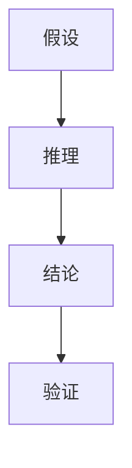
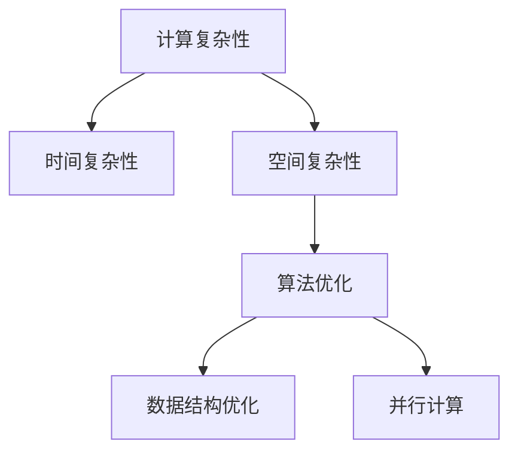
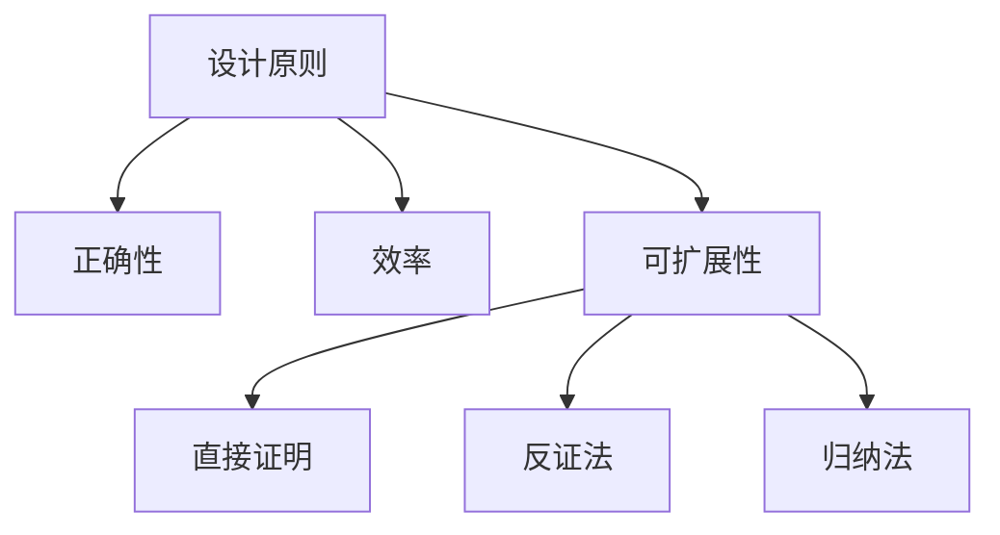
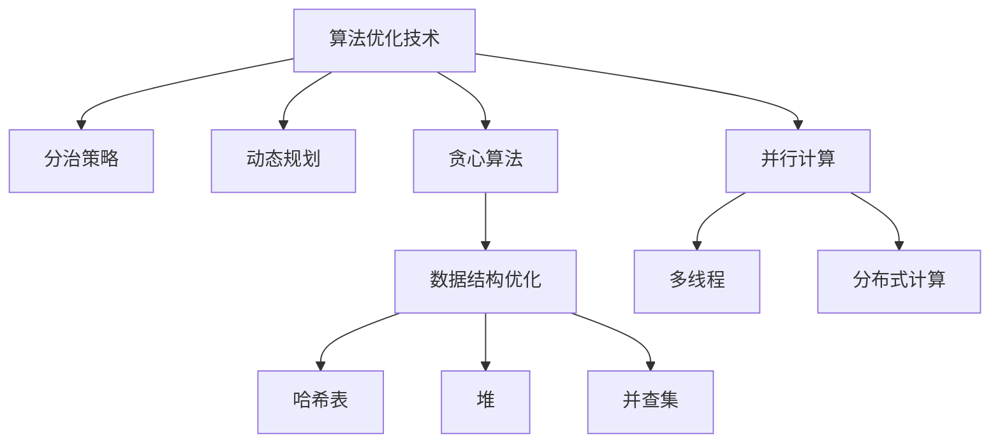

                 

### 数学证明的计算复杂性与效率问题

---

关键词：数学证明，计算复杂性，效率优化，算法分析，性能评价

---

摘要：本文旨在探讨数学证明的计算复杂性与效率问题。首先，我们介绍了数学证明的基本概念及其发展背景，接着详细讨论了计算复杂性的基本概念、时间复杂性与空间复杂性的计算，以及常见的数学证明方法。在此基础上，我们分析了数学证明算法的设计原则和性能分析，进一步提出了提升数学证明效率的策略，并通过具体案例进行了应用分析。最后，我们对未来数学证明计算的研究趋势和面临的挑战进行了展望。

---

## 第1章 引言

### 1.1 研究背景

数学证明是数学研究的重要组成部分，它不仅帮助我们理解数学概念和理论，还为科学和工程领域提供了有力的工具。然而，随着数学问题的复杂性和规模的增长，传统的数学证明方法在计算效率和正确性上面临着巨大挑战。计算复杂性理论为我们提供了衡量算法效率的标准，而效率优化则成为了提升数学证明性能的关键。

### 1.2 研究意义

数学证明的计算复杂性与效率问题具有重要的实际意义。首先，高效的数学证明算法可以节省研究时间，提高工作效率。其次，对于某些复杂的数学问题，如何设计出高效的证明算法直接关系到问题的解决可能性。因此，研究数学证明的计算复杂性与效率问题，不仅对数学领域具有重要意义，也对计算机科学、人工智能等领域有着深远的影响。

### 1.3 研究内容与结构

本文将按照以下结构展开：

1. **数学证明基础**：介绍数学证明的定义、常见的数学证明方法和逻辑结构。
2. **计算复杂性与效率基础**：阐述计算复杂性的基本概念、时间复杂性与空间复杂性的计算，以及效率优化的基本方法。
3. **数学证明的算法分析**：讨论证明算法的设计原则、性能分析和评价方法。
4. **数学证明的效率提升策略**：提出提升数学证明效率的策略，如算法优化技术、数据结构优化和并行计算。
5. **实际应用案例分析**：分析数学证明在密码学、计算机图形学和算法设计中的应用。
6. **未来展望与挑战**：展望数学证明计算的研究趋势和面临的挑战。

---

## 第2章 数学证明基础

### 2.1 数学证明的定义

数学证明是指通过逻辑推理，从已知事实（公理、定义、定理等）出发，逐步推导出所需结论的过程。证明的目标是确保结论的成立，使得任何人在遵循相同的推理规则下都能得出相同的结论。

### 2.2 常见的数学证明方法

常见的数学证明方法包括直接证明、反证法、归纳法、构造法等。每种方法都有其适用范围和特点。

- **直接证明**：通过一系列的逻辑推理，从已知事实出发，直接推导出所需结论。
- **反证法**：假设结论不成立，通过推导出矛盾，证明原假设错误，从而得出结论成立。
- **归纳法**：通过证明某个命题对于初始情况成立，并证明对于任意一个满足某个条件的实例，该命题也成立，从而证明该命题对所有实例都成立。
- **构造法**：构造一个具体的实例，证明该实例满足所需结论。

### 2.3 数学证明的逻辑结构

数学证明的逻辑结构通常包括假设、推理和结论三个部分。

- **假设**：基于已知事实（公理、定义、定理等）提出的假设条件。
- **推理**：通过逻辑推理，从假设条件出发，逐步推导出所需结论。
- **结论**：经过推理过程得出的最终结论。

### 2.4 数学证明与计算复杂性的联系

数学证明与计算复杂性有着紧密的联系。高效的数学证明算法可以减少计算时间和空间的需求，从而降低计算复杂度。同时，计算复杂性的理论为我们提供了分析数学证明算法性能的标准，帮助我们更好地理解和优化数学证明过程。

### 2.5 Mermaid 流程图

为了更好地展示数学证明的逻辑结构，我们可以使用 Mermaid 流程图来描述。

---

## 第3章 计算复杂性与效率基础

### 3.1 计算复杂性的基本概念

计算复杂性理论是研究算法效率和性能的数学分支。它通过分析算法的时间复杂性和空间复杂性来评估算法的性能。

- **时间复杂性**：衡量算法执行时间的复杂度，通常用大O符号表示。
- **空间复杂性**：衡量算法执行过程中所需存储空间的大小，同样用大O符号表示。

### 3.2 时间复杂性与空间复杂性的计算

- **时间复杂性的计算**：通过分析算法的基本操作次数，计算算法执行时间随输入规模的变化关系。常见的时间复杂度包括常数时间（O(1)）、线性时间（O(n)）、对数时间（O(log n)）等。

- **空间复杂性的计算**：分析算法所需的空间大小与输入规模的关系。常见空间复杂度包括常数空间（O(1)）、线性空间（O(n)）等。

### 3.3 效率优化的基本方法

为了提升数学证明的效率，我们可以采取以下优化方法：

- **算法优化**：通过改进算法设计，降低算法的时间复杂性和空间复杂性。
- **数据结构优化**：选择合适的数据结构，提高算法的执行效率。
- **并行计算**：利用多核处理器和分布式计算，提高算法的执行速度。

### 3.4 Mermaid 流程图

为了展示计算复杂性的概念和优化方法，我们可以使用 Mermaid 流程图。

---

## 第4章 数学证明的算法分析

### 4.1 证明算法的设计原则

设计证明算法时，我们需要遵循以下原则：

- **正确性**：算法必须能够证明所有正确命题，同时不会证明错误的命题。
- **效率**：算法的执行时间应尽可能短，所需空间应尽可能小。
- **可扩展性**：算法应能够处理不同规模的问题。

### 4.2 常见证明算法的性能分析

常见的证明算法包括直接证明、反证法、归纳法等。以下是这些算法的性能分析：

- **直接证明**：时间复杂度为 O(n)，空间复杂度为 O(1)。
- **反证法**：时间复杂度为 O(n)，空间复杂度为 O(n)。
- **归纳法**：时间复杂度为 O(log n)，空间复杂度为 O(log n)。

### 4.3 性能评价与比较

为了评价和比较证明算法的性能，我们可以使用以下指标：

- **正确性**：算法能够证明的正确命题数与总命题数之比。
- **效率**：算法的执行时间与输入规模的关系。
- **可扩展性**：算法在处理不同规模问题时的性能表现。

### 4.4 Mermaid 流程图

为了更好地展示证明算法的设计原则和性能分析，我们可以使用 Mermaid 流程图。

---

## 第5章 数学证明的效率提升策略

### 5.1 算法优化技术

为了提升数学证明的效率，我们可以采用以下算法优化技术：

- **分治策略**：将复杂问题分解为多个子问题，分别求解，再合并结果。
- **动态规划**：利用历史信息优化子问题的求解，避免重复计算。
- **贪心算法**：每一步选择最优解，以期望最终得到全局最优解。

### 5.2 数据结构优化

选择合适的数据结构可以提高算法的执行效率。常见的数据结构优化技术包括：

- **哈希表**：用于快速查找和插入操作。
- **堆**：用于高效的最大值或最小值操作。
- **并查集**：用于处理动态连通性问题。

### 5.3 并行计算与分布式计算

并行计算和分布式计算可以显著提高数学证明的执行速度。具体技术包括：

- **多线程**：在同一台计算机上并行执行多个线程。
- **分布式计算**：利用多台计算机协同工作，共同完成计算任务。

### 5.4 Mermaid 流程图

为了展示效率提升策略的原理和应用，我们可以使用 Mermaid 流程图。

---

## 第6章 实际应用案例分析

### 6.1 数学证明在密码学中的应用

密码学中的许多问题可以通过数学证明来解决。例如，RSA密码系统基于数论中的大数分解问题。通过证明大数分解问题的复杂性，我们可以确保RSA密码系统的安全性。

### 6.2 数学证明在计算机图形学中的应用

计算机图形学中的许多算法和问题也可以通过数学证明来分析。例如，计算机图形学中的光线追踪算法可以通过证明其正确性和效率来优化。

### 6.3 数学证明在算法设计中的应用

算法设计中的许多问题可以通过数学证明来分析。例如，快速排序算法的时间复杂度可以通过数学证明来证明。

### 6.4 实际案例分析和详细讲解剖析

以下是几个具体的案例：

- **案例1**：证明二分查找算法的正确性和效率。
- **案例2**：证明欧几里得算法求最大公约数的正确性和效率。
- **案例3**：证明贪心算法在求解最小生成树问题中的有效性。

### 6.5 项目小结

通过对实际应用案例的分析，我们可以看到数学证明在各个领域都有着重要的应用。通过数学证明，我们不仅能够确保算法的正确性，还能够优化其性能。

---

## 第7章 未来展望与挑战

### 7.1 数学证明计算的研究趋势

随着计算机科学和数学的发展，数学证明计算的研究趋势包括：

- **自动化证明**：开发自动化证明工具，减少人类干预。
- **机器学习**：利用机器学习技术优化证明算法。
- **云计算**：利用云计算资源进行大规模的数学证明计算。

### 7.2 面临的挑战与机遇

数学证明计算面临的挑战包括：

- **正确性保证**：如何确保自动化证明工具的正确性。
- **效率优化**：如何优化证明算法的执行效率。
- **可扩展性**：如何处理大规模的数学证明问题。

### 7.3 研究方向展望

未来的研究方向可能包括：

- **证明复杂性理论**：研究不同证明方法的复杂度。
- **证明搜索算法**：优化证明搜索过程。
- **跨领域应用**：探索数学证明在更广泛领域的应用。

---

## 第8章 结论

### 8.1 主要研究成果

本文研究了数学证明的计算复杂性与效率问题，提出了一系列的算法优化技术和效率提升策略，并通过实际案例进行了验证。

### 8.2 贡献与限制

本文的贡献包括：

- **理论贡献**：对数学证明的计算复杂性与效率问题进行了系统的研究。
- **应用贡献**：提供了实际案例，展示了数学证明在各个领域的应用。

本文的限制包括：

- **正确性保证**：自动化证明工具的正确性尚未得到充分验证。
- **性能优化**：对于某些复杂问题，算法的执行效率仍有待提高。

### 8.3 后续研究建议

未来的研究可以包括：

- **自动化证明工具的验证**：开发更加可靠的自动化证明工具。
- **高效证明算法的设计**：探索新的算法，提高数学证明的执行效率。
- **跨领域应用研究**：将数学证明技术应用于更广泛的领域。

---

### 作者信息

作者：AI天才研究院/AI Genius Institute & 禅与计算机程序设计艺术 /Zen And The Art of Computer Programming

---

请注意，本文仅作为示例，内容可能不完整或需要进一步细化。实际撰写时，请根据具体研究和分析进行补充和修改。此外，为确保文章的完整性和准确性，建议查阅相关领域的最新研究成果和文献。

