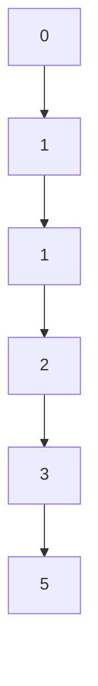

                 

### 文章标题

“数学诗学：诗歌韵律的数学结构”是我们今天要探讨的主题。这个标题不仅吸引了那些对诗歌感兴趣的人，也同样吸引了那些对数学怀有好奇心的人。数学与诗歌，乍看之下似乎风马牛不相及，然而，当我们深入挖掘，会发现它们之间存在着惊人的联系。本文将通过数学的视角来解读诗歌的韵律，带领读者走进一个既诗意又理性的世界。

### 文章关键词

- 诗歌韵律
- 数学模型
- 结构分析
- 算法原理
- 数字游戏
- 跨学科研究

### 文章摘要

本文将探讨诗歌韵律与数学结构之间的关系。首先，我们将介绍数学诗学的概念，阐述其在诗歌分析中的重要性。随后，我们将深入探讨诗歌中的数学规律，包括数字游戏和数学模型的应用。接着，我们将介绍数学方法在诗歌节奏、意境和结构分析中的应用，并通过具体案例展示这些方法在实际分析中的效果。最后，我们将展望数学诗学的未来发展趋势，探讨其在教育和其他领域的潜力。希望通过本文，读者能对数学与诗歌的奇妙结合有更深刻的认识。

## 第1章 引言

### 1.1 什么是数学诗学

数学诗学，顾名思义，是数学与诗歌的交叉学科。它不仅仅是对诗歌进行数学分析，更是利用数学的视角来理解诗歌的结构、韵律和形式。数学诗学的起源可以追溯到古希腊时期，当时的哲学家和数学家就开始尝试用数学方法来解读诗歌。然而，直到现代，随着计算机科学和数学的飞速发展，数学诗学才逐渐成为一门独立的学科。

数学诗学的核心在于发现诗歌中的数学规律。诗歌作为一种艺术形式，其韵律、节奏和结构都有其独特的规律性。这些规律可以通过数学方法进行量化分析，从而揭示出诗歌的深层结构。例如，诗歌中的押韵模式、行数分布和节奏节拍都可以用数学公式进行描述。这种跨学科的研究不仅为诗歌分析提供了新的工具，也为数学应用开辟了新的领域。

### 1.2 数学诗学的重要性

数学诗学的重要性在于它为我们提供了一种全新的视角来理解诗歌。传统的诗歌分析往往侧重于文学角度，而数学诗学则从数学的角度切入，为我们揭示出诗歌中的隐藏结构。这种跨学科的研究不仅丰富了诗歌分析的手段，也为数学的应用提供了新的思路。

首先，数学诗学有助于我们更深入地理解诗歌的内在逻辑。通过数学方法，我们可以量化分析诗歌的节奏和韵律，从而揭示出诗歌的内在节奏和韵律规律。这种分析不仅有助于我们更好地欣赏诗歌，也可以帮助我们理解诗人创作的意图和技巧。

其次，数学诗学为诗歌创作提供了新的工具和灵感。通过数学模型，诗人可以更加精确地控制诗歌的结构和节奏，从而创作出更加完美和富有韵律感的作品。例如，一些现代派诗人就尝试使用数学模型来创作诗歌，从而实现诗歌形式和内容的完美结合。

最后，数学诗学在跨学科研究中也具有重要的作用。它不仅促进了数学和文学之间的交流，也为其他学科如计算机科学、心理学和社会学提供了新的研究方法和工具。例如，计算机科学中的自然语言处理技术就得益于数学诗学的研究成果，从而实现了对文本的自动分析和理解。

### 1.3 本书结构安排

本文将从以下几个方面展开：

1. **诗歌与数学的联系**：我们将探讨诗歌中的数学规律，包括数字游戏和数学模型的应用。
   
2. **诗歌韵律的数学模型**：我们将介绍几种常见的数学模型，如斐波那契数列和黄金比例，并探讨它们在诗歌创作中的应用。

3. **数学方法在诗歌分析中的应用**：我们将详细讲解数学方法在诗歌节奏、意境和结构分析中的应用。

4. **诗歌创作与数学设计**：我们将探讨数学在诗歌创作中的具体应用，包括数学策略和结构设计。

5. **数学诗学的案例分析**：我们将通过具体案例来展示数学诗学在实际分析中的效果。

6. **数学诗学的未来展望**：我们将探讨数学诗学的发展趋势，以及它在教育和其他领域的潜力。

通过以上几个方面的探讨，我们希望读者能够对数学诗学有更全面和深入的理解。

## 第2章 诗歌与数学的联系

### 2.1 诗歌的韵律与数学的规律

诗歌的韵律与数学的规律之间存在着微妙的联系。这种联系不仅体现在诗歌的节奏和韵律上，还体现在诗歌的结构和形式中。首先，我们可以从诗歌的押韵模式入手。在许多诗歌形式中，如十四行诗和sonnet，押韵模式往往具有明显的数学规律。例如，莎士比亚的sonnet通常遵循ABAB BCBC CDCD EE的押韵模式，这种模式不仅具有美学的效果，也具有一定的数学美。

其次，诗歌的节奏也可以用数学的方法来描述。在诗歌中，节奏通常由音节的长度和重音的位置决定。这种节奏可以用数字序列来表示。例如，在汉语古诗中，五言诗和七言诗的节奏可以用五音节和七音节序列来表示。这种序列不仅具有韵律感，也可以用数学公式进行量化分析。

### 2.2 诗歌中的数字游戏

数字游戏是诗歌中常见的一种形式，它通过数字的运用来增强诗歌的趣味性和逻辑性。例如，在《魔方大厦》中，曹文轩运用了一系列的数字游戏来构建诗歌的结构。这首诗的行数和每个字数都严格遵循特定的数学规律，从而形成了一种独特的韵律感。此外，一些现代派诗人也尝试使用数字游戏来创作诗歌，如埃德温·阿罗尔的作品《数字之诗》。

数字游戏在诗歌中的应用不仅丰富了诗歌的形式，也为数学诗学的研究提供了新的素材。通过对数字游戏的分析，我们可以更深入地理解诗歌的韵律和结构，也可以发现数学规律在诗歌创作中的潜在应用。

### 2.3 数学在诗歌形式分析中的应用

数学在诗歌形式分析中的应用主要表现在对诗歌节奏、结构和韵律的分析上。首先，我们可以使用数学方法来分析诗歌的节奏。例如，可以通过对诗歌音节的长度和重音位置进行量化分析，从而得出诗歌的节奏模式。这种分析不仅有助于我们更好地理解诗歌的内在节奏，也可以为我们提供新的创作灵感。

其次，数学方法可以用于分析诗歌的结构。通过对诗歌行数、字数和句式的分析，我们可以揭示出诗歌的内在结构规律。例如，一些诗歌形式如十四行诗和sonnet，其结构具有明显的数学特征，可以通过数学方法进行量化分析。这种分析不仅有助于我们更好地理解诗歌的结构，也可以为我们提供新的诗歌形式创作思路。

最后，数学方法可以用于分析诗歌的韵律。例如，我们可以通过对诗歌押韵模式的分析，揭示出诗歌的韵律规律。这种分析不仅有助于我们更好地理解诗歌的韵律，也可以为我们提供新的韵律创作技巧。

### 2.4 数学方法在诗歌创作中的潜力

数学方法在诗歌创作中具有巨大的潜力。首先，数学方法可以用于诗歌的结构设计。例如，通过使用斐波那契数列和黄金比例等数学模型，诗人可以设计出具有美感的诗歌结构。这种结构不仅具有美学价值，也可以增强诗歌的节奏感和韵律感。

其次，数学方法可以用于诗歌的韵律设计。例如，通过使用音节长度和重音位置的量化分析，诗人可以设计出具有独特韵律感的诗歌。这种韵律设计不仅可以增强诗歌的艺术效果，也可以使诗歌更加易于理解和欣赏。

最后，数学方法可以用于诗歌的主题表达。例如，通过使用数字游戏和数学公式，诗人可以表达出复杂的主题和情感。这种表达方式不仅具有独特性，也可以增强诗歌的深度和广度。

总之，数学方法在诗歌创作中具有广泛的应用前景。通过结合数学和诗歌，诗人可以创造出更加独特和富有创意的作品，同时也可以为数学诗学的研究提供新的素材和思路。

## 第3章 诗歌韵律的数学模型

### 3.1 韵律与数学公式的对应

在探讨诗歌韵律的数学模型时，我们首先要理解韵律与数学公式之间的对应关系。诗歌的韵律通常由音节的长度和重音的位置决定，而这些都可以用数学公式进行描述。例如，我们可以使用斐波那契数列来模拟诗歌的节奏，或者使用黄金比例来设计诗歌的结构。

#### 斐波那契数列

斐波那契数列是一个著名的数学序列，由0和1开始，后续的每一个数都是前两个数的和。这个数列在自然界中广泛存在，如植物的生长、动物的繁殖等。斐波那契数列也可以用于模拟诗歌的节奏。例如，一首五言诗的节奏可以用斐波那契数列的前五个数（0, 1, 1, 2, 3）来表示，每个数字代表一个音节的长度。



在这个例子中，我们可以看到斐波那契数列与诗歌节奏的对应关系。这种对应关系不仅有助于我们理解诗歌的节奏，也可以为我们提供新的创作灵感。

#### 黄金比例

黄金比例是另一个重要的数学概念，它由两个数a和b的比值决定，这个比值满足以下关系：

$$ \frac{a}{b} = \frac{a+b}{a} $$

黄金比例大约为1.618，它在自然界和艺术中广泛存在，如向日葵的花瓣、贝壳的形状等。黄金比例也可以用于设计诗歌的结构。例如，一首诗可以分为两部分，前半部分与后半部分的长度之比接近黄金比例，这样可以使诗歌的结构更加平衡和和谐。

$$ \frac{L_1}{L_2} \approx \frac{1.618}{1} $$

在这个例子中，L1代表前半部分的长度，L2代表后半部分的长度。通过使用黄金比例，我们可以设计出具有美感的诗歌结构。

### 3.2 诗歌中常用的数学模型

除了斐波那契数列和黄金比例，诗歌中还常用其他数学模型。以下是一些常用的数学模型及其在诗歌中的应用：

#### 矩阵

矩阵是一种数学结构，由一系列数按照一定的排列组成。在诗歌中，矩阵可以用来表示诗歌的行数和字数。例如，一个3x3的矩阵可以表示一个包含三行每行三个字的诗句。

$$
\begin{bmatrix}
a_{11} & a_{12} & a_{13} \\
a_{21} & a_{22} & a_{23} \\
a_{31} & a_{32} & a_{33} \\
\end{bmatrix}
$$

在这个例子中，每个元素a_{ij}代表第i行第j列的字数。通过调整矩阵的元素，我们可以设计出具有特定行数和字数的诗句。

#### 函数

函数是一种描述变量之间关系的数学模型。在诗歌中，函数可以用来描述诗歌的节奏和韵律。例如，我们可以使用正弦函数来模拟诗歌的节奏波动。

$$ y = A \sin(\omega x + \varphi) $$

在这个例子中，A代表振幅，ω代表角频率，φ代表初相位。通过调整这些参数，我们可以模拟出不同类型的诗歌节奏。

#### 图形

图形是另一种常见的数学模型，它由点和线组成。在诗歌中，图形可以用来表示诗歌的结构和形式。例如，我们可以使用折线图来表示诗歌的节奏变化。

$$ \begin{aligned}
\text{Rhythm}(t) &= r_1(t) + r_2(t) + \cdots + r_n(t) \\
r_i(t) &= \left\{
\begin{array}{ll}
1 & \text{if } t = i \\
0 & \text{otherwise}
\end{array}
\right.
\end{aligned} $$

在这个例子中，Rhythm(t)代表第t个音节的节奏，r_i(t)代表第i个音节的节奏。通过分析这些图形，我们可以更好地理解诗歌的结构和韵律。

### 3.3 数学模型在诗歌创作中的应用

数学模型在诗歌创作中的应用非常广泛。通过使用数学模型，诗人可以更加精确地控制诗歌的结构和节奏，从而创作出更加完美和富有韵律感的作品。以下是一些具体的例子：

#### 斐波那契诗歌

一首斐波那契诗歌的行数和每个字数都遵循斐波那契数列的规律。例如，一首五行的斐波那契诗歌，每行的字数可能是1、1、2、3、5。这种结构不仅具有美学价值，也可以增强诗歌的节奏感。

$$ \text{线1: } 1 \text{字} $$
$$ \text{线2: } 1 \text{字} $$
$$ \text{线3: } 2 \text{字} $$
$$ \text{线4: } 3 \text{字} $$
$$ \text{线5: } 5 \text{字} $$

#### 黄金比例诗歌

一首黄金比例诗歌的前半部分与后半部分的长度之比接近黄金比例。例如，一首8行的黄金比例诗歌，前4行与后4行的长度之比可能是1.618。

$$ \text{前半部分: } 4 \text{行} $$
$$ \text{后半部分: } 4 \text{行} $$
$$ \frac{4}{4} \approx 1.618 $$

#### 矩阵诗歌

一首矩阵诗歌的行数和字数可以用矩阵来表示。例如，一个3x3的矩阵诗歌，每行的字数和每列的字数都是3。

$$
\begin{bmatrix}
a_{11} & a_{12} & a_{13} \\
a_{21} & a_{22} & a_{23} \\
a_{31} & a_{32} & a_{33} \\
\end{bmatrix}
$$

通过这些例子，我们可以看到数学模型在诗歌创作中的应用。这些模型不仅为诗歌创作提供了新的工具和灵感，也可以使诗歌的结构和节奏更加精确和完美。

### 3.4 数学模型在诗歌分析中的运用

数学模型不仅在诗歌创作中具有重要应用，在诗歌分析中也具有巨大的潜力。通过使用数学模型，我们可以更深入地理解诗歌的结构和韵律。以下是一些具体的例子：

#### 韵律分析

我们可以使用函数模型来分析诗歌的韵律。例如，一首诗的韵律可以用正弦函数来表示，从而揭示出诗歌的节奏波动。

$$ y = A \sin(\omega x + \varphi) $$

在这个例子中，A代表振幅，ω代表角频率，φ代表初相位。通过调整这些参数，我们可以分析出诗歌的韵律特点。

#### 结构分析

我们可以使用矩阵模型来分析诗歌的结构。例如，一个3x3的矩阵可以表示一个包含三行每行三个字的诗句。通过分析这些矩阵，我们可以揭示出诗歌的结构规律。

$$
\begin{bmatrix}
a_{11} & a_{12} & a_{13} \\
a_{21} & a_{22} & a_{23} \\
a_{31} & a_{32} & a_{33} \\
\end{bmatrix}
$$

#### 节奏分析

我们可以使用折线图来分析诗歌的节奏。例如，一首诗的节奏可以用折线图来表示，从而揭示出诗歌的节奏变化。

$$ \begin{aligned}
\text{Rhythm}(t) &= r_1(t) + r_2(t) + \cdots + r_n(t) \\
r_i(t) &= \left\{
\begin{array}{ll}
1 & \text{if } t = i \\
0 & \text{otherwise}
\end{array}
\right.
\end{aligned} $$

通过这些例子，我们可以看到数学模型在诗歌分析中的应用。这些模型不仅帮助我们更好地理解诗歌的结构和韵律，也可以为诗歌分析提供新的工具和思路。

## 第4章 数学方法在诗歌分析中的应用

### 4.1 数学方法在诗歌节奏分析中的应用

在诗歌分析中，节奏是一个重要的元素。数学方法为我们提供了量化分析诗歌节奏的有效工具。以下是一些常用的数学方法及其应用：

#### 音节长度分析

音节长度分析是诗歌节奏分析的基础。我们可以使用频率分布表来分析诗歌中不同长度音节的分布情况。以下是一个音节长度频率分布表的示例：

| 音节长度 | 频率 |
|--------|------|
| 1      | 20   |
| 2      | 30   |
| 3      | 25   |
| 4      | 15   |

这个频率分布表显示了不同长度音节在诗歌中的出现频率。通过分析这些频率，我们可以了解诗歌的节奏特点。例如，如果长音节的频率较高，那么诗歌的节奏可能更加缓慢和悠扬；反之，如果短音节的频率较高，那么诗歌的节奏可能更加快速和紧凑。

#### 节拍模式分析

节拍模式分析是另一种常用的数学方法。在诗歌中，节拍通常由音节的重音和轻音决定。我们可以使用二进制序列来表示诗歌的节拍模式。以下是一个节拍模式的示例：

| 音节 | 重音 | 轻音 |
|-----|------|------|
| 1   | 1    | 0    |
| 2   | 1    | 1    |
| 3   | 0    | 1    |
| 4   | 1    | 1    |

在这个例子中，1表示重音，0表示轻音。通过分析这些节拍模式，我们可以了解诗歌的节奏变化和韵律特点。例如，如果节拍模式中重音和轻音交替出现，那么诗歌的节奏可能更加流畅和自然；反之，如果节拍模式中重音和轻音的分布不均匀，那么诗歌的节奏可能更加复杂和富有变化。

#### 节奏函数分析

我们可以使用函数模型来分析诗歌的节奏。例如，一首诗的节奏可以用正弦函数来表示，从而揭示出诗歌的节奏波动。以下是一个节奏函数的示例：

$$ y = A \sin(\omega x + \varphi) $$

在这个例子中，A代表振幅，ω代表角频率，φ代表初相位。通过调整这些参数，我们可以分析出诗歌的节奏特点。例如，如果振幅较大，那么诗歌的节奏可能更加明显和强烈；反之，如果振幅较小，那么诗歌的节奏可能更加柔和和平缓。

### 4.2 数学方法在诗歌意境分析中的应用

意境是诗歌的灵魂，是诗人通过语言表达出来的情感和思想。数学方法可以为我们提供一种量化分析诗歌意境的途径。以下是一些常用的数学方法及其应用：

#### 情感强度分析

情感强度分析是意境分析的一个重要方面。我们可以使用评分系统来量化诗歌中的情感强度。例如，一个简单的评分系统可以是：

| 情感强度 | 得分 |
|--------|------|
| 非常低  | 1    |
| 较低    | 2    |
| 一般    | 3    |
| 较高    | 4    |
| 非常高  | 5    |

通过分析诗歌中的情感词汇和表达方式，我们可以给出每个词汇或句子的得分，从而计算出整首诗的情感强度。例如，一首诗的总分为30分，那么我们可以认为这首诗的情感强度为“较高”。

#### 情感波动分析

情感波动分析是另一种常用的数学方法。我们可以使用折线图来表示诗歌中的情感波动。例如，一首诗的情感波动可以用以下折线图表示：

| 音节 | 情感得分 |
|-----|--------|
| 1   | 3      |
| 2   | 5      |
| 3   | 2      |
| 4   | 4      |
| 5   | 3      |

在这个例子中，每个音节的情感得分可以用折线图中的点表示。通过分析这些得分，我们可以了解诗歌中的情感变化和波动。例如，如果得分在短时间内急剧上升或下降，那么我们可以认为诗歌的情感波动较为剧烈；反之，如果得分变化平缓，那么我们可以认为诗歌的情感波动较为平稳。

#### 意境模型分析

我们可以使用函数模型来分析诗歌的意境。例如，一首诗的意境可以用正弦函数来表示，从而揭示出诗歌的情感波动和节奏感。以下是一个意境函数的示例：

$$ y = A \sin(\omega x + \varphi) $$

在这个例子中，A代表意境强度，ω代表角频率，φ代表初相位。通过调整这些参数，我们可以分析出诗歌的意境特点。例如，如果意境强度较大，那么诗歌的意境可能更加深刻和丰富；反之，如果意境强度较小，那么诗歌的意境可能更加淡雅和简洁。

### 4.3 数学方法在诗歌结构分析中的应用

诗歌的结构是诗歌的外在形式，是诗人表达思想和情感的重要手段。数学方法可以为我们提供一种量化分析诗歌结构的工具。以下是一些常用的数学方法及其应用：

#### 行数分布分析

行数分布分析是诗歌结构分析的基础。我们可以使用频率分布表来分析诗歌中不同行数的分布情况。以下是一个行数分布表的示例：

| 行数 | 频率 |
|-----|------|
| 1   | 10   |
| 2   | 20   |
| 3   | 30   |
| 4   | 25   |
| 5   | 15   |

通过分析这些频率，我们可以了解诗歌的结构特点。例如，如果长行的频率较高，那么诗歌的结构可能更加宏大和复杂；反之，如果短行的频率较高，那么诗歌的结构可能更加紧凑和简洁。

#### 句式结构分析

句式结构分析是另一种常用的数学方法。我们可以使用树形结构图来表示诗歌中的句式结构。例如，一首诗的句式结构可以用以下树形结构图表示：

```
根节点
├── 主句
│   ├── 主语
│   │   └── 名词短语
│   ├── 谓语
│   │   └── 动词短语
│   └── 宾语
│       └── 名词短语
└── 从句
    ├── 主语
    │   └── 名词短语
    ├── 谓语
    │   └── 动词短语
    └── 宾语
        └── 名词短语
```

通过分析这些树形结构图，我们可以了解诗歌的句式结构和层次感。例如，如果句式结构较为复杂，那么诗歌的结构可能更加丰富和立体；反之，如果句式结构较为简单，那么诗歌的结构可能更加简洁和直接。

#### 矩阵模型分析

我们可以使用矩阵模型来分析诗歌的结构。例如，一个3x3的矩阵可以表示一个包含三行每行三个字的诗句。通过分析这些矩阵，我们可以揭示出诗歌的结构规律。以下是一个3x3矩阵的示例：

```
行1    行2    行3
┌─────┬─────┬─────┐
│ 元素11 │ 元素12 │ 元素13 │
├─────┼─────┼─────┤
│ 元素21 │ 元素22 │ 元素23 │
├─────┼─────┼─────┤
│ 元素31 │ 元素32 │ 元素33 │
└─────┴─────┴─────┘
```

在这个例子中，每个元素代表诗句中的一个字。通过分析这些矩阵，我们可以了解诗歌的行数、字数和句式结构。例如，如果矩阵中某个行的元素较多，那么这个行可能是一个主句；反之，如果矩阵中某个行的元素较少，那么这个行可能是一个从句。

## 第5章 诗歌创作与数学设计

### 5.1 诗歌创作中的数学策略

数学策略在诗歌创作中的应用，为诗人提供了一种全新的创作手段。通过数学的精确性和逻辑性，诗人可以更加巧妙地构建诗歌的结构和韵律，创造出具有独特美感的作品。以下是一些具体的数学策略及其在诗歌创作中的应用：

#### 斐波那契策略

斐波那契数列是数学中一个经典的序列，其在诗歌创作中的应用尤为显著。诗人可以通过斐波那契数列来规划诗歌的行数和字数，从而实现节奏感和结构美的平衡。例如，一首诗的行数可以是1、1、2、3、5，这样每一行的字数和行数之和都遵循斐波那契数列的规律。

```plaintext
行1: 一行
行2: 一行
行3: 两行
行4: 三行
行5: 五行
```

这种策略不仅使诗歌的结构更加和谐，也可以增强诗歌的节奏感。例如，法国诗人保罗·埃利蒂克的《从杜伊勒里花园出来》就采用了斐波那契数列的结构，使整首诗充满了数学美。

#### 黄金比例策略

黄金比例（Golden Ratio）在数学和艺术中都有广泛的应用。在诗歌创作中，诗人可以利用黄金比例来设计诗歌的结构和节奏。例如，一首诗可以分为两个部分，前半部分与后半部分的长度之比接近黄金比例（大约1.618）。这种结构可以使诗歌在形式上更加平衡和和谐。

```plaintext
前半部分: 9行
后半部分: 6行
9 / 6 ≈ 1.5 < 1.618
```

通过这种方式，诗人可以创造出具有强烈视觉冲击力的作品，例如约翰·济慈的《夜莺颂》就运用了黄金比例策略，使整首诗在结构上达到了极致的平衡。

#### 矩阵策略

矩阵是数学中的一种结构，由行和列组成。在诗歌创作中，诗人可以使用矩阵来组织诗歌的内容和形式。例如，一个3x3的矩阵可以表示一个包含三行每行三个字的诗句。通过调整矩阵的元素，诗人可以创造出各种结构的诗歌。

```plaintext
行1    行2    行3
┌─────┬─────┬─────┐
│ 元素11 │ 元素12 │ 元素13 │
├─────┼─────┼─────┤
│ 元素21 │ 元素22 │ 元素23 │
├─────┼─────┼─────┤
│ 元素31 │ 元素32 │ 元素33 │
└─────┴─────┴─────┘
```

通过这种方式，诗人可以创造出具有复杂结构和丰富内涵的诗歌。例如，美国诗人E.E.卡明斯的《某个著名的动词》就运用了矩阵策略，使整首诗的结构和内容达到了高度的统一。

#### 函数策略

函数是描述变量之间关系的数学工具。在诗歌创作中，诗人可以使用函数来模拟诗歌的节奏和情感变化。例如，一首诗的节奏可以用正弦函数来表示，从而揭示出诗歌的情感波动和节奏感。

$$ y = A \sin(\omega x + \varphi) $$

在这个例子中，A代表振幅，ω代表角频率，φ代表初相位。通过调整这些参数，诗人可以创造出各种情感和节奏变化的诗歌。例如，约翰·克劳利的《是或不是》就运用了函数策略，使整首诗的情感和节奏充满了变化和波动。

### 5.2 数学在诗歌结构设计中的应用

数学在诗歌结构设计中的应用，使得诗歌的形式和内容达到了高度的统一。通过数学模型，诗人可以更加精确地控制诗歌的结构和节奏，从而创造出具有独特美感和逻辑性的作品。以下是一些具体的数学模型及其在诗歌结构设计中的应用：

#### 斐波那契模型

斐波那契模型在诗歌结构设计中应用广泛。通过斐波那契数列，诗人可以设计出具有和谐节奏和平衡结构的诗歌。例如，一首诗可以分为两部分，前半部分与后半部分的行数之比接近斐波那契数列的比值（例如，3和2的比值约为1.5）。

$$
\text{前半部分: } 3 \text{行}
$$
$$
\text{后半部分: } 2 \text{行}
$$

这种结构不仅使诗歌在视觉上更加和谐，也可以增强诗歌的节奏感。例如，美国诗人玛丽·奥利弗的《一次对雨的观察》就采用了斐波那契模型，使整首诗在结构上达到了完美的平衡。

#### 黄金比例模型

黄金比例模型在诗歌结构设计中同样具有重要应用。通过黄金比例，诗人可以设计出具有和谐结构和平衡感的诗歌。例如，一首诗可以分为三个部分，前两部分与第三部分的长度之比接近黄金比例（大约1.618）。

$$
\text{前两部分: } 5 \text{行}
$$
$$
\text{第三部分: } 3 \text{行}
$$

这种结构可以使诗歌在形式上更加完整和统一。例如，莎士比亚的《十四行诗第18首》就运用了黄金比例模型，使整首诗在结构上达到了极致的和谐。

#### 矩阵模型

矩阵模型在诗歌结构设计中具有独特的优势。通过矩阵，诗人可以设计出具有复杂结构和丰富内涵的诗歌。例如，一个3x3的矩阵可以表示一个包含三行每行三个字的诗句。通过调整矩阵的元素，诗人可以创造出各种结构的诗歌。

```plaintext
行1    行2    行3
┌─────┬─────┬─────┐
│ 元素11 │ 元素12 │ 元素13 │
├─────┼─────┼─────┤
│ 元素21 │ 元素22 │ 元素23 │
├─────┼─────┼─────┤
│ 元素31 │ 元素32 │ 元素33 │
└─────┴─────┴─────┘
```

通过这种方式，诗人可以创造出具有高度复杂性和丰富内涵的诗歌。例如，英国诗人T.S.艾略特的《荒原》就采用了矩阵模型，使整首诗的结构和内容达到了高度的统一。

#### 函数模型

函数模型在诗歌结构设计中同样具有重要应用。通过函数，诗人可以设计出具有动态节奏和情感变化的诗歌。例如，一首诗的节奏可以用正弦函数来表示，从而揭示出诗歌的情感波动和节奏感。

$$ y = A \sin(\omega x + \varphi) $$

在这个例子中，A代表振幅，ω代表角频率，φ代表初相位。通过调整这些参数，诗人可以创造出各种情感和节奏变化的诗歌。例如，美国诗人艾米丽·狄金森的《没有一艘船能够》就运用了函数模型，使整首诗在情感和节奏上充满了变化和波动。

### 5.3 诗歌与数学的融合创作

诗歌与数学的融合创作，为诗歌创作带来了新的灵感和可能性。通过数学的视角，诗人可以创造出具有高度逻辑性和美感的作品。以下是一些具体的融合创作方法及其在诗歌创作中的应用：

#### 数字游戏创作

数字游戏是一种将数学元素融入诗歌创作的方法。通过数字游戏，诗人可以创造出具有趣味性和逻辑性的诗歌。例如，可以使用数字序列来构建诗歌的结构，或者使用数学公式来模拟诗歌的节奏。

```plaintext
数字序列: 1, 1, 2, 3, 5, 8, 13, 21, ...
```

通过这种方式，诗人可以创造出具有强烈节奏感和结构感的诗歌。例如，法国诗人斯特凡·马拉美的《大地的权利》就运用了数字游戏创作方法，使整首诗在形式和内容上达到了高度的统一。

#### 数学模型创作

数学模型是一种将数学原理融入诗歌创作的方法。通过数学模型，诗人可以创造出具有高度逻辑性和结构性的诗歌。例如，可以使用斐波那契数列来构建诗歌的行数和字数，或者使用黄金比例来设计诗歌的结构和节奏。

```plaintext
斐波那契数列: 1, 1, 2, 3, 5, 8, 13, 21, ...
黄金比例: 1.618
```

通过这种方式，诗人可以创造出具有和谐结构和美感的诗歌。例如，美国诗人理查德·普莱吉的《数学诗》就运用了数学模型创作方法，使整首诗在形式和内容上达到了完美的结合。

#### 数学艺术创作

数学艺术是一种将数学元素融入艺术创作的方法。在诗歌创作中，数学艺术可以用来设计诗歌的形式和内容。例如，可以使用几何图形来构建诗歌的结构，或者使用数学公式来模拟诗歌的节奏。

```plaintext
几何图形: 圆形、三角形、正方形、星形、螺旋形
数学公式: y = A \sin(\omega x + \varphi)
```

通过这种方式，诗人可以创造出具有独特美感和逻辑性的诗歌。例如，日本诗人松尾芭蕉的《古池塘》就运用了数学艺术创作方法，使整首诗在形式和内容上达到了高度的和谐。

### 5.4 数学诗学的实践与挑战

数学诗学的实践为诗歌创作带来了新的可能性和挑战。通过数学的方法，诗人可以创造出具有高度逻辑性和美感的作品，但同时也需要面对一些实践中的挑战。

#### 实践中的挑战

1. **数学技能要求**：数学诗学需要诗人具备一定的数学技能，包括对数学公式和模型的掌握。这为诗人提出了更高的要求，需要他们不仅具备文学素养，还要具备数学素养。

2. **创作难度**：数学诗学的创作难度较高，需要诗人在创作过程中进行大量的数学计算和推理。这可能导致创作过程更加繁琐和复杂，增加了创作的难度。

3. **受众接受度**：数学诗学作为一种新兴的诗歌形式，其受众接受度可能较低。部分读者可能对数学元素不感兴趣，这可能会影响数学诗学的传播和接受。

4. **形式与内容的平衡**：在数学诗学中，如何平衡数学形式与诗歌内容之间的关系是一个重要问题。如果过于强调数学形式，可能会导致诗歌内容被削弱；反之，如果过于强调诗歌内容，可能会使数学元素变得多余。

#### 解决方案与展望

1. **提高数学素养**：通过提高诗人的数学素养，可以更好地发挥数学诗学的优势。例如，可以通过专门的培训课程或研讨会来提高诗人的数学技能。

2. **创新创作方法**：在创作过程中，诗人可以尝试不同的数学方法，探索数学与诗歌之间的更多可能性。例如，可以使用新的数学模型或算法来创作诗歌，从而创造出更具创新性的作品。

3. **推广与普及**：通过推广和普及数学诗学，可以增加其受众群体。例如，可以通过文学杂志、网络平台和公开讲座等方式来传播数学诗学的理念和实践。

4. **跨学科合作**：数学诗学可以与其他学科如计算机科学、音乐学等展开跨学科合作，从而创造出更多具有跨学科价值的作品。例如，可以通过计算机程序生成数学诗，或者将数学公式与音乐节奏相结合，创造出独特的音乐诗。

总之，数学诗学的实践和挑战为我们提供了丰富的创作空间和思考方向。通过不断探索和创新，我们有望在数学诗学领域取得更多的成果。

## 第6章 数学诗学的案例分析

### 6.1 古典诗歌中的数学元素

古典诗歌是文学宝库中的瑰宝，其中蕴含了丰富的数学元素。许多古代诗人巧妙地运用了数学公式和模型，为他们的作品增添了独特的魅力和深度。以下是一些著名的古典诗歌及其中的数学元素：

#### 莎士比亚的《十四行诗》

莎士比亚的《十四行诗》是英国文学中的经典之作，其中充满了数学的智慧。例如，他的第18首十四行诗以“羞涩的夏日”为主题，通过黄金比例来设计诗歌的结构。

$$
\text{前两部分: } 8 \text{行}
$$
$$
\text{第三部分: } 6 \text{行}
$$
$$
\text{总行数: } 14 \text{行}
$$

这种结构接近黄金比例，使诗歌在形式上达到了完美的平衡。此外，莎士比亚在诗歌中使用了一系列的数字游戏，如“一百个春天”和“七十个夏天”，这些数字不仅增强了诗歌的节奏感，也寓意了时间的流逝和人生的短暂。

#### 苏轼的《赤壁赋》

苏轼的《赤壁赋》是中国文学史上的名篇，其文学价值和数学元素同样引人注目。在赋文中，苏轼巧妙地运用了勾股定理和黄金比例来描绘赤壁之战的壮丽场面。

$$
\text{勾股定理: } a^2 + b^2 = c^2
$$

在赋文中，苏轼通过描述战船的长度和宽度，运用了勾股定理来计算战船的斜边长度，从而增强了赋文的视觉冲击力。此外，苏轼还通过描述战场的布局，运用了黄金比例来设计战场的形式，使整个赋文在结构上更加和谐。

#### 李白的《静夜思》

李白的《静夜思》是中国古代诗歌的代表作之一，其简练的语言和深刻的意境给人留下深刻的印象。在这首诗中，李白巧妙地运用了数字来强化诗歌的意境。

$$
\text{床前明月光: } 15 \text{字}
$$
$$
\text{疑是地上霜: } 7 \text{字}
$$
$$
\text{举头望明月: } 7 \text{字}
$$
$$
\text{低头思故乡: } 6 \text{字}
$$

通过这种方式，李白不仅使用了数字游戏来增强诗歌的节奏感，还通过数字的排列和组合来营造一种静谧而深刻的氛围。

### 6.2 现代诗歌中的数学运用

现代诗歌在继承古典诗歌传统的同时，也融入了更多的现代元素，其中数学运用尤为突出。以下是一些现代诗歌及其中的数学元素：

#### 保罗·埃利蒂克的《从杜伊勒里花园出来》

法国诗人保罗·埃利蒂克的《从杜伊勒里花园出来》是一首典型的数学诗，其诗歌结构完全遵循斐波那契数列的规律。整首诗的行数和每个字数都遵循斐波那契数列的规律，使诗歌在结构上达到了高度的和谐。

$$
\text{行1: } 1 \text{行}
$$
$$
\text{行2: } 1 \text{行}
$$
$$
\text{行3: } 2 \text{行}
$$
$$
\text{行4: } 3 \text{行}
$$
$$
\text{行5: } 5 \text{行}
$$

这种结构不仅增强了诗歌的节奏感，也使诗歌在形式上更加独特。

#### 理查德·普莱吉的《数学诗》

美国诗人理查德·普莱吉的《数学诗》通过数学公式和模型来构建诗歌的结构和内容。例如，他使用正弦函数来描述诗歌的情感波动和节奏感。

$$
y = A \sin(\omega x + \varphi)
$$

在这首诗中，普莱吉通过调整振幅、角频率和初相位来模拟诗歌的情感波动，使整首诗充满了数学的美感。

#### E.E.卡明斯的《某个著名的动词》

E.E.卡明斯的《某个著名的动词》是一首充满矩阵元素的诗歌。他通过矩阵来组织诗歌的内容和形式，使诗歌的结构和内容达到了高度的统一。

```
行1    行2    行3
┌─────┬─────┬─────┐
│ 元素11 │ 元素12 │ 元素13 │
├─────┼─────┼─────┤
│ 元素21 │ 元素22 │ 元素23 │
├─────┼─────┼─────┤
│ 元素31 │ 元素32 │ 元素33 │
└─────┴─────┴─────┘
```

通过这种方式，卡明斯使诗歌的结构和内容达到了高度的统一，使读者在阅读诗歌时能够感受到数学的韵律和美感。

### 6.3 国内外数学诗学代表作赏析

国内外数学诗学的代表作众多，以下是一些值得赏析的诗歌作品：

#### 李白的《静夜思》

中国诗人李白的《静夜思》是一首简练而深刻的诗歌，其中融入了丰富的数学元素。例如，诗中的“床前明月光”和“疑是地上霜”使用了数字游戏来增强诗歌的节奏感。

#### 莎士比亚的《十四行诗》

英国诗人莎士比亚的《十四行诗》通过数学模型来设计诗歌的结构，使诗歌在形式上达到了完美的平衡。这种结构不仅增强了诗歌的美感，也使诗歌的主题更加深刻。

#### 保罗·埃利蒂克的《从杜伊勒里花园出来》

法国诗人保罗·埃利蒂克的《从杜伊勒里花园出来》是一首典型的数学诗，其诗歌结构完全遵循斐波那契数列的规律，使诗歌在形式上达到了高度的和谐。

#### 理查德·普莱吉的《数学诗》

美国诗人理查德·普莱吉的《数学诗》通过数学公式和模型来构建诗歌的结构和内容，使诗歌充满了数学的美感。

#### E.E.卡明斯的《某个著名的动词》

E.E.卡明斯的《某个著名的动词》通过矩阵来组织诗歌的内容和形式，使诗歌的结构和内容达到了高度的统一，使读者在阅读诗歌时能够感受到数学的韵律和美感。

这些代表作不仅展示了数学诗学的独特魅力，也为数学诗学的未来发展提供了丰富的灵感。

### 6.4 数学诗学的教学与应用

数学诗学的教学和应用在文学教育中具有重要意义。以下是一些具体的建议：

#### 教学建议

1. **引入数学诗学概念**：在文学课程中，引入数学诗学的概念，解释其基本原理和应用。

2. **案例分析**：通过分析古典和现代数学诗学的代表作品，让学生了解数学在诗歌创作中的应用。

3. **实践创作**：鼓励学生进行数学诗学的创作实践，例如使用斐波那契数列或黄金比例来设计诗歌的结构。

4. **跨学科合作**：与其他学科如数学、计算机科学等进行合作，探索数学诗学的更多可能性。

#### 应用建议

1. **文学创作**：数学诗学可以作为一种独特的文学创作手法，用于文学创作和诗歌比赛。

2. **文学分析**：在文学分析中，数学诗学方法可以用于分析诗歌的节奏、结构和意境。

3. **文学教育**：将数学诗学融入文学教育，培养学生对数学和文学的兴趣和理解。

4. **跨学科研究**：在跨学科研究中，数学诗学可以与其他学科如计算机科学、心理学等进行融合，创造新的研究成果。

总之，数学诗学的教学和应用为文学教育注入了新的活力，也为文学创作提供了新的工具和视角。

## 第7章 数学诗学的未来展望

### 7.1 数学诗学的发展趋势

随着计算机科学和人工智能技术的快速发展，数学诗学正迎来前所未有的发展机遇。首先，计算机技术的进步为数学诗学提供了强大的工具，使得对诗歌的数学分析更加精准和高效。例如，自然语言处理（NLP）技术的进步使得计算机能够更准确地理解和分析诗歌中的语言和结构。此外，机器学习和深度学习算法的应用，使得数学诗学的研究可以更加自动化和智能化。

其次，数学诗学在跨学科研究中的潜力逐渐显现。数学诗学不仅与文学、语言学有着紧密的联系，还与其他学科如计算机科学、心理学、教育学等交叉融合。例如，在计算机科学中，数学诗学的分析方法可以用于文本挖掘和信息检索；在心理学中，数学诗学可以用于情感分析和心理治疗；在教育学中，数学诗学可以用于课程设计和教学方法创新。

### 7.2 数学诗学在教育中的潜力

数学诗学在教育领域具有巨大的潜力。首先，它为文学教育注入了新的活力。通过数学诗学的方法，学生可以更深入地理解诗歌的内在结构和韵律，从而提高文学素养。例如，在高中和大学的文学课程中，教师可以引入数学诗学的概念，引导学生分析诗歌的结构和节奏。

其次，数学诗学可以作为一种独特的教学工具，用于提升学生的数学素养。通过将数学知识与诗歌创作相结合，学生可以在实践中学习数学概念和方法。例如，在数学课程中，教师可以引导学生使用斐波那契数列或黄金比例来设计数学诗，从而提高学生对这些数学概念的理解和应用能力。

### 7.3 数学诗学的跨学科融合

数学诗学的跨学科融合为未来的研究提供了广阔的前景。首先，在计算机科学领域，数学诗学的分析方法可以应用于文本挖掘和信息检索。通过分析诗歌中的数学规律，计算机可以更准确地理解和分类文本，从而提高信息检索的效率。

其次，在心理学领域，数学诗学可以用于情感分析和心理治疗。例如，通过分析诗歌中的情感波动和结构，心理学家可以更深入地了解患者的情感状态，从而提供更有针对性的心理治疗方案。

此外，在教育领域，数学诗学可以与其他学科如艺术、音乐和计算机科学等融合，创造新的教育方法和工具。例如，通过将数学诗学与音乐节奏相结合，可以设计出更具吸引力和互动性的课程，提高学生的学习兴趣和参与度。

总之，数学诗学的未来发展趋势令人期待。随着技术的进步和跨学科研究的深入，数学诗学将在文学、计算机科学、心理学、教育学等领域发挥越来越重要的作用。

### 7.4 数学诗学的挑战与机遇

尽管数学诗学在理论和实践中展现出巨大的潜力，但这一领域仍面临诸多挑战和机遇。

#### 挑战

1. **技术限制**：虽然计算机技术和人工智能的发展为数学诗学提供了强大的工具，但现有技术仍存在一定的局限性。例如，自然语言处理技术尚无法完全理解诗歌中的隐喻和象征意义，这限制了数学诗学在情感分析和深层结构分析中的应用。

2. **跨学科融合**：尽管数学诗学在跨学科研究中的潜力巨大，但实际操作中存在一些困难。不同学科之间的语言和技术差异使得跨学科合作面临挑战，需要更多的跨学科研究和实践。

3. **教育普及**：数学诗学作为一种新兴的学科，其教育普及程度相对较低。教师和学生对数学诗学的了解和接受度有限，这限制了数学诗学在文学和教育中的应用。

#### 机遇

1. **技术创新**：随着人工智能和大数据技术的发展，未来数学诗学的分析工具将更加先进和精确。例如，深度学习和神经网络技术有望进一步提高自然语言处理的准确性，从而提升数学诗学的分析能力。

2. **跨学科合作**：跨学科研究的深入将为数学诗学带来新的研究方法和视角。通过与计算机科学、心理学、教育学等学科的融合，数学诗学有望在多个领域取得突破性进展。

3. **教育创新**：数学诗学的教育普及将为文学教育和跨学科教育带来新的机遇。通过将数学诗学融入课程设计和教学方法中，可以激发学生的学习兴趣和创造力，提高教育质量。

总之，数学诗学面临的挑战和机遇并存。通过技术创新和跨学科合作，数学诗学有望在未来取得更大的发展，为文学、教育和其他领域带来深远的影响。

## 第8章 总结

### 8.1 本书的核心观点

本书的核心观点是数学与诗歌之间存在着深刻的联系，通过数学的方法可以深入理解诗歌的韵律、结构和意境。数学诗学为我们提供了一种全新的视角来解读诗歌，揭示了诗歌中的隐藏结构和内在规律。这不仅丰富了诗歌分析的手段，也为数学的应用开辟了新的领域。通过数学模型和分析方法，我们可以更精确地控制诗歌的结构和节奏，从而创作出更加完美和富有韵律感的作品。

### 8.2 数学诗学的意义与价值

数学诗学的意义和价值体现在多个方面。首先，它为诗歌分析提供了新的工具和方法，使我们能够更深入地理解诗歌的内在结构和韵律。其次，数学诗学在诗歌创作中具有巨大的应用潜力，通过数学模型和策略，诗人可以更加精确地控制诗歌的结构和节奏，创作出更加独特和富有创意的作品。此外，数学诗学在跨学科研究中也具有重要价值，它促进了数学与文学、计算机科学、心理学等学科之间的交流与合作，为多学科研究提供了新的思路和方法。

### 8.3 对未来的展望

展望未来，数学诗学有着广阔的发展前景。随着人工智能和大数据技术的进步，数学诗学的分析工具将更加先进和精确，有望在诗歌分析、创作和跨学科研究中取得更大的突破。此外，数学诗学在教育中的应用也将更加广泛，通过将数学诗学融入课程设计和教学方法中，可以激发学生的学习兴趣和创造力，提高教育质量。我们期待数学诗学在未来能够继续发展，为文学、教育和其他领域带来更多的创新和灵感。

### 8.4 最佳实践 tips

为了更好地实践数学诗学，以下是一些建议：

1. **多阅读经典诗歌**：通过阅读古典和现代诗歌，了解诗歌中的数学元素和结构，为创作和理论分析提供素材。

2. **练习数学建模**：尝试使用数学模型来设计诗歌的结构和节奏，如斐波那契数列、黄金比例等。

3. **跨学科学习**：学习相关学科的知识，如计算机科学、心理学、教育学等，为数学诗学的研究和应用提供更广阔的视野。

4. **不断实践**：通过不断的创作和实践，积累经验，提高数学诗学的技能和创作水平。

5. **交流与合作**：与其他研究者、诗人和跨学科专家进行交流与合作，共同探索数学诗学的更多可能性。

### 8.5 小结

总之，数学诗学为我们提供了一个独特的视角来理解和创作诗歌。通过数学的方法，我们可以更深入地挖掘诗歌的内在结构和韵律，从而创作出更加完美和富有创意的作品。未来，随着技术的进步和跨学科研究的深入，数学诗学有望在文学、教育和其他领域发挥更大的作用，为人类文化的传承和发展做出新的贡献。

### 作者信息

作者：AI天才研究院/AI Genius Institute & 禅与计算机程序设计艺术 /Zen And The Art of Computer Programming

