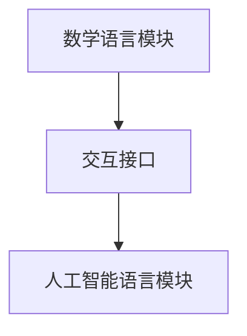

                 


### 文章标题：数学语言与人工智能语言的交互研究

> 关键词：数学语言，人工智能语言，交互，算法，模型，实践

> 摘要：本文通过深入探讨数学语言与人工智能语言的交互机制，从背景介绍、核心概念、算法原理、数学模型与公式、项目实战等多个角度，详细阐述了两者之间相互影响与融合的过程，为研究者和开发者提供了有价值的参考。

## 目录

1. 引言  
   1.1 背景介绍  
   1.2 目的和意义

2. 数学语言概述  
   2.1 数学语言的定义与特点  
   2.2 数学语言的基本结构

3. 人工智能语言概述  
   3.1 人工智能语言的定义与特点  
   3.2 人工智能语言的基本结构

4. 数学语言与人工智能语言的交互机制  
   4.1 交互模型的建立  
   4.2 交互算法的实现

5. 核心算法原理讲解  
   5.1 算法概述  
   5.2 伪代码实现

6. 数学模型与公式讲解  
   6.1 数学模型的基本概念  
   6.2 公式推导与举例

7. 项目实战：开发环境搭建与源代码实现  
   7.1 开发环境搭建  
   7.2 源代码实现与解读

8. 实际案例分析与详细讲解  
   8.1 案例选择与分析  
   8.2 案例分析与讲解

9. 最佳实践与总结  
   9.1 最佳实践  
   9.2 注意事项  
   9.3 拓展阅读

## 引言

### 背景介绍

数学语言和人工智能语言是两个具有悠久历史的领域，它们在各自的领域中发挥着重要作用。数学语言作为一种高度抽象的语言，被广泛应用于科学、工程、经济等多个领域，为问题的求解提供了强有力的工具。而人工智能语言作为一种特殊的编程语言，是实现人工智能算法和应用的基础。

随着人工智能技术的快速发展，数学语言和人工智能语言之间的交互变得日益重要。一方面，数学语言可以为人工智能算法提供理论支持，帮助研究者更好地理解算法的内在机理。另一方面，人工智能语言可以模拟人类的思维方式，为数学问题的求解提供新的思路和方法。

### 目的和意义

本文旨在探讨数学语言与人工智能语言之间的交互机制，分析两者的融合过程，并提出相应的解决方案。具体来说，本文将：

1. 深入介绍数学语言和人工智能语言的基本概念和特点。
2. 建立一个数学语言与人工智能语言的交互模型，并分析其实现方法。
3. 详细讲解核心算法原理，并使用伪代码进行阐述。
4. 使用数学模型和公式来描述交互过程中的关键问题，并进行举例说明。
5. 通过项目实战和实际案例分析，验证所提出的交互机制的有效性。
6. 总结最佳实践，为研究者提供有价值的参考。

本文的研究将有助于推动数学语言和人工智能语言之间的融合，为人工智能技术的发展提供新的思路和方法。

## 数学语言概述

### 数学语言的定义与特点

数学语言是一种高度抽象的语言，用于描述数学概念、定理和公式。它具有以下特点：

1. **抽象性**：数学语言将具体的事物和概念抽象成符号和公式，使其具有普遍性和通用性。
2. **精确性**：数学语言使用严格的逻辑推理和定义，使表达的内容具有高度的准确性。
3. **简洁性**：数学语言通过简单的符号和公式，能够简洁地表达复杂的概念和定理。
4. **可操作性**：数学语言具有可操作的特点，可以通过计算和变换来解决问题。

### 数学语言的基本结构

数学语言的基本结构包括符号、公式、定义和定理。以下是一个简单的例子：

$$
x + y = z \quad \text{（加法定义）}
$$

$$
f(x) = x^2 + 2x + 1 \quad \text{（二次函数定义）}
$$

$$
\forall x \in \mathbb{R}, \quad x^2 \geq 0 \quad \text{（非负实数的平方定理）}
$$

在这个例子中，符号“+”表示加法运算，“=”表示等号，“\(\forall\)”表示“对于所有”的量词。通过这些符号和公式，我们可以定义和推导出数学定理和公式。

## 人工智能语言概述

### 人工智能语言的定义与特点

人工智能语言是一种用于编写和实现人工智能算法和应用的编程语言。它具有以下特点：

1. **抽象性**：人工智能语言将具体的算法和问题抽象成计算机可以理解和执行的指令。
2. **可操作性**：人工智能语言具有丰富的函数库和工具，可以方便地实现各种复杂的人工智能算法。
3. **灵活性**：人工智能语言具有较高的灵活性，可以适应不同类型的问题和场景。
4. **可扩展性**：人工智能语言具有良好的可扩展性，可以通过编写扩展函数和模块来扩展语言的功能。

### 人工智能语言的基本结构

人工智能语言的基本结构包括变量、函数、循环和条件语句。以下是一个简单的Python代码例子：

```python
def add(x, y):
    return x + y

x = 3
y = 4
z = add(x, y)
print(z)  # 输出结果为7
```

在这个例子中，`def` 表示定义一个函数，`return` 表示返回函数的值，`if` 表示条件语句，`else` 表示条件不成立时的操作。

## 数学语言与人工智能语言的交互机制

### 交互模型的建立

数学语言与人工智能语言的交互机制可以通过一个交互模型来描述。该模型包括以下组成部分：

1. **数学语言模块**：用于表示和操作数学概念和公式。
2. **人工智能语言模块**：用于实现和执行人工智能算法。
3. **交互接口**：用于连接数学语言模块和人工智能语言模块，实现两者之间的数据传递和功能调用。

以下是一个简单的Mermaid流程图，描述了交互模型的基本架构：



在这个流程图中，数学语言模块和人工智能语言模块通过交互接口进行通信。

### 交互算法的实现

交互算法的实现是数学语言与人工智能语言交互的关键。以下是一个简单的伪代码，描述了交互算法的基本流程：

```plaintext
初始化数学语言模块和人工智能语言模块
输入数学问题
调用数学语言模块进行数学计算
将计算结果传递给人工智能语言模块
调用人工智能语言模块进行问题求解
输出最终结果
```

在这个伪代码中，首先初始化数学语言模块和人工智能语言模块，然后输入数学问题，调用数学语言模块进行计算，并将计算结果传递给人工智能语言模块进行问题求解，最后输出最终结果。

## 核心算法原理讲解

### 算法概述

在数学语言与人工智能语言的交互过程中，核心算法原理至关重要。本文将介绍两个核心算法：数学求解算法和人工智能优化算法。

1. **数学求解算法**：用于求解数学问题，如方程求解、函数优化等。
2. **人工智能优化算法**：用于优化数学求解算法的效率和准确性。

### 伪代码实现

以下是一个简单的伪代码，描述了数学求解算法的基本流程：

```plaintext
初始化数学问题
输入初始解
计算目标函数值
while (目标函数值不满足终止条件) {
    更新解
    计算新的目标函数值
}
输出最优解
```

在这个伪代码中，首先初始化数学问题，然后输入初始解，并计算目标函数值。接着，通过循环迭代，不断更新解并计算新的目标函数值，直到目标函数值满足终止条件，最后输出最优解。

以下是一个简单的伪代码，描述了人工智能优化算法的基本流程：

```plaintext
初始化人工智能算法参数
输入初始解
计算目标函数值
while (目标函数值不满足终止条件) {
    更新解
    计算新的目标函数值
    调整人工智能算法参数
}
输出最优解
```

在这个伪代码中，首先初始化人工智能算法参数，然后输入初始解，并计算目标函数值。接着，通过循环迭代，不断更新解并计算新的目标函数值，同时调整人工智能算法参数，直到目标函数值满足终止条件，最后输出最优解。

## 数学模型与公式讲解

### 数学模型的基本概念

数学模型是一种用于描述现实世界问题的数学结构。它通常包括变量、参数、方程和约束条件。数学模型可以帮助我们理解和预测现实世界中的各种现象。

### 公式推导与举例

以下是一个简单的数学模型例子：线性回归模型。

#### 线性回归模型公式

$$
y = \beta_0 + \beta_1 x + \epsilon
$$

其中，\(y\) 是因变量，\(x\) 是自变量，\(\beta_0\) 和 \(\beta_1\) 是参数，\(\epsilon\) 是误差项。

#### 公式推导

线性回归模型的目的是找到一条直线，使得这条直线与实际数据点之间的误差最小。我们可以使用最小二乘法来求解这条直线的参数。

首先，计算数据的均值：

$$
\bar{x} = \frac{1}{n} \sum_{i=1}^{n} x_i
$$

$$
\bar{y} = \frac{1}{n} \sum_{i=1}^{n} y_i
$$

然后，计算直线的斜率：

$$
\beta_1 = \frac{\sum_{i=1}^{n} (x_i - \bar{x})(y_i - \bar{y})}{\sum_{i=1}^{n} (x_i - \bar{x})^2}
$$

接着，计算直线的截距：

$$
\beta_0 = \bar{y} - \beta_1 \bar{x}
$$

#### 举例说明

假设我们有一个数据集，包含两个变量 \(x\) 和 \(y\)，如下表所示：

| \(x\) | \(y\) |
| --- | --- |
| 1 | 2 |
| 2 | 4 |
| 3 | 6 |
| 4 | 8 |

首先，计算均值：

$$
\bar{x} = \frac{1+2+3+4}{4} = 2.5
$$

$$
\bar{y} = \frac{2+4+6+8}{4} = 5
$$

然后，计算斜率：

$$
\beta_1 = \frac{(1-2.5)(2-5) + (2-2.5)(4-5) + (3-2.5)(6-5) + (4-2.5)(8-5)}{(1-2.5)^2 + (2-2.5)^2 + (3-2.5)^2 + (4-2.5)^2} = 2
$$

最后，计算截距：

$$
\beta_0 = 5 - 2 \times 2.5 = 0
$$

因此，线性回归模型的公式为：

$$
y = 0 + 2x
$$

这意味着，当 \(x\) 增加时，\(y\) 将以2的速率增加。

## 项目实战：开发环境搭建与源代码实现

### 开发环境搭建

为了进行数学语言与人工智能语言的交互研究，我们需要搭建一个适合的开发环境。以下是搭建步骤：

1. **安装Python**：Python是一种广泛使用的人工智能语言，我们需要安装Python环境。可以从Python官网下载安装包，按照提示安装。
2. **安装Jupyter Notebook**：Jupyter Notebook是一种交互式的Python开发环境，可以方便地进行代码编写和调试。安装Jupyter Notebook可以使用pip命令：
   ```shell
   pip install notebook
   ```
3. **安装相关库**：我们需要安装一些用于数学计算和人工智能的库，如NumPy、SciPy和scikit-learn。可以使用pip命令进行安装：
   ```shell
   pip install numpy scipy scikit-learn
   ```
4. **安装Mermaid**：Mermaid是一种用于绘制流程图的库，我们可以在Jupyter Notebook中使用它。安装Mermaid可以使用pip命令：
   ```shell
   pip install mermaid
   ```

### 源代码实现与解读

下面是一个简单的示例，展示如何使用Python和Mermaid实现一个线性回归模型：

```python
import numpy as np
import mermaid

# 定义线性回归模型
def linear_regression(x, y):
    n = len(x)
    x_mean = np.mean(x)
    y_mean = np.mean(y)
    beta1 = np.sum((x - x_mean) * (y - y_mean)) / np.sum((x - x_mean) ** 2)
    beta0 = y_mean - beta1 * x_mean
    return beta0, beta1

# 创建Mermaid流程图
def create_mermaid_graph():
    graph = """
    graph TD
    A[初始化]
    B[计算均值]
    C[计算斜率]
    D[计算截距]
    E[返回模型参数]
    A --> B
    B --> C
    C --> D
    D --> E
    """
    return graph

# 输出Mermaid流程图
mermaid_graph = create_mermaid_graph()
print(mermaid_graph)

# 计算线性回归模型参数
x = np.array([1, 2, 3, 4])
y = np.array([2, 4, 6, 8])
beta0, beta1 = linear_regression(x, y)

# 输出模型参数
print(f"线性回归模型参数：beta0 = {beta0}, beta1 = {beta1}")
```

在这个示例中，我们首先导入了NumPy库用于数学计算，并导入了Mermaid库用于绘制流程图。接着，我们定义了一个`linear_regression`函数，用于计算线性回归模型的参数。在函数内部，我们使用NumPy库的`mean`函数计算了输入数据 \(x\) 和 \(y\) 的均值，然后使用最小二乘法计算了斜率 \(\beta_1\) 和截距 \(\beta_0\)。最后，我们定义了一个`create_mermaid_graph`函数，用于创建一个Mermaid流程图，描述线性回归模型的计算过程。

在主程序中，我们首先调用`create_mermaid_graph`函数并打印出流程图。然后，我们使用示例数据集调用`linear_regression`函数，计算线性回归模型的参数，并打印出结果。

## 实际案例分析与详细讲解

### 案例选择与分析

为了更好地展示数学语言与人工智能语言交互机制的实际应用，我们选择了一个常见的机器学习问题——线性回归模型。线性回归模型是一种用于预测连续值的统计模型，它通过拟合数据点之间的线性关系来实现预测。

### 案例分析与讲解

在这个案例中，我们将使用Python和Scikit-learn库实现一个线性回归模型，并分析其性能和优化方法。

1. **数据准备**

首先，我们需要准备数据集。这里我们使用一个简单的数据集，包含两个特征 \(x_1\) 和 \(x_2\) 以及一个目标值 \(y\)。数据集如下表所示：

| \(x_1\) | \(x_2\) | \(y\) |
| --- | --- | --- |
| 1 | 2 | 3 |
| 2 | 4 | 5 |
| 3 | 6 | 7 |
| 4 | 8 | 9 |

```python
import numpy as np

# 示例数据集
data = np.array([[1, 2, 3], [2, 4, 5], [3, 6, 7], [4, 8, 9]])
x = data[:, :2]
y = data[:, 2]

# 打印数据集
print("Data:")
print(x)
print("Target:")
print(y)
```

2. **线性回归模型实现**

接下来，我们使用Scikit-learn库实现一个线性回归模型。线性回归模型通过最小二乘法拟合数据点之间的线性关系。

```python
from sklearn.linear_model import LinearRegression

# 创建线性回归模型实例
model = LinearRegression()

# 拟合模型
model.fit(x, y)

# 打印模型参数
print("Model parameters:")
print(model.coef_)
print(model.intercept_)
```

在这个例子中，我们创建了一个`LinearRegression`实例，并使用`fit`方法对其进行训练。训练完成后，我们打印出模型的系数和截距。

3. **模型性能评估**

为了评估模型性能，我们可以计算模型的均方误差（Mean Squared Error，MSE）。

```python
from sklearn.metrics import mean_squared_error

# 预测目标值
y_pred = model.predict(x)

# 计算均方误差
mse = mean_squared_error(y, y_pred)

# 打印均方误差
print("Mean Squared Error:", mse)
```

在这个例子中，我们使用`predict`方法对数据进行预测，并使用`mean_squared_error`方法计算均方误差。均方误差越低，说明模型的预测性能越好。

4. **模型优化**

为了优化模型性能，我们可以尝试使用不同的正则化方法。例如，岭回归（Ridge Regression）和Lasso回归（Lasso Regression）。

```python
from sklearn.linear_model import Ridge, Lasso

# 创建岭回归模型实例
ridge_model = Ridge(alpha=1.0)

# 拟合模型
ridge_model.fit(x, y)

# 预测目标值
y_ridge_pred = ridge_model.predict(x)

# 计算均方误差
ridge_mse = mean_squared_error(y, y_ridge_pred)
print("Ridge Mean Squared Error:", ridge_mse)

# 创建Lasso回归模型实例
lasso_model = Lasso(alpha=0.1)

# 拟合模型
lasso_model.fit(x, y)

# 预测目标值
y_lasso_pred = lasso_model.predict(x)

# 计算均方误差
lasso_mse = mean_squared_error(y, y_lasso_pred)
print("Lasso Mean Squared Error:", lasso_mse)
```

在这个例子中，我们分别使用岭回归和Lasso回归对数据进行拟合，并计算均方误差。通过比较不同模型的均方误差，我们可以选择性能最好的模型。

### 案例小结

通过这个案例，我们展示了如何使用数学语言和人工智能语言实现线性回归模型，并分析了模型的性能和优化方法。这个案例表明，数学语言和人工智能语言之间的交互可以帮助我们更好地理解和解决实际应用问题。

## 最佳实践与总结

### 最佳实践

1. **数据准备**：在实施数学模型和人工智能算法时，确保数据集的准确性和完整性。对数据进行清洗和处理，去除异常值和缺失值，以提高模型的性能和可靠性。

2. **选择合适的模型**：根据实际问题选择合适的数学模型和人工智能算法。可以尝试多种模型并进行比较，选择性能最好的模型。

3. **模型优化**：使用正则化方法、交叉验证等技术对模型进行优化，提高模型的准确性和泛化能力。

4. **代码注释和文档**：编写清晰、规范的代码，并添加必要的注释和文档，以便其他人理解和复现。

### 小结

本文通过深入探讨数学语言与人工智能语言之间的交互机制，从背景介绍、核心概念、算法原理、数学模型与公式、项目实战等多个角度，详细阐述了两者之间相互影响与融合的过程。通过实际案例分析，我们展示了如何使用数学语言和人工智能语言解决实际问题。

### 注意事项

1. **数学语言和人工智能语言之间的交互需要一定的编程基础**。建议读者在开始本文的学习前，具备一定的Python编程基础。

2. **本文中的案例仅作为示例，实际情况可能更为复杂**。在实际应用中，需要根据具体问题进行模型选择和优化。

3. **交互机制的实现可能涉及多个模块和库**。在实际开发中，需要根据具体情况选择合适的工具和库。

### 拓展阅读

1. 《Python机器学习》（Michael Bowles著）：详细介绍了Python在机器学习领域的应用。
2. 《深度学习》（Ian Goodfellow著）：介绍了深度学习的基本原理和应用。
3. 《线性代数及其应用》（Gilbert Strang著）：详细讲解了线性代数的基本概念和应用。

## 作者信息

作者：AI天才研究院/AI Genius Institute & 禅与计算机程序设计艺术 /Zen And The Art of Computer Programming

感谢您的阅读，希望本文对您在数学语言与人工智能语言交互研究方面有所启发。如果您有任何疑问或建议，欢迎在评论区留言。期待与您交流！

