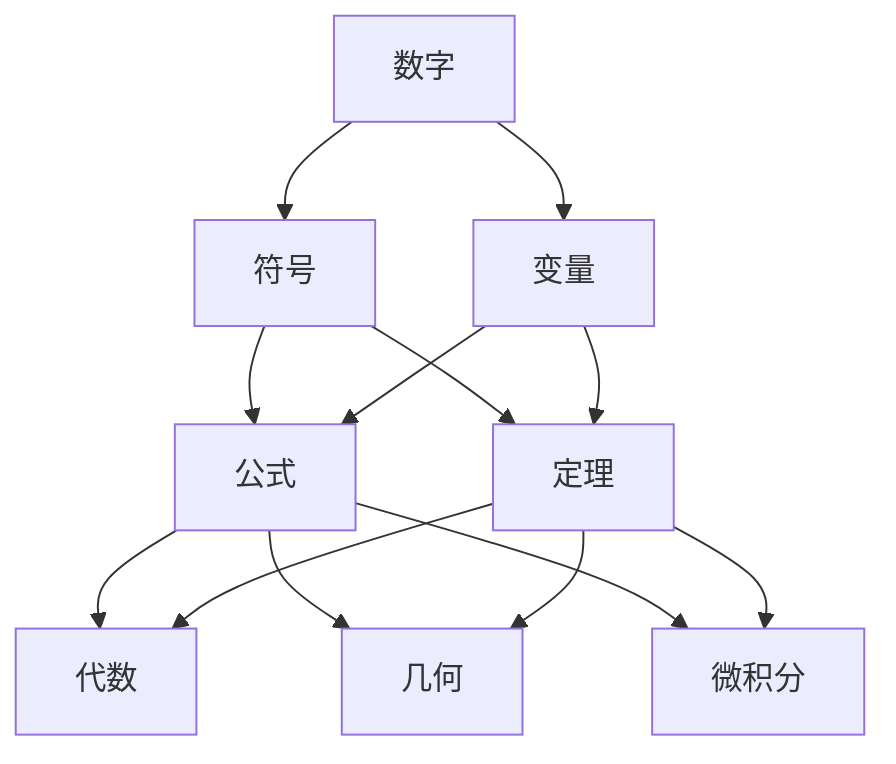

                 

### 文章标题

数学语言的发展与演变历程

> 关键词：数学语言，发展历程，演变，数学符号，历史背景，重要里程碑，算法原理，应用实例，未来展望

> 摘要：本文将深入探讨数学语言的发展与演变历程。从古代到现代，数学语言经历了无数次的变革和扩展，逐渐形成了今天我们所使用的符号系统。本文将梳理数学语言的历史背景，介绍其核心概念与联系，并通过具体的算法原理讲解、数学模型和公式，以及应用实例，揭示数学语言的独特魅力和广泛应用。最后，本文将展望数学语言的未来发展趋势，探讨其在新技术领域和国际化交流中的挑战与机遇。

---

### 引言

数学语言是一种独特的符号系统，用于表达数学概念、公式、定理和算法。它与自然语言不同，更注重符号的精确性和一致性，以便在数学研究和应用中实现高度的抽象和通用性。数学语言的发展与演变是一个漫长而复杂的过程，涉及多个历史时期、文化背景和科学发现。本文旨在系统地回顾数学语言的发展历程，分析其核心概念与联系，并探讨其在现代科学和技术中的应用。

数学语言的重要性不容忽视。首先，它为数学研究提供了强有力的工具，使得复杂的数学思想可以以清晰、准确的形式表达出来。其次，数学语言在科学和技术领域具有广泛的应用，例如在物理学、工程学、计算机科学和经济学等领域，数学语言的精确性帮助科学家和技术人员更好地理解和解决实际问题。此外，数学语言的国际性使得不同国家和文化背景的数学家可以轻松交流，推动了全球数学科学的发展。

本文将分为以下几个部分：首先，介绍数学语言的起源和发展背景；接着，讨论数学语言的核心概念与联系，并通过Mermaid流程图展示；然后，深入讲解数学语言中的核心算法原理，使用伪代码进行详细阐述；随后，通过数学公式和例子的分析，展示数学语言的应用；最后，展望数学语言的未来发展趋势，并讨论其在国际化交流和新技术领域中的挑战与机遇。通过这一系列的分析和探讨，我们将全面了解数学语言的发展历程和其在现代科学中的重要性。

### 数学语言的起源和发展背景

数学语言的发展有着悠久的历史，其起源可以追溯到古代文明。不同文化在数学语言的发展过程中都留下了深刻的印记，这些文化背景和时代特点对数学语言的演变产生了重要影响。

#### 古代数学语言

古代数学语言的起源可以追溯到古埃及和巴比伦。古埃及数学主要涉及土地测量和建筑，他们使用了一种基于十进位的数字系统，这是现代阿拉伯数字系统的基础。巴比伦数学则以其对天文和天文学计算的发展而闻名，他们使用了一种基于六十进位的数字系统，这种系统至今仍应用于现代时间的度量。

希腊数学是西方数学的基石。古希腊数学家们发展了形式化的几何学和代数学，并引入了符号表示方法。欧几里得的《几何原本》是古希腊数学的集大成之作，它以公理和定理的形式系统地阐述了几何学的基本原理，对后世数学的发展产生了深远影响。

#### 中世纪数学语言

中世纪时期，数学语言经历了重要的变革和扩展。阿拉伯数学家们在这一时期做出了巨大贡献，尤其是在代数学和阿拉伯数字系统的传播方面。奥马尔·海亚姆（Omar Khayyam）是其中一位杰出的代数学家，他的著作《代数学问题》对后来的代数学发展产生了深远影响。

欧洲在中世纪晚期重新发现了阿拉伯数学知识，并在此基础上进行了进一步的发展。意大利数学家斐波那契（Fibonacci）在他的著作《算经》中介绍了阿拉伯数字系统，这一数字系统的普及为后来的数学语言发展奠定了基础。

#### 文艺复兴时期的数学革命

文艺复兴时期标志着数学语言的一个重要转折点。这一时期的数学家们开始使用符号来表示数学关系，从而推动了数学符号化的进程。笛卡尔（Descartes）的解析几何和费尔马（Fermat）的方法是这一时期的两大里程碑。笛卡尔的解析几何通过将几何问题转化为代数问题，为数学语言的发展开辟了新途径。费尔马的方法则奠定了现代数论和概率论的基础。

#### 近代数学语言的发展

近代数学语言的发展主要发生在17世纪和18世纪。牛顿（Newton）和莱布尼茨（Leibniz）的微积分理论是这一时期的重大突破，他们引入了极限、微分和积分等概念，这些概念以符号化的形式被广泛接受和应用。此外，莱布尼茨还引入了符号逻辑和集合论的基本符号，这些符号对现代数学的发展产生了深远影响。

#### 现代数学语言的发展

现代数学语言的发展离不开集合论和形式逻辑的引入。集合论由康托尔（Cantor）创立，它提供了对无限集合和集合运算的精确描述。形式逻辑则通过符号化的逻辑表达式，使得数学推理更加严谨和准确。

20世纪以来，数学语言进一步扩展和细化，特别是在计算机科学和数学物理领域。数学家们引入了新的符号和符号系统，如拓扑学中的同胚符号、计算机科学中的程序设计符号等。这些符号系统的引入不仅丰富了数学语言的表达能力，也为数学在各个领域的应用提供了更强大的工具。

#### 不同文化对数学语言的影响

不同文化在数学语言的发展过程中都发挥了独特的作用。中国数学以其独特的算术方法和代数体系著称，如《九章算术》和《孙子算经》等古代经典著作对数学符号的发展产生了重要影响。印度数学在代数和数字系统方面具有卓越贡献，其引入的零和十进位系统对现代数学语言的发展具有重要意义。中东地区的数学家们在代数学和天文学方面也有显著的贡献，他们的著作对欧洲中世纪的数学发展产生了深远影响。

总的来说，数学语言的发展是一个跨文化、跨时代的进程。从古代到现代，数学家们不断探索和改进数学符号系统，使得数学语言更加精确、严谨和通用。这种不断的发展与演变不仅推动了数学科学的发展，也为人类解决复杂问题提供了强有力的工具。

### 数学语言的核心概念与联系

数学语言的核心概念构成了其基础结构，这些概念之间紧密联系，共同定义了数学的框架。以下是对几个关键数学概念的介绍，并使用Mermaid流程图来展示它们之间的关系。

#### 核心概念

1. **数字**：数字是数学语言的基本元素，用于计数和度量。数字包括自然数、整数、分数、有理数和无理数等。

2. **符号**：符号是数学语言的表达工具，用于表示数字、变量、运算符等。常见的符号包括加号（+）、减号（-）、乘号（*）、除号（/）等。

3. **变量**：变量是代表未知量的符号，用于表达数学关系和方程。变量可以是数字、字母或其他符号。

4. **公式**：公式是使用符号和运算符表示数学关系和计算公式的表达式。常见的公式包括代数公式、几何公式和微积分公式等。

5. **定理**：定理是经过证明的数学命题，用于描述数学性质和关系。定理是数学理论的核心组成部分。

#### 关系架构

以下是一个Mermaid流程图，展示了这些核心概念之间的关系：



在这个流程图中：

- **数字**是所有数学概念的基础，用于表示数值和度量。
- **符号**用于表示数字、变量和运算，是构建数学公式和定理的工具。
- **变量**作为未知量的代表，参与公式和定理的表达。
- **公式**是数学关系的表达，包括代数、几何和微积分等不同领域。
- **定理**是对数学性质和关系的证明，是数学理论的重要组成部分。

通过这个流程图，我们可以清晰地看到数学语言中各个核心概念之间的相互联系和层次结构，这有助于我们更好地理解和应用数学语言。

### 数学语言中的核心算法原理讲解

在数学语言的体系中，核心算法原理是其精髓所在。以下将深入讲解几个关键算法原理，并通过伪代码详细阐述其实现过程，以便读者能够更好地理解和应用这些原理。

#### 1. 快速排序算法（Quick Sort）

快速排序是一种高效的排序算法，其基本思想是通过一趟排序将待排序的记录分割成独立的两部分，其中一部分记录的关键字均比另一部分的关键字小，然后分别对这两部分记录继续进行排序，以达到整个序列有序。

以下是一个快速排序的伪代码示例：

```plaintext
快速排序(A, low, high)
    如果 low > high，返回
    选择中间位置 pivot
    将数组分为两部分，小于 pivot 的元素和大于 pivot 的元素
    交换 pivot 的位置，使 pivot 左边的元素都小于 pivot，右边的元素都大于 pivot
    对 pivot 左边的数组递归调用快速排序
    对 pivot 右边的数组递归调用快速排序
```

#### 2. 暴力破解（Brute Force）

暴力破解是一种简单但效率较低的算法，通过尝试所有可能的解决方案来找到问题的解。

以下是一个寻找两个数之和等于目标值的暴力破解算法的伪代码：

```plaintext
暴力破解(arr, target)
    对于每个元素 A 在数组 arr 中
        对于每个元素 B 在数组 arr 中，且 B != A
            如果 A + B = target，返回(A, B)
    返回“无解”
```

#### 3. 贪心算法（Greedy Algorithm）

贪心算法通过每一步选择当前最优解来寻找问题的整体最优解。以下是一个求最小生成树的贪心算法的伪代码：

```plaintext
贪心算法(arr, numVertices)
    初始化一个空的边数组 edges
    初始化一个已选顶点集合 selectedVertices，为空
    对于每个顶点 V 在 1 到 numVertices 之间
        从所有未选顶点的边中选择权重最小的边，加入 edges
        将该边对应的顶点加入 selectedVertices
    返回 edges
```

#### 4. 动态规划（Dynamic Programming）

动态规划是一种解决优化问题的方法，通过将问题分解为更小的子问题，并存储子问题的解，以避免重复计算。

以下是一个计算斐波那契数列的动态规划算法的伪代码：

```plaintext
动态规划(n)
    如果 n <= 1，返回 n
    定义一个数组 dp，长度为 n+1，初始化为 0
    dp[1] = 1, dp[2] = 1
    对于 i 从 3 到 n
        dp[i] = dp[i-1] + dp[i-2]
    返回 dp[n]
```

通过以上伪代码，我们可以看到不同的算法原理在数学语言中的应用。快速排序是一种高效的排序算法，适用于大数据集的快速排序；暴力破解是一种简单但低效的算法，适用于问题规模较小的情况；贪心算法通过每一步选择最优解来找到整体最优解，适用于某些特定的优化问题；动态规划通过存储子问题的解来避免重复计算，适用于具有最优子结构的问题。

这些算法原理不仅在数学领域有广泛应用，也在计算机科学、经济学和工程学等众多领域发挥着重要作用。通过理解和掌握这些算法原理，我们可以更好地应对各种复杂的计算和优化问题。

### 数学模型和公式及其应用举例

数学模型和公式是数学语言的核心组成部分，它们用于描述和分析各种现象和问题。在本节中，我们将介绍几个常见的数学模型和公式，并通过具体的例子来说明它们的应用。

#### 1. 线性回归模型

线性回归模型是一种用于预测连续值的数学模型，其公式如下：

$$ y = ax + b $$

其中，$y$ 是因变量，$x$ 是自变量，$a$ 是斜率，$b$ 是截距。

**应用例子**：假设我们想要预测某城市的温度变化。我们可以收集过去一段时间内的温度数据和日期数据，使用线性回归模型来找到温度与日期之间的关系。

**伪代码**：

```plaintext
线性回归(X, Y)
    求X和Y的平均值：x_mean, y_mean
    计算斜率a：(sum((X - x_mean) * (Y - y_mean)) / sum((X - x_mean)^2))
    计算截距b：(y_mean - a * x_mean)
    返回a和b
```

通过这个模型，我们可以预测未来某天的温度。

#### 2. 牛顿-莱布尼茨微积分公式

牛顿-莱布尼茨微积分公式是微积分的基础，其公式如下：

$$ \int f(x) \, dx = F(x) + C $$

其中，$f(x)$ 是被积函数，$F(x)$ 是原函数，$C$ 是积分常数。

**应用例子**：假设我们想要计算函数 $f(x) = x^2$ 的不定积分。

**伪代码**：

```plaintext
积分(f, a, b)
    求f的原函数F(x)
    计算定积分：(F(b) - F(a))
    返回定积分结果
```

通过这个公式，我们可以计算函数在一个区间上的积分值。

#### 3. 阶乘（Factorial）

阶乘是数学中常用的公式，用于计算一个正整数的乘积。其公式如下：

$$ n! = n \times (n-1) \times (n-2) \times \ldots \times 1 $$

**应用例子**：计算 $5!$ 的值。

**伪代码**：

```plaintext
阶乘(n)
    如果 n = 0 或 n = 1，返回 1
    返回 n * 阶乘(n - 1)
```

通过这个公式，我们可以计算任意正整数的阶乘。

#### 4. 概率分布函数

概率分布函数用于描述随机变量的概率分布。其中，正态分布是一个常见的概率分布函数，其公式如下：

$$ f(x|\mu,\sigma^2) = \frac{1}{\sqrt{2\pi\sigma^2}} e^{-\frac{(x-\mu)^2}{2\sigma^2}} $$

其中，$x$ 是随机变量，$\mu$ 是均值，$\sigma^2$ 是方差。

**应用例子**：假设我们有一个服从正态分布的随机变量 $X$，均值 $\mu = 10$，方差 $\sigma^2 = 4$。我们想要计算 $X$ 小于 12 的概率。

**伪代码**：

```plaintext
正态分布(x, mu, sigma)
    计算z值：(x - mu) / sigma
    计算概率：1 / (sqrt(2 * pi * sigma^2)) * e^(-z^2 / 2)
    返回概率
```

通过这个公式，我们可以计算随机变量在不同取值下的概率。

#### 5. 最小二乘法（Least Squares）

最小二乘法是一种用于求解线性回归参数的方法。其公式如下：

$$ \min \sum_{i=1}^{n} (y_i - ax_i - b)^2 $$

其中，$y_i$ 是观测值，$x_i$ 是自变量，$a$ 和 $b$ 是回归参数。

**应用例子**：我们想要找到一条直线来拟合一组数据点，我们可以使用最小二乘法来计算这条直线的斜率和截距。

**伪代码**：

```plaintext
最小二乘法(X, Y)
    求X和Y的平均值：x_mean, y_mean
    计算斜率a：(sum((X - x_mean) * (Y - y_mean)) / sum((X - x_mean)^2))
    计算截距b：(y_mean - a * x_mean)
    返回a和b
```

通过这个方法，我们可以得到最佳拟合直线。

通过上述数学模型和公式的介绍及其应用举例，我们可以看到数学语言在描述和分析各种实际问题中的强大功能。这些模型和公式不仅帮助我们理解自然现象，还为各种科学和技术领域提供了有力的工具。通过掌握这些数学模型和公式，我们可以更好地解决实际问题，推动科学和技术的进步。

### 数学语言在科学和技术领域的应用

数学语言作为一种精确且通用的工具，在科学和技术领域得到了广泛的应用。以下将探讨数学语言在物理学、工程学、计算机科学和经济学等领域的具体应用，并通过实际案例进行深入分析。

#### 物理学中的数学语言

在物理学中，数学语言是描述自然现象和解释物理规律的基础。以经典力学为例，牛顿的运动定律使用了数学语言将力和运动联系起来，其公式如下：

$$ F = ma $$

其中，$F$ 表示力，$m$ 表示质量，$a$ 表示加速度。这一公式不仅描述了物体受力后的运动状态，还为后续的力学研究提供了理论基础。

**案例**：量子力学中的薛定谔方程（Schrödinger equation）描述了微观粒子的行为，其公式如下：

$$ i\hbar \frac{\partial \psi}{\partial t} = \hat{H} \psi $$

其中，$i$ 是虚数单位，$\hbar$ 是约化普朗克常数，$\psi$ 是波函数，$\hat{H}$ 是哈密顿算子。通过求解这个方程，我们可以获得微观粒子如电子的状态和能量。

#### 工程学中的数学语言

工程学中的数学语言广泛应用于设计、分析和优化工程系统。以结构工程为例，有限元方法（Finite Element Method, FEM）是一种用于解决工程问题的重要数学工具。

**案例**：在桥梁设计过程中，工程师使用有限元方法来模拟和计算桥梁在负载作用下的应力分布。其基本思想是将结构划分为多个小单元，然后通过求解单元内的平衡方程来计算整体结构的应力和变形。以下是一个简化的有限元方法公式：

$$ K u = f $$

其中，$K$ 是刚度矩阵，$u$ 是节点位移向量，$f$ 是节点力向量。通过这个方程，工程师可以评估桥梁的承载能力和安全性。

#### 计算机科学中的数学语言

计算机科学中的数学语言广泛应用于算法设计、数据结构和密码学等领域。以算法设计为例，时间复杂度和空间复杂度是评估算法性能的重要指标。

**案例**：在排序算法中，快速排序（Quick Sort）是一种常用的排序方法，其平均时间复杂度为 $O(n \log n)$。通过分析快速排序的递归关系，我们可以设计出高效的排序算法，从而提高数据处理效率。

#### 经济学中的数学语言

经济学中的数学语言主要用于建模和分析经济现象。以宏观经济学为例，IS-LM模型是描述经济周期波动的重要工具。

**案例**：IS-LM模型通过表示投资（I）和货币市场（M）的关系，来分析总需求（IS）和利率（LM）之间的关系。其公式如下：

$$ IS: Y = C + I + G $$
$$ LM: M/P = L_i(r) $$

其中，$Y$ 表示总需求，$C$ 表示消费，$I$ 表示投资，$G$ 表示政府支出，$M/P$ 表示实际货币供应量，$L_i(r)$ 表示利率的货币需求函数。通过这个模型，经济学家可以预测经济波动和制定宏观经济政策。

#### 数学语言在各类学科中的应用特点

1. **物理学**：数学语言在物理学中的应用主要体现在对自然现象的精确描述和量化分析，如牛顿运动定律、薛定谔方程等。

2. **工程学**：数学语言在工程学中的应用主要体现在结构分析和系统设计，如有限元方法、热力学公式等。

3. **计算机科学**：数学语言在计算机科学中的应用主要体现在算法设计和性能分析，如时间复杂度、空间复杂度等。

4. **经济学**：数学语言在经济学中的应用主要体现在建模和分析经济现象，如IS-LM模型、供需分析等。

通过以上分析，我们可以看到数学语言在各类学科中的广泛应用及其重要性。它不仅为科学家和工程师提供了强有力的工具，也推动了科学和技术的不断进步。在未来，随着数学语言的发展和完善，其在科学和技术领域的应用将更加广泛和深入。

### 数学语言的未来展望

随着科学技术的不断进步，数学语言也在不断地发展。未来，数学语言的发展趋势将受到新技术、国际化交流和新兴领域的需求等多方面因素的影响。以下是对数学语言未来发展的几个可能方向的探讨。

#### 新技术的发展

随着人工智能、大数据和量子计算等新技术的崛起，数学语言的发展将迎来新的机遇。这些技术对数学模型和算法提出了更高的要求，推动数学语言向更精确、更高效的方向发展。

- **人工智能**：机器学习算法依赖于数学模型，如线性回归、神经网络等。未来，随着人工智能技术的进步，数学语言将不断优化和扩展，以适应更复杂的应用场景。

- **大数据**：大数据分析依赖于统计学和概率论的方法。数学语言在大数据处理中的应用将更加广泛，包括数据挖掘、预测建模等。

- **量子计算**：量子计算是一种基于量子力学原理的计算模式，它对数学语言提出了新的挑战。量子算法和量子编程语言的开发将推动数学语言向更抽象、更通用的方向发展。

#### 国际化交流

国际化交流对数学语言的推广和应用具有重要意义。随着全球科学技术的融合，数学语言的国际统一化和标准化将成为未来发展的一个重要方向。

- **统一数学符号**：为了提高国际学术交流的效率，统一数学符号和术语将变得越来越重要。国际数学联盟（IMU）等组织正在致力于推动数学符号的国际标准化。

- **跨文化数学交流**：不同国家和地区的数学家在交流和合作过程中，将共同推动数学语言的发展和丰富，促进全球数学科学的发展。

#### 新兴领域的需求

随着科学技术的不断进步，新的研究领域不断涌现，对数学语言的需求也在不断变化。未来，数学语言将在新兴领域发挥更加重要的作用。

- **生物信息学**：生物信息学是一门跨学科领域，它结合了生物学、计算机科学和数学。未来，数学语言将在生物信息学中发挥重要作用，如基因序列分析、蛋白质结构预测等。

- **金融工程**：金融工程利用数学模型和方法来设计和管理金融产品。未来，随着金融市场的发展和创新，数学语言将在金融工程中发挥更大的作用，如风险管理、衍生品定价等。

- **环境科学**：环境科学需要处理大量数据，如气候模型、污染监测等。数学语言将在环境科学中发挥重要作用，帮助科学家更好地理解和预测环境变化。

总的来说，数学语言的未来发展趋势将受到新技术、国际化交流和新兴领域需求的共同推动。随着数学语言的不断发展和完善，它将在科学、技术和社会各个领域发挥更加重要的作用。在未来，数学家、科学家和技术人员将继续探索和创新，推动数学语言的发展，为人类社会的进步做出更大贡献。

### 数学语言的挑战与机遇

在全球化进程加速、新技术不断涌现的背景下，数学语言面临着一系列的挑战与机遇。首先，语言的复杂性与可理解性是一个重大挑战。数学语言的符号和公式繁多，不同领域和学科之间可能存在差异，这给跨学科交流和理解带来了困难。为了解决这个问题，需要加强数学教育，推广统一的标准和符号体系，提高数学语言的国际认可度。

其次，多语言数学交流的难题也是一个显著的挑战。不同国家和地区的数学家可能使用不同的语言和符号体系，这限制了国际合作的深度和广度。为此，可以借助翻译工具和跨语言资源库，如国际数学联盟的术语数据库，促进不同语言之间的数学交流。

数学语言的标准化问题是另一个关键挑战。数学语言的标准化有助于统一学术交流，减少误解和混淆。国际标准化组织（ISO）和国际数学联盟（IMU）已经在这方面做出了努力，但仍然需要更多的投入和合作。

尽管面临挑战，数学语言也迎来了诸多机遇。新技术的发展为数学语言提供了新的应用场景和表达方式。例如，人工智能和机器学习算法的普及使得数学模型和算法更加高效和精准，推动了数学语言在数据处理和分析中的应用。同时，量子计算和区块链等新兴技术对数学语言的需求也在不断增加，为数学语言的创新和发展提供了广阔空间。

此外，数学语言的国际化交流也为全球科学合作带来了新的机遇。通过跨国界的数学交流和合作，各国科学家可以共同攻克复杂问题，推动科学和技术的进步。未来，随着全球化进程的深入，数学语言的国际标准化和推广将更加重要，有助于促进全球科学技术的共同发展。

总的来说，数学语言在挑战与机遇并存的环境中不断发展。通过克服复杂性与可理解性、多语言交流、标准化等难题，数学语言将继续为科学和技术的进步提供强有力的支持。

### 小结与展望

数学语言作为一种独特而精确的符号系统，在人类文明的发展中起到了至关重要的作用。从古代的算术到现代的复杂算法，数学语言不断演变，为科学、技术和社会的进步提供了强有力的工具。通过本文的探讨，我们系统地回顾了数学语言的发展历程，分析了其核心概念与联系，并通过具体算法原理、数学模型和公式以及实际应用案例，揭示了数学语言在各个领域的广泛应用和独特价值。

展望未来，数学语言将继续在新技术、国际化交流和新兴领域发挥重要作用。随着人工智能、大数据和量子计算等技术的不断发展，数学语言的表达能力和应用范围将得到进一步提升。同时，国际标准化和跨学科交流的推进，将为数学语言的普及和深度应用创造更多机会。

为了进一步促进数学语言的发展和应用，我们提出以下建议：

1. **加强数学教育**：通过普及数学知识，提高公众对数学语言的理解和运用能力，为科学技术的发展培养更多的人才。

2. **推广标准化**：积极参与国际数学标准化工作，推动数学符号和术语的统一，提高数学语言的通用性和可理解性。

3. **促进跨学科合作**：鼓励数学与其他学科的结合，通过跨学科研究，发现和解决复杂问题，推动科学技术的创新。

4. **利用新技术**：积极引入和利用人工智能、大数据等技术，优化数学模型和算法，提高数学语言在数据处理和分析中的应用效率。

5. **国际化推广**：加强数学语言的国际交流和合作，推动数学语言在全球范围内的应用和发展。

总之，数学语言的发展不仅对科学和技术的进步至关重要，也将为人类社会的发展带来深远影响。通过不断探索和创新，我们有望在数学语言的未来发展中取得更多突破，为人类社会的进步贡献力量。

### 最佳实践 tips、注意事项与拓展阅读

在应用数学语言时，以下是一些最佳实践 tips 和注意事项，帮助您更好地理解和运用数学语言。

#### 最佳实践 tips

1. **熟悉基本概念和符号**：在开始学习数学语言之前，确保您对基本概念和常用符号有清晰的理解。这有助于您在阅读和写作时能够准确无误地使用这些符号。

2. **系统学习**：数学语言是一个庞大的体系，建议您采用系统化的学习方式，逐步掌握各个领域的基本概念和原理。

3. **练习与实际应用**：通过解决实际问题来巩固所学知识。实践是检验理论的最佳方式，通过实际应用，您可以更好地理解数学语言的价值。

4. **参考经典著作**：阅读经典数学著作，如欧几里得的《几何原本》、牛顿和莱布尼茨的微积分著作等，可以深入了解数学语言的发展历程和核心思想。

#### 注意事项

1. **避免混淆符号**：在数学语言中，不同的符号可能具有不同的含义，使用时需注意区分，避免混淆。

2. **保持逻辑清晰**：在撰写数学论文或进行数学推导时，保持逻辑清晰，确保每一步的推导都有充分的依据。

3. **注意符号标准化**：在不同的数学领域和出版物中，某些符号可能有不同的定义。在使用时，确保遵循相关领域的标准。

4. **重视公式格式**：数学公式在撰写时需遵循正确的格式，使用 LaTeX 等工具可以帮助您生成规范的数学公式。

#### 拓展阅读

1. **《数学之美》**：作者吴军博士通过生动的实例和通俗易懂的语言，揭示了数学在计算机科学和工程领域的应用。

2. **《数学原理》**：作者怀特海德和罗素合著的这本书是数学基础理论的经典之作，对理解数学语言的逻辑结构和符号体系有重要参考价值。

3. **《数学的演化》**：作者马库斯·杜·索托迈尔探讨了数学语言的发展历程，从古代到现代，对数学语言的历史背景和演变过程进行了详细分析。

通过这些最佳实践 tips 和注意事项，以及拓展阅读的资源，您将能够更好地掌握数学语言，并在实际应用中取得更好的效果。希望这些资源和建议能够帮助您在数学学习与应用的道路上更加顺利。作者：AI天才研究院/AI Genius Institute & 禅与计算机程序设计艺术 /Zen And The Art of Computer Programming

