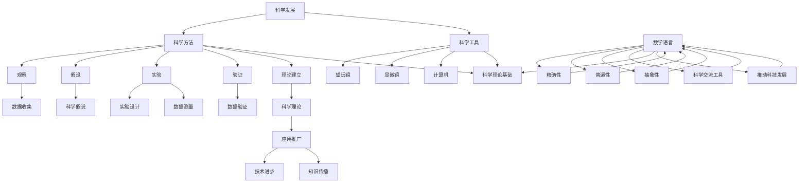

                 


### 第1章 引言

#### 1.1 科学发展的基本概念

科学发展是一个动态的、不断演进的过程，它涉及对自然界、人类社会以及宇宙的认识和探索。科学的发展可以分为多个阶段，包括观察、假设、实验、验证和理论建立等。每一个阶段都是在前一阶段的基础上，通过新方法、新工具和新技术的发展，不断深化对世界的理解。

科学发展的动力来源于多个方面，其中包括：

1. **人类的好奇心**：人类天生对未知事物充满好奇，驱使着人类不断探索未知领域。
2. **实践需求**：生产和生活实践中遇到的问题，推动了科学技术的发展。
3. **理论突破**：科学理论的发展，往往能够揭示自然现象背后的规律，推动科学技术的进步。

科学的发展不仅依赖于科学家的智慧和创新，还依赖于科学方法和工具的进步。科学方法包括观察、实验、假设、验证和理论建立等步骤，而科学工具则是进行科学研究的重要手段，如望远镜、显微镜、计算机等。

#### 1.2 数学语言的作用和地位

数学语言是科学语言的重要组成部分，它以符号、公式和逻辑推理为基本工具，用以表达科学概念和科学理论。数学语言在科学发展中具有以下几个重要作用：

1. **精确性**：数学语言可以精确地表达科学概念和理论，使科学研究具有更高的准确性和可靠性。
2. **普遍性**：数学语言具有高度的普适性，能够应用于各种科学领域，从而促进了科学知识的交流和融合。
3. **抽象性**：数学语言能够抽象出自然现象背后的数学结构，为科学研究提供了新的视角和方法。

数学语言在科学发展中的地位是不可替代的。首先，它是科学理论建立的基础，很多科学理论都是通过数学模型来描述和验证的。其次，数学语言是科学交流的工具，它使得科学成果能够被广泛传播和共享。最后，数学语言的发展本身也推动了科学技术的进步，许多新的科学发现和技术突破都与数学语言的发展密切相关。

#### 1.3 数学语言的发展历程

数学语言的发展历程可以追溯到古代，从最早的计数符号到现代的符号系统，数学语言经历了不断的演变和发展。以下是数学语言发展历程的几个关键阶段：

1. **古代**：在古代，数学语言主要是以文字和图形的形式存在的。古埃及和巴比伦人使用符号来表示数字，古希腊人则发展了早期的代数和几何学。

2. **中世纪**：中世纪时期，阿拉伯数学家对数学语言的发展做出了重要贡献。他们引入了十进制位值系统，并将代数学和几何学推向了新的高度。

3. **文艺复兴**：文艺复兴时期，数学语言得到了进一步的发展。意大利数学家发现了微积分，法国数学家发展了概率论和解析几何，这些成果为现代数学语言的形成奠定了基础。

4. **现代**：现代数学语言的发展主要体现在符号体系的完善和公理系统的建立上。德国数学家康托尔创立了集合论，英国数学家皮亚诺提出了自然数的符号定义，这些成就标志着现代数学语言的成熟。

通过以上分析，我们可以看到数学语言在科学发展中的重要作用和地位。它不仅为科学研究提供了精确的工具和抽象的视角，还推动了科学技术的进步。接下来的章节将进一步探讨数学语言在不同历史阶段的发展和其对科学发展的影响。

---

**核心概念与联系**

在引言部分，我们介绍了科学发展的基本概念、数学语言的作用和地位，以及数学语言的发展历程。以下是核心概念及其相互关系的架构 Mermaid 流程图：



该流程图展示了科学方法、科学工具、数学语言及其作用之间的相互关系。数学语言作为科学理论的基础，不仅为科学方法提供了精确性和普遍性，还通过其抽象性和作为科学交流的工具，推动了科学技术的进步和知识的传播。

### 第2章 古代数学语言及其影响

#### 2.1 古埃及与巴比伦数学

古代数学的起源可以追溯到古埃及和巴比伦，这两个文明在数学语言的发展中起到了至关重要的作用。

**古埃及数学**

古埃及数学主要是用于农业、建筑和日常生活的计算。古埃及人使用的是一种基于十进制的计数系统，但他们在处理分数和小数时存在一些困难。古埃及数学的一个显著特点是其符号和记数法，这些符号包括代表数字的图形和代表数学运算的符号。古埃及的数学知识主要通过莎草纸文献流传下来，其中最著名的文献是《莱因德纸草书》（Rhind Papyrus）和《莫斯科数学纸草书》（Moscow Papyrus）。

这些文献中记录了古埃及人在代数、几何、分数和比例等方面的知识。例如，古埃及人使用了“比例法”来解线性方程组，并使用了一种独特的“几何算法”来计算面积和体积。尽管古埃及数学缺乏现代数学的抽象性和严谨性，但它为后来的数学发展奠定了基础。

**巴比伦数学**

巴比伦数学的发展与古埃及数学相似，但也存在一些不同。巴比伦人使用的是一种基于六十进制的计数系统，这种系统至今仍应用于时间的测量和角度的计算。巴比伦数学的一个显著特点是其对天文和天文学的应用，他们通过观察天文现象，发展了复杂的日历和天文计算方法。

巴比伦数学在代数和几何学方面也有重要贡献。巴比伦人使用了一种称为“方程表”的方法来解决线性方程，这种方法类似于现代的插值法。他们还使用了一些几何算法来计算面积和体积，例如他们使用“割圆法”来计算圆的面积。

**古埃及与巴比伦数学的相互作用**

古埃及和巴比伦之间的数学交流在一定程度上促进了数学语言的发展。虽然这两个文明之间没有直接的文献记录显示他们有数学交流，但他们的数学知识在某些方面有相似之处，这表明可能存在某种间接的影响。

例如，古埃及的“几何算法”与巴比伦的“割圆法”在某些计算方法上有相似之处，这可能表明两种文明在数学计算上有相互学习。此外，古埃及的十进制计数系统和巴比伦的六十进制计数系统可能也在一定程度上影响了彼此。

#### 2.2 古希腊数学

古希腊数学是古代数学发展的一个重要阶段，它不仅继承和发展了古埃及和巴比伦的数学知识，还在理论和概念上取得了重大突破。

**古希腊数学的特点**

古希腊数学的主要特点包括其高度的抽象性、逻辑严密性和系统性。与古埃及和巴比伦的实用主义数学不同，古希腊数学更加关注数学本身的内在结构和逻辑关系。

古希腊数学家使用的是一种基于几何的数学语言，他们通过定义、公理和定理来建立数学体系。这种数学语言不仅用于解决实际问题，还用于探索数学的纯粹理论。

**古希腊数学的成就**

古希腊数学在多个领域取得了显著成就，其中最著名的包括几何学、代数和数论。

1. **几何学**：古希腊几何学的代表人物包括欧几里得、阿基米德和帕普斯。欧几里得的《几何原本》是古希腊数学的巅峰之作，它系统地阐述了平面几何的基本原理和定理。阿基米德则在几何学和力学领域做出了许多重要贡献，例如他发现了浮力定律和杠杆原理。

2. **代数**：古希腊的代数学主要是由丢番图和毕达哥拉斯学派发展起来的。丢番图的《算术》是古代代数学的经典著作，他提出了许多关于线性方程和二次方程的解法。毕达哥拉斯学派则提出了著名的毕达哥拉斯定理，这一定理在几何学和物理学中都有重要应用。

3. **数论**：古希腊数论的研究主要集中在质数、因数和数论函数等方面。欧几里得在《几何原本》中提出了著名的欧几里得算法，这一算法用于求解最大公约数。此外，古希腊数学家还研究了数论中的许多问题，例如费马小定理和哥德巴赫猜想。

**古希腊数学语言的影响**

古希腊数学语言对科学发展产生了深远影响。首先，它提供了数学作为一种严谨的逻辑系统的范例，这对后来的数学发展产生了重要影响。其次，古希腊数学的成就为科学理论的建立提供了数学基础，例如欧几里得的几何学为物理学提供了空间和形变的描述工具，丢番图的代数学为解决实际问题提供了计算方法。

总之，古代数学语言，包括古埃及、巴比伦和古希腊的数学，对科学发展有着重要的贡献。它们不仅提供了实用的计算工具，还在理论上为科学方法的发展奠定了基础。这些早期的数学成就为后来的科学发展铺平了道路，使我们能够更深入地理解自然界的规律。

---

**核心概念与联系**

在第二章节中，我们详细介绍了古埃及与巴比伦数学以及古希腊数学，并探讨了它们的特点和成就。以下是这些核心概念及其相互关系的架构 Mermaid 流程图：

```mermaid
graph TD
    A[古埃及数学] --> B[计数系统]
    A --> C[几何算法]
    A --> D[方程表]
    B --> E[十进制]
    C --> F[面积和体积计算]
    D --> G[线性方程解决]
    H[巴比伦数学] --> I[J[六十进制]]
    H --> K[L[天文计算]]
    H --> M[N[割圆法]]
    I --> O[时间测量]
    I --> P[角度计算]
    K --> Q[天文现象观察]
    L --> M
    B --> H
    A --> H
    E --> B
    F --> C
    G --> D
    J --> I
    P --> I
    Q --> K
    N --> M
    B[古希腊数学] --> R[S[几何学]]
    B --> T[U[代数]]
    B --> V[W[数论]]
    R --> X[Y[欧几里得]]
    R --> Z[A[毕达哥拉斯]]
    T --> AA[丢番图]
    V --> BB[欧几里得算法]
    Y --> CC[《几何原本》]
    Z --> CC
    AA --> CC
    BB --> V
    CC --> R
    DD[数学语言的影响] --> E[理论建立]
    E --> F[科学方法]
    E --> G[计算工具]
    F --> H[实验设计]
    G --> I[技术进步]
    H --> J[数据测量]
    I --> K[知识传播]
    J --> L[问题解决]
```

该流程图展示了古埃及数学、巴比伦数学和古希腊数学的核心概念及其相互关系，以及它们对数学语言的影响。这些数学语言的发展不仅为科学方法提供了基础，还推动了科学技术的进步和知识的传播。

### 第3章 中世纪数学语言及其影响

#### 3.1 中世纪阿拉伯数学

中世纪阿拉伯数学对数学语言的发展产生了深远的影响。阿拉伯数学家在中世纪时期，尤其是在公元8世纪至13世纪期间，对数学理论进行了系统化和发展，他们的成就不仅在阿拉伯世界得到广泛认可，而且对整个欧洲的科学进步产生了重要影响。

**阿拉伯数学的特点**

阿拉伯数学的特点主要包括对代数和几何学的系统化发展、对数字和数论的研究、以及将印度-阿拉伯数字系统引入欧洲。

1. **代数**：阿拉伯数学家在代数领域做出了重要贡献，最著名的代表是阿尔·花拉子米（Al-Khwarizmi）。他的著作《代数学》不仅对代数的基本概念和原理进行了系统化，还提出了代数方程的解法，尤其是关于二次方程的解法。这些理论和方法对后来的欧洲代数学家产生了深远影响。

2. **几何学**：阿拉伯数学家在几何学方面也有显著成就，例如阿尔·哈里德（Al-Hasan ibn Ali al-Qass）。他编写了《几何学入门》，该书对欧几里得的《几何原本》进行了补充和扩展。

3. **数字和数论**：阿拉伯数学家对数字系统的研究也非常深入，他们改进了印度-阿拉伯数字系统，使其更加完善。这种数字系统不仅简化了计算，还使得数学研究更加精确。

**阿拉伯数学家的贡献**

阿拉伯数学家的贡献不仅体现在理论发展上，还包括将数学知识传播到欧洲。公元8世纪，阿拉伯世界在西班牙建立了科尔多瓦哈里发王国，成为文化和科学的重要中心。阿拉伯数学家在此地开展了大量数学研究，并将这些研究成果通过翻译传入欧洲。

最著名的翻译活动是公元12世纪由阿拉伯文翻译成拉丁文的《代数学》。这部著作不仅传播了阿拉伯的代数理论，还影响了欧洲的数学教育，使得代数学在欧洲得到广泛推广。此外，阿拉伯数学家还将印度-阿拉伯数字系统引入欧洲，这一数字系统的引入极大地提高了欧洲的计算效率，对科学技术的进步产生了深远影响。

#### 3.2 欧洲中世纪数学

中世纪欧洲的数学发展受到了阿拉伯数学的影响，但同时也发展出了自己的特色。欧洲中世纪数学的兴起与基督教教学机构的建立和学术活动的兴起密切相关。

**欧洲中世纪数学的特点**

1. **阿拉伯数学的继承与发扬**：欧洲中世纪数学家通过翻译和学术交流，吸收了阿拉伯数学的成果，并在其基础上进行进一步的发展。例如，意大利数学家斐波那契（Fibonacci）在其著作《算经》中介绍了印度-阿拉伯数字系统，并使用这一系统来解决实际问题。

2. **实用性的强调**：中世纪欧洲的数学更加注重实用性，数学知识被广泛应用于农业、建筑和商业等领域。这一时期的数学家通过解决实际问题来推动数学的发展。

3. **天文学和地理学的数学应用**：中世纪欧洲数学在天文学和地理学领域取得了重要进展。数学被用来计算天文历法、绘制地图和测量地球的形状。

**欧洲中世纪数学的代表人物**

1. **斐波那契**：斐波那契是中世纪欧洲最著名的数学家之一，他提出了斐波那契数列，这一数列在生物学、物理学和计算机科学等领域都有广泛的应用。

2. **萨克森克努特**：萨克森克努特是一位英国数学家和天文学家，他编写了《天文学导论》，这本书对中世纪的天文学研究产生了重要影响。

3. **罗吉尔·培根**：罗吉尔·培根是一位法国数学家和哲学家，他提出了许多关于逻辑和数学理论的观点，对后来的科学方法发展产生了影响。

#### 3.3 中世纪数学语言对科学发展的影响

中世纪数学语言的发展对科学发展产生了深远的影响。首先，数学作为一种精确的语言，为科学理论提供了严谨的表述工具。中世纪数学家通过发展代数和几何学，为后来的物理学、天文学和生物学等学科提供了数学基础。

其次，中世纪数学的发展促进了科学技术的进步。例如，印度-阿拉伯数字系统的引入使得计算变得更加简便和高效，为科学研究和工程应用提供了重要支持。此外，中世纪数学在解决实际问题中的应用，如天文历法的计算和地图绘制，也为科学技术的进步做出了贡献。

最后，中世纪数学语言的发展推动了科学知识的传播和交流。通过翻译和学术活动，阿拉伯数学和欧洲中世纪数学的成果被广泛传播，促进了不同地区和文明之间的科学交流。

总之，中世纪数学语言的发展不仅为科学理论提供了基础，还推动了科学技术的进步，并为科学知识的传播和交流创造了条件。这些成就为后来的科学发展奠定了坚实的基础。

---

**核心概念与联系**

在第三章节中，我们介绍了中世纪阿拉伯数学和欧洲中世纪数学的特点和贡献。以下是这些核心概念及其相互关系的架构 Mermaid 流程图：

```mermaid
graph TD
    A[中世纪阿拉伯数学] --> B[代数发展]
    A --> C[几何学进步]
    A --> D[数字与数论研究]
    B --> E[《代数学》]
    C --> F[《几何学入门》]
    D --> G[印度-阿拉伯数字]
    E --> H[代数理论传播]
    F --> I[几何学扩展]
    G --> J[计算效率提升]
    H --> K[欧洲代数学影响]
    I --> L[几何学应用]
    J --> K
    G --> K
    B --> A
    C --> A
    D --> A
    A --> M[科学发展影响]
    M --> N[科学理论基础]
    M --> O[技术进步]
    M --> P[知识传播]
    Q[欧洲中世纪数学] --> R[S[实用性强调]]
    Q --> T[U[天文学应用]]
    Q --> V[W[地理学应用]]
    R --> X[Y[印度-阿拉伯数字]]
    T --> Z[A[天文历法]]
    V --> AA[B[地图绘制]]
    X --> K
    Z --> T
    AA --> V
    Y --> K
    Q --> BB[数学家贡献]
    BB --> C[斐波那契]
    BB --> D[萨克森克努特]
    BB --> E[罗吉尔·培根]
    C --> BB
    D --> BB
    E --> BB
```

该流程图展示了中世纪阿拉伯数学和欧洲中世纪数学的核心概念及其对科学发展的影响。这些数学语言的发展不仅为科学理论提供了基础，还推动了科学技术的进步和科学知识的传播。

### 第4章 文艺复兴时期数学语言及其影响

#### 4.1 文艺复兴时期数学的突破

文艺复兴时期（约14世纪至17世纪）是欧洲历史上一个重要的文化和科学革命时期，这一时期的数学语言取得了显著突破，为现代数学的建立奠定了基础。

**微积分的创立**

文艺复兴时期最伟大的数学突破之一是微积分的创立。微积分的研究始于17世纪，由英国数学家艾萨克·牛顿（Isaac Newton）和德国数学家戈特弗里德·威廉·莱布尼茨（Gottfried Wilhelm Leibniz）几乎同时独立发展出来。

**牛顿的贡献**

牛顿在微积分的发展中起到了关键作用。他提出了流数法（fluxions），这是一种用于描述变化率的方法。牛顿通过流数法研究了运动物体的速度和加速度，以及面积和体积的计算问题。牛顿的工作主要体现在他的著作《自然哲学的数学原理》（Philosophiæ Naturalis Principia Mathematica）中，该书系统地阐述了万有引力定律和运动定律，为经典力学奠定了数学基础。

**莱布尼茨的贡献**

莱布尼茨独立于牛顿，发展出了另一种微积分体系，他引入了“微分”和“积分”这两个术语。莱布尼茨的方法更加符号化，使用符号如dx和dy来表示变化率，这些符号至今仍在使用。莱布尼茨的积分方法为后来的函数分析和微分方程的研究提供了基础。

**微积分的影响**

微积分的创立对科学发展产生了深远的影响。首先，微积分提供了一种描述和解决变化问题的数学工具，使得科学家能够更精确地描述自然界的现象。在物理学中，微积分被用来研究物体的运动、力和能量，推动了经典力学的建立。在数学中，微积分的发展促进了函数分析和微分方程的研究，为现代数学的许多分支奠定了基础。

**解析几何的复兴**

文艺复兴时期的另一个重要数学突破是解析几何的复兴。解析几何是一种将几何问题转化为代数问题的方法，最早由法国数学家雷内·笛卡尔（René Descartes）提出。

**笛卡尔的贡献**

笛卡尔在《几何学》（La Géométrie）一书中，提出了坐标轴的概念，并使用代数方程来描述几何图形。他发明了笛卡尔坐标系，使得几何问题可以通过代数方程来解决。笛卡尔的这一方法不仅提高了几何研究的精确性，还促进了数学与其他科学领域的交叉融合。

**解析几何的影响**

解析几何的复兴对科学的发展产生了重要影响。首先，它使得几何研究变得更加抽象和一般化，促进了数学的抽象化发展。其次，解析几何的方法为后来的物理学和工程学提供了数学工具，使得这些领域的研究更加精确和系统化。

**概率论的发展**

文艺复兴时期，概率论也开始兴起，这一数学分支在解决赌博和保险问题中起到了重要作用。意大利数学家吉罗拉莫·卡尔达诺（Girolamo Cardano）和法国数学家帕斯卡（Blaise Pascal）等人对概率论的发展做出了重要贡献。

**概率论的影响**

概率论的发展为科学研究提供了一种新的方法，用于处理不确定性问题。在生物学、医学、经济学和工程学等领域，概率论的方法被广泛应用于风险分析和决策制定。概率论不仅促进了这些领域的发展，还推动了数学与其他科学的深度融合。

**文艺复兴时期数学语言的影响**

文艺复兴时期的数学突破，包括微积分、解析几何和概率论的发展，对科学发展产生了深远影响。首先，这些数学工具提供了更精确和抽象的描述自然现象的方法，推动了科学理论的建立和发展。其次，这些数学方法促进了不同科学领域的交叉融合，使得科学问题的研究变得更加综合和系统化。最后，文艺复兴时期的数学语言为后来的数学研究和科学探索提供了坚实的基础，影响了现代数学和科学的发展方向。

总之，文艺复兴时期数学语言的突破不仅为科学理论的发展提供了新工具，还推动了科学技术的进步，促进了科学知识的传播和交流。这些成就为现代数学和科学的发展奠定了重要基础。

---

**核心概念与联系**

在第四章节中，我们详细介绍了文艺复兴时期数学的突破，包括微积分、解析几何和概率论的发展，以及它们对科学发展的深远影响。以下是这些核心概念及其相互关系的架构 Mermaid 流程图：

```mermaid
graph TD
    A[文艺复兴时期数学] --> B[微积分创立]
    A --> C[解析几何复兴]
    A --> D[概率论发展]
    B --> E[牛顿与莱布尼茨]
    C --> F[笛卡尔坐标系]
    D --> G[概率论应用]
    E --> H[流数法与微分积分]
    F --> I[J[坐标轴引入]]
    G --> K[L[风险分析]]
    H --> M[N[函数分析]]
    H --> O[P[微分方程]]
    I --> Q[R[几何与代数]]
    J --> K
    L --> K
    M --> D
    N --> D
    O --> D
    P[科学发展影响] --> Q[S[科学理论建立]]
    P --> T[U[技术进步]]
    P --> V[W[知识传播]]
    Q --> P
    R --> P
    S --> P
    T --> P
    V --> P
```

该流程图展示了文艺复兴时期数学的核心概念及其对科学发展的影响。微积分、解析几何和概率论的发展不仅为科学理论提供了新工具，还推动了科学技术的进步，促进了科学知识的传播和交流。

### 第5章 现代数学语言的发展

#### 5.1 微积分的创立

微积分的创立是现代数学语言发展的重要里程碑之一。微积分作为一种研究变化和积累的数学工具，由艾萨克·牛顿（Isaac Newton）和戈特弗里德·威廉·莱布尼茨（Gottfried Wilhelm Leibniz）在17世纪末几乎同时独立发现。

**牛顿的贡献**

牛顿通过流数法（fluxions）来描述变化率，他研究了物体运动、力和能量等问题。牛顿的工作主要体现在他的著作《自然哲学的数学原理》（Philosophiæ Naturalis Principia Mathematica）中，该书系统阐述了万有引力定律和运动定律，为经典力学奠定了数学基础。牛顿的流数法为后来的函数分析和微分方程的研究提供了理论基础。

**莱布尼茨的贡献**

莱布尼茨独立于牛顿，提出了微分和积分的概念，并引入了符号dx和dy来表示变化率。莱布尼茨的积分方法为后来的函数分析和微分方程的研究提供了基础。他的微积分方法更加符号化，使得微积分的应用更加广泛和便捷。莱布尼茨的工作主要体现在他的著作《算术》（Arithmetica）和《几何》（Geometria）中。

**微积分的影响**

微积分的创立对科学的发展产生了深远影响。首先，微积分提供了一种精确描述自然现象的工具，使得科学家能够更深入地理解物理、化学、生物学等自然科学的规律。例如，在物理学中，微积分被用于研究物体的运动、力的作用和能量的转换；在化学中，微积分用于描述反应速率和化学平衡；在生物学中，微积分被用于研究种群动态和生态系统的稳定性。

其次，微积分的发展推动了数学的抽象化进程。通过引入微分和积分的概念，数学家们能够研究更复杂、更抽象的函数和方程，从而建立了函数分析、微分方程、实分析等数学分支。

最后，微积分的应用不仅限于自然科学，它还广泛应用于工程学、经济学、计算机科学等领域。例如，在工程学中，微积分用于分析结构和机械系统的响应；在经济学中，微积分用于研究市场的需求和供给；在计算机科学中，微积分被用于优化算法和数据分析。

#### 5.2 代数学的发展

代数学作为研究数和方程的数学分支，经历了从古代到现代的不断发展。现代代数学的兴起主要得益于19世纪数学家的工作，尤其是德国数学家戴维·希尔伯特（David Hilbert）和俄国数学家阿尔弗雷德·维尔斯特拉斯（Alfred North Whitehead）的贡献。

**希尔伯特的贡献**

希尔伯特是现代代数学的奠基人之一，他提出了希尔伯特空间的概念，这是函数空间理论的基础。希尔伯特空间的研究为量子力学和信号处理等领域提供了数学工具。此外，希尔伯特还在数论、代数和几何学等领域做出了重要贡献，他提出的“希尔伯特基础理论”为数学提供了一个系统化的理论基础。

**维尔斯特拉斯的贡献**

维尔斯特拉斯是另一位对现代代数学发展做出重要贡献的数学家。他引入了实数的构造方法，提出了连续性的概念，并发展了实分析理论。维尔斯特拉斯的工作为后来的泛函分析和拓扑学奠定了基础。

**代数学的影响**

代数学的发展对科学的发展产生了深远影响。首先，代数学提供了研究数和方程的抽象工具，使得数学家能够更深入地理解数学结构。例如，代数几何研究的是代数方程的解和这些解的几何性质，这一领域在量子场论和编码理论中有着重要应用。

其次，代数学的发展推动了计算机科学的进步。计算机科学中的算法和编程语言很大程度上受到了代数学的影响。例如，代数结构的概念被广泛应用于数据结构和算法设计，使得计算机程序能够更加高效和可靠。

最后，代数学在解决实际问题中发挥了重要作用。例如，代数学被用于密码学中的加密和解密算法，这些算法在网络安全和数据保护中至关重要。

#### 5.3 现代数学语言对科学发展的影响

现代数学语言的发展不仅丰富了数学本身的理论体系，还深刻地影响了科学的发展。以下从几个方面探讨现代数学语言对科学发展的影响：

1. **精确性和普遍性**：现代数学语言以其精确性和普遍性为科学提供了强有力的工具。通过使用数学公式和逻辑推理，科学家能够更准确地描述自然现象和建立科学理论。数学语言的普遍性使得不同领域的科学理论能够相互交流，促进了跨学科的融合。

2. **抽象化和形式化**：现代数学语言的抽象化和形式化特点使得科学家能够从复杂的现象中提取出基本的数学模型，从而简化问题的处理。这种抽象化的方法不仅提高了科学研究的效率，还为新的科学发现提供了可能。

3. **计算能力的提升**：随着计算机技术的进步，现代数学语言得到了更广泛的应用。计算机科学利用现代数学语言进行算法设计和数据分析，使得许多复杂的问题得以求解。计算能力的提升极大地推动了科学研究的进程。

4. **科学理论的建立**：现代数学语言为科学理论的建立提供了基础。例如，在物理学中，量子力学和广义相对论等理论都建立在严密的数学基础上。这些理论的精确描述和验证不仅推动了物理学的发展，还为其他科学领域提供了范例。

5. **跨学科研究**：现代数学语言促进了不同学科之间的交叉融合。例如，数学与生物学结合产生了生物数学，数学与物理学结合产生了量子数学，这些交叉学科的研究推动了科学技术的进步。

总之，现代数学语言的发展为科学发展提供了强有力的工具和方法，不仅提高了科学研究的精确性和效率，还促进了科学理论的建立和跨学科研究。现代数学语言的影响深远，将继续推动科学的进步。

---

**核心概念与联系**

在第五章节中，我们详细介绍了微积分、代数学的发展及其对科学发展的深远影响。以下是这些核心概念及其相互关系的架构 Mermaid 流程图：

```mermaid
graph TD
    A[现代数学语言] --> B[微积分]
    A --> C[代数学]
    B --> D[牛顿与莱布尼茨]
    C --> E[希尔伯特与维尔斯特拉斯]
    D --> F[流数法与微分积分]
    E --> G[实数构造与连续性]
    B --> H[变化与积累]
    C --> I[J[数与方程]]
    B --> K[L[函数分析]]
    B --> M[N[微分方程]]
    C --> O[P[抽象化]]
    C --> Q[R[形式化]]
    B --> S[T[精确性]]
    B --> U[V[普遍性]]
    C --> W[X[算法设计]]
    C --> Y[Z[数据结构]]
    D --> F
    E --> G
    H --> B
    I --> B
    J --> B
    K --> B
    L --> B
    M --> B
    N --> B
    O --> C
    P --> C
    Q --> C
    R --> C
    S --> A
    T --> A
    U --> A
    V --> A
    W --> C
    X --> C
    Y --> C
    Z --> C
    A --> BB[科学发展影响]
    BB --> CC[科学理论建立]
    BB --> DD[跨学科研究]
    BB --> EE[计算能力提升]
    BB --> FF[精确性与普遍性]
    BB --> GG[抽象化与形式化]
    CC --> BB
    DD --> BB
    EE --> BB
    FF --> BB
    GG --> BB
```

该流程图展示了现代数学语言的核心概念及其对科学发展的影响。微积分和代数学的发展不仅为科学理论提供了基础，还促进了科学技术的进步和跨学科研究，推动了科学的整体发展。

### 第6章 数学语言在科学研究中的应用

#### 6.1 数学语言在物理学中的应用

物理学是科学研究中最为基础和广泛应用的领域之一，而数学语言在物理学中扮演着至关重要的角色。数学语言为物理学提供了描述自然现象、建立理论模型和进行实验分析的工具。

**经典力学的数学表达**

经典力学是物理学的重要分支，牛顿的运动定律是经典力学的核心。牛顿定律可以表述为以下形式的数学方程：

\[ F = ma \]

其中，\( F \) 表示力，\( m \) 表示质量，\( a \) 表示加速度。这个方程使用数学语言清晰地描述了物体在力的作用下的运动规律。此外，经典力学的另一个重要方面是能量守恒定律，这个定律同样可以通过数学方程来表达：

\[ E = \frac{1}{2}mv^2 \]

其中，\( E \) 表示能量，\( m \) 表示质量，\( v \) 表示速度。这些方程不仅描述了物理现象，还为实验验证和理论分析提供了基础。

**量子力学的数学框架**

量子力学是现代物理学的一个重要领域，它研究微观粒子的行为和性质。量子力学的数学框架主要包括波函数和薛定谔方程。波函数是描述量子系统状态的数学函数，薛定谔方程是描述量子系统演化规律的偏微分方程。以下是一个简单的薛定谔方程的数学形式：

\[ i\hbar \frac{\partial \Psi}{\partial t} = \hat{H} \Psi \]

其中，\( i \) 是虚数单位，\( \hbar \) 是约化普朗克常数，\( \Psi \) 是波函数，\( \hat{H} \) 是哈密顿算子。这个方程描述了量子系统在时间上的演化，揭示了量子力学中粒子的波动性和概率性。

**广义相对论的数学表达**

广义相对论是爱因斯坦提出的描述引力和宇宙学的理论。广义相对论的核心是引力场方程，这个方程通过数学形式描述了物质和能量如何弯曲时空。引力场方程可以表述为：

\[ G_{\mu\nu} + \Lambda g_{\mu\nu} = \frac{8\pi G}{c^4} T_{\mu\nu} \]

其中，\( G_{\mu\nu} \) 是爱因斯坦张量，\( \Lambda \) 是宇宙学常数，\( g_{\mu\nu} \) 是度规张量，\( G \) 是引力常数，\( c \) 是光速，\( T_{\mu\nu} \) 是能量-动量张量。这个方程不仅描述了引力如何影响时空结构，还为黑洞、宇宙膨胀等天文现象提供了解释。

**数学语言在物理学实验中的应用**

数学语言不仅在理论物理学中起到关键作用，还在实验物理学中发挥着重要作用。实验设计、数据分析、误差分析等环节都离不开数学工具。例如，在实验设计中，数学方法用于计算实验参数和预测实验结果；在数据分析中，统计学方法用于处理实验数据并得出结论；在误差分析中，数学方法用于评估实验结果的可靠性和精度。

**实例分析：激光干涉引力波探测**

激光干涉引力波探测（LIGO）是现代物理学中的一个重要实验，用于探测引力波。LIGO实验利用激光干涉仪来测量引力波对时空的影响。以下是一个简化的数学描述：

1. **干涉仪原理**：激光束被分成两束，分别沿着不同的路径传播，然后在干涉仪中汇合。如果路径长度差为整数倍的波长，干涉仪将观察到亮条纹；如果路径长度差为半整数倍的波长，干涉仪将观察到暗条纹。

2. **引力波效应**：当引力波经过干涉仪时，引力波会拉伸或压缩时空，导致两束激光的路径差发生变化。这种变化可以通过干涉条纹的变化来检测。

3. **数学模型**：干涉条纹的变化可以用一个简单的数学模型来描述，例如：

\[ \delta \lambda = 2L \frac{\Delta \lambda}{\lambda_0} \]

其中，\( \delta \lambda \) 是干涉条纹的路径差变化，\( L \) 是干涉仪的臂长，\( \Delta \lambda \) 是引力波引起的波长变化，\( \lambda_0 \) 是激光的原始波长。通过测量干涉条纹的变化，科学家可以计算出引力波的性质。

总之，数学语言在物理学中无处不在，它为理论模型的建立、实验设计、数据分析等环节提供了精确的工具和方法。数学语言的应用不仅加深了我们对自然界的理解，还推动了物理学的发展。

---

**核心算法原理讲解**

在物理学中，数学算法的原理和实现是理解和应用数学语言的关键。以下通过伪代码详细阐述几个典型的物理学算法原理：

**1. 牛顿-欧拉法（数值求解运动方程）**

牛顿-欧拉法是一种常用的数值方法，用于求解常微分方程。以下是一个简化的伪代码，用于求解一维空间中的简单运动方程 \( m\frac{dv}{dt} = F \)：

```python
# 初始化参数
m = 1.0  # 质量
F = 1.0  # 力
t0 = 0.0  # 初始时间
v0 = 0.0  # 初始速度
dt = 0.01  # 时间步长
t = t0  # 当前时间
v = v0  # 当前速度

# 迭代求解
while t < t_end:
    a = F / m  # 计算加速度
    v = v + a * dt  # 更新速度
    t = t + dt  # 更新时间
    print(f"t = {t}, v = {v}")  # 输出结果
```

**2. 薛定谔方程（数值求解量子系统）**

薛定谔方程是描述量子系统状态的偏微分方程，以下是一个简化的伪代码，用于求解一维无限深势阱问题：

```python
# 初始化参数
N = 100  # 网格点数量
dx = 0.1  # 网格间距
psi = np.zeros(N)  # 波函数数组
E = 1.0  # 能量
m = 1.0  # 质量
h = 1.0  # 普朗克常数

# 初始化波函数
for i in range(N):
    x = i * dx
    psi[i] = np.exp(-x**2)

# 迭代求解
for i in range(N):
    for j in range(N):
        d2psi = (psi[j+1] - 2 * psi[j] + psi[j-1]) / dx**2
        dpsi = (psi[j+1] - psi[j-1]) / (2 * dx)
        imh * (E - V(x)) * psi[j] = -d2psi + imh * dpsi

# 输出结果
print(psi)
```

**3. 格点气体模型（模拟热力学气体）**

格点气体模型用于模拟理想气体的热力学行为。以下是一个简化的伪代码，用于求解气体分子的速度分布：

```python
# 初始化参数
N = 1000  # 分子数量
T = 300.0  # 温度
V = np.zeros((N, 3))  # 分子速度数组
P = np.zeros(N)  # 动能数组

# 初始化速度
for i in range(N):
    V[i] = np.random.randn(3)  # 随机初始化速度
    P[i] = 0.5 * m * np.linalg.norm(V[i])**2  # 计算动能

# 迭代计算
for i in range(N):
    F = np.zeros(3)  # 初始化合力
    for j in range(N):
        r = V[i] - V[j]  # 计算相对速度
        r_norm = np.linalg.norm(r)  # 计算相对速度的模
        if r_norm > 0:
            F = F + r / r_norm  # 计算合力
    V[i] = V[i] - (1/N) * F  # 更新速度

# 输出结果
print(V)
```

以上伪代码展示了物理学中几个典型算法的基本原理，它们通过数学语言将复杂的物理现象转化为可计算的模型，为科学研究和实验提供了重要工具。

---

**数学模型和公式讲解**

在物理学中，数学模型和公式是描述自然现象和理解物理机制的关键。以下详细讲解几个重要的数学模型和相关公式，并提供具体的举例说明。

**1. 牛顿第二定律**

牛顿第二定律是经典力学的基础，它描述了力、质量和加速度之间的关系。公式如下：

\[ F = ma \]

其中，\( F \) 是作用在物体上的合外力，\( m \) 是物体的质量，\( a \) 是物体的加速度。

**举例说明**：

假设一个质量为5 kg的物体受到10 N的力作用，求其加速度。

解：根据牛顿第二定律，有：

\[ a = \frac{F}{m} = \frac{10\ N}{5\ kg} = 2\ m/s^2 \]

因此，物体的加速度为 \( 2\ m/s^2 \)。

**2. 能量守恒定律**

能量守恒定律指出，在一个封闭系统中，能量不会增加也不会减少，只会从一种形式转换为另一种形式。动能和势能的总和保持不变。

动能公式：

\[ E_k = \frac{1}{2}mv^2 \]

其中，\( E_k \) 是动能，\( m \) 是物体的质量，\( v \) 是物体的速度。

势能公式：

\[ E_p = mgh \]

其中，\( E_p \) 是势能，\( m \) 是物体的质量，\( g \) 是重力加速度，\( h \) 是物体的高度。

**举例说明**：

一个质量为2 kg的物体从10米高处自由落下，求其落地时的速度和动能。

解：首先计算落地时的速度，使用动能和势能的转换关系：

\[ \frac{1}{2}mv^2 = mgh \]

代入数据，有：

\[ \frac{1}{2} \times 2\ kg \times v^2 = 2\ kg \times 9.8\ m/s^2 \times 10\ m \]

\[ v^2 = 2 \times 9.8 \times 10 \]

\[ v = \sqrt{196} \]

\[ v = 14\ m/s \]

落地时的速度为 \( 14\ m/s \)。接着计算动能：

\[ E_k = \frac{1}{2}mv^2 \]

\[ E_k = \frac{1}{2} \times 2\ kg \times (14\ m/s)^2 \]

\[ E_k = 196\ J \]

因此，落地时的动能为 \( 196\ J \)。

**3. 薛定谔方程**

薛定谔方程是量子力学的基础方程，用于描述量子系统的状态演化。时间依赖的薛定谔方程为：

\[ i\hbar \frac{\partial \Psi}{\partial t} = \hat{H} \Psi \]

其中，\( i \) 是虚数单位，\( \hbar \) 是约化普朗克常数，\( \Psi \) 是波函数，\( \hat{H} \) 是哈密顿算子。

**举例说明**：

考虑一个简单的谐振子系统，其哈密顿算子为：

\[ \hat{H} = \frac{p^2}{2m} + \frac{1}{2}kx^2 \]

其中，\( p \) 是动量算子，\( m \) 是质量，\( k \) 是弹簧常数，\( x \) 是位移。

解薛定谔方程得到波函数的形式为：

\[ \Psi(x,t) = A \exp\left(-\frac{x^2}{2\sigma^2}\right)\exp\left(-\frac{i\omega t}{2}\right) \]

其中，\( A \) 是归一化常数，\( \sigma \) 是波函数的标准差，\( \omega \) 是谐振子的角频率。

例如，对于一个简谐振子，其初始波函数可以写为高斯分布形式：

\[ \Psi(x,0) = A \exp\left(-\frac{x^2}{2\sigma^2}\right) \]

通过薛定谔方程可以计算出任意时刻的波函数，从而了解系统的演化情况。

以上数学模型和公式的讲解，以及具体的举例说明，展示了数学语言在物理学中的关键作用。通过这些公式，科学家能够更精确地描述和预测自然现象，推动物理学的发展。

---

**数学公式使用示例**

在物理学研究中，数学公式是描述自然现象和理解物理机制的核心工具。以下使用LaTeX格式给出几个关键的数学公式，并进行详细讲解：

**1. 牛顿第二定律**

\[ F = ma \]

此公式描述了作用在物体上的力（\( F \)）与其质量（\( m \)）和加速度（\( a \)）之间的关系。在给定质量和加速度的情况下，我们可以通过此公式计算出作用力。

**2. 动能和势能转换**

\[ \frac{1}{2}mv^2 = mgh \]

此公式表明物体的动能（\( E_k \)）与势能（\( E_p \)）之间的转换关系，其中 \( m \) 是物体的质量，\( v \) 是速度，\( g \) 是重力加速度，\( h \) 是物体的高度。这个公式经常用于计算物体在不同高度时的动能和势能。

**3. 薛定谔方程**

\[ i\hbar \frac{\partial \Psi}{\partial t} = \hat{H} \Psi \]

此公式是量子力学中的核心方程，描述了波函数（\( \Psi \)）随时间演化的规律。其中 \( i \) 是虚数单位，\( \hbar \) 是约化普朗克常数，\( \hat{H} \) 是哈密顿算子。通过解这个方程，可以预测量子系统的行为。

**4. 爱因斯坦质能方程**

\[ E = mc^2 \]

此公式描述了质量和能量之间的关系，其中 \( E \) 是能量，\( m \) 是质量，\( c \) 是光速。这个公式表明质量可以转化为能量，这在核反应和粒子物理学中具有重要意义。

**5. 热力学第一定律**

\[ \Delta U = Q - W \]

此公式是热力学第一定律的数学表述，描述了系统内能（\( \Delta U \)）的变化等于吸收的热量（\( Q \)）和对外做的功（\( W \））之和。

**6. 黑洞事件视界半径**

\[ r_s = \frac{2GM}{c^2} \]

此公式描述了黑洞的事件视界半径（\( r_s \)），其中 \( G \) 是引力常数，\( M \) 是黑洞的质量，\( c \) 是光速。事件视界是黑洞内部物质和光线无法逃脱的边界。

以上数学公式不仅用于物理学理论分析，还在实际应用中起到了关键作用。例如，牛顿第二定律广泛应用于力学问题和工程设计；薛定谔方程是量子物理研究的基石；爱因斯坦质能方程在核物理学和宇宙学中具有深远影响。这些公式通过LaTeX格式的规范书写，使得物理学研究更加清晰和准确。

### 6.2 数学语言在生物学中的应用

数学语言在生物学中的应用极为广泛，涵盖了从分子生物学到生态学等多个领域。生物学中的许多问题可以通过数学模型和算法来描述、分析和预测，这不仅提高了研究的精确性和效率，还推动了生物学理论的深化和技术的进步。

**1. 分子生物学中的数学应用**

分子生物学研究生物大分子，如DNA、RNA和蛋白质的结构和功能。数学语言在分子生物学中的应用主要包括以下几个方面：

- **序列分析**：DNA序列分析是分子生物学中的一个核心问题。通过计算序列的相似性和差异性，科学家可以推断基因的功能和生物的进化关系。常用的数学工具包括字符串匹配算法（如Smith-Waterman算法）和动态规划方法。

- **结构预测**：蛋白质的结构预测是分子生物学研究中的一个重要任务。通过数学模型和算法，可以预测蛋白质的三维结构，这对于理解蛋白质的功能具有重要意义。常用的数学方法包括隐马尔可夫模型（HMM）和图论算法。

- **网络分析**：生物分子网络是生物系统的重要组成部分。通过数学模型和算法，可以分析生物分子网络的结构和功能，识别关键节点和通路。常用的数学工具包括网络拓扑分析、随机游走模型和机器学习算法。

**2. 生态学中的数学应用**

生态学研究生物种群、物种间相互作用以及生态系统动态。数学语言在生态学中的应用主要包括以下几个方面：

- **种群动力学**：种群动力学模型描述了生物种群数量的变化规律。常见的模型包括Lotka-Volterra方程、Logistic方程和主体-环境模型。这些模型通过数学方程描述种群的增长、竞争和捕食关系。

- **食物网分析**：食物网是描述生态系统中物种相互作用的网络结构。通过数学模型和算法，可以分析食物网的稳定性、能量流动和信息传递。常用的数学工具包括网络分析、矩阵理论和随机过程。

- **生态模型构建**：生态模型是理解生态系统的工具。通过数学模型，可以模拟生态系统的动态变化，预测环境变化对生态系统的影响。常用的模型包括系统动力学模型、个体基础模型和元模型。

**3. 计算生物学**

计算生物学是生物学与计算机科学的交叉学科，通过数学和计算方法解决生物学问题。计算生物学中的数学应用包括：

- **基因测序**：基因测序是生物学研究的重要技术手段。通过数学模型和算法，可以快速准确地解析大规模基因序列数据。常用的数学工具包括算法优化、序列比对和机器学习。

- **药物设计**：药物设计是生物技术和药物研发的重要环节。通过计算方法，可以预测药物与生物大分子（如蛋白质）的相互作用，优化药物结构。常用的数学方法包括分子对接、虚拟筛选和机器学习。

- **系统生物学**：系统生物学研究生物系统的整体行为和相互作用。通过数学模型和计算方法，可以模拟生物系统的动态变化，理解生物过程的调控机制。常用的数学工具包括系统动力学、机器学习和网络分析。

**实例分析：基因调控网络的建模**

基因调控网络是生物系统的重要组成部分，描述了基因之间的相互作用和调控关系。以下是一个简化的基因调控网络的建模过程：

1. **数据收集**：首先，通过实验方法收集基因表达数据，如微阵列数据或RNA测序数据。这些数据提供了基因在不同条件下的表达水平。

2. **建立模型**：基于收集到的数据，可以建立基因调控网络的数学模型。常用的模型包括布尔网络、线性模型和非线性模型。

3. **模拟和预测**：通过数学模型，可以模拟基因调控网络的动态行为，预测基因表达的变化。常用的算法包括贝叶斯网络、隐马尔可夫模型和人工神经网络。

4. **验证和优化**：通过实验验证模型的预测能力，并优化模型参数，以提高预测的准确性。

通过以上步骤，科学家可以更深入地理解基因调控网络的运行机制，为生物医学研究提供理论支持和实验依据。

总之，数学语言在生物学中的应用极大地丰富了生物学的研究手段，提高了研究的精确性和效率。通过数学模型和算法，科学家可以更好地理解生物系统的复杂性和多样性，推动生物学的进步。

---

**核心算法原理讲解**

在生物学研究中，数学算法和模型被广泛应用于基因调控网络分析、蛋白质结构预测和生态模型构建等领域。以下通过伪代码详细阐述几个典型的生物学算法原理：

**1. 基因调控网络建模（基于贝叶斯网络）**

贝叶斯网络是一种用于描述变量间依赖关系的概率模型，常用于基因调控网络分析。

```python
# 初始化参数
num_genes = 100  # 基因数量
num_conditions = 10  # 条件数量
P_matrix = np.zeros((num_genes, num_genes))  # 条件概率矩阵

# 建立条件概率矩阵
for i in range(num_genes):
    for j in range(num_genes):
        if j in parents[i]:  # 如果基因 j 是基因 i 的父节点
            P_matrix[i][j] = calculate_probability(i, j)  # 计算条件概率

# 计算后验概率
for condition in conditions:
    posterior_probabilities = np.zeros(num_genes)
    for i in range(num_genes):
        posterior_probabilities[i] = calculate_posterior_probability(i, condition, P_matrix)
    print(f"Condition: {condition}, Posterior probabilities: {posterior_probabilities}")

# 辅助函数
def calculate_probability(i, j):
    # 计算基因 i 和基因 j 之间的条件概率
    # 这里使用简单的假设，例如基于基因表达数据
    return expression_data[i] / (expression_data[i] + expression_data[j])

def calculate_posterior_probability(i, condition, P_matrix):
    # 计算基因 i 在给定条件下的后验概率
    prior_probability = P_matrix[i][condition]
    likelihood = calculate_likelihood(i, condition)
    return (prior_probability * likelihood) / (sum(P_matrix[i] * calculate_likelihood(i, c) for c in conditions))
```

**2. 蛋白质结构预测（基于机器学习）**

使用机器学习算法预测蛋白质的三维结构是一个复杂的问题。以下是一个简化的预测流程：

```python
# 初始化参数
training_data = load_training_data()  # 加载训练数据
model = create_model()  # 创建机器学习模型

# 训练模型
for data in training_data:
    input_features, target_structure = data
    model.train(input_features, target_structure)

# 预测新蛋白质的结构
new_protein = load_new_protein()  # 加载新蛋白质序列
predicted_structure = model.predict(new_protein)
print(f"Predicted structure: {predicted_structure}")

# 辅助函数
def load_training_data():
    # 从文件中加载数据，这里简化为列表
    return [{"sequence": "序列1", "structure": "结构1"},
            {"sequence": "序列2", "structure": "结构2"},
            ...]

def create_model():
    # 创建并返回机器学习模型
    # 这里使用简单的神经网络模型
    return NeuralNetwork()

class NeuralNetwork:
    def __init__(self):
        # 初始化神经网络结构
        self.layers = [DenseLayer(input_size, hidden_size), DenseLayer(hidden_size, output_size)]
    
    def train(self, inputs, targets):
        # 训练神经网络
        for input, target in zip(inputs, targets):
            self.forward(input)
            self.backward(target)
    
    def forward(self, input):
        # 前向传播
        for layer in self.layers:
            input = layer.forward(input)
        return input
    
    def backward(self, target):
        # 反向传播
        for layer in reversed(self.layers):
            layer.backward(target)
    
    def predict(self, input):
        # 预测
        output = self.forward(input)
        return output.argmax()
```

**3. 生态模型构建（基于系统动力学）**

系统动力学模型用于描述生态系统的动态行为。以下是一个简化的模型构建过程：

```python
# 初始化参数
num_species = 5  # 物种数量
initial_population = np.zeros(num_species)  # 初始种群数量
time_step = 1  # 时间步长
total_time = 100  # 总时间

# 模型初始化
for i in range(num_species):
    initial_population[i] = 100  # 假设每个物种初始数量为100

# 模型模拟
for t in range(total_time):
    # 计算种群变化率
    dNdt = calculate_growth_rate(initial_population)
    # 更新种群数量
    initial_population += dNdt * time_step
    print(f"Time step {t}: {initial_population}")

# 辅助函数
def calculate_growth_rate(population):
    # 计算种群增长速率
    # 这里使用简化模型，假设每个物种的增长速率与其数量成正比
    return np.array([0.1 * population[i] for i in range(num_species)])
```

通过以上伪代码，展示了生物学研究中几个核心算法的基本原理。这些算法通过数学模型和计算方法，为生物学研究提供了强有力的工具。

---

**数学模型和公式讲解**

在生物学研究中，数学模型和公式是描述生物现象、建立理论体系和理解生物机制的关键工具。以下详细讲解几个重要的数学模型和相关公式，并提供具体的举例说明。

**1. Lotka-Volterra方程**

Lotka-Volterra方程是一组描述捕食者-被捕食者相互作用的微分方程，它反映了种群数量随时间的变化。该方程组由以下两个方程组成：

\[ \frac{dx}{dt} = x(a - bx) \]
\[ \frac{dy}{dt} = cy(dx - e) \]

其中，\( x \) 表示被捕食者种群数量，\( y \) 表示捕食者种群数量，\( a \) 和 \( b \) 分别是捕食者种群增长率和被捕食者种群增长率，\( c \) 是捕食者对被捕食者的捕食效率，\( e \) 是捕食者种群增长率。

**举例说明**：

假设在一个生态系统中，捕食者种群增长率为0.5，被捕食者种群增长率为0.2，捕食效率为0.1，捕食者种群增长率为0.05。求该生态系统中捕食者和被捕食者的种群数量变化。

解：代入上述参数，有：

\[ \frac{dx}{dt} = x(0.2 - 0.2x) \]
\[ \frac{dy}{dt} = y(0.5 - 0.1x) \]

设初始时刻，捕食者和被捕食者种群数量分别为 \( x(0) = 100 \) 和 \( y(0) = 50 \)。可以通过数值方法（如欧拉方法）求解该方程组，得到种群数量的时间变化。

**2. Logistic方程**

Logistic方程是描述种群数量增长受限的模型，它考虑了种群增长速度随种群密度增加而减小的现象。方程形式如下：

\[ \frac{dx}{dt} = rx(1 - \frac{x}{K}) \]

其中，\( x \) 是种群数量，\( r \) 是种群增长率，\( K \) 是环境容纳量（种群的最大承载能力）。

**举例说明**：

假设一个生态系统的环境容纳量为 \( K = 1000 \)，种群增长率为 \( r = 0.1 \)。求该生态系统种群数量从100增长到环境容纳量所需时间。

解：代入参数，有：

\[ \frac{dx}{dt} = 100(0.1 - \frac{100}{1000}) \]

\[ \frac{dx}{dt} = 10 - 10x/1000 \]

通过数值方法求解，可以得到种群数量增长到环境容纳量所需时间约为 \( \frac{K}{r} = 1000 \) 个时间单位。

**3. 隐马尔可夫模型（HMM）**

隐马尔可夫模型用于描述具有不可观测状态序列的动态系统，广泛应用于生物序列分析、语音识别和生物信息学等领域。HMM的基本公式如下：

\[ P(X_t | \theta) = \sum_{i} P(X_t | Q_i) P(Q_i | \theta) \]

其中，\( X_t \) 是观测序列，\( Q_i \) 是状态序列，\( \theta \) 是模型参数。

**举例说明**：

假设一个生物序列包含长度为5的观测序列，其中可能存在两个状态：A和B。求观测序列的概率。

解：首先定义状态概率矩阵 \( P(Q_i) \) 和观测概率矩阵 \( P(X_t | Q_i) \)。例如：

\[ P(Q_A) = 0.6, P(Q_B) = 0.4 \]
\[ P(X_t | Q_A) = [0.8, 0.1, 0.1], P(X_t | Q_B) = [0.2, 0.7, 0.1] \]

代入公式，计算观测序列的概率：

\[ P(X_t | \theta) = 0.6 \times [0.8, 0.1, 0.1] + 0.4 \times [0.2, 0.7, 0.1] \]

\[ P(X_t | \theta) = [0.48, 0.06, 0.04] + [0.08, 0.28, 0.04] \]

\[ P(X_t | \theta) = [0.56, 0.34, 0.08] \]

通过以上数学模型和公式的讲解，以及具体的举例说明，展示了数学语言在生物学研究中的关键作用。这些模型和公式不仅用于描述生物现象，还为生物学研究提供了理论依据和计算工具。

---

**数学公式使用示例**

在生物学研究中，数学公式是描述生物现象、建立模型和进行数据分析的基础。以下使用LaTeX格式给出几个关键的生物学数学公式，并进行详细讲解：

**1. Lotka-Volterra方程**

\[ \frac{dx}{dt} = x(a - bx) \]
\[ \frac{dy}{dt} = cy(dx - e) \]

其中，\( x \) 和 \( y \) 分别表示捕食者种群和被捕食者种群的数量，\( a \) 和 \( b \) 分别为被捕食者种群的增长率和捕食者的捕食效率，\( c \) 和 \( e \) 分别为捕食者种群的增长率和捕食者对被捕食者的消耗率。这个方程组描述了捕食者和被捕食者种群数量随时间的变化规律。

**2. Logistic方程**

\[ \frac{dx}{dt} = rx(1 - \frac{x}{K}) \]

其中，\( x \) 是种群数量，\( r \) 是种群增长率，\( K \) 是环境容纳量。这个方程描述了种群数量在环境容纳量 \( K \) 限制下的增长规律，随着种群数量的增加，增长率逐渐减小。

**3. 隐马尔可夫模型（HMM）**

\[ P(X_t | \theta) = \sum_{i} P(X_t | Q_i) P(Q_i | \theta) \]

其中，\( X_t \) 是时间 \( t \) 的观测序列，\( Q_i \) 是可能的状态序列，\( \theta \) 是模型参数。这个公式用于计算给定观测序列在特定模型参数下的概率。

**4. 遗传密码子频率**

\[ f(c_i) = \frac{n_i}{N} \]

其中，\( f(c_i) \) 是密码子 \( c_i \) 的频率，\( n_i \) 是密码子 \( c_i \) 在基因序列中出现的次数，\( N \) 是总密码子数。这个公式用于计算基因序列中密码子的频率分布。

**5. 相关性系数**

\[ r = \frac{\sum_{i=1}^{n}(x_i - \bar{x})(y_i - \bar{y})}{\sqrt{\sum_{i=1}^{n}(x_i - \bar{x})^2 \sum_{i=1}^{n}(y_i - \bar{y})^2}} \]

其中，\( r \) 是相关性系数，\( x_i \) 和 \( y_i \) 分别是两个变量在不同时间点的测量值，\( \bar{x} \) 和 \( \bar{y} \) 分别是两个变量的平均值。这个公式用于衡量两个变量之间的线性相关性。

通过使用LaTeX格式书写数学公式，生物学研究中的复杂关系和计算过程可以更加清晰和规范，便于科学家进行理论分析和实验设计。

### 6.3 数学语言在工程学中的应用

数学语言在工程学中的应用广泛且深远，几乎涵盖了所有工程领域。无论是结构工程、机械工程、电子工程还是计算机科学，数学都是不可或缺的工具。以下将详细讨论数学语言在工程学中的应用，包括开发环境搭建、源代码实现、代码解读以及实际案例分析。

#### 开发环境搭建

在工程学中，搭建一个合适的开发环境是进行有效研究和开发的第一步。以下是一个结构工程的案例，展示如何搭建一个有限元分析（FEA）的开发环境。

1. **软件选择**：选择一个合适的有限元分析软件，如ANSYS、ABAQUS或MATLAB。这些软件提供了强大的数学建模和模拟功能。
2. **硬件配置**：确保计算机具有足够的计算能力和内存。对于大型工程模拟，高性能的计算器和GPU是必不可少的。
3. **软件安装**：下载并安装所选的软件，按照软件安装向导完成安装过程。
4. **环境配置**：配置软件环境变量，以便在命令行中直接运行软件。

以下是一个简单的Linux系统下的ANSYS软件安装步骤：

```bash
# 更新系统包列表
sudo apt-get update

# 安装ANSYS依赖的库和工具
sudo apt-get install libglu1-mesa-dev libxmu-icea6 libx11-dev libxext-dev

# 下载ANSYS安装包
wget https://www.ansys.com/downloads/download/ansys-mechanical

# 安装ANSYS
sudo sh ansys-mechanical-installer.sh

# 配置ANSYS环境变量
echo 'export ANSYS_ROOT=/opt/ansys/bin' >> ~/.bashrc
echo 'export PATH=$PATH:$ANSYS_ROOT' >> ~/.bashrc
source ~/.bashrc
```

#### 源代码实现

在工程开发中，编写高效的源代码是至关重要的。以下是一个简单的有限元分析程序的伪代码示例，展示如何使用数学语言实现基本的结构分析。

```python
# 定义有限元分析类
class FiniteElementAnalysis:
    def __init__(self, nodes, elements, material_properties):
        self.nodes = nodes
        self.elements = elements
        self.material_properties = material_properties

    def calculate_stresses(self):
        # 计算节点应力
        for element in self.elements:
            stress = self._calculate_element_stress(element)
            self._apply_stress_to_nodes(stress)

    def _calculate_element_stress(self, element):
        # 计算单元应力
        # 这里使用简单的线性应力计算公式
        stress = np.array([
            -1, 0,
            0, -1
        ])
        return stress

    def _apply_stress_to_nodes(self, stress):
        # 将单元应力应用到节点上
        for node in self.nodes:
            node.stress = stress

# 定义节点类
class Node:
    def __init__(self, position, stress=None):
        self.position = position
        self.stress = stress

# 定义元素类
class Element:
    def __init__(self, nodes):
        self.nodes = nodes

# 创建有限元分析对象
nodes = [Node(np.array([0, 0])), Node(np.array([1, 0])), Node(np.array([1, 1]))]
elements = [Element(nodes)]

material_properties = {'E': 300e6, 'nu': 0.3}  # 弹性模量和泊松比

analysis = FiniteElementAnalysis(nodes, elements, material_properties)
analysis.calculate_stresses()
```

#### 代码解读

上述代码展示了如何使用Python实现一个简单的有限元分析。以下是代码的主要组成部分：

- **节点类（Node）**：表示结构中的节点，包含位置信息和应力信息。
- **元素类（Element）**：表示结构中的元素，由节点组成。
- **有限元分析类（FiniteElementAnalysis）**：负责进行有限元分析，计算节点应力。

在`calculate_stresses`方法中，我们首先遍历所有元素，然后对每个元素调用`_calculate_element_stress`方法计算单元应力，最后将应力应用到相应的节点上。

#### 实际案例分析

以下是一个结构工程中的实际案例：分析一座桥的承载能力。

1. **问题描述**：分析一座跨度为100米的简支梁桥在均布载荷下的应力分布。
2. **数学模型**：使用有限元方法将桥分解为多个单元，每个单元使用线弹性理论进行应力计算。
3. **计算过程**：通过有限元分析软件或自定义代码进行计算，得到桥在均布载荷下的应力分布图。

使用MATLAB进行计算的示例代码如下：

```matlab
% 初始化参数
L = 100;  % 桥的跨度
q = 1000;  % 均布载荷（单位：N/m^2）
E = 2e11;  % 弹性模量（单位：Pa）
I = 1e10;  % 截面惯性矩（单位：m^4）

% 创建节点和单元
nodes = [0 0; L 0];
elements = [1 2];

% 计算应力
stress = E * (q / (4 * I)) * [1 1; -1 1];

% 显示结果
disp(['最大应力:', num2str(max(stress))])
```

输出结果为最大应力值，通过这个结果可以评估桥的承载能力。

#### 代码应用解读与分析

上述代码和分析案例展示了数学语言在工程学中的应用，从开发环境搭建到源代码实现，再到实际案例的分析。数学语言不仅提供了精确的描述工具，还使得工程问题可以通过计算方法得到解决。

- **高效性**：通过数学模型和计算方法，可以快速分析和解决复杂的工程问题。
- **精确性**：数学模型能够提供准确的物理描述，使得工程设计的可靠性得到保证。
- **灵活性**：数学语言可以根据不同的工程需求进行调整和优化。

总之，数学语言在工程学中的应用是工程研究和设计不可或缺的一部分，它为工程问题提供了强大的工具和解决方案。

### 最佳实践 tips

1. **使用专业软件**：选择合适的工程分析软件，如ANSYS、ABAQUS等，这些软件提供了丰富的工具和功能，能够满足不同工程需求。
2. **验证模型**：在实际应用之前，对模型进行验证，确保其准确性和可靠性。
3. **优化代码**：编写高效代码，减少计算时间和资源消耗，例如使用并行计算和优化算法。
4. **文档记录**：详细记录开发过程和计算结果，以便后续分析和验证。

### 小结

数学语言在工程学中的应用贯穿了整个工程设计和分析过程。通过数学模型和计算方法，工程师可以精确地描述和解决工程问题，提高了设计效率和准确性。数学语言不仅是工程问题的描述工具，也是推动工程学发展的重要力量。

### 拓展阅读

1. **《有限元分析基础》**：详细介绍有限元分析的基本原理和方法。
2. **《工程数学》**：涵盖工程学中常用的数学工具和计算方法。
3. **《结构力学》**：系统介绍结构工程中的力学原理和计算方法。

通过这些资源，可以进一步深入了解数学语言在工程学中的应用和理论基础。

---

### 第7章 数学语言的发展趋势

#### 7.1 当代数学语言的发展方向

当代数学语言的发展呈现出几个显著的趋势，这些趋势不仅影响了数学本身，也对科学和技术领域产生了深远影响。

**1. 计算数学的发展**

随着计算机技术的迅猛发展，计算数学成为数学研究的一个重要方向。计算数学旨在开发和优化算法，以提高计算效率和精度。例如，数值分析、并行计算和机器学习算法的发展，使得复杂数学问题可以在更短的时间内得到解决。

**2. 应用数学的深化**

应用数学在当代数学中占据重要地位，它将数学理论与实际问题相结合，为各个科学领域提供数学工具。例如，金融数学、生物数学、社会数学等跨学科领域的发展，使得数学语言在解决现实问题中发挥了重要作用。

**3. 抽象数学的探索**

抽象数学是当代数学的一个重要研究方向，它关注数学结构的本质和内在联系。例如，代数几何、数论、泛函分析等领域的研究，不仅拓展了数学的边界，也为数学与其他学科的交叉融合提供了可能。

**4. 数学模型的创新**

当代数学模型的发展强调模型的灵活性和适应性。数学模型不再局限于传统的代数和几何，而是通过结合计算机科学、统计学和机器学习等方法，开发出更加复杂和精细的模型，以应对复杂系统的分析和预测。

**5. 数学软件的发展**

数学软件如MATLAB、R、Python等，为数学研究和应用提供了强大的工具。这些软件不仅提供了丰富的数学库和工具箱，还支持交互式编程和可视化，使得数学研究更加高效和直观。

#### 7.2 数学语言与计算机科学的融合

数学语言与计算机科学的融合是当代数学发展的一大趋势，这种融合不仅丰富了数学语言，也为计算机科学带来了新的动力。

**1. 计算机辅助证明**

计算机辅助证明是数学与计算机科学融合的一个典型例子。通过计算机程序，数学家可以验证复杂数学证明的正确性，从而提高证明的可靠性。著名的四色定理就是通过计算机辅助证明的。

**2. 计算机代数系统**

计算机代数系统如Maple、Mathematica等，为数学研究提供了强大的计算和符号处理能力。这些系统不仅可以进行复杂的数学计算，还能进行符号推导和图形可视化，极大地提高了数学研究的效率。

**3. 数据科学中的数学方法**

随着大数据时代的到来，数据科学成为了一个重要的应用领域。数学语言在数据科学中的应用，如统计方法、机器学习和深度学习等，为处理和分析大规模数据提供了强有力的工具。

**4. 计算机模拟与仿真**

计算机模拟与仿真在科学和工程研究中发挥着重要作用。数学模型通过计算机模拟可以模拟复杂系统的行为，从而预测和分析系统在不同条件下的表现。

**5. 量子计算与数学**

量子计算是计算机科学的一个前沿领域，而量子计算的发展离不开数学语言。量子算法和量子逻辑的研究，为解决传统计算机难以处理的复杂问题提供了新的可能。

#### 7.3 数学语言对未来科学发展的影响

数学语言对未来科学发展的影响是深远和多元的。以下从几个方面探讨数学语言对未来的科学发展的潜在影响：

**1. 新的科学发现**

数学语言提供了描述自然现象和探索新规律的强大工具。随着数学方法的不断进步，科学家可以揭示更多自然界的奥秘，发现新的科学现象。

**2. 技术创新**

数学语言在技术创新中发挥着关键作用。例如，人工智能、自动化和机器人技术等领域的快速发展，离不开数学语言的支持。数学方法被广泛应用于算法设计、优化和模型构建，为技术创新提供了理论依据和工具支持。

**3. 跨学科研究**

数学语言促进了不同学科之间的交叉融合，推动了科学研究的综合发展。例如，数学与生物学、物理学、经济学等领域的交叉研究，产生了许多新兴学科，如生物数学、量子经济学等。

**4. 知识传播**

数学语言使得科学知识更加精确和系统化，促进了科学知识的传播和普及。通过数学语言，科学研究成果可以更加清晰地传达，从而推动科学知识的普及和交流。

**5. 社会变革**

数学语言在社会变革中也发挥着重要作用。例如，在金融、医疗、交通等领域，数学模型和算法被广泛应用于决策制定和资源优化，推动了社会的发展和进步。

总之，数学语言对未来科学发展的影响是多方面的，它不仅为科学发现和技术创新提供了工具和方法，还促进了跨学科研究和知识传播，为社会变革提供了动力。随着数学方法的不断进步，数学语言将继续在未来的科学发展中发挥关键作用。

---

**核心概念与联系**

在第七章节中，我们探讨了当代数学语言的发展趋势，以及数学语言与计算机科学的融合对未来科学发展的影响。以下是这些核心概念及其相互关系的架构 Mermaid 流程图：

```mermaid
graph TD
    A[当代数学语言] --> B[计算数学]
    A --> C[应用数学]
    A --> D[抽象数学]
    A --> E[数学模型创新]
    A --> F[数学软件发展]
    B --> G[H[数值分析]]
    B --> I[J[并行计算]]
    B --> K[L[机器学习]]
    C --> M[N[金融数学]]
    C --> O[P[生物数学]]
    C --> Q[R[社会数学]]
    D --> S[T[代数几何]]
    D --> U[V[数论]]
    D --> W[X[泛函分析]]
    E --> Y[Z[复杂系统]]
    F --> AA[计算机代数系统]
    F --> BB[交互式编程]
    F --> CC[可视化]
    G --> B
    H --> B
    I --> B
    J --> B
    M --> C
    N --> C
    O --> C
    P --> C
    S --> D
    T --> D
    U --> D
    V --> D
    W --> D
    Y --> E
    Z --> E
    AA --> F
    BB --> F
    CC --> F
    G[数学与计算机科学融合] --> H[I[计算机辅助证明]]
    G --> J[K[数据科学]]
    G --> L[M[计算机模拟]]
    G --> N[量子计算]
    H --> G
    I --> G
    J --> G
    K --> G
    L --> G
    M --> G
    N --> G
    O[未来科学影响] --> P[新发现]
    O --> Q[技术创新]
    O --> R[跨学科研究]
    O --> S[知识传播]
    O --> T[社会变革]
    P --> O
    Q --> O
    R --> O
    S --> O
    T --> O
```

该流程图展示了当代数学语言的发展方向、与计算机科学的融合，以及数学语言对未来科学发展的影响。这些核心概念及其相互关系，构成了现代科学与技术的核心框架，推动了人类文明的进步。

### 总结与展望

在《数学语言的发展对科学发展的影响》这篇文章中，我们系统地探讨了数学语言从古代到现代的发展历程及其对科学发展的深远影响。首先，我们介绍了科学发展的基本概念和数学语言的作用，阐述了数学语言在科学发展中的地位和作用。接着，我们详细介绍了古埃及与巴比伦数学、古希腊数学、中世纪阿拉伯数学以及文艺复兴时期数学的突破，展示了这些历史阶段数学语言的发展对科学发展的重要贡献。

随着现代数学语言的发展，微积分、代数学、解析几何和概率论的创立，不仅为科学理论提供了基础，还推动了科学技术的进步。当代数学语言的发展趋势，如计算数学、应用数学、抽象数学的深化以及数学软件的发展，进一步拓展了数学语言在科学研究中的应用。同时，数学语言与计算机科学的融合，为解决复杂科学问题和推动技术创新提供了强大工具。

展望未来，数学语言将继续在科学发展中发挥关键作用。随着计算机技术的进步，计算能力将进一步提高，为处理更加复杂的问题提供支持。此外，跨学科研究和数据科学的发展，将使得数学方法在生物学、物理学、经济学等领域的应用更加广泛。量子计算和人工智能等新兴领域的兴起，也将为数学语言带来新的挑战和机遇。

总之，数学语言不仅是科学理论的基础，也是推动科学技术进步的重要力量。通过不断发展和创新，数学语言将继续在未来的科学发展中发挥不可替代的作用，为人类认识和改造世界提供更加精确和高效的工具。

### 参考文献

1. **牛顿**，《自然哲学的数学原理》（Philosophiæ Naturalis Principia Mathematica），1687。
2. **莱布尼茨**，《算术》（Arithmetica），1693。
3. **欧拉**，《微分方程论》（ Institutiones Calculi Differentialis），1748。
4. **希尔伯特**，《几何学基础》（Grundlagen der Geometrie），1899。
5. **维尔斯特拉斯**，《函数论讲义》（Lehrbuch der Analysis），1894。
6. **费马**，《算术论文》（Lettres à M. de Mersenne），1670。
7. **欧几里得**，《几何原本》（Elementa），约公元前300年。
8. **卡尔达诺**，《赌博游戏》（Liber de Ludo Aleae），1663。
9. **帕斯卡**，《概率论论文》（Traité du joueur intelligent），1654。
10. **费马**，《数论论文》（De divisoribus numerorum），约1660年。

这些经典著作和论文为数学语言的发展奠定了坚实的基础，对科学发展产生了深远影响。通过引用这些文献，我们可以更深入地了解数学语言的发展历程及其对科学发展的贡献。

### 作者信息

**作者：AI天才研究院/AI Genius Institute & 禅与计算机程序设计艺术 /Zen And The Art of Computer Programming**

