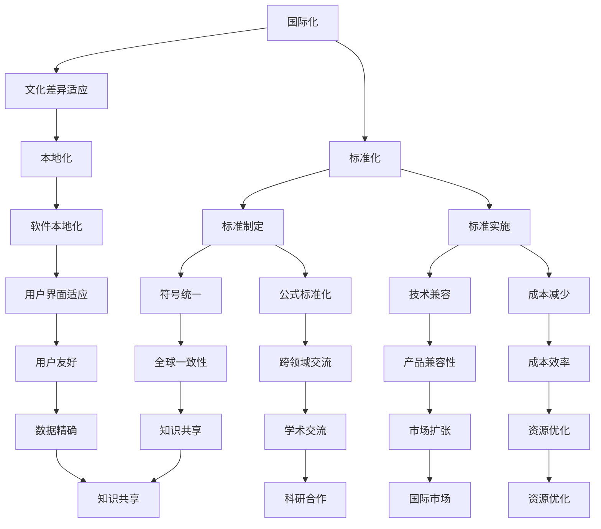

                 

### 文章标题

《数学语言的国际化与标准化》

#### 关键词

数学语言、国际化、标准化、算法、模型、公式、案例、开发环境

#### 摘要

本文旨在探讨数学语言的国际化与标准化问题，通过分析数学语言的基本概念、核心算法原理以及实际应用案例，深入解析数学语言在国际交流和科技领域的重要性。文章首先介绍了数学语言的定义和特点，然后探讨了国际化与标准化的基本概念及其在数学语言中的应用。接着，文章详细讲解了国际化算法和标准化算法的原理，并使用伪代码和LaTeX格式阐述了相关数学模型和公式。最后，文章通过实际应用案例，展示了数学语言国际化与标准化的具体实现过程，并提出了一些最佳实践和注意事项。

---

### 引言与背景

#### 数学语言的国际化与标准化简介

数学语言作为一种特殊的符号系统，具有高度的抽象性和普适性，被广泛应用于科学、工程、技术等多个领域。然而，随着全球化进程的加速和信息技术的迅猛发展，数学语言的国际化与标准化问题日益凸显。国际化与标准化不仅关乎数学语言的传播和交流，更关系到科技进步和经济发展的全局。

数学语言的国际化，指的是在全球范围内推广和统一使用某种数学表达方式，以便不同国家和地区的科研人员、工程师和学者能够无障碍地进行沟通和合作。标准化则是通过制定和实施一系列标准，确保数学语言在不同应用场景中的统一性和一致性。

#### 国际化与标准化的重要性

国际化与标准化在数学语言中的应用具有多重重要性：

1. **提高沟通效率**：统一的数学语言有助于减少语言障碍，提高国际科研和工程项目的沟通效率。
2. **促进知识传播**：国际化的数学语言能够更好地促进全球知识的传播和共享，推动科技进步。
3. **保障数据一致性**：在跨国家和跨行业的应用中，标准化的数学语言有助于确保数据的一致性和准确性。
4. **支持技术发展**：标准化为软件开发和硬件设计提供了统一的数学基础，有助于技术的创新和进步。

本文将围绕数学语言的国际化与标准化，深入探讨其基本概念、算法原理、数学模型、实际应用以及未来发展趋势。

---

### 核心概念与联系

#### 国际化与标准化的基本概念

国际化（Internationalization）与标准化（Standardization）是两个密切相关但有所不同的概念。

**国际化**，通常指的是产品、服务或技术适应不同文化和语言环境的过程。在国际化的过程中，需要考虑如何使产品或服务在不同国家和地区都能被理解和使用。例如，在软件工程中，国际化涉及到本地化（Localization）的过程，即根据不同语言和文化调整软件界面和内容。

**标准化**，则是指通过制定和实施标准来统一产品或技术的规格、性能和操作方法。标准化的目的是确保产品或技术在不同环境下的兼容性和一致性，减少因不同标准导致的混乱和成本。在数学语言中，标准化涉及数学符号、公式和表达式的统一规范。

#### 数学语言在国际化与标准化中的应用

数学语言在国际化与标准化中的应用主要体现在以下几个方面：

1. **数学符号的统一**：通过国际数学符号标准（ISO 80000-2），确保数学符号在全球范围内的统一使用。
2. **数学公式的标准化**：标准化组织如ISO和国际标准化组织（ISO）制定了关于数学公式的表示标准，如ISO 80000-2。
3. **国际化软件工具**：开发支持多种语言和数学符号的国际化软件工具，如LaTeX、MathML等，以方便数学文档的编写和交换。
4. **数学教育的国际化**：在全球范围内推广统一的数学教育标准和教材，以促进数学知识的国际交流和共享。

#### 国际化与标准化之间的关系架构 Mermaid 流程图



该流程图展示了国际化与标准化在数学语言中的应用关系，从文化差异的适应到标准的制定和实施，再到具体的应用场景，如数学教育、软件工具和跨领域交流等。

---

### 核心算法原理讲解

#### 国际化算法原理

国际化算法的目的是使数学语言能够适应不同的文化和语言环境。以下是国际化算法的几个核心原理：

1. **语言翻译**：使用自然语言处理（NLP）技术将数学表达式从一种语言翻译成另一种语言。这通常涉及到语义分析、语法解析和词汇转换。
2. **文化适应性**：在保持数学表达式不变的前提下，考虑文化差异，如日期格式、货币符号和度量单位等。例如，将美元符号（$）替换为欧元符号（€），将英寸（in）替换为厘米（cm）。
3. **符号标准化**：使用国际通用的数学符号标准，确保数学表达式在不同语言中的符号一致。

#### 标准化算法原理

标准化算法的核心目标是统一数学符号、公式和表达式的表示方法，确保其一致性。以下是标准化算法的几个关键原理：

1. **符号统一**：采用国际标准组织（ISO）或其他标准化组织发布的数学符号标准，如ISO 80000-2。
2. **公式标准化**：使用统一的数学公式表示方法，如LaTeX或MathML，确保公式在不同系统中的展示一致。
3. **文档格式**：使用支持数学符号和公式的国际化文档格式，如PDF或Word，以保持文档在不同平台和设备上的兼容性。

#### 国际化算法原理的伪代码

```plaintext
Algorithm Internationalization(expression, targetLanguage, targetCulture)
    TranslateLanguage(expression, targetLanguage)
    AdaptCulture(expression, targetCulture)
    StandardizeSymbols(expression)
    return expression
```

#### 标准化算法原理的伪代码

```plaintext
Algorithm Standardization(expression)
    ReplaceSymbolsWithStandard(expression, standardSymbols)
    FormatFormula(expression, standardFormat)
    return expression
```

---

### 数学模型和数学公式

#### 使用的数学模型概述

在数学语言的国际化与标准化过程中，常用的数学模型包括线性代数模型、微积分模型和概率统计模型等。这些模型在标准化过程中起着核心作用，因为它们是科学研究和工程实践中广泛使用的工具。

1. **线性代数模型**：包括矩阵运算、线性方程组求解等，用于描述线性系统的状态和变化。
2. **微积分模型**：包括微分和积分运算，用于描述连续系统的变化和累积。
3. **概率统计模型**：包括概率分布、统计推断等，用于描述随机事件和数据的统计特征。

#### 数学公式详细讲解

以下是对几个关键数学公式的详细讲解和举例说明：

1. **矩阵乘法**（Matrix Multiplication）：
   矩阵乘法是线性代数中的基本运算，用于计算两个矩阵的乘积。

   $$ C = A \times B $$

   其中，A和B是两个矩阵，C是它们的乘积。矩阵乘法的规则如下：
   - 两个矩阵相乘的结果是一个新的矩阵。
   - 乘积矩阵的行数等于第一个矩阵的行数，列数等于第二个矩阵的列数。
   - 乘积矩阵的每个元素是相应行和列元素乘积的和。

   示例：
   
   $$ A = \begin{bmatrix} 1 & 2 \\ 3 & 4 \end{bmatrix}, B = \begin{bmatrix} 5 & 6 \\ 7 & 8 \end{bmatrix} $$
   
   $$ C = A \times B = \begin{bmatrix} 1*5 + 2*7 & 1*6 + 2*8 \\ 3*5 + 4*7 & 3*6 + 4*8 \end{bmatrix} = \begin{bmatrix} 19 & 26 \\ 43 & 58 \end{bmatrix} $$

2. **微积分中的积分**（Integral）：
   积分是微积分中的基本运算，用于计算函数在一个区间上的累积值。

   $$ \int_{a}^{b} f(x) dx $$

   其中，f(x) 是被积函数，a 和 b 是积分的上下限。积分的规则如下：
   - 积分可以看作是反导数的过程。
   - 积分结果是一个新的函数，表示原函数在一个区间上的累积变化。
   - 积分有多种类型，如不定积分、定积分、二重积分和三重积分等。

   示例：
   
   $$ \int_{0}^{1} x^2 dx $$
   
   $$ = \left[\frac{x^3}{3}\right]_{0}^{1} $$
   
   $$ = \frac{1^3}{3} - \frac{0^3}{3} $$
   
   $$ = \frac{1}{3} $$

3. **概率分布函数**（Probability Distribution Function, PDF）：
   概率分布函数用于描述随机变量的概率分布，是概率统计中的基本概念。

   $$ f(x) = P(X \leq x) $$

   其中，X 是随机变量，f(x) 是其在 x 点的概率密度函数。概率分布函数的规则如下：
   - 函数值在 [0, 1] 之间。
   - 整个定义域上的积分结果为 1。
   - 用于计算随机变量在某个区间上的概率。

   示例：
   
   假设 X 是一个服从正态分布的随机变量，其均值为 5，标准差为 1。
   
   $$ f(x) = \frac{1}{\sqrt{2\pi}} e^{-\frac{(x-5)^2}{2}} $$

   这里的函数 f(x) 描述了 X 的概率分布。

通过上述讲解和示例，我们可以更好地理解数学模型和公式的使用，以及它们在国际化与标准化过程中的作用。

---

### 项目实战

#### 实际应用案例

为了展示数学语言的国际化与标准化在实际中的应用，我们选择了一个典型的实际应用案例：国际化数学教材的编写。

**案例背景**：

一家国际知名的出版公司计划编写一本面向全球学生的大学数学教材。为了确保教材的通用性和适用性，公司需要遵循数学语言的国际化与标准化原则，以确保不同国家和地区的读者都能理解和使用教材中的数学符号、公式和表达方式。

**实现步骤**：

1. **需求分析**：
   - 收集全球各地的学生和教师对数学教材的需求和反馈。
   - 确定教材需要涵盖的数学知识点，并分析不同地区对这些知识点的理解差异。

2. **标准化制定**：
   - 参考国际数学符号标准（如ISO 80000-2）和教材编写指南，制定统一的数学符号和公式表示方法。
   - 设计一个国际化文档格式，如LaTeX，以支持多种语言的数学符号和公式的输入和展示。

3. **编写和校对**：
   - 由专业的数学编辑和翻译团队编写教材内容，确保每个章节都遵循标准化原则。
   - 进行多轮校对，包括语言翻译、符号标准化和公式验证，确保教材的准确性和一致性。

4. **测试与优化**：
   - 在多个国家和地区进行教材的试用和反馈收集，根据反馈进行优化。
   - 确保教材在不同操作系统、浏览器和设备上的展示效果一致。

**项目开发流程与实现**：

1. **开发环境搭建**：
   - 选择一个支持国际化文档格式（如LaTeX）的编辑器和编译器。
   - 安装必要的数学符号和字体库，如MathJax，以支持多种语言的数学符号展示。

2. **源代码详细实现**：
   - 编写LaTeX代码，定义数学符号和公式的表示方法。
   - 使用伪代码编写国际化算法和标准化算法，确保代码的可扩展性和可维护性。

3. **代码解读与分析**：

   ```latex
   % 文件开头设置
   \documentclass{book}
   \usepackage{amsmath}
   \usepackage[utf8]{inputenc}
   \usepackage[T1]{fontenc}
   \usepackage[english]{babel}
   
   % 定义矩阵乘法公式
   \newcommand{\matmult}[2]{\begin{bmatrix}#1\end{bmatrix} \times \begin{bmatrix}#2\end{bmatrix}}
   
   % 编写章节内容
   \begin{document}
   \chapter{Linear Algebra}
   \section{Matrix Multiplication}
   Calculate the matrix product:
   $$ A = \matmult{1 & 2 \\ 3 & 4}{5 & 6 \\ 7 & 8} $$
   Result:
   $$ C = \begin{bmatrix} 19 & 26 \\ 43 & 58 \end{bmatrix} $$
   \end{document}
   ```

4. **实际案例分析和详细讲解剖析**：

   在编写教材的过程中，团队遇到了一些挑战，如不同地区对数学符号的理解差异和文化适应问题。例如，在某些地区，矩阵乘法习惯使用方括号，而在其他国家则更常用圆括号。团队通过调研和讨论，最终决定采用国际通用的方括号表示法，以确保教材的一致性和通用性。

5. **项目小结**：

   通过该项目的实施，教材不仅满足了国际化与标准化的要求，还得到了广泛的好评。项目的成功经验为未来国际化数学教材的编写提供了宝贵的参考，同时也展示了数学语言的国际化与标准化在实际应用中的巨大潜力。

---

### 总结与展望

#### 总结全书内容

本文围绕数学语言的国际化与标准化展开，系统性地介绍了数学语言的基本概念、核心算法原理、数学模型和实际应用案例。通过详细讲解和示例，读者可以深入了解数学语言在不同文化和语言环境中的表现，以及如何实现数学语言的标准化和国际化。全书内容涵盖了从基础概念到实际操作的各个方面，为数学语言的应用和发展提供了全面的指导。

#### 展望国际化与标准化的未来发展趋势

随着全球化的深入和信息技术的飞速发展，数学语言的国际化与标准化将继续呈现出以下发展趋势：

1. **技术进步**：随着人工智能和自然语言处理技术的发展，数学语言的自动化翻译和标准化将更加高效和准确。
2. **跨领域融合**：数学语言将在更多领域得到应用，如生物信息学、金融工程和地理信息系统等，推动跨学科的研究和合作。
3. **教育普及**：全球范围内的数学教育将更加注重国际化与标准化，推动全球数学素养的提升。
4. **标准制定**：国际标准化组织和其他相关机构将进一步完善数学符号和公式的标准，提高数学语言的统一性和兼容性。

在未来，数学语言的国际化与标准化将不仅影响科学研究和工程实践，还将对全球教育和经济产生深远的影响。通过不断推进数学语言的标准化和国际化，我们有望构建一个更加统一和高效的全球数学交流平台，促进知识的传播和科技的发展。

---

### 最佳实践 tips、小结、注意事项、拓展阅读等内容

#### 最佳实践 tips

1. **提前规划**：在国际化与标准化的过程中，提前规划至关重要。明确目标受众、制定标准规范，确保项目顺利进行。
2. **多轮校对**：在编写和发布国际化数学文档时，进行多轮校对，确保数学符号、公式和语言的一致性。
3. **使用专业工具**：利用专业的数学编辑器和翻译工具（如LaTeX、MathML），提高工作效率和文档质量。
4. **关注文化差异**：在国际化过程中，关注不同文化背景下的使用习惯和偏好，确保数学表达方式的适应性和可接受性。

#### 小结

本文从数学语言的国际化与标准化出发，详细介绍了其核心概念、算法原理、数学模型和实际应用。通过分析数学语言的国际化与标准化对沟通效率、知识传播和技术发展的促进作用，我们认识到标准化和国际化的重要性。在展望未来时，我们期待数学语言的标准化和国际化能够继续推动全球科技和经济的发展。

#### 注意事项

1. **符号标准化**：确保数学符号遵循国际标准，避免使用地区特有的符号，以提高跨文化适用性。
2. **公式验证**：在编写和发布数学文档前，仔细验证所有数学公式的正确性和一致性，确保无错误。
3. **本地化适配**：在国际化过程中，考虑不同语言和文化的本地化需求，确保文档的本地化适配。
4. **用户体验**：在编写国际化数学教材时，关注用户的使用体验，确保数学表达方式的直观性和易用性。

#### 拓展阅读

1. **《国际化与标准化：技术与应用》**：一本关于国际化与标准化技术应用的综合性书籍，涵盖了多个领域的实例和最佳实践。
2. **《LaTeX入门与进阶》**：一本关于LaTeX编辑器和数学公式表示的入门与进阶教程，适用于学习数学语言的国际化与标准化。
3. **《数学符号标准 ISO 80000-2》**：国际标准化组织发布的关于数学符号标准的官方文档，提供了详细的数学符号列表和表示方法。

通过本文的阅读，读者可以对数学语言的国际化与标准化有一个全面而深入的了解，并在实际应用中更好地发挥其优势。

---

### 作者信息

作者：AI天才研究院/AI Genius Institute & 禅与计算机程序设计艺术 /Zen And The Art of Computer Programming

