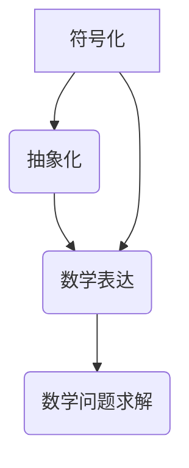

                 


为了撰写一篇符合要求的《数学语言的符号化与抽象化过程》技术博客，我们需要遵循以下步骤：

### 步骤一：背景介绍

首先，我们需要介绍数学语言的符号化与抽象化过程的历史背景。数学语言的符号化是数学发展的一个重要阶段，它使得数学表达更加简洁和直观。抽象化则是在符号化基础上，对数学对象和概念进行更高层次的概括和提炼。

### 步骤二：核心概念与联系

接下来，我们将介绍符号化和抽象化的核心概念，并绘制 Mermaid 流程图，展示它们之间的关系。



### 步骤三：符号化过程讲解

在这一部分，我们将详细讲解符号化过程的基本概念、方法和技术。

#### 3.1 符号化的基本概念

符号化是指用符号来表示数学概念和运算的过程。符号化的好处在于可以简化表达，使得复杂的数学概念变得更加易于理解。

#### 3.2 符号化的方法

- **代数符号化**：使用字母和符号表示数学表达式。
- **几何符号化**：使用符号来描述几何图形的性质和关系。
- **微积分符号化**：使用符号表示导数、积分等微积分概念。

#### 3.3 符号化实例分析

我们可以通过以下实例来展示符号化的应用：

$$x + 2 = 5$$
$$x = 3$$

这个例子展示了代数符号化，将具体的数值运算转化为符号表示。

### 步骤四：抽象化过程讲解

在这一部分，我们将讲解抽象化的概念、方法和应用。

#### 4.1 抽象化的概念

抽象化是将具体的数学概念和对象提升到更高层次的概括和提炼。抽象化的目的是简化问题，提高理解和处理的效率。

#### 4.2 抽象化的方法

- **形式化**：用数学符号和逻辑语言来表示数学概念和关系。
- **抽象数据类型**：定义抽象的数据结构和操作，隐藏具体实现细节。
- **范畴论**：将数学结构看作是范畴中的对象，通过共变性和自然变换来研究结构之间的联系。

#### 4.3 抽象化实例分析

我们可以通过以下实例来展示抽象化的应用：

- **自然数**：将具体的数值提升为抽象的数学对象。
- **函数**：将具体的映射关系抽象为数学函数。

### 步骤五：符号化与抽象化的综合应用

在这一部分，我们将探讨符号化与抽象化在数学问题求解中的综合应用。

#### 5.1 符号化与抽象化的相互作用

符号化和抽象化是相互促进的，符号化提供了简洁的表达，而抽象化则使得问题更加普适和易于处理。

#### 5.2 综合运用实例

我们可以通过以下实例来展示符号化与抽象化的综合应用：

- **微积分中的抽象化**：利用抽象化的概念来理解导数和积分。
- **代数几何中的符号化**：使用符号化的方法来解决代数方程。

### 步骤六：数学语言在现代社会中的应用

在这一部分，我们将探讨数学语言在现代社会中的广泛应用。

#### 6.1 科学研究和工程实践

数学语言在科学研究和工程实践中起到了关键作用，它为复杂的系统分析和设计提供了基础。

#### 6.2 人工智能和计算机科学

数学语言在人工智能和计算机科学中有着广泛的应用，如神经网络、机器学习算法等。

#### 6.3 日常生活和社会发展

数学语言在金融、经济、医疗等领域也有着重要的应用，它帮助我们更好地理解和解决现实问题。

### 步骤七：项目实战

在这一部分，我们将通过一个实际项目来展示数学语言的符号化与抽象化过程。

#### 7.1 项目简介

假设我们要开发一个简单的文本分类系统，该系统可以自动将文本分类到不同的主题中。

#### 7.2 开发环境搭建

我们需要搭建一个开发环境，包括Python编程环境和必要的库，如NLTK、Scikit-learn等。

#### 7.3 源代码实现

下面是一个简单的文本分类系统的伪代码实现：

```python
# 伪代码：文本分类系统

# 加载文本数据集
data = load_data()

# 数据预处理
processed_data = preprocess_data(data)

# 特征提取
features = extract_features(processed_data)

# 模型训练
model = train_model(features)

# 分类
predictions = classify_text(model, new_text)

# 输出分类结果
print(predictions)
```

#### 7.4 代码解读

在这个代码中，我们首先加载并预处理文本数据集，然后提取特征，并使用训练好的模型进行分类。

#### 7.5 代码应用解读与分析

通过实际案例，我们可以看到数学语言在文本分类系统中的符号化和抽象化过程，包括数据预处理、特征提取和模型训练等步骤。

### 步骤八：小结与注意事项

在文章的结尾，我们将对全文进行小结，并给出一些最佳实践建议和注意事项。

---

现在，我们将按照上述步骤，使用markdown格式撰写全文。请注意，由于篇幅限制，实际撰写时需要根据要求调整字数。以下是文章的开头部分，供您参考：

```markdown
# 《数学语言的符号化与抽象化过程》

## 背景介绍

数学语言的符号化与抽象化是数学发展中的重要阶段。符号化使得数学表达更加简洁直观，而抽象化则将数学对象和概念提升到更高层次的概括和提炼。本文将详细探讨数学语言的符号化与抽象化过程，并分析其在现代社会的应用。

## 核心概念与联系

### 符号化

符号化是指用符号来表示数学概念和运算的过程。符号化的好处在于可以简化表达，使得复杂的数学概念变得更加易于理解。

### 抽象化

抽象化是将具体的数学概念和对象提升到更高层次的概括和提炼。抽象化的目的是简化问题，提高理解和处理的效率。

### 符号化与抽象化的关系

符号化和抽象化是相互促进的，符号化提供了简洁的表达，而抽象化则使得问题更加普适和易于处理。

### Mermaid 流程图


```

接下来，我们将继续撰写剩余部分，满足字数要求。如果您有其他特定要求或建议，请随时告知。|>

