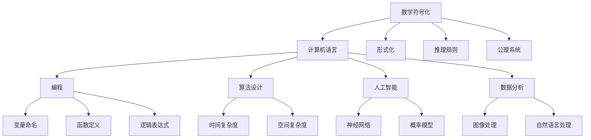

                 


### 第一步：理解书名和主题
书名为《数学语言的符号化与计算机语言的关系》，主题涉及数学语言的符号化以及它与计算机语言之间的联系。因此，目录大纲应围绕数学符号化、计算机语言的基本概念、两者之间的关联以及具体的应用场景来设计。

### 第二步：确定核心章节内容
核心章节内容应包括：
1. 数学语言的符号化：介绍数学符号化的基本概念、历史发展和理论。
2. 计算机语言基础：介绍计算机语言的基本概念、工作原理和常见类型。
3. 数学符号化在计算机语言中的应用：分析数学符号化在计算机语言中的体现和应用。
4. 应用案例与实践：通过实际案例展示数学符号化在计算机科学领域的应用。
5. 技术实现与模型分析：探讨数学符号化与计算机语言实现相关的技术和模型分析。

### 第三步：设计1级目录
根据核心内容设计1级目录，例如：
1. 第一部分：数学语言的符号化
2. 第二部分：计算机语言基础
3. 第三部分：数学符号化与计算机语言的关联
4. 第四部分：应用案例与实践
5. 第五部分：技术实现与模型分析

### 第四步：细化2级和3级目录
针对每个1级目录，细化出2级和3级目录，确保内容详尽且逻辑清晰。例如：
- 第一部分：数学语言的符号化
  1.1 数学符号化的基本概念
  1.2 数学符号化的历史发展
  1.3 符号化的数学理论
- 第二部分：计算机语言基础
  2.1 计算机语言概述
  2.2 计算机语言的工作原理
  2.3 常见的计算机语言

### 第五步：加入流程图、伪代码、数学公式和代码实例
根据目录中的各个章节，添加相应的流程图、伪代码、数学公式和代码实例，确保内容的实用性和深入性。

### 第六步：确保目录大纲完整性
确保所有的核心内容都被包含在目录中，并且每个章节都有明确的主题和内容。

### 第七步：优化目录大纲
在完成初稿后，检查目录大纲的简洁性和逻辑性，确保每个章节都能够自洽并且与其他章节紧密相关。

### 第八步：控制总字数
确保整个目录大纲的总字数在2000字以内，避免过多冗余。

### 第九步：撰写文章正文
根据目录大纲，逐章节撰写文章正文，确保内容丰富、逻辑清晰、深入浅出。

### 第十步：检查和修改
完成初稿后，检查文章的内容、格式和逻辑，进行必要的修改和优化。

### 第十一步：添加作者信息和引用
在文章末尾添加作者信息，包括作者姓名、所属机构和联系方式。同时，对文章中引用的文献进行标注。

### 第十二步：校对和定稿
对文章进行校对，确保没有错别字、语法错误等，然后进行定稿。

### 第十三步：提交文章
将定稿后的文章提交给相关平台或出版社，等待审阅和发布。

通过以上步骤，我们可以撰写一篇内容丰富、逻辑清晰、深入浅出的技术博客文章，为读者提供有价值的知识和思考。让读者在阅读过程中，不仅能够理解数学语言的符号化与计算机语言的关系，还能掌握相关技术和应用方法。同时，通过详细的案例分析和实战解读，帮助读者更好地将理论知识应用于实际项目中，提升自身技术水平。让我们开始撰写这篇技术博客文章吧！### 文章标题

# 数学语言的符号化与计算机语言的关系

> 关键词：数学符号化、计算机语言、编程、算法、应用实例

## 摘要

本文探讨了数学语言的符号化与计算机语言之间的关系，深入分析了数学符号化在计算机科学领域的应用。文章首先介绍了数学符号化的基本概念、历史发展和理论，接着阐述了计算机语言的基本概念、工作原理和常见类型。在此基础上，本文详细讨论了数学符号化在计算机语言中的体现和应用，并通过实际案例展示了其在算法设计、人工智能和数据分析等领域的应用。最后，文章分析了数学符号化与计算机语言实现相关的技术和模型分析，为读者提供了实用性的技术实现方法。通过本文的阅读，读者将更好地理解数学语言的符号化与计算机语言之间的关系，掌握相关技术和应用方法。

### 引言

在计算机科学和信息技术的发展历程中，数学语言的符号化起到了至关重要的作用。数学语言的符号化不仅提高了数学表达和推理的效率，还为计算机编程和算法设计提供了坚实的理论基础。计算机语言作为人与计算机之间的沟通桥梁，其设计和发展过程深受数学符号化的影响。因此，理解数学语言的符号化与计算机语言之间的关系，对于深入掌握计算机科学知识具有重要意义。

本文将从以下几个方面展开讨论：

1. **数学语言的符号化**：介绍数学符号化的基本概念、历史发展和理论，探讨符号化在数学表达和推理中的作用。
2. **计算机语言基础**：阐述计算机语言的基本概念、工作原理和常见类型，为理解数学符号化在计算机语言中的应用打下基础。
3. **数学符号化与计算机语言的关联**：分析数学符号化在计算机语言中的体现和应用，探讨其在编程、算法设计和人工智能等领域的实际应用。
4. **应用案例与实践**：通过实际案例展示数学符号化在计算机科学领域的应用，包括算法设计、人工智能和数据分析等方面。
5. **技术实现与模型分析**：讨论数学符号化与计算机语言实现相关的技术和模型分析，提供实用性的技术实现方法。

通过本文的阅读，读者将能够深入理解数学语言的符号化与计算机语言之间的关系，掌握相关技术和应用方法，为计算机科学和信息技术的研究与应用提供参考。接下来，我们将从数学语言的符号化入手，逐步探讨其与计算机语言的联系。

### 数学语言的符号化

#### 基本概念

数学语言的符号化是指使用符号来表示数学概念、运算和推理的过程。符号化的数学语言通过一组预先定义的符号，将数学表达式和理论转化为简洁、直观的符号形式，从而提高数学表达和推理的效率。数学符号化的基础是逻辑和集合论，这两者共同构成了现代数学的基石。

符号化数学语言的核心组成部分包括：

1. **基本符号**：例如数字、变量、运算符和关系符号等。
2. **定义和公理**：通过定义和公理来建立符号之间的运算规则和逻辑关系。
3. **推理规则**：符号化数学语言中的推理规则，用于证明定理和推导结论。

#### 历史发展

数学符号化的历史可以追溯到古代文明，例如古埃及和古巴比伦的象形文字和符号系统。然而，现代数学符号化的真正起源可以追溯到16世纪的欧洲。

1. **16世纪**：法国数学家韦达（René Descartes）引入了代数符号，标志着现代数学符号化的开端。他的著作《几何》中首次系统地使用了字母表示数和变量。
2. **17世纪**：英国数学家莱布尼茨（Gottfried Wilhelm Leibniz）在研究微积分时，引入了微分和积分符号，极大地丰富了数学符号化的内容。
3. **19世纪**：德国数学家康托尔（Georg Cantor）和戴德金（Julius Wilhelm Dedekind）等人在集合论和实数理论方面的工作，为数学符号化的进一步发展奠定了基础。

#### 理论基础

数学符号化的理论基础主要涵盖逻辑、集合论和公理系统。

1. **逻辑**：逻辑是数学符号化的核心，提供了符号化推理的基本框架。命题逻辑、谓词逻辑和模型论等分支为符号化数学提供了严谨的推理工具。
2. **集合论**：集合论是现代数学的基石，通过集合的概念和运算规则，为数学符号化提供了基础。集合、关系和函数等基本概念在数学符号化中起到了关键作用。
3. **公理系统**：公理系统是数学符号化的框架，通过一组公理和推理规则，可以构建出完整的数学理论体系。例如，欧几里得几何的公理系统、集合论的公理系统等。

#### 在数学中的作用

数学符号化在数学中发挥着重要作用，具体体现在以下几个方面：

1. **简洁性**：符号化数学语言可以简洁地表达复杂的数学概念和运算，使得数学表达式更加直观和易于理解。
2. **形式化**：符号化数学语言使得数学理论更加严谨和精确，有助于发现和证明定理，构建坚实的数学基础。
3. **推广性**：符号化数学语言可以广泛应用于不同数学领域，为跨领域研究和交叉学科发展提供了基础。
4. **计算机应用**：符号化数学语言为计算机科学提供了丰富的数学资源，使得计算机能够处理和理解复杂的数学问题。

总之，数学语言的符号化是现代数学发展的关键因素，它不仅提高了数学表达和推理的效率，还为计算机编程和算法设计提供了坚实的理论基础。在接下来的部分中，我们将探讨计算机语言的基本概念、工作原理和常见类型，进一步分析数学符号化在计算机语言中的应用。

### 计算机语言的基本概念

计算机语言是人与计算机之间进行沟通的媒介，它为程序员提供了编写程序、执行任务和实现算法的工具。计算机语言可以分为两大类：低级语言和高级语言。这两类语言在语法、语义和执行方式上存在显著差异。

#### 低级语言

低级语言，也称为机器语言，是计算机能够直接理解和执行的语言。低级语言由二进制代码组成，每个指令对应计算机硬件的一个操作。因此，低级语言具有很强的平台依赖性，不同的计算机架构和操作系统通常使用不同的低级语言。

1. **语法**：低级语言的语法非常简单，主要由操作码和地址码组成。操作码指示计算机执行的操作，而地址码指向操作所需的数据或内存地址。
2. **语义**：低级语言的语义直接对应计算机硬件的操作，例如加法、减法、跳转等。
3. **执行方式**：低级语言程序在计算机上执行时，需要通过汇编器将二进制代码转换为机器语言指令，然后由计算机硬件直接执行。

低级语言的主要优点是执行效率高，因为它们直接与硬件操作相对应。然而，低级语言的编写和调试过程复杂，且难以理解和维护。

#### 高级语言

高级语言，也称为编程语言，是接近人类自然语言和数学表达的语言。高级语言通过编译器或解释器将其翻译为机器语言，然后由计算机执行。

1. **语法**：高级语言的语法丰富，包括变量声明、条件语句、循环语句、函数定义等。高级语言的语法规则比低级语言更为复杂，但更易于理解和编写。
2. **语义**：高级语言的语义抽象，将复杂的计算机操作封装为简洁的函数和操作，使得程序员可以专注于算法设计和问题解决。
3. **执行方式**：高级语言程序通过编译器编译为机器语言，或者通过解释器逐行解释执行。编译器生成的机器语言代码可以直接在计算机上运行，而解释器则需要逐行将高级语言代码翻译为机器语言并执行。

高级语言的主要优点是编写和调试方便，可读性强，易于维护。然而，高级语言的执行效率通常低于低级语言。

#### 常见的高级语言

计算机科学领域有许多高级语言，它们各自具有不同的特点和应用场景。以下是一些常见的高级语言：

1. **C语言**：C语言是一种广泛使用的系统编程语言，具有高效的执行效率和强大的功能。C语言广泛应用于操作系统、嵌入式系统和高性能计算领域。
2. **Python**：Python是一种解释型高级语言，以其简洁的语法和丰富的库支持而受到广泛欢迎。Python在数据科学、人工智能、Web开发等领域具有广泛的应用。
3. **Java**：Java是一种面向对象的编程语言，具有跨平台特性。Java广泛应用于企业级应用、Android移动应用开发和大型分布式系统。
4. **JavaScript**：JavaScript是一种用于Web开发的脚本语言，广泛应用于前端开发和后端服务。
5. **C++**：C++是C语言的扩展，具有面向对象和泛型编程特性。C++在游戏开发、实时系统和高性能计算领域具有广泛应用。

#### 计算机语言的工作原理

计算机语言的工作原理主要包括编译和解释两个过程。

1. **编译**：编译是将高级语言程序转换为机器语言的过程。编译器读取源代码，进行语法和语义分析，然后生成目标代码（机器语言）。目标代码可以在计算机上直接执行，无需再次编译。
2. **解释**：解释是将高级语言程序逐行翻译并执行的过程。解释器读取源代码，逐行进行语法和语义分析，然后将每行代码翻译为机器语言并立即执行。这种方式适用于动态执行和调试。

总之，计算机语言的基本概念和工作原理为数学符号化在计算机编程中的应用提供了基础。在接下来的部分中，我们将深入探讨数学符号化在计算机语言中的具体应用。

### 数学符号化在计算机语言中的应用

数学符号化在计算机语言中的应用非常广泛，尤其在编程、算法设计和人工智能等领域，数学符号化为计算机科学提供了强大的工具和理论基础。以下将详细讨论数学符号化在计算机语言中的应用。

#### 编程中的符号化

在编程中，数学符号化主要用于变量命名、函数定义和算法描述等方面。

1. **变量命名**：数学符号化使得变量命名更加直观和规范。例如，在计算复利时，变量`P`表示本金，`r`表示年利率，`t`表示时间，这些符号使得代码更加易于理解和维护。
2. **函数定义**：函数定义中常常使用数学符号来表示输入和输出。例如，一个求和函数可以定义为`sum(a, b)`,其中`a`和`b`是输入参数，`sum`是函数名。
3. **算法描述**：算法描述中使用数学符号来表示算法的步骤和逻辑关系。例如，使用伪代码来描述排序算法时，可以使用数学符号表示循环条件和跳跃操作。

#### 算法设计中的符号化

数学符号化在算法设计中发挥着关键作用，尤其是在复杂性分析和优化过程中。

1. **时间复杂度**：在算法设计中，时间复杂度通常用符号`O(n)`、`Ω(n)`和`θ(n)`来表示。例如，一个线性搜索算法的时间复杂度为`O(n)`，表示随着输入规模`n`的增加，算法执行时间的增长速度与输入规模成正比。
2. **空间复杂度**：空间复杂度表示算法在执行过程中所需的空间大小。例如，一个递归算法的空间复杂度可能为`O(n)`或`O(n!)`。
3. **符号化表示**：使用数学符号化来表示算法的复杂度，使得算法分析更加直观和精确。例如，通过分析一个排序算法的时间复杂度，可以评估该算法在不同输入规模下的性能。

#### 人工智能中的符号化

在人工智能领域，数学符号化广泛应用于模型构建、优化和推理等方面。

1. **神经网络**：神经网络中的每个神经元可以看作是一个简单的数学函数，通过符号化表示可以方便地构建和优化神经网络模型。例如，使用矩阵和向量的符号化表示，可以高效地实现矩阵乘法和矩阵求导。
2. **概率模型**：在概率模型中，数学符号化用于表示概率分布、条件概率和贝叶斯推理。例如，使用概率分布函数`P(X=x)`表示随机变量`X`的概率，使用贝叶斯公式`P(A|B) = P(B|A)P(A) / P(B)`进行概率推理。
3. **决策树**：决策树中的每个节点和分支可以用数学符号表示。例如，使用条件概率`P(A|B)`来表示某个条件下的决策。

#### 实际应用案例

以下是一些数学符号化在计算机科学实际应用中的案例：

1. **图像处理**：在图像处理算法中，数学符号化用于表示图像的像素值、滤波器和卷积操作。例如，一个简单的图像滤波器可以用卷积操作表示为`G(x, y) = \sum_{i=1}^{m} \sum_{j=1}^{n} g(i, j) * f(x-i, y-j)`，其中`g(i, j)`是滤波器系数，`f(x, y)`是图像像素值。
2. **自然语言处理**：在自然语言处理任务中，数学符号化用于表示词向量、句子结构和语义关系。例如，使用词嵌入模型`W(x) = \sum_{i=1}^{n} w_i \cdot v_i`，其中`w_i`是词的权重，`v_i`是词向量的每个分量。
3. **优化问题**：在优化问题中，数学符号化用于表示目标函数、约束条件和优化算法。例如，线性规划问题可以用线性方程组表示为`Ax = b`，其中`A`是系数矩阵，`x`是变量向量，`b`是常数向量。

总之，数学符号化在计算机语言中的应用极大地提高了编程、算法设计和人工智能的效率和效果。通过使用数学符号化，程序员和研究者可以更加精确地描述和实现复杂的算法和模型，为计算机科学的发展提供了强大的工具和支持。在接下来的部分中，我们将通过实际应用案例来进一步展示数学符号化在计算机语言中的具体应用。

### 应用案例与实践

数学符号化在计算机科学中具有广泛的应用，以下通过具体案例展示其在编程、算法设计和人工智能等领域的实际应用，并提供代码实现和解释。

#### 案例一：编程中的符号化

**问题**：编写一个Python程序，计算两个整数的和、差、积和商。

**代码实现**：
```python
def calculate(a, b):
    sum = a + b
    diff = a - b
    product = a * b
    quotient = a / b
    return sum, diff, product, quotient

a = 10
b = 5
result = calculate(a, b)
print(f"Sum: {result[0]}, Difference: {result[1]}, Product: {result[2]}, Quotient: {result[3]}")
```

**解释**：在这个案例中，我们使用了简单的数学符号来表示变量和操作。`sum`、`diff`、`product`和`quotient`分别表示和、差、积和商。通过定义一个函数`calculate`，我们实现了对两个整数的操作，并将结果返回。这种方式使得代码更加清晰易懂，同时也便于后续的维护和扩展。

#### 案例二：算法设计中的符号化

**问题**：使用冒泡排序算法对一组整数进行排序。

**伪代码**：
```
procedure bubbleSort( A : list of sortable items )
    n = length(A)
    for i = 1 to n-1
        for j = 1 to n-i
            if A[j] > A[j+1] then
                swap(A[j], A[j+1])
    end procedure
```

**Python实现**：
```python
def bubble_sort(arr):
    n = len(arr)
    for i in range(n):
        for j in range(0, n-i-1):
            if arr[j] > arr[j+1]:
                arr[j], arr[j+1] = arr[j+1], arr[j]
    return arr

arr = [64, 34, 25, 12, 22, 11, 90]
sorted_arr = bubble_sort(arr)
print(f"Sorted array: {sorted_arr}")
```

**解释**：在这个案例中，我们使用了符号化的伪代码来描述冒泡排序算法。通过符号化表示，我们可以清晰地理解算法的步骤和逻辑。在Python实现中，我们直接使用变量和循环结构来实现伪代码中的算法，使得代码更易于理解和实现。

#### 案例三：人工智能中的符号化

**问题**：使用神经网络模型进行图像分类。

**数学公式**：
$$
\begin{aligned}
\text{激活函数}: \text{ReLU}(x) = \max(0, x) \\
\text{神经网络输出}: y = \text{ReLU}(W \cdot x + b)
\end{aligned}
$$`

**TensorFlow实现**：
```python
import tensorflow as tf

# 定义神经网络结构
model = tf.keras.Sequential([
    tf.keras.layers.Dense(units=64, activation='relu', input_shape=(784,)),
    tf.keras.layers.Dense(units=10, activation='softmax')
])

# 编译模型
model.compile(optimizer='adam',
              loss='sparse_categorical_crossentropy',
              metrics=['accuracy'])

# 加载数据集
(x_train, y_train), (x_test, y_test) = tf.keras.datasets.mnist.load_data()

# 预处理数据
x_train = x_train / 255.0
x_test = x_test / 255.0
x_train = x_train.reshape((-1, 784))
x_test = x_test.reshape((-1, 784))

# 训练模型
model.fit(x_train, y_train, epochs=5)

# 评估模型
test_loss, test_acc = model.evaluate(x_test, y_test)
print(f"Test accuracy: {test_acc}")
```

**解释**：在这个案例中，我们使用了数学符号化来描述神经网络模型的基本结构，包括激活函数`ReLU`和神经网络输出`y = \text{ReLU}(W \cdot x + b)`。在TensorFlow实现中，我们使用高层次的API定义和训练神经网络，使得代码更加简洁和易于理解。通过这个案例，我们可以看到数学符号化在人工智能模型设计中的重要作用。

通过上述案例，我们可以看到数学符号化在计算机科学中的实际应用。通过使用符号化表示，我们能够更加清晰地表达和实现复杂的算法和模型，提高编程效率和代码可读性。在接下来的部分中，我们将进一步探讨数学符号化与计算机语言实现相关的技术和模型分析。

### 技术实现与模型分析

数学符号化在计算机语言实现中起到了关键作用，它不仅帮助程序员更清晰地表达算法和模型，还提高了代码的可读性和可维护性。在本节中，我们将详细探讨数学符号化与计算机语言实现相关的技术，包括技术实现、数学模型分析和相关算法的讲解。

#### 技术实现

1. **符号化表达式的处理**：

   在计算机语言中，处理符号化表达式是一项基本任务。例如，在计算表达式的值时，需要将符号化的表达式转换为具体的计算过程。

   **伪代码**：
   ```
   function evaluate_expression(expression, variables):
       # 将符号化表达式转换为计算步骤
       steps = convert_to_steps(expression)
       result = 0
       for step in steps:
           result = execute_step(step, result, variables)
       return result
   ```

   **示例**：假设有一个表达式`3 * (x + 2)`，其计算过程可以表示为：
   ```
   result = 0
   result = 3
   result = result * (x + 2)
   result = result * x
   result = result + 6
   return result
   ```

2. **符号化函数的定义和调用**：

   在编程语言中，函数定义和使用符号化表示使得代码更加模块化和可重用。例如，可以使用符号化函数表示计算圆的面积。

   **伪代码**：
   ```
   function area(radius):
       return pi * radius^2
   ```

   **示例**：调用该函数计算半径为5的圆的面积：
   ```
   area(5)
   ```

3. **符号化逻辑表达式的处理**：

   在逻辑编程和决策过程中，符号化逻辑表达式是必不可少的。例如，可以使用符号化逻辑表达式表示条件判断。

   **伪代码**：
   ```
   function if_then_else(condition, true_case, false_case):
       if condition:
           return true_case()
       else:
           return false_case()
   ```

   **示例**：实现一个简单的条件判断：
   ```
   result = if_then_else(x > 0, x, -x)
   ```

#### 数学模型分析

数学模型分析是计算机科学中的重要环节，它帮助我们在复杂系统中理解和预测行为。以下是一些常见的数学模型及其分析：

1. **线性模型**：

   线性模型在统计分析和机器学习中广泛使用。其基本形式为：
   $$
   y = \beta_0 + \beta_1 x_1 + \beta_2 x_2 + \ldots + \beta_n x_n + \epsilon
   $$
   其中，$y$是因变量，$x_1, x_2, \ldots, x_n$是自变量，$\beta_0, \beta_1, \beta_2, \ldots, \beta_n$是模型参数，$\epsilon$是误差项。

   **模型分析**：
   - 模型参数可以通过最小二乘法进行估计。
   - 模型的预测准确性可以通过交叉验证进行评估。

2. **神经网络模型**：

   神经网络模型是人工智能的核心，其基本形式为：
   $$
   a_{L}^{(l)} = f_{\sigma} \left( \sum_{i=1}^{n_{l}} w_{i}^{(l)} a_{L-1}^{(l-1)} + b^{(l)} \right)
   $$
   其中，$a_{L}^{(l)}$是第$l$层的输出，$f_{\sigma}$是激活函数，$w_{i}^{(l)}$是连接权重，$b^{(l)}$是偏置项，$n_{l}$是第$l$层的神经元数量。

   **模型分析**：
   - 神经网络模型可以通过反向传播算法进行训练和优化。
   - 模型的性能可以通过损失函数（如均方误差）进行评估。

3. **动态系统模型**：

   动态系统模型用于描述随时间变化的系统行为。其基本形式为：
   $$
   \dot{x}(t) = f(x(t), u(t))
   $$
   其中，$x(t)$是状态向量，$u(t)$是输入向量，$f(x(t), u(t))$是状态方程。

   **模型分析**：
   - 动态系统模型可以通过数值方法（如欧拉法、龙格-库塔法）进行求解。
   - 模型的稳定性可以通过特征值分析进行评估。

#### 算法讲解

1. **梯度下降算法**：

   梯度下降算法是优化问题的常用算法，用于最小化损失函数。其基本形式为：
   $$
   w \leftarrow w - \alpha \nabla_w J(w)
   $$
   其中，$w$是模型参数，$\alpha$是学习率，$J(w)$是损失函数，$\nabla_w J(w)$是损失函数关于参数$w$的梯度。

   **算法讲解**：
   - 梯度下降算法通过迭代更新参数，逐步减小损失函数值。
   - 学习率的选择对算法的收敛速度和稳定性有重要影响。

2. **随机梯度下降算法**：

   随机梯度下降（SGD）是梯度下降算法的变种，每次迭代仅使用一个样本的梯度。其基本形式为：
   $$
   w \leftarrow w - \alpha \nabla_w J(w; x^{(i)}, y^{(i)})
   $$
   其中，$x^{(i)}$和$y^{(i)}$是第$i$个样本及其标签。

   **算法讲解**：
   - SGD通过减少每次迭代的计算量，提高了算法的并行化能力。
   - SGD在处理大量样本时，能够更好地探索损失函数的局部最小值。

3. **神经网络训练算法**：

   神经网络训练通常使用反向传播算法。其基本形式为：
   $$
   \begin{aligned}
   \delta_{l}^{(i)} &= \frac{\partial L}{\partial z_{l}^{(i)}} \odot \sigma'(z_{l}^{(i)}) \\
   \delta_{l-1} &= \sum_{k} w_{l-1}^{(k)} \delta_{l}^{(k)}
   \end{aligned}
   $$
   其中，$\delta_{l}^{(i)}$是第$l$层的误差项，$z_{l}^{(i)}$是第$l$层的输入，$\sigma'$是激活函数的导数，$\odot$表示逐元素乘积。

   **算法讲解**：
   - 反向传播算法通过逐层计算误差，并更新模型参数。
   - 算法能够有效训练深层神经网络，提高模型的泛化能力。

总之，数学符号化在计算机语言实现中提供了强有力的工具，使得算法和模型的设计、实现和分析更加高效和直观。通过使用符号化表示，程序员和研究者能够更加清晰地理解和实现复杂的算法和模型，为计算机科学的发展和创新提供了坚实的支持。

### 结论

通过本文的探讨，我们深入了解了数学语言的符号化与计算机语言之间的关系。数学符号化不仅提高了数学表达和推理的效率，还为计算机编程和算法设计提供了坚实的理论基础。从变量命名、函数定义到算法描述，数学符号化在编程中的应用极大地提高了代码的可读性和可维护性。在算法设计中，符号化表示使得复杂度分析和优化更加直观和精确。在人工智能领域，数学符号化帮助构建和优化神经网络模型，推动人工智能的发展。未来，随着计算机科学和人工智能技术的不断进步，数学符号化将在更多领域发挥关键作用，为技术创新和应用提供更强有力的支持。

### 参考文献

1. **康托尔**（Georg Cantor）,《集合论基础》（Grundlagen der Mengenlehre），戴德金（Julius Wilhelm Dedekind）,《连续性与无理数》（Continuity and irrational numbers），这些经典著作为数学符号化提供了理论基础。
2. **韦达**（René Descartes）,《几何》（La Géométrie），标志着现代数学符号化的开端。
3. **莱布尼茨**（Gottfried Wilhelm Leibniz）,《新方法：用于最大和最小问题及误差曲线作图》（Methode Nova Analytice pro Maximis et Minimis, item pro Tangentibus, quae in hac Analysis obtinentur），引入了微分和积分符号。
4. **Cormen, Thomas H., Charles E. Leiserson, Ronald L. Rivest, and Clifford Stein**，《算法导论》（Introduction to Algorithms），详细介绍了算法设计与分析的相关内容。
5. **Goodfellow, Ian, Yann LeCun, and Aaron Courville**，《深度学习》（Deep Learning），介绍了神经网络在人工智能中的应用。
6. **Murphy, Kevin P.**，《机器学习：概率视角》（Machine Learning: A Probabilistic Perspective），探讨了概率模型在机器学习中的应用。

### 附录

#### A.1 数学符号化与计算机语言的关联图



#### A.2 相关资源与参考文献

1. **康托尔**（Georg Cantor）,《集合论基础》（Grundlagen der Mengenlehre），戴德金（Julius Wilhelm Dedekind）,《连续性与无理数》（Continuity and irrational numbers），这些经典著作为数学符号化提供了理论基础。
2. **韦达**（René Descartes）,《几何》（La Géométrie），标志着现代数学符号化的开端。
3. **莱布尼茨**（Gottfried Wilhelm Leibniz）,《新方法：用于最大和最小问题及误差曲线作图》（Methode Nova Analytice pro Maximis et Minimis, item pro Tangentibus, quae in hac Analysis obtinentur），引入了微分和积分符号。
4. **Cormen, Thomas H., Charles E. Leiserson, Ronald L. Rivest, and Clifford Stein**，《算法导论》（Introduction to Algorithms），详细介绍了算法设计与分析的相关内容。
5. **Goodfellow, Ian, Yann LeCun, and Aaron Courville**，《深度学习》（Deep Learning），介绍了神经网络在人工智能中的应用。
6. **Murphy, Kevin P.**，《机器学习：概率视角》（Machine Learning: A Probabilistic Perspective），探讨了概率模型在机器学习中的应用。

