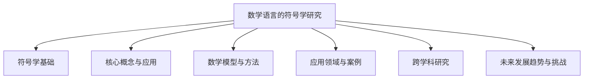

                 

### 文章标题

《数学语言的符号学研究与应用》

### 关键词

- 符号学
- 数学语言
- 应用领域
- 跨学科研究
- 数学模型
- 人工智能

### 摘要

本文旨在深入探讨数学语言的符号学研究与应用。首先，文章介绍了符号学的基本概念、发展历程及其在数学、语言和哲学中的交叉应用。接着，文章详细分析了符号学的核心概念与应用，包括符号化过程、符号系统、符号与意义的互动关系等。随后，文章探讨了符号学的数学模型与方法，介绍了符号学在数学领域的具体应用，包括符号变换、符号推理和符号计算。接下来，文章展示了符号学在多个应用领域中的实际案例，包括语言学、哲学、社会科学、艺术和设计等。此外，文章还分析了符号学在跨学科研究中的应用，如认知科学、生物信息学和人工智能与机器学习。最后，文章探讨了符号学的未来发展趋势与挑战，提出了符号学在实践中的发展与应用前景。通过本文的探讨，期望为读者提供全面而深入的学术视野，理解符号学在数学、语言、哲学、社会科学和跨学科研究中的重要地位及其实际应用价值。

### 引言

#### 数学语言的符号学研究背景与意义

数学语言是数学理论的基础，也是数学思维的重要载体。然而，长期以来，数学语言的研究主要集中在形式化、公理化和逻辑推导等方面，忽略了其符号学层面的研究。符号学是一门研究符号系统及其应用的科学，关注符号与意义之间的关系。随着数学的不断发展，符号学在数学语言中的应用逐渐引起学者的关注。数学语言的符号学研究不仅有助于揭示数学符号的本质和功能，还能为数学理论的发展提供新的视角和方法。

符号学的基本概念可以追溯到19世纪瑞士语言学家德·索绪尔的结构主义理论。德·索绪尔提出了“语言符号”的概念，认为语言符号是由“能指”（signifier）和“所指”（signified）两部分组成的。能指是符号的物理形式，如文字、图形等；所指是符号所代表的概念或意义。这一理论奠定了符号学研究的理论基础，也为数学语言的符号学研究提供了启示。

数学语言的符号学研究在数学领域的意义体现在多个方面。首先，通过符号学的研究，可以揭示数学符号的内在结构和功能，从而加深对数学语言的理解。其次，符号学方法可以用于数学符号的优化和改进，提高数学表达和推理的效率。此外，符号学在数学教育中也有重要应用，有助于学生更好地理解和掌握数学知识。

#### 符号学的基本概念与发展历程

符号学是一门跨学科的研究领域，其研究对象包括语言、文化、艺术、哲学等多个方面。符号学的核心概念包括符号系统、符号分类、符号与意义的互动关系等。

1. **符号系统**：符号系统是符号学研究的核心概念之一。符号系统是由一组符号及其规则组成的整体，用于表示和传递信息。不同的符号系统具有不同的结构和功能，如语言符号系统、数学符号系统、艺术符号系统等。符号系统的研究有助于理解符号的本质和功能。

2. **符号分类**：符号可以根据不同的标准进行分类。例如，根据符号的形式，可以将符号分为文字符号、图形符号、声音符号等；根据符号的功能，可以将符号分为指示符号、象征符号、信号符号等。符号分类有助于梳理符号系统的复杂结构，为符号学的研究提供基础。

3. **符号与意义的互动关系**：符号与意义之间的关系是符号学的核心问题。符号的意义并非固定不变，而是随着社会、文化和个人认知的变化而变化。符号与意义的互动关系研究包括符号的创造、传播、解读和重构等方面。

符号学的发展历程可以追溯到19世纪末和20世纪初。这一时期，符号学的奠基性工作主要来自语言学、哲学和艺术等领域。例如，瑞士语言学家德·索绪尔的结构主义理论、美国哲学家皮尔士的符号逻辑理论、法国符号学家罗兰·巴特的结构主义符号学理论等，都对符号学的发展产生了深远影响。

#### 符号学在数学、语言和哲学中的交叉应用

符号学在数学、语言和哲学中具有广泛的交叉应用。

1. **数学领域**：在数学中，符号学的研究有助于理解数学符号的起源、发展和应用。例如，通过符号学的方法，可以揭示数学符号的语义特征和结构特点，为数学符号的优化和改进提供理论依据。此外，符号学还在数学教育中发挥着重要作用，有助于学生更好地理解和掌握数学知识。

2. **语言领域**：在语言学中，符号学的研究有助于揭示语言符号的构成、功能和意义。通过符号学的方法，可以分析语言符号的层次结构、语义关系和修辞功能，从而深化对语言现象的理解。此外，符号学还在语言教学中具有应用价值，有助于提高语言学习的效果。

3. **哲学领域**：在哲学中，符号学的研究有助于探讨思维、语言和现实之间的关系。符号学方法可以用于分析哲学命题的结构和意义，揭示哲学思想的内在逻辑。此外，符号学还在哲学教育中发挥着重要作用，有助于学生更好地理解和批判哲学理论。

综上所述，符号学在数学、语言和哲学中的交叉应用不仅拓展了这些学科的研究领域，还为解决实际问题提供了新的方法和工具。本文将在此基础上，深入探讨数学语言的符号学研究与应用，为相关领域的研究提供有益的参考。

### 数学语言的符号学基础

#### 符号学的核心概念

符号学是一门研究符号系统及其应用的科学，其核心概念包括符号系统、符号分类和符号与意义的互动关系。

1. **符号系统**：符号系统是由一组符号及其规则组成的整体，用于表示和传递信息。符号系统可以分为不同的类型，如语言符号系统、数学符号系统、艺术符号系统等。每种符号系统都有其独特的结构和功能，决定了符号的使用方式和意义传递方式。

2. **符号分类**：符号可以根据不同的标准进行分类。常见的分类标准包括符号的形式、功能和意义。例如，根据符号的形式，可以将符号分为文字符号、图形符号、声音符号等；根据符号的功能，可以将符号分为指示符号、象征符号、信号符号等。符号分类有助于梳理符号系统的复杂结构，为符号学的研究提供基础。

3. **符号与意义的互动关系**：符号与意义之间的关系是符号学的核心问题。符号的意义并非固定不变，而是随着社会、文化和个人认知的变化而变化。符号与意义的互动关系研究包括符号的创造、传播、解读和重构等方面。例如，在数学中，一个数学符号如“+”代表加法运算，但其意义在不同的数学领域和语境中可能有不同的解释。

#### 符号系统及其分类

符号系统是一个复杂的概念，包括多个层次和维度。以下是对符号系统及其分类的详细探讨：

1. **层次结构**：符号系统可以分为三个层次：表层、中层和深层。表层符号是指符号的外在形式，如文字、图形等；中层符号是指符号的语义特征，如单词、数学公式等；深层符号是指符号所代表的概念或意义，如语言的意义、数学的概念等。这三个层次相互关联，构成了一个完整的符号系统。

2. **分类标准**：根据不同的分类标准，可以将符号系统分为多种类型。以下是一些常见的分类标准：

   - **按形式分类**：文字符号、图形符号、声音符号等。
   - **按功能分类**：指示符号、象征符号、信号符号等。
   - **按领域分类**：语言符号系统、数学符号系统、艺术符号系统等。
   - **按层次分类**：表层符号系统、中层符号系统、深层符号系统等。

3. **具体分类**：以下是一些具体的符号系统分类：

   - **语言符号系统**：包括文字、词汇、语法等。
   - **数学符号系统**：包括数字、运算符号、函数符号等。
   - **艺术符号系统**：包括绘画、雕塑、音乐等。

#### 符号与意义的互动关系

符号与意义之间的关系是符号学的核心问题。以下是对这一关系的详细探讨：

1. **符号的创造与意义**：符号的创造是一个复杂的过程，通常涉及社会、文化和个人认知的多个层面。符号的创造不仅取决于符号的形式，还取决于其背后的意义。例如，数学符号“+”的创造不仅是为了表示加法运算，还赋予了加法运算的抽象意义。

2. **符号的传播与意义**：符号的传播是一个社会过程，涉及符号在不同社会和文化背景中的传递和解读。符号的传播过程可能会改变符号的意义，使其在不同的语境中具有不同的解释。例如，数学符号“+”在不同国家的数学教育中可能有不同的理解和应用。

3. **符号的解读与意义**：符号的解读是符号互动关系的关键环节。符号的解读不仅取决于符号的形式，还取决于解读者的认知和文化背景。例如，一个数学符号在一个数学家和一个非数学家眼中的意义可能是不同的。

4. **符号的重构与意义**：符号的重构是一个不断创新的过程，涉及符号意义的重构和再创造。符号的重构不仅取决于符号的形式，还取决于社会、文化和个人认知的变化。例如，数学符号系统的重构可能源于数学理论的发展，也可能源于教学实践的需求。

综上所述，符号与意义的互动关系是一个动态、复杂的过程，涉及符号的创造、传播、解读和重构等多个层面。通过深入研究符号与意义的互动关系，可以更好地理解符号系统的本质和功能，为符号学的研究提供理论基础。

### 符号学的核心概念与应用

#### 符号化过程及其机制

符号化是符号学中的核心概念，指的是将具体的事物、概念或信息转换为符号的过程。符号化过程不仅涉及符号的选择和应用，还涉及符号与所代表事物或概念之间的互动关系。以下是符号化过程及其机制的具体探讨：

1. **符号的选择和应用**：符号化过程首先涉及符号的选择和应用。符号的选择取决于所代表的事物或概念的特征和属性。例如，在数学中，数字符号“5”用于表示数量为5的事物；在语言学中，单词“树”用于表示具体的树木。符号的选择和应用是一个主观和客观相结合的过程，需要考虑符号的易用性、通用性和适用性。

2. **符号与意义的互动关系**：符号化过程中，符号与所代表的事物或概念之间形成互动关系。这种互动关系不仅取决于符号的选择和应用，还取决于符号系统的规则和语境。例如，数学符号“+”不仅用于表示加法运算，还与加法的运算规则和数学公理体系相互作用。同样，单词“树”不仅用于表示具体的树木，还与语言系统的语法规则和语义网络相互作用。

3. **符号化机制的多样性**：符号化过程具有多样性，不同的符号系统有不同的符号化机制。例如，在数学中，符号化主要依赖于逻辑推理和公理体系；在语言学中，符号化主要依赖于词汇和语法规则。此外，符号化过程还可能涉及跨符号系统的交互和转换。例如，在计算机科学中，数学符号和自然语言符号之间的转换是一个常见的符号化过程。

#### 符号化与解释学的关系

符号化与解释学之间存在密切的关系。解释学是一门研究理解和解释文本、符号和语言意义的学科，其核心概念包括理解、解释和诠释。以下是符号化与解释学关系的具体探讨：

1. **理解与符号化**：理解是解释学中的核心概念，指的是对文本、符号或语言意义的认识和理解。理解过程通常涉及符号化，因为理解需要对具体事物或概念进行抽象和符号化。例如，在阅读数学论文时，读者需要对数学符号和公式进行符号化理解，才能掌握论文的核心观点和论证。

2. **解释与符号化**：解释是解释学中的另一个核心概念，指的是对文本、符号或语言意义的解释和阐释。解释过程通常也涉及符号化，因为解释需要对文本或符号进行重新符号化和重构。例如，在解释一个复杂的数学定理时，解释者需要对定理的符号和公式进行符号化重构，以简化其表达和意义。

3. **诠释与符号化**：诠释是解释学的最终目标，指的是对文本、符号或语言意义的全面理解和阐释。诠释过程同样涉及符号化，因为诠释需要对文本或符号进行深入的符号化分析和解读。例如，在哲学研究中，研究者需要对哲学文本和符号进行符号化诠释，以揭示其深层意义和哲学观点。

#### 符号学在逻辑、数学和计算机科学中的应用

符号学在逻辑、数学和计算机科学中具有广泛的应用。以下是对这些应用的详细探讨：

1. **逻辑学中的应用**：逻辑学是研究推理和论证的学科，符号学在逻辑学中的应用主要体现在符号化推理和符号逻辑体系的建设上。例如，布尔代数和命题逻辑中的符号化推理方法，通过使用符号和公式表示命题和推理过程，提高了推理的准确性和效率。此外，符号学还应用于形式逻辑和数理逻辑的研究，通过构建符号逻辑体系，揭示了逻辑推理的内在规律和结构。

2. **数学中的应用**：数学是一门使用符号表示和推导理论的学科，符号学在数学中的应用主要体现在符号化表示和数学模型的建设上。例如，数学中的符号化表示方法，通过使用符号和公式表示数学概念和运算，简化了数学表达和推导过程。此外，符号学还在数学模型的建设中发挥重要作用，通过符号化建模，将实际问题转化为数学问题，为数学分析和求解提供了理论基础。

3. **计算机科学中的应用**：计算机科学是一门研究计算机系统和计算技术的学科，符号学在计算机科学中的应用主要体现在符号化编程和算法表示上。例如，编程语言中的符号化表示方法，通过使用符号和语法规则表示程序和算法，提高了编程的效率和可读性。此外，符号学还在算法设计和分析中发挥重要作用，通过符号化表示和推导算法复杂度，揭示了算法的时间和空间效率。

#### 符号化在逻辑、数学和计算机科学中的实际应用案例

以下是一些符号化在逻辑、数学和计算机科学中的实际应用案例：

1. **逻辑学中的应用案例**：在逻辑学中，符号化推理方法广泛应用于证明论和模型论的研究。例如，哥德尔的不完备性定理就是通过符号化方法证明的。哥德尔使用符号化表示命题和推理规则，揭示了形式系统内部的一致性和不可判定性。

2. **数学中的应用案例**：在数学中，符号化表示方法广泛应用于数学分析和数学建模。例如，微积分中的微分和积分运算，通过符号化表示和推导，揭示了函数的局部性质和整体性质。此外，数学建模中的符号化方法，通过使用符号和公式表示实际问题，为数学分析和求解提供了理论基础。

3. **计算机科学中的应用案例**：在计算机科学中，符号化编程和算法表示方法广泛应用于程序设计和算法设计。例如，编译器中的符号化表示方法，通过使用符号和语法规则表示程序和算法，提高了编译器的效率和可读性。此外，算法设计中的符号化方法，通过使用符号和公式表示算法复杂度，揭示了算法的时间和空间效率。

综上所述，符号化在逻辑、数学和计算机科学中具有广泛的应用。通过符号化方法，可以提高推理和论证的准确性，简化数学表达和推导过程，提高编程和算法设计的效率和可读性。符号化方法的广泛应用，不仅推动了这些学科的发展，也为跨学科研究提供了新的方法和工具。

### 符号学的数学模型与方法

#### 符号学在数学领域的应用

符号学在数学领域的应用广泛而深远，为数学研究提供了新的视角和方法。以下是符号学在数学领域的几个主要应用方面：

1. **数学符号的语义分析**：符号学对数学符号的语义分析是符号学在数学中的基础应用。通过对数学符号的语义进行深入分析，可以揭示数学符号在不同数学领域和情境中的具体意义和作用。例如，符号“+”在算术、代数、微积分等领域中都有不同的语义和用途，符号学的分析方法可以帮助我们更好地理解和应用这些符号。

2. **数学公式的语义解释**：符号学的方法可以用于对复杂数学公式的语义解释。通过将数学公式分解为基本符号和结构，然后根据符号系统的规则进行语义解释，可以揭示数学公式所表示的数学概念和运算关系。例如，微积分中的积分公式可以通过符号学的方法分解为基本符号和运算规则，从而更清晰地理解积分的概念和运算过程。

3. **数学模型的形式化**：符号学在数学模型的形式化中发挥着重要作用。通过使用符号学的方法，可以将实际问题的数学模型转化为形式化的数学表达式，从而为数学分析和求解提供基础。例如，在经济学和工程学中，符号学的方法可以用于建立经济模型和工程模型，通过形式化的数学模型来分析和优化实际系统。

#### 符号学的数学模型构建方法

符号学的数学模型构建方法主要包括符号化表示、符号变换和符号推理等。以下是这些方法的具体内容和应用：

1. **符号化表示**：符号化表示是将实际问题或数学概念转化为符号形式的过程。通过符号化表示，可以简化数学表达，提高数学分析和求解的效率。例如，在代数中，符号化表示方法可以将实际问题转化为代数方程，从而便于求解。符号化表示的方法包括变量表示、函数表示、方程表示等。

2. **符号变换**：符号变换是符号学在数学模型构建中的重要方法，指的是通过符号操作将一个数学表达式转换为另一个数学表达式。符号变换方法包括代数变换、微分变换、积分变换等。例如，在微积分中，通过符号变换可以将一个复杂的微分方程转化为另一个更简单的微分方程，从而便于求解。

3. **符号推理**：符号推理是符号学在数学模型构建中的核心方法，指的是通过符号运算和逻辑推理来推导新的数学结论或证明。符号推理方法包括代数推理、逻辑推理、几何推理等。例如，在证明一个数学定理时，可以通过符号推理方法将已知条件和目标结论进行逻辑推导，从而证明定理的正确性。

#### 符号学的数学分析方法

符号学的数学分析方法主要包括符号计算、符号积分和符号微分等。以下是这些分析方法的具体内容和应用：

1. **符号计算**：符号计算是指使用符号学方法进行数学计算和分析。符号计算可以用于求解代数方程、微分方程、积分方程等。例如，在求解一个代数方程时，可以通过符号计算方法将方程转化为另一个等价方程，从而简化求解过程。符号计算方法包括代数计算、微积分计算、线性代数计算等。

2. **符号积分**：符号积分是指使用符号学方法求解积分问题。符号积分可以用于求解不定积分和定积分。例如，在求解一个定积分时，可以通过符号积分方法将定积分转化为另一个符号表达式，从而简化求解过程。符号积分方法包括分部积分、换元积分、分式积分等。

3. **符号微分**：符号微分是指使用符号学方法求解微分问题。符号微分可以用于求解导数、微分方程等。例如，在求解一个微分方程时，可以通过符号微分方法将微分方程转化为另一个符号表达式，从而简化求解过程。符号微分方法包括隐函数微分、显函数微分、微分方程求解等。

#### 符号学在数学领域中的实际应用案例

以下是一些符号学在数学领域中的实际应用案例：

1. **数学符号的语义分析案例**：在数学符号的语义分析中，符号学方法可以用于分析数学符号在不同领域和情境中的具体意义。例如，研究一个数学定理时，可以通过符号学方法分析定理中的数学符号，从而更好地理解定理的数学意义和应用。

2. **数学模型的形式化案例**：在数学模型的形式化中，符号学方法可以用于建立实际问题的数学模型。例如，在经济学中，可以通过符号学方法建立经济模型，从而分析和预测经济行为。

3. **符号计算案例**：在符号计算中，符号学方法可以用于求解复杂的数学问题。例如，在计算一个复杂的代数方程时，可以通过符号计算方法将方程转化为一个等价的简化方程，从而简化求解过程。

4. **符号积分和微分案例**：在符号积分和微分中，符号学方法可以用于求解定积分和微分方程。例如，在求解一个定积分时，可以通过符号积分方法将定积分转化为一个符号表达式，从而简化求解过程。

综上所述，符号学在数学领域具有广泛的应用。通过符号学的方法，可以更好地理解和应用数学符号，建立数学模型，进行数学分析和计算。符号学在数学领域中的应用不仅提高了数学研究的效率，也为数学理论的创新和发展提供了新的方法和工具。

### 符号学的应用领域与案例

#### 符号学在语言学中的应用

符号学在语言学中的应用具有深远的影响，帮助学者们更好地理解语言的本质和功能。在语言学中，符号学主要关注语言符号与意义之间的关系，以及语言系统的结构特点。

1. **语言符号与意义的关系**：符号学通过分析语言符号的能指和所指之间的关系，揭示了语言符号的复杂性。例如，在词汇学中，符号学的方法可以用于研究单词的语义演变和词义变化，揭示单词在不同语境中的意义差异。在语义分析中，符号学的方法可以帮助研究者分析语言符号的层次结构和语义网络，从而更准确地理解语言的意义。

2. **语言系统的结构特点**：符号学对语言系统的结构特点进行了深入研究，包括词汇、语法和语音等方面的结构。例如，在语法分析中，符号学的方法可以用于研究句子结构的层次性和组合性，揭示语言符号之间的组合规则和语义关系。在语音学中，符号学的方法可以用于分析语音符号的发音特征和语音系统中的音位关系。

3. **具体案例**：符号学在语言学中的应用可以通过具体案例进行说明。例如，在语义分析中，符号学的方法可以用于分析隐喻和比喻等修辞手法。通过符号学的方法，研究者可以揭示隐喻和比喻在语言系统中的具体结构和功能，从而更好地理解这些修辞手法的语言效果。此外，符号学还在语言习得和语言教学中发挥着重要作用，通过符号学的方法，可以帮助学习者更好地掌握语言知识，提高语言表达能力。

#### 符号学在哲学与社会科学中的应用

符号学在哲学与社会科学中的应用同样具有重要意义，为研究者提供了新的视角和方法。

1. **哲学中的应用**：在哲学中，符号学的方法可以用于探讨思维与语言之间的关系，以及哲学命题的结构和意义。例如，在分析哲学中，符号学的方法可以用于分析哲学命题的语义结构，揭示命题的内涵和外延。在现象学中，符号学的方法可以用于研究现象的本质和现象与符号之间的关系，从而深化对现象学的理解。

2. **社会科学中的应用**：在社会科学中，符号学的方法可以用于研究社会符号系统，包括语言、文化、艺术和社会制度等方面的符号系统。例如，在社会学中，符号学的方法可以用于分析社会符号的传播和解读，揭示社会符号在社会行为和社会结构中的作用。在文化研究中，符号学的方法可以用于分析文化符号的含义和功能，揭示文化符号在文化传承和文化变迁中的地位和作用。

3. **具体案例**：符号学在哲学与社会科学中的应用可以通过具体案例进行说明。例如，在政治哲学中，符号学的方法可以用于分析政治符号和政治语言的意义和功能，揭示政治符号在政治实践和政治宣传中的作用。在经济学中，符号学的方法可以用于分析经济符号和经济语言，揭示经济符号在经济系统中的运作机制和意义。

#### 符号学在艺术与设计中的应用案例

符号学在艺术与设计中的应用丰富多样，为艺术创作和设计实践提供了新的视角和方法。

1. **艺术创作中的应用**：在艺术创作中，符号学的方法可以用于分析艺术作品中的符号系统和符号意义。例如，在绘画中，符号学的方法可以用于分析绘画作品中的色彩、形状、线条等符号元素，揭示艺术作品的内在结构和象征意义。在文学创作中，符号学的方法可以用于分析文学作品中的语言符号和符号意义，揭示文学作品的深层含义和美学价值。

2. **设计实践中的应用**：在设计实践中，符号学的方法可以用于分析和设计用户界面、标志、广告等视觉符号系统。例如，在用户体验设计中，符号学的方法可以用于分析用户界面中的符号元素，揭示用户与界面符号之间的互动关系，从而优化用户体验。在品牌设计中，符号学的方法可以用于分析品牌符号和品牌形象，揭示品牌符号的意义和功能，从而提升品牌的价值和影响力。

3. **具体案例**：符号学在艺术与设计中的应用可以通过具体案例进行说明。例如，在建筑设计中，符号学的方法可以用于分析建筑中的符号元素，如建筑风格、建筑材料、空间布局等，揭示建筑符号的文化意义和社会价值。在平面设计中，符号学的方法可以用于分析广告中的符号元素，如文字、图像、颜色等，揭示广告的传播效果和营销策略。

总之，符号学在语言学、哲学与社会科学、艺术与设计等领域的应用丰富了这些学科的研究方法和理论框架，为实际问题提供了新的解决思路和工具。通过符号学的方法，研究者可以更深入地理解符号的本质和功能，揭示符号系统在各个领域中的具体作用和影响。

### 符号学在跨学科研究中的应用

符号学作为一门跨学科的研究领域，在认知科学、生物信息学和人工智能与机器学习等领域的应用具有重要意义。通过符号学的视角和方法，这些学科可以更好地理解复杂系统的运作机制，推动科学研究的进展。

#### 符号学在认知科学中的应用

认知科学是研究人类认知过程的学科，涉及心理学、神经科学、语言学等多个领域。符号学在认知科学中的应用主要体现在以下几个方面：

1. **符号与认知结构的互动关系**：符号学提供了研究认知结构的工具，帮助认知科学家揭示人类思维中的符号过程。例如，符号学的方法可以用于分析语言符号在思维中的作用，揭示语言符号如何影响人类的认知过程。符号学还关注符号系统的演变和重构，研究人类如何通过学习和经验积累来构建和调整认知结构。

2. **认知符号系统的建模**：符号学在认知科学中应用符号模型来描述认知过程。例如，通过建立符号模型，认知科学家可以模拟人类的学习、记忆和推理过程，从而更好地理解认知机制。符号模型的构建有助于揭示认知过程中的符号互动关系，提供对人类认知行为的深入理解。

3. **具体案例**：在心理学研究中，符号学的方法可以用于分析儿童语言习得的过程。通过观察儿童如何使用语言符号，符号学家可以揭示语言符号在儿童认知发展中的作用。此外，符号学还在神经科学领域应用，研究大脑如何处理语言符号，揭示语言符号在大脑神经网络中的编码和解码机制。

#### 符号学在生物信息学中的应用

生物信息学是研究生物数据和信息处理的学科，涉及基因组学、蛋白质组学、系统生物学等多个领域。符号学在生物信息学中的应用主要体现在以下几个方面：

1. **生物符号系统的分析**：符号学提供了分析生物符号系统的工具，帮助生物信息学家理解基因、蛋白质和其他生物分子的符号特征。例如，通过符号学的方法，生物信息学家可以分析基因序列中的符号模式，揭示基因的功能和调控机制。符号学还在蛋白质结构预测和生物网络分析中发挥作用，通过符号模型来描述生物系统的运作。

2. **生物符号系统的建模**：符号学在生物信息学中的应用还包括建立生物符号模型，用于模拟和预测生物系统的行为。例如，通过符号学的方法，生物信息学家可以建立基因调控网络的符号模型，模拟基因表达调控的过程，从而更好地理解生物系统的功能。

3. **具体案例**：在基因组学研究中，符号学的方法可以用于分析基因序列的符号特征，揭示基因的功能和突变模式。通过符号学的方法，研究者可以识别基因家族、预测基因功能，并发现新的基因变异。此外，符号学还在蛋白质组学研究中应用，帮助科学家理解蛋白质结构的符号特征，预测蛋白质的功能和相互作用。

#### 符号学在人工智能与机器学习中的应用

人工智能与机器学习是计算机科学的重要分支，符号学在这些领域的应用为研究者和开发者提供了新的工具和方法。

1. **符号化表示与推理**：符号学在人工智能与机器学习中的应用主要体现在符号化表示和推理方法上。例如，通过符号化表示，机器学习模型可以更清晰地表达知识和推理过程。符号学的方法可以帮助研究者构建形式化的推理系统，提高机器学习模型的解释性和可理解性。

2. **符号学习算法**：符号学在机器学习中应用符号学习算法，用于处理复杂的数据和知识。例如，符号学习算法可以用于分类、聚类和预测任务，通过符号化表示数据，提高模型的泛化能力和鲁棒性。符号学习算法还包括符号化表示数据的表示学习方法，如符号嵌入和符号转换。

3. **具体案例**：在自然语言处理中，符号学的方法可以用于构建符号化的文本表示模型，如词向量模型和句向量模型。通过符号化表示，研究者可以更好地理解文本数据的结构和语义，提高文本分类、情感分析和机器翻译等任务的性能。此外，符号学在计算机视觉中也具有应用价值，通过符号化表示图像数据，可以提高图像识别和目标检测的准确性和效率。

综上所述，符号学在认知科学、生物信息学和人工智能与机器学习等领域的应用为这些学科的研究提供了新的视角和方法。通过符号学的工具和方法，研究者可以更好地理解复杂系统的运作机制，推动科学研究的进展，解决实际问题。

### 符号学的未来发展趋势与挑战

#### 符号学的研究前沿与趋势

符号学作为一门跨学科的研究领域，正不断发展和扩展其应用范围。以下是符号学当前的研究前沿与趋势：

1. **跨学科融合**：符号学正与其他学科如认知科学、生物信息学、人工智能与机器学习等深度融合，形成新的研究热点。例如，符号学在认知科学中的应用正在推动对人类思维和认知过程的深入理解；在生物信息学中，符号学的方法被用于分析生物数据中的符号特征；在人工智能与机器学习中，符号学提供了新的表示和推理方法，提高了算法的解释性和可靠性。

2. **符号系统的复杂性研究**：符号学正关注符号系统的复杂性和动态性。研究内容包括符号系统的演化机制、符号互动关系中的非线性动态、以及符号系统在不同情境中的适应性变化。这些研究有助于揭示符号系统在复杂环境中的运作规律，为设计更加高效和智能的符号系统提供理论依据。

3. **符号化表示与计算方法**：符号化表示与计算方法是符号学研究的重要方向。当前研究重点包括开发新的符号表示方法，如深度符号网络、符号嵌入等，以及符号计算技术，如符号推理、符号优化和符号学习算法。这些方法的进步将提高符号系统的效率和鲁棒性，推动符号学在各个领域的应用。

4. **大数据与符号学**：随着大数据时代的到来，符号学在处理和分析大规模数据方面的应用日益重要。研究内容包括大数据中的符号提取、符号化表示、符号模式识别等。符号学在大数据处理中的应用有望提高数据分析的准确性和效率，为解决复杂问题提供新的工具。

#### 符号学在跨学科研究中的挑战

尽管符号学在跨学科研究中取得了显著进展，但仍面临许多挑战：

1. **理论基础**：符号学需要进一步完善其理论基础，以应对跨学科研究中的复杂性。当前，符号学的理论框架主要基于语言学和哲学，但在其他学科中的应用还需要更加具体和精细的理论支持。

2. **跨领域协作**：跨学科研究需要不同学科背景的专家紧密合作，但符号学与其他学科之间的沟通和协作存在一定障碍。为了推动跨学科研究，需要建立更加有效的合作机制，促进不同学科之间的知识共享和交流。

3. **数据质量与标注**：在符号学应用中，高质量的数据和准确的标注是关键。然而，跨学科研究中数据来源多样、数据质量参差不齐，为符号学研究带来了挑战。需要开发新的数据标注和清洗技术，提高数据质量和可靠性。

4. **计算能力与效率**：符号学在处理大规模数据和复杂任务时，对计算能力有较高要求。虽然现有计算技术已经取得显著进展，但在处理高度复杂的符号系统时，计算能力和效率仍然是一个挑战。需要开发更加高效和强大的计算模型和算法。

#### 符号学在实践中的发展与应用前景

随着符号学研究的不断深入和跨学科应用的拓展，其在实践中的发展与应用前景也日益广阔：

1. **人工智能与机器学习**：符号学在人工智能与机器学习中的应用具有巨大潜力。通过符号化表示和推理方法，可以构建更加智能和可靠的机器学习模型。符号学方法有望提高算法的可解释性和透明性，促进人工智能的可持续发展。

2. **认知科学与教育**：符号学在认知科学和教育中的应用有助于提高人类认知能力和教育质量。通过符号学的方法，可以设计更加有效的学习工具和教育系统，促进学生的思维发展和知识掌握。

3. **生物信息学与医学**：符号学在生物信息学和医学中的应用可以揭示生物系统的符号特征和生物学机制，推动新药研发和疾病治疗。符号学方法有望提高医学诊断和治疗的准确性和效率。

4. **语言学与文学**：符号学在语言学和文学中的应用有助于深入理解语言和文学作品的符号意义和结构特点，促进语言学习和文学创作。

总之，符号学在跨学科研究和实践中的发展与应用前景广阔。通过不断克服理论和技术上的挑战，符号学将为科学研究和技术创新提供新的动力，推动人类社会的进步和发展。

### 总结

本文通过系统介绍数学语言的符号学研究与应用，从符号学的核心概念、数学模型与方法，到其在多个领域中的应用，深入探讨了符号学在数学、语言、哲学、社会科学和跨学科研究中的重要地位。符号学不仅为这些学科提供了新的研究方法和视角，还在实际问题中展示了其实际应用价值。未来，随着符号学研究的不断深入和跨学科应用的拓展，符号学有望在人工智能、认知科学、生物信息学和医学等领域发挥更加重要的作用，推动科学技术的进步和人类社会的全面发展。通过本文的探讨，期望为读者提供全面而深入的学术视野，激发对符号学研究的兴趣和思考。

### 作者信息

作者：AI天才研究院/AI Genius Institute & 禅与计算机程序设计艺术 /Zen And The Art of Computer Programming

### Mermaid 流程图



### 附录

#### 背景介绍

本文旨在探讨数学语言的符号学研究与应用，介绍符号学的核心概念、数学模型与方法，以及符号学在不同领域中的应用。符号学是一门研究符号系统及其应用的科学，关注符号与意义之间的关系。数学语言的符号学研究不仅有助于揭示数学符号的本质和功能，还能为数学理论的发展提供新的视角和方法。

#### 核心概念与联系

符号学核心概念包括符号系统、符号分类、符号与意义的互动关系。符号系统是符号学研究的基础，由一组符号及其规则组成，用于表示和传递信息。符号分类有助于梳理符号系统的复杂结构，为符号学的研究提供基础。符号与意义的互动关系是符号学的核心问题，涉及符号的创造、传播、解读和重构。

#### 核心算法原理讲解

符号化过程是符号学中的核心概念，包括符号的选择和应用、符号与所代表事物或概念之间的互动关系。以下是符号化过程的伪代码：

```python
def symbolization(symbol, object):
    """
    符号化过程
    :param symbol: 符号
    :param object: 所代表的事物或概念
    :return: 符号化结果
    """
    # 选择符号
    selected_symbol = select_symbol(symbol)
    # 应用符号
    applied_symbol = apply_symbol(selected_symbol, object)
    # 符号与意义的互动关系
    interaction = interactive_relationship(selected_symbol, object)
    # 返回符号化结果
    return applied_symbol, interaction
```

#### 数学模型和公式

符号学在数学中的应用包括符号化表示、符号变换和符号推理。以下是符号变换的数学模型和公式：

1. **符号变换**：
   $$ f(x) = g(h(x)) $$
   其中，$f(x)$、$g(x)$ 和 $h(x)$ 分别表示三个函数，$g(h(x))$ 表示对 $h(x)$ 进行符号变换。

2. **符号推理**：
   $$ \forall x \in S, P(x) \rightarrow Q(x) $$
   其中，$S$ 是符号集合，$P(x)$ 和 $Q(x)$ 分别表示符号 $x$ 的两个命题，推理规则表示对所有 $x$ 进行符号推理。

#### 详细讲解与举例说明

1. **符号化表示**：
   例如，在物理学中，符号“F”表示力，其符号化表示为“$F = ma$”，其中 $m$ 表示质量，$a$ 表示加速度。这个公式揭示了力的数学表示，便于物理学中的计算和分析。

2. **符号变换**：
   例如，在微积分中，积分符号“$\int$”表示积分操作。通过符号变换，可以将不定积分转化为定积分，如：
   $$ \int f(x) \, dx = F(x) + C $$
   其中，$F(x)$ 是 $f(x)$ 的不定积分，$C$ 是积分常数。

3. **符号推理**：
   例如，在逻辑学中，命题符号“$\neg$”表示否定，符号推理规则如下：
   $$ \neg (P \land Q) \equiv (\neg P) \lor (\neg Q) $$
   这表示命题 $P$ 和 $Q$ 的合取命题的否定等价于 $P$ 和 $Q$ 的否定命题的析取。

#### 项目实战

1. **开发环境搭建**：
   - Python 3.x 或更高版本
   - Jupyter Notebook 或 PyCharm 等编程工具

2. **源代码详细实现和代码解读**：
   - 代码示例：符号化表示和符号变换
   - 代码解读：解释符号化过程和符号变换的原理

3. **代码应用解读与分析**：
   - 示例应用：符号化表示在物理学中的使用
   - 分析：探讨符号化表示在解决实际物理问题中的作用和效果

4. **实际案例分析和详细讲解剖析**：
   - 案例分析：符号学在人工智能中的应用案例
   - 讲解：分析符号学方法如何提高人工智能算法的性能和解释性

5. **项目小结**：
   - 项目总结：回顾项目的主要内容和成果
   - 未来展望：探讨符号学在项目应用中的发展方向和潜力

#### 最佳实践 tips、小结、注意事项、拓展阅读等内容

1. **最佳实践 tips**：
   - 熟悉符号学的基本概念和方法
   - 结合具体应用场景，灵活运用符号学方法
   - 注重实践与理论的结合，提高符号化表示和推理能力

2. **小结**：
   - 符号学是研究符号系统及其应用的科学
   - 符号学在数学、语言、哲学、社会科学和跨学科研究中具有重要应用
   - 符号学方法有助于解决复杂问题和提高研究效率

3. **注意事项**：
   - 在应用符号学时，注意符号系统的选择和适用性
   - 考虑符号化表示和推理过程中的上下文和情境因素
   - 关注符号学在不同领域中的具体应用和实践效果

4. **拓展阅读**：
   - 德·索绪尔：《普通语言学教程》
   - 皮尔士：《符号逻辑》
   - 罗兰·巴特：《符号学导论》
   - 克里斯蒂安·高斯林：《计算机符号学》
   - 斯图尔特·柯亨：《数学符号学》

通过本文的探讨，期望为读者提供全面而深入的学术视野，帮助理解符号学在各个领域中的重要作用和实际应用价值。在未来的研究中，符号学将继续推动科学技术的进步，为解决复杂问题提供新的方法和工具。

