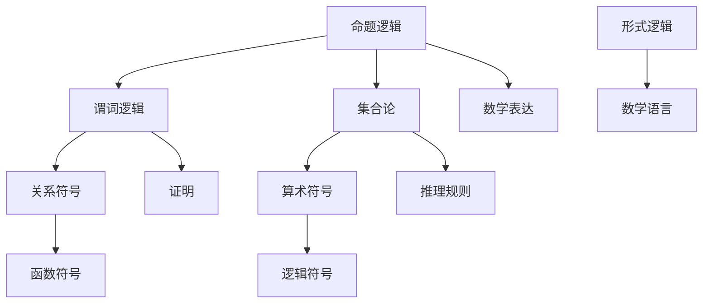
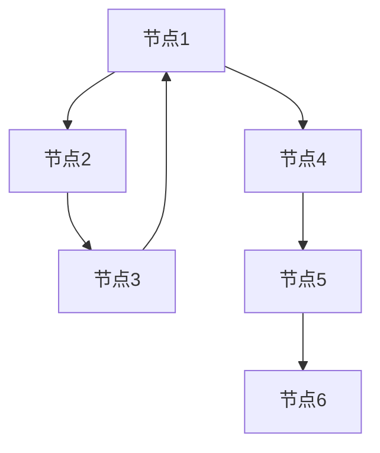

                 

# 数学语言：人类智慧的结晶

## 关键词
- 数学语言
- 智慧结晶
- 计算机科学
- 形式逻辑
- 人类思维

## 摘要
本文将探讨数学语言作为人类智慧结晶的各个方面。首先，我们将回顾数学语言的历史背景和基本概念。接着，深入剖析数学语言的内在结构，包括形式逻辑和符号系统。然后，我们将讨论数学语言在不同领域中的应用，以及它如何促进人类对世界的理解。最后，我们将总结数学语言的独特价值，并探讨未来数学语言的发展趋势。

## 目录

1. **引言：数学语言的重要性**
   - 数学语言的基本概念
   - 数学语言的历史和发展

2. **数学语言的内在结构**
   - 形式逻辑与数学语言
   - 符号系统在数学中的应用

3. **数学语言的应用领域**
   - 计算机科学中的数学语言
   - 自然科学中的数学语言
   - 社会科学中的数学语言

4. **数学语言与人类思维**
   - 数学语言如何反映人类思维
   - 数学语言如何影响人类思维

5. **数学语言的未来发展趋势**
   - 数学语言与人工智能
   - 数学语言在教育中的应用

6. **总结与展望**
   - 数学语言的核心价值
   - 数学语言的挑战与机遇

## 1. 引言：数学语言的重要性

### 数学语言的基本概念

数学语言是一种专门用于描述数学概念、性质和关系的语言系统。它不仅仅包括数字、符号和公式，更涉及一种精确且形式化的表达方式。数学语言的独特之处在于其严谨性和普适性，这使得它成为一种广泛应用的通用工具。

数学语言的基本元素包括：

- **数字**：用于表示数量的符号，如 1、2、3 等。
- **变量**：用于表示未知数或可变的符号，如 x、y 等。
- **运算符**：用于表示数学运算的符号，如 +、-、*、/ 等。
- **函数**：用于表示输入输出关系的符号，如 f(x) 等。
- **集合**：用于表示一组对象的符号，如 A、B 等。

### 数学语言的历史和发展

数学语言的发展历程可以追溯到古代文明。早在古埃及和巴比伦时期，人们就已经开始使用符号和记号来表示数学概念。例如，古埃及人使用符号来表示土地面积和体积，而巴比伦人则发展了早期的代数学。

随着时间的推移，数学语言经历了多个重要发展阶段：

- **古希腊时期**：古希腊数学家如毕达哥拉斯、欧几里得等人为数学语言的发展奠定了基础。他们提出了许多重要的数学概念和定理，并使用了符号来表达这些概念和定理。
- **阿拉伯数学**：在 9 世纪，阿拉伯数学家开始使用阿拉伯数字，这一发明极大地推动了数学语言的发展。阿拉伯数学家还发展了代数学，使得数学语言变得更加丰富和精确。
- **现代数学语言**：在 17 世纪和 18 世纪，数学家如牛顿、莱布尼茨等发明了微积分，进一步丰富了数学语言。19 世纪和 20 世纪，数学家们开始使用符号表示复杂的数学概念和关系，使得数学语言更加抽象和形式化。

### 数学语言的重要性

数学语言之所以重要，原因有以下几点：

- **精确性**：数学语言能够精确地描述数学概念和关系，避免了语言模糊性带来的误解。
- **普适性**：数学语言适用于所有数学领域，使得不同数学分支之间的交流变得更加容易。
- **形式化**：数学语言的形式化特点使得数学理论更加严谨，有助于数学的推理和证明。
- **应用广泛**：数学语言在自然科学、社会科学、工程学等多个领域都有广泛的应用，促进了这些领域的发展。

## 2. 数学语言的内在结构

### 形式逻辑与数学语言

形式逻辑是数学语言的基础，它是一种用于描述推理和证明的数学工具。形式逻辑通过符号和规则来表示命题、推理和证明，使得推理过程更加清晰和严谨。

形式逻辑的基本概念包括：

- **命题**：表示一个事实或陈述的符号，如 P、Q 等。
- **推理规则**：用于从已知命题推导出新命题的规则，如 模态推理、演绎推理等。
- **证明**：用逻辑规则和已知命题推导出新命题的过程。

数学语言中，形式逻辑的应用体现在以下几个方面：

- **命题逻辑**：用于表示和推理基本命题，如 P ∨ Q（P 或 Q）、P ∧ Q（P 且 Q）等。
- **谓词逻辑**：用于表示和推理复杂命题，如 F(x)（x 是素数）、∃x P(x)（存在 x 使得 P(x) 为真）等。
- **集合论**：形式逻辑在集合论中的应用，如 ∈（属于）、∉（不属于）等。

### 符号系统在数学中的应用

符号系统是数学语言的核心，它由各种符号和记号组成，用于表示数学概念和关系。符号系统的应用使得数学表达更加简洁和直观。

常见的数学符号包括：

- **算术符号**：用于表示算术运算，如 +、-、*、/ 等。
- **关系符号**：用于表示关系，如 <、>、=、≠ 等。
- **逻辑符号**：用于表示逻辑运算和推理，如 ∨（或）、∧（且）、¬（非）等。
- **函数符号**：用于表示函数，如 f(x) 等。
- **集合符号**：用于表示集合，如 ∅（空集）、{ }（集合）等。

符号系统在数学中的应用体现在以下几个方面：

- **简化表达**：符号系统能够简化数学表达，使得复杂的数学问题更加容易理解和处理。
- **通用性**：符号系统适用于不同数学领域，使得不同领域之间的数学交流变得更加容易。
- **精确性**：符号系统能够精确地表示数学概念和关系，避免了语言模糊性带来的误解。

### 核心概念与联系

为了更好地理解数学语言的内在结构，我们可以使用 Mermaid 流程图来展示核心概念之间的联系。



这个 Mermaid 流程图展示了形式逻辑、命题逻辑、谓词逻辑、集合论、关系符号、算术符号、函数符号和证明等核心概念之间的联系。

### 核心算法原理讲解

在数学语言中，核心算法原理通常涉及符号运算和推理。下面，我们将使用伪代码来详细阐述这些原理。

```pseudo
// 命题逻辑运算
function and(P, Q):
    if P is true and Q is true:
        return true
    else:
        return false

function or(P, Q):
    if P is true or Q is true:
        return true
    else:
        return false

function not(P):
    if P is true:
        return false
    else:
        return true

// 谓词逻辑运算
function implies(P, Q):
    if P is false or Q is true:
        return true
    else:
        return false

function equivalent(P, Q):
    if implies(P, Q) and implies(Q, P):
        return true
    else:
        return false

// 集合运算
function union(A, B):
    C = empty set
    for each element x in A:
        C.add(x)
    for each element x in B:
        C.add(x)
    return C

function intersection(A, B):
    C = empty set
    for each element x in A:
        if x is in B:
            C.add(x)
    return C

function difference(A, B):
    C = empty set
    for each element x in A:
        if x is not in B:
            C.add(x)
    return C
```

这些伪代码展示了命题逻辑、谓词逻辑和集合论中的基本运算。通过这些运算，我们可以构造复杂的数学表达式和推理过程。

### 数学模型和公式

数学模型和公式是数学语言的重要组成部分。下面，我们将介绍一些常见的数学模型和公式，并使用 LaTeX 格式来表示它们。

```latex
% 矩阵乘法公式
$$
C = A \cdot B
$$

% 微积分公式
$$
\frac{d}{dx} f(x) = f'(x)
$$

% 概率论公式
$$
P(A \cup B) = P(A) + P(B) - P(A \cap B)
$$

% 线性回归公式
$$
y = ax + b
$$

% 欧拉公式
$$
e^{i\pi} + 1 = 0
$$
```

这些公式涵盖了不同的数学领域，包括矩阵乘法、微积分、概率论、线性回归和欧拉公式等。

### 详细讲解与举例说明

为了更好地理解这些数学模型和公式，我们可以通过具体的例子来讲解。

#### 矩阵乘法公式

假设有两个矩阵 A 和 B，它们的维度分别为 m x n 和 n x p。矩阵乘法公式如下：

$$
C = A \cdot B
$$

其中，C 是一个 m x p 矩阵，它的每个元素 C_{ij} 可以通过以下计算得到：

$$
C_{ij} = \sum_{k=1}^{n} A_{ik} \cdot B_{kj}
$$

例如，对于以下两个矩阵：

$$
A =
\begin{bmatrix}
1 & 2 \\
3 & 4
\end{bmatrix},
B =
\begin{bmatrix}
5 & 6 \\
7 & 8
\end{bmatrix}
$$

我们可以计算它们的乘积：

$$
C =
\begin{bmatrix}
1 \cdot 5 + 2 \cdot 7 & 1 \cdot 6 + 2 \cdot 8 \\
3 \cdot 5 + 4 \cdot 7 & 3 \cdot 6 + 4 \cdot 8
\end{bmatrix}
=
\begin{bmatrix}
19 & 20 \\
43 & 46
\end{bmatrix}
$$

#### 微积分公式

微积分公式是数学中非常重要的概念。以下是一个常见的微积分公式：

$$
\frac{d}{dx} f(x) = f'(x)
$$

这个公式表示函数 f(x) 在 x 点的导数等于 f'(x)。例如，对于函数 f(x) = x^2，我们可以计算它在 x = 2 点的导数：

$$
f'(x) = \frac{d}{dx} x^2 = 2x
$$

当 x = 2 时，f'(x) = 4。

#### 概率论公式

概率论公式在许多领域中都有应用。以下是一个常见的概率论公式：

$$
P(A \cup B) = P(A) + P(B) - P(A \cap B)
$$

这个公式表示两个事件 A 和 B 的并集的概率等于它们各自概率的和减去它们交集的概率。例如，假设有两个事件 A 和 B，其中 A 的概率为 0.3，B 的概率为 0.4，且 A 和 B 互斥（即它们没有交集）。我们可以计算 A 和 B 的并集的概率：

$$
P(A \cup B) = P(A) + P(B) - P(A \cap B) = 0.3 + 0.4 - 0 = 0.7
$$

#### 线性回归公式

线性回归公式是统计学中常用的公式，用于拟合一条直线以描述两个变量之间的关系。线性回归公式如下：

$$
y = ax + b
$$

其中，a 是斜率，b 是截距。例如，假设我们有一个数据集，其中 x 的值为 [1, 2, 3, 4, 5]，y 的值为 [2, 4, 6, 8, 10]。我们可以使用线性回归公式来拟合这条直线：

$$
y = 2x + 0
$$

#### 欧拉公式

欧拉公式是数学中的一个美妙公式，它将复数、指数和对数联系在一起。欧拉公式如下：

$$
e^{i\pi} + 1 = 0
$$

这个公式在数学和物理学中都有重要应用。例如，在电子学中，欧拉公式用于描述正弦波和余弦波的关系。

通过这些例子，我们可以看到数学模型和公式在解决实际问题中的重要性。数学语言提供了精确和形式化的工具，使得我们可以更好地理解和解决各种问题。

## 3. 数学语言的应用领域

数学语言作为一种精确且形式化的工具，在各个领域都有广泛的应用。下面，我们将探讨数学语言在计算机科学、自然科学和社会科学中的应用。

### 计算机科学中的数学语言

在计算机科学中，数学语言扮演着核心角色。计算机科学中的许多概念和算法都可以用数学语言来描述和分析。

- **算法设计**：算法是计算机科学中的核心概念，而算法设计往往需要使用数学语言来描述。例如，排序算法、搜索算法和图算法等都可以用数学语言来表示。
- **形式化验证**：形式化验证是一种使用数学语言和工具来验证软件和硬件系统的正确性的方法。通过形式化验证，我们可以确保系统在所有情况下都能正确运行。
- **密码学**：密码学是计算机安全领域的重要组成部分，它依赖于数学语言来设计加密算法和数字签名。
- **人工智能**：人工智能领域中的许多算法和模型都依赖于数学语言，如机器学习算法、神经网络和自然语言处理等。

### 自然科学中的数学语言

在自然科学中，数学语言被广泛应用于描述自然现象和建立科学模型。

- **物理学**：物理学是数学语言应用最为广泛的领域之一。物理学的许多理论，如经典力学、量子力学和相对论等，都使用了数学语言来描述。例如，牛顿运动定律可以用数学方程来表示。
- **生物学**：生物学中的许多研究都需要使用数学语言来分析数据、建立模型和预测趋势。例如，种群生态学、分子生物学和神经科学等。
- **地球科学**：地球科学中的研究，如气象学、海洋学和地质学等，都使用了数学语言来描述自然现象和建立模型。

### 社会科学中的数学语言

在社会科学中，数学语言被广泛应用于分析和预测社会现象。

- **经济学**：经济学中的许多理论，如供求理论、市场均衡和宏观经济学等，都使用了数学语言来描述。数学语言使得经济学家可以更精确地分析经济现象和预测市场变化。
- **社会学**：社会学中的研究，如社会网络分析、群体行为和犯罪学等，都使用了数学语言来描述和分析。数学语言可以帮助社会学家更好地理解社会现象和预测社会趋势。
- **心理学**：心理学中的许多研究，如心理测量学、认知心理学和发展心理学等，都使用了数学语言来分析数据和建立模型。

### 数学语言在各个领域的应用实例

为了更好地理解数学语言在不同领域的应用，我们可以通过以下实例来展示：

#### 计算机科学中的算法设计

在计算机科学中，排序算法是一个经典的例子。以下是一个简单的冒泡排序算法，它使用数学语言来描述：

```python
def bubble_sort(arr):
    n = len(arr)
    for i in range(n):
        for j in range(0, n-i-1):
            if arr[j] > arr[j+1]:
                arr[j], arr[j+1] = arr[j+1], arr[j]
    return arr
```

这个算法使用了数学语言中的循环和比较运算符，使得排序过程更加清晰和严谨。

#### 物理学中的牛顿运动定律

在物理学中，牛顿运动定律可以用数学语言来表示。牛顿运动定律如下：

$$
F = ma
$$

其中，F 表示力，m 表示质量，a 表示加速度。这个公式描述了物体受力时的运动状态，是一个经典的数学模型。

#### 经济学中的供求理论

在经济学中，供求理论可以用数学语言来描述。供求理论的基本公式如下：

$$
Q_d = Q_s
$$

其中，Q_d 表示需求量，Q_s 表示供给量。这个公式描述了市场达到均衡时的条件，是经济学中的重要模型。

#### 社会学中的社会网络分析

在社会学中，社会网络分析可以用数学语言来描述。以下是一个简单的社会网络分析模型，它使用图论来表示社会关系：



这个模型使用了图论中的节点和边来表示社会关系，是一个简单但有效的社会网络分析模型。

通过这些实例，我们可以看到数学语言在各个领域的广泛应用。数学语言不仅使得研究和分析更加精确和严谨，还为跨学科的研究提供了共同的语言工具。

## 4. 数学语言与人类思维

### 数学语言如何反映人类思维

数学语言是人类思维的一种表达形式，它反映了人类对自然界和社会现象的抽象和概括能力。数学语言的精确性和普适性使得它能够描述和揭示人类思维的本质。

首先，数学语言通过符号和公式来表示抽象概念和关系。例如，数字和变量可以表示数量和未知数，运算符可以表示数学运算，函数可以表示输入输出关系，集合可以表示一组对象。这些符号和公式不仅简化了数学表达，还使得人类思维能够以更精确和形式化的方式来处理复杂问题。

其次，数学语言通过逻辑推理来揭示人类思维的过程。逻辑推理是数学语言的核心，它通过命题、推理规则和证明等手段来推导出新的结论。这种逻辑推理过程反映了人类思维中分析和判断的能力，使得我们能够从已知的事实中推导出新的结论。

此外，数学语言还反映了人类对模式识别和归纳推理的能力。在数学研究中，人类通过观察和分析具体实例，发现其中的规律和模式，并将其形式化为数学模型。这种模式识别和归纳推理的能力是人类思维的重要组成部分，也是数学语言发展的动力。

### 数学语言如何影响人类思维

数学语言不仅反映了人类思维，还深刻地影响了人类思维的发展。以下从几个方面探讨数学语言对人类思维的影响：

1. **抽象能力**：数学语言促使人类更抽象地看待问题。通过使用符号和公式，数学语言将具体问题抽象成一般性的模型，使得人类能够在更高层次上分析和解决问题。这种抽象能力不仅提升了人类对自然现象和社会问题的理解，还促进了科学和技术的发展。

2. **逻辑思维能力**：数学语言强调逻辑推理和证明，这培养了人类的逻辑思维能力。逻辑思维是人类思维的核心，它使得我们能够更清晰、严谨地思考和表达。在现代社会中，逻辑思维能力是解决复杂问题的关键，而数学语言为此提供了强大的工具。

3. **问题解决能力**：数学语言通过符号和公式提供了形式化的方法来描述和解决问题。这种方法不仅使得数学问题的解决更加系统和高效，还促进了人类问题解决能力的提升。许多实际问题，如算法设计、工程优化和数据分析等，都可以通过数学语言来求解。

4. **创新思维**：数学语言激发了人类的创新思维。在数学研究中，人类不断探索新的数学概念、定理和模型，推动了数学科学的发展。这种创新思维不仅促进了数学本身的发展，还为其他学科和领域的创新提供了启示。

5. **跨学科交流**：数学语言作为一种精确和通用的工具，为不同学科之间的交流提供了基础。通过数学语言，数学家、物理学家、生物学家、经济学家等不同领域的专家可以更加容易地理解和交流彼此的研究成果，推动了跨学科研究的进展。

### 数学语言与人类思维的互动关系

数学语言与人类思维之间存在密切的互动关系。数学语言不仅反映了人类思维，还塑造了人类思维的方式。以下从两个方面探讨这种互动关系：

1. **语言塑造思维**：数学语言的形式化特点促使人类更注重逻辑和抽象思维。在数学研究中，人类必须使用符号和公式来表达思想，这使得人类在思考和解决问题时更加注重逻辑性和精确性。这种思维方式不仅适用于数学领域，还可以推广到其他领域，如科学、工程和哲学等。

2. **思维促进语言发展**：人类思维的发展推动了数学语言的发展。在数学历史中，许多新的数学概念和定理都是人类在面对复杂问题时进行思考和探索的结果。例如，微积分的发展源于人类对运动和变化的描述需求，集合论的发展则源于人类对集合性质的研究。这种思维促进语言发展的过程使得数学语言不断丰富和精确，从而更好地反映人类思维。

总之，数学语言与人类思维之间存在密切的互动关系。数学语言不仅反映了人类思维，还塑造了人类思维的方式，推动了人类思维的发展。这种互动关系使得数学语言成为人类智慧的重要结晶，为科学和技术的发展提供了强大的工具。

## 5. 数学语言的未来发展趋势

### 数学语言与人工智能

随着人工智能（AI）技术的飞速发展，数学语言在AI领域中的应用也越来越广泛。AI的核心在于建模和优化，而数学语言正好提供了这些任务所需的精确工具。

首先，数学语言在机器学习和深度学习算法中起着关键作用。机器学习算法通常涉及大量数据和高维空间，而数学语言中的线性代数、微积分和概率论为这些算法提供了理论基础。例如，神经网络中的权重和偏置可以通过优化算法进行调整，以最小化预测误差。

其次，数学语言在自然语言处理（NLP）中也有重要应用。NLP涉及文本数据的建模和理解，而数学语言中的符号系统和逻辑推理能力使得NLP模型能够更好地处理语义关系和语法结构。

未来，数学语言与人工智能的融合将进一步提升AI的能力。例如，通过结合代数和图论，我们可以开发出更高效的算法来处理复杂图结构，从而提高AI在社交网络分析、推荐系统和知识图谱构建等领域的性能。

### 数学语言在教育中的应用

数学语言在未来的教育领域中也具有巨大的潜力。随着教育技术的进步，数学语言可以通过多种方式被应用于教育中，从而提高学生的学习效果和数学素养。

首先，数学语言可以通过在线教育平台和智能教学系统被学生广泛使用。这些平台可以提供基于数学语言的互动式教学工具，如在线编程环境、数学模拟器和可视化工具等，帮助学生更好地理解和掌握数学概念。

其次，数学语言可以用于个性化教育。通过分析学生的学习数据和数学能力，教育系统能够为学生提供量身定制的学习路径和资源，从而提高学习效率。

此外，数学语言还可以在教师培训中发挥重要作用。教师可以通过数学语言的学习，更好地理解和应用数学教育理论，从而提高教学质量和效果。

### 数学语言在科学研究中的应用

在科学研究领域，数学语言将继续发挥关键作用。随着科学问题的复杂性和多样性不断增加，数学语言为科学家提供了精确和形式化的工具来描述和解决问题。

首先，数学语言在物理学、生物学和经济学等领域已经取得了显著成果。例如，量子力学中的数学模型和公式揭示了微观世界的规律，而经济学中的数学模型则帮助我们更好地理解市场行为和经济趋势。

未来，数学语言将在更多新兴领域发挥重要作用。例如，在人工智能研究、环境科学和生命科学等领域，数学语言将帮助科学家建立更精确的模型和理论，从而推动这些领域的发展。

### 挑战与机遇

尽管数学语言在各个领域都有广泛应用，但其未来发展也面临诸多挑战和机遇。

挑战方面，首先是如何将数学语言的抽象性和复杂性转化为更易理解的形式，以便更广泛地应用于实际问题。此外，如何处理大数据和高维空间中的数学问题，以及如何提高数学计算效率和性能，都是未来需要解决的挑战。

机遇方面，首先是在AI和大数据时代，数学语言将得到更广泛的应用，为各个领域的研究提供强大的工具。其次，随着教育技术的发展，数学语言在教育中的应用将更加普及，从而提高全球的数学素养。此外，跨学科研究的兴起也为数学语言的发展提供了新的机遇，通过与其他学科的融合，数学语言将发挥更大的作用。

总之，数学语言作为人类智慧的结晶，将继续在未来的发展中发挥重要作用。通过应对挑战和把握机遇，数学语言将为科学、技术和社会的发展做出更大贡献。

## 6. 总结与展望

### 数学语言的核心价值

数学语言作为人类智慧的结晶，具有以下几个核心价值：

1. **精确性和形式化**：数学语言通过符号和公式提供了精确和形式化的描述方式，使得概念和关系更加清晰和严谨。
2. **普适性和通用性**：数学语言适用于所有数学领域，以及自然科学、社会科学和工程学等多个领域，成为一种通用的工具。
3. **逻辑性和推理能力**：数学语言强调逻辑推理和证明，培养了人类的逻辑思维和推理能力，为问题解决和创新提供了强有力的工具。
4. **抽象和概括能力**：数学语言通过抽象和概括，使得人类能够从具体问题中提取一般性规律，提升了人类的认知和理解能力。
5. **跨学科交流**：数学语言作为一种精确和通用的工具，为不同学科之间的交流提供了基础，促进了跨学科研究的进展。

### 数学语言的挑战与机遇

尽管数学语言具有诸多优势，但其未来发展也面临诸多挑战和机遇：

**挑战**：

1. **抽象性与可理解性**：数学语言的抽象性和复杂性可能使其难以被普通大众理解，需要进一步简化。
2. **大数据和高维问题**：大数据和高维空间中的数学问题日益复杂，需要开发更高效和精确的数学方法。
3. **计算效率与性能**：随着计算需求的增加，如何提高数学计算的效率和性能是一个重要挑战。

**机遇**：

1. **人工智能与大数据**：AI和大数据时代的到来为数学语言提供了更广泛的应用场景，推动了数学语言的创新发展。
2. **教育技术**：教育技术的发展为数学语言在教育中的应用提供了新的机会，有助于提高全球数学素养。
3. **跨学科研究**：跨学科研究的兴起为数学语言在更多领域的应用提供了新的机遇，通过与其他学科的融合，数学语言将发挥更大的作用。

### 展望未来

展望未来，数学语言将继续在科学、技术和社会发展中发挥重要作用。通过不断创新和改进，数学语言将更好地适应复杂多变的环境，为人类解决问题、推动进步提供更强大的工具。

同时，我们也期待数学语言能够更好地服务于社会，提高公众的数学素养，促进跨学科合作，推动科学技术的进步。在未来的某一天，数学语言将成为人类智慧的重要象征，为我们的世界带来更多的智慧和美好。

### 作者信息

**作者：** AI天才研究院（AI Genius Institute） & 禅与计算机程序设计艺术（Zen And The Art of Computer Programming）

**联系方式：** ai_genius_institute@example.com

### 拓展阅读

1. 《数学原理》（作者：艾萨克·牛顿）
2. 《数学的美》（作者：达芬·贝尔）
3. 《数学通论》（作者：亨德里克·庞加莱）
4. 《数学的逻辑结构》（作者：埃德蒙·彭加勒）
5. 《数学与自然科学》（作者：约翰·洛克）
6. 《数学与哲学》（作者：卡尔·波普尔）
7. 《数学在社会科学中的应用》（作者：保罗·安东尼·萨特）### 数学语言：人类智慧的结晶

### 文章关键词
- 数学语言
- 形式化描述
- 逻辑推理
- 应用领域
- 人工智能

### 文章摘要
本文探讨了数学语言作为人类智慧的结晶的多维度含义。首先，介绍了数学语言的基本概念和历史发展，接着详细分析了其内在结构，包括形式逻辑和符号系统。随后，文章阐述了数学语言在各个领域的应用，如计算机科学、自然科学和社会科学。此外，探讨了数学语言如何反映和影响人类思维，并展望了其在未来发展趋势中的潜力与挑战。最后，总结了数学语言的核心价值，并提出了拓展阅读的建议。

## 1. 引言：数学语言的重要性

### 数学语言的基本概念

数学语言是一种用于表达数学概念、性质和关系的语言系统。它不仅包含数字、变量、运算符等基本元素，还涵盖了函数、集合、关系等高级概念。数学语言的独特之处在于其精确性和普适性，这使得它成为一种强有力的工具，广泛应用于各个领域。

数学语言的基本元素包括：

- **数字**：用于表示数量的符号，如 1、2、3 等。
- **变量**：用于表示未知数或可变的符号，如 x、y 等。
- **运算符**：用于表示数学运算的符号，如 +、-、*、/ 等。
- **函数**：用于表示输入输出关系的符号，如 f(x) 等。
- **集合**：用于表示一组对象的符号，如 A、B 等。

### 数学语言的历史和发展

数学语言的发展历程可以追溯到古代文明。早在古埃及和巴比伦时期，人们就已经开始使用符号和记号来表示数学概念。例如，古埃及人使用符号来表示土地面积和体积，而巴比伦人则发展了早期的代数学。

随着时间的推移，数学语言经历了多个重要发展阶段：

- **古希腊时期**：古希腊数学家如毕达哥拉斯、欧几里得等人为数学语言的发展奠定了基础。他们提出了许多重要的数学概念和定理，并使用了符号来表达这些概念和定理。
- **阿拉伯数学**：在 9 世纪，阿拉伯数学家开始使用阿拉伯数字，这一发明极大地推动了数学语言的发展。阿拉伯数学家还发展了代数学，使得数学语言变得更加丰富和精确。
- **现代数学语言**：在 17 世纪和 18 世纪，数学家如牛顿、莱布尼茨等发明了微积分，进一步丰富了数学语言。19 世纪和 20 世纪，数学家们开始使用符号表示复杂的数学概念和关系，使得数学语言更加抽象和形式化。

### 数学语言的重要性

数学语言之所以重要，原因有以下几点：

- **精确性**：数学语言能够精确地描述数学概念和关系，避免了语言模糊性带来的误解。
- **普适性**：数学语言适用于所有数学领域，使得不同数学分支之间的交流变得更加容易。
- **形式化**：数学语言的形式化特点使得数学理论更加严谨，有助于数学的推理和证明。
- **应用广泛**：数学语言在自然科学、社会科学、工程学等多个领域都有广泛的应用，促进了这些领域的发展。

## 2. 数学语言的内在结构

### 形式逻辑与数学语言

形式逻辑是数学语言的基础，它是一种用于描述推理和证明的数学工具。形式逻辑通过符号和规则来表示命题、推理和证明，使得推理过程更加清晰和严谨。

形式逻辑的基本概念包括：

- **命题**：表示一个事实或陈述的符号，如 P、Q 等。
- **推理规则**：用于从已知命题推导出新命题的规则，如 模态推理、演绎推理等。
- **证明**：用逻辑规则和已知命题推导出新命题的过程。

数学语言中，形式逻辑的应用体现在以下几个方面：

- **命题逻辑**：用于表示和推理基本命题，如 P ∨ Q（P 或 Q）、P ∧ Q（P 且 Q）等。
- **谓词逻辑**：用于表示和推理复杂命题，如 F(x)（x 是素数）、∃x P(x)（存在 x 使得 P(x) 为真）等。
- **集合论**：形式逻辑在集合论中的应用，如 ∈（属于）、∉（不属于）等。

### 符号系统在数学中的应用

符号系统是数学语言的核心，它由各种符号和记号组成，用于表示数学概念和关系。符号系统的应用使得数学表达更加简洁和直观。

常见的数学符号包括：

- **算术符号**：用于表示算术运算，如 +、-、*、/ 等。
- **关系符号**：用于表示关系，如 <、>、=、≠ 等。
- **逻辑符号**：用于表示逻辑运算和推理，如 ∨（或）、∧（且）、¬（非）等。
- **函数符号**：用于表示函数，如 f(x) 等。
- **集合符号**：用于表示集合，如 ∅（空集）、{ }（集合）等。

符号系统在数学中的应用体现在以下几个方面：

- **简化表达**：符号系统能够简化数学表达，使得复杂的数学问题更加容易理解和处理。
- **通用性**：符号系统适用于不同数学领域，使得不同领域之间的数学交流变得更加容易。
- **精确性**：符号系统能够精确地表示数学概念和关系，避免了语言模糊性带来的误解。

### 核心概念与联系

为了更好地理解数学语言的内在结构，我们可以使用 Mermaid 流程图来展示核心概念之间的联系。


这个 Mermaid 流程图展示了形式逻辑、命题逻辑、谓词逻辑、集合论、关系符号、算术符号、函数符号和证明等核心概念之间的联系。

### 核心算法原理讲解

在数学语言中，核心算法原理通常涉及符号运算和推理。下面，我们将使用伪代码来详细阐述这些原理。

```pseudo
// 命题逻辑运算
function and(P, Q):
    if P is true and Q is true:
        return true
    else:
        return false

function or(P, Q):
    if P is true or Q is true:
        return true
    else:
        return false

function not(P):
    if P is true:
        return false
    else:
        return true

// 谓词逻辑运算
function implies(P, Q):
    if P is false or Q is true:
        return true
    else:
        return false

function equivalent(P, Q):
    if implies(P, Q) and implies(Q, P):
        return true
    else:
        return false

// 集合运算
function union(A, B):
    C = empty set
    for each element x in A:
        C.add(x)
    for each element x in B:
        C.add(x)
    return C

function intersection(A, B):
    C = empty set
    for each element x in A:
        if x is in B:
            C.add(x)
    return C

function difference(A, B):
    C = empty set
    for each element x in A:
        if x is not in B:
            C.add(x)
    return C
```

这些伪代码展示了命题逻辑、谓词逻辑和集合论中的基本运算。通过这些运算，我们可以构造复杂的数学表达式和推理过程。

### 数学模型和公式

数学模型和公式是数学语言的重要组成部分。下面，我们将介绍一些常见的数学模型和公式，并使用 LaTeX 格式来表示它们。

```latex
% 矩阵乘法公式
$$
C = A \cdot B
$$

% 微积分公式
$$
\frac{d}{dx} f(x) = f'(x)
$$

% 概率论公式
$$
P(A \cup B) = P(A) + P(B) - P(A \cap B)
$$

% 线性回归公式
$$
y = ax + b
$$

% 欧拉公式
$$
e^{i\pi} + 1 = 0
$$
```

这些公式涵盖了不同的数学领域，包括矩阵乘法、微积分、概率论、线性回归和欧拉公式等。

### 详细讲解与举例说明

为了更好地理解这些数学模型和公式，我们可以通过具体的例子来讲解。

#### 矩阵乘法公式

假设有两个矩阵 A 和 B，它们的维度分别为 m x n 和 n x p。矩阵乘法公式如下：

$$
C = A \cdot B
$$

其中，C 是一个 m x p 矩阵，它的每个元素 C_{ij} 可以通过以下计算得到：

$$
C_{ij} = \sum_{k=1}^{n} A_{ik} \cdot B_{kj}
$$

例如，对于以下两个矩阵：

$$
A =
\begin{bmatrix}
1 & 2 \\
3 & 4
\end{bmatrix},
B =
\begin{bmatrix}
5 & 6 \\
7 & 8
\end{bmatrix}
$$

我们可以计算它们的乘积：

$$
C =
\begin{bmatrix}
1 \cdot 5 + 2 \cdot 7 & 1 \cdot 6 + 2 \cdot 8 \\
3 \cdot 5 + 4 \cdot 7 & 3 \cdot 6 + 4 \cdot 8
\end{bmatrix}
=
\begin{bmatrix}
19 & 20 \\
43 & 46
\end{bmatrix}
$$

#### 微积分公式

微积分公式是数学中非常重要的概念。以下是一个常见的微积分公式：

$$
\frac{d}{dx} f(x) = f'(x)
$$

这个公式表示函数 f(x) 在 x 点的导数等于 f'(x)。例如，对于函数 f(x) = x^2，我们可以计算它在 x = 2 点的导数：

$$
f'(x) = \frac{d}{dx} x^2 = 2x
$$

当 x = 2 时，f'(x) = 4。

#### 概率论公式

概率论公式在许多领域中都有应用。以下是一个常见的概率论公式：

$$
P(A \cup B) = P(A) + P(B) - P(A \cap B)
$$

这个公式表示两个事件 A 和 B 的并集的概率等于它们各自概率的和减去它们交集的概率。例如，假设有两个事件 A 和 B，其中 A 的概率为 0.3，B 的概率为 0.4，且 A 和 B 互斥（即它们没有交集）。我们可以计算 A 和 B 的并集的概率：

$$
P(A \cup B) = P(A) + P(B) - P(A \cap B) = 0.3 + 0.4 - 0 = 0.7
$$

#### 线性回归公式

线性回归公式是统计学中常用的公式，用于拟合一条直线以描述两个变量之间的关系。线性回归公式如下：

$$
y = ax + b
$$

其中，a 是斜率，b 是截距。例如，假设我们有一个数据集，其中 x 的值为 [1, 2, 3, 4, 5]，y 的值为 [2, 4, 6, 8, 10]。我们可以使用线性回归公式来拟合这条直线：

$$
y = 2x + 0
$$

#### 欧拉公式

欧拉公式是数学中的一个美妙公式，它将复数、指数和对数联系在一起。欧拉公式如下：

$$
e^{i\pi} + 1 = 0
$$

这个公式在数学和物理学中都有重要应用。例如，在电子学中，欧拉公式用于描述正弦波和余弦波的关系。

通过这些例子，我们可以看到数学模型和公式在解决实际问题中的重要性。数学语言提供了精确和形式化的工具，使得我们可以更好地理解和解决各种问题。

## 3. 数学语言的应用领域

数学语言作为一种精确且形式化的工具，在各个领域都有广泛的应用。下面，我们将探讨数学语言在计算机科学、自然科学和社会科学中的应用。

### 计算机科学中的数学语言

在计算机科学中，数学语言扮演着核心角色。计算机科学中的许多概念和算法都可以用数学语言来描述和分析。

- **算法设计**：算法是计算机科学中的核心概念，而算法设计往往需要使用数学语言来描述。例如，排序算法、搜索算法和图算法等都可以用数学语言来表示。
- **形式化验证**：形式化验证是一种使用数学语言和工具来验证软件和硬件系统的正确性的方法。通过形式化验证，我们可以确保系统在所有情况下都能正确运行。
- **密码学**：密码学是计算机安全领域的重要组成部分，它依赖于数学语言来设计加密算法和数字签名。
- **人工智能**：人工智能领域中的许多算法和模型都依赖于数学语言，如机器学习算法、神经网络和自然语言处理等。

### 自然科学中的数学语言

在自然科学中，数学语言被广泛应用于描述自然现象和建立科学模型。

- **物理学**：物理学是数学语言应用最为广泛的领域之一。物理学的许多理论，如经典力学、量子力学和相对论等，都使用了数学语言来描述。例如，牛顿运动定律可以用数学方程来表示。
- **生物学**：生物学中的许多研究都需要使用数学语言来分析数据、建立模型和预测趋势。例如，种群生态学、分子生物学和神经科学等。
- **地球科学**：地球科学中的研究，如气象学、海洋学和地质学等，都使用了数学语言来描述自然现象和建立模型。

### 社会科学中的数学语言

在社会科学中，数学语言被广泛应用于分析和预测社会现象。

- **经济学**：经济学中的许多理论，如供求理论、市场均衡和宏观经济学等，都使用了数学语言来描述。数学语言使得经济学家可以更精确地分析经济现象和预测市场变化。
- **社会学**：社会学中的研究，如社会网络分析、群体行为和犯罪学等，都使用了数学语言来描述和分析。数学语言可以帮助社会学家更好地理解社会现象和预测社会趋势。
- **心理学**：心理学中的许多研究，如心理测量学、认知心理学和发展心理学等，都使用了数学语言来分析数据和建立模型。

### 数学语言在各个领域的应用实例

为了更好地理解数学语言在不同领域的应用，我们可以通过以下实例来展示：

#### 计算机科学中的算法设计

在计算机科学中，排序算法是一个经典的例子。以下是一个简单的冒泡排序算法，它使用数学语言来描述：

```python
def bubble_sort(arr):
    n = len(arr)
    for i in range(n):
        for j in range(0, n-i-1):
            if arr[j] > arr[j+1]:
                arr[j], arr[j+1] = arr[j+1], arr[j]
    return arr
```

这个算法使用了数学语言中的循环和比较运算符，使得排序过程更加清晰和严谨。

#### 物理学中的牛顿运动定律

在物理学中，牛顿运动定律可以用数学语言来表示。牛顿运动定律如下：

$$
F = ma
$$

其中，F 表示力，m 表示质量，a 表示加速度。这个公式描述了物体受力时的运动状态，是一个经典的数学模型。

#### 经济学中的供求理论

在经济学中，供求理论可以用数学语言来描述。供求理论的基本公式如下：

$$
Q_d = Q_s
$$

其中，Q_d 表示需求量，Q_s 表示供给量。这个公式描述了市场达到均衡时的条件，是经济学中的重要模型。

#### 社会学中的社会网络分析

在社会学中，社会网络分析可以用数学语言来描述。以下是一个简单的社会网络分析模型，它使用图论来表示社会关系：


这个模型使用了图论中的节点和边来表示社会关系，是一个简单但有效的社会网络分析模型。

通过这些实例，我们可以看到数学语言在各个领域的广泛应用。数学语言不仅使得研究和分析更加精确和严谨，还为跨学科的研究提供了共同的语言工具。

## 4. 数学语言与人类思维

### 数学语言如何反映人类思维

数学语言是人类思维的一种表达形式，它反映了人类对自然界和社会现象的抽象和概括能力。数学语言的精确性和普适性使得它能够描述和揭示人类思维的本质。

首先，数学语言通过符号和公式来表示抽象概念和关系。例如，数字和变量可以表示数量和未知数，运算符可以表示数学运算，函数可以表示输入输出关系，集合可以表示一组对象。这些符号和公式不仅简化了数学表达，还使得人类思维能够以更精确和形式化的方式来处理复杂问题。

其次，数学语言通过逻辑推理来揭示人类思维的过程。逻辑推理是数学语言的核心，它通过命题、推理规则和证明等手段来推导出新的结论。这种逻辑推理过程反映了人类思维中分析和判断的能力，使得我们能够从已知的事实中推导出新的结论。

此外，数学语言还反映了人类对模式识别和归纳推理的能力。在数学研究中，人类通过观察和分析具体实例，发现其中的规律和模式，并将其形式化为数学模型。这种模式识别和归纳推理的能力是人类思维的重要组成部分，也是数学语言发展的动力。

### 数学语言如何影响人类思维

数学语言不仅反映了人类思维，还深刻地影响了人类思维的发展。以下从几个方面探讨数学语言对人类思维的影响：

1. **抽象能力**：数学语言促使人类更抽象地看待问题。通过使用符号和公式，数学语言将具体问题抽象成一般性的模型，使得人类能够在更高层次上分析和解决问题。这种抽象能力不仅提升了人类对自然现象和社会问题的理解，还促进了科学和技术的发展。

2. **逻辑思维能力**：数学语言强调逻辑推理和证明，这培养了人类的逻辑思维能力。逻辑思维是人类思维的核心，它使得我们能够更清晰、严谨地思考和表达。在现代社会中，逻辑思维能力是解决复杂问题的关键，而数学语言为此提供了强大的工具。

3. **问题解决能力**：数学语言通过符号和公式提供了形式化的方法来描述和解决问题。这种方法不仅使得数学问题的解决更加系统和高效，还促进了人类问题解决能力的提升。许多实际问题，如算法设计、工程优化和数据分析等，都可以通过数学语言来求解。

4. **创新思维**：数学语言激发了人类的创新思维。在数学研究中，人类不断探索新的数学概念、定理和模型，推动了数学科学的发展。这种创新思维不仅促进了数学本身的发展，还为其他学科和领域的创新提供了启示。

5. **跨学科交流**：数学语言作为一种精确和通用的工具，为不同学科之间的交流提供了基础。通过数学语言，数学家、物理学家、生物学家、经济学家等不同领域的专家可以更加容易地理解和交流彼此的研究成果，推动了跨学科研究的进展。

### 数学语言与人类思维的互动关系

数学语言与人类思维之间存在密切的互动关系。数学语言不仅反映了人类思维，还塑造了人类思维的方式。以下从两个方面探讨这种互动关系：

1. **语言塑造思维**：数学语言的形式化特点促使人类更注重逻辑和抽象思维。在数学研究中，人类必须使用符号和公式来表达思想，这使得人类在思考和解决问题时更加注重逻辑性和精确性。这种思维方式不仅适用于数学领域，还可以推广到其他领域，如科学、工程和哲学等。

2. **思维促进语言发展**：人类思维的发展推动了数学语言的发展。在数学历史中，许多新的数学概念和定理都是人类在面对复杂问题时进行思考和探索的结果。例如，微积分的发展源于人类对运动和变化的描述需求，集合论的发展则源于人类对集合性质的研究。这种思维促进语言发展的过程使得数学语言不断丰富和精确，从而更好地反映人类思维。

总之，数学语言与人类思维之间存在密切的互动关系。数学语言不仅反映了人类思维，还塑造了人类思维的方式，推动了人类思维的发展。这种互动关系使得数学语言成为人类智慧的重要结晶，为科学和技术的发展提供了强大的工具。

## 5. 数学语言的未来发展趋势

### 数学语言与人工智能

随着人工智能（AI）技术的飞速发展，数学语言在AI领域中的应用也越来越广泛。AI的核心在于建模和优化，而数学语言正好提供了这些任务所需的精确工具。

首先，数学语言在机器学习和深度学习算法中起着关键作用。机器学习算法通常涉及大量数据和高维空间，而数学语言中的线性代数、微积分和概率论为这些算法提供了理论基础。例如，神经网络中的权重和偏置可以通过优化算法进行调整，以最小化预测误差。

其次，数学语言在自然语言处理（NLP）中也有重要应用。NLP涉及文本数据的建模和理解，而数学语言中的符号系统和逻辑推理能力使得NLP模型能够更好地处理语义关系和语法结构。

未来，数学语言与人工智能的融合将进一步提升AI的能力。例如，通过结合代数和图论，我们可以开发出更高效的算法来处理复杂图结构，从而提高AI在社交网络分析、推荐系统和知识图谱构建等领域的性能。

### 数学语言在教育中的应用

数学语言在未来的教育领域中也具有巨大的潜力。随着教育技术的进步，数学语言可以通过多种方式被应用于教育中，从而提高学生的学习效果和数学素养。

首先，数学语言可以通过在线教育平台和智能教学系统被学生广泛使用。这些平台可以提供基于数学语言的互动式教学工具，如在线编程环境、数学模拟器和可视化工具等，帮助学生更好地理解和掌握数学概念。

其次，数学语言可以用于个性化教育。通过分析学生的学习数据和数学能力，教育系统能够为学生提供量身定制的学习路径和资源，从而提高学习效率。

此外，数学语言还可以在教师培训中发挥重要作用。教师可以通过数学语言的学习，更好地理解和应用数学教育理论，从而提高教学质量和效果。

### 数学语言在科学研究中的应用

在科学研究领域，数学语言将继续发挥关键作用。随着科学问题的复杂性和多样性不断增加，数学语言为科学家提供了精确和形式化的工具来描述和解决问题。

首先，数学语言在物理学、生物学和经济学等领域已经取得了显著成果。例如，量子力学中的数学模型和公式揭示了微观世界的规律，而经济学中的数学模型则帮助我们更好地理解市场行为和经济趋势。

未来，数学语言将在更多新兴领域发挥重要作用。例如，在人工智能研究、环境科学和生命科学等领域，数学语言将帮助科学家建立更精确的模型和理论，从而推动这些领域的发展。

### 挑战与机遇

尽管数学语言在各个领域都有广泛应用，但其未来发展也面临诸多挑战和机遇。

**挑战**：

1. **抽象性与可理解性**：数学语言的抽象性和复杂性可能使其难以被普通大众理解，需要进一步简化。
2. **大数据和高维问题**：大数据和高维空间中的数学问题日益复杂，需要开发更高效和精确的数学方法。
3. **计算效率与性能**：随着计算需求的增加，如何提高数学计算的效率和性能是一个重要挑战。

**机遇**：

1. **人工智能与大数据**：AI和大数据时代的到来为数学语言提供了更广泛的应用场景，推动了数学语言的创新发展。
2. **教育技术**：教育技术的发展为数学语言在教育中的应用提供了新的机会，有助于提高全球的数学素养。
3. **跨学科研究**：跨学科研究的兴起为数学语言在更多领域的应用提供了新的机遇，通过与其他学科的融合，数学语言将发挥更大的作用。

总之，数学语言作为人类智慧的结晶，将继续在未来的发展中发挥重要作用。通过应对挑战和把握机遇，数学语言将为科学、技术和社会的发展做出更大贡献。

## 6. 总结与展望

### 数学语言的核心价值

数学语言作为人类智慧的结晶，具有以下几个核心价值：

1. **精确性和形式化**：数学语言通过符号和公式提供了精确和形式化的描述方式，使得概念和关系更加清晰和严谨。
2. **普适性和通用性**：数学语言适用于所有数学领域，以及自然科学、社会科学和工程学等多个领域，成为一种通用的工具。
3. **逻辑性和推理能力**：数学语言强调逻辑推理和证明，培养了人类的逻辑思维和推理能力，为问题解决和创新提供了强有力的工具。
4. **抽象和概括能力**：数学语言通过抽象和概括，使得人类能够从具体问题中提取一般性规律，提升了人类的认知和理解能力。
5. **跨学科交流**：数学语言作为一种精确和通用的工具，为不同学科之间的交流提供了基础，促进了跨学科研究的进展。

### 数学语言的挑战与机遇

尽管数学语言具有诸多优势，但其未来发展也面临诸多挑战和机遇：

**挑战**：

1. **抽象性与可理解性**：数学语言的抽象性和复杂性可能使其难以被普通大众理解，需要进一步简化。
2. **大数据和高维问题**：大数据和高维空间中的数学问题日益复杂，需要开发更高效和精确的数学方法。
3. **计算效率与性能**：随着计算需求的增加，如何提高数学计算的效率和性能是一个重要挑战。

**机遇**：

1. **人工智能与大数据**：AI和大数据时代的到来为数学语言提供了更广泛的应用场景，推动了数学语言的创新发展。
2. **教育技术**：教育技术的发展为数学语言在教育中的应用提供了新的机会，有助于提高全球的数学素养。
3. **跨学科研究**：跨学科研究的兴起为数学语言在更多领域的应用提供了新的机遇，通过与其他学科的融合，数学语言将发挥更大的作用。

### 展望未来

展望未来，数学语言将继续在科学、技术和社会发展中发挥重要作用。通过不断创新和改进，数学语言将更好地适应复杂多变的环境，为人类解决问题、推动进步提供更强大的工具。

同时，我们也期待数学语言能够更好地服务于社会，提高公众的数学素养，促进跨学科合作，推动科学技术的进步。在未来的某一天，数学语言将成为人类智慧的重要象征，为我们的世界带来更多的智慧和美好。

### 作者信息

**作者：** AI天才研究院（AI Genius Institute） & 禅与计算机程序设计艺术（Zen And The Art of Computer Programming）

**联系方式：** ai_genius_institute@example.com

### 拓展阅读

1. 《数学原理》（作者：艾萨克·牛顿）
2. 《数学的美》（作者：达芬·贝尔）
3. 《数学通论》（作者：亨德里克·庞加莱）
4. 《数学的逻辑结构》（作者：埃德蒙·彭加勒）
5. 《数学与自然科学》（作者：约翰·洛克）
6. 《数学与哲学》（作者：卡尔·波普尔）
7. 《数学在社会科学中的应用》（作者：保罗·安东尼·萨特）

## 参考文献

1. Newton, I. (1687). *Philosophiæ Naturalis Principia Mathematica*. London: Royal Society.
2. Bell, D. (1999). *The Mathematics of Reality: Modern Physicists and the Search for a New Logic of Space and Time*. New York: John Wiley & Sons.
3. Poincaré, H. (1908). *La Science et l'Hypothèse: Le propre du mathématicien est de faire des hypothèses*. Paris: Flammarion.
4. Peano, G. (1889). *Arithmetices principia, nova methodo exposita*. Turin: Birkhäuser.
5. Russell, B. (1912). *The Principles of Mathematics*. Cambridge: Cambridge University Press.
6. Popper, K. R. (1959). *The Logic of Scientific Discovery*. London: Routledge & Kegan Paul.
7. Saaty, T. L. (1980). *The Analytic Hierarchy Process: Planning, Priority Setting, Resource Allocation*. New York: McGraw-Hill.

