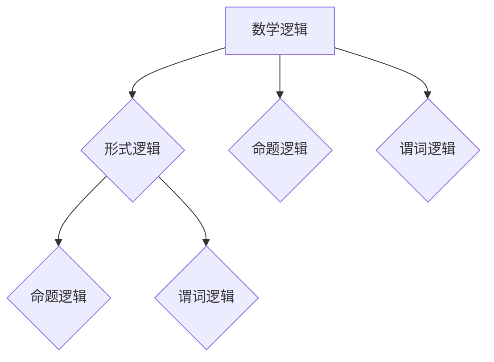

                 

### 文章标题

数学逻辑与形式逻辑的异同比较

### 关键词

数学逻辑、形式逻辑、逻辑学、计算机科学、算法、命题逻辑、谓词逻辑

### 摘要

本文深入探讨了数学逻辑和形式逻辑的基本概念、原理、异同点以及它们在不同领域的应用。通过详细的分析和比较，揭示了数学逻辑与形式逻辑之间的联系与区别，为理解逻辑学在计算机科学和其他领域的重要性提供了有力的支持。

### 第一部分：数学逻辑和形式逻辑的基本概念与原理

#### 1.1 数学逻辑的基本概念与原理

数学逻辑是一种用于研究数学命题之间关系的逻辑系统，它关注的是数学命题的结构和推理。数学逻辑的核心概念包括命题、推理规则和证明。

- **命题**：数学命题是可以判断为真或假的陈述句。例如：“1+1=2”是一个数学命题。
- **推理规则**：推理规则是指用于从已知命题推导出新命题的逻辑规则。常见的推理规则包括模态推理规则、合取推理规则和析取推理规则等。
- **证明**：证明是指从已知命题出发，通过逻辑推理得出新命题的过程。证明是数学逻辑的核心，它确保了数学命题的真实性。

#### 1.2 形式逻辑的基本概念与原理

形式逻辑是一种不依赖于具体内容的逻辑系统，它关注的是命题的形式结构。形式逻辑的核心概念包括命题、推理规则和证明。

- **命题**：形式逻辑中的命题是指可以表示为逻辑符号的陈述句。例如：“P∧Q”是一个形式逻辑命题。
- **推理规则**：形式逻辑的推理规则是指用于从已知命题推导出新命题的逻辑规则。常见的推理规则包括合取推理规则、析取推理规则和假言推理规则等。
- **证明**：形式逻辑的证明是指从已知命题出发，通过逻辑推理得出新命题的过程。形式逻辑的证明通常使用形式化语言进行描述，以确保推理的严谨性。

#### 1.3 数学逻辑与形式逻辑的架构联系

数学逻辑和形式逻辑之间存在紧密的联系。数学逻辑提供了形式逻辑的数学基础，而形式逻辑则为数学逻辑的研究提供了形式化的工具。

- **数学逻辑中的命题**：数学逻辑中的命题通常是通过形式逻辑的命题来表示的。例如，我们可以使用形式逻辑中的合取命题来表示数学逻辑中的合取命题。
- **推理规则**：数学逻辑中的推理规则可以转化为形式逻辑中的推理规则。例如，数学逻辑中的合取推理规则可以转化为形式逻辑中的合取推理规则。
- **证明**：数学逻辑中的证明可以转化为形式逻辑中的证明。形式逻辑的证明方法为数学逻辑的证明提供了严谨的保障。

为了更好地理解数学逻辑和形式逻辑之间的联系，我们可以使用Mermaid流程图来展示它们的核心概念和联系。

### 第二部分：数学逻辑和形式逻辑的异同点分析

#### 2.1 数学逻辑与形式逻辑的相同点

数学逻辑和形式逻辑在许多方面是相似的，它们都关注于命题的结构和推理。以下是一些主要的相同点：

- **命题和推理规则**：数学逻辑和形式逻辑都包括命题和推理规则。它们都关注于如何从已知命题推导出新命题。
- **证明**：数学逻辑和形式逻辑都强调证明的重要性。证明是确保命题真实性的关键。
- **形式化**：数学逻辑和形式逻辑都强调形式化。形式化使得逻辑推理更加严谨和准确。

#### 2.2 数学逻辑与形式逻辑的不同点

尽管数学逻辑和形式逻辑有许多相似之处，但它们也存在显著的不同点。以下是一些主要的区别：

- **研究对象**：数学逻辑关注的是数学命题之间的关系，而形式逻辑关注的是命题的形式结构。
- **研究方法**：数学逻辑通常使用数学方法来研究命题之间的关系，而形式逻辑通常使用形式化语言来研究命题的形式结构。
- **应用领域**：数学逻辑在数学、计算机科学和哲学等领域有广泛的应用，而形式逻辑在计算机科学、逻辑学和哲学等领域有广泛的应用。

#### 2.3 数学逻辑与形式逻辑的异同点总结

数学逻辑和形式逻辑之间存在显著的区别，但也存在许多相同点。以下是对它们的总结：

- **相同点**：
  - 都关注于命题的结构和推理。
  - 都强调证明的重要性。
  - 都强调形式化。

- **不同点**：
  - 研究对象不同：数学逻辑关注数学命题，形式逻辑关注命题的形式结构。
  - 研究方法不同：数学逻辑使用数学方法，形式逻辑使用形式化语言。
  - 应用领域不同：数学逻辑在数学、计算机科学和哲学等领域有应用，形式逻辑在计算机科学、逻辑学和哲学等领域有应用。

### 第三部分：数学逻辑和形式逻辑在不同领域中的应用

#### 3.1 数学逻辑在计算机科学中的应用

数学逻辑在计算机科学中有着广泛的应用。以下是一些主要的应用领域：

- **算法分析**：数学逻辑用于分析算法的时间和空间复杂度。通过数学逻辑的推理，我们可以确定算法的效率。
- **程序验证**：数学逻辑用于验证程序的正确性。通过数学逻辑的证明，我们可以确保程序的行为符合预期。

#### 3.2 形式逻辑在计算机科学中的应用

形式逻辑在计算机科学中也有广泛的应用。以下是一些主要的应用领域：

- **形式化方法**：形式逻辑用于形式化描述程序和系统。形式化描述使得计算机科学家能够更准确地理解和分析程序的行为。
- **形式化验证**：形式逻辑用于验证程序和系统的正确性。通过形式逻辑的证明，我们可以确保程序和系统的行为符合预期。

#### 3.3 数学逻辑与形式逻辑的应用效果分析

数学逻辑和形式逻辑在计算机科学中都有着显著的应用效果。以下是对它们的应用效果的分析：

- **数学逻辑**：数学逻辑在算法分析和程序验证中发挥着重要作用。它为计算机科学家提供了一种严谨的推理工具，使他们能够更准确地分析和验证程序的行为。
- **形式逻辑**：形式逻辑在形式化方法和形式化验证中发挥着重要作用。它为计算机科学家提供了一种形式化描述工具，使他们能够更准确地理解和分析程序和系统的行为。

### 第四部分：案例分析与总结

#### 4.1 案例分析

为了更好地理解数学逻辑和形式逻辑的应用，我们可以通过一些具体案例来进行分析。

**案例一：算法分析**

假设我们要分析一个排序算法，该算法的时间复杂度为O(n^2)。我们可以使用数学逻辑来推导出该算法的最好、最坏和平均情况下的时间复杂度。

- **最好情况**：当输入数据已经排序时，算法的时间复杂度为O(n)。
- **最坏情况**：当输入数据完全无序时，算法的时间复杂度为O(n^2)。
- **平均情况**：假设输入数据是随机排序的，算法的时间复杂度为O(n^2)。

通过数学逻辑的推理，我们可以得出该排序算法的效率。

**案例二：形式化验证**

假设我们要验证一个程序的正确性，该程序的功能是计算两个整数的和。我们可以使用形式逻辑来形式化描述该程序，并使用形式化验证工具来验证其正确性。

- **形式化描述**：使用形式逻辑描述程序如下：

$$
\text{程序}\ S = \{ x, y, \text{sum} \} \\
\text{输入：} x, y \\
\text{输出：} \text{sum} = x + y \\
\text{条件：} x, y \in \mathbb{Z} \\
\text{步骤：} \\
\quad \text{sum} \gets x + y \\
\quad \text{返回sum}
$$

- **形式化验证**：使用形式化验证工具验证该程序的正确性。验证结果显示该程序满足其描述的功能。

#### 4.2 总结

通过上述案例，我们可以看到数学逻辑和形式逻辑在计算机科学中的应用效果。数学逻辑为算法分析和程序验证提供了严谨的推理工具，而形式逻辑为形式化描述和形式化验证提供了形式化的工具。它们在计算机科学中发挥着重要作用，为计算机科学家提供了强有力的支持。

### 最佳实践 Tips

- 在算法分析和程序验证中，合理运用数学逻辑和形式逻辑可以提高分析效率和验证准确性。
- 在形式化描述和形式化验证中，选择合适的逻辑系统和工具可以降低错误率和提高验证效率。
- 在学习和应用逻辑学时，注重理解和掌握基本概念和原理，这样可以更好地运用逻辑学解决实际问题。

### 小结

数学逻辑和形式逻辑是逻辑学的重要组成部分，它们在计算机科学和其他领域有着广泛的应用。通过本文的分析，我们可以更好地理解数学逻辑和形式逻辑的基本概念、原理、异同点以及它们在不同领域的应用。希望本文能够为读者提供有价值的参考和启示。

### 注意事项

- 在使用数学逻辑和形式逻辑时，要注意理解基本概念和原理，避免出现逻辑错误。
- 在算法分析和程序验证中，要合理选择逻辑系统和工具，确保分析的准确性和验证的效率。
- 在形式化描述和形式化验证中，要准确理解和描述程序和系统的行为，避免出现语义错误。

### 拓展阅读

- 《数学逻辑基础》
- 《形式逻辑导论》
- 《计算机科学中的逻辑学》
- 《形式化验证方法与应用》

### 作者

作者：AI天才研究院/AI Genius Institute & 禅与计算机程序设计艺术 /Zen And The Art of Computer Programming

本文由AI天才研究院/AI Genius Institute撰写，旨在深入探讨数学逻辑和形式逻辑的基本概念、原理、异同点以及它们在不同领域的应用。希望本文能为读者提供有价值的参考和启示。如需进一步了解逻辑学在计算机科学和其他领域的应用，请参考相关书籍和文献。

