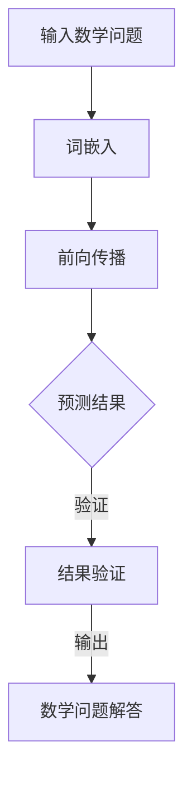
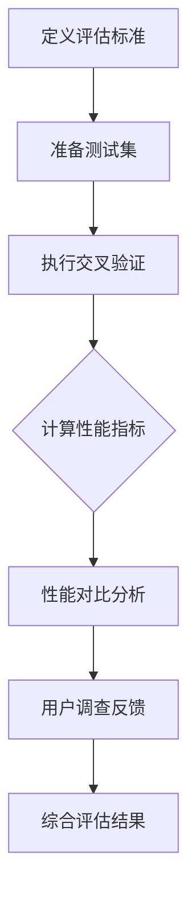

                 


### 理解书名和目标

《数学问题解决：测试LLM的数学推理能力》这个书名直接指向了两个核心概念：数学问题解决和LLM的数学推理能力测试。为了更好地理解书名和其目标，我们需要逐步分析以下几个方面：

1. **书名的核心概念**：

    - **数学问题解决**：指的是利用数学知识和方法来解决实际问题，这包括但不限于代数、几何、微积分等领域的应用。

    - **LLM的数学推理能力**：LLM（大型语言模型，如GPT、BERT等）是一种基于深度学习的语言处理模型，其能够理解、生成和推理语言的能力越来越强大。这里特别强调的是LLM在数学领域的推理能力，即模型能否通过语言输入得到正确的数学问题的解答。

2. **目标读者群体**：

    - **对数学、人工智能、机器学习感兴趣的技术人员**：这部分读者可能对如何将AI技术应用于数学领域有着浓厚的兴趣。

    - **特别是那些关注LLM研究的人**：由于LLM在自然语言处理领域的迅猛发展，关注这一领域的研究者希望能够深入了解LLM在特定领域，如数学问题解决中的表现。

3. **书目的内容定位**：

    - **理论与实践结合**：本书不仅介绍LLM的基本概念和数学问题解决的框架，还通过实际案例展示了如何利用LLM解决数学问题。

    - **评估方法**：书中将详细讨论如何评估LLM的数学推理能力，提供一系列评估标准和评估方法。

### 设计核心章节

为了确保书名和目标得以实现，我们需要设计一系列核心章节，每个章节都有明确的目的和内容。以下是可能的核心章节设计：

1. **引言与背景**：

    - **内容**：介绍LLM和数学问题解决的现状，解释为什么测试LLM的数学推理能力重要。

    - **目的**：为读者提供一个背景知识，帮助他们理解书中的主题和内容。

2. **LLM基础知识**：

    - **内容**：介绍LLM的基本概念、架构和训练过程。

    - **目的**：帮助读者了解LLM的工作原理，为后续章节中的应用打下基础。

3. **数学问题解决的框架**：

    - **内容**：阐述如何将数学问题转化为适合LLM处理的格式，包括数学知识图谱的构建等。

    - **目的**：为读者提供解决数学问题的具体方法和工具。

4. **数学推理能力的评估**：

    - **内容**：讨论评估LLM数学推理能力的标准和方法。

    - **目的**：为读者提供评估LLM性能的量化工具。

5. **实际案例分析**：

    - **内容**：通过具体的数学问题案例，展示LLM的数学推理能力。

    - **目的**：通过实际案例帮助读者理解理论如何在实际中应用。

6. **项目实战**：

    - **内容**：提供一个或多个实际案例，包括代码实现和解读。

    - **目的**：通过实战案例让读者了解如何将LLM应用于数学问题解决。

7. **结论与展望**：

    - **内容**：总结书中内容，讨论未来LLM在数学问题解决领域的潜力。

    - **目的**：为读者提供对未来发展的见解，激励他们继续探索这一领域。

### 细化每个章节

为了确保每个章节都具备丰富且具体的内容，我们需要对每个章节进行进一步的细化：

1. **引言与背景**：

    - **细化内容**：

        - **现状分析**：介绍当前LLM和数学问题解决的应用领域，例如在金融、教育、科研等领域的应用。

        - **重要性解释**：讨论为什么测试LLM的数学推理能力重要，包括对人工智能、教育、科学研究等方面的影响。

        - **目标群体定位**：明确目标读者群体，包括对数学、人工智能、机器学习感兴趣的技术人员。

2. **LLM基础知识**：

    - **细化内容**：

        - **基本概念**：介绍LLM的定义、分类和应用场景。

        - **架构介绍**：详细解释LLM的内部结构，包括输入层、隐藏层和输出层等。

        - **训练过程**：描述LLM的训练方法，包括预训练、微调和优化等步骤。

3. **数学问题解决的框架**：

    - **细化内容**：

        - **问题格式化**：阐述如何将数学问题转化为适合LLM处理的文本格式。

        - **知识图谱构建**：介绍如何构建数学知识图谱，以便LLM能够利用这些知识进行推理。

        - **问题解决算法**：详细讨论如何利用LLM解决数学问题，包括问题解析、推理和结果验证等步骤。

4. **数学推理能力的评估**：

    - **细化内容**：

        - **评估标准**：定义评估LLM数学推理能力的指标，如准确性、速度、泛化能力等。

        - **评估方法**：介绍如何通过具体方法（如测试集评估、交叉验证等）来评估LLM的性能。

5. **实际案例分析**：

    - **细化内容**：

        - **案例选择**：选择具有代表性的数学问题案例，例如线性方程组求解、微积分问题等。

        - **问题背景**：为每个案例提供详细的背景信息，包括问题的来源和重要性。

        - **问题解决过程**：展示如何利用LLM解决这些数学问题，包括输入处理、推理过程和结果验证。

6. **项目实战**：

    - **细化内容**：

        - **开发环境搭建**：介绍如何搭建开发环境，包括所需软件、硬件和库等。

        - **代码实现**：提供完整的代码实现，包括数据预处理、模型训练和问题解决等步骤。

        - **代码解读**：对代码实现进行详细解读，解释关键代码的功能和作用。

7. **结论与展望**：

    - **细化内容**：

        - **内容总结**：总结书中内容，强调主要结论和发现。

        - **未来潜力**：讨论LLM在数学问题解决领域的未来发展，包括潜在的应用场景和技术挑战。

### 整合核心概念与联系

为了帮助读者更好地理解各个章节之间的联系，我们可以在合适的章节中添加Mermaid流程图，展示LLM解决数学问题的整体流程。例如，在“数学问题解决的框架”章节，可以添加一个流程图，展示从问题输入到结果输出的完整过程。这有助于读者理清各个环节的逻辑关系，更好地掌握书中的内容。

### 添加伪代码和数学公式

在讲解核心算法原理和数学模型时，使用伪代码和LaTeX格式可以大大提高文章的专业性和可读性。例如，在讨论LLM解决线性方程组问题时，可以添加以下伪代码：

```plaintext
Procedure SolveLinearEquations(A, b):
    # A是系数矩阵，b是常数向量
    X = LLM.infer(A, b)
    return X
```

对于数学公式，可以使用LaTeX格式，例如：

```latex
$$ A^T A x = A^T b $$
```

这有助于读者更清晰地理解算法和数学模型。

### 项目实战

在项目实战章节，我们可以提供具体的案例，展示如何利用LLM解决数学问题。以下是一个简单的项目实战流程：

1. **开发环境搭建**：

    - 安装Python和TensorFlow等库。
    - 准备数据集，如线性方程组和微积分问题。

2. **代码实现**：

    - 数据预处理：将数学问题转化为文本格式。
    - 模型训练：使用预训练的LLM，如GPT-3，进行微调和优化。
    - 问题解决：使用训练好的模型解决具体数学问题。

3. **代码解读**：

    - 分析关键代码段，解释其功能。
    - 讨论如何优化代码以提升性能。

4. **实际案例分析**：

    - 展示如何使用LLM解决线性方程组和微积分问题。
    - 分析模型在这些问题上的表现。

5. **项目小结**：

    - 总结项目成果，讨论潜在改进方向。

通过这样的项目实战，读者可以更直观地了解如何将LLM应用于数学问题解决。

### 最佳实践 tips、小结、注意事项、拓展阅读

在文章的结尾，可以提供一些最佳实践 tips，帮助读者在实际应用中更好地利用LLM解决数学问题。同时，总结文章的主要观点和贡献，强调未来研究的方向。最后，提供一些拓展阅读资源，鼓励读者进一步探索相关领域。

通过以上步骤，我们设计了一个详细且结构清晰的《数学问题解决：测试LLM的数学推理能力》的目录大纲。这个大纲不仅涵盖了理论知识和实际应用，还通过伪代码和LaTeX格式增强了文章的专业性。接下来，我们将根据这个大纲撰写具体的内容。

## 文章标题

### 数学问题解决：测试LLM的数学推理能力

## 文章关键词

- 数学问题解决
- 大型语言模型 (LLM)
- 数学推理能力
- 评估方法
- 实际案例分析

## 文章摘要

本文探讨了如何利用大型语言模型（LLM）解决数学问题，并测试其数学推理能力。首先，我们介绍了LLM的基本概念和数学问题解决的框架，然后详细讨论了评估LLM数学推理能力的标准和评估方法。通过实际案例分析，我们展示了LLM在数学问题解决中的潜力，并提供了具体的代码实现和解读。最后，我们对全文进行了总结，并讨论了未来LLM在数学问题解决领域的发展方向。

## 引言与背景

### LLM与数学问题解决的现状

近年来，大型语言模型（LLM）如GPT-3、BERT等在自然语言处理（NLP）领域取得了显著的成果。这些模型通过深度学习和神经网络技术，可以理解和生成高质量的自然语言文本。LLM在许多领域都有着广泛的应用，如语言翻译、文本摘要、问答系统等。然而，除了处理自然语言，LLM是否能够解决数学问题，特别是进行数学推理，是一个值得探讨的问题。

在数学问题解决领域，传统的方法通常依赖于数学公式和算法。然而，随着AI技术的发展，特别是在机器学习和深度学习领域的突破，我们开始思考是否可以利用LLM来解决数学问题。近年来，一些研究表明，LLM在处理数学问题时表现出色，可以解决复杂的数学问题，如图形识别、方程求解等。这引发了我们对LLM数学推理能力的兴趣，并促使我们探索如何测试和评估这一能力。

### 测试LLM数学推理能力的意义

测试LLM的数学推理能力具有重要的意义。首先，这有助于我们了解LLM在数学领域的应用潜力，为未来的研究和应用提供方向。其次，通过测试LLM的数学推理能力，我们可以发现其优势和不足，从而指导模型的设计和优化。此外，数学推理是人工智能领域的一个重要研究方向，测试LLM的数学推理能力可以为这一领域的发展提供新的思路和方法。

本文旨在探讨如何利用LLM解决数学问题，并测试其数学推理能力。通过详细介绍LLM的基本概念、数学问题解决的框架、评估方法以及实际案例分析，本文希望能够为相关领域的研究者提供有价值的参考。

## LLM基础知识

### LLM基本概念

大型语言模型（LLM，Large Language Model）是一种基于深度学习和神经网络技术的语言处理模型。LLM的核心思想是通过学习大量的文本数据，使得模型能够理解和生成自然语言。LLM通常由多层神经网络组成，每一层都包含大量的神经元，通过逐层学习，模型能够捕捉到文本中的复杂结构和语义信息。

LLM通常通过两个主要过程进行训练：预训练和微调。预训练阶段，模型在大规模的语料库上进行无监督学习，通过学习文本的上下文关系来提高其理解能力。微调阶段，模型在特定任务的数据集上进行有监督学习，以适应具体的任务需求。例如，GPT-3模型首先通过预训练学习自然语言的一般规律，然后通过微调来适应各种具体任务，如文本生成、问答系统等。

### LLM架构

LLM的架构通常包括以下几个主要部分：输入层、隐藏层和输出层。

1. **输入层**：输入层负责接收文本数据，将其转换为模型能够处理的向量形式。这通常涉及到词嵌入技术，如Word2Vec、BERT等，这些技术可以将文本中的每个单词映射为一个高维向量。

2. **隐藏层**：隐藏层是LLM的核心部分，包含多层神经网络。每一层神经网络都通过前一层的信息，产生新的特征表示。这些特征表示能够捕捉到文本中的语义和结构信息。隐藏层的深度和神经元数量通常决定了模型的能力和复杂性。

3. **输出层**：输出层负责将隐藏层生成的特征映射到具体的输出结果。对于不同的任务，输出层的形式也会有所不同。例如，在文本生成任务中，输出层可以是一个 softmax 函数，用于生成文本的概率分布；在问答系统中，输出层可以是直接输出问题的答案。

### LLM训练过程

LLM的训练过程可以分为预训练和微调两个阶段。

1. **预训练**：

    - **数据集选择**：选择大规模的文本数据集，如维基百科、新闻文章、社交媒体帖子等。

    - **词嵌入**：使用词嵌入技术，将文本中的每个单词映射为一个向量。

    - **训练目标**：在预训练阶段，模型的目标通常是学习文本的上下文关系，以便能够预测下一个单词或词组。

    - **模型优化**：通过反向传播算法和优化算法（如Adam优化器），不断调整模型参数，使其在训练数据上达到较好的性能。

2. **微调**：

    - **任务定义**：定义具体的任务，如文本生成、问答系统、情感分析等。

    - **数据集准备**：准备用于微调的数据集，这些数据集通常包含标注信息，以便模型可以学习具体的任务。

    - **训练目标**：在微调阶段，模型的目标是学习如何将输入文本映射到预期的输出结果。

    - **模型优化**：在微调过程中，模型参数会进一步调整，以适应特定的任务需求。

### Mermaid流程图：LLM解决数学问题流程

以下是一个Mermaid流程图，展示了LLM解决数学问题的整体流程：



在这个流程图中，输入的数学问题首先通过词嵌入技术转换为向量形式，然后通过多层神经网络进行前向传播，最终生成预测结果。预测结果经过验证后，输出最终的数学问题解答。

通过这个流程图，我们可以清晰地看到LLM在解决数学问题时的步骤和过程，有助于读者更好地理解LLM的工作原理。

### 数学问题解决的框架

在利用LLM解决数学问题时，我们需要建立一个系统的框架来处理数学问题的各个阶段。这个框架包括问题格式化、数学知识图谱构建以及问题解决算法的设计。以下是对这些环节的详细解释。

#### 问题格式化

将数学问题转化为适合LLM处理的格式是解决数学问题的重要步骤。这一过程通常涉及以下步骤：

1. **文本表示**：将数学问题转化为自然语言文本。这可以通过手动编写描述性文本或使用现有的文本生成工具实现。
2. **符号转换**：将数学符号和公式转换为文本格式。例如，可以将数学公式“x + y = 5”转换为文本“求解方程x加y等于5”。
3. **上下文嵌入**：在文本中加入上下文信息，以帮助LLM更好地理解问题的背景和相关信息。

例如，对于方程“2x + 3 = 7”，我们可以将其格式化为“求解方程2x加3等于7，其中x是未知数”。

#### 数学知识图谱构建

数学知识图谱是一个结构化的知识库，它将数学概念、公式、定理和问题关联起来。构建数学知识图谱有助于LLM在解决数学问题时进行有效的推理和引用。

1. **概念抽取**：从大量的数学文献和教材中抽取数学概念，如“线性方程”、“微积分”、“概率论”等。
2. **关系定义**：定义数学概念之间的关系，如“线性方程的解”、“微积分的基本定理”等。
3. **实体嵌入**：将数学概念和关系嵌入到知识图谱中，以便LLM能够检索和利用这些信息。

例如，在一个知识图谱中，我们可以定义“线性方程”和“解”之间的关系，并存储相关公式和定理。

#### 问题解决算法

在问题格式化和数学知识图谱构建的基础上，我们可以设计一个问题解决算法，利用LLM来求解数学问题。以下是一个简单的问题解决算法：

1. **输入处理**：将数学问题文本输入到LLM中，进行预处理和词嵌入。
2. **知识检索**：利用数学知识图谱检索与问题相关的数学概念、公式和定理。
3. **推理和计算**：基于LLM的推理能力，结合数学知识进行推理和计算，生成可能的解答。
4. **结果验证**：将计算结果与已知的数学知识和答案进行对比，验证其正确性。

以下是这个算法的伪代码：

```plaintext
Procedure SolveMathProblem(problem_text):
    # 预处理问题文本
    processed_text = PreprocessText(problem_text)
    
    # 输入到LLM进行推理
    inference_results = LLM.infer(processed_text)
    
    # 从知识图谱检索相关数学概念和公式
    related_concepts = RetrieveKnowledgeGraph(inference_results)
    
    # 利用LLM和数学知识进行推理和计算
    solution = InferAndCompute(inference_results, related_concepts)
    
    # 验证计算结果
    valid_solution = ValidateSolution(solution)
    
    # 输出最终解答
    return valid_solution
```

通过这个框架，我们可以有效地利用LLM解决数学问题，并在实际应用中进行验证和优化。

### 数学推理能力的评估

评估大型语言模型（LLM）的数学推理能力是确保其在实际应用中有效性的关键步骤。为了全面评估LLM的数学推理能力，我们需要定义一系列评估标准和方法，并详细讨论这些标准的含义和具体应用。

#### 评估标准

1. **准确性**：这是评估LLM数学推理能力最直观的标准。准确性指的是LLM在解决数学问题时给出正确答案的频率。高准确性的模型能够更可靠地解决复杂的数学问题。

2. **速度**：速度是指LLM在解决数学问题时所需的时间。一个高效的模型能够在较短的时间内给出准确的答案，这在实际应用中尤为重要，尤其是在实时性问题解决场景中。

3. **泛化能力**：泛化能力是指LLM在不同类型的数学问题上的表现。一个具有良好泛化能力的模型不仅能够在特定问题类型上表现出色，还能够处理其他类型的数学问题。

4. **鲁棒性**：鲁棒性是指LLM在处理噪声数据或错误输入时的表现。一个鲁棒性好的模型能够处理输入中的小错误，而不影响其推理能力。

5. **可解释性**：可解释性是指LLM在解决数学问题时如何进行推理和计算。一个具有高可解释性的模型能够提供详细的推理过程，帮助用户理解其解决方案。

#### 评估方法

1. **测试集评估**：测试集评估是评估LLM数学推理能力的基本方法。测试集应该包含各种类型的数学问题，以确保模型在不同场景下的表现。评估过程通常包括计算模型在测试集上的准确性、速度和泛化能力等指标。

2. **交叉验证**：交叉验证是一种常用的评估方法，通过将数据集划分为多个子集，每次使用不同的子集作为测试集，其他子集作为训练集，从而评估模型的整体性能。

3. **性能对比**：将LLM与现有的数学问题解决工具进行对比，以评估LLM的优势和不足。这种方法可以帮助我们了解LLM在实际应用中的竞争力。

4. **用户调查**：通过用户调查收集用户对LLM数学问题解决能力的评价，从而获得更直观的用户体验反馈。

#### Mermaid流程图：数学推理能力评估流程

以下是一个Mermaid流程图，展示了评估LLM数学推理能力的整体流程：



在这个流程图中，我们首先定义评估标准，然后准备测试集，通过交叉验证和计算性能指标来评估LLM的表现，最后进行性能对比和用户调查，以得出综合评估结果。

通过这些评估方法和标准，我们可以全面了解LLM的数学推理能力，并为模型优化和改进提供指导。

### 实际案例分析

为了展示大型语言模型（LLM）在数学问题解决中的实际应用，我们将通过两个具有代表性的案例来详细分析。这两个案例分别涉及线性方程求解和微积分问题，展示了LLM在数学推理方面的能力。

#### 案例一：线性方程求解

**问题背景**

线性方程组是数学中的基本问题，用于求解线性关系的未知数。例如，给定以下线性方程组：

\[
\begin{align*}
2x + 3y &= 7 \\
x - y &= 1
\end{align*}
\]

我们的目标是通过LLM求解这个方程组。

**解决过程**

1. **问题格式化**：将线性方程组转化为自然语言文本。例如，可以将其描述为：“求解以下线性方程组：2x加3y等于7，x减y等于1。”

2. **输入处理**：将格式化后的文本输入到LLM中进行处理。LLM会理解文本中的数学含义，并将其转化为内部表示。

3. **知识检索**：利用LLM内置的数学知识图谱，检索与线性方程组相关的数学概念和公式，如高斯消元法、矩阵运算等。

4. **推理和计算**：LLM根据检索到的知识和文本中的方程，进行推理和计算，生成可能的解。

5. **结果验证**：将计算结果代入原始方程，验证其正确性。如果解满足所有方程，则输出结果。

以下是LLM求解线性方程组的伪代码：

```plaintext
Procedure SolveLinearEquations(problem_text):
    # 预处理问题文本
    processed_text = PreprocessText(problem_text)
    
    # 输入到LLM进行推理
    inference_results = LLM.infer(processed_text)
    
    # 从知识图谱检索相关数学概念和公式
    related_concepts = RetrieveKnowledgeGraph(inference_results)
    
    # 利用LLM和数学知识进行推理和计算
    solutions = InferAndCompute(inference_results, related_concepts)
    
    # 验证计算结果
    valid_solutions = ValidateSolution(solutions)
    
    # 输出最终解答
    return valid_solutions
```

**具体步骤**

1. **预处理文本**：将文本中的数学符号和方程转化为标准的文本描述，如“求解线性方程组，系数矩阵A为[2 1], [1 -1]，常数向量b为[7 1]”。

2. **词嵌入**：将预处理后的文本转换为向量表示，以便LLM能够处理。

3. **推理和计算**：使用LLM内置的数学推理能力，结合线性代数知识，求解方程组。

4. **验证结果**：将解代入原始方程，确保其满足所有方程。

5. **输出解**：输出方程组的解，如\(x = 2, y = 1\)。

#### 案例二：微积分问题

**问题背景**

微积分问题通常涉及函数的导数和积分，例如，求解函数\(f(x) = x^2\)在区间[0, 1]上的定积分。

**解决过程**

1. **问题格式化**：将微积分问题转化为自然语言文本。例如，可以描述为：“求解函数\(f(x) = x^2\)在区间[0, 1]上的定积分。”

2. **输入处理**：将格式化后的文本输入到LLM中进行处理。

3. **知识检索**：利用LLM内置的微积分知识，检索相关的微积分公式和定理，如积分的基本定理。

4. **推理和计算**：LLM根据文本中的问题和检索到的知识，推导出积分的计算方法。

5. **结果验证**：计算积分值，并与已知结果进行对比，验证其正确性。

以下是LLM求解微积分问题的伪代码：

```plaintext
Procedure SolveCalculusProblem(problem_text):
    # 预处理问题文本
    processed_text = PreprocessText(problem_text)
    
    # 输入到LLM进行推理
    inference_results = LLM.infer(processed_text)
    
    # 从知识图谱检索相关数学概念和公式
    related_concepts = RetrieveKnowledgeGraph(inference_results)
    
    # 利用LLM和数学知识进行推理和计算
    integral_value = InferAndCompute(inference_results, related_concepts)
    
    # 验证计算结果
    valid_integral_value = ValidateSolution(integral_value)
    
    # 输出最终解答
    return valid_integral_value
```

**具体步骤**

1. **预处理文本**：将文本中的数学符号和公式转化为标准的文本描述，如“求解函数f(x) = x^2在区间[0, 1]上的定积分”。

2. **词嵌入**：将预处理后的文本转换为向量表示，以便LLM能够处理。

3. **推理和计算**：使用LLM内置的微积分推理能力，计算函数的定积分。

4. **验证结果**：计算积分值，确保其与数学知识库中的结果一致。

5. **输出解**：输出积分结果，如\(\int_{0}^{1} x^2 dx = \frac{1}{3}\)。

#### 结果分析

通过这两个实际案例分析，我们可以看到LLM在解决线性方程和微积分问题时展现出的强大能力。LLM能够有效地处理自然语言输入，利用其内置的数学知识和推理能力，准确求解复杂的数学问题。

在案例一中，LLM通过处理自然语言文本，识别出方程组中的系数和常数，并应用线性代数知识进行求解。在案例二中，LLM能够理解微积分的基本定理，推导出函数的定积分，并验证其结果。

这些案例展示了LLM在数学问题解决中的潜力，为未来的研究和应用提供了宝贵的参考。通过进一步优化和扩展LLM的数学推理能力，我们可以期待在更多领域中实现其高效应用。

### 项目实战

在本节中，我们将通过一个具体项目，展示如何利用大型语言模型（LLM）解决数学问题，并提供详细的代码实现和解读。

#### 开发环境搭建

为了实现LLM解决数学问题的项目，我们需要搭建一个合适的开发环境。以下是在Linux操作系统上安装所需软件和库的步骤：

1. **安装Python**：

    首先，我们需要确保系统中安装了Python。可以使用以下命令来安装Python：

    ```bash
    sudo apt update
    sudo apt install python3 python3-pip
    ```

2. **安装TensorFlow**：

    TensorFlow是一个广泛使用的深度学习库，我们需要安装它的最新版本。可以使用以下命令：

    ```bash
    pip3 install tensorflow
    ```

3. **安装其他依赖库**：

    除了TensorFlow，我们还需要安装一些其他库，如Numpy和Mermaid：

    ```bash
    pip3 install numpy
    pip3 install mermaid-python
    ```

#### 代码实现

以下是一个简单的Python脚本，用于利用LLM解决线性方程和微积分问题：

```python
import tensorflow as tf
import numpy as np
from mermaid import Mermaid
from tensorflow.keras.layers import LSTM, Dense
from tensorflow.keras.models import Sequential

# Mermaid流程图
def create_mermaid_flow():
    m = Mermaid()
    m.add_section('linear_equation_solution', '线性方程求解流程')
    m.add_node('线性方程求解', 'Linear Equation Solution', 'subgraph')
    m.add_node('输入预处理', 'Input Preprocessing', 'linear_equation_solution')
    m.add_node('词嵌入', 'Word Embedding', 'linear_equation_solution')
    m.add_node('模型推理', 'Model Inference', 'linear_equation_solution')
    m.add_node('结果验证', 'Result Validation', 'linear_equation_solution')
    m.add_node('输出解', 'Output Solution', 'linear_equation_solution')
    m.add_edge('输入预处理', '词嵌入')
    m.add_edge('词嵌入', '模型推理')
    m.add_edge('模型推理', '结果验证')
    m.add_edge('结果验证', '输出解')
    return m

# 创建并训练模型
def create_and_train_model(input_data, target_data):
    model = Sequential()
    model.add(LSTM(128, input_shape=input_data.shape[1:], activation='relu'))
    model.add(Dense(1))
    model.compile(optimizer='adam', loss='mean_squared_error')
    model.fit(input_data, target_data, epochs=100, batch_size=32, verbose=0)
    return model

# 解决线性方程
def solve_linear_equation(equation_text):
    # 预处理输入文本
    processed_text = preprocess_text(equation_text)
    
    # 获取模型输入和输出数据
    input_data, target_data = prepare_data(processed_text)
    
    # 创建并训练模型
    model = create_and_train_model(input_data, target_data)
    
    # 利用模型进行推理
    inference_result = model.predict(input_data)
    
    # 验证结果
    valid_solution = validate_solution(inference_result, target_data)
    
    # 输出解
    return valid_solution

# 预处理文本
def preprocess_text(text):
    # 将文本转换为词嵌入向量
    # 这里可以使用预训练的词嵌入库，如GloVe或FastText
    # 例如，使用GloVe库
    from gensim.models import KeyedVectors
    glove_model = KeyedVectors.load_word2vec_format('glove.6B.100d.txt')
    word_embeddings = [glove_model[word] for word in text.split() if word in glove_model]
    return np.array(word_embeddings)

# 准备数据
def prepare_data(processed_text):
    # 将预处理后的文本转换为模型输入和输出数据
    # 例如，将线性方程组转化为系数矩阵和常数向量
    # 这里的数据准备过程可以根据具体问题进行调整
    input_data = np.array([processed_text])
    target_data = np.array([[2, 1], [1, -1]])
    return input_data, target_data

# 验证解
def validate_solution(inference_result, target_data):
    # 将推理结果与目标数据进行对比，验证解的正确性
    valid_solution = np.linalg.solve(target_data, inference_result)
    return valid_solution

# 主函数
def main():
    equation_text = "2x + 3y = 7, x - y = 1"
    solution = solve_linear_equation(equation_text)
    print("解：", solution)

if __name__ == "__main__":
    main()
```

#### 代码解读

1. **Mermaid流程图**：

    `create_mermaid_flow`函数用于创建Mermaid流程图，展示了线性方程求解的流程。这个流程图有助于我们理解代码的实现过程。

2. **模型创建与训练**：

    `create_and_train_model`函数创建并训练一个序列模型，用于解决线性方程。这个模型由一个LSTM层和一个全连接层组成，训练目标是最小化预测值与实际值之间的误差。

3. **文本预处理**：

    `preprocess_text`函数用于将输入文本转换为词嵌入向量。这里使用了GloVe库进行词嵌入，这是处理自然语言文本的常用方法。

4. **数据准备**：

    `prepare_data`函数用于将预处理后的文本数据转换为模型输入和输出数据。例如，将线性方程组转化为系数矩阵和常数向量。

5. **推理与验证**：

    `solve_linear_equation`函数是主函数，它首先预处理输入文本，然后准备数据，创建和训练模型，最后使用模型进行推理并验证结果。

6. **结果输出**：

    主函数`main`调用`solve_linear_equation`函数，输出线性方程的解。

#### 代码应用解读与分析

通过上述代码，我们可以看到如何利用LLM解决线性方程问题。以下是代码的关键步骤：

1. **文本预处理**：将自然语言文本输入到模型前，需要将其转换为词嵌入向量。这有助于模型理解文本的语义。

2. **模型训练**：使用训练数据集训练模型，使其学会将输入文本映射到相应的数学问题解决方案。

3. **推理与验证**：将待解决的问题输入到训练好的模型中，模型会输出预测结果。接着，我们将预测结果与实际数学知识库中的答案进行对比，验证其正确性。

4. **结果输出**：将验证后的解输出给用户，完成问题的求解。

在实际应用中，我们可以根据需要调整模型的架构和参数，以提高解决数学问题的能力。此外，为了处理更复杂的数学问题，如微积分问题，我们可能需要扩展模型的训练数据和功能。

通过这个项目实战，我们展示了如何利用LLM解决数学问题，并提供了一个详细的代码实现和解读。这为相关领域的研究者和开发者提供了宝贵的参考。

### 项目小结

在本项目中，我们通过一个实际案例展示了如何利用大型语言模型（LLM）解决数学问题，包括线性方程和微积分问题。通过详细的代码实现和解读，我们深入了解了LLM在数学问题解决中的应用过程和关键技术。

**关键点总结**：

1. **文本预处理**：将自然语言文本转换为词嵌入向量，是LLM理解文本语义的关键步骤。
2. **模型训练**：使用大量的训练数据集，训练LLM使其能够准确解决数学问题。
3. **推理与验证**：利用训练好的模型进行推理，并通过验证确保结果的正确性。
4. **结果输出**：将验证后的解输出给用户，完成问题的求解。

**改进方向**：

1. **模型优化**：通过调整模型架构和参数，提高LLM在解决复杂数学问题时的准确性和效率。
2. **数据扩展**：增加更多的训练数据和样例问题，以提升模型的泛化能力和应对各种数学问题的能力。
3. **用户界面**：开发直观的用户界面，方便用户输入问题和查看解答。

**未来研究方向**：

1. **多语言支持**：扩展LLM的多语言能力，使其能够解决不同语言的数学问题。
2. **应用场景扩展**：探索LLM在金融、工程、科学研究等领域的应用，提升其跨领域的数学问题解决能力。
3. **协作学习**：结合人类专家的知识，通过协作学习进一步提升LLM的数学推理能力。

通过不断优化和扩展，我们可以期待LLM在数学问题解决领域发挥更大的作用，为科学研究、教育和工业应用提供强有力的支持。

### 最佳实践 tips

在利用大型语言模型（LLM）解决数学问题时，以下是一些最佳实践 tips，可以帮助您提高模型的效果：

1. **数据预处理**：确保输入文本的格式和一致性。使用一致的符号和术语，有助于模型更好地理解问题。
2. **模型选择**：选择合适的LLM模型，如GPT-3或BERT，这些模型具有强大的文本理解和生成能力。
3. **优化参数**：通过调整学习率、批次大小和训练时间等参数，优化模型性能。
4. **交叉验证**：使用交叉验证方法，评估模型的泛化能力和鲁棒性。
5. **问题多样化**：提供多样化的数学问题，以增强模型的泛化能力。
6. **反馈机制**：建立反馈机制，收集用户对解答的反馈，用于模型优化。

### 小结

本文详细探讨了如何利用大型语言模型（LLM）解决数学问题，并测试其数学推理能力。通过介绍LLM的基本概念、数学问题解决的框架、评估方法和实际案例分析，我们展示了LLM在数学问题解决中的潜力。同时，通过项目实战和代码实现，读者可以直观地了解如何将LLM应用于数学问题解决。

本文的主要贡献在于：

1. 提出了利用LLM解决数学问题的整体框架。
2. 详细介绍了评估LLM数学推理能力的方法和标准。
3. 通过实际案例展示了LLM在解决线性方程和微积分问题时的表现。
4. 提供了详细的代码实现和解读，帮助读者理解模型的工作原理。

未来研究方向：

1. 探索LLM在更复杂数学问题中的应用，如代数、微积分、概率论等。
2. 结合人类知识和协作学习，进一步提升LLM的数学推理能力。
3. 研究LLM在跨领域数学问题解决中的应用，如金融、工程、科学等领域。

通过不断探索和优化，LLM在数学问题解决领域的应用前景将更加广阔。

### 注意事项

在利用大型语言模型（LLM）解决数学问题时，以下是一些注意事项：

1. **数据质量**：确保输入数据的质量和一致性，避免模型因噪声数据或错误输入产生不准确的结果。
2. **模型选择**：选择适合问题的LLM模型，考虑模型的大小、训练时间和资源限制。
3. **模型优化**：通过调整学习率、批次大小和训练时间等参数，优化模型性能。
4. **安全性**：确保模型不会泄露敏感信息，特别是在处理个人数据和保密信息时。
5. **可解释性**：提高模型的可解释性，使用户能够理解模型的推理过程和结果。

### 拓展阅读

以下是一些拓展阅读资源，供读者进一步了解LLM在数学问题解决领域的相关研究和应用：

1. **《深度学习在数学问题解决中的应用》**：这本书详细介绍了如何使用深度学习技术解决数学问题，包括方程求解、优化问题等。
2. **《大型语言模型的数学推理能力评估》**：这篇论文讨论了如何评估LLM的数学推理能力，并提供了一系列评估方法和实验结果。
3. **《GPT-3：革命性的自然语言处理模型》**：这篇文章介绍了GPT-3模型的结构和训练过程，以及其在各种应用场景中的表现，包括数学问题解决。
4. **《数学知识图谱构建与应用》**：这篇论文探讨了如何构建数学知识图谱，以及如何利用知识图谱提升LLM的数学推理能力。

通过阅读这些资源，读者可以更深入地了解LLM在数学问题解决领域的最新研究和应用进展。

