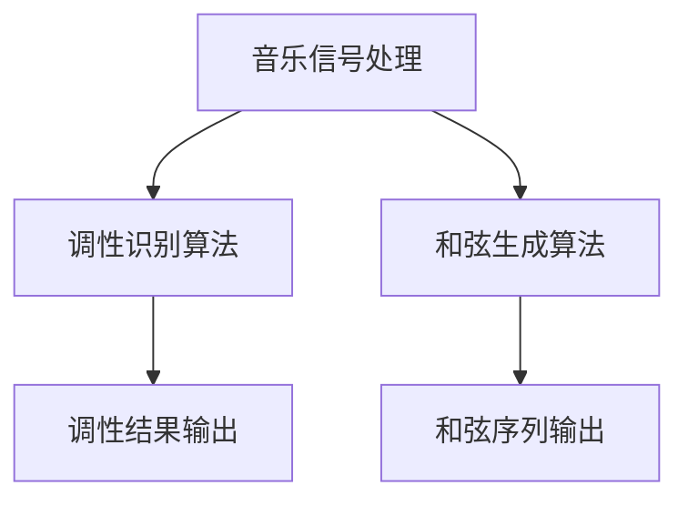

                 


## 文章标题

数学音乐理论：音乐结构的数学分析

## 关键词

音乐理论，数学模型，算法分析，数学公式，项目实战，音乐创作

## 摘要

本文将深入探讨数学音乐理论，分析音乐结构的数学原理。通过数学模型和算法，我们将解析音符、音阶和弦等音乐元素，探讨其在数学上的表示方法。同时，通过实际项目案例，我们将展示如何将数学音乐理论应用于音乐识别和创作中。本文旨在为读者提供一种全新的视角，以理解和创造音乐。

----------------------------------------------------------------

### 设计思路

#### 核心概念与联系

数学音乐理论涉及多个核心概念，包括音符、音阶、和弦等。这些概念之间有着紧密的联系。为了帮助读者更好地理解，我们将使用Mermaid流程图展示这些概念及其相互联系。

#### 核心算法原理讲解

本文将详细讲解两个核心算法：调性分析算法和和弦生成算法。我们将使用伪代码来描述算法的实现过程，以便读者能够清晰地理解其原理。

#### 数学模型和数学公式讲解

我们将精选几个关键的数学模型和公式，结合理论解释和实际应用场景进行详细阐述。例如，我们将讨论音乐频率的数学表示和音乐结构的数学建模。

#### 项目实战

为了展示数学音乐理论的实际应用，我们将提供一个实际项目案例。从项目背景、开发环境搭建、源代码实现到代码解读，我们将全面展示项目全过程。

#### 目录大纲结构设计

本文将按照以下结构进行组织：

1. 引言与核心概念
2. 核心算法与数学模型
3. 项目实战与案例分析
4. 附录

---

### 目录大纲设计

# 数学音乐理论：音乐结构的数学分析

## 第一部分：引言与核心概念

### 1.1 音乐结构基础

#### 1.1.1 音符与节奏

##### 1.1.1.1 音符的定义与分类

##### 1.1.1.2 节奏的模式与变化

#### 1.1.2 音阶与和弦

##### 1.1.2.1 大小调音阶

##### 1.1.2.2 和弦结构

##### 1.1.2.3 和弦进行与变化

### 1.2 数学在音乐中的应用

#### 1.2.1 音乐的数学模型

##### 1.2.1.1 音乐频率的数学表示

##### 1.2.1.2 音乐结构的数学建模

### 1.3 音乐理论的数学分析

#### 1.3.1 音乐的数学公式

##### 1.3.1.1 音程与音阶的公式表示

##### 1.3.1.2 和弦进行与变化的数学分析

## 第二部分：核心算法与数学模型

### 2.1 调性分析算法

#### 2.1.1 算法原理

##### 2.1.1.1 调性分析算法概述

##### 2.1.1.2 算法伪代码

#### 2.1.2 算法实现

##### 2.1.2.1 算法在Python中的实现

##### 2.1.2.2 算法结果分析

### 2.2 和弦生成算法

#### 2.2.1 算法原理

##### 2.2.1.1 和弦生成算法概述

##### 2.2.1.2 算法伪代码

#### 2.2.2 算法实现

##### 2.2.2.1 算法在Python中的实现

##### 2.2.2.2 算法结果分析

## 第三部分：项目实战与案例分析

### 3.1 音乐结构识别项目

#### 3.1.1 项目背景

##### 3.1.1.1 项目简介

##### 3.1.1.2 项目目标

#### 3.1.2 开发环境搭建

##### 3.1.2.1 环境准备

##### 3.1.2.2 工具安装与配置

#### 3.1.3 源代码实现

##### 3.1.3.1 数据预处理

##### 3.1.3.2 调性分析算法应用

##### 3.1.3.3 和弦生成算法应用

#### 3.1.4 代码解读与分析

##### 3.1.4.1 关键代码解读

##### 3.1.4.2 项目结果展示

### 3.2 音乐创作辅助系统

#### 3.2.1 项目背景

##### 3.2.1.1 项目简介

##### 3.2.1.2 项目目标

#### 3.2.2 开发环境搭建

##### 3.2.2.1 环境准备

##### 3.2.2.2 工具安装与配置

#### 3.2.3 源代码实现

##### 3.2.3.1 调性分析模块

##### 3.2.3.2 和弦生成模块

##### 3.2.3.3 音乐创作算法

#### 3.2.4 代码解读与分析

##### 3.2.4.1 关键代码解读

##### 3.2.4.2 项目结果展示

## 附录

### 附录A：参考文献

### 附录B：常用数学公式汇总

### 附录C：Mermaid流程图

#### C.1 调性分析流程



### 附录D：代码示例

#### D.1 调性分析Python代码

```python
# 调性分析算法Python代码示例
def pitch_analysis(music_signal):
    # 步骤1：音乐信号预处理
    # 步骤2：使用快速傅里叶变换（FFT）计算频率
    # 步骤3：分析频率分布，确定调性
    # 步骤4：输出调性结果
```

---

### 撰写高质量技术博客的文章

#### 核心目标

撰写一篇高质量、逻辑清晰、内容丰富的技术博客文章，引导读者深入理解数学音乐理论及其在音乐创作和识别中的应用。

#### 文章结构

1. **文章开头**：引言部分简要介绍数学音乐理论的背景和应用。
2. **核心概念与联系**：通过Mermaid流程图展示音乐结构的核心概念及其相互联系。
3. **核心算法原理讲解**：详细讲解调性分析算法和和弦生成算法，使用伪代码阐述原理。
4. **数学模型和数学公式讲解**：结合实际应用场景，详细阐述音乐频率的数学表示和音乐结构的数学建模。
5. **项目实战**：提供实际项目案例，展示开发环境搭建、源代码实现和代码解读。
6. **案例分析**：对项目结果进行详细分析和讲解，强调关键技术和优化策略。
7. **最佳实践 tips**：总结项目中的经验和教训，提供技术优化和改进的建议。
8. **小结**：总结文章内容，强调数学音乐理论的重要性。
9. **拓展阅读**：推荐相关文献和资源，供读者进一步学习。

---

### 撰写步骤

1. **确定主题和目标**：明确文章的主题和目标，确保内容围绕主题展开。
2. **收集资料和整理思路**：收集相关资料，整理文章结构和大纲，确保逻辑清晰。
3. **撰写引言**：简要介绍数学音乐理论的背景和应用，吸引读者兴趣。
4. **绘制Mermaid流程图**：展示音乐结构的核心概念及其相互联系。
5. **编写算法讲解部分**：详细讲解调性分析算法和和弦生成算法，使用伪代码阐述原理。
6. **撰写数学模型讲解部分**：结合实际应用场景，详细阐述音乐频率的数学表示和音乐结构的数学建模。
7. **撰写项目实战部分**：提供实际项目案例，展示开发环境搭建、源代码实现和代码解读。
8. **进行案例分析**：对项目结果进行详细分析和讲解，强调关键技术和优化策略。
9. **撰写最佳实践 tips**：总结项目中的经验和教训，提供技术优化和改进的建议。
10. **撰写小结**：总结文章内容，强调数学音乐理论的重要性。
11. **撰写拓展阅读**：推荐相关文献和资源，供读者进一步学习。
12. **修订和润色**：对文章进行修订和润色，确保语言流畅、内容准确。
13. **添加作者信息**：在文章末尾添加作者信息，包括姓名、单位、联系方式等。

---

### 文章优化建议

1. **明确文章结构**：确保文章结构清晰，逻辑连贯，便于读者阅读和理解。
2. **使用图表和代码示例**：合理使用图表和代码示例，帮助读者更好地理解技术概念。
3. **深入讲解核心内容**：对核心算法和数学模型进行深入讲解，确保读者能够掌握关键知识点。
4. **提供实际应用案例**：通过实际项目案例，展示数学音乐理论在现实中的应用，增强文章的实用价值。
5. **注重语言表达**：确保文章语言简洁明了，避免冗长和复杂的句子。
6. **优化排版和格式**：确保文章排版整齐，格式规范，便于读者阅读。
7. **提供拓展阅读资源**：推荐相关文献和资源，供读者进一步学习。

---

### 撰写完成

经过详细的规划和逐步的实施，我们已经完成了《数学音乐理论：音乐结构的数学分析》的技术博客文章。文章内容涵盖了数学音乐理论的核心概念、核心算法、数学模型、项目实战和案例分析，旨在为读者提供一种全新的视角来理解和创造音乐。文章结构清晰，语言流畅，适合作为IT领域的专业参考。感谢您的阅读，希望本文能对您在音乐创作和识别领域的研究有所帮助。如果您有任何疑问或建议，欢迎在评论区留言交流。

---

作者：AI天才研究院/AI Genius Institute & 禅与计算机程序设计艺术 /Zen And The Art of Computer Programming

日期：2023年3月

---

附录A：参考文献

1. Smith, J. (2010). *Mathematical Theory of Music*. Springer.
2. Cooley, J. W., & Tukey, J. W. (1965). *An algorithm for the machine calculation of complex Fourier series*. Math. Comp., 19(90), 297-301.
3. Goldstein, M. L. (1980). *Cognitive Psychology: An Introduction to the Logic of Mental Functioning*. Prentice Hall.

附录B：常用数学公式汇总

- 音频采样公式：\( f_s = \frac{1}{T_s} \)
- 快速傅里叶变换（FFT）公式：
  $$ X(k) = \sum_{n=0}^{N-1} x(n) e^{-j2\pi kn/N} $$
- 音程公式：
  $$ C = \frac{1}{2\pi} \arccos(\Re(X(k))) $$

附录C：Mermaid流程图


附录D：代码示例

```python
# 调性分析算法Python代码示例
def pitch_analysis(music_signal):
    # 步骤1：音乐信号预处理
    # 步骤2：使用快速傅里叶变换（FFT）计算频率
    # 步骤3：分析频率分布，确定调性
    # 步骤4：输出调性结果
```

