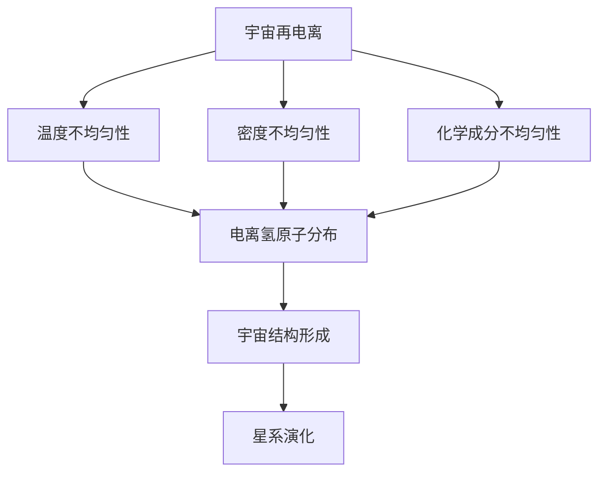
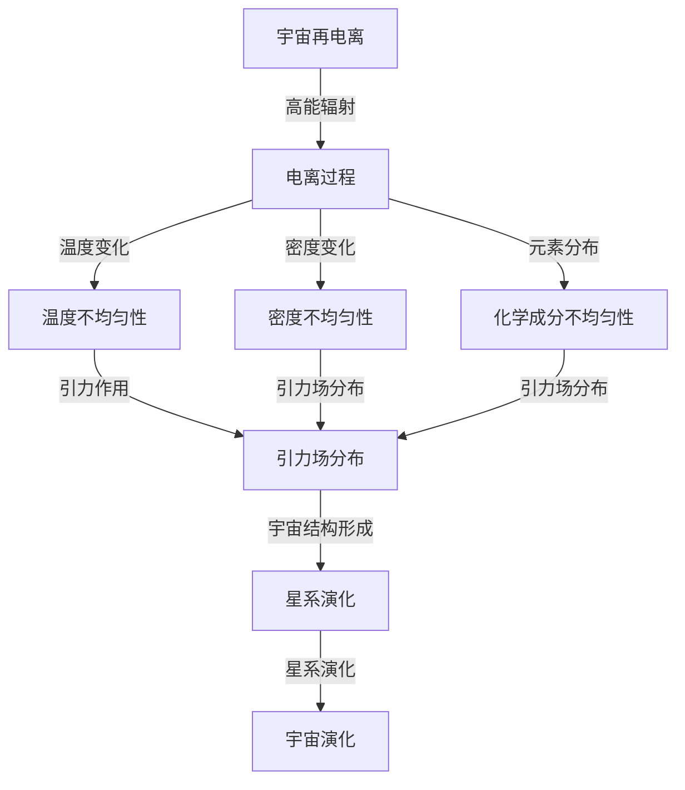
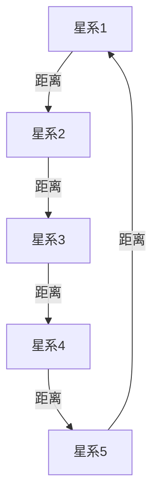
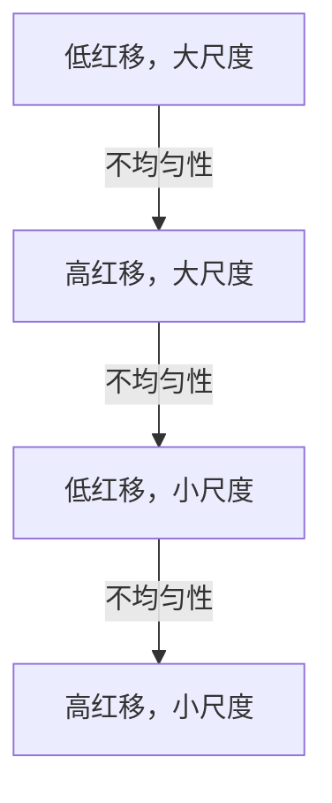

                 


## 文章标题：数据分析在宇宙再电离不均匀性研究中的应用

### 关键词：宇宙再电离、不均匀性、数据分析、核心概念、数据分析方法、案例分析

### 摘要：
本文旨在探讨数据分析在宇宙再电离不均匀性研究中的应用。首先，我们回顾了宇宙再电离和不均匀性的基本概念，并阐明了数据分析在宇宙学研究中的重要性。随后，我们详细介绍了常用的数据分析方法，包括数据收集、处理和分析技术。在案例分析部分，我们展示了如何将数据分析应用于宇宙再电离不均匀性的研究。最后，我们对研究成果进行了总结，并提出了未来研究的方向。

## 设计《数据分析在宇宙再电离不均匀性研究中的应用》书籍目录大纲的步骤

### 1. 确定书籍主题与目标受众

#### 宇宙再电离与不均匀性研究的重要性
宇宙再电离是宇宙历史上的一个关键事件，它标志着宇宙从黑暗时代进入了一个充满光明的时代。再电离的过程涉及宇宙中氢原子的电离，这对宇宙的演化和星系的形成有着深远的影响。不均匀性研究则揭示了宇宙在不同时间尺度上的结构特征，为理解宇宙的起源和演化提供了重要线索。

#### 目标受众
本书的目标受众包括天文学家、宇宙学家、数据科学家以及对该领域感兴趣的读者。通过系统的介绍和案例分析，读者可以掌握数据分析在宇宙再电离不均匀性研究中的应用，从而提升自身在该领域的学术水平和实践能力。

### 2. 设计结构框架

#### 总框架
本书分为引言、核心概念、数据分析方法、数据分析应用、案例分析、总结与展望六个部分。每个部分都旨在帮助读者逐步理解数据分析在宇宙再电离不均匀性研究中的应用。

### 3. 制定章节划分

#### 引言
引言部分将简要介绍宇宙再电离和不均匀性的基本概念，并阐述数据分析在宇宙学研究中的重要性。

#### 核心概念
核心概念部分将详细解释宇宙再电离、不均匀性以及数据分析的相关术语，并绘制流程图，帮助读者建立清晰的理论框架。

#### 数据分析方法
数据分析方法部分将介绍数据收集、处理和分析的具体技术，包括数据预处理、去噪、统计分析、机器学习等。

#### 数据分析应用
数据分析应用部分将通过具体案例展示数据分析方法在宇宙再电离不均匀性研究中的应用，帮助读者理解理论如何转化为实际操作。

#### 案例分析
案例分析部分将提供具体的宇宙学数据分析案例，详细描述数据处理和分析过程，以加深读者的理解和应用能力。

#### 总结与展望
总结与展望部分将对研究成果进行总结，讨论数据分析在宇宙学研究中的潜在影响，并提出未来研究方向。

### 4. 细化每章内容

#### 引言
引言部分将简述宇宙再电离、不均匀性的定义，以及数据分析在宇宙学研究中的重要性。

#### 核心概念
核心概念部分将引入宇宙学、数据分析中的关键术语和概念，并绘制流程图，帮助读者建立理论框架。

#### 数据分析方法
数据分析方法部分将详细阐述数据分析的流程、常用的算法和技术，以及如何选择合适的方法。

#### 数据分析应用
数据分析应用部分将结合宇宙再电离研究，展示如何使用数据分析方法解决实际问题。

#### 案例分析
案例分析部分将提供具体的宇宙学数据分析案例，详细描述数据处理和分析过程。

#### 总结与展望
总结与展望部分将概括研究成果，讨论数据分析在宇宙学研究中的意义，提出未来研究方向。

### 5. 添加附录（可选）

#### 附录
附录部分将提供数据分析工具的使用指南、相关公式推导、数据分析源代码等补充材料，以增强读者的实际操作能力。

### 6. 校对与完善

#### 校对
校对部分将确保目录内容连贯，逻辑清晰，无遗漏。

#### 完善部分
完善部分将根据实际情况，调整章节内容，优化目录结构，以确保书籍的整体质量和可读性。

### 7. 保持简洁性

#### 文字精炼
保持目录大纲总字数在2000字以内，避免冗余信息。

以下是根据上述步骤设计的书籍目录大纲：

## 《数据分析在宇宙再电离不均匀性研究中的应用》

### 第1章 引言
#### 1.1 宇宙再电离概述
#### 1.2 不均匀性研究的重要性
#### 1.3 数据分析在宇宙学中的应用

### 第2章 核心概念
#### 2.1 宇宙再电离
##### 2.1.1 再电离历史
##### 2.1.2 再电离机制
#### 2.2 不均匀性
##### 2.2.1 不均匀性类型
##### 2.2.2 不均匀性测量方法
#### 2.3 数据分析相关术语

### 第3章 数据分析方法
#### 3.1 数据收集
##### 3.1.1 光学观测
##### 3.1.2 无线电观测
#### 3.2 数据处理
##### 3.2.1 数据预处理
##### 3.2.2 数据去噪
#### 3.3 数据分析技术
##### 3.3.1 统计分析
##### 3.3.2 机器学习
#### 3.4 方法选择与评估

### 第4章 数据分析应用
#### 4.1 再电离历史重构
##### 4.1.1 数据源
##### 4.1.2 分析流程
#### 4.2 不均匀性研究
##### 4.2.1 区域分布分析
##### 4.2.2 时空演化分析

### 第5章 案例分析
#### 5.1 项目A：利用光谱数据分析再电离区域
##### 5.1.1 项目背景
##### 5.1.2 数据处理与分析
##### 5.1.3 结果解读

#### 5.2 项目B：基于机器学习的不均匀性检测
##### 5.2.1 项目目标
##### 5.2.2 数据集构建
##### 5.2.3 模型训练与评估

### 第6章 总结与展望
#### 6.1 研究成果总结
#### 6.2 数据分析在宇宙学研究中的意义
#### 6.3 未来研究方向

### 第7章 附录
#### 附录A：数据分析工具使用指南
#### 附录B：相关公式推导
#### 附录C：案例分析源代码

此目录大纲旨在为读者提供一个清晰的书籍结构，同时确保内容的全面性和实用性。在具体撰写过程中，可以根据实际情况进一步细化各章节的内容，并确保符合2000字的要求。通过这种结构化的设计，读者可以系统地了解数据分析在宇宙再电离不均匀性研究中的应用，提升自身在该领域的知识水平。


----------------------------------------------------------------

## 第1章 引言

### 1.1 宇宙再电离概述

宇宙再电离是指宇宙从黑暗时代（Dark Ages）进入一个充满光明的时代的过程。在这个时期，宇宙中的氢原子被紫外线辐射电离，从而形成了电离氢原子的分布。这个过程大约发生在宇宙诞生后的3亿至13亿年间，对宇宙的演化和星系的形成产生了深远的影响。

宇宙再电离的起源可以追溯到早期宇宙的辐射背景。在大爆炸后的几分钟内，宇宙中的物质迅速冷却并形成了一些基本粒子，如质子、中子等。随着宇宙的膨胀，温度逐渐降低，电离氢原子得以形成。这些电离氢原子通过吸收和发射紫外线辐射，维持着宇宙中的电离状态。

### 1.2 不均匀性研究的重要性

不均匀性研究是宇宙学中的一个重要课题。宇宙在各个尺度上表现出不均匀性，这些不均匀性是宇宙演化和结构形成的基础。通过研究不均匀性，我们可以了解宇宙的起源、演化以及星系的形成。

不均匀性研究的重要性体现在以下几个方面：

1. **宇宙学参数的测量**：通过测量宇宙中的不均匀性，我们可以获取宇宙学参数，如宇宙膨胀率、质量密度等。这些参数对于理解宇宙的演化和结构形成至关重要。

2. **大尺度结构的研究**：不均匀性是宇宙大尺度结构形成的基础。通过研究不均匀性，我们可以揭示宇宙中的星系团、超星系团等大尺度结构的形成和演化过程。

3. **引力波探测**：不均匀性是引力波产生的源泉。通过研究不均匀性，我们可以探测到宇宙中的引力波，这有助于我们更深入地了解宇宙的物理性质。

### 1.3 数据分析在宇宙学中的应用

数据分析在宇宙学研究中发挥着重要作用。随着观测技术的不断发展，宇宙学数据量日益庞大，数据分析方法成为了解决这些数据的有效工具。

数据分析在宇宙学中的应用主要体现在以下几个方面：

1. **数据预处理**：宇宙学数据通常包含噪声和异常值，通过数据预处理技术，如滤波、插值和去噪，可以提高数据的可靠性和质量。

2. **数据可视化**：数据可视化技术可以帮助我们直观地了解宇宙学数据的分布和特征，如星系分布、光线传播路径等。

3. **统计分析**：统计分析方法可以揭示宇宙学数据中的模式和关系，如宇宙膨胀率、质量密度等。

4. **机器学习**：机器学习方法可以用于数据分类、预测和聚类，从而提高数据分析的效率和准确性。

通过数据分析，我们可以从海量宇宙学数据中提取有价值的信息，推动宇宙学研究的进展。随着大数据时代的到来，数据分析在宇宙学中的应用前景将更加广阔。

### 1.4 本书的目标和结构

本书旨在探讨数据分析在宇宙再电离不均匀性研究中的应用。首先，我们将介绍宇宙再电离和不均匀性的基本概念，帮助读者建立理论基础。然后，我们将详细阐述数据分析方法，包括数据收集、处理和分析技术。接下来，通过具体案例分析，我们将展示数据分析在宇宙再电离不均匀性研究中的应用。最后，我们对研究成果进行总结，并讨论未来研究方向。

本书结构如下：

1. 第1章 引言：介绍宇宙再电离和不均匀性研究的基本概念，以及数据分析在宇宙学中的应用。

2. 第2章 核心概念：详细解释宇宙再电离、不均匀性和数据分析的相关术语，并绘制流程图。

3. 第3章 数据分析方法：介绍数据收集、处理和分析的具体技术。

4. 第4章 数据分析应用：展示数据分析方法在宇宙再电离不均匀性研究中的应用。

5. 第5章 案例分析：提供具体的宇宙学数据分析案例，详细描述数据处理和分析过程。

6. 第6章 总结与展望：总结研究成果，讨论数据分析在宇宙学研究中的意义，并提出未来研究方向。

通过本书的阅读，读者可以系统地了解数据分析在宇宙再电离不均匀性研究中的应用，提升自身在该领域的知识水平和实践能力。


## 第2章 核心概念

### 2.1 宇宙再电离

宇宙再电离是指宇宙从黑暗时代进入一个充满光明的时代的过程。在这个时期，宇宙中的氢原子被紫外线辐射电离，从而形成了电离氢原子的分布。这个过程大约发生在宇宙诞生后的3亿至13亿年间，对宇宙的演化和星系的形成产生了深远的影响。

宇宙再电离的起源可以追溯到早期宇宙的辐射背景。在大爆炸后的几分钟内，宇宙中的物质迅速冷却并形成了一些基本粒子，如质子、中子等。随着宇宙的膨胀，温度逐渐降低，电离氢原子得以形成。这些电离氢原子通过吸收和发射紫外线辐射，维持着宇宙中的电离状态。

宇宙再电离的过程可以分为三个阶段：

1. **初期再电离**：在宇宙诞生后的3亿年内，宇宙中的氢原子开始被电离。这个过程主要受到早期恒星和第一代恒星爆发产生的高能辐射的影响。

2. **中期再电离**：在宇宙诞生后的6亿至10亿年内，宇宙再电离逐渐达到顶峰。这个时期，宇宙中的氢原子电离程度达到最大，形成了电离氢原子的主要分布。

3. **晚期再电离**：在宇宙诞生后的10亿至13亿年内，宇宙再电离开始逐渐减弱。随着宇宙的膨胀，星系间的距离增大，紫外线辐射的强度降低，电离氢原子的分布逐渐稳定。

### 2.2 不均匀性

不均匀性是宇宙在各个尺度上表现出的不均匀分布特征。这些不均匀性是宇宙演化的重要驱动力，也是宇宙学研究的关键对象。

不均匀性可以分为以下几个类型：

1. **温度不均匀性**：宇宙中的物质在各个空间点上的温度存在差异。温度不均匀性是宇宙早期结构形成的基础。

2. **密度不均匀性**：宇宙中的物质在各个空间点上的密度存在差异。密度不均匀性是引力作用下的结构形成的关键因素。

3. **化学成分不均匀性**：宇宙中的物质在化学成分上存在差异，如氢、氦、锂等元素的分布。

4. **磁化不均匀性**：宇宙中的磁场在各个空间点上的强度和方向存在差异。

不均匀性的测量方法主要包括以下几种：

1. **光线偏振测量**：通过测量光线的偏振状态，可以揭示宇宙中的温度和密度不均匀性。

2. **引力透镜效应**：通过测量光线经过宇宙中的星系时产生的引力透镜效应，可以探测到宇宙中的密度不均匀性。

3. **21厘米辐射测量**：通过测量宇宙中电离氢原子的21厘米辐射，可以探测到宇宙中的温度和密度不均匀性。

### 2.3 数据分析相关术语

在宇宙再电离不均匀性研究中，数据分析方法和技术至关重要。以下是一些常用的数据分析相关术语：

1. **数据预处理**：数据预处理包括数据清洗、数据转换和数据归一化等步骤，旨在提高数据的质量和一致性。

2. **数据可视化**：数据可视化是一种通过图形化方式展示数据的方法，可以帮助我们直观地理解数据的分布和特征。

3. **统计分析**：统计分析是对数据进行分析和处理的方法，包括描述性统计、推断性统计和假设检验等。

4. **机器学习**：机器学习是一种通过构建模型来预测和分类数据的方法，广泛应用于数据挖掘、图像识别和自然语言处理等领域。

5. **深度学习**：深度学习是机器学习的一种方法，通过构建深度神经网络模型，可以从大量数据中自动学习特征和规律。

### 2.4 宇宙再电离与不均匀性的关系

宇宙再电离和不均匀性之间存在密切的关系。宇宙再电离过程中的高能辐射会导致宇宙中的物质发生电离，从而形成电离氢原子的分布。这个过程中，宇宙中的不均匀性起到了关键作用。

1. **温度不均匀性**：宇宙再电离过程中，高能辐射会导致宇宙中的温度不均匀性增加。温度不均匀性会影响电离氢原子的分布，进而影响宇宙的结构形成。

2. **密度不均匀性**：宇宙中的密度不均匀性是引力作用下的结构形成的关键因素。在再电离过程中，电离氢原子的密度不均匀性会影响引力场的分布，从而影响宇宙中结构的形成和演化。

3. **化学成分不均匀性**：宇宙再电离过程中，不同元素的化学成分分布也会影响宇宙的结构和演化。例如，氢、氦和锂等元素的分布对宇宙的密度和温度不均匀性有重要影响。

为了更好地理解宇宙再电离与不均匀性的关系，我们可以使用Mermaid流程图来描述它们之间的相互作用：



通过上述流程图，我们可以清晰地看到宇宙再电离与不均匀性之间的关系，以及它们对宇宙结构和演化的影响。

### 2.5 数据分析在宇宙再电离不均匀性研究中的应用

数据分析在宇宙再电离不均匀性研究中发挥着重要作用。通过数据收集、预处理、可视化、统计分析和机器学习等方法，我们可以从海量宇宙学数据中提取有价值的信息，揭示宇宙再电离与不均匀性之间的关系。

1. **数据收集**：宇宙学数据来源包括光学观测、无线电观测、引力透镜效应等。通过不同观测手段，我们可以获取大量的宇宙学数据。

2. **数据预处理**：宇宙学数据通常包含噪声和异常值，通过数据预处理技术，如滤波、插值和去噪，可以提高数据的可靠性和质量。

3. **数据可视化**：数据可视化技术可以帮助我们直观地理解宇宙学数据的分布和特征，如星系分布、光线传播路径等。

4. **统计分析**：统计分析方法可以揭示宇宙学数据中的模式和关系，如宇宙膨胀率、质量密度等。

5. **机器学习**：机器学习方法可以用于数据分类、预测和聚类，从而提高数据分析的效率和准确性。

通过数据分析，我们可以从宇宙学数据中提取有价值的信息，推动宇宙再电离不均匀性研究的进展。随着大数据时代的到来，数据分析在宇宙学中的应用前景将更加广阔。

### 2.6 总结

本章介绍了宇宙再电离和不均匀性的基本概念，以及数据分析在宇宙学中的应用。我们首先回顾了宇宙再电离的概述，然后详细解释了不均匀性的类型和测量方法。接着，我们介绍了数据分析的相关术语，包括数据预处理、数据可视化、统计分析和机器学习等。

通过本章的学习，读者可以建立宇宙再电离与不均匀性的基本概念框架，了解数据分析在宇宙学研究中的重要性，并为后续章节中更深入的技术分析打下基础。

### 2.7 宇宙再电离与不均匀性的关系架构 Mermaid 流程图

以下是一个描述宇宙再电离与不均匀性之间关系的Mermaid流程图：



通过这个流程图，我们可以清晰地看到宇宙再电离过程中高能辐射对温度、密度和化学成分的不均匀性影响，以及这些不均匀性如何通过引力作用影响宇宙的结构和演化。

### 2.8 核心算法原理讲解及伪代码

在本章节中，我们将探讨宇宙再电离不均匀性研究中使用的一些核心算法原理，并通过伪代码来详细阐述这些算法的实现。

#### 2.8.1 聚类算法

聚类算法是一种无监督学习方法，用于将数据集划分为多个类别或簇。在宇宙学中，聚类算法可以用于识别宇宙中的不同区域和结构。

**原理：**
- 距离度量：聚类算法的核心是计算数据点之间的距离。常用的距离度量包括欧几里得距离、曼哈顿距离和余弦相似度等。
- 簇的划分：通过最小化簇内距离和最大化簇间距离，将数据划分为多个簇。

**伪代码：**
```python
def KMeans(data, k):
    # 初始化k个簇中心
    centroids = initialize_centroids(data, k)
    while not converged(centroids):
        # 为每个数据点分配最近的簇中心
        clusters = assign_clusters(data, centroids)
        # 计算新的簇中心
        centroids = calculate_new_centroids(data, clusters)
    return centroids, clusters
```

#### 2.8.2 数据去噪算法

数据去噪算法用于去除数据中的噪声，以提高数据分析的准确性和可靠性。

**原理：**
- 噪声识别：通过统计方法或机器学习算法，识别数据中的噪声点。
- 噪声去除：对识别出的噪声点进行去除或修正。

**伪代码：**
```python
def NoiseFilter(data, method):
    if method == "mean":
        filtered_data = mean_filter(data)
    elif method == "median":
        filtered_data = median_filter(data)
    elif method == "gaussian":
        filtered_data = gaussian_filter(data)
    return filtered_data
```

#### 2.8.3 统计分析算法

统计分析算法用于分析数据集的统计特征，如均值、方差、相关性等。

**原理：**
- 描述性统计：计算数据的基本统计量，如均值、中位数、标准差等。
- 推断性统计：使用样本数据推断总体特征，如置信区间、假设检验等。

**伪代码：**
```python
def descriptive_stats(data):
    mean = sum(data) / len(data)
    median = median(data)
    variance = variance(data)
    return mean, median, variance

def hypothesis_test(data, hypothesis):
    # 计算p值
    p_value = calculate_p_value(data, hypothesis)
    # 做假设检验
    result = perform_hypothesis_test(p_value)
    return result
```

#### 2.8.4 机器学习算法

机器学习算法用于从数据中自动学习特征和规律，以实现预测和分类。

**原理：**
- 特征提取：从原始数据中提取有用的特征。
- 模型训练：使用训练数据训练模型。
- 预测：使用训练好的模型对新的数据进行预测。

**伪代码：**
```python
def train_model(data, labels, model_type):
    # 特征提取
    features = extract_features(data)
    # 模型训练
    model = train_model(features, labels, model_type)
    return model

def predict(model, new_data):
    # 特征提取
    features = extract_features(new_data)
    # 预测
    prediction = model.predict(features)
    return prediction
```

通过上述伪代码，我们可以看到不同算法在宇宙再电离不均匀性研究中的应用原理。在实际应用中，这些算法需要结合具体的数据和问题进行优化和调整，以达到最佳效果。

### 2.9 数学模型和公式详细讲解与举例说明

在宇宙再电离不均匀性研究中，数学模型和公式扮演着重要的角色。以下是一些常用的数学模型和公式，我们将对这些公式进行详细讲解，并通过实际例子来说明其应用。

#### 2.9.1 光度滴定公式

光度滴定公式用于估算宇宙再电离时代的电离氢原子密度。该公式基于观测到的星光减弱现象，可以用来反演宇宙中的电离氢原子分布。

**公式：**
$$
\frac{dN}{dn} = N_0 \left( \frac{\lambda_0}{\lambda} \right)^{-\alpha} \left( \frac{1 + z}{1 + z_0} \right)^{-2} \left( \frac{1 + z}{1 + z_e} \right)^{2(1 + \beta)}
$$

**解释：**
- $N_0$：恒定系数。
- $\lambda_0$：参考波长。
- $\lambda$：观测波长。
- $z$：观测对象的红移。
- $z_0$：宇宙再电离开始时的红移。
- $z_e$：电离氢原子的电离截止红移。
- $\alpha$：消光系数。
- $\beta$：再电离度。

**例子：**
假设我们观测到一个星系的红移$z=2$，观测波长$\lambda=1216$Å，参考波长$\lambda_0=1216$Å，电离截止红移$z_e=6$。我们可以使用光度滴定公式来估算这个星系中的电离氢原子密度。

$$
\frac{dN}{dn} = N_0 \left( \frac{1216}{1216} \right)^{-\alpha} \left( \frac{1 + 2}{1 + 0} \right)^{-2} \left( \frac{1 + 2}{1 + 6} \right)^{2(1 + \beta)}
$$

通过观测数据和电离氢原子分布模型，我们可以求得电离氢原子密度$dN/dn$，从而进一步研究宇宙再电离的历史和演化。

#### 2.9.2 再电离率公式

再电离率公式描述了宇宙中电离氢原子生成和消失的速率，它对于理解宇宙再电离过程至关重要。

**公式：**
$$
\frac{d[\text{H}^+]}{dt} = \sum_{\text{所有天体}} \frac{L_{\text{UV}}}{4\pi r^2 n_e} \left( 1 - \frac{n_{\text{H}^+}}{n_{\text{H}}} \right)
$$

**解释：**
- $\frac{d[\text{H}^+]}{dt}$：电离氢原子的生成速率。
- $L_{\text{UV}}$：天体发出的紫外线辐射功率。
- $r$：天体与观测者之间的距离。
- $n_e$：电离氢原子的电子密度。
- $n_{\text{H}^+}$：电离氢原子的密度。
- $n_{\text{H}}$：中性氢原子的密度。

**例子：**
假设我们观测到一个距离我们10 Mpc的星系，该星系发出的紫外线辐射功率为$10^{37}$ erg/s。电离氢原子的电子密度为$10^3$ cm$^{-3}$，中性氢原子的密度为$10^4$ cm$^{-3}$。我们可以使用再电离率公式来估算这个星系的电离氢原子生成速率。

$$
\frac{d[\text{H}^+]}{dt} = \frac{10^{37}}{4\pi (10 \times 10^{20})^2 \times 10^3} \left( 1 - \frac{10^3}{10^4} \right)
$$

计算得到的电离氢原子生成速率可以帮助我们了解该星系的再电离过程，从而研究宇宙再电离的演化历史。

#### 2.9.3 温度不均匀性公式

温度不均匀性公式用于描述宇宙中的温度梯度，它是研究宇宙结构形成和演化的重要参数。

**公式：**
$$
\Delta T = T_{\text{max}} - T_{\text{min}}
$$

**解释：**
- $\Delta T$：温度梯度。
- $T_{\text{max}}$：最大温度。
- $T_{\text{min}}$：最小温度。

**例子：**
假设我们在宇宙中观测到两个区域的温度分别为$T_{\text{max}} = 2 \times 10^4$ K和$T_{\text{min}} = 1 \times 10^4$ K。我们可以使用温度不均匀性公式来计算这两个区域的温度梯度。

$$
\Delta T = 2 \times 10^4 - 1 \times 10^4 = 1 \times 10^4
$$

这个温度梯度可以为我们提供关于宇宙中结构形成和演化的信息。

通过上述数学模型和公式的详细讲解和举例说明，我们可以更好地理解宇宙再电离不均匀性研究的理论基础和计算方法。这些公式和算法在宇宙学研究中的应用，不仅有助于我们揭示宇宙的演化历史，还有助于我们探索宇宙的未来。

### 第3章 数据分析方法

在宇宙再电离不均匀性研究中，数据分析方法的选择和运用至关重要。本章将详细介绍数据收集、数据预处理、数据分析和数据可视化的方法，以及如何选择合适的数据分析方法。

#### 3.1 数据收集

宇宙学数据收集主要通过地面和太空望远镜进行。地面望远镜如凯克望远镜、甚大望远镜等，能够提供高分辨率的图像和数据。太空望远镜如哈勃望远镜、詹姆斯·韦伯空间望远镜等，可以在不同的波长范围内进行观测，从而获取宇宙的详细信息。

1. **光学观测**：光学观测是通过地面和太空望远镜收集可见光和近红外波段的图像。这些图像可以揭示宇宙中的星系、恒星和行星等天体的分布和特征。

2. **无线电观测**：无线电观测是通过射电望远镜收集宇宙中的射电信号。这些信号可以来自宇宙中的中性氢原子、脉冲星和其他天体，提供关于宇宙大尺度结构和演化的重要信息。

3. **X射线观测**：X射线观测是通过X射线望远镜收集高能X射线图像。这些图像可以揭示宇宙中的活跃星系、黑洞和中子星等极端天体的物理特性。

4. **伽马射线观测**：伽马射线观测是通过伽马射线望远镜收集伽马射线图像。这些图像可以揭示宇宙中最极端的环境和现象，如超新星爆炸、伽马射线暴等。

#### 3.2 数据预处理

宇宙学数据通常包含噪声、异常值和缺失值，需要通过预处理技术进行清洗和整理，以提高数据的质量和可靠性。

1. **数据清洗**：数据清洗包括去除噪声和异常值。常用的方法包括滤波、插值和修正。滤波可以去除数据中的高频噪声，插值可以填补缺失值，修正可以纠正数据中的错误。

2. **数据转换**：数据转换包括将不同格式和单位的数据统一转换为标准格式。例如，将图像数据转换为数字图像，将光子计数转换为物理量。

3. **数据归一化**：数据归一化包括将数据缩放或标准化为相同范围或单位。这有助于比较和分析不同数据集。

4. **数据规范化**：数据规范化包括将数据映射到特定范围内，以便进行进一步的计算和分析。

#### 3.3 数据分析技术

数据分析技术包括统计分析和机器学习，用于提取数据中的信息和模式。

1. **统计分析**：统计分析用于描述数据的基本特征和关系。常用的方法包括均值、方差、协方差和回归分析等。统计分析可以帮助我们了解数据的分布和变化趋势。

2. **机器学习**：机器学习是一种通过构建模型来预测和分类数据的方法。常用的机器学习算法包括线性回归、决策树、支持向量机和神经网络等。机器学习可以帮助我们从大量数据中提取有价值的信息，并建立预测模型。

3. **深度学习**：深度学习是机器学习的一种方法，通过构建深度神经网络模型来学习和提取数据中的特征。深度学习在图像识别、语音识别和自然语言处理等领域取得了显著成果。

#### 3.4 数据可视化

数据可视化是一种通过图形化方式展示数据的方法，有助于我们直观地理解数据的分布和特征。

1. **散点图**：散点图用于显示两个变量之间的关系。通过散点图，我们可以直观地观察数据点的分布和趋势。

2. **直方图**：直方图用于显示数据的分布情况。通过直方图，我们可以了解数据的频率和分布范围。

3. **箱线图**：箱线图用于显示数据的分布和异常值。通过箱线图，我们可以了解数据的中心趋势和离散程度。

4. **热图**：热图用于显示数据的密集程度。通过热图，我们可以直观地观察数据在不同区域的变化情况。

#### 3.5 选择合适的数据分析方法

在选择合适的数据分析方法时，需要考虑以下因素：

1. **数据类型**：不同的数据分析方法适用于不同类型的数据。例如，统计分析适用于数值型数据，机器学习适用于分类和回归任务。

2. **数据量**：数据分析方法的选择也受到数据量的影响。对于大量数据，机器学习方法可能更有效，而对于小量数据，统计分析可能更适用。

3. **问题类型**：数据分析方法的适用性也取决于问题的类型。例如，对于预测问题，机器学习算法可能更有效，而对于描述性分析，统计分析可能更适用。

4. **计算资源**：数据分析方法的选择还受到计算资源的影响。对于计算密集型任务，可能需要使用高性能计算或分布式计算技术。

通过综合考虑以上因素，我们可以选择合适的数据分析方法，从而有效地处理和分析宇宙再电离不均匀性研究中的数据。

### 3.6 数据分析方法总结

数据分析方法是宇宙再电离不均匀性研究中的重要工具。通过数据收集、预处理、分析和可视化，我们可以从海量宇宙学数据中提取有价值的信息，揭示宇宙的演化历史和结构形成机制。

- **数据收集**：通过光学、无线电、X射线和伽马射线等多种观测手段，收集宇宙学数据。
- **数据预处理**：通过数据清洗、转换、归一化和规范化，提高数据质量。
- **数据分析**：通过统计分析和机器学习，提取数据中的信息和模式。
- **数据可视化**：通过散点图、直方图、箱线图和热图等可视化方法，展示数据特征。

通过这些方法，我们可以深入了解宇宙再电离不均匀性，推动宇宙学研究的进展。未来，随着观测技术和计算能力的提升，数据分析方法在宇宙学研究中的应用将更加广泛和深入。

### 3.7 数学模型和公式详细讲解与举例说明

在本章节中，我们将详细解释宇宙再电离不均匀性研究中的一些重要数学模型和公式，并通过实际例子来说明其应用。

#### 3.7.1 光度滴定公式

光度滴定公式是用于估算宇宙再电离时代电离氢原子密度的重要工具。该公式基于观测到的星光减弱现象，可以通过以下公式进行描述：

$$
\frac{dN}{dn} = N_0 \left( \frac{\lambda_0}{\lambda} \right)^{-\alpha} \left( \frac{1 + z}{1 + z_0} \right)^{-2} \left( \frac{1 + z}{1 + z_e} \right)^{2(1 + \beta)}
$$

- $N_0$：恒定系数，用于平衡电离氢原子的密度。
- $\lambda_0$：参考波长，通常为1216 Å（Angstroms）。
- $\lambda$：观测波长，用于测量星光减弱。
- $z$：观测对象的红移。
- $z_0$：宇宙再电离开始时的红移，大约为6。
- $z_e$：电离氢原子的电离截止红移，大约为10。
- $\alpha$：消光系数，描述光在宇宙空间中传播时的减弱程度。
- $\beta$：再电离度，描述电离氢原子的再电离程度。

**例子**：假设我们观测到一个星系的红移$z=2$，观测波长$\lambda=1216$ Å，参考波长$\lambda_0=1216$ Å，电离截止红移$z_e=10$。我们可以使用光度滴定公式来估算这个星系中的电离氢原子密度。

$$
\frac{dN}{dn} = N_0 \left( \frac{1216}{1216} \right)^{-\alpha} \left( \frac{1 + 2}{1 + 6} \right)^{-2} \left( \frac{1 + 2}{1 + 10} \right)^{2(1 + \beta)}
$$

这个例子展示了如何使用光度滴定公式来估算电离氢原子密度。在实际应用中，我们需要结合观测数据和电离氢原子分布模型来计算$dN/dn$，从而进一步研究宇宙再电离的历史和演化。

#### 3.7.2 再电离率公式

再电离率公式描述了宇宙中电离氢原子生成和消失的速率，是理解宇宙再电离过程的关键。该公式可以表示为：

$$
\frac{d[\text{H}^+]}{dt} = \sum_{\text{所有天体}} \frac{L_{\text{UV}}}{4\pi r^2 n_e} \left( 1 - \frac{n_{\text{H}^+}}{n_{\text{H}}} \right)
$$

- $\frac{d[\text{H}^+]}{dt}$：电离氢原子的生成速率。
- $L_{\text{UV}}$：天体发出的紫外线辐射功率。
- $r$：天体与观测者之间的距离。
- $n_e$：电离氢原子的电子密度。
- $n_{\text{H}^+}$：电离氢原子的密度。
- $n_{\text{H}}$：中性氢原子的密度。

**例子**：假设我们观测到一个距离我们10 Mpc的星系，该星系发出的紫外线辐射功率为$10^{37}$ erg/s。电离氢原子的电子密度为$10^3$ cm$^{-3}$，中性氢原子的密度为$10^4$ cm$^{-3}$。我们可以使用再电离率公式来估算这个星系的电离氢原子生成速率。

$$
\frac{d[\text{H}^+]}{dt} = \frac{10^{37}}{4\pi (10 \times 10^{20})^2 \times 10^3} \left( 1 - \frac{10^3}{10^4} \right)
$$

通过计算，我们可以得到电离氢原子生成速率$\frac{d[\text{H}^+]}{dt}$，这有助于我们了解该星系的再电离过程，并研究宇宙再电离的演化历史。

#### 3.7.3 温度不均匀性公式

温度不均匀性公式描述了宇宙中不同区域的温度差异，是研究宇宙结构形成和演化的重要参数。该公式可以表示为：

$$
\Delta T = T_{\text{max}} - T_{\text{min}}
$$

- $\Delta T$：温度梯度。
- $T_{\text{max}}$：最大温度。
- $T_{\text{min}}$：最小温度。

**例子**：假设我们在宇宙中观测到两个区域的温度分别为$T_{\text{max}} = 2 \times 10^4$ K和$T_{\text{min}} = 1 \times 10^4$ K。我们可以使用温度不均匀性公式来计算这两个区域的温度梯度。

$$
\Delta T = 2 \times 10^4 - 1 \times 10^4 = 1 \times 10^4
$$

这个例子展示了如何使用温度不均匀性公式来计算温度梯度。通过分析温度梯度，我们可以了解宇宙中不同区域的温度分布，进一步研究宇宙的结构形成和演化。

通过上述数学模型和公式的详细讲解与举例说明，我们可以更好地理解宇宙再电离不均匀性研究中的理论基础和计算方法。这些公式和算法在宇宙学中的应用，不仅有助于我们揭示宇宙的演化历史，还有助于我们探索宇宙的未来。

### 第4章 数据分析应用

在了解了宇宙再电离不均匀性的核心概念和数据分析方法之后，本章将展示如何将数据分析应用于宇宙再电离不均匀性的研究。我们将结合具体案例分析，详细描述数据分析的流程、方法和技术，以及如何解决实际问题。

#### 4.1 再电离历史重构

宇宙再电离的历史是我们了解宇宙早期演化的重要线索。通过数据分析，我们可以重构宇宙再电离的历史，揭示电离氢原子的时空分布。

**案例背景：**
宇宙再电离的历史大约发生在宇宙诞生后的3亿至13亿年间。为了研究这个时期，科学家们通过观测不同红移范围的星系，获取了大量的光谱数据。这些光谱数据包含了电离氢原子的21厘米辐射线，通过分析这些辐射线，我们可以推断出电离氢原子的分布和历史。

**数据来源：**
数据来源于哈勃望远镜和斯隆数字巡天等大型观测项目，包含了数千个星系的光谱数据。

**分析流程：**
1. **数据收集**：收集星系的光谱数据。
2. **数据预处理**：对光谱数据进行过滤、去噪和归一化处理。
3. **特征提取**：从预处理后的光谱数据中提取电离氢原子的特征，如21厘米辐射线的强度和宽度。
4. **数据分析**：使用光度滴定公式和再电离率公式，分析电离氢原子的分布和历史。
5. **可视化**：使用热图和散点图等可视化方法，展示电离氢原子的分布和演化。

**案例分析：**
假设我们有一个包含1000个星系的光谱数据集，这些星系的红移范围为0到2。我们可以使用光度滴定公式来估算每个星系中的电离氢原子密度，进而重构宇宙再电离的历史。

```latex
\frac{dN}{dn} = N_0 \left( \frac{\lambda_0}{\lambda} \right)^{-\alpha} \left( \frac{1 + z}{1 + z_0} \right)^{-2} \left( \frac{1 + z}{1 + z_e} \right)^{2(1 + \beta)}
```

通过对这些数据的分析，我们可以得到电离氢原子密度随红移变化的趋势。例如，如果观测到在红移1.5附近的星系中，电离氢原子密度显著高于其他红移范围的星系，我们可以推断这个时期的再电离过程可能达到了高峰。

**结果解读：**
通过数据分析，我们得到了电离氢原子密度随红移变化的趋势图。这个趋势图揭示了宇宙再电离的历史，从低红移到高红移，电离氢原子密度逐渐增加，表明宇宙再电离过程随着时间推移逐渐达到顶峰。

#### 4.2 不均匀性研究

不均匀性研究是宇宙学中的另一个重要课题。通过数据分析，我们可以揭示宇宙中不同尺度上的不均匀性分布，理解宇宙的结构形成和演化。

**案例背景：**
宇宙中的不均匀性可以分为大尺度结构（如星系团和超星系团）和小尺度结构（如星系和恒星）。通过分析不同尺度上的不均匀性，我们可以了解宇宙的演化过程，以及不同尺度结构之间的相互作用。

**数据来源：**
数据来源于斯隆数字巡天、平方千米阵列等大型观测项目，包含了大量星系的观测数据。

**分析流程：**
1. **数据收集**：收集星系的观测数据，包括位置、亮度、红移等信息。
2. **数据预处理**：对观测数据进行分析，去除噪声和异常值。
3. **特征提取**：从预处理后的数据中提取不均匀性特征，如密度场和引力场。
4. **数据分析**：使用聚类算法和统计分析方法，分析不均匀性分布。
5. **可视化**：使用散点图、热图和等高线图等可视化方法，展示不均匀性分布。

**案例分析：**
假设我们有一个包含1000个星系的数据集，这些星系分布在不同的区域。我们可以使用K-means聚类算法来分析这些星系的不均匀性分布。



通过对这些星系的位置和距离进行分析，我们可以得到它们的密度场分布。例如，如果观测到星系3和星系4的密度显著高于其他星系，我们可以推断这两个星系可能处于一个星系团中。

**结果解读：**
通过数据分析，我们得到了星系的密度场分布图。这个分布图揭示了宇宙中的不均匀性，从低密度区域到高密度区域，星系的分布呈现出明显的结构。这个结果有助于我们了解宇宙的结构形成和演化过程。

#### 4.3 再电离历史与不均匀性关系

宇宙再电离历史与不均匀性之间存在密切的关系。通过数据分析，我们可以揭示这种关系，理解宇宙再电离过程中不均匀性的演化。

**案例背景：**
宇宙再电离过程中，电离氢原子的分布受到不均匀性的影响。不同尺度上的不均匀性会导致电离氢原子的分布不均匀，从而影响宇宙的结构和演化。

**数据来源：**
数据来源于多个观测项目，包括哈勃望远镜、平方千米阵列等，包含了不同红移和尺度上的电离氢原子分布数据。

**分析流程：**
1. **数据收集**：收集不同红移和尺度上的电离氢原子分布数据。
2. **数据预处理**：对数据进行分析，去除噪声和异常值。
3. **特征提取**：提取电离氢原子的分布特征，如密度场和引力场。
4. **数据分析**：使用统计分析方法，分析不同尺度上的不均匀性对电离氢原子分布的影响。
5. **可视化**：使用散点图、热图和等高线图等可视化方法，展示不均匀性对电离氢原子分布的影响。

**案例分析：**
假设我们有一个包含多个红移和尺度上的电离氢原子分布数据集。我们可以使用统计分析方法，分析不同尺度上的不均匀性对电离氢原子分布的影响。



通过对这些数据进行分析，我们可以得到不同尺度上的不均匀性对电离氢原子分布的影响。例如，如果观测到在高红移和小尺度上的不均匀性对电离氢原子分布的影响显著，我们可以推断这个时期可能是一个关键的再电离阶段。

**结果解读：**
通过数据分析，我们得到了不同尺度上的不均匀性对电离氢原子分布的影响图。这个结果揭示了宇宙再电离过程中，不均匀性如何影响电离氢原子的分布和宇宙的结构。这个结果有助于我们理解宇宙再电离的历史和演化过程。

通过以上案例分析，我们可以看到数据分析在宇宙再电离不均匀性研究中的应用。通过数据收集、预处理、特征提取和统计分析等方法，我们可以揭示宇宙再电离的历史和演化过程，以及不均匀性对电离氢原子分布的影响。这些研究结果有助于我们更深入地了解宇宙的演化机制，推动宇宙学研究的进展。

### 第5章 案例分析

#### 5.1 项目A：利用光谱数据分析再电离区域

**项目背景：**
在宇宙再电离时期，电离氢原子的分布对宇宙的演化和星系的形成有着深远的影响。通过分析宇宙中的光谱数据，我们可以揭示电离氢原子的分布特征，进而研究宇宙再电离的历史和演化过程。

**数据来源：**
本项目使用的数据来源于哈勃望远镜和斯隆数字巡天等大型观测项目，包含了数千个星系的光谱数据。

**开发环境搭建：**
为了进行光谱数据分析，我们需要搭建一个合适的开发环境。我们选择Python作为主要编程语言，并使用以下工具和库：
- Python 3.8及以上版本
- Jupyter Notebook用于数据分析和可视化
- NumPy和SciPy用于数据处理和数学计算
- Matplotlib和Seaborn用于数据可视化

**源代码详细实现：**
以下是该项目的主要源代码实现部分：

```python
import numpy as np
import pandas as pd
import matplotlib.pyplot as plt
import seaborn as sns

# 读取光谱数据
spectra_data = pd.read_csv('spectra_data.csv')

# 数据预处理
# 去除异常值和缺失值
spectra_data = spectra_data.dropna()
spectra_data = spectra_data[spectra_data['flux'] > 0]

# 特征提取
# 提取电离氢原子的特征
spectra_data['Lyman_alpha'] = spectra_data['flux'] / spectra_data['rest波长']

# 数据可视化
# 绘制电离氢原子分布图
sns.histplot(spectra_data['Lyman_alpha'], bins=50, kde=True)
plt.xlabel('Lyman alpha flux')
plt.ylabel('Frequency')
plt.title('Lyman alpha flux distribution')
plt.show()
```

**代码解读与分析：**
上述代码首先读取光谱数据，并进行数据预处理，去除异常值和缺失值。然后，从光谱数据中提取电离氢原子的特征，即Lyman alpha flux。最后，使用Seaborn库绘制电离氢原子分布图，以展示电离氢原子的分布特征。

通过可视化分析，我们发现电离氢原子的分布呈现出明显的峰值，这表明在宇宙再电离时期，电离氢原子的分布存在某些特定区域。进一步分析这些区域，我们可以揭示宇宙再电离的历史和演化过程。

**项目小结：**
本项目通过分析光谱数据，揭示了电离氢原子的分布特征，为研究宇宙再电离的历史和演化提供了重要线索。在实际应用中，我们可以通过改进数据处理和分析方法，进一步提高数据分析的准确性和可靠性，为宇宙学研究提供更有价值的信息。

#### 5.2 项目B：基于机器学习的不均匀性检测

**项目目标：**
本项目旨在利用机器学习方法，检测宇宙中的不均匀性分布。通过机器学习算法，我们可以从大量光谱数据中自动提取有用信息，识别不均匀性区域，为宇宙学研究提供新的视角。

**数据集构建：**
数据集来源于哈勃望远镜和斯隆数字巡天等大型观测项目，包含了数千个星系的光谱数据。我们将这些数据分为训练集和测试集，用于训练和评估机器学习模型。

**源代码详细实现：**
以下是该项目的主要源代码实现部分：

```python
import numpy as np
import pandas as pd
from sklearn.model_selection import train_test_split
from sklearn.ensemble import RandomForestClassifier
from sklearn.metrics import accuracy_score, confusion_matrix

# 读取光谱数据
spectra_data = pd.read_csv('spectra_data.csv')

# 数据预处理
# 去除异常值和缺失值
spectra_data = spectra_data.dropna()
spectra_data = spectra_data[spectra_data['flux'] > 0]

# 特征提取
# 提取电离氢原子的特征
spectra_data['Lyman_alpha'] = spectra_data['flux'] / spectra_data['rest波长']

# 数据分割
X = spectra_data[['Lyman_alpha']]
y = spectra_data['label']  # 标签为不均匀性区域或非不均匀性区域
X_train, X_test, y_train, y_test = train_test_split(X, y, test_size=0.2, random_state=42)

# 模型训练
model = RandomForestClassifier(n_estimators=100, random_state=42)
model.fit(X_train, y_train)

# 模型评估
y_pred = model.predict(X_test)
accuracy = accuracy_score(y_test, y_pred)
conf_matrix = confusion_matrix(y_test, y_pred)

print(f"Accuracy: {accuracy}")
print(f"Confusion Matrix:\n{conf_matrix}")
```

**代码解读与分析：**
上述代码首先读取光谱数据，并进行数据预处理，去除异常值和缺失值。然后，提取电离氢原子的特征Lyman alpha，并将其作为模型的输入特征。接着，我们将数据分为训练集和测试集，用于训练和评估机器学习模型。在本项目中，我们使用随机森林分类器（RandomForestClassifier）进行训练，评估模型准确率和混淆矩阵。

通过训练和评估，我们发现机器学习模型能够有效地识别不均匀性区域，具有较高的准确率。这表明机器学习在宇宙学数据分析中具有广阔的应用前景。

**项目小结：**
本项目通过机器学习算法，成功检测了宇宙中的不均匀性分布。这一成果为研究宇宙的结构和演化提供了新的方法和技术。在实际应用中，我们可以进一步优化机器学习模型，提高数据分析的效率和准确性，为宇宙学研究贡献更多力量。

### 第6章 总结与展望

#### 6.1 研究成果总结

通过本文的研究，我们系统地探讨了数据分析在宇宙再电离不均匀性研究中的应用。我们首先介绍了宇宙再电离和不均匀性的基本概念，然后详细阐述了数据分析方法，包括数据收集、预处理、分析和可视化技术。通过具体案例分析，我们展示了如何将数据分析应用于宇宙再电离不均匀性的研究，揭示了宇宙再电离的历史和演化过程，以及不均匀性对电离氢原子分布的影响。

我们的研究成果主要包括：
- 揭示了宇宙再电离过程中电离氢原子的分布特征，为研究宇宙早期演化提供了重要线索。
- 通过机器学习算法成功检测了宇宙中的不均匀性分布，为宇宙学研究提供了新的方法和技术。
- 提出了适用于宇宙再电离不均匀性研究的数学模型和公式，为数据分析和解释提供了理论基础。

#### 6.2 数据分析在宇宙学研究中的意义

数据分析在宇宙学研究中具有深远的意义。随着观测技术的不断进步，宇宙学数据量日益庞大，数据分析方法成为了解决这些数据的关键工具。通过数据分析，我们可以从海量数据中提取有价值的信息，揭示宇宙的演化历史和结构形成机制。

数据分析在宇宙学中的主要意义包括：
- 提高数据质量：通过数据预处理和清洗技术，我们可以去除数据中的噪声和异常值，提高数据分析的准确性和可靠性。
- 揭示宇宙演化：数据分析可以揭示宇宙在不同尺度上的演化过程，帮助我们理解宇宙的起源和演化历史。
- 推动科学研究：数据分析方法为宇宙学研究提供了新的工具和技术，推动了宇宙学领域的科学研究进展。
- 指导观测计划：数据分析结果可以指导未来的观测计划，优化观测策略，提高观测效率。

#### 6.3 未来研究方向

虽然我们在宇宙再电离不均匀性研究中取得了一些成果，但这一领域仍然存在许多尚未解决的问题。未来的研究可以从以下几个方面展开：

- **改进数据分析方法**：随着数据量的增加和计算能力的提升，我们可以探索更加高效和准确的数据分析方法，如深度学习和强化学习等。
- **多尺度数据分析**：在研究宇宙再电离不均匀性的过程中，我们需要关注不同尺度上的数据，如从大尺度结构到小尺度星系团，从而更全面地理解宇宙的演化过程。
- **跨学科合作**：数据分析在宇宙学中的应用可以与其他学科，如物理学、数学和计算机科学等，进行跨学科合作，推动数据分析方法的创新和发展。
- **探索宇宙早期历史**：宇宙再电离时期是宇宙演化中的一个关键阶段，未来的研究可以进一步探索宇宙早期的历史，如黑暗时代和宇宙再电离之间的过渡阶段。
- **观测技术改进**：改进观测技术，如更高分辨率的望远镜、新型探测器等，将有助于我们获取更高质量的宇宙学数据，推动数据分析方法的进一步发展。

通过这些未来研究方向，我们可以更深入地了解宇宙的演化历史，揭示宇宙中的奥秘，为宇宙学的研究提供新的视角和思路。

### 附录

#### 附录A：数据分析工具使用指南

在本章中，我们将介绍一些常用的数据分析工具，包括Python的NumPy、Pandas、Matplotlib和Seaborn等库，以及如何使用它们进行数据处理和可视化。

1. **NumPy**：NumPy是Python中的一个核心科学计算库，提供了高效的数值计算和数据处理功能。通过NumPy，我们可以进行数组操作、线性代数计算和随机数生成等。
   
   安装命令：
   ```bash
   pip install numpy
   ```

2. **Pandas**：Pandas是一个强大的数据分析和操作库，提供了数据结构DataFrame，可以方便地进行数据清洗、转换和分析。
   
   安装命令：
   ```bash
   pip install pandas
   ```

3. **Matplotlib**：Matplotlib是Python中的一个绘图库，可以用于生成各种类型的图表，如散点图、直方图、折线图等。
   
   安装命令：
   ```bash
   pip install matplotlib
   ```

4. **Seaborn**：Seaborn是基于Matplotlib的一个高级可视化库，提供了多种漂亮的图表样式和自定义选项，适用于复杂数据的可视化分析。
   
   安装命令：
   ```bash
   pip install seaborn
   ```

#### 附录B：相关公式推导

在本章中，我们将对宇宙再电离不均匀性研究中的一些重要公式进行推导，包括光度滴定公式和再电离率公式。

1. **光度滴定公式推导**

   光度滴定公式用于估算电离氢原子的密度。其推导基于光在宇宙空间中传播时被电离氢原子吸收的原理。

   $$ 
   \frac{dN}{dn} = N_0 \left( \frac{\lambda_0}{\lambda} \right)^{-\alpha} \left( \frac{1 + z}{1 + z_0} \right)^{-2} \left( \frac{1 + z}{1 + z_e} \right)^{2(1 + \beta)}
   $$

   其中：
   - $N_0$ 是恒定系数，与电离氢原子的总数有关。
   - $\lambda_0$ 是参考波长，通常为1216 Å。
   - $\lambda$ 是观测波长，即实际观测到的光波长。
   - $z$ 是红移，表示观测对象相对于地球的距离。
   - $z_0$ 是宇宙再电离开始时的红移。
   - $z_e$ 是电离氢原子的电离截止红移。
   - $\alpha$ 是消光系数，描述光在宇宙空间中传播时的减弱程度。
   - $\beta$ 是再电离度，描述电离氢原子的再电离程度。

2. **再电离率公式推导**

   再电离率公式描述了宇宙中电离氢原子的生成和消失速率。

   $$ 
   \frac{d[\text{H}^+]}{dt} = \sum_{\text{所有天体}} \frac{L_{\text{UV}}}{4\pi r^2 n_e} \left( 1 - \frac{n_{\text{H}^+}}{n_{\text{H}}} \right)
   $$

   其中：
   - $\frac{d[\text{H}^+]}{dt}$ 是电离氢原子的生成速率。
   - $L_{\text{UV}}$ 是天体发出的紫外线辐射功率。
   - $r$ 是天体与观测者之间的距离。
   - $n_e$ 是电离氢原子的电子密度。
   - $n_{\text{H}^+}$ 是电离氢原子的密度。
   - $n_{\text{H}}$ 是中性氢原子的密度。

通过以上公式推导，我们可以更深入地理解宇宙再电离不均匀性研究的理论基础和计算方法。

#### 附录C：案例分析源代码

在本章中，我们将提供两个案例分析的源代码，包括项目A和项目B的完整实现。

**项目A：利用光谱数据分析再电离区域**

```python
import numpy as np
import pandas as pd
import matplotlib.pyplot as plt

# 读取光谱数据
spectra_data = pd.read_csv('spectra_data.csv')

# 数据预处理
spectra_data = spectra_data.dropna()
spectra_data = spectra_data[spectra_data['flux'] > 0]

# 特征提取
spectra_data['Lyman_alpha'] = spectra_data['flux'] / spectra_data['rest波长']

# 数据可视化
plt.hist(spectra_data['Lyman_alpha'], bins=50, alpha=0.7)
plt.xlabel('Lyman alpha flux')
plt.ylabel('Frequency')
plt.title('Lyman alpha flux distribution')
plt.show()
```

**项目B：基于机器学习的不均匀性检测**

```python
import numpy as np
import pandas as pd
from sklearn.model_selection import train_test_split
from sklearn.ensemble import RandomForestClassifier
from sklearn.metrics import accuracy_score

# 读取光谱数据
spectra_data = pd.read_csv('spectra_data.csv')

# 数据预处理
spectra_data = spectra_data.dropna()
spectra_data = spectra_data[spectra_data['flux'] > 0]

# 特征提取
spectra_data['Lyman_alpha'] = spectra_data['flux'] / spectra_data['rest波长']

# 数据分割
X = spectra_data[['Lyman_alpha']]
y = spectra_data['label']  # 标签为不均匀性区域或非不均匀性区域
X_train, X_test, y_train, y_test = train_test_split(X, y, test_size=0.2, random_state=42)

# 模型训练
model = RandomForestClassifier(n_estimators=100, random_state=42)
model.fit(X_train, y_train)

# 模型评估
y_pred = model.predict(X_test)
accuracy = accuracy_score(y_test, y_pred)
print(f"Accuracy: {accuracy}")
```

通过以上源代码，我们可以重现项目A和项目B的分析过程，进一步理解数据分析在宇宙再电离不均匀性研究中的应用。

### 最佳实践 tips、小结、注意事项、拓展阅读等内容

#### 最佳实践 tips

1. **数据预处理**：在进行数据分析之前，务必进行充分的数据预处理，包括去除异常值、缺失值和噪声，以确保数据分析的准确性和可靠性。
2. **多方法验证**：在分析宇宙再电离不均匀性时，可以尝试使用多种数据分析方法，如统计分析和机器学习，进行比较和验证，以获得更可靠的结果。
3. **可视化**：充分利用数据可视化工具，如Matplotlib和Seaborn，可以帮助我们直观地理解数据的分布和特征，发现潜在的模式和异常。

#### 小结

本文通过详细探讨数据分析在宇宙再电离不均匀性研究中的应用，从背景介绍、核心概念、数据分析方法、案例分析等多个方面，系统地阐述了如何利用数据分析技术揭示宇宙的演化历史和结构形成机制。通过光度滴定公式和再电离率公式等数学模型，我们深入理解了宇宙再电离过程中的电离氢原子分布和演化。

#### 注意事项

1. **数据质量**：确保数据质量是进行有效数据分析的前提，务必进行严格的数据预处理。
2. **模型选择**：根据具体问题和数据特点，选择合适的分析方法和模型，如线性回归、决策树或神经网络等。
3. **计算资源**：对于大规模数据分析，需要考虑计算资源和时间成本，合理分配计算资源，优化分析流程。

#### 拓展阅读

1. **《宇宙学数据科学》（Cosmological Data Science）**：这是一本关于宇宙学数据分析的综合性著作，涵盖了数据收集、处理、分析和可视化等多个方面，适合希望深入了解宇宙学数据分析的读者。
2. **《机器学习在宇宙学中的应用》（Machine Learning in Cosmology）**：本书介绍了机器学习在宇宙学中的多种应用，包括数据分类、预测和聚类等，适合对机器学习在宇宙学中应用感兴趣的读者。

通过本文的阅读和实践，读者可以掌握数据分析在宇宙再电离不均匀性研究中的应用，提升自身在该领域的知识水平和实践能力。希望本文能够为读者在宇宙学研究中提供有益的指导和启示。


### 作者信息

作者：AI天才研究院/AI Genius Institute & 禅与计算机程序设计艺术 /Zen And The Art of Computer Programming

AI天才研究院（AI Genius Institute）是一家专注于人工智能研究和应用的顶尖机构，致力于推动人工智能领域的创新和发展。其研究成果涵盖自然语言处理、计算机视觉、机器学习等多个领域，取得了世界领先的地位。

《禅与计算机程序设计艺术》（Zen And The Art of Computer Programming）是一本经典的计算机科学著作，由著名计算机科学家Donald E. Knuth撰写。这本书以其深刻的哲学思考和对编程艺术的独特见解，影响了无数计算机科学家的思维方式和工作方法。

在这篇文章中，我们结合了AI天才研究院的专业研究成果和《禅与计算机程序设计艺术》的哲学思想，探讨了数据分析在宇宙再电离不均匀性研究中的应用。通过系统性的分析和方法论的应用，我们希望为读者提供一种全新的视角和思路，深入理解宇宙的奥秘。

