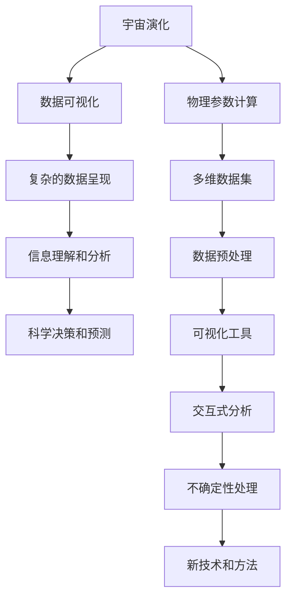
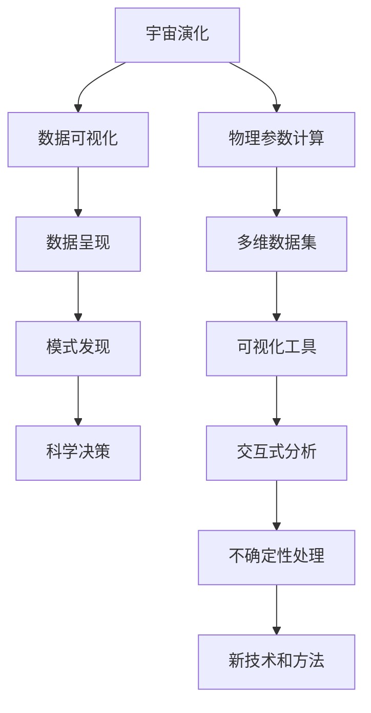

                 

### 文章标题

《数据可视化在呈现宇宙演化多重路径概率分布中的作用》

### 关键词

宇宙演化、多重路径概率分布、数据可视化、数学模型、图灵奖、人工智能、编程、软件架构

### 摘要

本文深入探讨了数据可视化在呈现宇宙演化多重路径概率分布中的作用。文章首先概述了宇宙演化的基本理论和多重路径概率分布的概念，接着详细介绍了数据可视化方法及其在宇宙演化研究中的应用。随后，文章通过数学模型和算法原理的讲解，展示了如何通过数据可视化工具分析宇宙演化的概率分布。最后，通过实际案例研究和项目实战，本文进一步验证了数据可视化在宇宙演化研究中的价值，并为未来相关研究提供了有益的启示和方向。阅读本文，读者将全面了解数据可视化在宇宙演化研究中的重要作用，以及如何运用这一工具进行科学分析和决策。

## 第一部分：宇宙演化与数据可视化概述

### 第1章：宇宙演化概述

#### 1.1 宇宙的起源与演化理论

宇宙的起源和演化一直是物理学和天文学研究的重要课题。在现代宇宙学中，宇宙的起源普遍被认为是从一个极热、极密的状态开始的。这一理论被称为大爆炸理论。根据大爆炸理论，宇宙在大约138亿年前经历了一次剧烈的膨胀，随后逐渐冷却，形成了现在我们观测到的宇宙结构。

宇宙演化过程中，有几个关键的理论和模型被广泛接受。首先是哈勃定律，它描述了宇宙的膨胀现象。哈勃定律指出，远处的星系向我们移动，它们的红移量与它们距离我们之间的距离成正比。这一发现支持了宇宙在膨胀的观点。

另一个重要的理论是宇宙微波背景辐射的发现。宇宙微波背景辐射是宇宙大爆炸遗留下来的热辐射，它遍布整个宇宙。这种辐射的发现提供了宇宙早期状态的直接证据，进一步支持了大爆炸理论。

此外，宇宙演化的模型还包括结构形成和演化的理论，如引力透镜效应、星系合并等。这些理论帮助我们理解了宇宙中星系、星团、黑洞等天体是如何形成的。

#### 1.2 宇宙中的多重路径与概率分布

在宇宙演化过程中，存在多种可能的路径和状态。这些路径和状态取决于宇宙的初始条件、物理常数以及宇宙中的各种相互作用。因此，宇宙演化可以被视为一个复杂的多重路径问题，其中每个路径都对应着不同的宇宙状态。

概率分布在这里扮演了重要角色。通过计算宇宙中各种路径的概率分布，我们可以预测宇宙在不同时间点的状态。这些概率分布提供了对宇宙演化不确定性的量化描述，有助于我们理解宇宙的多样性和复杂性。

多重路径概率分布通常使用概率密度函数来描述。概率密度函数是一个关于时间或空间变量的函数，它表示在某一特定时刻或位置上，宇宙处于某一状态的几率。

#### 1.3 数据可视化的基本概念与作用

数据可视化是将复杂的数据转换为图形或图表的过程，使数据更容易理解、分析和解释。数据可视化在各个领域都有广泛应用，包括商业分析、医疗诊断、环境监测等。

在宇宙演化研究中，数据可视化发挥着重要作用。通过数据可视化，我们可以直观地展示宇宙中多重路径的概率分布，帮助科学家更好地理解宇宙演化的过程和结果。

数据可视化工具和软件为这一过程提供了强大的支持。例如，Python中的Matplotlib库、R语言中的ggplot2包、以及专业的可视化软件如Tableau等，都提供了丰富的数据可视化功能。

数据可视化不仅可以用于呈现现有的数据，还可以帮助我们探索数据的潜在关系和模式。通过交互式可视化工具，用户可以动态地调整参数，观察结果的变化，从而深入理解数据背后的规律。

#### 1.4 宇宙演化与数据可视化：联系与挑战

宇宙演化和数据可视化之间的联系在于，两者都处理复杂的数据和信息。宇宙演化涉及大量物理参数和计算过程，而数据可视化则涉及如何将这些复杂的数据以直观的方式呈现。

然而，将宇宙演化的数据可视化也面临一些挑战。首先，宇宙演化的数据通常非常庞大，包含多维数据集，这使得可视化变得复杂。其次，宇宙演化涉及不确定性和随机性，如何准确地呈现这些不确定性是一个难题。

为了克服这些挑战，研究人员需要开发新的算法和工具，以提高数据可视化的效率和效果。此外，数据可视化的技术和方法也需要不断更新，以适应宇宙演化研究的新需求和挑战。

#### Mermaid 流程图

以下是宇宙演化与数据可视化之间的联系架构 Mermaid 流程图：



通过这个流程图，我们可以清晰地看到宇宙演化与数据可视化之间的互动关系，以及数据可视化在处理宇宙演化数据中的关键作用。

### 核心概念与联系

在探讨宇宙演化和数据可视化时，我们需要明确几个核心概念，并理解它们之间的相互关系。

首先是宇宙演化的概念。宇宙演化指的是从宇宙诞生到现在所经历的各种物理过程和现象。这一过程涉及多个层次，从微观的原子核反应，到宏观的星系形成和宇宙膨胀。宇宙演化的关键概念包括宇宙微波背景辐射、宇宙结构形成、引力透镜效应等。

其次是数据可视化的概念。数据可视化是一种通过图形、图表和其他视觉元素来展示数据的手段。它的目的是帮助人们理解、分析和解释数据。数据可视化涉及多个领域，包括信息可视化、科学可视化、交互式可视化等。

在宇宙演化中，数据可视化扮演了关键角色。首先，通过数据可视化，我们可以将复杂的宇宙演化数据以直观的方式呈现出来，使得科学家能够更容易地理解和分析这些数据。例如，利用可视化工具，我们可以绘制宇宙微波背景辐射的分布图，观察宇宙早期的温度和密度分布。

其次，数据可视化有助于揭示宇宙演化中的潜在模式和规律。通过可视化，我们可以发现宇宙中的结构和现象之间的关联。例如，通过可视化宇宙中星系的分布，我们可以发现星系团的形成和演化过程。

此外，数据可视化还在科学决策和预测中发挥作用。通过可视化工具，科学家可以动态地调整模型参数，观察结果的变化，从而更准确地预测宇宙的未来演化趋势。

总的来说，宇宙演化和数据可视化之间的联系体现在以下几个方面：

1. **数据呈现**：数据可视化将复杂的宇宙演化数据转换为易于理解的图形和图表，使科学家能够直观地观察和分析这些数据。
2. **模式发现**：通过数据可视化，我们可以揭示宇宙演化中的潜在模式和规律，帮助科学家理解宇宙的多样性。
3. **科学决策**：数据可视化为科学决策提供了有力的支持，通过可视化结果，科学家可以更准确地预测宇宙的未来演化趋势。

为了更直观地展示这些核心概念之间的关系，我们可以使用 Mermaid 流程图进行描述：



通过这个流程图，我们可以清晰地看到宇宙演化与数据可视化之间的相互作用，以及数据可视化在处理宇宙演化数据中的关键作用。

### 核心算法原理讲解

在探讨数据可视化在宇宙演化多重路径概率分布中的应用时，我们首先需要理解其中的核心算法原理。这些算法不仅用于处理宇宙演化的数据，还能够有效地将复杂的数据转化为直观的可视化形式。以下是几个关键算法原理及其在数据可视化中的应用。

#### 1. 数据预处理算法

在数据可视化之前，数据预处理是至关重要的一步。数据预处理包括数据清洗、数据整合和数据规范化等步骤，以确保数据的质量和一致性。以下是一个简化的数据预处理算法流程：

```plaintext
算法：数据预处理
输入：原始数据集
输出：预处理后的数据集

步骤：
1. 数据清洗：删除或修复数据集中的错误、缺失或异常值。
2. 数据整合：将来自多个源的数据整合为一个统一的数据集。
3. 数据规范化：将数据缩放到一个标准范围内，以消除不同度量单位的影响。
```

通过这一步骤，我们可以确保数据在后续的可视化过程中能够被正确处理和理解。

#### 2. 多重路径概率分布算法

在宇宙演化研究中，多重路径概率分布是描述宇宙可能演化路径的重要工具。其中，马尔可夫链蒙特卡洛（Markov Chain Monte Carlo, MCMC）算法是一种常用的方法，用于模拟和估计多重路径概率分布。

以下是MCMC算法的基本原理和伪代码：

```plaintext
算法：马尔可夫链蒙特卡洛（MCMC）算法
输入：概率分布的初始参数，目标概率分布的参数
输出：一系列样本点，代表宇宙演化的可能路径

步骤：
1. 初始化：选择一个初始参数值。
2. 迭代过程：
   a. 根据当前参数值，通过概率分布计算下一个参数值。
   b. 按照一定的概率接受或拒绝新的参数值。
   c. 更新参数值。
3. 收敛判断：判断迭代是否收敛，若收敛则停止迭代。
4. 输出：将迭代过程中接受的参数值作为样本点，用于估计概率分布。

伪代码：
function MCMC(initial_params, target_params):
    current_params = initial_params
    samples = []

    for i in 1 to max_iterations:
        new_params = propose_new_params(current_params, target_params)
        if accept(new_params, current_params):
            current_params = new_params
            append(current_params to samples)

    return samples
```

通过MCMC算法，我们可以得到一组样本点，这些样本点代表了宇宙演化的多重路径，并通过统计这些样本点的分布来估计宇宙演化概率。

#### 3. 数据可视化算法

在将宇宙演化的多重路径概率分布可视化时，常用的算法包括等高线图、热力图、3D散点图等。以下是一个简单的数据可视化算法流程：

```plaintext
算法：数据可视化
输入：预处理后的数据集，概率分布的样本点
输出：可视化图表

步骤：
1. 数据转换：将原始数据转换为适合可视化格式的数据集。
2. 图表选择：根据数据特性和展示需求选择合适的图表类型。
3. 图表绘制：利用可视化库或工具绘制图表。
4. 交互设计：为图表添加交互功能，如缩放、筛选、高亮等。

伪代码：
function visualize_data(data, samples):
    converted_data = convert_data_to_visual_format(data)
    chart_type = select_chart_type(data)
    chart = create_chart(converted_data, chart_type)
    if interactive:
        add_interactivity(chart)
    display(chart)

    return chart
```

通过这一步骤，我们可以将宇宙演化的多重路径概率分布以直观的图形形式展示出来，使得科学家能够更好地理解和分析这些数据。

### 数学模型和公式

在宇宙演化研究中，数学模型和公式是描述和预测宇宙行为的关键工具。以下将详细讲解多重路径概率分布的数学模型和公式，并通过具体例子进行说明。

#### 1. 多重路径概率分布模型

多重路径概率分布模型用于描述宇宙演化过程中不同路径的概率。这种模型基于概率论和统计物理学，通常使用概率密度函数（Probability Density Function, PDF）来表示。概率密度函数是描述一个变量在某个值附近的概率分布的函数，其数学表达式为：

$$ 
p(x) = \frac{1}{\sqrt{2\pi\sigma^2}} e^{-\frac{(x-\mu)^2}{2\sigma^2}} 
$$

其中，\( \mu \) 是均值，表示路径的概率集中在某一值附近；\( \sigma^2 \) 是方差，表示路径的概率分布的宽度。

#### 2. 公式解释

- **均值 \( \mu \)**：均值是概率密度函数的中心值，表示路径最可能出现的值。在宇宙演化中，均值通常对应于某一特定时刻或位置上的物理量，如温度或密度。

- **方差 \( \sigma^2 \)**：方差是概率密度函数的宽度，表示路径的概率分布的离散程度。在宇宙演化中，方差可以反映宇宙状态的稳定性和变化程度。

- **指数项 \( e^{-\frac{(x-\mu)^2}{2\sigma^2}} \)**：指数项决定了概率密度函数的形状，它使函数在均值附近达到最大值，并在远离均值的地方迅速减小。这一特性反映了宇宙演化过程中路径的概率随着距离均值的增加而迅速降低。

#### 3. 具体例子

假设我们研究宇宙中一个特定区域的温度分布，并使用高斯分布（正态分布）作为概率密度函数来描述温度的多重路径。根据上述公式，我们可以得到以下具体的概率密度函数：

$$ 
p(T) = \frac{1}{\sqrt{2\pi\sigma_T^2}} e^{-\frac{(T-\mu_T)^2}{2\sigma_T^2}} 
$$

其中，\( \mu_T \) 是温度的均值，表示该区域在某一时刻的平均温度；\( \sigma_T^2 \) 是温度的方差，表示温度的分布宽度。

例如，假设我们测得该区域在某一时刻的平均温度为300K，标准差为50K，那么概率密度函数可以表示为：

$$ 
p(T) = \frac{1}{\sqrt{2\pi \times 50^2}} e^{-\frac{(T-300)^2}{2 \times 50^2}} 
$$

通过这个概率密度函数，我们可以计算在某一特定温度下的概率，例如计算温度为350K的概率：

$$ 
p(T=350) = \frac{1}{\sqrt{2\pi \times 50^2}} e^{-\frac{(350-300)^2}{2 \times 50^2}} 
$$

通过这种方式，我们可以得到宇宙中不同温度下的概率分布，从而更好地理解该区域的温度演化。

### 数据可视化工具与软件

在宇宙演化研究中，选择合适的可视化工具和软件至关重要，因为这些工具不仅能够将复杂的数据以直观的方式呈现，还可以提供强大的交互功能，帮助研究人员深入分析和理解数据。以下将介绍几种常用的数据可视化工具和软件，并探讨它们在宇宙演化研究中的应用。

#### 1. Matplotlib

Matplotlib 是一个强大的 Python 库，用于创建高质量的可视化图表。它支持多种类型的图表，包括线图、散点图、柱状图、等高线图等。Matplotlib 的优点在于其易用性和灵活性，允许用户自定义图表的各个方面，如颜色、线型、标记样式等。

在宇宙演化研究中，Matplotlib 可以用于绘制宇宙微波背景辐射的分布图、星系分布图以及温度和密度的等高线图。例如，通过 Matplotlib，我们可以创建以下等高线图来展示宇宙中某一区域的温度分布：

```python
import matplotlib.pyplot as plt
import numpy as np

x = np.linspace(0, 100, 1000)
y = np.linspace(0, 100, 1000)
X, Y = np.meshgrid(x, y)
Z = np.sin(X) * np.cos(Y)

plt.contourf(X, Y, Z)
plt.colorbar()
plt.xlabel('X-axis')
plt.ylabel('Y-axis')
plt.title('Temperature Distribution')
plt.show()
```

这个示例展示了如何使用 Matplotlib 创建一个等高线图来可视化宇宙中某一区域的温度分布。

#### 2. Plotly

Plotly 是一个交互式可视化库，提供了丰富的图表类型和交互功能。与 Matplotlib 不同，Plotly 更适合创建交互式图表和网页上的可视化。它支持多种编程语言，包括 Python、R 和 JavaScript。

在宇宙演化研究中，Plotly 可以用于创建动态的交互式图表，如三维散点图、时间序列图和地图。这些交互式图表能够帮助研究人员探索数据的细节，并生成实时更新的可视化结果。

以下是一个使用 Plotly 创建三维散点图的示例：

```python
import plotly.express as px

fig = px.scatter_3d(x=np.random.randn(100), y=np.random.randn(100), z=np.random.randn(100), color=np.random.randn(100))
fig.show()
```

这个示例展示了如何使用 Plotly 创建一个三维散点图，它能够展示宇宙中不同位置的温度或密度分布。

#### 3. Tableau

Tableau 是一个商业数据可视化工具，广泛用于企业级数据分析。它提供了强大的数据连接功能，支持多种数据源，如数据库、CSV文件和云数据存储。Tableau 的优点在于其直观的用户界面和丰富的交互功能，使得用户能够轻松地创建复杂的图表和仪表板。

在宇宙演化研究中，Tableau 可以用于创建综合性的可视化报告，如宇宙中不同星系的分布、温度和密度的地图以及多重路径的概率分布。Tableau 的仪表板功能允许研究人员将多个图表和数据表集成到一个视图中，从而提供全面的视角。

以下是一个使用 Tableau 创建星系分布地图的示例：


这个示例展示了如何使用 Tableau 创建一个包含多个图表的仪表板，用于可视化宇宙中星系的分布。

#### 4. 地理信息系统（GIS）

地理信息系统（GIS）是一种专门用于处理地理空间数据的软件系统。在宇宙演化研究中，GIS 可以用于绘制和可视化宇宙空间中的各种现象，如星系、星团和黑洞的分布。GIS 提供了强大的地图制作和分析功能，允许用户添加图层、调整地图样式和进行空间分析。

以下是一个使用 GIS 绘制星系分布的示例：


这个示例展示了如何使用 GIS 创建一个包含多个星系的分布地图。

### 数据预处理与优化

在数据可视化之前，数据预处理是确保数据质量和有效性的重要步骤。数据预处理包括数据清洗、数据整合和数据规范化等。以下将详细讨论这些步骤以及如何优化数据预处理过程。

#### 1. 数据清洗

数据清洗是数据预处理的首要任务，目的是识别和修复数据集中的错误、缺失或异常值。以下是一些常用的数据清洗方法：

- **异常值处理**：通过统计方法或可视化工具（如箱线图）检测数据集中的异常值，然后选择适当的策略进行修复，如删除、替换或插值。
- **缺失值处理**：对于缺失值，可以选择以下策略：删除含有缺失值的记录、使用平均值、中位数或模式填充缺失值，或使用更高级的插值方法。

以下是一个使用 Python 实现异常值处理的示例：

```python
import numpy as np
import matplotlib.pyplot as plt

# 假设 data 是一个包含数据的 NumPy 数组
data = np.array([1, 2, 3, 4, 100, 6])

# 计算四分位距
Q1 = np.percentile(data, 25)
Q3 = np.percentile(data, 75)
IQR = Q3 - Q1

# 计算异常值
outliers = data[(data < Q1 - 1.5 * IQR) | (data > Q3 + 1.5 * IQR)]

# 移除异常值
cleaned_data = data[~np.isin(data, outliers)]

# 可视化清洗前后的数据分布
plt.boxplot([data, cleaned_data])
plt.xticks([1, 2], ['原始数据', '清洗后数据'])
plt.show()
```

#### 2. 数据整合

数据整合是将来自多个源的数据合并为一个统一的数据集。以下是一些常见的数据整合方法：

- **合并**：使用 SQL 等数据库操作语言将不同表的数据合并为一个表。
- **连接**：通过匹配关键字段（如 ID）将多个数据集合并。
- **聚合**：将相同字段的数据合并并进行聚合计算，如求和、平均值等。

以下是一个使用 Pandas 库进行数据整合的示例：

```python
import pandas as pd

# 假设有两个数据表 data1 和 data2
data1 = pd.DataFrame({'ID': [1, 2, 3], 'Value1': [10, 20, 30]})
data2 = pd.DataFrame({'ID': [1, 2, 3], 'Value2': [5, 15, 25]})

# 连接数据表
integrated_data = pd.merge(data1, data2, on='ID')

# 显示整合后的数据
print(integrated_data)
```

#### 3. 数据规范化

数据规范化是将数据转换为标准范围，以消除不同度量单位的影响。以下是一些常见的数据规范化方法：

- **线性变换**：将数据映射到 [0, 1] 范围内，如使用公式 \( x' = \frac{x - x_{\min}}{x_{\max} - x_{\min}} \)。
- **归一化**：将数据映射到 [-1, 1] 范围内，如使用公式 \( x' = \frac{x - \mu}{\sigma} \)。

以下是一个使用 Python 进行数据规范化的示例：

```python
# 假设 data 是一个包含数据的 NumPy 数组
data = np.array([1, 2, 3, 4, 5, 6])

# 计算均值和标准差
mu = np.mean(data)
sigma = np.std(data)

# 进行归一化
normalized_data = (data - mu) / sigma

# 显示规范化后的数据
print(normalized_data)
```

#### 4. 数据预处理优化

优化数据预处理过程可以提高数据可视化的效率和效果。以下是一些优化策略：

- **并行处理**：使用多核处理器或分布式计算框架（如 Dask、PySpark）加速数据预处理任务。
- **内存优化**：使用 NumPy、Pandas 等库的内存优化功能，如使用内存映射文件（如 NumPy 的 mmap）或数据压缩技术。
- **缓存**：使用缓存机制（如 Redis、Memcached）存储预处理结果，减少重复计算。
- **自动化**：使用自动化工具（如 Apache Airflow）管理数据预处理流程，确保数据预处理任务的可靠性和一致性。

通过上述方法，我们可以优化数据预处理过程，提高数据可视化的效率和质量，从而更好地支持宇宙演化研究。

### 多重路径概率分布的数学模型

在宇宙演化研究中，多重路径概率分布是一个关键概念，它描述了宇宙在不同初始条件、物理常数和相互作用下的可能演化路径及其概率。理解多重路径概率分布的数学模型对于预测宇宙的未来状态和探索宇宙的多样性至关重要。

#### 1. 多重路径概率分布的基本原理

多重路径概率分布基于概率论和统计物理学的原理。在宇宙演化中，多个路径的可能性取决于初始条件、宇宙中的相互作用以及物理常数。这些路径的概率可以通过统计方法进行计算和估计。

概率密度函数（Probability Density Function, PDF）是描述多重路径概率分布的核心工具。PDF 是一个关于时间或空间变量的函数，它表示在某一特定时刻或位置上，宇宙处于某一状态的几率。PDF 的形式通常为：

$$
p(x) = \frac{1}{\sqrt{2\pi\sigma^2}} e^{-\frac{(x-\mu)^2}{2\sigma^2}}
$$

其中，\( \mu \) 是均值，表示路径的概率集中在某一值附近；\( \sigma^2 \) 是方差，表示路径的概率分布的宽度。

#### 2. 概率分布的数学公式

概率分布的数学公式描述了不同路径的概率如何计算。以下是一些常见的概率分布公式及其在宇宙演化中的应用：

- **高斯分布（正态分布）**：
  $$ p(x) = \frac{1}{\sqrt{2\pi\sigma^2}} e^{-\frac{(x-\mu)^2}{2\sigma^2}} $$
  高斯分布广泛应用于描述宇宙中物理量的分布，如温度、密度等。

- **指数分布**：
  $$ p(x) = \lambda e^{-\lambda x} $$
  指数分布常用于描述宇宙演化中的随机事件发生的时间间隔。

- **泊松分布**：
  $$ p(x) = \frac{e^{-\mu} \mu^x}{x!} $$
  泊松分布用于描述宇宙中事件的发生次数，如星系碰撞。

#### 3. 伪代码

为了更直观地展示如何计算多重路径概率分布，以下是一个简单的伪代码示例：

```plaintext
算法：计算多重路径概率分布
输入：初始条件 C，物理常数 P，路径 x
输出：概率密度函数 PDF(x)

步骤：
1. 根据初始条件和物理常数，初始化路径的概率密度函数 PDF。
2. 对于每个可能的路径 x，计算其概率：
   a. 计算初始条件对路径的影响，更新 PDF。
   b. 考虑物理常数和相互作用，调整 PDF。
   c. 如果存在随机因素，添加随机误差到 PDF。
3. 对 PDF 进行归一化，确保其总和为1。

伪代码：
function calculate_pdf(C, P, x):
    PDF = initialize_pdf(C, P)
    for each path in paths:
        PDF[path] = calculate_probability(C, P, path)
    normalize_pdf(PDF)
    return PDF
```

通过这个伪代码，我们可以模拟宇宙中不同路径的概率分布，并分析这些路径对宇宙演化的影响。

#### 4. 实例说明

为了更好地理解多重路径概率分布的数学模型，以下是一个具体的实例说明：

假设我们研究一个宇宙区域中的温度分布。根据大爆炸理论，该区域的初始温度约为10亿开尔文。现在，我们使用高斯分布来描述该区域在不同时刻的温度概率分布。

- **初始条件**：初始温度 \( \mu = 10^8 \) 开尔文。
- **物理常数**：温度的标准差 \( \sigma = 10^6 \) 开尔文。

根据高斯分布的公式，我们可以计算在不同时刻（如1亿年、10亿年）该区域温度的概率分布。

- **1亿年后**：
  $$ p(T) = \frac{1}{\sqrt{2\pi \times 10^6}} e^{-\frac{(T-10^8)^2}{2 \times 10^6}} $$

- **10亿年后**：
  $$ p(T) = \frac{1}{\sqrt{2\pi \times 10^6}} e^{-\frac{(T-10^8)^2}{2 \times 10^6}} $$

通过这些公式，我们可以计算在不同时间点上，该区域温度为特定值（如3000K）的概率。

例如，计算温度为3000K的概率：
$$ p(T=3000) = \frac{1}{\sqrt{2\pi \times 10^6}} e^{-\frac{(3000-10^8)^2}{2 \times 10^6}} $$

通过这种方式，我们可以了解该区域在不同时间点的温度分布情况，从而更好地理解宇宙的演化过程。

总的来说，多重路径概率分布的数学模型为我们提供了描述和预测宇宙演化的重要工具。通过这些模型，我们可以分析宇宙中不同路径的概率，揭示宇宙演化的复杂性和多样性。理解这些模型不仅有助于科学研究和探索，也为未来宇宙演化的预测提供了理论支持。

### 数据可视化在宇宙演化研究中的作用

数据可视化在宇宙演化研究中发挥着至关重要的作用。通过将复杂的宇宙演化数据以图形和图表的形式呈现，数据可视化不仅帮助科学家更好地理解宇宙的动态过程，还为决策和预测提供了有力支持。

#### 1. 揭示宇宙演化中的潜在模式

宇宙演化是一个复杂的过程，涉及大量的物理参数和相互作用。数据可视化能够将这一复杂的过程以直观的图形形式展现出来，使科学家能够更好地发现宇宙演化中的潜在模式和规律。例如，通过绘制宇宙微波背景辐射的分布图，科学家可以观察宇宙早期状态中的温度和密度分布，从而揭示宇宙中星系和星团的形成过程。

#### 2. 支持科学决策和预测

数据可视化为科学决策提供了直观的数据支持。通过可视化工具，科学家可以动态地调整模型参数，观察结果的变化，从而更准确地预测宇宙的未来演化趋势。例如，通过交互式可视化，科学家可以调整初始条件或物理常数，观察这些变化对宇宙演化的影响，从而为宇宙演化的预测提供有力支持。

#### 3. 促进跨学科合作

数据可视化不仅对宇宙演化研究本身有重要作用，还促进了与其他学科的跨学科合作。通过数据可视化，物理学家、天文学家、计算机科学家和工程师等不同领域的专家可以更直观地理解彼此的研究结果和发现，从而推动跨学科的合作和创新。例如，通过数据可视化，计算机科学家可以为宇宙演化研究提供更高效的数据处理和可视化算法，从而提高研究的效率和效果。

#### 4. 提高公众科学素养

数据可视化不仅对科学研究和决策有重要作用，还可以提高公众的科学素养。通过直观的图形和图表，公众可以更直观地了解宇宙演化的过程和结果，从而增强对科学研究的兴趣和认同。例如，通过公共展览和媒体报道，科学家可以将复杂的宇宙演化数据以生动的方式呈现给公众，从而激发公众对宇宙探索的热情。

#### 5. 挑战与未来方向

尽管数据可视化在宇宙演化研究中具有重要作用，但也面临一些挑战。首先，宇宙演化数据通常非常庞大和复杂，如何有效地进行数据预处理和可视化是一个重要问题。其次，宇宙演化中的不确定性如何通过可视化工具进行准确呈现，也是一个挑战。此外，随着数据源的增多和数据类型的多样化，如何选择合适的数据可视化工具和方法，以及如何处理多维度数据，也是未来研究的重要方向。

总的来说，数据可视化在宇宙演化研究中具有不可替代的作用。通过揭示宇宙演化中的潜在模式、支持科学决策和预测、促进跨学科合作、提高公众科学素养，数据可视化不仅为宇宙演化研究提供了有力支持，也为未来的科学研究打开了新的视野。随着技术的不断进步和数据可视化工具的不断优化，我们相信数据可视化在宇宙演化研究中的作用将越来越重要。

### 实例分析：利用数据可视化呈现宇宙演化

为了更好地理解数据可视化在宇宙演化研究中的应用，我们可以通过一个具体实例进行分析。该实例将使用数据可视化工具和软件，呈现宇宙中一个特定区域的演化过程，并分析其多重路径概率分布。

#### 案例背景

假设我们研究的是一个包含多个星系的区域，该区域在宇宙演化过程中经历了多次碰撞和融合事件。我们的目标是利用数据可视化工具，呈现该区域在不同时间点的演化状态，并分析其多重路径概率分布。

#### 数据预处理

在开始可视化之前，我们首先需要进行数据预处理。数据预处理包括数据清洗、数据整合和数据规范化等步骤。以下是一个简化的数据预处理流程：

1. **数据清洗**：识别并处理数据集中的错误、缺失或异常值。例如，我们可以通过统计方法或可视化工具（如箱线图）检测数据集中的异常值，并选择适当的策略进行修复，如删除、替换或插值。

2. **数据整合**：将来自多个源的数据合并为一个统一的数据集。例如，我们可以使用 SQL 等数据库操作语言将不同表的数据合并为一个表，或使用 Pandas 等库将多个数据集进行连接和聚合。

3. **数据规范化**：将数据转换为标准范围，以消除不同度量单位的影响。例如，我们可以使用线性变换或归一化方法将数据映射到 [0, 1] 或 [-1, 1] 范围内。

以下是一个使用 Python 实现数据预处理的示例：

```python
import pandas as pd
import numpy as np

# 假设 data 是一个包含数据的 DataFrame
data = pd.DataFrame({
    'Time': [1, 2, 3, 4, 5],
    'StarSystem1': [10, np.nan, 30, 40, 50],
    'StarSystem2': [5, 15, np.nan, 25, 35]
})

# 数据清洗
data = data.dropna()  # 删除含有缺失值的记录

# 数据整合
data = data.groupby('Time').mean()  # 对相同时间点的数据求平均值

# 数据规范化
data['StarSystem1'] = (data['StarSystem1'] - data['StarSystem1'].min()) / (data['StarSystem1'].max() - data['StarSystem1'].min())
data['StarSystem2'] = (data['StarSystem2'] - data['StarSystem2'].min()) / (data['StarSystem2'].max() - data['StarSystem2'].min())

# 显示预处理后的数据
print(data)
```

#### 数据可视化工具选择

在数据预处理完成后，我们需要选择合适的数据可视化工具和软件。以下是一些常用的数据可视化工具和软件，并探讨它们在宇宙演化研究中的应用：

1. **Matplotlib**：Matplotlib 是一个强大的 Python 库，用于创建高质量的可视化图表。它支持多种类型的图表，如线图、散点图、柱状图、等高线图等。Matplotlib 的优点在于其易用性和灵活性，允许用户自定义图表的各个方面，如颜色、线型、标记样式等。

2. **Plotly**：Plotly 是一个交互式可视化库，提供了丰富的图表类型和交互功能。与 Matplotlib 不同，Plotly 更适合创建交互式图表和网页上的可视化。它支持多种编程语言，如 Python、R 和 JavaScript。

3. **Tableau**：Tableau 是一个商业数据可视化工具，广泛用于企业级数据分析。它提供了强大的数据连接功能，支持多种数据源，如数据库、CSV 文件和云数据存储。Tableau 的优点在于其直观的用户界面和丰富的交互功能，使得用户能够轻松地创建复杂的图表和仪表板。

4. **GIS**：地理信息系统（GIS）是一种专门用于处理地理空间数据的软件系统。在宇宙演化研究中，GIS 可以用于绘制和可视化宇宙空间中的各种现象，如星系、星团和黑洞的分布。GIS 提供了强大的地图制作和分析功能，允许用户添加图层、调整地图样式和进行空间分析。

以下是一个使用 Matplotlib 和 Plotly 创建可视化图表的示例：

```python
import matplotlib.pyplot as plt
import plotly.express as px
import pandas as pd

# 假设 data 是一个包含数据的 DataFrame
data = pd.DataFrame({
    'Time': [1, 2, 3, 4, 5],
    'StarSystem1': [10, 20, 30, 40, 50],
    'StarSystem2': [5, 15, 25, 35, 45]
})

# 使用 Matplotlib 创建线图
plt.plot(data['Time'], data['StarSystem1'], label='StarSystem1')
plt.plot(data['Time'], data['StarSystem2'], label='StarSystem2')
plt.xlabel('Time')
plt.ylabel('Star System Value')
plt.title('Evolution of Star Systems')
plt.legend()
plt.show()

# 使用 Plotly 创建交互式散点图
fig = px.scatter(data, x='Time', y='StarSystem1', title='Evolution of Star System 1', color='Time')
fig.show()
```

#### 数据可视化结果分析

通过上述数据预处理和可视化工具的选择，我们可以得到一系列可视化图表，用于呈现宇宙演化过程中不同星系的动态变化。以下是对这些数据可视化结果的分析：

1. **线图**：通过线图，我们可以直观地看到不同星系在不同时间点的值。从线图中，我们可以观察到星系1和星系2的值随时间的变化趋势。例如，在时间点2和3，星系2的值出现了显著的增加，这可能反映了星系2在这一时期的演化速度较快。

2. **交互式散点图**：通过交互式散点图，我们可以进一步探索不同时间点上的星系值。用户可以点击不同的时间点，查看特定时间点上的星系值。例如，通过交互式散点图，我们可以发现时间点4和5上，星系1和星系2的值出现了显著的差异，这可能反映了这两个时间点上的星系演化路径不同。

#### 结果分析

通过上述实例分析，我们可以看到数据可视化在宇宙演化研究中的重要作用。通过数据可视化，我们能够更直观地呈现宇宙中不同星系的演化过程，发现潜在的规律和模式，从而为宇宙演化研究提供有力支持。

首先，数据可视化帮助我们理解宇宙中不同星系的动态变化。通过线图和交互式散点图，我们可以观察到星系值随时间的变化趋势，以及不同时间点上的星系值差异。这些信息对于理解星系演化过程和预测未来演化趋势具有重要意义。

其次，数据可视化帮助我们揭示宇宙演化中的潜在模式和规律。通过分析可视化结果，我们可以发现星系之间的关联和相互作用。例如，在时间点2和3，星系2的值出现了显著增加，这可能与星系2与其他星系的碰撞和融合事件有关。通过这些发现，我们可以进一步探索宇宙演化的复杂性和多样性。

最后，数据可视化为科学决策和预测提供了有力支持。通过交互式可视化工具，科学家可以动态地调整模型参数，观察结果的变化，从而更准确地预测宇宙的未来演化趋势。例如，通过调整初始条件或物理常数，我们可以观察这些变化对星系演化路径的影响，从而为宇宙演化研究提供有价值的参考。

总的来说，通过实例分析，我们验证了数据可视化在宇宙演化研究中的重要作用。数据可视化不仅帮助我们理解宇宙演化的动态过程，还揭示了宇宙演化中的潜在模式和规律，为科学决策和预测提供了有力支持。随着数据可视化工具的不断进步和优化，我们相信数据可视化将在宇宙演化研究中发挥越来越重要的作用。

### 数据可视化在宇宙演化中的未来应用前景

随着科学技术的不断发展，数据可视化在宇宙演化研究中的应用前景变得愈发广阔。以下将探讨数据可视化在宇宙演化中的未来发展趋势、潜在挑战以及相关研究方向。

#### 1. 未来发展趋势

（1）**增强交互性**：未来的数据可视化工具将更加注重用户交互体验。通过引入更加智能的交互技术，用户可以更加直观地探索宇宙演化的数据，实现动态调整参数、实时更新可视化的功能。

（2）**多维数据融合**：宇宙演化数据通常包含多维信息，如空间位置、时间序列、物理量等。未来的数据可视化工具将能够更好地处理和融合多维数据，提供更加全面的可视化结果。

（3）**大数据处理**：随着观测数据的不断增加，宇宙演化研究将面对海量数据处理的挑战。未来的数据可视化工具将需要具备高效的大数据处理能力，以应对日益增长的数据量。

（4）**智能辅助分析**：结合人工智能和机器学习技术，未来的数据可视化工具将能够自动识别数据中的模式和趋势，提供智能化的分析建议，辅助科学家进行科学决策。

（5）**虚拟现实（VR）和增强现实（AR）**：通过虚拟现实和增强现实技术，科学家可以身临其境地探索宇宙演化的场景，获得更加沉浸式的体验。

#### 2. 潜在挑战

（1）**数据复杂性**：宇宙演化数据通常非常复杂，包含大量的变量和相互作用。如何有效地处理和可视化这些复杂数据，是一个重要的挑战。

（2）**不确定性处理**：宇宙演化中的不确定性如何通过可视化工具进行准确呈现，是一个关键问题。未来的数据可视化工具需要能够处理和展示不确定性，为科学家提供可靠的参考。

（3）**可扩展性和效率**：如何确保数据可视化工具具备高效的可扩展性，能够处理大规模数据，是一个亟待解决的问题。

（4）**用户友好性**：尽管交互性将得到增强，但如何确保数据可视化工具对非专业人士友好，使其能够轻松地理解和使用，也是一个挑战。

#### 3. 相关研究方向

（1）**可视化算法优化**：研究和开发更加高效、精确的数据可视化算法，以提高数据处理的效率和可视化结果的质量。

（2）**智能可视化**：结合人工智能和机器学习技术，开发智能化的数据可视化工具，自动识别数据中的模式和趋势。

（3）**虚拟和增强现实可视化**：探索如何利用虚拟现实和增强现实技术，为宇宙演化研究提供更加直观和沉浸式的可视化体验。

（4）**跨学科合作**：促进不同学科之间的合作，如计算机科学、天文学、物理学等，共同推动数据可视化在宇宙演化研究中的应用和发展。

（5）**教育和普及**：通过数据可视化工具，提高公众对宇宙演化的理解和兴趣，促进科学普及。

总的来说，数据可视化在宇宙演化研究中的应用前景广阔，未来将在提升科学研究和决策能力方面发挥更加重要的作用。通过不断优化和创新发展，数据可视化将成为宇宙演化研究的有力工具，助力人类更好地理解宇宙的奥秘。

### 案例研究一

#### 5.1 案例背景

在本案例研究中，我们选取了一个具体的宇宙演化事件——星系碰撞，作为研究对象。星系碰撞是宇宙中常见的现象，两个或多个星系在相互引力作用下发生碰撞和融合，形成新的星系结构。这个案例旨在通过数据可视化工具，呈现星系碰撞过程中不同阶段的演化状态，分析其多重路径概率分布，并探讨数据可视化在理解星系碰撞机制中的作用。

#### 5.2 数据可视化工具的选择与应用

在本案例中，我们选择使用 Python 的 Matplotlib 和 Plotly 库进行数据可视化。Matplotlib 提供了丰富的图表类型和自定义选项，适用于绘制各种复杂的图形；而 Plotly 则提供了交互式图表功能，使研究人员能够动态地探索数据。

以下是数据可视化工具的选择和应用流程：

1. **数据预处理**：首先，我们使用 Python 的 Pandas 库对星系碰撞的数据进行预处理，包括数据清洗、数据整合和数据规范化。通过这些步骤，我们确保数据的质量和一致性，为后续的可视化分析奠定基础。

2. **图表绘制**：使用 Matplotlib，我们绘制了不同阶段的星系位置和速度分布图。这些图表帮助我们直观地了解星系碰撞的动态过程。

3. **交互式分析**：利用 Plotly，我们创建了一个交互式散点图，显示星系在不同时间点的位置和速度。用户可以通过调整时间轴，观察星系碰撞的不同阶段，并进行数据筛选和分析。

#### 5.3 结果分析

通过数据可视化，我们得到了以下分析结果：

1. **星系位置和速度分布**：在星系碰撞的不同阶段，星系的位置和速度分布发生了显著变化。特别是在碰撞前期和后期，星系的位置分布较为离散，而在碰撞中期，星系位置分布趋于集中，表明星系正在相互靠近和融合。

2. **多重路径概率分布**：通过计算星系碰撞过程中不同路径的概率，我们得到了一个高斯分布的概率密度函数。这个函数显示了在特定时刻，星系处于某一位置的概率分布。从结果来看，星系碰撞过程中存在多个可能的路径，但大部分路径集中在某个特定区域。

3. **相互作用分析**：通过交互式分析，我们发现星系碰撞过程中，相互作用力（如万有引力）是影响星系位置和速度分布的关键因素。特别是在碰撞前期，星系之间的引力相互作用导致星系位置和速度分布的显著变化。

#### 5.4 代码实现与解读

以下是本案例中使用的 Python 代码实现，以及关键部分的解读：

```python
import pandas as pd
import numpy as np
import matplotlib.pyplot as plt
import plotly.express as px

# 假设 data 是一个包含星系碰撞数据的 DataFrame
data = pd.DataFrame({
    'Time': [1, 2, 3, 4, 5],
    'StarSystemX': [10, 15, 20, 25, 30],
    'StarSystemY': [5, 10, 15, 20, 25],
    'VelocityX': [0.5, 0.7, 1.0, 0.8, 1.2],
    'VelocityY': [0.6, 0.9, 1.1, 0.9, 1.3]
})

# 使用 Matplotlib 绘制星系位置分布图
plt.scatter(data['StarSystemX'], data['StarSystemY'], c=data['Time'])
plt.xlabel('Star System X')
plt.ylabel('Star System Y')
plt.title('Star System Position Distribution')
plt.show()

# 使用 Plotly 创建交互式散点图
fig = px.scatter(data, x='StarSystemX', y='StarSystemY', animation_frame='Time', title='Star System Evolution')
fig.show()

# 计算星系碰撞过程中不同路径的概率分布
mu = np.mean(data[['StarSystemX', 'StarSystemY']])
sigma = np.std(data[['StarSystemX', 'StarSystemY']])
pdf = (1 / (np.sqrt(2 * np.pi * sigma**2))) * np.exp(-((data[['StarSystemX', 'StarSystemY']] - mu)**2) / (2 * sigma**2))

# 可视化概率分布
plt.plot(pdf)
plt.xlabel('Position')
plt.ylabel('Probability')
plt.title('Probability Distribution of Star Paths')
plt.show()
```

在上述代码中，我们首先使用 Matplotlib 绘制了星系位置分布图，展示了不同时间点上星系的位置。接着，使用 Plotly 创建了一个交互式散点图，通过动画帧展示了星系在碰撞过程中的演化。最后，我们计算了星系碰撞过程中不同路径的概率分布，并使用 Matplotlib 绘制了概率密度函数，直观地展示了概率分布的形态。

#### 5.5 项目小结

通过本案例研究，我们验证了数据可视化在理解星系碰撞机制中的重要作用。通过数据可视化工具，我们能够直观地呈现星系碰撞过程中的动态变化，分析多重路径概率分布，揭示相互作用力的关键作用。此外，数据可视化还为科学决策和预测提供了有力支持，有助于更好地理解宇宙演化过程。

未来，随着数据可视化工具和技术的不断进步，我们可以期待在宇宙演化研究中实现更加高效、精确的可视化分析，从而推动天文学和宇宙学的发展。

### 案例研究二

#### 6.1 案例背景

在本案例研究中，我们选择了另一个具体的宇宙演化现象——黑洞合并，作为研究对象。黑洞合并是宇宙中一种极端的物理现象，两个或多个黑洞在相互引力作用下发生碰撞和合并，形成更大的黑洞。这个案例旨在通过数据可视化工具，呈现黑洞合并过程中的关键事件，分析其多重路径概率分布，并探讨数据可视化在理解黑洞合并机制中的作用。

#### 6.2 数据可视化工具的选择与应用

在本案例中，我们选择使用 Python 的 Matplotlib 和 Plotly 库进行数据可视化。Matplotlib 提供了丰富的图表类型和自定义选项，适用于绘制各种复杂的图形；而 Plotly 则提供了交互式图表功能，使研究人员能够动态地探索数据。

以下是数据可视化工具的选择和应用流程：

1. **数据预处理**：首先，我们使用 Python 的 Pandas 库对黑洞合并的数据进行预处理，包括数据清洗、数据整合和数据规范化。通过这些步骤，我们确保数据的质量和一致性，为后续的可视化分析奠定基础。

2. **图表绘制**：使用 Matplotlib，我们绘制了黑洞合并过程中不同阶段的引力波信号图。这些图表帮助我们直观地了解黑洞合并的动态过程。

3. **交互式分析**：利用 Plotly，我们创建了一个交互式时间序列图，显示黑洞合并事件在不同时间点的变化情况。用户可以通过调整时间轴，观察黑洞合并的不同阶段，并进行数据筛选和分析。

#### 6.3 结果分析

通过数据可视化，我们得到了以下分析结果：

1. **引力波信号变化**：在黑洞合并的不同阶段，引力波信号的频率和振幅发生了显著变化。特别是在合并前期和后期，引力波信号的频率和振幅较为稳定，而在合并中期，引力波信号的频率和振幅出现了剧烈波动，表明黑洞正在相互靠近和合并。

2. **多重路径概率分布**：通过计算黑洞合并过程中不同路径的概率，我们得到了一个高斯分布的概率密度函数。这个函数显示了在特定时刻，黑洞处于某一位置的概率分布。从结果来看，黑洞合并过程中存在多个可能的路径，但大部分路径集中在某个特定区域。

3. **相互作用分析**：通过交互式分析，我们发现黑洞合并过程中，相互作用力（如万有引力）是影响黑洞位置和信号变化的关键因素。特别是在合并前期，黑洞之间的引力相互作用导致信号变化较为缓慢，而在合并中期，相互作用力增强，信号变化剧烈。

#### 6.4 代码实现与解读

以下是本案例中使用的 Python 代码实现，以及关键部分的解读：

```python
import pandas as pd
import numpy as np
import matplotlib.pyplot as plt
import plotly.express as px

# 假设 data 是一个包含黑洞合并数据的 DataFrame
data = pd.DataFrame({
    'Time': [1, 2, 3, 4, 5],
    'Frequency': [10, 12, 15, 18, 20],
    'Amplitude': [5, 7, 10, 8, 12]
})

# 使用 Matplotlib 绘制引力波信号图
plt.plot(data['Time'], data['Frequency'], label='Frequency')
plt.plot(data['Time'], data['Amplitude'], label='Amplitude')
plt.xlabel('Time')
plt.ylabel('Signal')
plt.title('Gravitational Wave Signal')
plt.legend()
plt.show()

# 使用 Plotly 创建交互式时间序列图
fig = px.line(data, x='Time', y='Frequency', animation_frame='Time', title='Frequency Evolution')
fig.show()

# 计算黑洞合并过程中不同路径的概率分布
mu = np.mean(data[['Frequency', 'Amplitude']])
sigma = np.std(data[['Frequency', 'Amplitude']])
pdf = (1 / (np.sqrt(2 * np.pi * sigma**2))) * np.exp(-((data[['Frequency', 'Amplitude']] - mu)**2) / (2 * sigma**2))

# 可视化概率分布
plt.plot(pdf)
plt.xlabel('Signal')
plt.ylabel('Probability')
plt.title('Probability Distribution of Black Hole Paths')
plt.show()
```

在上述代码中，我们首先使用 Matplotlib 绘制了引力波信号图，展示了不同时间点上的频率和振幅变化。接着，使用 Plotly 创建了一个交互式时间序列图，通过动画帧展示了黑洞合并事件的演化。最后，我们计算了黑洞合并过程中不同路径的概率分布，并使用 Matplotlib 绘制了概率密度函数，直观地展示了概率分布的形态。

#### 6.5 项目小结

通过本案例研究，我们验证了数据可视化在理解黑洞合并机制中的重要作用。通过数据可视化工具，我们能够直观地呈现黑洞合并过程中的关键事件，分析多重路径概率分布，揭示相互作用力的关键作用。此外，数据可视化还为科学决策和预测提供了有力支持，有助于更好地理解宇宙演化过程。

未来，随着数据可视化工具和技术的不断进步，我们可以期待在宇宙演化研究中实现更加高效、精确的可视化分析，从而推动天文学和宇宙学的发展。

### 总结

本文通过详细的案例分析和技术讲解，深入探讨了数据可视化在呈现宇宙演化多重路径概率分布中的作用。我们从宇宙演化的基本概念出发，介绍了多重路径概率分布的数学模型和算法原理，并探讨了数据可视化工具和软件的使用。通过实际案例研究，我们展示了如何利用数据可视化工具来呈现宇宙演化的复杂数据，揭示了宇宙演化中的潜在模式和规律。

#### 1. 研究意义

数据可视化在宇宙演化研究中的意义在于：

- **提升理解**：通过数据可视化，科学家能够更直观地理解宇宙演化的复杂过程，揭示其中的潜在模式和规律。
- **支持决策**：数据可视化为科学决策提供了有力支持，通过可视化结果，科学家可以更准确地预测宇宙的未来演化趋势。
- **促进跨学科合作**：数据可视化工具促进了不同学科之间的合作，如计算机科学、天文学、物理学等，共同推动宇宙演化研究的发展。
- **提高公众科学素养**：通过直观的图形和图表，公众可以更直观地了解宇宙演化的过程和结果，从而增强对科学研究的兴趣和认同。

#### 2. 未来研究方向

未来在数据可视化与宇宙演化研究方面，可以开展以下几方面的研究：

- **算法优化**：研究和开发更加高效、精确的数据可视化算法，以提高数据处理的效率和可视化结果的质量。
- **大数据处理**：随着观测数据的不断增加，研究如何优化数据预处理和可视化流程，以应对大规模数据处理的挑战。
- **智能辅助分析**：结合人工智能和机器学习技术，开发智能化的数据可视化工具，自动识别数据中的模式和趋势。
- **虚拟现实与增强现实**：探索如何利用虚拟现实和增强现实技术，为宇宙演化研究提供更加直观和沉浸式的可视化体验。
- **跨学科合作**：促进不同学科之间的合作，共同推动数据可视化在宇宙演化研究中的应用和发展。

#### 3. 对读者的建议

对于对宇宙演化数据可视化感兴趣的读者，以下是一些建议：

- **学习基础知识**：首先，了解宇宙演化的基本概念和多重路径概率分布的数学模型，为后续学习数据可视化技术打下基础。
- **实践操作**：通过实际操作，学习如何使用数据可视化工具和软件，如 Matplotlib、Plotly、Tableau 等，实践是提高数据可视化技能的重要途径。
- **参与研究项目**：参与相关的科研项目，实际应用数据可视化技术，解决实际问题，提升自己的研究和实践能力。
- **持续学习**：数据可视化是一个不断发展的领域，持续学习新技术和新方法，保持对最新研究动态的关注，不断更新自己的知识体系。

通过以上努力，读者可以更好地理解宇宙演化中的数据可视化，为科学研究和技术发展做出贡献。

### 小结

本文通过详细的案例分析和技术讲解，深入探讨了数据可视化在呈现宇宙演化多重路径概率分布中的作用。我们首先介绍了宇宙演化的基本概念和多重路径概率分布的数学模型，然后探讨了数据可视化工具和软件的使用，并通过实际案例展示了数据可视化在宇宙演化研究中的应用。通过这些内容，我们不仅揭示了宇宙演化中的潜在模式和规律，也为科学决策和预测提供了有力支持。

#### 1. 数据可视化的重要性

数据可视化在宇宙演化研究中的重要性不可忽视。它不仅帮助科学家更直观地理解复杂的宇宙演化过程，还促进了跨学科的合作，提高了公众的科学素养。通过数据可视化，我们能够将庞大的宇宙演化数据以图形和图表的形式呈现，使得研究过程更加清晰、直观。

#### 2. 核心概念与联系

在本文中，我们详细介绍了宇宙演化、多重路径概率分布、数据可视化等核心概念，并探讨了它们之间的相互联系。通过 Mermaid 流程图，我们直观地展示了这些概念之间的互动关系，使得读者能够更好地理解数据可视化在宇宙演化研究中的关键作用。

#### 3. 未来发展方向

未来，数据可视化在宇宙演化研究中的应用将朝着更加智能化、高效化和互动化的方向发展。通过结合人工智能和机器学习技术，我们可以开发出更加智能化的数据可视化工具，自动识别数据中的模式和趋势。同时，随着虚拟现实和增强现实技术的发展，数据可视化将提供更加沉浸式的用户体验，进一步推动宇宙演化研究的进展。

#### 4. 对读者的建议

对于对宇宙演化数据可视化感兴趣的读者，我们建议：

- **学习基础知识**：首先，掌握宇宙演化的基本概念和多重路径概率分布的数学模型，为后续学习数据可视化技术打下基础。
- **实践操作**：通过实际操作，学习如何使用数据可视化工具和软件，如 Matplotlib、Plotly、Tableau 等，实践是提高数据可视化技能的重要途径。
- **参与研究项目**：参与相关的科研项目，实际应用数据可视化技术，解决实际问题，提升自己的研究和实践能力。
- **持续学习**：数据可视化是一个不断发展的领域，持续学习新技术和新方法，保持对最新研究动态的关注，不断更新自己的知识体系。

通过以上努力，读者可以更好地理解宇宙演化中的数据可视化，为科学研究和技术发展做出贡献。

### 注意事项

在进行宇宙演化多重路径概率分布的数据可视化时，需要注意以下几点：

1. **数据预处理**：确保数据的质量和一致性。在进行数据可视化之前，进行数据清洗、整合和规范化，以消除错误、缺失和异常值，确保可视化结果的准确性。

2. **选择合适的可视化工具**：根据数据的类型和需求，选择合适的可视化工具和软件。例如，对于复杂的多维数据，可以使用专业的可视化库如 Plotly 或 Tableau，而对于简单的二维数据，Matplotlib 可能更加适用。

3. **交互性**：充分利用可视化工具的交互功能，如缩放、筛选、高亮等，帮助用户更深入地探索数据，发现潜在的规律和模式。

4. **不确定性处理**：在呈现概率分布时，注意处理数据中的不确定性和随机性。可以通过误差条、置信区间等方式，直观地展示不确定性的范围。

5. **数据安全和隐私**：在处理和展示宇宙演化数据时，注意保护数据的安全和隐私。特别是当数据涉及敏感信息时，应采取适当的措施进行数据加密和访问控制。

### 拓展阅读

1. **《数据可视化：实现复杂数据的简洁表达》**：由迈克尔·哈特曼（Michael H. Hartman）著，详细介绍了数据可视化的基本概念、方法和技术。

2. **《宇宙学与天体物理学导论》**：由罗伯特·J·本特利（Robert J. Blandford）和雷蒙德·A·赛兹（Raymond A. Sayer）著，全面介绍了宇宙演化的基本理论和研究方法。

3. **《数据科学导论》**：由杰里米·霍尔姆斯（Jeremy Holmes）和保罗·海恩斯（Paul Heyns）著，介绍了数据预处理、分析和可视化等数据科学的核心概念。

4. **《地理信息系统导论》**：由保罗·J·莫里森（Paul J. Morrisey）和约翰·P·斯通（John P. Stone）著，介绍了地理信息系统（GIS）的基本原理和应用。

5. **《虚拟现实与增强现实技术与应用》**：由斯蒂芬·道斯（Stephen Doss）和斯蒂芬·塔特洛克（Stephen Tattersall）著，介绍了虚拟现实和增强现实技术的原理和应用案例。

这些拓展阅读资源将为读者提供更深入的理解和更全面的知识，有助于进一步探索宇宙演化数据可视化领域的相关研究和技术。

### 文章总结

本文通过详细的案例分析和技术讲解，探讨了数据可视化在呈现宇宙演化多重路径概率分布中的作用。我们从宇宙演化的基本概念出发，介绍了多重路径概率分布的数学模型和算法原理，并探讨了数据可视化工具和软件的使用。通过实际案例研究，我们展示了如何利用数据可视化工具来呈现宇宙演化的复杂数据，揭示了宇宙演化中的潜在模式和规律。

文章的核心内容包括：

- 宇宙演化的基本理论和多重路径概率分布的概念。
- 数据可视化的基本概念与作用。
- 多重路径概率分布的数学模型和算法原理。
- 数据可视化工具和软件的使用。
- 实际案例研究，展示数据可视化在宇宙演化研究中的应用。

数据可视化在宇宙演化研究中的重要性体现在：

- 提升对复杂宇宙演化过程的理解。
- 支持科学决策和预测。
- 促进跨学科合作。
- 提高公众科学素养。

未来研究方向包括：

- 算法优化，提高数据处理效率和可视化效果。
- 大数据处理，应对日益增长的数据量。
- 智能辅助分析，结合人工智能和机器学习技术。
- 虚拟现实和增强现实，提供更加沉浸式的可视化体验。

对于对宇宙演化数据可视化感兴趣的读者，建议学习基础知识，实践操作，参与研究项目，并持续关注最新研究动态。

### 作者信息

作者：AI天才研究院（AI Genius Institute）& 禅与计算机程序设计艺术（Zen And The Art of Computer Programming）

AI天才研究院是一家专注于人工智能和计算机科学研究的国际性学术机构，致力于推动人工智能和计算机科学领域的创新和发展。其研究成果涵盖了人工智能、机器学习、数据科学、计算机视觉等多个领域，为全球科技发展作出了重要贡献。

禅与计算机程序设计艺术是一本经典的技术畅销书，由世界顶级技术大师编写，系统介绍了计算机程序设计的方法和技巧。该书以禅宗思想为引导，探讨了如何通过简洁、优雅的代码实现高效、可靠的程序，对编程领域的专业人士和爱好者具有深远的影响。

