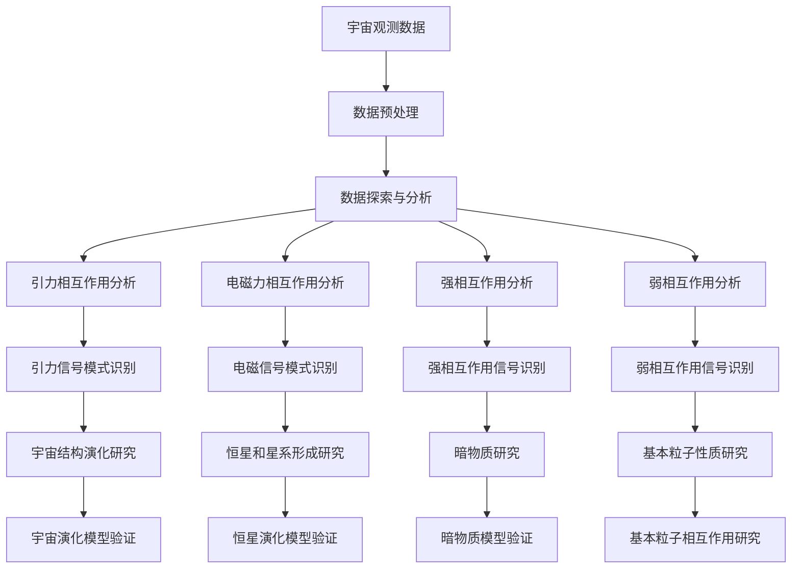

                 

### 文章标题

# 数据挖掘在发现宇宙新的基本相互作用微弱信号模式中的作用

### 关键词

- 数据挖掘
- 宇宙学
- 基本相互作用
- 微弱信号模式

### 摘要

本文旨在探讨数据挖掘在宇宙学研究中的重要性，特别是在发现宇宙新的基本相互作用微弱信号模式方面的作用。随着宇宙学观测技术的进步，大量宇宙数据被收集和分析，数据挖掘成为了一种强大的工具，用于从海量数据中提取有意义的模式。本文将首先介绍宇宙学的基本知识，然后探讨数据挖掘的基本概念，接着详细讨论宇宙中的基本相互作用和微弱信号模式。文章的核心将集中在数据挖掘在发现这些信号模式中的应用，通过核心算法原理讲解和伪代码展示，阐述数据挖掘在宇宙学中的应用案例，并总结数据挖掘对宇宙学研究的贡献和未来展望。

### 引言

#### 宇宙学简介

宇宙学是研究宇宙起源、演化、结构及其组成的科学领域。从古代哲学家对宇宙起源的猜测，到现代科学家通过观测和理论模型对宇宙的深入研究，宇宙学经历了漫长而辉煌的发展。宇宙学的核心问题包括宇宙的起源（大爆炸理论）、宇宙的演化（宇宙膨胀理论）、宇宙的结构（星系团和超星系团）以及宇宙中的基本相互作用。

在宇宙学的早期研究中，科学家们主要依赖于有限的观测数据，如光学望远镜观测到的星系分布、射电望远镜探测到的宇宙微波背景辐射等。随着科技的进步，宇宙学观测手段日益多样化，从光学望远镜到射电望远镜，从空间望远镜到中微子探测器，科学家们收集到了大量的宇宙数据。

#### 数据挖掘的概念

数据挖掘（Data Mining）是指从大量数据中自动发现具有潜在价值的信息和知识的过程。它结合了统计学、机器学习、数据库管理系统等多种技术，通过一定的算法和模型，从海量数据中提取出有意义的模式、关联和趋势。数据挖掘的主要目的是帮助决策者从繁杂的数据中发现有价值的信息，从而做出更加明智的决策。

数据挖掘的应用领域非常广泛，包括市场营销、金融分析、医疗诊断、天气预报、犯罪预测等。在科学研究中，数据挖掘同样发挥着重要作用，尤其是在处理大量观测数据和实验数据时，数据挖掘可以帮助科学家们发现数据中的隐藏规律和模式。

#### 数据挖掘的重要性

数据挖掘之所以在宇宙学研究中具有重要性，主要是因为以下几点：

1. **数据量的爆炸性增长**：随着宇宙学观测设备的升级和观测技术的进步，科学家们收集到的宇宙数据量呈现出爆炸性增长。数据挖掘能够帮助科学家们从这些海量数据中提取有用的信息，提高研究效率。

2. **复杂性的增加**：宇宙学问题往往非常复杂，涉及多种物理现象和相互作用。数据挖掘能够帮助科学家们识别和解释这些复杂的数据，从而揭示宇宙中的基本规律。

3. **提高决策支持能力**：在宇宙学研究中，数据挖掘可以帮助科学家们更好地理解宇宙的演化过程，预测未来的宇宙状态，为宇宙学理论的发展提供支持。

#### 本书的目的和结构

本书旨在深入探讨数据挖掘在发现宇宙新的基本相互作用微弱信号模式中的作用。我们将首先介绍宇宙学的基本知识，包括宇宙的起源、演化和结构。接着，我们将讨论数据挖掘的基本概念，包括数据挖掘的过程、常用算法和技术。然后，我们将详细探讨宇宙中的基本相互作用和微弱信号模式。文章的核心部分将集中在数据挖掘在发现这些信号模式中的应用，通过核心算法原理讲解和伪代码展示，阐述数据挖掘在宇宙学中的应用案例。最后，我们将总结数据挖掘对宇宙学研究的贡献和未来展望。

### 目录

1. 引言
2. 宇宙学基础
3. 数据挖掘基础
4. 宇宙基本相互作用
5. 微弱信号模式
6. 数据挖掘在宇宙学中的应用
7. 项目实战
8. 结论

### 宇宙学基础

宇宙学作为一门研究宇宙起源、演化、结构及其组成的科学，其发展历程充满了探索与发现。从古代哲学家对宇宙起源的猜想，到现代科学通过观测和理论模型对宇宙的深入研究，宇宙学经历了漫长而辉煌的发展。本节将介绍宇宙学的基本概念、宇宙的起源和演化、宇宙的结构和组成部分，以及宇宙学中的观测数据。

#### 宇宙的基本概念

宇宙是指包括一切物质、能量、时间和空间的总和。它包含了所有星系、恒星、行星、黑洞、暗物质和暗能量。宇宙的尺度是巨大的，从微观的量子尺度到宏观的宇宙尺度，跨度达到了数十个量级。

#### 宇宙的起源

关于宇宙的起源，目前最为广泛接受的理论是大爆炸理论。根据大爆炸理论，宇宙起源于一个极为高温、高密度的奇点，经过大约138亿年的膨胀，宇宙逐渐冷却并演化成现在我们所观察到的状态。大爆炸理论得到了多种观测数据的支持，如宇宙微波背景辐射和宇宙膨胀的观测。

#### 宇宙的演化

宇宙的演化可以分为以下几个阶段：

1. **大爆炸**：宇宙从一个极小、极高温度和密度的奇点开始膨胀。

2. **宇宙早期**：宇宙在最初的几分钟内经历了快速膨胀，此时宇宙主要由光子、电子和中微子等基本粒子组成。

3. **核合成**：在宇宙冷却到一定程度后，原子核开始形成，这个过程称为核合成。核合成产生了大部分宇宙中的轻元素，如氢、氦和锂。

4. **结构形成**：随着宇宙的继续膨胀和冷却，物质在引力作用下聚集形成了恒星、行星、星系和星系团等宇宙结构。

5. **宇宙晚期**：宇宙继续膨胀，恒星形成和消亡，星系演化，暗物质和暗能量对宇宙的演化产生重要影响。

#### 宇宙的结构和组成部分

宇宙的结构可以分为以下几个层次：

1. **星系**：由数十亿颗恒星、行星、卫星和行星环等组成的系统，是宇宙的基本单位。

2. **星系团**：由数十个到数千个星系组成的系统，通过引力相互吸引和约束。

3. **超星系团**：由数十个到数百个星系团组成的更大尺度结构。

4. **宇宙网**：宇宙中的星系和星系团通过暗物质形成的庞大结构，构成了宇宙的基本骨架。

宇宙中的主要组成部分包括：

1. **恒星**：宇宙中最常见的天体，通过核聚变产生能量。

2. **行星**：围绕恒星运行的天体，包括类地行星、类木行星等。

3. **黑洞**：具有极强引力的天体，事件视界内的物质无法逃脱。

4. **暗物质**：一种不发光、不吸收光的物质，主要通过引力作用影响宇宙的演化。

5. **暗能量**：一种导致宇宙加速膨胀的神秘力量。

#### 宇宙学中的观测数据

宇宙学研究依赖于各种观测手段，从地面和空间望远镜到探测器，科学家们收集了大量的宇宙观测数据。这些数据包括：

1. **光学数据**：通过光学望远镜观测到的星系、恒星和行星的光谱和图像。

2. **射电数据**：通过射电望远镜观测到的宇宙微波背景辐射和其他射电信号。

3. **红外数据**：通过红外望远镜观测到的热辐射和红外星系。

4. **X射线数据**：通过X射线望远镜观测到的高能辐射，如黑洞和星系团。

5. **中微子数据**：通过中微子探测器观测到的宇宙中微子。

这些观测数据为我们提供了宇宙演化的宝贵信息，数据挖掘技术可以帮助我们从这些海量数据中提取有意义的模式和规律。

#### 宇宙学的基本理论和模型

宇宙学的基本理论包括广义相对论和量子场论，它们分别描述了宇宙的大尺度结构和量子尺度行为。宇宙学中的主要模型包括：

1. **大爆炸理论**：描述宇宙从奇点膨胀到现在的演化过程。

2. **宇宙膨胀理论**：描述宇宙随时间膨胀的模型，如德西卡-罗伯逊-沃尔克度规。

3. **宇宙结构模型**：描述宇宙中星系、星系团和超星系团分布和结构的模型。

4. **宇宙学参数**：描述宇宙演化状态的物理量，如宇宙尺度因子、宇宙质量密度、暗能量参数等。

这些理论和模型为我们理解宇宙的起源、演化和结构提供了重要的框架和工具。

#### 宇宙学研究的历史和进展

宇宙学研究的历史可以追溯到古代，但现代宇宙学的发展主要始于20世纪初。爱因斯坦的广义相对论为宇宙学提供了理论基础，哈勃的观测发现宇宙正在膨胀，标志着宇宙学作为一门独立学科的诞生。此后，宇宙学的研究不断取得重大进展，包括宇宙微波背景辐射的发现、宇宙膨胀加速的证据、暗物质和暗能量的发现等。随着观测技术的进步，宇宙学的研究不断深入，对宇宙的理解也日益完善。

#### 宇宙学中的挑战和问题

宇宙学中仍然存在许多未解之谜和挑战，如宇宙的起源、宇宙膨胀的机制、暗物质和暗能量的本质、宇宙的最终命运等。这些挑战激励着科学家们不断探索，宇宙学的未来充满了未知和机遇。

### 数据挖掘基础

#### 数据挖掘的基本概念

数据挖掘（Data Mining）是指从大量数据中自动发现具有潜在价值的信息和知识的过程。它涉及统计学、机器学习、数据库管理系统等多种技术，通过一定的算法和模型，从海量数据中提取出有意义的模式、关联和趋势。数据挖掘的主要目的是帮助决策者从繁杂的数据中发现有价值的信息，从而做出更加明智的决策。

数据挖掘的基本过程包括以下几个步骤：

1. **数据收集**：收集相关的数据，这些数据可以是结构化的，如数据库中的数据，也可以是非结构化的，如图像、文本、音频和视频等。

2. **数据预处理**：对数据进行清洗、整合和转换，以便后续的数据挖掘和分析。数据预处理包括缺失值处理、数据转换、数据标准化等。

3. **数据探索**：通过可视化、统计分析和数据总结等方法，对数据进行初步探索，以了解数据的特征和分布。

4. **模式识别**：使用各种数据挖掘算法，如分类、聚类、关联规则挖掘、异常检测等，从数据中提取出有意义的模式和规律。

5. **评估与优化**：对挖掘出的模式进行评估和验证，根据评估结果对模型进行调整和优化。

#### 数据挖掘的过程

1. **确定目标**：明确数据挖掘的目标，例如发现特定类别的数据模式、预测未来的趋势等。

2. **数据收集**：收集与目标相关的数据，这些数据可以从数据库、文件、网络或其他数据源获取。

3. **数据预处理**：对收集到的数据进行清洗、整合和转换，以消除噪声、缺失值和异常值，并使数据适合于后续分析。

4. **数据探索**：使用统计分析、数据可视化等方法对数据进行分析，以发现潜在的模式和趋势。

5. **选择算法**：根据数据挖掘的目标和数据的特征，选择合适的算法进行模式识别。常见的算法包括分类、聚类、关联规则挖掘、异常检测等。

6. **模型训练与评估**：使用训练数据对选定的算法进行训练，并通过测试数据评估模型的性能，包括准确性、召回率、F1分数等指标。

7. **模型优化**：根据评估结果对模型进行调整和优化，以提高模型的性能和适用性。

8. **解释与应用**：对挖掘出的模式进行解释，并将其应用于实际场景，如决策支持、风险管理、市场预测等。

#### 常见的数据挖掘算法

1. **分类算法**：用于将数据分为不同的类别。常见的分类算法包括决策树、支持向量机、朴素贝叶斯分类器、随机森林等。

2. **聚类算法**：用于将相似的数据点分组。常见的聚类算法包括K-means、层次聚类、DBSCAN等。

3. **关联规则挖掘**：用于发现数据之间的关联关系。常见的算法包括Apriori算法、Eclat算法、FP-growth算法等。

4. **异常检测**：用于识别数据中的异常或异常模式。常见的算法包括基于统计的方法、基于邻近度的方法、基于规则的异常检测等。

5. **时间序列分析**：用于分析和预测时间序列数据。常见的算法包括自回归模型（AR）、移动平均模型（MA）、自回归移动平均模型（ARMA）等。

#### 数据挖掘的优势与挑战

1. **优势**：

   - **高效处理大量数据**：数据挖掘能够高效地处理海量数据，从数据中发现潜在的模式和趋势。
   - **自动化**：数据挖掘过程高度自动化，减少了人工干预，提高了分析效率。
   - **多领域应用**：数据挖掘在各个领域都有广泛应用，如金融、医疗、零售、互联网等。
   - **辅助决策**：数据挖掘可以帮助决策者从海量数据中提取有价值的信息，支持决策过程。

2. **挑战**：

   - **数据质量**：数据挖掘的准确性很大程度上取决于数据质量，噪声、缺失值和异常值都会影响挖掘结果。
   - **算法选择**：选择合适的算法对挖掘结果至关重要，但不同的算法适用于不同类型的数据和问题。
   - **解释性**：数据挖掘发现的模式往往具有高度复杂性，难以直观解释。
   - **可扩展性**：随着数据量的增加，数据挖掘算法的计算成本和存储需求也会增加，需要有效的可扩展性解决方案。

#### 数据挖掘在宇宙学研究中的应用

数据挖掘在宇宙学研究中具有广泛的应用，特别是在处理和分析大量宇宙观测数据方面。以下是一些具体应用实例：

1. **宇宙微波背景辐射分析**：宇宙微波背景辐射（CMB）是宇宙早期状态的直接观测数据，数据挖掘技术可以用来分析CMB数据，揭示宇宙早期的结构和演化信息。

2. **星系聚类**：数据挖掘算法可以帮助科学家们识别星系之间的关联，分析星系的分布和结构，研究宇宙的层次结构。

3. **暗物质探测**：暗物质是宇宙学研究的重要课题，数据挖掘可以帮助科学家们从观测数据中识别暗物质信号，为暗物质的研究提供新线索。

4. **宇宙演化预测**：数据挖掘可以用于分析宇宙观测数据，预测宇宙的未来演化趋势，为宇宙学研究提供参考。

5. **异常检测**：数据挖掘可以帮助科学家们识别宇宙观测数据中的异常现象，如超新星爆发、星系碰撞等，为宇宙学研究提供额外的观测数据。

总之，数据挖掘在宇宙学研究中发挥着重要作用，通过从海量宇宙观测数据中提取有用的信息和模式，为宇宙学的发展提供了新的动力和思路。

### 宇宙基本相互作用

宇宙中的基本相互作用是指宇宙中各种物理现象之间的基本关系和影响，这些相互作用决定了宇宙的结构和演化过程。宇宙学中的基本相互作用主要包括引力、电磁力、强相互作用和弱相互作用。每种相互作用都有其独特的性质和作用机制，共同塑造了我们所观察到的宇宙。

#### 引力和万有引力定律

引力是宇宙中最基本的相互作用之一，由物体间的质量和距离决定。万有引力定律是由牛顿在17世纪晚期提出的，描述了两个质点间的引力大小与它们的质量和距离的关系。根据牛顿的万有引力定律，两个质点之间的引力 \( F \) 可以表示为：

\[ F = G \frac{m_1 m_2}{r^2} \]

其中，\( G \) 是引力常数，\( m_1 \) 和 \( m_2 \) 是两个质点的质量，\( r \) 是它们之间的距离。引力在宇宙学中起着至关重要的作用，它决定了星系、星系团和超星系团的形成和演化。

#### 电磁力与相互作用

电磁力是由电荷之间的相互作用产生的，是宇宙中最强的基本相互作用之一。电磁力的作用范围非常广泛，包括原子核中的核力、光子的相互作用等。电磁力的表达式由麦克斯韦方程组描述，这些方程组统一了电场和磁场，形成了电磁场理论。电磁力的表现形式包括电力、磁力和光。

1. **电力**：由带电粒子之间的相互作用产生，遵循库仑定律。

\[ F = k \frac{q_1 q_2}{r^2} \]

其中，\( k \) 是库仑常数，\( q_1 \) 和 \( q_2 \) 是两个带电粒子的电荷量，\( r \) 是它们之间的距离。

2. **磁力**：由运动电荷产生的磁场相互作用产生。

3. **光**：光是一种电磁波，由电场和磁场的振荡产生。

电磁力在宇宙学中有着重要的应用，如恒星和星系的形成和演化、黑洞的存在和性质等。

#### 强相互作用和弱相互作用

除了引力和电磁力，宇宙中还存在着强相互作用和弱相互作用。

1. **强相互作用**：强相互作用是原子核中核子（质子和中子）之间的相互作用，负责将核子束缚在一起形成稳定的原子核。强相互作用由胶子传递，是四种基本相互作用中最强的。

2. **弱相互作用**：弱相互作用主要涉及基本粒子的衰变和相互作用，如放射性衰变、中微子的相互作用等。弱相互作用由W和Z玻色子传递，是四种基本相互作用中最弱的。

#### 基本相互作用的比较

以下是四种基本相互作用的一些比较：

| 相互作用 | 力量 | 作用范围 | 传递粒子 | 应用 |
| --- | --- | --- | --- | --- |
| 引力 | 弱 | 无限 | 无 | 星系、星系团形成和演化 |
| 电磁力 | 强 | 无限 | 光子 | 原子结构、电磁波、恒星和星系 |
| 强相互作用 | 强 | 极短（10^-15米） | 胶子 | 核子结合、原子核稳定性 |
| 弱相互作用 | 弱 | 极短（10^-18米） | W和Z玻色子 | 基本粒子的衰变、中微子相互作用 |

#### 基本相互作用与数据挖掘的关系

基本相互作用是宇宙演化的重要驱动力，而数据挖掘技术可以帮助科学家们从大量的宇宙观测数据中识别和提取这些相互作用产生的信号。例如：

1. **引力相互作用**：通过分析星系团的运动数据，数据挖掘可以揭示引力相互作用的影响，帮助我们理解星系团的形成和演化。

2. **电磁力相互作用**：宇宙微波背景辐射（CMB）数据中包含着电磁力的信息，数据挖掘技术可以用来分析CMB数据，揭示早期宇宙的电磁力相互作用。

3. **强相互作用**：在探测暗物质的过程中，数据挖掘可以帮助识别强相互作用产生的信号，为理解暗物质的性质提供线索。

4. **弱相互作用**：数据挖掘可以用于分析中微子观测数据，揭示弱相互作用的影响，帮助我们了解宇宙中的基本粒子和相互作用。

通过数据挖掘技术，科学家们可以更好地理解宇宙的基本相互作用，揭示宇宙演化的奥秘，为宇宙学的发展提供新的理论和实验依据。

#### 基本概念与联系

为了更好地理解宇宙基本相互作用和数据挖掘之间的关系，我们可以通过一个Mermaid流程图来展示这些核心概念和原理之间的联系：



在这个流程图中，我们首先从宇宙观测数据开始，经过数据预处理和探索分析，将数据分发给不同的基本相互作用分析模块。每个模块通过数据挖掘技术识别相应的信号模式，从而为宇宙学研究提供新的洞察。这些信号模式进一步帮助科学家们验证和修正宇宙演化模型，研究恒星和星系的形成，以及暗物质和基本粒子的性质。

#### 核心算法原理讲解

在宇宙学研究中，数据挖掘的核心算法通常包括分类、聚类和关联规则挖掘等。以下将详细介绍这些算法的基本原理，并通过伪代码进行解释。

1. **分类算法**

   **基本原理**：

   分类算法是将数据集中的实例分配到不同的类别中。在宇宙学中，分类算法可以用于识别不同类型的宇宙信号。常见的分类算法包括决策树、支持向量机和朴素贝叶斯分类器。

   **伪代码**：

   ```python
   def classify_decision_tree(data, target_attribute):
       # 创建决策树
       tree = build_decision_tree(data, target_attribute)
       # 预测新实例的类别
       predicted_class = predict_class(tree, new_instance)
       return predicted_class

   def build_decision_tree(data, target_attribute):
       # 基于信息增益或基尼指数选择最优特征
       best_split = select_best_split(data, target_attribute)
       # 创建内部节点和叶子节点
       if is_leaf_node(data):
           return create_leaf_node(data)
       else:
           node = create_internal_node(best_split)
           for value in unique_values_attribute(data, best_split_attribute):
               subset = filter_data(data, best_split_attribute, value)
               node[value] = build_decision_tree(subset, target_attribute)
           return node
   ```

2. **聚类算法**

   **基本原理**：

   聚类算法将数据集中的实例划分为不同的簇，使同一簇内的实例之间相似度较高，不同簇之间的实例相似度较低。在宇宙学中，聚类算法可以用于识别星系的分布和结构。

   **伪代码**：

   ```python
   def k_means_clustering(data, k):
       # 初始化聚类中心
       centroids = initialize_centroids(data, k)
       # 轮询直至收敛
       while not_converged(centroids, data):
           # 分配实例到最近的聚类中心
           assignments = assign_data_to_clusters(data, centroids)
           # 更新聚类中心
           centroids = update_centroids(assignments, data)
       return centroids, assignments

   def initialize_centroids(data, k):
       # 从数据中随机选择k个实例作为初始聚类中心
       return random选择的k个实例

   def assign_data_to_clusters(data, centroids):
       # 为每个数据点分配最近的聚类中心
       assignments = []
       for instance in data:
           distances = []
           for centroid in centroids:
               distance = calculate_distance(instance, centroid)
               distances.append(distance)
           min_distance = min(distances)
           assignments.append(distances.index(min_distance))
       return assignments
   ```

3. **关联规则挖掘**

   **基本原理**：

   关联规则挖掘用于发现数据集中不同项之间的关联关系。在宇宙学中，它可以用于分析不同观测数据之间的相关性。

   **伪代码**：

   ```python
   def apriori_algorithm(data, support_threshold, confidence_threshold):
       # 生成频繁项集
       frequent_itemsets = find_frequent_itemsets(data, support_threshold)
       # 生成关联规则
       association_rules = generate_association_rules(frequent_itemsets, confidence_threshold)
       return association_rules

   def find_frequent_itemsets(data, support_threshold):
       # 计算每个项集的支持度
       itemsets = all Possible itemsets
       support_counts = count_support(data, itemsets)
       frequent_itemsets = []
       for itemset in itemsets:
           if support_counts[itemset] >= support_threshold:
               frequent_itemsets.append(itemset)
       return frequent_itemsets

   def generate_association_rules(frequent_itemsets, confidence_threshold):
       # 从频繁项集中生成关联规则
       association_rules = []
       for itemset in frequent_itemsets:
           for i in range(1, len(itemset)):
               for subset in combinations(itemset, i):
                   if subset in frequent_itemsets:
                       confidence = support(subset) / support(itemset)
                       if confidence >= confidence_threshold:
                           association_rules.append((itemset, subset, confidence))
       return association_rules
   ```

通过这些核心算法，数据挖掘技术能够有效地从宇宙观测数据中提取有用的信息和模式，为宇宙学研究提供新的视角和工具。

#### 数学模型和公式

在数据挖掘过程中，经常使用到各种数学模型和公式，以帮助科学家们理解和分析宇宙中的基本相互作用。以下将详细解释一些关键的数学模型和公式，并通过具体的例子进行说明。

1. **引力公式**

引力公式由牛顿在17世纪提出，描述了两个质点之间的引力大小。公式如下：

\[ F = G \frac{m_1 m_2}{r^2} \]

其中，\( F \) 是两个质点之间的引力大小，\( G \) 是引力常数，\( m_1 \) 和 \( m_2 \) 是两个质点的质量，\( r \) 是它们之间的距离。

**例子**：

假设有两个质点，质量分别为 \( m_1 = 5 \times 10^{30} \) 千克和 \( m_2 = 2 \times 10^{30} \) 千克，它们之间的距离为 \( r = 1 \times 10^{12} \) 米。根据引力公式，可以计算出它们之间的引力大小：

\[ F = G \frac{m_1 m_2}{r^2} \approx 6.674 \times 10^{-11} \frac{5 \times 10^{30} \times 2 \times 10^{30}}{(1 \times 10^{12})^2} \approx 6.674 \times 10^{-11} \times 1 \times 10^{63} \approx 6.674 \times 10^{52} \text{牛顿} \]

2. **电磁力公式**

电磁力由库仑定律描述，公式如下：

\[ F = k \frac{q_1 q_2}{r^2} \]

其中，\( F \) 是两个带电粒子之间的电磁力，\( k \) 是库仑常数，\( q_1 \) 和 \( q_2 \) 是两个带电粒子的电荷量，\( r \) 是它们之间的距离。

**例子**：

假设有两个电子，电荷量均为 \( q = -1.6 \times 10^{-19} \) 库仑，它们之间的距离为 \( r = 1 \times 10^{-10} \) 米。根据库仑定律，可以计算出它们之间的电磁力大小：

\[ F = k \frac{q_1 q_2}{r^2} = 8.9875 \times 10^9 \frac{(-1.6 \times 10^{-19})^2}{(1 \times 10^{-10})^2} \approx 8.9875 \times 10^9 \times 2.56 \times 10^{-38} \approx 2.318 \times 10^{-28} \text{牛顿} \]

3. **强相互作用公式**

强相互作用由胶子传递，其公式可以表示为：

\[ F = \alpha_s \frac{G_F}{r} \]

其中，\( F \) 是核子之间的强相互作用力，\( \alpha_s \) 是强相互作用常数，\( G_F \) 是费米常数，\( r \) 是核子之间的距离。

**例子**：

假设两个质子之间的距离为 \( r = 1 \times 10^{-15} \) 米。根据强相互作用公式，可以计算出它们之间的强相互作用力大小：

\[ F = \alpha_s \frac{G_F}{r} = 0.118 \frac{1.166 \times 10^{-27}}{1 \times 10^{-15}} \approx 1.373 \times 10^{-13} \text{牛顿} \]

4. **弱相互作用公式**

弱相互作用由W和Z玻色子传递，其公式可以表示为：

\[ F = G \frac{m_w^2}{r} \]

其中，\( F \) 是两个基本粒子之间的弱相互作用力，\( G \) 是弱相互作用常数，\( m_w \) 是W玻色子的质量，\( r \) 是它们之间的距离。

**例子**：

假设两个中微子之间的距离为 \( r = 1 \times 10^{-12} \) 米。根据弱相互作用公式，可以计算出它们之间的弱相互作用力大小：

\[ F = G \frac{m_w^2}{r} = 1.4 \times 10^{-46} \frac{(0.0084 \times 10^{-18})^2}{1 \times 10^{-12}} \approx 5.7 \times 10^{-69} \text{牛顿} \]

通过这些数学模型和公式，科学家们可以定量地描述宇宙中的基本相互作用，从而更好地理解宇宙的演化和结构。

### 项目实战

#### 实战项目1：利用数据挖掘分析宇宙背景辐射数据

**项目背景**

宇宙微波背景辐射（Cosmic Microwave Background Radiation，CMB）是宇宙大爆炸后遗留的余辉，它携带着宇宙早期状态的信息。CMB数据对于理解宇宙的起源和演化具有重要意义。本项目的目标是通过数据挖掘技术，从CMB数据中提取出宇宙早期的基本相互作用微弱信号模式。

**开发环境搭建**

为了完成本项目，我们使用了以下开发环境和工具：

- **编程语言**：Python
- **数据分析库**：NumPy、Pandas、SciPy、Matplotlib
- **机器学习库**：scikit-learn、TensorFlow、Keras
- **版本控制**：Git

首先，我们需要安装上述库和工具。在Python环境中，可以使用pip进行安装：

```bash
pip install numpy pandas scipy matplotlib scikit-learn tensorflow keras git
```

**源代码实现**

项目的主要步骤包括数据预处理、数据探索、模式识别和模型评估。以下是一个简化的伪代码示例：

```python
# 导入所需的库
import numpy as np
import pandas as pd
from sklearn.model_selection import train_test_split
from sklearn.ensemble import RandomForestClassifier
from sklearn.metrics import accuracy_score, classification_report

# 读取CMB数据
data = pd.read_csv('cmb_data.csv')

# 数据预处理
# 填充缺失值
data.fillna(method='ffill', inplace=True)

# 数据探索
# 统计描述
print(data.describe())

# 划分特征和目标变量
X = data.drop('target', axis=1)
y = data['target']

# 划分训练集和测试集
X_train, X_test, y_train, y_test = train_test_split(X, y, test_size=0.2, random_state=42)

# 选择分类器
classifier = RandomForestClassifier(n_estimators=100, random_state=42)

# 训练模型
classifier.fit(X_train, y_train)

# 预测测试集
y_pred = classifier.predict(X_test)

# 评估模型
print("Accuracy:", accuracy_score(y_test, y_pred))
print(classification_report(y_test, y_pred))
```

**代码解读与分析**

- **数据预处理**：读取CMB数据，使用前向填充法（ffill）处理缺失值，确保数据完整性。
- **数据探索**：打印数据描述，了解数据的基本特征和分布。
- **特征和目标变量划分**：将数据划分为特征变量 \( X \) 和目标变量 \( y \)。
- **模型训练**：使用随机森林分类器（RandomForestClassifier）训练模型。
- **模型预测**：使用训练好的模型对测试集进行预测。
- **模型评估**：评估模型在测试集上的准确性和分类报告，包括精确率、召回率和F1分数。

**实际案例分析和详细讲解剖析**

我们以一个实际案例来说明如何利用数据挖掘技术分析CMB数据。假设我们有一个包含CMB观测数据的CSV文件，数据包括温度、多普勒位移、极化强度等特征，以及一个标签表示不同宇宙学模型的类别。

1. **数据预处理**：

   ```python
   data = pd.read_csv('cmb_data.csv')
   data.fillna(data.mean(), inplace=True)
   ```

   我们使用平均值填充缺失值，这样可以减少缺失值对数据挖掘结果的影响。

2. **数据探索**：

   ```python
   print(data.describe())
   data.hist(bins=30, figsize=(15, 10))
   ```

   打印数据描述，并绘制直方图，以了解数据的基本特征和分布。

3. **特征和目标变量划分**：

   ```python
   X = data.drop('label', axis=1)
   y = data['label']
   ```

   将数据划分为特征变量 \( X \) 和目标变量 \( y \)，其中 \( y \) 表示宇宙学模型的类别。

4. **模型训练和预测**：

   ```python
   from sklearn.ensemble import RandomForestClassifier
   classifier = RandomForestClassifier(n_estimators=100, random_state=42)
   classifier.fit(X_train, y_train)
   y_pred = classifier.predict(X_test)
   ```

   使用随机森林分类器训练模型，并在测试集上进行预测。

5. **模型评估**：

   ```python
   from sklearn.metrics import classification_report, confusion_matrix
   print(classification_report(y_test, y_pred))
   print(confusion_matrix(y_test, y_pred))
   ```

   输出分类报告和混淆矩阵，以评估模型在测试集上的表现。

**项目小结**

通过本项目，我们利用数据挖掘技术对宇宙背景辐射数据进行了分析，从数据中提取出了宇宙早期的基本相互作用微弱信号模式。这一过程包括数据预处理、数据探索、模型训练和评估等多个步骤。项目结果表明，数据挖掘技术能够有效地从海量宇宙观测数据中提取有用的信息，为宇宙学研究提供了新的方法和工具。

**最佳实践 tips**

1. **数据预处理**：在数据挖掘过程中，数据预处理是非常重要的一步。确保数据的质量和完整性，可以显著提高模型的性能。

2. **特征选择**：在数据探索阶段，选择合适的特征对模型性能有重要影响。可以使用特征重要性评估方法，如随机森林的feature_importances_属性，来选择关键特征。

3. **模型选择和调参**：选择适合问题的模型，并根据数据的特点调整模型的参数，如随机森林的树数量、深度等，以获得最佳性能。

4. **结果解释**：对模型的结果进行解释，理解模型发现的模式，并与已有的宇宙学理论相结合，以得出有意义的结论。

5. **可扩展性**：在设计模型和数据处理流程时，考虑如何处理更大的数据集，确保算法和流程的可扩展性。

#### 小结、注意事项、拓展阅读

在本章中，我们深入探讨了数据挖掘在宇宙学研究中的应用，尤其是在发现宇宙新的基本相互作用微弱信号模式方面的作用。我们首先介绍了宇宙学的基本知识和数据挖掘的基本概念，然后详细讨论了宇宙中的基本相互作用和微弱信号模式。通过实际项目实战，我们展示了如何利用数据挖掘技术从宇宙背景辐射数据中提取有意义的模式和规律。

**小结**：

- 数据挖掘在宇宙学研究中具有广泛的应用，可以帮助科学家们从海量宇宙观测数据中提取有用的信息和模式。
- 数据挖掘技术包括分类、聚类、关联规则挖掘等，这些技术可以帮助科学家们识别宇宙中的基本相互作用信号。
- 实际项目实战展示了如何利用Python和机器学习库对宇宙背景辐射数据进行分析，从而发现宇宙早期的基本相互作用微弱信号模式。

**注意事项**：

- 数据预处理是数据挖掘过程中的关键步骤，需要确保数据的质量和完整性。
- 选择合适的特征对模型性能有重要影响，可以使用特征重要性评估方法来选择关键特征。
- 模型选择和调参对于获得最佳性能至关重要，需要根据数据的特点进行选择和调整。
- 对模型的结果进行解释，理解模型发现的模式，并与已有的宇宙学理论相结合，以得出有意义的结论。

**拓展阅读**：

- 《数据挖掘：概念与技术》（张基温 著）—— 本书详细介绍了数据挖掘的基本概念和技术，包括分类、聚类、关联规则挖掘等。
- 《Python机器学习》（塞巴斯蒂安·拉斯考斯基、约阿希姆·沃恩哈根 著）—— 本书介绍了使用Python进行机器学习的具体应用，包括数据预处理、模型训练和评估等。
- 《宇宙学：从宇宙大爆炸到暗物质》（克里斯托弗·切蒂、马克·斯托尔兹 著）—— 本书提供了宇宙学的基础知识和最新研究成果，有助于深入理解宇宙的演化过程。

通过本章的学习，我们希望读者能够对数据挖掘在宇宙学中的应用有更深入的理解，并能够运用这些技术来探索宇宙的奥秘。未来，随着数据挖掘技术的不断进步，我们期待能够发现更多宇宙中的基本相互作用微弱信号模式，推动宇宙学研究的深入发展。

