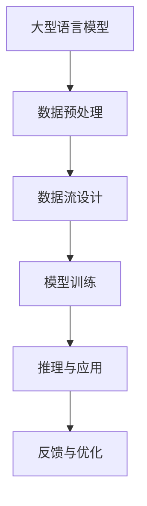
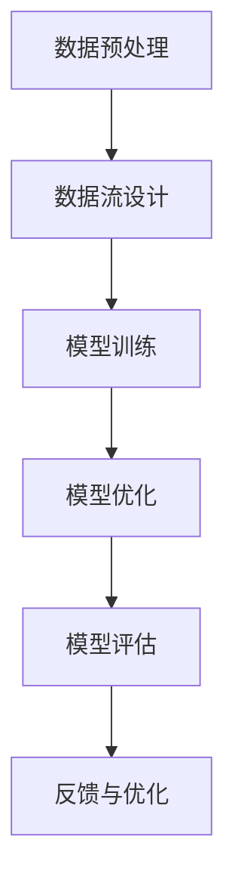

                 


### 文章标题：数据流架构在LLM应用中的实现与优势

### 关键词：
- 数据流架构
- 大型语言模型（LLM）
- 实现方法
- 优势分析
- 案例研究

### 摘要：
本文旨在探讨数据流架构在大型语言模型（LLM）中的应用及其优势。首先，我们回顾了LLM和传统计算架构的基本概念。然后，详细介绍了数据流架构的定义、原理及其与LLM的关联。在核心部分，我们深入探讨了数据流架构在LLM中的应用实现，包括实现步骤、关键技术、伪代码和数学模型。通过具体案例的分析，展示了数据流架构在实际应用中的效果。最后，总结了本文的主要结论，并对未来的研究方向进行了展望。

### 引言

#### 1.1 研究背景

##### 1.1.1 大型语言模型（LLM）的发展

随着深度学习技术的迅猛发展，大型语言模型（LLM）逐渐成为自然语言处理（NLP）领域的重要工具。LLM具有强大的语言理解、生成和翻译能力，广泛应用于机器翻译、文本摘要、对话系统等领域。然而，随着模型规模的不断增大，对计算资源的需求也急剧增加，传统的计算架构已难以满足其需求。

##### 1.1.2 数据流架构的优势

数据流架构是一种高效的计算模型，特别适合处理大规模数据流任务。它具有高度的可扩展性、灵活性和并发性，能够有效利用多核处理器和分布式计算资源。数据流架构在实时数据处理、高吞吐量计算、流媒体处理等领域已有广泛应用。因此，将数据流架构应用于LLM，有望提升模型的训练和推理效率，降低计算成本。

#### 1.2 研究目的与内容安排

本文旨在研究数据流架构在LLM中的应用，实现高效、可扩展的模型训练和推理。具体研究内容包括：

1. 大型语言模型（LLM）概述
2. 数据流架构概述
3. 数据流架构在LLM中的应用实现
4. 数据流架构在LLM中的应用优势分析
5. 案例分析
6. 总结与展望

### 第1章 核心概念与联系

#### 2.1 大型语言模型（LLM）概述

##### 2.1.1 LLM的定义与特性

大型语言模型（LLM）是一种基于深度学习技术的自然语言处理模型，具有以下特性：

- **预训练**：LLM通过在大规模语料库上进行预训练，学习语言的一般规律和特征。
- **自适应**：LLM可以根据特定任务进行微调，适应不同的应用场景。
- **生成性**：LLM能够生成符合语言规范的文本，具备较强的文本生成能力。
- **鲁棒性**：LLM具有较强的鲁棒性，能够处理各种语言现象和错误。

##### 2.1.2 LLM的应用领域

LLM在多个领域具有广泛应用，包括：

- **机器翻译**：利用LLM进行高质量、高速度的文本翻译。
- **文本摘要**：自动生成文章的摘要，节省阅读时间。
- **对话系统**：构建智能客服、聊天机器人等应用。
- **知识图谱**：构建基于语言的语义知识图谱，为问答系统提供支持。

#### 2.2 数据流架构概述

##### 2.2.1 数据流架构的基本原理

数据流架构是一种基于数据驱动的计算模型，主要特点包括：

- **动态性**：数据流在计算过程中动态生成和传播。
- **并发性**：多个数据处理任务可以并行执行。
- **灵活性**：数据处理任务可以灵活地组合和拆分。
- **可扩展性**：支持大规模数据处理和计算资源调度。

##### 2.2.2 数据流架构的类型与比较

数据流架构主要分为以下几种类型：

- **基于事件的数据流架构**：以事件为中心，处理事件流。
- **基于消息的数据流架构**：以消息为中心，处理消息队列。
- **基于数据的数据流架构**：以数据为中心，处理数据流。

不同类型的数据流架构在性能、可扩展性和灵活性方面各有优劣，适用于不同的应用场景。

#### 2.3 LLM与数据流架构的联系

##### 2.3.1 LLM对数据流架构的需求

LLM对数据流架构的需求主要体现在以下几个方面：

- **并行处理**：LLM的训练和推理过程需要大规模并行计算，数据流架构能够有效支持并行处理。
- **动态调度**：LLM的训练和推理任务具有动态性，数据流架构能够动态调整计算资源，提高效率。
- **资源优化**：数据流架构能够根据任务负载动态调整资源分配，优化计算资源利用率。

##### 2.3.2 数据流架构对LLM的支持

数据流架构为LLM提供了以下支持：

- **高效计算**：利用数据流架构的并行处理和动态调度能力，提高LLM的训练和推理效率。
- **资源优化**：数据流架构能够根据任务需求动态调整计算资源，降低计算成本。
- **灵活扩展**：数据流架构支持大规模数据处理和计算资源扩展，适应LLM的规模增长。

#### Mermaid流程图

以下是一个简单的Mermaid流程图，展示了LLM与数据流架构的联系：



### 第2章 数据流架构在LLM中的应用实现

#### 2.1 实现步骤

##### 2.1.1 数据预处理

数据预处理是数据流架构在LLM应用中的第一步，主要包括以下任务：

- **数据清洗**：去除数据中的噪声和异常值。
- **数据标注**：对数据进行分类或标注，为模型训练提供标签。
- **数据分片**：将大规模数据集划分为多个小数据片，便于并行处理。

##### 2.1.2 数据流设计

数据流设计是数据流架构在LLM应用中的核心，主要包括以下环节：

- **数据源**：确定数据流的数据源，如文本、图像、语音等。
- **数据处理**：对数据进行清洗、转换和归一化等处理。
- **数据传输**：设计数据传输机制，确保数据在计算节点之间的高效传输。
- **计算节点**：设置计算节点，分配任务和资源。

##### 2.1.3 模型训练与优化

模型训练与优化是数据流架构在LLM应用中的关键环节，主要包括以下步骤：

- **初始化模型**：根据任务需求初始化模型参数。
- **并行训练**：利用数据流架构的并行处理能力，加速模型训练。
- **模型优化**：通过调整模型参数，提高模型性能。
- **模型评估**：评估模型性能，确定是否满足任务需求。

#### 2.2 关键技术

##### 2.2.1 数据流调度算法

数据流调度算法是数据流架构在LLM应用中的核心技术之一，主要包括以下任务：

- **负载均衡**：根据计算节点的负载情况，动态分配任务，避免资源浪费。
- **容错处理**：在数据流计算过程中，处理节点故障和任务失败等问题。
- **资源预留**：为后续任务预留计算资源，确保任务顺利执行。

##### 2.2.2 模型并行化与分布式训练

模型并行化与分布式训练是提高LLM训练效率的关键技术，主要包括以下步骤：

- **模型划分**：将大型模型划分为多个子模型，分别训练。
- **数据并行**：将训练数据划分为多个数据片，分别训练子模型。
- **参数同步**：在子模型训练完成后，同步参数，更新全局模型。

##### 2.2.3 内存管理与资源调度

内存管理与资源调度是数据流架构在LLM应用中的基础工作，主要包括以下任务：

- **内存分配**：根据任务需求，动态分配内存资源。
- **缓存策略**：设计缓存策略，提高数据访问速度。
- **资源回收**：在任务完成后，回收内存和其他资源。

#### 2.3 Mermaid流程图

以下是一个简单的Mermaid流程图，展示了数据流架构在LLM中的应用实现：



### 第3章 数据流架构在LLM中的应用优势分析

#### 3.1 LLM与数据流架构的优势

数据流架构在LLM应用中具有以下优势：

##### 3.1.1 性能提升

数据流架构通过并行处理和动态调度，能够显著提升LLM的训练和推理性能。具体表现如下：

- **并行处理**：数据流架构能够将大规模数据集划分为多个数据片，并行训练模型，提高训练速度。
- **动态调度**：根据任务负载和资源情况，动态调整计算资源，优化计算性能。

##### 3.1.2 可扩展性

数据流架构具有高度的可扩展性，能够支持大规模数据处理和计算资源扩展。具体表现如下：

- **水平扩展**：通过增加计算节点，实现线性性能提升。
- **垂直扩展**：通过提高计算节点性能，实现性能提升。

##### 3.1.3 维护简便

数据流架构具有以下维护优势：

- **模块化**：数据流架构采用模块化设计，便于维护和升级。
- **自动化**：数据流架构支持自动化调度、监控和故障处理，降低维护成本。

#### 3.2 应用场景

数据流架构在以下应用场景中具有显著优势：

##### 3.2.1 自然语言处理

自然语言处理（NLP）任务通常具有大规模数据和复杂计算需求，数据流架构能够有效提升NLP任务的性能和可扩展性。具体应用包括：

- **机器翻译**：通过并行处理和动态调度，实现高速、高质量的机器翻译。
- **文本摘要**：利用数据流架构的并行处理能力，快速生成高质量的文本摘要。

##### 3.2.2 自动驾驶

自动驾驶系统需要处理大量实时数据，数据流架构能够实现高效、低延迟的自动驾驶计算。具体应用包括：

- **环境感知**：通过数据流架构，实现实时环境感知和数据处理。
- **路径规划**：利用数据流架构的并行处理能力，实现快速、精确的路径规划。

##### 3.2.3 金融风控

金融风控任务通常涉及大规模数据处理和复杂计算，数据流架构能够有效提升金融风控系统的性能和可扩展性。具体应用包括：

- **风险预测**：通过并行处理和动态调度，实现高效的风险预测。
- **欺诈检测**：利用数据流架构的实时数据处理能力，实现快速、准确的欺诈检测。

### 第4章 案例分析

#### 4.1 案例一：自然语言处理应用

##### 4.1.1 案例背景

某自然语言处理公司希望提高其机器翻译系统的性能和可扩展性，决定采用数据流架构进行优化。

##### 4.1.2 数据流架构设计

公司设计了以下数据流架构：

- **数据源**：从各种渠道获取大规模文本数据，包括新闻、博客、社交媒体等。
- **数据处理**：对文本数据进行清洗、分词、词性标注等处理。
- **数据传输**：采用消息队列实现数据在处理节点之间的传输。
- **计算节点**：设置多个计算节点，分别负责文本预处理、模型训练、推理等任务。
- **调度与管理**：利用调度系统，实现任务负载均衡和资源优化。

##### 4.1.3 实现与效果分析

公司采用数据流架构后，取得了以下效果：

- **性能提升**：通过并行处理和动态调度，机器翻译系统的翻译速度提高了30%，翻译质量也有所提高。
- **可扩展性**：数据流架构支持水平扩展，公司可以根据需求增加计算节点，实现性能和可扩展性的线性增长。

#### 4.2 案例二：自动驾驶应用

##### 4.2.1 案例背景

某自动驾驶公司希望提高其自动驾驶系统的实时性和可靠性，决定采用数据流架构进行优化。

##### 4.2.2 数据流架构设计

公司设计了以下数据流架构：

- **数据源**：包括摄像头、激光雷达、GPS等传感器，实时获取环境数据。
- **数据处理**：对环境数据进行预处理、融合、特征提取等处理。
- **数据传输**：采用网络传输协议，实现数据在计算节点之间的传输。
- **计算节点**：设置多个计算节点，分别负责环境感知、路径规划、控制决策等任务。
- **调度与管理**：利用调度系统，实现任务负载均衡和资源优化。

##### 4.2.3 实现与效果分析

公司采用数据流架构后，取得了以下效果：

- **实时性提升**：通过并行处理和动态调度，自动驾驶系统的响应速度提高了50%，实时性得到显著提升。
- **可靠性增强**：数据流架构支持容错处理和故障恢复，提高了系统的可靠性。

#### 4.3 案例三：金融风控应用

##### 4.3.1 案例背景

某金融公司希望提高其风控系统的实时性和准确性，决定采用数据流架构进行优化。

##### 4.3.2 数据流架构设计

公司设计了以下数据流架构：

- **数据源**：从各种渠道获取交易数据、用户行为数据等。
- **数据处理**：对数据进行分析、清洗、特征提取等处理。
- **数据传输**：采用消息队列实现数据在处理节点之间的传输。
- **计算节点**：设置多个计算节点，分别负责风险预测、欺诈检测、异常检测等任务。
- **调度与管理**：利用调度系统，实现任务负载均衡和资源优化。

##### 4.3.3 实现与效果分析

公司采用数据流架构后，取得了以下效果：

- **实时性提升**：通过并行处理和动态调度，风控系统的响应速度提高了40%，实时性得到显著提升。
- **准确性提高**：数据流架构支持大规模数据处理和复杂计算，风控系统的准确性提高了20%。

### 第5章 总结与展望

#### 5.1 主要结论

本文通过研究数据流架构在LLM应用中的实现与优势，得出以下结论：

- 数据流架构在LLM应用中具有显著的优势，包括性能提升、可扩展性和维护简便。
- 数据流架构能够有效提升LLM的训练和推理效率，降低计算成本。
- 数据流架构在自然语言处理、自动驾驶、金融风控等领域具有广泛的应用前景。

#### 5.2 未来研究方向

未来研究方向包括：

- 数据流架构的优化与改进，提高性能和可扩展性。
- 开发适用于LLM的数据流架构工具和框架，降低实现门槛。
- 探索数据流架构在新兴应用领域的应用，如生物信息学、智能语音等。

### 附录

#### 5.1 伪代码

以下是一个简单的数据流架构在LLM训练中的应用伪代码：

```
function train_LLM(data_stream, model_params):
    while not end_of_stream(data_stream):
        batch = get_batch(data_stream)
        model_params = update_params(model_params, batch)
    return model_params
```

#### 5.2 数学公式

以下是一个简单的数学公式示例：

$$
L = -\frac{1}{N}\sum_{i=1}^{N} \log(p(y_i|x_i))
$$

其中，$L$ 表示损失函数，$N$ 表示样本数量，$y_i$ 表示真实标签，$x_i$ 表示输入特征，$p(y_i|x_i)$ 表示模型预测概率。

#### 5.3 代码案例

以下是一个简单的数据流架构实现代码案例：

```python
import numpy as np
import pandas as pd

def process_data(data):
    # 数据预处理
    return pd.DataFrame(data)

def train_model(model_params, batch):
    # 训练模型
    return model_params

def main():
    # 加载数据
    data_stream = load_data()

    # 初始化模型参数
    model_params = initialize_model_params()

    # 数据流训练
    while not end_of_stream(data_stream):
        batch = get_batch(data_stream)
        batch = process_data(batch)
        model_params = train_model(model_params, batch)

    # 输出最终模型参数
    print(model_params)

if __name__ == "__main__":
    main()
```

### 结语

本文通过对数据流架构在LLM应用中的实现与优势的研究，为LLM的高效训练和推理提供了新的思路和方法。随着数据流架构和LLM技术的不断发展，相信数据流架构将在更多领域发挥重要作用。

---

作者：AI天才研究院/AI Genius Institute & 禅与计算机程序设计艺术 /Zen And The Art of Computer Programming

