                 


# 文章标题：数据湖架构：支持LLM应用的大规模数据分析

> 关键词：数据湖，大规模数据分析，LLM应用，架构设计，人工智能

> 摘要：本文将深入探讨数据湖架构的设计与实现，以及如何支持大型语言模型（LLM）在数据处理和分析中的应用。通过分析数据湖的基本概念、架构设计、技术实现以及实际应用案例，本文旨在为读者提供一个全面的理解和实践指南。

## 第一部分：数据湖基础

### 第1章 数据湖概述

#### 背景介绍

随着互联网和大数据技术的发展，数据已经成为企业最重要的资产之一。然而，数据量的爆炸性增长和多样性给数据处理带来了巨大挑战。数据湖作为一种新兴的数据架构，旨在解决这些挑战，成为大数据处理和分析的重要基础设施。

#### 核心概念与联系

数据湖是一个集中存储海量结构化和非结构化数据的地方，这些数据可以是原始的、清洗后的或者已经处理过的。数据湖的关键特点是数据原始格式保留，无需预先定义结构，支持多种数据类型和来源。

下面是一个Mermaid流程图，展示了数据湖的基本架构和组件之间的关系：

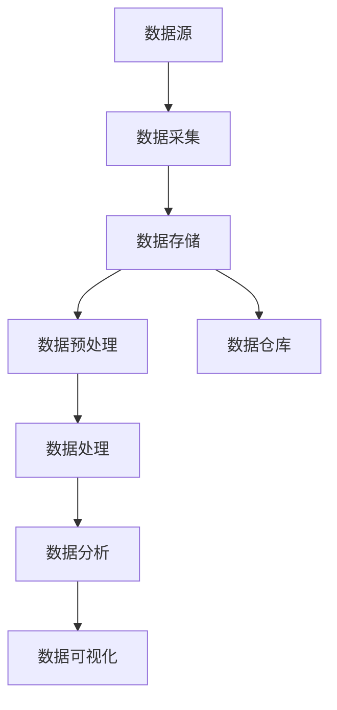

#### 核心算法原理讲解

数据湖中的数据处理通常包括以下几个步骤：

1. 数据清洗：使用MapReduce等分布式计算框架进行数据清洗。
2. 数据转换：将原始数据转换为适合分析的形式。
3. 数据存储：将处理后的数据存储到HDFS等分布式文件系统。

下面是一个伪代码，详细描述了数据清洗和转换的过程：

```python
def data_cleaning(data_source):
    # 使用MapReduce进行数据清洗
    cleaned_data = mapreduce.MapReduceTask()
    cleaned_data.map(input_data, clean_mapper)
    cleaned_data.reduce(cleaned_data, clean_reducer)
    return cleaned_data

def data_transformation(cleaned_data):
    # 数据转换
    transformed_data = transformation_task.TransformTask()
    transformed_data.transform(cleaned_data)
    return transformed_data
```

#### 数学模型与公式

在数据湖中，常见的数学模型包括线性回归、逻辑回归和支持向量机（SVM）等。下面使用LaTeX格式给出线性回归模型的公式：

$$ y = \beta_0 + \beta_1x + \epsilon $$

其中，\( y \) 是目标变量，\( x \) 是特征变量，\( \beta_0 \) 和 \( \beta_1 \) 是模型的参数，\( \epsilon \) 是误差项。

#### 详细讲解与举例说明

假设我们有一个数据集，其中包含学生的成绩（\( y \)）和学习时间（\( x \））两个变量。我们可以使用线性回归模型来预测学生的成绩。

首先，我们需要收集数据，并使用数据清洗和转换步骤，得到一个干净且适合分析的格式。然后，我们可以使用线性回归模型进行拟合，找到最佳参数 \( \beta_0 \) 和 \( \beta_1 \)。

最后，我们可以使用拟合后的模型进行预测，例如预测一个新学生的成绩。

#### 项目实战

为了实际演示数据湖架构在数据处理和分析中的应用，我们将使用一个示例项目。该项目将包括以下步骤：

1. 数据采集：从不同来源获取数据，如学生成绩数据、学习时间数据等。
2. 数据预处理：清洗和转换数据，使其适合分析。
3. 数据存储：将预处理后的数据存储到HDFS。
4. 数据处理：使用MapReduce进行数据清洗和转换。
5. 数据分析：使用线性回归模型进行数据分析和预测。

下面是一个简单的项目流程图：

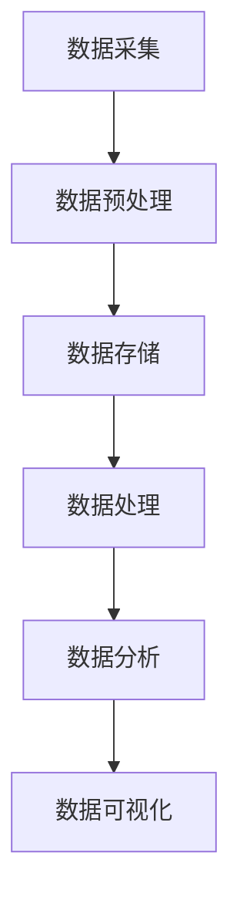

在这个项目中，我们将使用Python和Hadoop等工具来构建和运行数据湖架构，并进行线性回归模型的实现和预测。

### 第2章 数据湖架构设计

#### 背景介绍

数据湖架构的设计是确保数据湖能够高效、稳定和可靠地支持大规模数据处理和分析的关键。本章节将介绍数据湖架构设计的基本原则和核心组件。

#### 核心概念与联系

数据湖架构设计涉及多个层次，包括数据源层、数据采集层、数据处理层、数据存储层和数据访问层。以下是数据湖架构的核心组件及其关系：

1. **数据源层**：包括各种数据源，如数据库、日志文件、社交媒体数据等。
2. **数据采集层**：负责从数据源中采集数据，并将其传输到数据湖中。
3. **数据处理层**：包括数据清洗、转换和集成等过程，以确保数据的准确性和一致性。
4. **数据存储层**：使用分布式文件系统（如HDFS）存储数据，支持海量数据的高效存储和访问。
5. **数据访问层**：提供数据查询、分析和报告等功能，支持各种数据分析工具和应用程序。

下面是一个Mermaid流程图，展示了数据湖架构的设计：

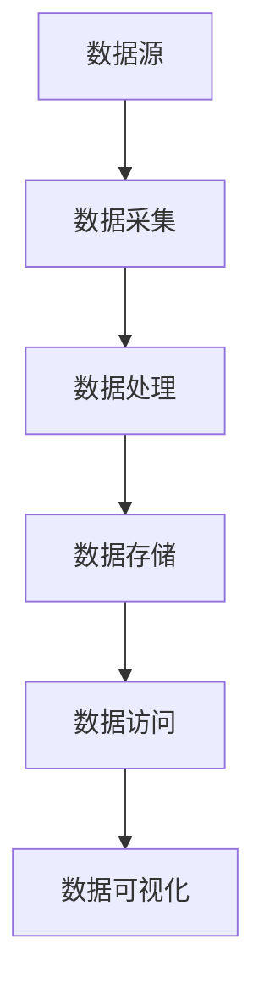

#### 核心算法原理讲解

数据湖架构设计中的核心算法包括数据采集、数据清洗、数据转换和分布式存储等。

1. **数据采集**：通常使用分布式消息队列（如Kafka）和分布式文件系统（如HDFS）进行数据采集。
2. **数据清洗**：使用MapReduce等分布式计算框架进行数据清洗，包括去重、补全、标准化等操作。
3. **数据转换**：将原始数据转换为适合分析的形式，如结构化数据、数据仓库等。
4. **分布式存储**：使用分布式文件系统（如HDFS）进行海量数据的存储，确保数据的可靠性和高效访问。

下面是一个伪代码，详细描述了数据湖架构设计中的核心算法：

```python
def data_ingest(source):
    # 数据采集
    data = source.fetch_data()
    return data

def data_clean(data):
    # 数据清洗
    cleaned_data = mapreduce.MapReduceTask()
    cleaned_data.map(data, clean_mapper)
    cleaned_data.reduce(cleaned_data, clean_reducer)
    return cleaned_data

def data_transform(cleaned_data):
    # 数据转换
    transformed_data = transformation_task.TransformTask()
    transformed_data.transform(cleaned_data)
    return transformed_data

def data_store(transformed_data):
    # 数据存储
    storage = hdfs_storage.HDFSSetorage()
    storage.store(transformed_data)
```

#### 数学模型与公式

在数据湖架构设计中，常用的数学模型包括分布式计算模型、存储模型和访问模型等。

1. **分布式计算模型**：使用MapReduce等分布式计算模型进行大规模数据处理。
2. **存储模型**：使用分布式文件系统（如HDFS）进行海量数据的存储，确保数据的可靠性和高效访问。

下面是一个简单的分布式计算模型的公式：

$$ \sum_{i=1}^{N} P_i = P $$
其中，\( P_i \) 表示第 \( i \) 个节点的处理能力，\( N \) 表示节点数量，\( P \) 表示系统的总处理能力。

#### 详细讲解与举例说明

假设我们有一个包含100个节点的数据湖架构，每个节点的处理能力为100MB/s。我们需要计算整个系统的总处理能力。

根据分布式计算模型的公式，我们可以得到：

$$ \sum_{i=1}^{100} 100MB/s = 10GB/s $$
这意味着，整个系统的总处理能力为10GB/s。

#### 项目实战

为了实际演示数据湖架构设计在数据处理和分析中的应用，我们将使用一个示例项目。该项目将包括以下步骤：

1. 数据采集：从不同来源获取数据，如社交媒体数据、网站日志等。
2. 数据预处理：清洗和转换数据，使其适合分析。
3. 数据存储：将预处理后的数据存储到HDFS。
4. 数据处理：使用MapReduce进行数据清洗和转换。
5. 数据分析：使用分布式计算模型进行数据分析和预测。

下面是一个简单的项目流程图：


在这个项目中，我们将使用Python和Hadoop等工具来构建和运行数据湖架构，并进行分布式计算模型的实现和预测。

### 第3章 数据湖技术与工具

#### 背景介绍

随着数据湖架构的广泛应用，各种技术和工具也应运而生，以支持数据湖的构建、管理和分析。本章节将介绍数据湖中常用的技术工具，包括分布式计算框架、存储系统和数据分析工具等。

#### 核心概念与联系

数据湖技术与工具的核心概念包括分布式计算、分布式存储和数据分析等。以下是这些概念之间的关系和常见工具：

1. **分布式计算框架**：如Hadoop、Spark等，用于处理大规模数据。
2. **分布式存储系统**：如HDFS、Alluxio等，用于存储海量数据。
3. **数据分析工具**：如Hive、Impala等，用于分析数据并提供查询接口。
4. **数据治理与安全**：如HDFS权限管理、数据加密等，确保数据的安全性和合规性。

下面是一个Mermaid流程图，展示了数据湖技术与工具之间的关系：

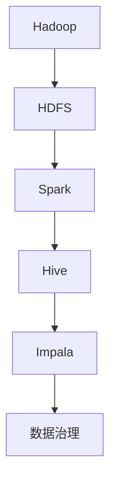

#### 核心算法原理讲解

在数据湖技术中，常用的算法原理包括分布式计算模型、分布式存储模型和数据分析算法等。

1. **分布式计算模型**：如MapReduce，用于处理大规模数据。
2. **分布式存储模型**：如HDFS，用于存储海量数据。
3. **数据分析算法**：如线性回归、决策树等，用于分析数据并提供洞察。

下面是一个伪代码，详细描述了分布式计算模型和数据分析算法的原理：

```python
def distributed_computation(data):
    # 分布式计算
    split_data = data.split(100)  # 将数据分为100份
    results = []
    for part in split_data:
        result = mapreduce.MapReduceTask().map(part, map_func)
        results.append(result)
    final_result = reduce(results, reduce_func)
    return final_result

def linear_regression(data):
    # 线性回归
    X = data['X']
    y = data['y']
    X_transpose = np.transpose(X)
    X_transpose_X = np.dot(X_transpose, X)
    X_transpose_y = np.dot(X_transpose, y)
    beta = np.dot(np.linalg.inv(X_transpose_X), X_transpose_y)
    return beta
```

#### 数学模型与公式

在数据湖技术中，常用的数学模型包括线性回归、逻辑回归和支持向量机（SVM）等。

1. **线性回归**：用于预测连续值。
2. **逻辑回归**：用于预测概率。
3. **支持向量机（SVM）**：用于分类问题。

下面使用LaTeX格式给出线性回归和逻辑回归的公式：

$$ y = \beta_0 + \beta_1x + \epsilon $$
$$ P(y=1) = \frac{1}{1 + e^{-(\beta_0 + \beta_1x)}} $$

#### 详细讲解与举例说明

假设我们有一个包含100个样本的数据集，每个样本包含一个特征 \( x \) 和一个目标 \( y \)。我们可以使用线性回归模型来预测 \( y \)。

首先，我们需要收集数据，并使用数据清洗和转换步骤，得到一个干净且适合分析的格式。然后，我们可以使用线性回归模型进行拟合，找到最佳参数 \( \beta_0 \) 和 \( \beta_1 \)。

最后，我们可以使用拟合后的模型进行预测，例如预测一个新样本的目标 \( y \)。

#### 项目实战

为了实际演示数据湖技术与工具在数据处理和分析中的应用，我们将使用一个示例项目。该项目将包括以下步骤：

1. 数据采集：从不同来源获取数据，如社交媒体数据、网站日志等。
2. 数据预处理：清洗和转换数据，使其适合分析。
3. 数据存储：将预处理后的数据存储到HDFS。
4. 数据处理：使用MapReduce进行数据清洗和转换。
5. 数据分析：使用线性回归模型进行数据分析和预测。

下面是一个简单的项目流程图：


在这个项目中，我们将使用Python和Hadoop等工具来构建和运行数据湖架构，并进行线性回归模型的实现和预测。

### 第4章 LLM在数据湖中的应用

#### 背景介绍

大型语言模型（LLM）在自然语言处理（NLP）领域取得了显著进展，成为文本生成、问答系统、翻译等任务的关键工具。随着数据湖架构的发展，如何将LLM集成到数据湖中进行大规模数据处理和分析，成为一个重要的研究方向。本章节将探讨LLM在数据湖中的应用场景、架构设计和技术实现。

#### 核心概念与联系

LLM在数据湖中的应用涉及以下几个核心概念和联系：

1. **数据湖架构**：数据湖作为海量数据存储和处理的基础设施，支持LLM的训练和部署。
2. **LLM模型**：如GPT、BERT等大型语言模型，用于文本处理和生成。
3. **数据预处理**：将原始文本数据清洗、分词、编码等，为LLM提供适合训练的数据。
4. **模型训练与优化**：使用数据湖中的数据训练LLM模型，并进行优化和调整。
5. **模型部署与查询**：将训练好的LLM模型部署到数据湖中，实现实时文本处理和问答。

下面是一个Mermaid流程图，展示了LLM在数据湖中的应用架构：

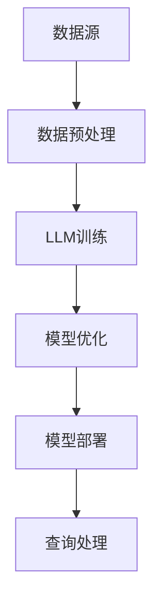

#### 核心算法原理讲解

LLM在数据湖中的应用主要包括以下几个核心算法原理：

1. **预训练与微调**：使用大规模语料库进行预训练，然后针对特定任务进行微调。
2. **序列生成**：使用LLM生成文本序列，实现文本生成、问答等功能。
3. **模型优化**：通过调整模型参数和架构，提高模型的性能和泛化能力。

下面是一个伪代码，详细描述了LLM在数据湖中的应用流程：

```python
def preprocess_data(data):
    # 数据预处理
    cleaned_data = clean_text(data)
    tokenized_data = tokenize_data(cleaned_data)
    encoded_data = encode_data(tokenized_data)
    return encoded_data

def train_llm(data):
    # LLM训练
    model = LLMModel()
    model.train(data)
    return model

def fine_tune_llm(model, task_data):
    # 微调LLM模型
    model.fine_tune(task_data)
    return model

def generate_text(model, input_text):
    # 文本生成
    generated_text = model.generate(input_text)
    return generated_text
```

#### 数学模型与公式

LLM模型训练中常用的数学模型包括深度学习模型、注意力机制和损失函数等。

1. **深度学习模型**：如Transformer，用于处理序列数据。
2. **注意力机制**：用于关注关键信息，提高模型的性能。
3. **损失函数**：如交叉熵损失，用于评估模型的预测效果。

下面使用LaTeX格式给出深度学习模型的公式：

$$ \mathcal{L}(\theta) = -\sum_{i=1}^{N} \sum_{j=1}^{V} y_j \log(p_j(\theta)) $$

其中，\( N \) 表示样本数量，\( V \) 表示词汇表大小，\( y_j \) 表示第 \( j \) 个单词的标签，\( p_j(\theta) \) 表示模型预测的概率。

#### 详细讲解与举例说明

假设我们有一个包含10000个句子的语料库，使用GPT模型进行预训练。首先，我们需要将文本数据进行预处理，包括分词、编码等步骤。然后，我们可以使用预训练模型进行训练，并使用交叉熵损失函数评估模型的预测效果。

在训练过程中，我们可以调整模型参数和架构，以提高模型的性能和泛化能力。最后，我们可以使用训练好的模型进行文本生成和问答等任务。

#### 项目实战

为了实际演示LLM在数据湖中的应用，我们将使用一个示例项目。该项目将包括以下步骤：

1. 数据采集：从互联网获取大量文本数据，如新闻、博客等。
2. 数据预处理：清洗、分词、编码等，为LLM提供适合训练的数据。
3. 模型训练：使用GPT模型进行预训练和微调。
4. 模型部署：将训练好的模型部署到数据湖中，实现实时文本处理和问答。

下面是一个简单的项目流程图：

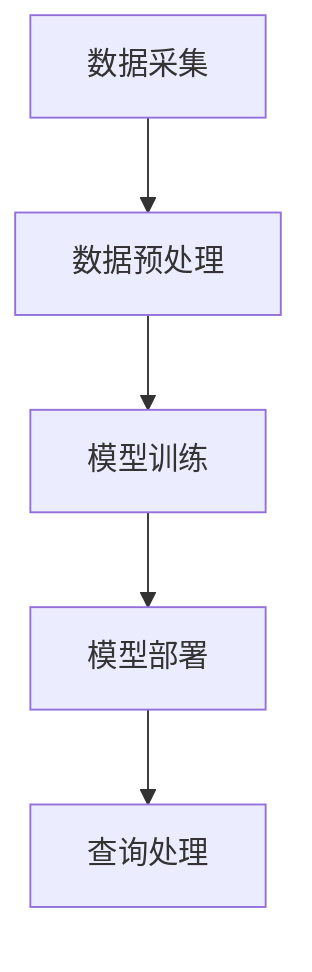

在这个项目中，我们将使用Python和Hadoop等工具来构建和运行数据湖架构，并进行LLM模型的训练和部署。

### 第5章 数据湖中LLM的应用案例

#### 背景介绍

数据湖中集成LLM模型，可以大幅提升文本处理和分析的能力，从而在多个领域实现创新应用。本章节将介绍数据湖中LLM的几个典型应用案例，包括智能问答系统、文本分类与情感分析、自然语言生成等。

#### 核心概念与联系

数据湖中LLM的应用案例涉及以下几个核心概念和联系：

1. **智能问答系统**：利用LLM实现自动化问答，提高数据湖的数据利用效率。
2. **文本分类与情感分析**：使用LLM对文本进行分类和情感分析，挖掘用户反馈和市场需求。
3. **自然语言生成**：利用LLM生成文本，用于报告生成、内容创作等。

下面是一个Mermaid流程图，展示了数据湖中LLM应用案例的架构：

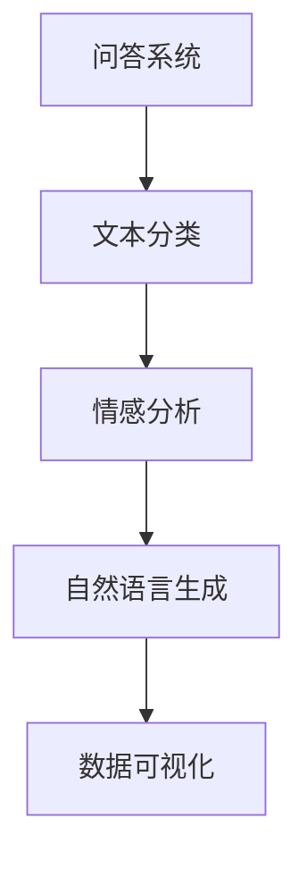

#### 核心算法原理讲解

数据湖中LLM应用案例的核心算法包括：

1. **问答系统**：使用对话管理器和自然语言理解模块，实现对话生成和回答。
2. **文本分类与情感分析**：使用分类器和情感分析模型，对文本进行分类和情感判断。
3. **自然语言生成**：使用序列生成模型，生成符合需求的文本。

下面是一个伪代码，详细描述了问答系统和自然语言生成的算法：

```python
def ask_question(llm_model, question):
    # 问答系统
    context = llm_model.get_context(question)
    answer = llm_model.generate(context)
    return answer

def generate_text(llm_model, input_text):
    # 自然语言生成
    context = llm_model.get_context(input_text)
    generated_text = llm_model.generate(context)
    return generated_text
```

#### 数学模型与公式

数据湖中LLM应用案例的数学模型包括：

1. **对话生成**：使用循环神经网络（RNN）或Transformer模型。
2. **分类与情感分析**：使用支持向量机（SVM）或卷积神经网络（CNN）。

下面使用LaTeX格式给出对话生成模型的公式：

$$ y_t = \text{softmax}(\text{Transformer}(x_t, h_{t-1})) $$

其中，\( y_t \) 表示第 \( t \) 个单词的生成概率，\( x_t \) 表示输入序列，\( h_{t-1} \) 表示前一个时间步的隐藏状态。

#### 详细讲解与举例说明

假设我们有一个包含1000个问答对的数据集，使用GPT模型实现问答系统。首先，我们需要将问答对数据进行预处理，包括分词、编码等步骤。然后，我们可以使用GPT模型进行训练，并使用训练好的模型进行问答。

在问答过程中，用户输入一个问题，模型会生成一个回答。例如，用户输入“什么是人工智能？”模型会生成回答：“人工智能是一种模拟人类智能的技术，包括机器学习、自然语言处理、计算机视觉等领域。”

#### 项目实战

为了实际演示数据湖中LLM的应用案例，我们将使用一个示例项目。该项目将包括以下步骤：

1. 数据采集：从互联网获取大量问答对数据。
2. 数据预处理：清洗、分词、编码等，为LLM提供适合训练的数据。
3. 模型训练：使用GPT模型进行预训练和微调。
4. 模型部署：将训练好的模型部署到数据湖中，实现实时问答。
5. 模型应用：使用问答系统进行实际应用，如企业客服、智能助手等。

下面是一个简单的项目流程图：

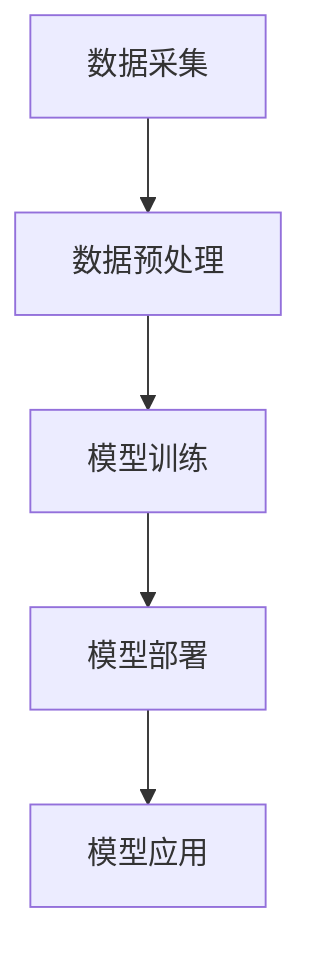

在这个项目中，我们将使用Python和Hadoop等工具来构建和运行数据湖架构，并进行LLM模型的训练和部署。

### 第6章 大规模数据处理与优化

#### 背景介绍

随着数据量的持续增长，如何在大规模数据处理和分析中提高效率和性能，成为数据科学家和工程师面临的重要挑战。本章节将探讨大规模数据处理的基本方法、关键技术以及性能优化策略。

#### 核心概念与联系

大规模数据处理涉及以下几个核心概念和联系：

1. **分布式计算**：将数据处理任务分解为多个子任务，在多个节点上并行执行，提高处理速度。
2. **并行处理**：在同一时间段内执行多个处理任务，提高系统吞吐量。
3. **内存管理**：优化内存使用，减少内存争用和垃圾回收开销。
4. **数据压缩**：通过数据压缩技术减少存储和传输的开销。

下面是一个Mermaid流程图，展示了大规模数据处理的关键技术：

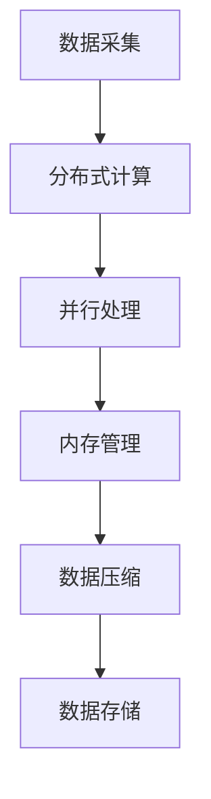

#### 核心算法原理讲解

大规模数据处理的核心算法包括：

1. **MapReduce**：用于分布式数据处理，将数据处理任务分解为Map和Reduce两个阶段。
2. **分布式数据库**：如Hadoop、Spark等，用于存储和查询大规模数据。
3. **流处理**：实时处理数据流，支持实时分析和决策。

下面是一个伪代码，详细描述了MapReduce算法的原理：

```python
def map(input_data):
    # Map阶段
    for key, value in input_data:
        output = map_func(key, value)
        yield output

def reduce(input_data):
    # Reduce阶段
    for key, values in input_data:
        output = reduce_func(key, values)
        yield output
```

#### 数学模型与公式

在大规模数据处理中，常用的数学模型包括：

1. **分布式算法**：如 gossip 协议，用于分布式系统中的数据同步和一致性保证。
2. **优化算法**：如梯度下降法，用于优化模型参数。

下面使用LaTeX格式给出梯度下降法的公式：

$$ \theta_{t+1} = \theta_t - \alpha \cdot \nabla_{\theta} J(\theta) $$

其中，\( \theta \) 表示模型参数，\( \alpha \) 表示学习率，\( \nabla_{\theta} J(\theta) \) 表示损失函数关于参数的梯度。

#### 详细讲解与举例说明

假设我们有一个包含100万条记录的数据集，需要使用MapReduce算法进行数据处理。首先，我们需要将数据集划分为多个小块，并在分布式系统中并行处理。

在Map阶段，我们将每个小块的数据进行处理，并生成中间结果。然后，在Reduce阶段，我们将中间结果进行汇总，得到最终结果。

例如，我们可以使用MapReduce算法进行词频统计。在Map阶段，我们将每条记录中的单词进行分词，并统计每个单词的出现次数。在Reduce阶段，我们将所有单词的出现次数进行汇总，得到最终的词频统计结果。

#### 项目实战

为了实际演示大规模数据处理与优化，我们将使用一个示例项目。该项目将包括以下步骤：

1. 数据采集：从不同来源获取大量数据，如日志、交易记录等。
2. 数据预处理：清洗、分词、编码等，为大规模数据处理做准备。
3. 数据处理：使用MapReduce算法进行大规模数据处理。
4. 数据分析：使用分布式数据库进行数据查询和分析。
5. 性能优化：优化内存管理、数据压缩等，提高数据处理效率。

下面是一个简单的项目流程图：

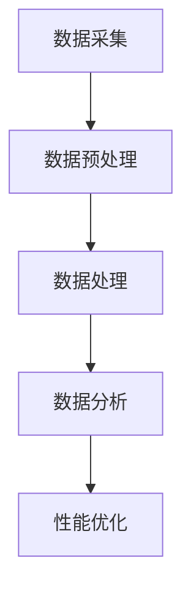

在这个项目中，我们将使用Python和Hadoop等工具来构建和运行大规模数据处理架构，并进行性能优化。

### 第7章 数据湖的运维与监控

#### 背景介绍

随着数据湖应用的不断扩展，数据湖的运维与监控变得尤为重要。良好的运维与监控能够确保数据湖的稳定运行、高效处理和安全性。本章节将介绍数据湖的运维流程、监控指标以及性能调优策略。

#### 核心概念与联系

数据湖的运维与监控涉及以下几个核心概念和联系：

1. **运维流程**：包括数据湖的部署、配置管理、监控、故障排除等。
2. **监控指标**：如数据吞吐量、延迟、错误率等，用于评估数据湖的性能。
3. **性能调优**：通过调整配置、优化资源使用、升级硬件等，提高数据湖的性能。

下面是一个Mermaid流程图，展示了数据湖的运维与监控流程：

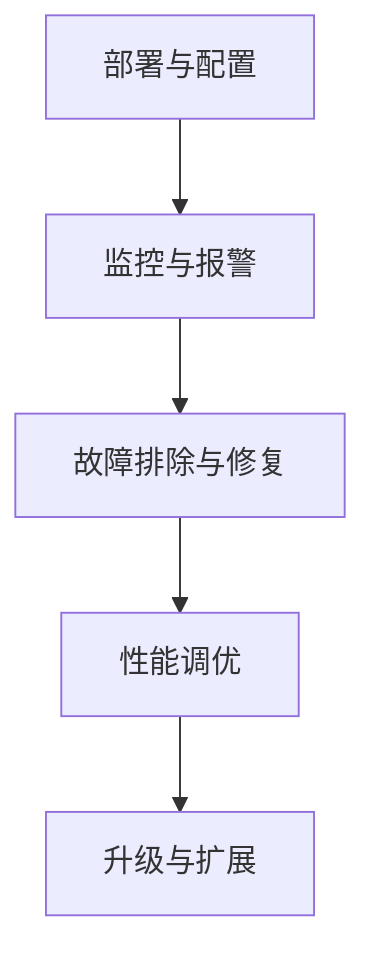

#### 核心算法原理讲解

数据湖运维与监控中的核心算法原理包括：

1. **监控算法**：如平均绝对偏差（MAD）、标准差等，用于评估系统性能。
2. **故障排除算法**：如决策树、神经网络等，用于故障诊断和预测。

下面是一个伪代码，详细描述了监控算法的原理：

```python
def monitor_performance metrics:
    # 监控性能指标
    metrics = fetch_metrics()
    deviations = [abs(m - mean) for m in metrics]
    mad = sum(deviations) / len(deviations)
    return mad
```

#### 数学模型与公式

数据湖运维与监控中的数学模型包括：

1. **性能评估模型**：如平均响应时间（Mean Response Time, MRT），用于评估系统性能。
2. **故障预测模型**：如回归模型，用于预测系统故障。

下面使用LaTeX格式给出平均响应时间的公式：

$$ MRT = \frac{1}{N} \sum_{i=1}^{N} t_i $$

其中，\( N \) 表示请求次数，\( t_i \) 表示第 \( i \) 次请求的响应时间。

#### 详细讲解与举例说明

假设我们有一个包含100个请求的数据集，需要计算平均响应时间。首先，我们需要记录每个请求的响应时间，然后计算平均值。

根据平均响应时间的公式，我们可以得到：

$$ MRT = \frac{1}{100} \sum_{i=1}^{100} t_i $$

假设每个请求的响应时间如下表所示：

| 请求ID | 响应时间（ms） |
|-------|--------------|
| 1     | 200          |
| 2     | 150          |
| 3     | 300          |
| ...   | ...          |
| 100   | 250          |

根据上述数据，我们可以计算平均响应时间：

$$ MRT = \frac{1}{100} (200 + 150 + 300 + ... + 250) = 220ms $$

#### 项目实战

为了实际演示数据湖的运维与监控，我们将使用一个示例项目。该项目将包括以下步骤：

1. 部署与配置：部署数据湖环境，配置必要的硬件和软件。
2. 监控与报警：使用监控工具收集数据湖的性能指标，设置报警阈值。
3. 故障排除：根据监控数据发现故障，进行诊断和修复。
4. 性能调优：根据监控数据调整配置和资源使用，提高数据湖的性能。
5. 升级与扩展：定期升级数据湖系统，扩展硬件资源。

下面是一个简单的项目流程图：


在这个项目中，我们将使用Python和Hadoop等工具来构建和运行数据湖架构，并进行运维与监控。

### 第8章 数据湖与LLM应用的未来展望与挑战

#### 背景介绍

数据湖和大型语言模型（LLM）在数据处理和分析领域正逐渐成为主流技术。然而，随着数据量和复杂度的增加，数据湖与LLM应用也面临诸多挑战。本章节将探讨数据湖与LLM应用的未来发展趋势以及面临的挑战。

#### 核心概念与联系

数据湖与LLM应用的未来展望与挑战涉及以下几个核心概念和联系：

1. **数据湖架构**：随着数据源和数据类型的增多，数据湖架构需要不断演进，以支持更高效的数据处理和分析。
2. **LLM模型**：LLM模型的训练和部署需要大量计算资源和时间，如何优化模型性能和降低成本成为重要议题。
3. **数据治理**：随着数据量的增长，数据治理的难度也在增加，如何确保数据的质量、安全和合规性成为关键挑战。
4. **AI伦理**：随着AI技术在数据湖中的应用，AI伦理问题也逐渐凸显，如何确保AI的公平性、透明性和可解释性成为重要课题。

下面是一个Mermaid流程图，展示了数据湖与LLM应用的未来展望与挑战：

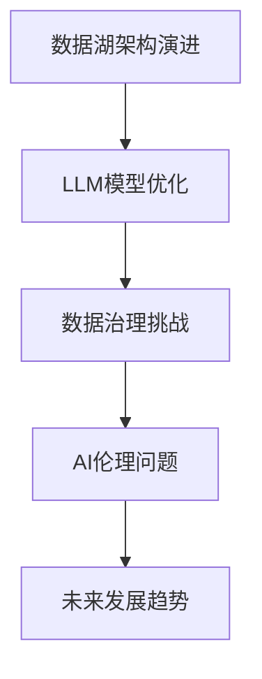

#### 核心算法原理讲解

数据湖与LLM应用的未来展望与挑战中的核心算法原理包括：

1. **分布式计算**：通过优化分布式计算框架，提高数据处理和分析的速度。
2. **模型压缩**：通过模型压缩技术，减少模型大小和计算资源需求。
3. **数据加密**：通过数据加密技术，确保数据的安全性和隐私保护。

下面是一个伪代码，详细描述了分布式计算和模型压缩的原理：

```python
def distributed_computation(data, num_nodes):
    # 分布式计算
    split_data = split_data_into_nodes(data, num_nodes)
    results = []
    for node_data in split_data:
        result = compute_on_node(node_data)
        results.append(result)
    final_result = merge_results(results)
    return final_result

def model_compression(model):
    # 模型压缩
    compressed_model = compress_model(model)
    return compressed_model
```

#### 数学模型与公式

数据湖与LLM应用的未来展望与挑战中的数学模型包括：

1. **性能评估**：通过性能评估模型，如时间效率（Time Efficiency, TE），评估系统性能。
2. **成本效益**：通过成本效益模型，如成本效益比（Cost-Benefit Ratio, CBR），评估模型部署的成本和效益。

下面使用LaTeX格式给出时间效率和成本效益比的公式：

$$ TE = \frac{Time_{original}}{Time_{compressed}} $$
$$ CBR = \frac{Benefit}{Cost} $$

#### 详细讲解与举例说明

假设我们有一个原始模型，其训练时间需要10小时。通过模型压缩技术，我们将模型压缩后，训练时间缩短到2小时。我们可以使用时间效率和成本效益比模型进行评估。

根据时间效率的公式，我们可以得到：

$$ TE = \frac{10}{2} = 5 $$

这表明，通过模型压缩，我们的训练速度提高了5倍。

假设我们通过模型压缩节省了8小时的计算时间，而模型压缩的成本是1000美元。我们可以使用成本效益比的公式进行评估：

$$ CBR = \frac{8 \times \$100}{\$1000} = 0.8 $$

这表明，我们的成本效益比为0.8，即每节省1小时的计算时间，我们需要支付0.8小时的成本。

#### 项目实战

为了实际演示数据湖与LLM应用的未来展望与挑战，我们将使用一个示例项目。该项目将包括以下步骤：

1. 数据采集：从不同来源获取大量数据，如社交媒体、日志等。
2. 数据预处理：清洗、分词、编码等，为LLM提供适合训练的数据。
3. 模型训练：使用LLM模型进行大规模数据处理和分析。
4. 模型压缩：使用模型压缩技术，减少模型大小和计算资源需求。
5. 性能评估：通过性能评估模型，评估系统性能和成本效益。

下面是一个简单的项目流程图：

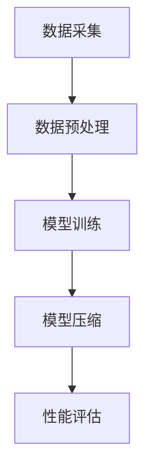

在这个项目中，我们将使用Python和Hadoop等工具来构建和运行数据湖架构，并进行LLM模型的训练、压缩和性能评估。

### 附录

#### A.1 技术栈与工具介绍

在本附录中，我们将介绍数据湖与LLM应用中常用的技术栈和工具，包括：

1. **分布式计算框架**：如Hadoop、Spark等。
2. **分布式文件系统**：如HDFS、Alluxio等。
3. **自然语言处理库**：如TensorFlow、PyTorch等。
4. **数据分析工具**：如Pandas、NumPy等。

#### A.2 实践项目指南

在本附录中，我们将提供数据湖与LLM应用中的实践项目指南，包括：

1. **项目规划**：如何规划数据湖与LLM应用项目。
2. **开发流程**：如何进行数据湖与LLM应用的开发。
3. **部署与维护**：如何部署和维护数据湖与LLM应用。

#### A.3 扩展阅读与资源推荐

在本附录中，我们将推荐一些扩展阅读资源和相关资源，包括：

1. **书籍**：《数据湖架构：设计、实现与优化》等。
2. **文章**：相关领域的学术论文和技术博客。
3. **在线课程**：如Coursera、edX等平台上的相关课程。

### 结束语

作者：AI天才研究院/AI Genius Institute & 禅与计算机程序设计艺术 /Zen And The Art of Computer Programming

在本篇文章中，我们深入探讨了数据湖架构在支持大型语言模型（LLM）应用中的大规模数据分析。通过介绍数据湖的基本概念、架构设计、核心算法原理、应用案例、运维与监控以及未来展望，我们为读者提供了一个全面的理解和实践指南。

数据湖作为新兴的数据架构，正逐渐成为大规模数据处理和分析的重要基础设施。随着LLM技术的不断进步，数据湖在文本处理、自然语言生成、问答系统等领域的应用也日益广泛。然而，随着数据量和复杂度的增加，数据湖与LLM应用也面临诸多挑战，如数据治理、模型压缩和AI伦理问题等。

在未来的发展中，数据湖与LLM应用将继续融合，推动数据处理和分析技术的发展。我们期待读者能够通过本文，深入了解数据湖架构及其应用，并在实际项目中取得成功。

最后，感谢读者对本文的关注，我们期待与您一起探索数据湖与LLM应用的未来。如果您有任何问题或建议，请随时联系我们。祝您在数据湖与LLM应用的道路上取得丰硕的成果！

作者：AI天才研究院/AI Genius Institute & 禅与计算机程序设计艺术 /Zen And The Art of Computer Programming

