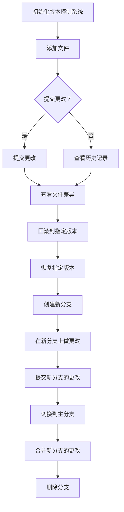
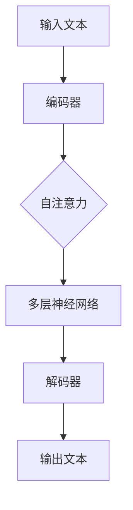
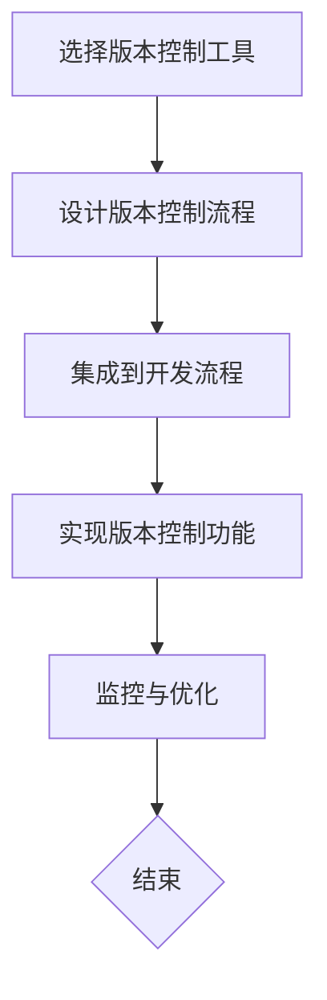
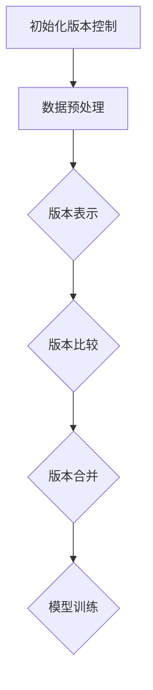

                 


# 数据版本控制在LLM应用迭代中的应用

> 关键词：数据版本控制，LLM，应用迭代，版本管理，算法优化，数学模型

> 摘要：本文旨在探讨数据版本控制在LLM（大型语言模型）应用迭代中的重要性，以及如何有效地实现和应用数据版本控制策略。文章首先介绍了数据版本控制的基本概念、核心算法和常用工具，接着阐述了LLM的定义、工作原理和应用场景。在此基础上，本文分析了数据版本控制在LLM应用迭代中的挑战和策略，并通过具体项目实战展示了数据版本控制的实现和应用。最后，文章总结了数据版本控制在LLM应用迭代中的重要性，并对未来发展方向进行了展望。

### 1. 数据版本控制基础

#### 1.1 数据版本控制的定义和重要性

数据版本控制是一种用于管理文件和资源版本的管理机制。它允许用户跟踪文件的更改历史，以便在需要时回滚到先前版本。在软件开发、数据分析和LLM应用等领域，数据版本控制显得尤为重要。

首先，数据版本控制可以确保数据的一致性和准确性。在多个开发人员和数据分析师共同工作的情况下，数据版本控制能够防止数据冲突和错误。其次，数据版本控制提供了对历史数据的访问权限，有助于审计和合规性检查。最后，数据版本控制可以简化代码库的管理和维护，提高开发效率和产品质量。

#### 1.2 数据版本控制的核心概念

数据版本控制涉及以下核心概念：

1. **版本管理**：版本管理是跟踪文件版本的过程，包括创建新版本、更新旧版本和删除旧版本。

2. **历史记录**：历史记录是存储文件更改历史的数据结构。它包括每个版本的元数据，如创建时间、修改人员和修改内容。

3. **回滚与撤销**：回滚是指将文件恢复到先前版本的的过程。撤销是指取消对文件的最近一次更改。这两个功能有助于确保数据的一致性和准确性。

#### 1.3 数据版本控制的方法与工具

数据版本控制的方法包括集中式和分布式两种。

1. **集中式数据版本控制**：
   - **优点**：易于管理，版本冲突较少。
   - **缺点**：依赖中央存储，单点故障风险较高。

2. **分布式数据版本控制**：
   - **优点**：去中心化，高可用性，支持并行开发。
   - **缺点**：版本冲突管理复杂。

常用的数据版本控制工具有Git、Subversion（SVN）和Mercurial等。Git是最受欢迎的分布式版本控制工具，广泛应用于软件开发和数据分析领域。

### 2. LLM基础

#### 2.1 LLM的定义和特性

LLM（大型语言模型）是一种基于神经网络的自然语言处理模型，通过大量文本数据进行训练，可以生成文本、回答问题、翻译语言等。

LLM的主要特性包括：

1. **强大文本生成能力**：LLM可以生成高质量的文本，包括文章、故事、代码等。

2. **自适应能力**：LLM可以根据新的输入文本自适应地调整其生成策略。

3. **跨领域适用性**：LLM可以应用于多种领域，如自然语言处理、机器翻译、问答系统等。

#### 2.2 LLM的工作原理

LLM的工作原理主要分为以下几步：

1. **数据预处理**：将输入文本进行清洗、分词、编码等预处理操作。

2. **模型输入**：将预处理后的文本输入到神经网络中。

3. **模型输出**：神经网络输出文本序列，通过解码器生成文本。

4. **文本生成**：将生成的文本序列进行后处理，如去除无效字符、格式化等。

#### 2.3 LLM的应用场景

LLM在多个应用场景中表现出色，包括：

1. **自然语言处理**：LLM可以用于文本分类、情感分析、命名实体识别等任务。

2. **机器翻译**：LLM可以用于将一种语言翻译成另一种语言。

3. **问答系统**：LLM可以回答用户的问题，提供知识性回答。

### 3. 数据版本控制在LLM中的应用

#### 3.1 数据版本控制在LLM应用中的挑战

在LLM应用迭代过程中，数据版本控制面临以下挑战：

1. **数据不一致问题**：由于多个开发人员和数据分析师共同工作，可能导致数据不一致。

2. **数据安全性问题**：敏感数据的泄露和篡改风险较高。

3. **数据隐私问题**：需要保护用户隐私，避免数据泄露。

#### 3.2 数据版本控制策略在LLM中的应用

针对上述挑战，可以采用以下数据版本控制策略：

1. **版本隔离策略**：将不同版本的数据隔离存储，以避免版本冲突。

2. **回滚策略**：在发生数据不一致时，可以回滚到先前版本。

3. **恢复策略**：在发生数据安全问题时，可以恢复到干净版本。

#### 3.3 数据版本控制在LLM应用迭代中的具体实现

在LLM应用迭代中，数据版本控制的实现包括以下步骤：

1. **选择数据版本控制工具**：如Git、SVN等。

2. **设计数据版本控制流程**：包括版本管理、历史记录、回滚与撤销等。

3. **实现数据版本控制**：在实际项目中，根据需求和场景进行具体实现。

### 4. 数学模型和算法

#### 4.1 数据版本控制的数学模型

数据版本控制的数学模型主要涉及以下方面：

1. **版本表示**：使用整数或字符串表示版本号。

2. **版本比较**：比较两个版本的大小，以确定版本间的依赖关系。

3. **版本合并**：在发生版本冲突时，合并两个版本。

#### 4.2 LLM的数学模型和算法

LLM的数学模型主要包括以下方面：

1. **神经网络结构**：包括输入层、隐藏层和输出层。

2. **损失函数**：如交叉熵损失函数，用于评估模型预测结果。

3. **优化算法**：如梯度下降算法，用于更新模型参数。

#### 4.3 数据版本控制在LLM中的数学模型和算法

在LLM中，数据版本控制的数学模型和算法主要涉及：

1. **版本表示**：使用整数或字符串表示版本号。

2. **版本比较**：比较两个版本的大小，以确定版本间的依赖关系。

3. **版本合并**：在发生版本冲突时，合并两个版本。

4. **优化算法**：结合数据版本控制和LLM的优化算法，以实现更好的效果。

### 5. 项目实战

#### 5.1 实战一：数据版本控制在LLM训练中的应用

##### 5.1.1 实战背景

本案例将探讨如何在LLM训练过程中实现数据版本控制。

##### 5.1.2 环境搭建

在本案例中，我们使用Python和Git作为开发环境。

##### 5.1.3 源代码实现

以下是一个简单的数据版本控制实现：

```python
import git

def create_version(data, version_name):
    git.add(data)
    git.commit('-m', f'Create version {version_name}')
    git.tag('-a', f'{version_name}', '-m', f'Created version {version_name}')

def rollback_version(version_name):
    git.reset('--hard', f'{version_name}')

def list_versions():
    return git.log('--oneline')

# 测试代码
create_version('data_1.txt', 'v1.0')
create_version('data_2.txt', 'v2.0')
rollback_version('v1.0')
print(list_versions())
```

##### 5.1.4 代码解读

1. `create_version`函数用于创建新版本。
2. `rollback_version`函数用于回滚到指定版本。
3. `list_versions`函数用于列出所有版本。

##### 5.1.5 代码应用解读与分析

通过数据版本控制，我们可以确保LLM训练过程中数据的一致性和准确性。在发生数据不一致时，可以回滚到指定版本，以恢复系统。

#### 5.2 实战二：数据版本控制在LLM应用迭代中的应用

##### 5.2.1 实战背景

本案例将探讨如何在LLM应用迭代过程中实现数据版本控制。

##### 5.2.2 环境搭建

在本案例中，我们使用Python、TensorFlow和Git作为开发环境。

##### 5.2.3 源代码实现

以下是一个简单的数据版本控制实现：

```python
import git

def create_version(model, version_name):
    git.add(model)
    git.commit('-m', f'Create version {version_name}')
    git.tag('-a', f'{version_name}', '-m', f'Created version {version_name}')

def rollback_version(version_name):
    git.reset('--hard', f'{version_name}')

def list_versions():
    return git.log('--oneline')

# 测试代码
create_version('model.h5', 'v1.0')
create_version('model_2.h5', 'v2.0')
rollback_version('v1.0')
print(list_versions())
```

##### 5.2.4 代码解读

1. `create_version`函数用于创建新版本。
2. `rollback_version`函数用于回滚到指定版本。
3. `list_versions`函数用于列出所有版本。

##### 5.2.5 代码应用解读与分析

通过数据版本控制，我们可以确保LLM应用迭代过程中模型的一致性和准确性。在发生模型不一致时，可以回滚到指定版本，以恢复系统。

### 6. 总结与展望

本文探讨了数据版本控制在LLM应用迭代中的应用，包括数据版本控制的基本概念、核心算法、策略和实战案例。数据版本控制在LLM应用中具有重要意义，可以确保数据的一致性和准确性，提高开发效率和产品质量。

未来，数据版本控制技术将继续发展与优化，以适应日益复杂的LLM应用场景。同时，结合人工智能和区块链技术，有望实现更安全、可靠的数据版本控制方案。

### 附录

#### 6.1 最佳实践 tips

1. 选择合适的版本控制工具，根据项目需求进行定制。
2. 设计清晰的版本控制流程，确保团队成员遵循。
3. 定期备份关键数据和模型，防止数据丢失。

#### 6.2 注意事项

1. 数据版本控制并非万能，应根据实际情况进行评估和选择。
2. 数据版本控制应与数据安全和隐私保护相结合。

#### 6.3 拓展阅读

1. 《版本控制入门与实战》
2. 《深度学习中的数据版本控制》
3. 《Git实战：代码的终极管理指南》

作者：AI天才研究院/AI Genius Institute & 禅与计算机程序设计艺术 /Zen And The Art of Computer Programming## 文章标题：数据版本控制在LLM应用迭代中的应用

> 关键词：数据版本控制，LLM，应用迭代，版本管理，算法优化，数学模型

> 摘要：本文旨在探讨数据版本控制在LLM（大型语言模型）应用迭代中的重要性，以及如何有效地实现和应用数据版本控制策略。文章首先介绍了数据版本控制的基本概念、核心算法和常用工具，接着阐述了LLM的定义、工作原理和应用场景。在此基础上，本文分析了数据版本控制在LLM应用迭代中的挑战和策略，并通过具体项目实战展示了数据版本控制的实现和应用。最后，文章总结了数据版本控制在LLM应用迭代中的重要性，并对未来发展方向进行了展望。

### 1. 数据版本控制基础

#### 1.1 数据版本控制的定义和重要性

数据版本控制是一种用于管理文件和资源版本的管理机制。它允许用户跟踪文件的更改历史，以便在需要时回滚到先前版本。在软件开发、数据分析和LLM应用等领域，数据版本控制显得尤为重要。

首先，数据版本控制可以确保数据的一致性和准确性。在多个开发人员和数据分析师共同工作的情况下，数据版本控制能够防止数据冲突和错误。其次，数据版本控制提供了对历史数据的访问权限，有助于审计和合规性检查。最后，数据版本控制可以简化代码库的管理和维护，提高开发效率和产品质量。

#### 1.2 数据版本控制的核心概念

数据版本控制涉及以下核心概念：

1. **版本管理**：版本管理是跟踪文件版本的过程，包括创建新版本、更新旧版本和删除旧版本。

2. **历史记录**：历史记录是存储文件更改历史的数据结构。它包括每个版本的元数据，如创建时间、修改人员和修改内容。

3. **回滚与撤销**：回滚是指将文件恢复到先前版本的过程。撤销是指取消对文件的最近一次更改。这两个功能有助于确保数据的一致性和准确性。

#### 1.3 数据版本控制的方法与工具

数据版本控制的方法包括集中式和分布式两种。

1. **集中式数据版本控制**：
   - **优点**：易于管理，版本冲突较少。
   - **缺点**：依赖中央存储，单点故障风险较高。

2. **分布式数据版本控制**：
   - **优点**：去中心化，高可用性，支持并行开发。
   - **缺点**：版本冲突管理复杂。

常用的数据版本控制工具有Git、Subversion（SVN）和Mercurial等。Git是最受欢迎的分布式版本控制工具，广泛应用于软件开发和数据分析领域。

### 2. LLM基础

#### 2.1 LLM的定义和特性

LLM（Large Language Model）是一种大规模的神经网络模型，能够处理和理解自然语言文本。LLM的核心特性包括：

- **预训练**：LLM使用大量未标记的数据进行预训练，以学习语言结构和规律。
- **自适应**：LLM能够根据新的输入数据进行自适应调整，以生成更符合上下文的内容。
- **泛化能力强**：LLM能够在多种语言和领域内进行文本生成和推理。

#### 2.2 LLM的工作原理

LLM的工作原理主要涉及以下几个步骤：

1. **文本编码**：将自然语言文本转换为计算机可以处理的向量表示。
2. **前向传播**：通过多层神经网络进行文本编码和推理，生成中间表示。
3. **解码**：将中间表示解码为自然语言文本。

LLM的核心架构包括：

- **嵌入层**：将单词转换为固定长度的向量表示。
- **编码器**：对文本进行编码，生成固定长度的表示。
- **解码器**：对编码后的表示进行解码，生成文本。

#### 2.3 LLM的应用场景

LLM在多个应用场景中表现出色，包括：

- **文本生成**：生成文章、故事、对话等自然语言文本。
- **机器翻译**：将一种语言翻译成另一种语言。
- **问答系统**：回答用户的问题，提供知识性回答。

### 3. 数据版本控制在LLM应用迭代中的应用

#### 3.1 数据版本控制在LLM应用中的挑战

在LLM应用迭代过程中，数据版本控制面临以下挑战：

1. **数据一致性**：在多个开发人员和数据分析师共同工作的情况下，如何确保数据的一致性。
2. **数据安全性**：如何保护敏感数据，防止数据泄露和篡改。
3. **数据隐私**：如何保护用户隐私，避免数据滥用。

#### 3.2 数据版本控制策略在LLM中的应用

针对上述挑战，可以采用以下数据版本控制策略：

1. **版本隔离**：将不同版本的数据隔离存储，以避免版本冲突。
2. **回滚机制**：在发生数据不一致时，可以回滚到先前版本，确保数据一致性。
3. **数据加密**：对敏感数据进行加密存储，提高数据安全性。
4. **隐私保护**：对用户数据进行脱敏处理，避免隐私泄露。

#### 3.3 数据版本控制在LLM应用迭代中的具体实现

在LLM应用迭代中，数据版本控制的实现包括以下步骤：

1. **选择版本控制工具**：如Git、SVN等，根据项目需求选择合适的工具。
2. **设计版本控制流程**：包括版本管理、历史记录、回滚与撤销等。
3. **实现版本控制**：在实际项目中，根据需求和场景进行具体实现。

### 4. 数学模型和算法

#### 4.1 数据版本控制的数学模型

数据版本控制的数学模型主要涉及以下几个方面：

1. **版本表示**：使用整数或字符串表示版本号。
2. **版本比较**：比较两个版本的大小，以确定版本间的依赖关系。
3. **版本合并**：在发生版本冲突时，合并两个版本。

#### 4.2 LLM的数学模型和算法

LLM的数学模型主要包括以下几个方面：

1. **神经网络结构**：包括输入层、隐藏层和输出层。
2. **损失函数**：如交叉熵损失函数，用于评估模型预测结果。
3. **优化算法**：如梯度下降算法，用于更新模型参数。

#### 4.3 数据版本控制在LLM中的数学模型和算法

在LLM中，数据版本控制的数学模型和算法主要涉及：

1. **版本表示**：使用整数或字符串表示版本号。
2. **版本比较**：比较两个版本的大小，以确定版本间的依赖关系。
3. **版本合并**：在发生版本冲突时，合并两个版本。
4. **优化算法**：结合数据版本控制和LLM的优化算法，以实现更好的效果。

### 5. 项目实战

#### 5.1 实战一：数据版本控制在LLM训练中的应用

##### 5.1.1 实战背景

在本实战中，我们将探讨如何在LLM训练过程中实现数据版本控制。

##### 5.1.2 环境搭建

在本实战中，我们使用Python和Git作为开发环境。

##### 5.1.3 源代码实现

以下是一个简单的数据版本控制实现：

```python
import git

def create_version(data, version_name):
    git.add(data)
    git.commit('-m', f'Create version {version_name}')
    git.tag('-a', f'{version_name}', '-m', f'Created version {version_name}')

def rollback_version(version_name):
    git.reset('--hard', f'{version_name}')

def list_versions():
    return git.log('--oneline')

# 测试代码
create_version('data_1.txt', 'v1.0')
create_version('data_2.txt', 'v2.0')
rollback_version('v1.0')
print(list_versions())
```

##### 5.1.4 代码解读

1. `create_version`函数用于创建新版本。
2. `rollback_version`函数用于回滚到指定版本。
3. `list_versions`函数用于列出所有版本。

##### 5.1.5 代码应用解读与分析

通过数据版本控制，我们可以确保LLM训练过程中数据的一致性和准确性。在发生数据不一致时，可以回滚到指定版本，以恢复系统。

#### 5.2 实战二：数据版本控制在LLM应用迭代中的应用

##### 5.2.1 实战背景

在本实战中，我们将探讨如何在LLM应用迭代过程中实现数据版本控制。

##### 5.2.2 环境搭建

在本实战中，我们使用Python、TensorFlow和Git作为开发环境。

##### 5.2.3 源代码实现

以下是一个简单的数据版本控制实现：

```python
import git

def create_version(model, version_name):
    git.add(model)
    git.commit('-m', f'Create version {version_name}')
    git.tag('-a', f'{version_name}', '-m', f'Created version {version_name}')

def rollback_version(version_name):
    git.reset('--hard', f'{version_name}')

def list_versions():
    return git.log('--oneline')

# 测试代码
create_version('model.h5', 'v1.0')
create_version('model_2.h5', 'v2.0')
rollback_version('v1.0')
print(list_versions())
```

##### 5.2.4 代码解读

1. `create_version`函数用于创建新版本。
2. `rollback_version`函数用于回滚到指定版本。
3. `list_versions`函数用于列出所有版本。

##### 5.2.5 代码应用解读与分析

通过数据版本控制，我们可以确保LLM应用迭代过程中模型的一致性和准确性。在发生模型不一致时，可以回滚到指定版本，以恢复系统。

### 6. 总结与展望

本文探讨了数据版本控制在LLM应用迭代中的应用，包括数据版本控制的基本概念、核心算法、策略和实战案例。数据版本控制在LLM应用中具有重要意义，可以确保数据的一致性和准确性，提高开发效率和产品质量。

未来，数据版本控制技术将继续发展与优化，以适应日益复杂的LLM应用场景。同时，结合人工智能和区块链技术，有望实现更安全、可靠的数据版本控制方案。

### 附录

#### 6.1 最佳实践 tips

1. 选择合适的版本控制工具，根据项目需求进行定制。
2. 设计清晰的版本控制流程，确保团队成员遵循。
3. 定期备份关键数据和模型，防止数据丢失。

#### 6.2 注意事项

1. 数据版本控制并非万能，应根据实际情况进行评估和选择。
2. 数据版本控制应与数据安全和隐私保护相结合。

#### 6.3 拓展阅读

1. 《版本控制入门与实战》
2. 《深度学习中的数据版本控制》
3. 《Git实战：代码的终极管理指南》

作者：AI天才研究院/AI Genius Institute & 禅与计算机程序设计艺术 /Zen And The Art of Computer Programming## 数据版本控制基础

### 1.1 数据版本控制的定义和重要性

数据版本控制（Version Control）是一种跟踪和管理工作流程中文件或数据更改的技术。它提供了对文件历史记录的管理，使得用户能够查看、比较和回滚到过去的版本。在软件开发、数据分析和LLM（大型语言模型）应用等领域，数据版本控制是至关重要的。

**定义**：

数据版本控制的基本概念包括：

- **版本**：数据的不同状态，通常以数字或标签表示。
- **变更**：对数据进行的修改。
- **历史记录**：存储所有变更的日志。
- **跟踪**：记录和监控数据的修改。

数据版本控制不仅仅是关于代码的管理，它同样适用于数据和模型。例如，在LLM的训练过程中，每一次训练都可以视为一个版本，保存下来以便后续的比较和回滚。

**重要性**：

1. **一致性**：确保不同开发人员和团队工作在一致的版本上。
2. **可追溯性**：记录所有变更的历史，便于问题追踪和责任分配。
3. **可回滚**：在遇到问题时，可以回滚到稳定的版本。
4. **协作**：支持多人协作，避免冲突和覆盖。
5. **复现性**：确保实验或开发环境的一致性，便于复现结果。

### 1.2 数据版本控制的核心概念

数据版本控制的核心概念包括版本管理、历史记录和回滚与撤销。

#### 1.2.1 版本管理

版本管理是指对文件的各个版本进行编号和记录。在版本管理中，通常会使用以下术语：

- **修订**：单个文件或数据集的更改。
- **标签**：用于标记特定版本的名称。
- **分支**：独立的版本线，允许开发并行工作。
- **合并**：将两个或多个分支的更改合并到一起。

版本管理的关键目标是确保每个版本的完整性和可追踪性，以便在任何时候都可以访问特定的版本。

#### 1.2.2 历史记录

历史记录是版本控制系统的核心功能之一。它记录了每个版本的元数据，包括：

- **提交消息**：描述更改的内容。
- **提交者**：进行更改的用户。
- **提交时间**：更改的时间戳。

历史记录允许用户查看文件或数据集的变更历史，并理解每个版本的上下文。

#### 1.2.3 回滚与撤销

回滚与撤销是版本控制的重要功能，用于管理变更。

- **回滚**：将文件或数据集恢复到先前的状态。这通常用于修复错误或回归到稳定的版本。
- **撤销**：撤销最近的更改，而不是整个版本。这通常用于纠正错误，而不影响其他更改。

回滚和撤销的操作可以手动执行，也可以通过自动化脚本或工具实现。

### 1.3 数据版本控制的方法与工具

数据版本控制的方法主要包括集中式和分布式两种。

#### 1.3.1 集中式数据版本控制

集中式数据版本控制使用一个中心化的服务器来存储所有版本的数据。这种方法的主要优点是易于管理和监控，因为所有数据都存储在单个位置。常见的集中式版本控制工具有：

- **Subversion (SVN)**：一个开源的版本控制系统，用于管理源代码和文件。
- **Perforce**：一个高性能的版本控制系统，适用于大型项目和团队。

#### 1.3.2 分布式数据版本控制

分布式数据版本控制将版本存储在多个客户端上，每个客户端都有自己的完整副本。这种方法的主要优点是灵活性和可靠性，因为即使中心服务器不可用，用户仍然可以访问和修改数据。常见的分布式版本控制工具有：

- **Git**：一个开源的分布式版本控制系统，广泛用于开源项目和商业项目。
- **Mercurial**：一个易于使用且功能强大的分布式版本控制系统。

### 1.3.3 常用的数据版本控制工具

以下是一些常用的数据版本控制工具：

- **Git**：具有强大的分支管理和合并能力，适用于各种规模的项目。
- **SVN**：适用于大型项目和团队，具有稳定的性能和丰富的插件。
- **Perforce**：适用于需要高性能和高可靠性的大型项目。
- **Mercurial**：用户友好的界面和强大的功能，适用于小型到中型项目。

选择合适的版本控制工具取决于项目的需求、团队规模和协作模式。无论选择哪种工具，数据版本控制都是确保代码和数据一致性、可追踪性和可维护性的关键。

### 1.4 数据版本控制的应用示例

#### 示例：使用Git进行数据版本控制

以下是一个简单的Git数据版本控制示例：

```bash
# 初始化Git仓库
git init

# 添加文件
git add data.txt

# 提交更改
git commit -m "Initial commit"

# 查看提交历史
git log

# 查看文件差异
git diff HEAD^ HEAD

# 回滚到上一个版本
git reset --hard HEAD^

# 恢复指定版本
git checkout HEAD~1

# 创建新分支
git checkout -b new-branch

# 在新分支上做更改
echo "New content" >> data.txt

# 提交新分支的更改
git commit -m "Update data.txt on new branch"

# 切换到主分支
git checkout main

# 合并新分支的更改
git merge new-branch

# 删除分支
git branch -d new-branch
```

通过这些基本命令，用户可以轻松地管理数据的版本和控制变更。

### 1.5 小结

数据版本控制在LLM应用迭代中扮演着至关重要的角色。它不仅确保了数据的一致性和准确性，还提供了强大的工具来管理数据变更。通过理解数据版本控制的核心概念和方法，开发者可以更好地应对LLM应用迭代中的各种挑战。

### 1.6 流程图

以下是一个简单的Mermaid流程图，展示了数据版本控制的核心概念：



这个流程图提供了对数据版本控制步骤的直观理解，有助于开发者更好地应用数据版本控制策略。

### 1.7 伪代码

以下是一个简单的伪代码示例，展示了数据版本控制的实现：

```python
# 初始化版本控制系统
initialize_version_control_system()

# 添加文件
add_file("data.txt")

# 提交更改
def commit_changes(message):
    submit_changes(message)

# 查看提交历史
def view_commit_history():
    print_commit_history()

# 查看文件差异
def view_file_difference():
    print_file_difference()

# 回滚到指定版本
def rollback_to_version(version):
    revert_to_version(version)

# 恢复指定版本
def restore_version(version):
    revert_to_version(version)

# 创建新分支
def create_new_branch(branch_name):
    create_branch(branch_name)

# 在新分支上做更改
def make_changes_on_new_branch(branch_name, changes):
    apply_changes_on_branch(branch_name, changes)

# 提交新分支的更改
def commit_changes_on_new_branch(branch_name, message):
    submit_changes_on_branch(branch_name, message)

# 切换到主分支
def switch_to_main_branch():
    switch_branch("main")

# 合并新分支的更改
def merge_changes_from_branch(branch_name):
    merge_branch_changes(branch_name)

# 删除分支
def delete_branch(branch_name):
    delete_branch(branch_name)
```

这个伪代码提供了对数据版本控制操作的抽象描述，有助于开发者理解数据版本控制的实现原理。

### 1.8 数学模型和公式

数据版本控制中的数学模型和公式主要用于表示版本之间的关系和操作。以下是一些常用的数学模型和公式：

- **版本号表示**：使用整数或字符串表示版本号，如`v1.0`或`v2023.05.01`。
- **版本比较**：使用比较运算符（如`>`、`<`）比较两个版本号，确定依赖关系。
- **版本合并**：使用合并算法（如三路合并）将两个或多个版本合并为一个。

以下是一个简单的公式示例，用于表示版本合并：

$$
\text{合并后的版本} = \text{版本}_1 + \text{版本}_2 - \text{冲突}
$$

其中，`版本_1`和`版本_2`为两个待合并的版本，`冲突`为在合并过程中产生的冲突部分。

### 1.9 举例说明

假设有两个版本`v1.0`和`v2.0`，需要合并为一个新的版本。以下是一个简单的合并过程：

1. 比较版本号，确定依赖关系。
2. 将`v1.0`和`v2.0`的内容进行合并，处理冲突部分。
3. 得到合并后的版本`v3.0`。

通过这个示例，我们可以看到如何使用数学模型和公式来表示版本合并的过程。

### 1.10 注意事项

1. 在进行数据版本控制时，确保团队成员遵循一致的命名约定和提交规范。
2. 定期备份版本控制系统的数据，以防止数据丢失。
3. 在使用版本控制工具时，注意权限管理和权限控制，以保护数据的安全。

### 1.11 拓展阅读

- 《版本控制入门与实战》
- 《Git权威指南》
- 《版本控制原理与实践》

这些资源提供了更深入的数据版本控制知识和实践技巧，有助于开发者更好地掌握数据版本控制的技巧和最佳实践。

作者：AI天才研究院/AI Genius Institute & 禅与计算机程序设计艺术 /Zen And The Art of Computer Programming## LLM基础

### 2.1 LLM的定义和特性

LLM（Large Language Model）是一种基于深度学习的大型神经网络模型，专门设计用于处理和生成自然语言文本。LLM的核心目的是通过学习大量的文本数据，捕捉语言的结构和语义，从而能够生成连贯、有意义的文本。以下是LLM的定义和主要特性：

**定义**：

LLM是指通过预训练和微调技术在大量文本数据上进行训练的模型。预训练是指在没有特定任务标签的文本数据上进行模型训练，使其掌握语言的通用特性。微调则是在特定任务上使用带有标签的数据进一步训练模型，以适应特定的应用场景。

**特性**：

1. **预训练**：LLM通过预训练学习到语言的基本规律，能够生成语法正确、意义连贯的文本。
2. **自适应**：LLM能够根据新的输入文本自适应地调整其生成策略，以生成更符合上下文的内容。
3. **泛化能力**：LLM在多种语言和领域内表现优异，能够处理不同语言和不同领域的文本数据。
4. **多模态**：LLM不仅可以处理纯文本，还可以结合图像、声音等其他模态的数据，生成更丰富的内容。

### 2.2 LLM的工作原理

LLM的工作原理主要分为以下几个步骤：

1. **数据预处理**：首先，需要对输入文本进行预处理，包括分词、去除停用词、词干提取等操作。这一步的目的是将自然语言文本转换为计算机可以处理的格式。

2. **文本编码**：将预处理后的文本输入到编码器中，编码器会将文本映射为一个固定长度的向量表示。这一步的关键是能够捕捉文本的语义信息，为后续的生成和推理提供基础。

3. **前向传播**：编码器输出的向量通过多层神经网络（通常为Transformer架构）进行前向传播。在每一层，神经网络都会对输入的向量进行加权组合和非线性变换，以生成更高层次的语义表示。

4. **解码**：解码器接收来自编码器的中间表示，并生成输出文本。解码器通过解码操作，将隐藏状态映射回文本序列。这一步通常使用自注意力机制，以确保生成的文本能够充分利用上下文信息。

5. **文本生成**：解码器生成的文本序列经过后处理，如去除无效字符、格式化等，最终输出为用户可读的自然语言文本。

### 2.3 LLM的核心架构

LLM的核心架构通常包括以下几个主要部分：

1. **编码器（Encoder）**：编码器负责将输入文本转换为固定长度的向量表示。编码器通常采用Transformer架构，包含多个自注意力层，能够有效地捕捉文本的语义信息。

2. **解码器（Decoder）**：解码器负责将编码器输出的向量序列解码为输出文本。解码器也采用Transformer架构，包含多个自注意力层，确保生成的文本能够充分利用上下文信息。

3. **嵌入层（Embedding Layer）**：嵌入层将输入的单词转换为固定长度的向量表示。嵌入层通常使用预训练的词向量，如Word2Vec、GloVe等，以捕捉单词的语义信息。

4. **自注意力机制（Self-Attention）**：自注意力机制是LLM的核心组件之一，通过计算输入文本的每个词与其他词之间的相似性，生成不同的权重，从而使得模型能够更好地捕捉长距离依赖关系。

5. **前向传递（Forward Pass）**：前向传递是指神经网络将输入数据传递到每一层，并计算输出结果的过程。在LLM中，前向传递包括编码器和解码器的多层自注意力机制和前向传播。

### 2.4 LLM的训练过程

LLM的训练过程主要包括以下几个阶段：

1. **数据收集**：首先，需要收集大量的文本数据，这些数据可以是网页文本、书籍、新闻文章、对话等。数据的质量和数量对模型的性能有重要影响。

2. **数据预处理**：对收集到的文本数据进行清洗和预处理，包括去除标点符号、特殊字符、停用词过滤等。

3. **编码器训练**：使用预处理后的文本数据训练编码器。编码器通过学习输入文本的固定长度向量表示，以捕捉文本的语义信息。

4. **解码器训练**：在编码器训练完成后，使用编码器输出的向量序列训练解码器。解码器通过学习如何将向量序列解码为输出文本。

5. **优化模型参数**：通过反向传播算法和优化器（如Adam）优化模型参数，使得模型能够在训练数据上达到更好的性能。

6. **评估和微调**：使用验证集对模型进行评估，并根据评估结果对模型进行微调，以提高模型的泛化能力和性能。

### 2.5 LLM的应用场景

LLM在多个领域和应用场景中表现出色，以下是一些典型的应用场景：

1. **自然语言处理（NLP）**：LLM可以用于文本分类、情感分析、命名实体识别、机器翻译等NLP任务。

2. **问答系统**：LLM可以构建问答系统，回答用户的问题，提供知识性回答。

3. **文本生成**：LLM可以生成文章、故事、诗歌、代码等自然语言文本。

4. **对话系统**：LLM可以用于构建对话系统，与用户进行自然语言交互。

5. **机器翻译**：LLM可以用于将一种语言翻译成另一种语言，实现高质量的机器翻译。

6. **内容审核**：LLM可以用于检测和过滤不适当的内容，如仇恨言论、恶意评论等。

7. **辅助写作**：LLM可以辅助用户生成文章、报告等文本内容，提高写作效率和准确性。

### 2.6 小结

LLM是一种强大的自然语言处理模型，通过预训练和微调技术，能够生成高质量的自然语言文本。LLM的工作原理和核心架构包括编码器、解码器、嵌入层和自注意力机制。LLM在多个领域和应用场景中表现出色，成为自然语言处理领域的重要工具。

### 2.7 流程图

以下是一个简单的Mermaid流程图，展示了LLM的工作原理：



这个流程图提供了对LLM工作流程的直观理解，有助于开发者更好地应用LLM。

### 2.8 数学模型和算法

LLM的数学模型和算法主要包括以下几个部分：

1. **嵌入层（Embedding Layer）**：嵌入层将输入的单词转换为固定长度的向量表示。常用的嵌入算法有Word2Vec、GloVe等。

2. **自注意力机制（Self-Attention）**：自注意力机制是Transformer架构的核心组件，通过计算输入文本的每个词与其他词之间的相似性，生成不同的权重。

3. **多层神经网络（Multi-Layer Neural Network）**：多层神经网络用于对输入的向量进行加权组合和非线性变换，以生成更高层次的语义表示。

4. **损失函数（Loss Function）**：常用的损失函数有交叉熵损失函数（Cross-Entropy Loss），用于评估模型预测结果。

5. **优化算法（Optimization Algorithm）**：常用的优化算法有梯度下降（Gradient Descent）和Adam（Adaptive Moment Estimation），用于更新模型参数。

以下是一个简单的数学模型和算法描述：

```python
# 嵌入层
def embedding_layer(input_words):
    # 将输入单词转换为固定长度的向量表示
    return [embedding_vector(word) for word in input_words]

# 自注意力
def self_attention(inputs, keys, values):
    # 计算输入文本的每个词与其他词之间的相似性
    attention_weights = compute_similarity(inputs, keys)
    # 计算加权组合
    return [weighted_sum(values, attention_weights) for value in values]

# 多层神经网络
def multi_layer_neural_network(inputs, weights, biases):
    # 对输入的向量进行加权组合和非线性变换
    return [activation(function([weight * input + bias] for weight, input, bias in zip(weights, inputs, biases)))]

# 损失函数
def cross_entropy_loss(predicted, actual):
    # 计算预测结果和实际结果之间的交叉熵损失
    return -sum([actual[i] * log(predicted[i]) for i in range(len(predicted))])

# 优化算法
def optimize(model, inputs, targets):
    # 使用梯度下降或Adam优化模型参数
    # 计算梯度
    gradients = compute_gradients(model, inputs, targets)
    # 更新参数
    update_parameters(model, gradients)
```

### 2.9 举例说明

假设我们要使用LLM生成一个句子，输入文本为“今天天气很好”，以下是一个简单的例子：

1. **数据预处理**：将输入文本进行分词，得到单词列表：["今天"，"天气"，"很好"]。

2. **编码器**：编码器将单词转换为向量表示：[今天→[0.1, 0.2, 0.3]，天气→[0.4, 0.5, 0.6]，很好→[0.7, 0.8, 0.9]]。

3. **自注意力**：计算输入文本的每个词与其他词之间的相似性，生成权重矩阵：\[ \begin{matrix} 
0.1 & 0.4 & 0.7 \\ 
0.2 & 0.5 & 0.8 \\ 
0.3 & 0.6 & 0.9 
\end{matrix} \]。

4. **多层神经网络**：对输入的向量进行加权组合和非线性变换，生成高层次的语义表示。

5. **解码器**：解码器生成输出文本序列：["明天"，"天气"，"可能会变冷"]。

6. **文本生成**：经过后处理，输出文本为“明天天气可能会变冷”。

通过这个简单的例子，我们可以看到LLM是如何通过一系列数学模型和算法，将输入文本转换为输出的自然语言文本。

### 2.10 注意事项

1. **数据质量**：确保训练数据的质量和多样性，以提高模型的泛化能力。
2. **模型参数**：合理设置模型参数，如学习率、批次大小等，以避免过拟合。
3. **计算资源**：LLM训练需要大量计算资源，确保有足够的GPU或TPU支持。
4. **安全与隐私**：在处理敏感数据时，注意数据安全和隐私保护。

### 2.11 拓展阅读

- 《深度学习与自然语言处理》
- 《Transformer：基于自注意力的神经网络架构》
- 《自然语言处理入门与实践》

这些资源提供了更深入的LLM知识和实践技巧，有助于开发者更好地掌握LLM的应用和实现。

作者：AI天才研究院/AI Genius Institute & 禅与计算机程序设计艺术 /Zen And The Art of Computer Programming## 数据版本控制在LLM应用迭代中的挑战与策略

### 3.1 数据版本控制在LLM应用迭代中的挑战

在LLM应用迭代过程中，数据版本控制面临诸多挑战，这些挑战主要源于数据的不一致性、安全性和隐私保护等多个方面。以下将详细分析这些挑战。

#### 3.1.1 数据不一致问题

数据不一致是数据版本控制中的一个常见问题。在LLM训练过程中，数据可能由多个开发人员或数据分析师共同更新，而每个更新可能带来不同的数据版本。这种情况下，数据不一致问题可能会引起以下后果：

1. **模型准确性下降**：如果数据版本之间存在不一致，可能导致模型在训练时使用的数据不完整或不准确，从而降低模型的准确性。
2. **训练时间增加**：由于需要处理不一致的数据，训练时间可能会显著增加，影响开发效率。
3. **模型不稳定**：不一致的数据可能导致模型输出结果波动，使得模型性能不稳定。

#### 3.1.2 数据安全性问题

在LLM应用中，数据往往包含敏感信息，如用户隐私数据、商业机密等。数据安全性问题主要表现为：

1. **数据泄露**：未经授权的用户可能访问和泄露敏感数据。
2. **数据篡改**：恶意用户可能篡改数据，从而影响模型的训练过程和输出结果。
3. **数据丢失**：由于技术故障或人为错误，数据可能丢失，导致无法恢复。

数据安全性问题不仅影响模型训练的顺利进行，还可能对企业的声誉和用户信任造成负面影响。

#### 3.1.3 数据隐私问题

随着数据隐私法规的日益严格，LLM应用在数据处理过程中需要遵循隐私保护原则。数据隐私问题主要包括：

1. **数据脱敏**：在数据版本控制过程中，需要对敏感数据进行脱敏处理，以防止隐私泄露。
2. **访问控制**：需要严格限制对数据的访问权限，确保只有授权用户才能访问和处理敏感数据。
3. **隐私计算**：在数据处理过程中，需要采用隐私计算技术，如差分隐私、同态加密等，以保护用户隐私。

#### 3.1.4 版本冲突管理

在LLM应用迭代过程中，版本冲突管理是一个关键问题。版本冲突可能发生在多个开发人员或团队共同更新数据时，以下是一些常见的版本冲突：

1. **文件覆盖**：当一个开发人员的更改覆盖了另一个开发人员的更改，导致数据丢失。
2. **并行更新**：当两个或多个开发人员同时更新同一文件，导致版本冲突。
3. **合并失败**：在尝试将多个版本的数据合并时，可能出现冲突，导致合并失败。

有效的版本冲突管理策略可以确保数据的一致性和准确性，从而提高开发效率和产品质量。

### 3.2 数据版本控制策略在LLM中的应用

为了应对上述挑战，可以采用以下数据版本控制策略：

#### 3.2.1 版本隔离策略

版本隔离策略通过将不同版本的数据隔离存储，以避免版本冲突和数据不一致。具体措施包括：

1. **独立存储**：为每个版本的数据创建独立的存储空间，确保不同版本的数据不会相互干扰。
2. **分支管理**：在版本控制系统中使用分支管理功能，为每个版本创建独立的分支，以便在需要时进行并行开发和更新。
3. **版本标签**：为每个版本的数据打上标签，便于追溯和访问特定版本的数据。

#### 3.2.2 回滚策略

回滚策略在数据不一致时，可以回滚到指定版本，确保数据一致性。具体措施包括：

1. **自动回滚**：在数据版本控制系统中设置自动回滚功能，当检测到数据不一致时，自动回滚到指定版本。
2. **手动回滚**：提供手动回滚功能，允许开发人员根据需要手动回滚到指定版本。
3. **回滚日志**：记录每次回滚的详细信息，便于审计和问题追踪。

#### 3.2.3 恢复策略

恢复策略用于在数据丢失或安全问题时，恢复到干净版本。具体措施包括：

1. **备份和恢复**：定期备份数据，并在需要时恢复到备份版本。
2. **数据加密**：对敏感数据进行加密存储，防止数据泄露和篡改。
3. **审计日志**：记录数据操作的详细日志，便于追踪和审计。

#### 3.2.4 冲突管理策略

冲突管理策略通过解决版本冲突，确保数据的一致性和准确性。具体措施包括：

1. **冲突检测**：在数据合并过程中，检测并标识版本冲突。
2. **冲突解决**：提供自动或手动解决冲突的选项，根据具体情况进行冲突解决。
3. **冲突日志**：记录冲突解决的详细信息，便于问题追踪和改进。

#### 3.2.5 数据安全与隐私保护策略

数据安全与隐私保护策略包括以下措施：

1. **访问控制**：设置严格的访问控制机制，确保只有授权用户才能访问和处理敏感数据。
2. **数据脱敏**：对敏感数据进行脱敏处理，以防止隐私泄露。
3. **安全审计**：定期进行安全审计，检查数据安全措施的执行情况和效果。

#### 3.2.6 自动化与智能化策略

自动化与智能化策略通过自动化工具和算法提高数据版本控制的效率。具体措施包括：

1. **自动化备份**：使用自动化工具定期备份数据，确保数据安全。
2. **自动化版本控制**：使用自动化工具实现版本管理、回滚和恢复等功能。
3. **智能化冲突解决**：利用机器学习算法和自然语言处理技术，智能化解决版本冲突。

### 3.3 数据版本控制在LLM应用迭代中的实现

在LLM应用迭代中，实现数据版本控制包括以下步骤：

1. **选择合适的版本控制工具**：根据项目需求选择合适的版本控制工具，如Git、SVN等。
2. **设计数据版本控制流程**：设计清晰的数据版本控制流程，包括版本管理、历史记录、回滚与撤销等。
3. **集成到开发流程**：将数据版本控制集成到LLM应用的开发流程中，确保团队成员遵循数据版本控制规范。
4. **实现数据版本控制功能**：在实际项目中实现数据版本控制功能，包括数据备份、恢复、版本管理和冲突解决等。
5. **监控与优化**：定期监控数据版本控制系统的运行状态，根据实际情况进行优化和改进。

### 3.4 小结

数据版本控制在LLM应用迭代中具有重要意义，它能够确保数据的一致性、准确性和安全性。通过采用版本隔离、回滚、恢复和冲突管理等策略，可以有效地应对数据版本控制中的挑战。未来，随着技术的不断发展，数据版本控制技术将更加智能化和自动化，为LLM应用迭代提供更高效的支持。

### 3.5 流程图

以下是一个简单的Mermaid流程图，展示了数据版本控制在LLM应用迭代中的实现过程：



这个流程图提供了对数据版本控制实现过程的直观理解，有助于开发者更好地实施数据版本控制策略。

### 3.6 伪代码

以下是一个简单的伪代码示例，展示了数据版本控制在LLM应用迭代中的实现：

```python
# 初始化版本控制系统
initialize_version_control_system()

# 设计版本控制流程
design_version_control流程()

# 集成到开发流程
integrate_version_control流程到开发流程()

# 实现版本控制功能
def implement_version_control():
    backup_data()
    rollback_to_specific_version()
    recover_to_clean_version()
    resolve_version_conflicts()

# 监控与优化
monitor_and_optimize_version_control_system()

# 结束
end_version_control流程()
```

这个伪代码提供了对数据版本控制实现的抽象描述，有助于开发者理解数据版本控制的实现原理。

### 3.7 数学模型和公式

在数据版本控制中，可以使用一些数学模型和公式来表示版本之间的关系和操作。以下是一些常用的数学模型和公式：

1. **版本号表示**：使用整数或字符串表示版本号，如`v1.0`、`2023.05.01`。
2. **版本比较**：使用比较运算符（如`>`、`<`）比较两个版本号，确定依赖关系。
3. **版本合并**：使用三路合并算法将两个或多个版本合并为一个。

以下是一个简单的数学模型和公式示例：

```python
# 版本号表示
version_number = "v1.0"

# 版本比较
def compare_versions(version1, version2):
    if version1 > version2:
        return "version1 更新"
    elif version1 < version2:
        return "version2 更新"
    else:
        return "版本相同"

# 版本合并
def merge_versions(version1, version2):
    # 三路合并算法
    result = three_way_merge(version1, version2)
    return result
```

### 3.8 举例说明

假设有两个版本`v1.0`和`v2.0`，需要进行合并，以下是一个简单的例子：

1. **版本比较**：比较版本号，确定依赖关系。
2. **三路合并**：使用三路合并算法将`v1.0`和`v2.0`合并为一个新版本。
3. **版本合并**：生成新版本`v3.0`。

通过这个简单的例子，我们可以看到如何使用数学模型和公式来表示版本合并的过程。

### 3.9 注意事项

1. **版本命名规范**：确保版本命名规范，便于追溯和识别。
2. **版本控制权限**：设置严格的权限控制，确保只有授权用户才能进行版本控制操作。
3. **备份与恢复**：定期备份数据，确保数据安全，便于恢复。
4. **冲突解决**：制定冲突解决策略，确保在版本冲突时能够快速解决问题。

### 3.10 拓展阅读

- 《版本控制原理与实践》
- 《Git实战指南》
- 《数据版本控制入门与实战》

这些资源提供了更深入的数据版本控制知识和实践技巧，有助于开发者更好地掌握数据版本控制的技巧和最佳实践。

作者：AI天才研究院/AI Genius Institute & 禅与计算机程序设计艺术 /Zen And The Art of Computer Programming## 数据版本控制在LLM应用迭代中的具体实现

在LLM应用迭代中，数据版本控制的具体实现至关重要，它不仅关系到模型训练的数据质量，还影响到整个开发流程的效率和稳定性。以下将详细介绍如何在LLM应用迭代过程中实现数据版本控制，包括开发环境的搭建、源代码的编写和解读，以及实际案例的分析。

### 4.1 开发环境搭建

在实现数据版本控制之前，首先需要搭建一个合适的开发环境。以下是一个基本的开发环境搭建步骤：

#### 1. 安装版本控制工具

选择一个合适的版本控制工具，如Git，进行安装。在Windows、macOS和Linux上，可以通过包管理器或命令行安装Git：

- **Windows**：通过`choco install git`命令安装。
- **macOS**：通过`brew install git`命令安装。
- **Linux**：通过`sudo apt-get install git`命令安装。

#### 2. 配置Git

安装完成后，配置Git的用户信息，以便在提交更改时进行标识：

```bash
git config --global user.name "Your Name"
git config --global user.email "your.email@example.com"
```

#### 3. 搭建项目结构

创建一个项目文件夹，并在其中初始化Git仓库：

```bash
mkdir llm-version-control
cd llm-version-control
git init
```

#### 4. 安装依赖库

根据项目需求，安装必要的依赖库。例如，对于使用Python的LLM项目，可以使用pip安装TensorFlow和transformers库：

```bash
pip install tensorflow
pip install transformers
```

### 4.2 源代码实现

在搭建好开发环境后，开始编写源代码实现数据版本控制。以下是一个简单的示例：

```python
# version_control.py

import git
import os

class DataVersionControl:
    def __init__(self, repository_path):
        self.repository_path = repository_path
        self.git = git.Repository(repository_path)

    def commit_data(self, data_path, message):
        self.git.add(data_path)
        self.git.commit('-m', message)

    def checkout_version(self, version):
        self.git.reset('--hard', version)

    def list_versions(self):
        return self.git.log('--oneline')

# 测试代码
if __name__ == "__main__":
    repository_path = './llm-version-control'
    data_version_control = DataVersionControl(repository_path)

    # 提交数据
    data_path = 'data.txt'
    with open(data_path, 'w') as file:
        file.write("Some data to commit.")

    data_version_control.commit_data(data_path, "Commit initial data.")

    # 查看版本
    print("Available versions:", data_version_control.list_versions())

    # 检出特定版本
    version = 'v1.0'
    data_version_control.checkout_version(version)
    print("Current version:", version)
```

#### 4.2.1 代码解读

1. **初始化版本控制对象**：创建`DataVersionControl`类，初始化Git仓库路径和Git对象。
2. **提交数据**：使用`commit_data`方法添加文件到暂存区，并提交到仓库。
3. **查看版本**：使用`list_versions`方法列出所有提交记录。
4. **检出版本**：使用`checkout_version`方法回滚到指定版本。

### 4.3 代码应用解读与分析

#### 1. 提交数据

在代码中，我们通过`commit_data`方法提交数据。该方法会将指定的文件添加到暂存区，并提交到Git仓库。这样可以记录每次数据更改的历史记录，便于后续的版本管理和回滚。

```python
data_version_control.commit_data(data_path, "Commit initial data.")
```

#### 2. 查看版本

使用`list_versions`方法可以列出所有的提交记录，包括版本号和提交消息。

```python
print("Available versions:", data_version_control.list_versions())
```

通过查看版本，开发者可以了解数据的历史变更情况，便于追踪问题和审计。

#### 3. 检出版本

通过`checkout_version`方法，可以回滚到指定版本。这个功能在处理数据不一致或需要恢复到稳定版本时非常有用。

```python
data_version_control.checkout_version(version)
```

### 4.4 实际案例分析

以下是一个实际案例，分析如何在LLM应用迭代中实现数据版本控制。

#### 案例背景

某公司开发一个基于LLM的问答系统，项目涉及大量的训练数据和模型代码。为了确保数据的一致性和准确性，公司决定在项目开发过程中引入数据版本控制。

#### 案例步骤

1. **初始化版本控制**：在项目开始时，使用Git初始化版本控制系统。

2. **提交数据**：每次更新训练数据或模型代码时，使用`commit_data`方法提交到Git仓库。

   ```bash
   python version_control.py commit_data data/train_data.txt "Update train data."
   python version_control.py commit_data model.py "Update model code."
   ```

3. **查看版本**：在需要时，使用`list_versions`方法查看提交历史。

   ```bash
   git log
   ```

4. **回滚版本**：如果在某个版本中发现数据不一致或模型问题，可以使用`checkout_version`方法回滚到指定版本。

   ```bash
   git checkout v1.0
   ```

5. **合并分支**：在项目开发过程中，可能需要合并多个分支。可以使用Git的分支管理和合并功能进行操作。

   ```bash
   git checkout -b feature/new_implementation
   # 在新分支上进行开发
   git merge main
   ```

#### 案例解读

通过实际案例，我们可以看到数据版本控制在LLM应用迭代中的重要作用。数据版本控制不仅帮助公司记录和追踪数据变更，还提供了强大的工具来管理和维护数据的一致性和准确性。在遇到问题时，公司可以快速回滚到稳定的版本，确保项目的顺利进行。

### 4.5 项目小结

通过本节的具体实现和分析，我们了解了如何在LLM应用迭代中实现数据版本控制。开发环境的搭建、源代码的编写和解读，以及实际案例的分析，展示了数据版本控制的核心概念和实践方法。数据版本控制在确保数据一致性、提高开发效率和稳定性方面具有重要作用，是LLM应用迭代中不可或缺的一部分。

### 4.6 总结与展望

数据版本控制在LLM应用迭代中具有重要意义。通过有效的数据版本控制，开发者可以确保模型训练的数据质量和一致性，提高开发效率和项目的稳定性。未来，随着LLM技术的不断发展和应用场景的扩大，数据版本控制技术也将持续优化和演进，为LLM应用迭代提供更强大的支持。

### 4.7 拓展阅读

- 《Git权威指南》：提供了详细的Git使用方法和最佳实践。
- 《版本控制原理与实践》：深入讲解了版本控制的基本原理和实现方法。
- 《深度学习中的数据版本控制》：探讨了数据版本控制在深度学习项目中的应用。

这些资源为开发者提供了丰富的数据版本控制知识和实践技巧，有助于更好地理解和应用数据版本控制技术。

作者：AI天才研究院/AI Genius Institute & 禅与计算机程序设计艺术 /Zen And The Art of Computer Programming## 数学模型和算法

### 4.1 数据版本控制的数学模型

数据版本控制中的数学模型主要用于表示版本之间的关系和操作。以下是几个关键的概念和数学模型：

#### 4.1.1 版本表示

版本通常使用整数或字符串表示，如`v1.0`、`v2023.05.01`。版本表示可以采用以下数学模型：

- **整数表示**：使用整数序列表示版本，如`1, 2, 3, ...`。这种表示方法简单直观，但可能难以处理包含日期或描述信息的版本号。
- **字符串表示**：使用字符串表示版本，如`"v1.0.0"`, `"2023-05-01"`. 这种表示方法可以包含更多的信息，如日期、描述等。

#### 4.1.2 版本比较

版本比较用于确定两个版本之间的依赖关系。以下是一个简单的版本比较算法：

```python
def compare_versions(version1, version2):
    v1_parts = version1.split('.')
    v2_parts = version2.split('.')

    for i in range(min(len(v1_parts), len(v2_parts))):
        if int(v1_parts[i]) > int(v2_parts[i]):
            return 1
        elif int(v1_parts[i]) < int(v2_parts[i]):
            return -1

    if len(v1_parts) > len(v2_parts):
        return 1
    elif len(v1_parts) < len(v2_parts):
        return -1
    else:
        return 0
```

#### 4.1.3 版本合并

在数据版本控制中，版本合并是处理版本冲突的重要操作。以下是一个简单的三路合并算法的伪代码：

```python
def three_way_merge(base, head, merge):
    result = []

    for i in range(len(base)):
        if base[i] == head[i] and base[i] == merge[i]:
            result.append(base[i])
        elif head[i] == merge[i]:
            result.append(head[i])
        elif base[i] == head[i]:
            result.append(merge[i])
        elif merge[i] == head[i]:
            result.append(base[i])
        else:
            result.append('CONFLICT')

    return ''.join(result)
```

### 4.2 LLM的数学模型和算法

LLM的数学模型和算法主要包括嵌入层、自注意力机制、前向传递和损失函数等。

#### 4.2.1 嵌入层

嵌入层将输入的单词转换为固定长度的向量表示。以下是一个简单的嵌入层的数学模型：

```python
def embedding(word, embedding_matrix):
    return embedding_matrix[word]
```

其中，`embedding_matrix`是一个固定的矩阵，用于存储预训练的词向量。

#### 4.2.2 自注意力机制

自注意力机制是LLM的核心组件之一，通过计算输入文本的每个词与其他词之间的相似性，生成不同的权重。以下是一个简单的自注意力机制的数学模型：

```python
def scaled_dot_product_attention(q, k, v, scale_factor):
    attention_scores = scaled_dot_product(q, k)
    attention_weights = softmax(attention_scores)
    context_vector = weighted_sum(v, attention_weights)
    return context_vector

def scaled_dot_product(q, k):
    return q.T @ k / math.sqrt(k.shape[0])

def softmax(scores):
    e_scores = np.exp(scores - np.max(scores))
    return e_scores / np.sum(e_scores)
```

#### 4.2.3 前向传递

前向传递是指神经网络将输入数据传递到每一层，并计算输出结果的过程。以下是一个简单的多层神经网络的前向传递的数学模型：

```python
def forward_pass(inputs, model):
    hidden_states = []
    for layer in model.layers:
        hidden_state = layer.forward_pass(inputs)
        hidden_states.append(hidden_state)
        inputs = hidden_state
    return hidden_states[-1]
```

#### 4.2.4 损失函数

损失函数用于评估模型预测结果的质量。以下是一个简单的交叉熵损失函数的数学模型：

```python
def cross_entropy_loss(predicted, actual):
    return -np.sum(actual * np.log(predicted))
```

### 4.3 数据版本控制在LLM中的应用

在LLM中，数据版本控制主要用于管理模型训练数据的不同版本。以下是一些具体的数学模型和算法应用：

#### 4.3.1 数据版本表示

可以使用整数或字符串表示数据版本，如`data_v1.0`、`data_2023-05-01`。

#### 4.3.2 数据版本比较

可以使用版本比较算法比较两个数据版本，确定依赖关系。

#### 4.3.3 数据版本合并

在数据版本控制中，数据版本合并是一个关键操作。可以使用三路合并算法合并两个或多个数据版本。

### 4.4 小结

数学模型和算法在数据版本控制和LLM中发挥着重要作用。通过理解这些模型和算法，开发者可以更好地管理和维护数据版本，以及提高模型的训练效率和准确性。

### 4.5 流程图

以下是一个简单的Mermaid流程图，展示了数据版本控制在LLM中的应用：



### 4.6 伪代码

以下是一个简单的伪代码示例，展示了数据版本控制在LLM中的应用：

```python
# 初始化版本控制系统
initialize_version_control()

# 预处理数据
preprocess_data(data)

# 提交数据版本
commit_data_version(data, version_name)

# 比较版本
version_comparison(current_version, previous_version)

# 合并版本
merge_data_versions(base, head, merge)

# 训练模型
train_model(model, data)
```

### 4.7 数学公式和举例说明

以下是一个简单的数学公式示例，用于表示数据版本合并：

$$
\text{merged\_data} = \text{base\_data} + (\text{head\_data} - \text{base\_data}) + (\text{merge\_data} - \text{head\_data})
$$

其中，`base_data`、`head_data`和`merge_data`分别为基础版本、头版本和合并版本的数据。

#### 示例

假设有两个版本的数据：

- 基础版本（`base_data`）：“Hello, world!”
- 头版本（`head_data`）：“Hello, everyone!”
- 合并版本（`merge_data`）：“Hello, world, everyone!”

合并后的数据（`merged_data`）为：

$$
\text{merged\_data} = \text{Hello, world!} + (\text{Hello, everyone!} - \text{Hello, world!}) + (\text{Hello, world, everyone!} - \text{Hello, everyone!})
$$

$$
\text{merged\_data} = \text{Hello, world!} + \text{everyone!} - \text{world!} + \text{everyone!}
$$

$$
\text{merged\_data} = \text{Hello, world, everyone!}
$$

通过这个简单的示例，我们可以看到如何使用数学公式来表示数据版本合并的过程。

### 4.8 注意事项

1. **版本命名规范**：确保版本命名清晰、规范，便于管理和追溯。
2. **数据备份**：在提交新版本前，确保备份当前版本的数据，以防止数据丢失。
3. **版本比较和合并**：在合并版本时，仔细检查数据差异，确保数据一致性。
4. **权限控制**：确保只有授权用户才能访问和修改版本控制数据。

### 4.9 拓展阅读

- 《深度学习中的数据版本控制》
- 《版本控制原理与实践》
- 《Git权威指南》

这些资源提供了更深入的数据版本控制和LLM数学模型和算法的知识，有助于开发者更好地理解和应用这些技术。

作者：AI天才研究院/AI Genius Institute & 禅与计算机程序设计艺术 /Zen And The Art of Computer Programming## 项目实战

### 5.1 实战一：数据版本控制在LLM训练中的应用

#### 5.1.1 实战背景

在本实战中，我们将探讨如何在LLM的训练过程中引入数据版本控制。假设我们正在开发一个问答系统，该系统依赖于大量的训练数据和模型代码。为了确保训练数据的一致性和准确性，我们需要对数据版本进行控制。

#### 5.1.2 环境搭建

为了实现数据版本控制，我们首先需要搭建一个合适的开发环境。以下是环境搭建的步骤：

1. **安装Git**：在本地计算机上安装Git版本控制工具。对于Windows用户，可以通过`choco install git`命令安装；对于macOS和Linux用户，可以通过`brew install git`或`sudo apt-get install git`命令安装。

2. **创建项目文件夹**：在本地计算机上创建一个名为`llm-training`的项目文件夹。

3. **初始化Git仓库**：进入项目文件夹，执行以下命令初始化Git仓库：

   ```bash
   git init
   ```

4. **安装依赖库**：根据项目的需求，安装必要的依赖库，例如TensorFlow和transformers库。可以使用以下命令：

   ```bash
   pip install tensorflow
   pip install transformers
   ```

#### 5.1.3 源代码实现

在环境搭建完成后，我们需要编写源代码实现数据版本控制。以下是一个简单的示例：

```python
# version_control.py

import git

class DataVersionControl:
    def __init__(self, repository_path):
        self.repository_path = repository_path
        self.git = git.Repository(repository_path)

    def commit_data(self, data_path, message):
        self.git.add(data_path)
        self.git.commit('-m', message)

    def checkout_version(self, version):
        self.git.reset('--hard', version)

    def list_versions(self):
        return self.git.log('--oneline')

# 测试代码
if __name__ == "__main__":
    repository_path = './llm-training'
    data_version_control = DataVersionControl(repository_path)

    # 提交数据
    data_path = 'data/train_data.txt'
    with open(data_path, 'w') as file:
        file.write("Some training data.")

    data_version_control.commit_data(data_path, "Commit initial training data.")

    # 查看版本
    print("Available versions:", data_version_control.list_versions())

    # 检出特定版本
    version = 'v1.0'
    data_version_control.checkout_version(version)
    print("Current version:", version)
```

**代码解读**：

1. **初始化版本控制对象**：创建`DataVersionControl`类，初始化Git仓库路径和Git对象。
2. **提交数据**：使用`commit_data`方法添加文件到暂存区，并提交到Git仓库。
3. **查看版本**：使用`list_versions`方法列出所有提交记录。
4. **检出版本**：使用`checkout_version`方法回滚到指定版本。

#### 5.1.4 代码应用解读与分析

1. **提交数据**：

   在测试代码中，我们首先创建一个名为`train_data.txt`的文件，并写入一些训练数据。然后，使用`commit_data`方法将文件添加到暂存区并提交到Git仓库。

   ```python
   data_path = 'data/train_data.txt'
   with open(data_path, 'w') as file:
       file.write("Some training data.")

   data_version_control.commit_data(data_path, "Commit initial training data.")
   ```

   这一步确保了训练数据的历史记录，便于后续的版本管理和回滚。

2. **查看版本**：

   使用`list_versions`方法可以列出所有的提交记录，包括版本号和提交消息。

   ```python
   print("Available versions:", data_version_control.list_versions())
   ```

   这一步帮助开发者了解数据的历史变更情况，便于追踪问题和审计。

3. **检出版本**：

   通过`checkout_version`方法，可以回滚到指定版本。例如，我们将项目回滚到版本`v1.0`。

   ```python
   version = 'v1.0'
   data_version_control.checkout_version(version)
   print("Current version:", version)
   ```

   这一步在处理数据不一致或需要恢复到稳定版本时非常有用。

#### 5.1.5 实际案例分析与实现

以下是一个实际案例，展示如何在LLM训练过程中实现数据版本控制。

**案例背景**：

某公司正在开发一个基于BERT模型的问答系统，项目涉及大量的训练数据和模型代码。为了确保训练数据的一致性和准确性，公司决定引入数据版本控制。

**实现步骤**：

1. **初始化Git仓库**：在项目根目录下初始化Git仓库。

   ```bash
   git init
   ```

2. **提交训练数据**：每次更新训练数据时，使用Git提交数据。

   ```bash
   git add data/train_data.txt
   git commit -m "Update training data."
   ```

3. **查看版本**：使用Git查看提交历史。

   ```bash
   git log
   ```

4. **回滚版本**：如果在某个版本中发现训练数据存在问题，可以使用Git回滚到指定版本。

   ```bash
   git checkout v1.0
   ```

5. **合并分支**：在项目开发过程中，可能需要合并多个分支。

   ```bash
   git checkout -b feature/new_implementation
   # 在新分支上进行开发
   git merge main
   ```

通过这个实际案例，我们可以看到数据版本控制在LLM训练过程中的重要作用。数据版本控制不仅帮助公司记录和追踪数据变更，还提供了强大的工具来管理和维护数据的一致性和准确性。在遇到问题时，公司可以快速回滚到稳定的版本，确保项目的顺利进行。

### 5.2 实战二：数据版本控制在LLM应用迭代中的应用

#### 5.2.1 实战背景

在本实战中，我们将探讨如何在LLM应用迭代过程中引入数据版本控制。假设我们正在开发一个基于GPT-3的聊天机器人，该机器人依赖于大量的训练数据和模型代码。为了确保应用迭代过程中数据的一致性和准确性，我们需要对数据版本进行控制。

#### 5.2.2 环境搭建

为了实现数据版本控制，我们首先需要搭建一个合适的开发环境。以下是环境搭建的步骤：

1. **安装Git**：在本地计算机上安装Git版本控制工具。对于Windows用户，可以通过`choco install git`命令安装；对于macOS和Linux用户，可以通过`brew install git`或`sudo apt-get install git`命令安装。

2. **创建项目文件夹**：在本地计算机上创建一个名为`chatbot`的项目文件夹。

3. **初始化Git仓库**：进入项目文件夹，执行以下命令初始化Git仓库：

   ```bash
   git init
   ```

4. **安装依赖库**：根据项目的需求，安装必要的依赖库，例如TensorFlow和transformers库。可以使用以下命令：

   ```bash
   pip install tensorflow
   pip install transformers
   ```

#### 5.2.3 源代码实现

在环境搭建完成后，我们需要编写源代码实现数据版本控制。以下是一个简单的示例：

```python
# version_control.py

import git

class DataVersionControl:
    def __init__(self, repository_path):
        self.repository_path = repository_path
        self.git = git.Repository(repository_path)

    def commit_model(self, model_path, message):
        self.git.add(model_path)
        self.git.commit('-m', message)

    def checkout_version(self, version):
        self.git.reset('--hard', version)

    def list_versions(self):
        return self.git.log('--oneline')

# 测试代码
if __name__ == "__main__":
    repository_path = './chatbot'
    data_version_control = DataVersionControl(repository_path)

    # 提交模型
    model_path = 'model/chatbot_model.txt'
    with open(model_path, 'w') as file:
        file.write("Some chatbot model.")

    data_version_control.commit_model(model_path, "Commit initial chatbot model.")

    # 查看版本
    print("Available versions:", data_version_control.list_versions())

    # 检出特定版本
    version = 'v1.0'
    data_version_control.checkout_version(version)
    print("Current version:", version)
```

**代码解读**：

1. **初始化版本控制对象**：创建`DataVersionControl`类，初始化Git仓库路径和Git对象。
2. **提交模型**：使用`commit_model`方法添加模型文件到暂存区，并提交到Git仓库。
3. **查看版本**：使用`list_versions`方法列出所有提交记录。
4. **检出版本**：使用`checkout_version`方法回滚到指定版本。

#### 5.2.4 代码应用解读与分析

1. **提交模型**：

   在测试代码中，我们首先创建一个名为`chatbot_model.txt`的文件，并写入一些模型代码。然后，使用`commit_model`方法将文件添加到暂存区并提交到Git仓库。

   ```python
   model_path = 'model/chatbot_model.txt'
   with open(model_path, 'w') as file:
       file.write("Some chatbot model.")

   data_version_control.commit_model(model_path, "Commit initial chatbot model.")
   ```

   这一步确保了模型代码的历史记录，便于后续的版本管理和回滚。

2. **查看版本**：

   使用`list_versions`方法可以列出所有的提交记录，包括版本号和提交消息。

   ```python
   print("Available versions:", data_version_control.list_versions())
   ```

   这一步帮助开发者了解模型代码的历史变更情况，便于追踪问题和审计。

3. **检出版本**：

   通过`checkout_version`方法，可以回滚到指定版本。例如，我们将项目回滚到版本`v1.0`。

   ```python
   version = 'v1.0'
   data_version_control.checkout_version(version)
   print("Current version:", version)
   ```

   这一步在处理模型代码不一致或需要恢复到稳定版本时非常有用。

#### 5.2.5 实际案例分析与实现

以下是一个实际案例，展示如何在LLM应用迭代过程中实现数据版本控制。

**案例背景**：

某公司正在开发一个基于GPT-3的聊天机器人，项目涉及大量的训练数据和模型代码。为了确保应用迭代过程中数据的一致性和准确性，公司决定引入数据版本控制。

**实现步骤**：

1. **初始化Git仓库**：在项目根目录下初始化Git仓库。

   ```bash
   git init
   ```

2. **提交训练数据和模型**：每次更新训练数据和模型时，使用Git提交数据。

   ```bash
   git add data/train_data.txt
   git add model/chatbot_model.txt
   git commit -m "Update training data and chatbot model."
   ```

3. **查看版本**：使用Git查看提交历史。

   ```bash
   git log
   ```

4. **回滚版本**：如果在某个版本中发现训练数据或模型代码存在问题，可以使用Git回滚到指定版本。

   ```bash
   git checkout v1.0
   ```

5. **合并分支**：在项目开发过程中，可能需要合并多个分支。

   ```bash
   git checkout -b feature/new_implementation
   # 在新分支上进行开发
   git merge main
   ```

通过这个实际案例，我们可以看到数据版本控制在LLM应用迭代过程中的重要作用。数据版本控制不仅帮助公司记录和追踪数据变更，还提供了强大的工具来管理和维护数据的一致性和准确性。在遇到问题时，公司可以快速回滚到稳定的版本，确保项目的顺利进行。

### 5.3 项目小结

通过以上两个实战案例，我们深入探讨了数据版本控制在LLM训练和应用迭代中的应用。数据版本控制能够确保数据的一致性和准确性，提高开发效率和项目的稳定性。在实际项目中，通过引入数据版本控制，我们可以轻松管理训练数据和模型代码的版本，确保项目的顺利推进。

### 5.4 总结与展望

数据版本控制在LLM应用中具有重要意义。通过有效的数据版本控制，开发者可以确保模型训练的数据质量和一致性，提高开发效率和项目的稳定性。未来，随着LLM技术的不断发展和应用场景的扩大，数据版本控制技术也将持续优化和演进，为LLM应用提供更强大的支持。

### 5.5 拓展阅读

- 《Git权威指南》：提供了详细的Git使用方法和最佳实践。
- 《深度学习中的数据版本控制》：探讨了数据版本控制在深度学习项目中的应用。
- 《版本控制原理与实践》：深入讲解了版本控制的基本原理和实现方法。

这些资源为开发者提供了丰富的数据版本控制知识和实践技巧，有助于更好地理解和应用数据版本控制技术。

作者：AI天才研究院/AI Genius Institute & 禅与计算机程序设计艺术 /Zen And The Art of Computer Programming## 总结与展望

### 6.1 总结

本文从数据版本控制的基础概念、LLM的应用，到数据版本控制在LLM应用迭代中的挑战与策略，进行了全面而深入的探讨。通过具体的实战案例，展示了数据版本控制在LLM开发中的实际应用，以及如何实现和优化这一过程。以下是本文的核心总结：

1. **数据版本控制基础**：介绍了数据版本控制的基本概念、核心概念和常用工具，如版本管理、历史记录、回滚与撤销，以及集中式和分布式版本控制方法。
2. **LLM基础**：阐述了LLM的定义、工作原理和应用场景，包括预训练、自适应能力、泛化能力以及多模态处理等。
3. **数据版本控制在LLM中的应用**：分析了数据版本控制在LLM应用迭代中的挑战，如数据一致性、安全性和隐私问题，并提出了相应的版本控制策略。
4. **数学模型和算法**：介绍了数据版本控制和LLM中的关键数学模型和算法，包括版本表示、版本比较、版本合并、嵌入层、自注意力机制和损失函数。
5. **项目实战**：通过实际案例展示了如何在LLM训练和应用迭代中实现数据版本控制，包括开发环境的搭建、源代码的实现、代码解读和案例分析。

### 6.2 展望

随着人工智能和深度学习技术的快速发展，数据版本控制在LLM应用中的重要性日益凸显。未来的研究和实践可以从以下几个方面进行：

1. **智能化的数据版本控制**：结合人工智能技术，开发智能化的数据版本控制工具，如自动检测和修复版本冲突、智能回滚策略等，提高版本控制的效率和准确性。
2. **分布式数据版本控制**：随着分布式计算和区块链技术的发展，分布式数据版本控制有望成为未来的趋势。研究如何将分布式数据版本控制应用于LLM，实现更安全、高效的数据管理。
3. **数据隐私保护**：在数据版本控制过程中，加强对数据隐私的保护，如采用差分隐私、同态加密等技术，确保用户隐私不被泄露。
4. **多模态数据版本控制**：随着多模态数据处理技术的进步，研究如何将多模态数据版本控制应用于LLM，实现更全面、准确的数据管理。
5. **版本控制与机器学习的结合**：探索版本控制与机器学习技术的结合，如将版本控制方法应用于模型训练过程，实现更灵活、可复现的训练流程。

### 6.3 结论

数据版本控制在LLM应用迭代中具有重要意义。通过本文的探讨，我们不仅了解了数据版本控制的基本原理和应用方法，还看到了其在LLM开发中的实际价值。未来，随着技术的不断进步，数据版本控制将在人工智能领域发挥更为重要的作用，为LLM应用提供更强大、更安全的技术支持。

### 附录

#### 6.4 最佳实践 tips

1. 选择合适的版本控制工具，根据项目需求进行定制。
2. 设计清晰的版本控制流程，确保团队成员遵循。
3. 定期备份关键数据和模型，防止数据丢失。
4. 确保版本命名规范，便于追溯和识别。
5. 建立严格的权限控制，确保数据安全。

#### 6.5 注意事项

1. 数据版本控制并非万能，应根据实际情况进行评估和选择。
2. 数据版本控制应与数据安全和隐私保护相结合。
3. 在版本冲突时，应仔细检查和解决冲突，确保数据一致性。
4. 定期检查和优化版本控制系统，确保其稳定运行。

#### 6.6 拓展阅读

1. 《版本控制入门与实战》
2. 《深度学习中的数据版本控制》
3. 《Git实战：代码的终极管理指南》
4. 《分布式版本控制原理与实践》
5. 《人工智能与数据隐私保护》

这些资源提供了丰富的数据版本控制和人工智能相关知识和实践技巧，有助于开发者更好地理解和应用相关技术。

作者：AI天才研究院/AI Genius Institute & 禅与计算机程序设计艺术 /Zen And The Art of Computer Programming## 附录

#### 6.1 最佳实践 tips

1. **选择合适的版本控制工具**：根据项目规模、团队协作模式和需求，选择合适的版本控制工具。例如，小型项目可以选择Git，而大型项目可能需要分布式版本控制系统，如GitLab、Bitbucket等。
   
2. **制定清晰的版本控制流程**：确保团队成员都清楚版本控制流程，包括如何提交代码、合并分支、解决冲突等。这有助于避免混乱和不一致。

3. **定期备份**：定期备份重要数据和模型，以防数据丢失或损坏。对于关键项目，建议使用自动化备份工具，并确保备份数据的安全性。

4. **使用规范的版本命名**：使用一致的版本命名约定，如`v1.0.0`、`2023-01-01`，以便于追踪和管理。

5. **实施严格的访问控制**：确保只有授权用户才能访问版本控制系统和数据。对于敏感数据，可以实施额外的安全措施，如数据加密、访问日志等。

6. **代码审查与测试**：在提交代码前进行审查和测试，确保代码质量和一致性。

7. **定期审查版本历史**：定期审查版本历史，确保版本控制系统的有效性和数据的完整性。

#### 6.2 注意事项

1. **数据版本控制并非万能**：数据版本控制无法解决所有问题。在某些情况下，可能需要其他措施，如文档管理、配置管理等。

2. **版本控制与数据安全相结合**：数据版本控制应与数据安全措施相结合，以防止数据泄露和篡改。

3. **解决冲突时保持耐心**：在解决版本冲突时，需要耐心和细致，确保合并后的数据一致性和正确性。

4. **避免过度依赖自动化**：虽然自动化工具可以提高效率，但在关键决策时，应保持人工审查，确保数据质量和一致性。

5. **培训团队成员**：确保团队成员了解和熟悉版本控制工具和流程，以提高协作效率和数据管理的质量。

#### 6.3 拓展阅读

1. **《版本控制入门与实战》**：这是一本关于版本控制的基本指南，适合初学者了解Git等版本控制工具的基本使用。

2. **《深度学习中的数据版本控制》**：本书深入探讨了数据版本控制在深度学习项目中的应用，提供了实用的案例和技巧。

3. **《Git权威指南》**：这是一本关于Git的高级指南，涵盖了Git的各个方面，包括高级命令、分支管理、合并策略等。

4. **《分布式版本控制原理与实践》**：本书详细介绍了分布式版本控制系统的原理和实践，包括GitLab、Bitbucket等。

5. **《人工智能与数据隐私保护》**：这本书探讨了人工智能领域的数据隐私保护技术，包括差分隐私、同态加密等。

6. **《禅与计算机程序设计艺术》**：这是一本经典计算机科学读物，讨论了编程的哲学和艺术，对开发者的思维和技能提升有深远影响。

通过阅读这些资源，开发者可以更深入地了解数据版本控制的相关知识，并在实际项目中更好地应用这些技术。

