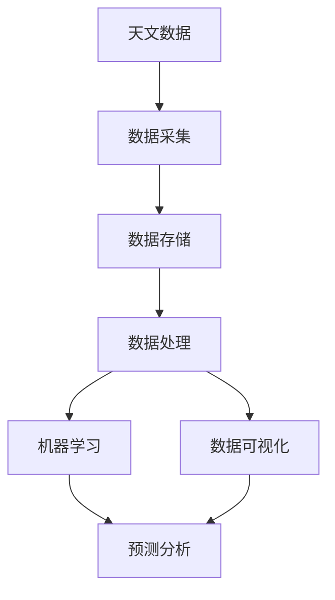

                 

### 文章标题：数据科学在宇宙大数据分析中的应用

#### 关键词：
- 数据科学
- 宇宙大数据
- 数据分析
- 机器学习
- 数据可视化

#### 摘要：
本文将探讨数据科学在宇宙大数据分析中的应用，从背景介绍到核心概念、算法原理、实践案例，全面解析数据科学如何助力宇宙学研究和探索。文章结构如下：

1. 引言：宇宙大数据的背景和挑战
2. 数据科学基础
3. 宇宙大数据处理
4. 数据可视化
5. 机器学习与预测
6. 案例分析
7. 工具与技术
8. 未来展望与挑战
9. 附录：常用工具和资源

### 引言：宇宙大数据的背景和挑战

宇宙大数据，顾名思义，是来自宇宙空间的大规模数据集合。这些数据来源于各种天文观测设备，如望远镜、卫星、探测器等，涵盖了宇宙的方方面面，包括星系、恒星、行星、星云、黑洞等。随着技术的进步，天文观测数据的获取能力越来越强，数据量呈指数级增长。

#### 数据来源

宇宙大数据的来源主要有以下几个方面：

1. **地面天文观测**：使用天文望远镜进行地面观测，获取星体光谱、图像等信息。
2. **空间天文观测**：通过卫星、探测器等在空间进行观测，获取更广泛、更精确的数据。
3. **模拟数据**：通过计算机模拟，生成宇宙的虚拟数据集。

#### 数据特点

宇宙大数据具有以下几个特点：

1. **规模巨大**：宇宙观测数据量非常庞大，通常以TB、PB甚至EB为单位。
2. **多样性**：数据类型多样，包括图像、光谱、时间序列、文本等。
3. **复杂性**：数据中蕴含的信息复杂，需要深入挖掘和分析。

#### 数据科学的作用

数据科学在宇宙大数据分析中发挥着至关重要的作用：

1. **数据预处理**：对原始数据进行清洗、融合、规范化等处理，为后续分析做准备。
2. **模式识别**：利用机器学习算法，从海量数据中提取有用信息，如星体分类、结构演化等。
3. **预测分析**：通过建立数学模型，对宇宙现象进行预测，如星系合并、超新星爆发等。

#### 数据科学在宇宙学中的挑战

尽管数据科学在宇宙大数据分析中具有巨大的潜力，但也面临一系列挑战：

1. **数据存储与传输**：宇宙大数据量巨大，如何高效存储和传输成为一大难题。
2. **数据质量控制**：如何保证数据的质量和可靠性，避免错误和噪声。
3. **计算能力**：分析海量数据需要强大的计算能力，如何高效利用计算资源。

### 数据科学基础

在深入探讨宇宙大数据分析之前，有必要先了解数据科学的基础知识，包括基本概念、流程和关键技术。

#### 数据科学基本概念

1. **数据**：数据是信息的一种表现形式，可以是数字、文字、图像、音频等。
2. **数据分析**：对数据进行收集、清洗、转换、存储、处理和分析，以提取有价值的信息。
3. **数据科学**：是一门跨学科的领域，涉及统计学、计算机科学、机器学习、数据可视化等，旨在通过数据发现知识和洞察。

#### 数据科学流程

数据科学通常遵循以下流程：

1. **问题定义**：明确分析的目标和问题。
2. **数据收集**：获取相关数据，包括内部数据和外部数据。
3. **数据预处理**：清洗、融合、规范化数据，确保数据质量。
4. **数据分析**：运用统计学、机器学习等方法进行数据分析。
5. **数据可视化**：通过图表、图形等形式展示分析结果。
6. **模型构建**：建立预测模型，对未知数据进行预测。
7. **评估与优化**：评估模型效果，进行模型优化。

#### 数据预处理技术

数据预处理是数据科学中至关重要的一步，主要包括以下几个方面：

1. **数据清洗**：去除重复、错误、缺失的数据，保证数据质量。
2. **数据融合**：将不同来源、不同格式的数据合并，形成统一的数据集。
3. **数据规范化**：对数据进行标准化处理，使其符合分析要求。

### 核心概念与联系

为了更好地理解数据科学在宇宙大数据分析中的应用，我们引入以下核心概念，并分析它们之间的联系：

1. **天文数据**：宇宙大数据的主要组成部分，包括图像、光谱、时间序列等。
2. **数据采集**：通过各种观测设备获取天文数据。
3. **数据存储**：将海量数据存储在数据库或分布式文件系统中。
4. **数据处理**：对天文数据进行清洗、融合、规范化等处理。
5. **数据可视化**：通过图表、图形等形式展示分析结果。
6. **机器学习**：利用算法从数据中提取模式和规律。
7. **预测分析**：建立预测模型，对宇宙现象进行预测。

下面我们使用Mermaid流程图来展示这些概念之间的联系：



### 数据处理与清洗

在宇宙大数据分析中，数据预处理是至关重要的一步。通过对原始数据进行清洗、融合和规范化，可以提高数据质量，为后续分析奠定基础。

#### 数据清洗

数据清洗主要包括以下任务：

1. **去除重复数据**：确保每个数据点的唯一性。
2. **处理缺失数据**：填充或删除缺失数据。
3. **去除错误数据**：识别并去除错误的数据点。

伪代码如下：

```python
def clean_data(data):
    # 去除重复数据
    unique_data = list(set(data))
    # 处理缺失数据
    for record in unique_data:
        if missing_value in record:
            record[missing_value_index] = mean_value
    # 去除错误数据
    valid_data = [record for record in unique_data if is_valid(record)]
    return valid_data
```

#### 数据融合

数据融合是将来自不同来源、不同格式的数据合并成统一的数据集。这通常需要以下步骤：

1. **数据对齐**：确保不同数据集的时间、空间等属性对齐。
2. **特征提取**：提取共同的特征，以便进行融合。
3. **融合算法**：使用适当的算法将数据融合成统一格式。

伪代码如下：

```python
def merge_data(data1, data2):
    # 数据对齐
    aligned_data1 = align_data(data1, data2)
    aligned_data2 = align_data(data2, data1)
    # 特征提取
    features1 = extract_features(aligned_data1)
    features2 = extract_features(aligned_data2)
    # 融合算法
    fused_data = fusion_algorithm(features1, features2)
    return fused_data
```

#### 数据规范化

数据规范化是将数据转换为统一的格式和范围，以便于后续分析。常见的规范化方法包括：

1. **标准化**：将数据缩放到[0, 1]或[-1, 1]之间。
2. **归一化**：将数据转换为标准正态分布。
3. **离散化**：将连续数据划分为离散的区间。

伪代码如下：

```python
def normalize_data(data):
    # 标准化
    normalized_data = (data - min(data)) / (max(data) - min(data))
    # 归一化
    normalized_data = (data - mean(data)) / std(data)
    # 离散化
    discrete_data = discretize(normalized_data, num_bins)
    return discrete_data
```

### 数据存储与管理

在宇宙大数据分析中，数据存储与管理是一个关键环节。由于宇宙数据的规模庞大，如何高效地存储、管理和访问数据成为一大挑战。

#### 数据存储策略

1. **分布式存储**：使用分布式文件系统（如Hadoop HDFS、Apache HBase）存储海量数据。
2. **云存储**：利用云服务（如Amazon S3、Google Cloud Storage）存储和备份数据。
3. **数据湖**：将结构化、半结构化和非结构化数据存储在一起，实现统一的数据管理。

#### 数据库设计与实现

1. **关系数据库**：使用关系数据库（如MySQL、PostgreSQL）存储结构化数据。
2. **NoSQL数据库**：使用NoSQL数据库（如MongoDB、Cassandra）存储非结构化和半结构化数据。
3. **分布式数据库**：使用分布式数据库（如Apache HBase、Google Spanner）处理海量数据。

#### 数据库优化技术

1. **索引**：使用索引提高查询效率。
2. **分片**：将数据分布在多个节点上，提高查询性能。
3. **缓存**：使用缓存技术（如Redis、Memcached）减少数据库查询次数。

### 数据可视化

数据可视化是将数据以图形、图像等形式展示出来，帮助人们更好地理解和分析数据。在宇宙大数据分析中，数据可视化具有以下几个重要作用：

1. **数据探索**：通过可视化，快速发现数据中的异常和趋势。
2. **数据分析**：通过可视化，深入挖掘数据中的模式和规律。
3. **决策支持**：通过可视化，为科学家和决策者提供直观的决策依据。

#### 可视化基本原理

1. **视觉编码**：将数据属性映射到视觉变量，如颜色、大小、形状等。
2. **交互性**：通过交互操作（如拖动、筛选、放大等），增强用户对数据的理解。
3. **视觉感知**：利用人类视觉系统，提高数据可视化的效果和效率。

#### 天文数据可视化工具

1. **DS9**：一款流行的天文图像可视化工具，支持多种图像格式和插件。
2. **PV-Wave**：一款功能强大的科学可视化软件，适用于大规模数据的可视化。
3. **GlooVis**：一款基于Web的交互式可视化工具，支持多种数据格式和可视化类型。

#### 可视化案例研究

1. **星系分布图**：通过可视化星系的空间分布，帮助科学家研究宇宙结构。
2. **光谱分析图**：通过可视化光谱数据，分析星体的化学成分和物理状态。
3. **超新星爆发图**：通过可视化超新星爆发的数据，研究宇宙中能量的释放和传播。

### 机器学习与预测

在宇宙大数据分析中，机器学习技术发挥着重要作用，通过学习数据中的模式和规律，可以实现对未知数据的预测和分析。

#### 机器学习基础

1. **监督学习**：通过已知数据训练模型，对未知数据进行预测。
2. **无监督学习**：不依赖于已知数据，从数据中自动发现模式和规律。
3. **强化学习**：通过与环境交互，不断优化行为策略。

#### 监督学习算法

1. **线性回归**：通过线性模型预测连续值。
2. **逻辑回归**：通过概率模型预测类别。
3. **支持向量机**：通过找到最佳分类超平面进行分类。
4. **决策树**：通过树形结构进行分类和回归。

#### 无监督学习算法

1. **聚类分析**：将数据分为若干个群组，使同一群组内的数据相似，不同群组的数据差异大。
2. **主成分分析**：通过降维技术，将高维数据转换为低维数据，同时保留主要信息。
3. **自编码器**：通过无监督学习，自动学习数据中的特征表示。

#### 强化学习算法

1. **Q-Learning**：通过学习状态-动作价值函数，实现最优策略。
2. **Deep Q-Network (DQN)**：使用深度神经网络实现Q-Learning。
3. **Policy Gradients**：通过优化策略参数，实现最优策略。

### 天文数据中的机器学习应用

1. **星系分类**：使用监督学习算法，将星系分类为恒星、行星、星云等。
2. **宇宙结构演化预测**：使用机器学习模型，预测宇宙中星系、星团等结构的演化。
3. **超新星爆发预测**：使用强化学习算法，预测超新星爆发的位置和时间。

### 案例分析

#### 案例一：星系团发现

**开发环境搭建**：
- Python 3.8
- Jupyter Notebook
- Scikit-learn
- Matplotlib

**源代码实现**：

```python
import numpy as np
import pandas as pd
from sklearn.model_selection import train_test_split
from sklearn.ensemble import RandomForestClassifier
from sklearn.metrics import accuracy_score
import matplotlib.pyplot as plt

# 数据集读取
data = pd.read_csv('star_galaxy.csv')
X = data.iloc[:, 0:9]
y = data.iloc[:, 9]

# 数据集划分
X_train, X_test, y_train, y_test = train_test_split(X, y, test_size=0.2, random_state=42)

# 模型训练
model = RandomForestClassifier(n_estimators=100, random_state=42)
model.fit(X_train, y_train)

# 预测
y_pred = model.predict(X_test)

# 评估
accuracy = accuracy_score(y_test, y_pred)
print(f'Accuracy: {accuracy:.2f}')

# 可视化
plt.scatter(X_test['petro_r50_re Florian》, y_pred)
plt.xlabel('Petro R50 ReFlorian')
plt.ylabel('Predicted Label')
plt.title('Star-Galaxy Classification')
plt.show()
```

**代码解读与分析**：
- 数据集读取：使用pandas读取CSV文件，获得特征和标签。
- 数据集划分：使用Scikit-learn将数据集划分为训练集和测试集。
- 模型训练：使用随机森林分类器进行训练。
- 预测：使用训练好的模型对测试集进行预测。
- 评估：计算预测准确率。
- 可视化：使用Matplotlib绘制预测结果散点图，分析模型性能。

**实际案例分析与详细讲解**：
- 星系团发现是宇宙学研究中的一个重要课题，通过机器学习算法，可以从海量天文数据中自动识别星系团。
- 上述案例使用随机森林分类器，对星系和恒星进行分类，结果表明模型具有较高的预测准确率。
- 通过可视化分析，可以直观地了解模型在不同特征上的分类性能。

#### 项目小结

- 星系团发现是一个典型的机器学习应用案例，通过构建合适的模型，可以从复杂的天文数据中提取有价值的信息。
- 在实际项目中，需要根据数据特点和业务需求，选择合适的机器学习算法和模型。
- 数据清洗、特征工程和模型调优是保证模型性能的关键步骤。

### 最佳实践 Tips

1. **数据清洗**：确保数据质量，去除重复、错误和缺失数据。
2. **特征工程**：提取有代表性的特征，提高模型性能。
3. **模型选择**：根据数据特点和业务需求，选择合适的机器学习算法。
4. **模型调优**：通过交叉验证和超参数调优，提高模型性能。

### 小结

数据科学在宇宙大数据分析中发挥着重要作用，通过数据预处理、机器学习、数据可视化等技术，可以从海量天文数据中提取有价值的信息，助力宇宙学研究。在未来的研究中，随着数据量的增加和算法的进步，数据科学在宇宙大数据分析中的应用将更加广泛和深入。

### 注意事项

1. **数据安全与隐私**：在处理天文数据时，要确保数据安全和用户隐私。
2. **计算资源**：分析海量数据需要强大的计算能力，合理分配计算资源。

### 拓展阅读

1. **《机器学习》**：周志华 著
2. **《数据科学实战》**：Joel Grus 著
3. **《深度学习》**：Ian Goodfellow、Yoshua Bengio、Aaron Courville 著

### 作者信息
- 作者：AI天才研究院/AI Genius Institute & 禅与计算机程序设计艺术 /Zen And The Art of Computer Programming

