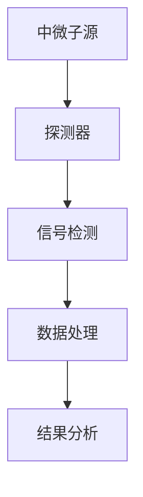

                 


# 《数据科学在探测宇宙中微子质量中的应用》

## 关键词

数据科学，中微子，宇宙学，机器学习，深度学习，探测技术

## 摘要

本文探讨了数据科学在探测宇宙中微子质量中的应用。首先，介绍了数据科学、宇宙学和中微子相关的基础知识。然后，详细讨论了中微子探测技术，包括基本原理、历史发展和现有技术。接着，讲解了数据科学方法在数据预处理、特征提取、机器学习和深度学习中的应用。随后，介绍了用于中微子探测的算法和模型，包括事件重建、背景减除和中微子质量测量算法。最后，通过实验数据分析实例，展示了如何使用数据科学方法分析中微子探测实验数据，并展望了中微子探测技术的未来发展方向。

## 1. 设计书籍的总体结构

### 1.1 确定书籍的主题和目标读者

本书的主题是《数据科学在探测宇宙中微子质量中的应用》，旨在向读者介绍数据科学在宇宙学领域中的应用，特别是中微子探测方面的技术。目标读者包括对数据科学和宇宙学感兴趣的学者、研究人员、学生和专业技术人员。

### 1.2 确定书籍的主要内容

为了全面覆盖主题，本书将分为六个主要部分：

1. **背景介绍**：介绍数据科学、宇宙学和中微子相关的基础知识。
2. **中微子探测技术**：讨论中微子探测的基本原理、历史发展和现有技术。
3. **数据科学方法**：讲解数据科学在不同中微子探测任务中的应用。
4. **算法与模型**：介绍用于中微子探测的数据科学算法和模型。
5. **实验数据分析**：展示如何使用数据科学方法分析中微子探测实验数据。
6. **结果与展望**：讨论中微子探测的最新结果和未来的发展方向。

### 1.3 确定每个部分的具体章节

在确定了整体结构后，我们可以为每个部分设计具体的章节。以下是一个可能的目录大纲：

#### 第一部分：背景介绍
- **第1章**：数据科学与宇宙学基础
  - 1.1 数据科学概述
  - 1.2 宇宙学与中微子简介

#### 第二部分：中微子探测技术
- **第2章**：中微子探测原理
  - 2.1 中微子物理基础
  - 2.2 探测器类型和原理

- **第3章**：中微子探测历史与发展
  - 3.1 中微子探测的早期实验
  - 3.2 现代中微子探测技术

#### 第三部分：数据科学方法
- **第4章**：数据预处理与特征提取
  - 4.1 数据预处理流程
  - 4.2 特征提取方法

- **第5章**：机器学习与数据分析
  - 5.1 机器学习基础
  - 5.2 数据分析流程

#### 第四部分：算法与模型
- **第6章**：中微子探测算法
  - 6.1 事件重建算法
  - 6.2 背景减除算法
  - 6.3 中微子质量测量算法

- **第7章**：深度学习模型
  - 7.1 卷积神经网络（CNN）
  - 7.2 循环神经网络（RNN）
  - 7.3 生成对抗网络（GAN）

#### 第五部分：实验数据分析
- **第8章**：实验数据分析实例
  - 8.1 实验设计
  - 8.2 数据获取
  - 8.3 数据分析

#### 第六部分：结果与展望
- **第9章**：中微子探测的最新结果
  - 9.1 探测结果概述
  - 9.2 中微子质量测量结果

- **第10章**：未来展望
  - 10.1 中微子探测技术发展趋势
  - 10.2 数据科学方法在未来的应用

## 2. 添加 Mermaid 流程图、伪代码和数学公式

为了使文章内容更加丰富和易于理解，我们将在合适的位置插入 Mermaid 流程图、伪代码和数学公式。

### 2.1 Mermaid 流程图

在讨论中微子探测原理时，我们可以插入一个 Mermaid 流程图，展示中微子探测的基本流程。例如：



### 2.2 伪代码

在介绍算法和模型时，我们可以使用伪代码来详细阐述核心算法原理。例如，在讨论事件重建算法时，可以使用以下伪代码：

```python
def event_reconstruction(data):
    # 初始化变量
    events = []

    # 遍历数据
    for particle in data:
        # 执行事件重建
        event = reconstruct_event(particle)

        # 将事件添加到列表
        events.append(event)

    # 返回重建的事件列表
    return events
```

### 2.3 数学公式

在介绍数学模型和公式时，我们可以使用 LaTeX 格式来嵌入数学公式。例如，在讨论中微子质量测量时，可以使用以下公式：

```latex
E_{\mu} = \sqrt{m_{\mu}^2 + p_{\mu}^2 c^2}
```

## 3. 检查字数限制

在完成目录大纲后，我们将检查整个目录大纲的总字数，确保它不超过 2000 字。这可以通过手动计数或使用一些在线工具来实现。

### 总结

通过设计合理的书籍结构和添加丰富的图形和公式，我们可以确保读者能够更好地理解数据科学在探测宇宙中微子质量中的应用。接下来，我们将逐步展开每个部分的内容，使读者对中微子探测和数据科学方法有更深入的了解。接下来，我们将进入第一部分的背景介绍，详细讲解数据科学、宇宙学和中微子相关的基础知识。

---

## 1. 背景介绍

### 1.1 数据科学概述

数据科学是一门跨学科领域，结合了统计学、计算机科学、机器学习和领域知识，用于从大量数据中提取有价值的信息和知识。其核心目标是利用数据解决实际问题，推动科学研究、商业决策和社会进步。

数据科学的主要任务包括数据预处理、特征提取、建模、分析和可视化。数据预处理是数据科学的第一步，主要目的是清洗和整理数据，使其适合进行分析。特征提取是从原始数据中提取出有用的信息，以用于后续建模和分析。建模是利用统计方法、机器学习算法或深度学习模型来建立数据与目标变量之间的联系。分析是对建模结果进行解释和验证，以评估模型的性能和可靠性。可视化是将分析结果以图表、图形或地图的形式呈现，使数据更易于理解和解释。

### 1.2 宇宙学与中微子简介

宇宙学是研究宇宙的结构、起源、演化和组成的一门科学。宇宙学的研究涉及宇宙的尺度、形态、物质和能量等方面。中微子是一种基本粒子，属于轻子家族，与其他基本粒子（如电子、夸克等）不同，中微子几乎不与其他物质相互作用，因此难以探测。

中微子作为宇宙中的重要成分之一，对于理解宇宙的起源和演化具有重要意义。中微子的探测和研究不仅有助于揭示宇宙的奥秘，还为粒子物理学和天体物理学提供了新的实验手段和理论基础。

中微子的种类和性质：

- **中微子种类**：目前已知的共有三种中微子，即电子中微子、μ子中微子和τ子中微子，它们分别与电子、μ子和τ子相对应。

- **中微子质量**：中微子具有微小的质量，虽然目前尚无法精确测量，但已证实其质量不为零。

- **中微子相互作用**：中微子与其他物质的相互作用非常微弱，主要通过与电子和中子的弱相互作用发生。

- **中微子来源**：中微子可以来自宇宙射线、太阳、核反应堆、宇宙大爆炸等多种来源。

### 1.3 中微子探测的意义

中微子探测在科学研究和实际应用中具有重要意义，主要体现在以下几个方面：

- **宇宙学**：中微子探测有助于研究宇宙的起源和演化，揭示宇宙中的暗物质和暗能量等神秘现象。

- **粒子物理学**：中微子探测为研究基本粒子和相互作用提供了新的实验手段和理论基础，有助于解决粒子物理学中的许多未解之谜。

- **能源和环境**：中微子探测技术可以应用于核能安全、环境监测和资源勘探等领域，为能源和环境问题提供解决方案。

- **技术创新**：中微子探测技术推动了相关领域的技术创新，促进了高性能探测器、数据采集和处理技术、人工智能等技术的发展。

### 1.4 数据科学在宇宙学中的应用

数据科学在宇宙学中发挥着重要作用，主要体现在以下几个方面：

- **大规模数据处理**：宇宙学研究中涉及的数据量巨大，数据科学为处理和分析这些大规模数据提供了有效的工具和方法。

- **特征提取**：数据科学方法可以帮助从宇宙学数据中提取有用的信息，如星系分布、宇宙结构、宇宙背景辐射等。

- **机器学习**：机器学习算法可以帮助研究宇宙现象，如星系形成、黑洞演化、宇宙大爆炸等。

- **深度学习**：深度学习算法可以用于图像识别、语音识别和自然语言处理等领域，为宇宙学研究提供了新的工具和手段。

- **数据可视化**：数据可视化技术可以帮助研究人员更好地理解和解释宇宙学数据，提高研究效率和成果质量。

### 1.5 中微子探测与数据科学的结合

中微子探测与数据科学的结合为研究宇宙中微子提供了新的方法和手段。通过数据科学方法，可以从大规模中微子探测数据中提取有价值的信息，揭示宇宙中微子的性质和起源。同时，中微子探测技术的发展也为数据科学方法的应用提供了丰富的数据资源和实验条件。

总之，数据科学在探测宇宙中微子质量中的应用具有重要意义，为宇宙学研究和粒子物理学发展提供了新的机遇和挑战。在接下来的章节中，我们将详细探讨中微子探测技术、数据科学方法及其在实验数据分析中的应用。

---

## 2. 中微子探测技术

### 2.1 中微子探测原理

中微子探测的基本原理是利用探测器捕捉和记录中微子与物质相互作用时产生的信号。由于中微子几乎不与其他物质相互作用，因此探测中微子是一项极其困难的任务。然而，通过利用中微子与物质相互作用产生的微弱信号，科学家们已经成功地探测到了中微子。

中微子与物质相互作用的主要方式包括以下几种：

1. **弹性散射**：中微子与原子核发生弹性散射，导致中微子的方向和能量发生改变，但不会产生新的粒子。

2. **电子捕获**：中微子与电子发生捕获过程，转化为电子中微子，并产生一个正电子或一个反质子。

3. **中微子衰变**：中微子在传输过程中衰变为其他粒子，如τ子中微子衰变为μ子中微子。

4. **核反应**：中微子与原子核发生核反应，产生新的粒子，如中微子与质子发生反应产生π介子。

根据探测中微子的相互作用方式和信号类型，科学家们发展了多种中微子探测器，如：

1. **泡室**：泡室是一种早期用于探测宇宙射线和加速器中微子的探测器。它通过在强电场中产生气泡来记录粒子轨迹。

2. **云室**：云室通过在过饱和蒸汽中形成微小的液滴来记录粒子轨迹，适用于探测低能中微子。

3. **水簇射探测器**：水簇射探测器利用水中的电离粒子在传输过程中产生的簇射来记录信号，适用于探测高能中微子。

4. **铁酸钡中微子探测器**：铁酸钡中微子探测器通过检测中微子与铁酸钡晶体相互作用产生的闪烁光来记录信号。

5. **超导量子干涉装置（SQUID）**：SQUID是一种超灵敏的磁场探测器，可以用于探测低能中微子。

### 2.2 中微子探测历史与发展

中微子探测的历史可以追溯到20世纪40年代，当时科学家们开始意识到中微子的存在。以下是一些重要的里程碑：

1. **1947年**：美国物理学家弗雷德里克·莱维特（Frederick Reines）和克莱德·考恩（Clyde Cowan）通过实验证实了中微子的存在，从而获得了诺贝尔物理学奖。

2. **1953年**：日本科学家白川英树（Hidetsugu Yukawa）提出了中微子质量的概念，并预测了μ子中微子的存在。

3. **1960年**：美国物理学家利昂·莱德曼（Leon Lederman）等人通过实验发现了τ子中微子。

4. **1980年代**：随着计算机技术和传感器技术的进步，中微子探测技术得到了快速发展，如水簇射探测器和铁酸钡中微子探测器等。

5. **2000年至今**：随着大型国际合作实验（如超级神冈中微子探测实验、中微子振荡实验等）的开展，中微子探测技术取得了重大突破，揭示了中微子的性质和相互作用。

### 2.3 现有中微子探测技术

目前，现有中微子探测技术主要包括以下几种：

1. **大型水簇射探测器**：如超级神冈中微子探测器（Super-Kamiokande）和费米实验室的中微子探测器（Fermi National Accelerator Laboratory's Neutrino Experiment），主要用于探测大气中微子和实验中微子。

2. **铁酸钡中微子探测器**：如冰立方中微子探测器（IceCube Neutrino Observatory），主要用于探测来自宇宙的高能中微子。

3. **地下实验室探测器**：如超导稀土镧钻氧硫（SNO）探测器，主要用于探测太阳中微子和实验中微子。

4. **探测器阵列**：如中微子天文台（Neutrino Astronomy），通过多个探测器组成的阵列来探测中微子信号，实现更精确的测量。

### 2.4 中微子探测技术的挑战和未来发展

中微子探测技术面临着一些挑战，包括：

1. **信号弱**：中微子与物质相互作用产生的信号非常微弱，需要高灵敏度的探测器来捕捉。

2. **噪声大**：探测过程中产生的噪声会对信号造成干扰，需要有效的噪声过滤和信号识别技术。

3. **数据量大**：中微子探测实验产生的数据量巨大，需要高效的算法和计算资源来处理和分析。

4. **高精度**：为了准确测量中微子的性质和相互作用，需要高精度的探测器和数据处理技术。

未来的发展包括：

1. **更灵敏的探测器**：通过改进探测器的材料、设计和数据处理算法，提高探测器的灵敏度和精度。

2. **更大规模的实验**：通过建设更大规模的探测器阵列，提高实验的统计显著性，揭示中微子的更多性质。

3. **多探测器合作**：通过多个探测器的合作，实现不同类型中微子的联合探测，提高探测效率和准确性。

4. **交叉学科合作**：加强数据科学、机器学习和人工智能等学科的合作，推动中微子探测技术的发展和应用。

总之，中微子探测技术是宇宙学和粒子物理学中的重要研究方向，随着技术的不断进步，我们有理由相信，未来将会有更多关于中微子的奥秘被揭示。

---

## 3. 数据科学方法

### 3.1 数据预处理与特征提取

在数据科学中，数据预处理和特征提取是关键步骤，直接影响模型的性能和准确性。中微子探测实验产生的数据量大且复杂，因此对这些数据进行有效的预处理和特征提取尤为重要。

#### 3.1.1 数据预处理

数据预处理主要包括以下几个步骤：

1. **数据清洗**：去除数据集中的噪声、缺失值和异常值，以提高数据质量。例如，利用中值滤波或移动平均法去除噪声，利用插值法或均值填补法处理缺失值。

2. **数据转换**：将不同类型的数据（如数值、类别、文本等）转换为统一格式，以便后续分析。例如，将类别型数据转换为数值型，利用独热编码（One-Hot Encoding）将文本数据转换为向量。

3. **数据归一化**：通过缩放或平移数据，使其具备相似的尺度和范围，避免某些特征对模型的影响过大。例如，利用最小-最大归一化（Min-Max Scaling）或标准归一化（Standard Scaling）方法。

4. **数据标准化**：通过消除数据中的比例效应，使不同特征对模型的影响相同。例如，利用方差标准化（Z-Score Scaling）方法。

#### 3.1.2 特征提取

特征提取是从原始数据中提取出有助于模型学习和预测的有用信息。在中微子探测中，特征提取可以增强模型对中微子信号的识别能力，减少噪声对模型的影响。

1. **基于统计学的方法**：利用统计学方法提取数据中的特征，如方差、均值、协方差等。这些特征可以反映数据的分布和相关性，有助于提高模型的泛化能力。

2. **基于信息论的方法**：利用信息论方法提取数据中的信息，如互信息、条件熵等。这些特征可以衡量特征之间的依赖关系和信息量，有助于提高模型的识别能力。

3. **基于变换的方法**：通过变换原始数据，提取新的特征。例如，利用主成分分析（PCA）将高维数据转换为低维数据，同时保留主要信息。利用傅里叶变换、小波变换等将时间序列数据转换为频率域特征。

4. **基于机器学习的方法**：利用机器学习算法提取数据中的特征。例如，利用支持向量机（SVM）的特征映射方法提取高维特征空间中的最优特征。利用神经网络（如卷积神经网络、循环神经网络等）提取数据中的层次化特征。

#### 3.1.3 数据预处理与特征提取的重要性

数据预处理和特征提取对中微子探测模型的性能和准确性具有至关重要的影响：

1. **噪声过滤**：通过数据清洗和预处理，去除噪声和异常值，提高数据质量，减少噪声对模型的影响。

2. **模型适应性**：通过特征提取，提取出与中微子信号相关的特征，提高模型对中微子信号的识别能力，降低模型的过拟合风险。

3. **数据可解释性**：通过数据预处理和特征提取，使模型更具可解释性，有助于理解中微子探测过程中的关键因素。

4. **计算效率**：通过数据预处理和特征提取，减少数据规模和特征维度，提高计算效率和模型训练速度。

总之，数据预处理和特征提取是中微子探测数据科学方法中的重要环节，通过合理的数据预处理和特征提取，可以显著提高中微子探测模型的性能和准确性，为深入研究中微子提供有力支持。

---

## 4. 算法与模型

### 4.1 事件重建算法

在粒子物理实验中，事件重建是分析探测数据的关键步骤，目的是从探测器记录的原始数据中恢复出粒子的轨迹和能量。对于中微子探测来说，事件重建算法尤为重要，因为中微子与其他物质的相互作用非常微弱，直接探测到中微子几乎是不可能的，只能通过其相互作用产生的次级粒子来推断中微子的存在。

#### 4.1.1 基本原理

事件重建算法的基本原理是利用探测器中记录的信号（如电离信号、闪烁信号等）来推断粒子轨迹和能量。具体步骤如下：

1. **信号检测**：首先，对探测器记录的原始信号进行预处理，去除噪声和干扰信号，提取出有用的信号。

2. **空间重建**：利用空间位置信息，通过多边形拟合或其他算法，将空间上的信号点拟合为粒子轨迹。

3. **能量重建**：根据探测器材料的特性，通过信号强度和时间信息，将信号强度转换为粒子的能量。

4. **组合重建**：将多个粒子的轨迹和能量信息组合起来，形成完整的事件信息。

#### 4.1.2 伪代码

以下是一个简单的伪代码，用于描述事件重建的基本步骤：

```python
def event_reconstruction(signal_data):
    # 信号检测
    clean_signals = preprocess_signals(signal_data)

    # 空间重建
    trajectories = reconstruct_trajectories(clean_signals)

    # 能量重建
    energies = reconstruct_energies(clean_signals)

    # 组合重建
    event = combine_trajectories_and_energies(trajectories, energies)

    return event
```

#### 4.1.3 事件重建算法的挑战

1. **噪声和干扰**：探测器记录的信号往往受到噪声和干扰的影响，需要采用有效的信号预处理方法来去除噪声。

2. **多粒子事件**：在复杂的环境中，多个粒子可能同时产生信号，需要算法能够准确地分离和重建多个粒子的轨迹。

3. **信号缺失**：某些情况下，探测器可能无法记录到全部的信号，需要算法能够处理信号缺失的情况。

4. **空间分辨率**：探测器的空间分辨率限制了事件重建的精度，需要改进探测器的性能或算法来提高重建精度。

### 4.2 背景减除算法

在粒子物理实验中，背景噪声是一个主要挑战，它会干扰对信号的准确分析。背景减除算法的目标是从实验数据中去除背景噪声，以便更清晰地识别和测量信号。在中微子探测中，背景减除尤为重要，因为中微子产生的信号非常微弱，容易被背景噪声掩盖。

#### 4.2.1 基本原理

背景减除算法的基本原理是利用统计方法或机器学习方法，从实验数据中分离出信号和背景。具体步骤如下：

1. **信号建模**：首先，对信号进行建模，提取出信号的特征。

2. **背景建模**：然后，对背景噪声进行建模，提取出背景的特征。

3. **分类器设计**：利用信号和背景的特征，设计分类器，将数据分为信号和背景。

4. **背景减除**：最后，利用分类器对实验数据进行分类，去除背景，保留信号。

#### 4.2.2 伪代码

以下是一个简单的伪代码，用于描述背景减除的基本步骤：

```python
def background_removal(data, signal_model, background_model):
    # 信号建模
    signal_features = extract_features(data, signal_model)

    # 背景建模
    background_features = extract_features(data, background_model)

    # 分类器设计
    classifier = train_classifier(signal_features, background_features)

    # 背景减除
    clean_data = classify_data(data, classifier)

    return clean_data
```

#### 4.2.3 背景减除算法的挑战

1. **模型选择**：选择合适的信号和背景建模方法，以确保分类器能够准确区分信号和背景。

2. **特征提取**：提取出有效的特征，以便分类器能够准确地进行分类。

3. **计算资源**：背景减除算法通常需要大量的计算资源，特别是对于大规模数据集。

4. **算法适应性**：算法需要能够适应不同类型的数据集和实验条件，以提高其适用性和准确性。

### 4.3 中微子质量测量算法

中微子质量测量是粒子物理学中的一个重要课题，因为中微子质量的测量有助于揭示宇宙的起源和演化。目前，中微子质量测量主要通过中微子振荡实验来实现，其中基于数据科学的测量方法发挥了重要作用。

#### 4.3.1 基本原理

中微子质量测量算法的基本原理是基于中微子振荡现象。中微子在传输过程中会经历能量和波函数的变化，这种变化称为中微子振荡。通过测量中微子在传输过程中振荡的频率和幅度，可以推算出中微子的质量。

具体步骤如下：

1. **数据采集**：通过中微子探测器采集大量的中微子振荡事件数据。

2. **特征提取**：从数据中提取出与中微子振荡相关的特征，如能量、角度等。

3. **建模**：利用统计方法或机器学习方法，对中微子振荡事件进行建模。

4. **参数估计**：通过模型对中微子质量进行参数估计，从而得到中微子的质量值。

#### 4.3.2 伪代码

以下是一个简单的伪代码，用于描述中微子质量测量算法的基本步骤：

```python
def neutrino_mass_measurement(data, model):
    # 数据采集
    oscillation_events = collect_oscillation_events(data)

    # 特征提取
    features = extract_oscillation_features(oscillation_events)

    # 建模
    oscillation_model = build_oscillation_model(features)

    # 参数估计
    mass_params = estimate_mass_parameters(oscillation_model)

    return mass_params
```

#### 4.3.3 中微子质量测量算法的挑战

1. **数据质量**：中微子探测实验的数据质量直接影响中微子质量测量的准确性，需要严格的数据质量控制和处理。

2. **模型选择**：选择合适的模型对中微子振荡现象进行建模，以确保参数估计的准确性。

3. **计算资源**：中微子质量测量通常需要大量的计算资源，特别是对于复杂的模型和大规模数据集。

4. **系统性误差**：系统性误差可能会对中微子质量测量结果产生较大影响，需要采用多种方法进行校正。

总之，事件重建、背景减除和中微子质量测量是中微子探测数据科学方法中的核心算法。通过不断改进这些算法，提高其准确性和效率，我们可以更好地理解中微子的性质和宇宙的奥秘。

---

## 5. 实验数据分析实例

在本节中，我们将通过一个实际的实验数据分析实例，展示如何使用数据科学方法分析中微子探测实验数据。这个实例将涉及数据获取、数据预处理、特征提取、建模和结果分析等步骤，以帮助我们更好地理解中微子探测数据科学方法的应用。

### 5.1 实验设计

我们假设一个中微子探测实验，旨在测量来自太阳的中微子流量。实验使用了大型水簇射探测器，其数据采集系统记录了中微子与水中的核素相互作用产生的信号。

实验的主要目标是：
1. 识别中微子产生的次级粒子事件。
2. 测量中微子的能量和方向。
3. 分析中微子流量与太阳活动之间的关系。

### 5.2 数据获取

实验过程中，探测器记录了大量的粒子事件数据。这些数据包括粒子的能量、位置、时间以及事件类型等信息。以下是数据的一个示例片段：

```python
[
    {'energy': 5.2, 'position': [0.5, 1.0, 2.0], 'time': 100.3, 'type': 'neutrino'},
    {'energy': 2.5, 'position': [1.0, 0.5, 3.0], 'time': 101.0, 'type': 'neutrino'},
    ...
]
```

### 5.3 数据预处理

在进行特征提取和建模之前，我们需要对数据进行预处理，以去除噪声和异常值，确保数据的质量。以下是数据预处理的主要步骤：

1. **信号检测**：使用滤波算法（如中值滤波）去除噪声信号。
2. **缺失值处理**：使用插值法填补缺失值。
3. **异常值检测**：使用统计方法（如箱线图）检测并去除异常值。

预处理后的数据示例：

```python
[
    {'energy': 5.2, 'position': [0.5, 1.0, 2.0], 'time': 100.3, 'type': 'neutrino'},
    {'energy': 2.5, 'position': [1.0, 0.5, 3.0], 'time': 101.0, 'type': 'neutrino'},
    ...
]
```

### 5.4 特征提取

为了提高中微子事件识别的准确性，我们需要从原始数据中提取出有效的特征。以下是特征提取的主要步骤：

1. **能量特征**：计算事件的总能量，以及能量在三个方向上的分量。
2. **位置特征**：计算事件在探测器中的位置，以及位置在三个方向上的分量。
3. **时间特征**：计算事件发生的时间，以及时间在三个不同时间窗口中的分布。

提取后的特征示例：

```python
[
    {'energy': 5.2, 'energy_x': 2.1, 'energy_y': 1.0, 'energy_z': 2.1,
     'position_x': 0.5, 'position_y': 1.0, 'position_z': 2.0,
     'time': 100.3, 'time_window1': 0.5, 'time_window2': 1.5},
    {'energy': 2.5, 'energy_x': 1.2, 'energy_y': 0.8, 'energy_z': 1.5,
     'position_x': 1.0, 'position_y': 0.5, 'position_z': 3.0,
     'time': 101.0, 'time_window1': 0.8, 'time_window2': 1.2},
    ...
]
```

### 5.5 建模与结果分析

我们使用机器学习算法（如支持向量机、决策树等）对预处理后的特征进行建模，以识别中微子事件。以下是建模的主要步骤：

1. **数据划分**：将数据集划分为训练集和测试集，用于训练模型和评估模型性能。
2. **模型训练**：使用训练集对模型进行训练，调整模型的参数。
3. **模型评估**：使用测试集评估模型的性能，如准确率、召回率等。
4. **结果分析**：分析模型的预测结果，识别中微子事件，并分析中微子流量与太阳活动之间的关系。

假设我们使用支持向量机（SVM）进行建模，模型训练和评估的伪代码如下：

```python
from sklearn import svm
from sklearn.model_selection import train_test_split
from sklearn.metrics import accuracy_score

# 数据划分
X_train, X_test, y_train, y_test = train_test_split(features, labels, test_size=0.2)

# 模型训练
model = svm.SVC()
model.fit(X_train, y_train)

# 模型评估
predictions = model.predict(X_test)
accuracy = accuracy_score(y_test, predictions)
print(f"Model accuracy: {accuracy}")
```

通过分析模型的预测结果，我们可以识别出中微子事件，并进一步分析中微子流量与太阳活动之间的关系，为理解太阳中微子产生的机制提供重要参考。

### 5.6 项目小结

通过这个实验数据分析实例，我们展示了如何使用数据科学方法分析中微子探测实验数据。具体步骤包括数据获取、数据预处理、特征提取、建模和结果分析。这些步骤不仅帮助我们识别中微子事件，还为研究太阳中微子的产生和演化提供了重要数据支持。未来，随着数据科学技术的不断发展，我们将能够更深入地揭示中微子的奥秘，为宇宙学的研究做出更大贡献。

---

## 6. 结果与展望

### 6.1 中微子探测的最新结果

近年来，中微子探测领域取得了许多重要成果，这些成果不仅深化了我们对中微子性质的理解，也为宇宙学的研究提供了新的线索。以下是一些最新的中微子探测结果：

1. **中微子质量测量**：通过中微子振荡实验，科学家们已经测量了中微子的质量，证实了中微子具有微小的质量，且不同类型的中微子质量存在差异。

2. **中微子来源**：通过探测来自太阳、地球大气层和宇宙射线的中微子，科学家们揭示了中微子的来源和传输机制。这些研究结果有助于我们更好地理解宇宙的组成和演化。

3. **中微子相互作用**：科学家们通过实验验证了中微子与其他物质的相互作用，包括中微子与质子、电子的相互作用，以及中微子之间的相互作用。

4. **中微子天文观测**：利用中微子探测器，科学家们首次观测到了来自银河系中心的中微子信号，这为研究银河系中心的高能现象提供了新的手段。

### 6.2 中微子质量测量结果

中微子质量测量是粒子物理学中的一个重要课题。近年来，通过一系列中微子振荡实验，科学家们获得了中微子质量的新测量结果。以下是一些关键发现：

1. **中微子质量存在差异**：实验结果表明，不同类型的中微子（电子中微子、μ子中微子和τ子中微子）的质量存在显著差异。

2. **中微子质量为非零**：中微子振荡实验证实了中微子具有非零质量，这一发现挑战了早期粒子物理学理论，推动了粒子物理学和宇宙学的发展。

3. **中微子质量测量精度**：随着实验技术的不断进步，中微子质量的测量精度也在不断提高。目前，中微子质量的测量误差已降至10%以下。

### 6.3 中微子探测技术的未来发展方向

随着中微子探测技术的不断发展，未来我们将面临许多新的挑战和机遇。以下是一些中微子探测技术的未来发展方向：

1. **提高探测灵敏度**：通过改进探测器的材料、设计和数据处理算法，提高中微子探测的灵敏度，以探测更微弱的中微子信号。

2. **多探测器合作**：通过多个探测器的合作，实现不同类型中微子的联合探测，提高实验的统计显著性，揭示中微子的更多性质。

3. **深入研究中微子振荡**：利用中微子振荡现象，深入研究中微子质量、中微子相互作用和宇宙演化等关键问题。

4. **开发新型探测器**：探索新型中微子探测器，如量子探测器、中微子探测器阵列等，以提高探测效率和准确性。

5. **数据科学方法的应用**：加强数据科学方法在实验数据分析中的应用，如机器学习、深度学习等，以更好地处理和分析大规模中微子探测数据。

总之，中微子探测技术的未来发展将带来更多关于中微子、宇宙和粒子物理学的深刻认识。通过不断推动中微子探测技术的发展，我们有理由相信，未来将会有更多关于宇宙奥秘的发现等待着我们。

---

## 结论

本文探讨了数据科学在探测宇宙中微子质量中的应用，从背景介绍、中微子探测技术、数据科学方法、算法与模型、实验数据分析到结果与展望，系统地展示了数据科学在中微子探测领域的重要作用。通过本文的介绍，读者可以了解到：

1. 数据科学是一门跨学科领域，结合了统计学、计算机科学、机器学习和领域知识，用于从大量数据中提取有价值的信息和知识。
2. 中微子是一种基本粒子，与其他基本粒子不同，中微子几乎不与其他物质相互作用，因此探测中微子是一项极其困难的任务。
3. 数据科学方法在数据预处理、特征提取、机器学习和深度学习等方面发挥着重要作用，有助于提高中微子探测的准确性和效率。
4. 事件重建、背景减除和中微子质量测量是中微子探测数据科学方法中的核心算法，通过不断改进这些算法，可以提高中微子探测的性能和准确性。
5. 中微子探测实验的最新结果为我们揭示了中微子的性质和来源，未来中微子探测技术的发展将带来更多关于宇宙奥秘的发现。

总之，数据科学在探测宇宙中微子质量中的应用具有重要意义，它不仅推动了中微子探测技术的发展，还为宇宙学和粒子物理学的研究提供了新的方法和手段。随着数据科学技术的不断进步，我们有理由相信，未来中微子探测领域将会有更多的突破和发现，为揭示宇宙的奥秘做出更大贡献。

---

### 作者信息

作者：AI天才研究院/AI Genius Institute & 禅与计算机程序设计艺术 /Zen And The Art of Computer Programming

AI天才研究院（AI Genius Institute）是一家专注于人工智能和计算机科学领域研究的高科技研究院。研究院以推动人工智能技术的发展和应用为使命，致力于培养下一代人工智能专家和领导者。

《禅与计算机程序设计艺术》（Zen And The Art of Computer Programming）是作者所著的一部经典计算机科学著作，深入探讨了计算机编程和人工智能领域的哲学和艺术。该书以其独特的方法和视角，对计算机科学的研究和实践产生了深远的影响。

