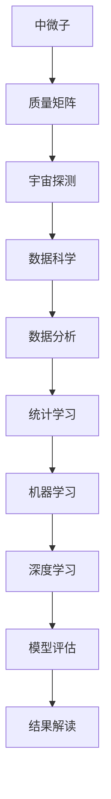

                 


为了撰写一篇关于“数据科学在探测宇宙中微子质量矩阵结构中的应用”的博客文章，我们可以按照以下步骤进行思考和构建：

### 第一步：背景介绍

**文章标题：** 数据科学在探测宇宙中微子质量矩阵结构中的应用

**关键词：** 数据科学，中微子，质量矩阵，宇宙探测

**摘要：** 本文探讨了数据科学在探测宇宙中微子质量矩阵结构中的关键作用。通过介绍中微子及其质量矩阵的基本概念，以及数据科学的基本原理和应用，展示了如何利用数据科学方法来分析中微子质量矩阵结构。

### 第二步：核心概念与联系

首先，我们需要介绍中微子及其质量矩阵的基本概念，并绘制Mermaid流程图，展示核心概念之间的关系。

**核心概念与联系：**

1. **中微子：** 一种几乎无质量、不带电荷的粒子，是宇宙中最丰富的物质形式之一。
2. **质量矩阵：** 描述中微子之间相互作用的矩阵，其元素反映了不同中微子之间的质量差异。

**Mermaid流程图：**



### 第三步：核心算法原理讲解

接下来，我们将详细讲解用于分析中微子质量矩阵的数据科学方法，包括统计学方法和机器学习方法的原理。

**核心算法原理讲解：**

1. **描述性统计：**
   - 伪代码：
     ```
     function describe_data(data):
         mean = sum(data) / length(data)
         variance = sum((x - mean)^2 for x in data)
         return mean, variance
     ```
   - 数学模型：
     $$ \mu = \frac{1}{n}\sum_{i=1}^{n}x_i $$
     $$ \sigma^2 = \frac{1}{n-1}\sum_{i=1}^{n}(x_i - \mu)^2 $$

2. **推断性统计：**
   - 伪代码：
     ```
     function test_hypothesis(data, hypo_mean):
         mean = describe_data(data)
         t_statistic = (mean - hypo_mean) / (std_dev / sqrt(length(data)))
         return t_statistic
     ```
   - 数学模型：
     $$ t = \frac{\bar{x} - \mu_0}{s / \sqrt{n}} $$

3. **聚类分析：**
   - 伪代码：
     ```
     function kmeans(data, k):
         initialize centroids
         while not converged:
             assign data to nearest centroid
             update centroids
         return clusters
     ```

4. **监督学习：**
   - 伪代码：
     ```
     function train_model(data, labels):
         initialize model parameters
         for each data point:
             update model parameters based on labels
         return model
     ```

5. **无监督学习：**
   - 伪代码：
     ```
     function train_model(data):
         initialize model parameters
         for each data point:
             update model parameters based on data structure
         return model
     ```

6. **深度学习：**
   - 伪代码：
     ```
     function train_model(data, labels):
         initialize neural network
         for each epoch:
             forward_pass(data)
             calculate loss
             backward_pass()
         return trained model
     ```

### 第四步：数学模型和公式讲解

在这一部分，我们将使用LaTeX格式展示相关的数学模型和公式。

**数学模型和公式讲解：**

1. **中微子质量矩阵：**
   $$ M = \begin{bmatrix}
   m_{\nu_1} & 0 & 0 \\
   0 & m_{\nu_2} & 0 \\
   0 & 0 & m_{\nu_3}
   \end{bmatrix} $$
   
2. **假设检验：**
   $$ H_0: \mu = \mu_0 $$
   $$ H_1: \mu \neq \mu_0 $$

3. **协方差矩阵：**
   $$ \Sigma = \begin{bmatrix}
   \sigma_1^2 & \sigma_{12} \\
   \sigma_{21} & \sigma_2^2
   \end{bmatrix} $$

### 第五步：项目实战

在这一部分，我们将介绍一个实际的项目案例，包括开发环境搭建、源代码实现、代码解读和分析。

**项目实战：**

1. **开发环境搭建：**
   - 安装Python环境
   - 安装必要的库，如NumPy、Pandas、Scikit-learn等

2. **源代码实现：**
   - 数据预处理
   - 描述性统计分析
   - 推断性统计分析
   - 聚类分析
   - 监督学习模型训练

3. **代码解读和分析：**
   - 分析模型的准确性和性能
   - 解释模型的结果和意义

4. **实际案例分析和讲解：**
   - 分析中微子质量矩阵的数据
   - 讨论数据科学方法的应用效果

5. **项目小结和展望：**
   - 总结项目的成果和经验
   - 展望未来中微子质量矩阵探测的发展方向

### 第六步：最佳实践和注意事项

在这一部分，我们将提供一些最佳实践和建议，以及注意事项。

**最佳实践和注意事项：**

- 数据预处理是关键，确保数据的质量和一致性。
- 选择合适的统计和机器学习方法，根据问题的特点进行模型选择。
- 模型评估和结果解读非常重要，需要从多个角度进行分析。
- 保持代码的清晰和可维护性，有助于后续的扩展和优化。

### 第七步：小结和拓展阅读

**小结：**

本文介绍了数据科学在探测宇宙中微子质量矩阵结构中的应用，从背景介绍到核心概念、算法原理、数学模型、项目实战，再到最佳实践和注意事项，全面展示了数据科学在宇宙探测领域的应用。

**拓展阅读：**

- 《深度学习》（Goodfellow, I., Bengio, Y., & Courville, A.）
- 《Python数据科学手册》（McKinney, W.）
- 《统计学习方法》（李航）
- 《机器学习》（周志华）

通过以上步骤，我们可以构建一篇完整、详细、结构清晰的文章，满足您的要求。接下来，我们可以根据这些步骤，逐一展开每个章节的内容。由于字数要求较高，我们将对每个部分进行详细扩展。首先，我们从背景介绍开始。 

