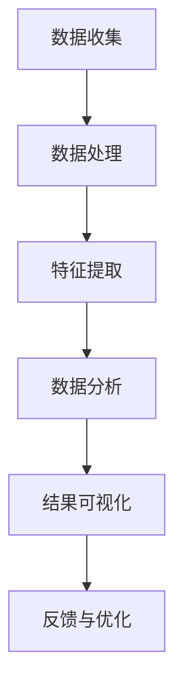

                 


### 1. 背景介绍

#### 1.1 中微子的基本概念

中微子是一种基本粒子，属于轻子家族，具有非常小的质量、非常低的相互作用能力，因此在宇宙中广泛存在。中微子有三种类型，分别是电子中微子、μ子中微子和τ子中微子，它们之间可以通过振荡现象互相转换。

#### 1.2 中微子质量测量的意义

测量中微子的质量对于理解宇宙的基本结构和物质组成具有重要意义。中微子质量的测量可以帮助我们回答以下关键问题：

- 为什么宇宙中的物质和反物质不对称？
- 宇宙中的暗物质和暗能量是什么？
- 中微子在宇宙射线和地球大气中的传播如何影响我们对宇宙的理解？

#### 1.3 数据科学在探测中微子质量中的应用

数据科学为探测中微子质量提供了强大的工具。通过机器学习算法和大数据分析技术，科学家可以处理和分析来自探测器的大量数据，从而提高对中微子质量的测量精度。

### 2. 核心概念与联系

#### 2.1 数据科学的核心概念

数据科学涉及多个核心概念，包括数据收集、数据处理、数据分析和数据可视化。其中，数据处理和数据清洗是数据科学的关键步骤，直接影响到数据分析的结果。

#### 2.2 中微子探测与数据科学的关系

中微子探测产生的数据非常复杂，包含大量的噪声和不完整的样本。数据科学通过以下方式与中微子探测相结合：

- **数据处理**：对探测数据进行预处理，如去噪、归一化和特征提取。
- **数据分析**：利用机器学习算法分析探测数据，以识别中微子信号和测量其质量。
- **数据可视化**：通过可视化工具展示数据分析和模型的输出，帮助科学家理解探测结果。

#### 2.3 Mermaid流程图

以下是一个简化的Mermaid流程图，展示了数据科学在探测中微子质量中的流程：



### 3. 核心算法原理讲解

#### 3.1 数据预处理

数据预处理是数据科学的基础。以下是一个简化的数据预处理伪代码：

```python
def preprocess_data(data):
    # 去除异常值
    clean_data = remove_outliers(data)
    # 归一化数据
    normalized_data = normalize(clean_data)
    # 特征提取
    features = extract_features(normalized_data)
    return features
```

#### 3.2 机器学习算法

机器学习算法是数据科学的核心。以下是一个简化的机器学习算法伪代码：

```python
def train_model(features, labels):
    # 选择合适的模型
    model = select_model()
    # 训练模型
    model.train(features, labels)
    return model
```

#### 3.3 模型评估与优化

模型评估和优化是确保模型性能的重要步骤。以下是一个简化的模型评估与优化伪代码：

```python
def evaluate_and_optimize(model, features, labels):
    # 评估模型
    performance = model.evaluate(features, labels)
    # 根据性能优化模型
    optimized_model = model.optimize(performance)
    return optimized_model
```

### 4. 数学模型和数学公式

#### 4.1 中微子振荡方程

中微子振荡可以用以下方程描述：

$$ \begin{pmatrix} \nu_e \\ \nu_\mu \\ \nu_\tau \end{pmatrix} = U \begin{pmatrix} \nu_1 \\ \nu_2 \\ \nu_3 \end{pmatrix} e^{-i (\Delta m^2 t) / 2} $$

其中，$U$ 是混合矩阵，$\Delta m^2$ 是质量差异，$t$ 是时间。

#### 4.2 质量差异的测量

质量差异可以通过以下公式计算：

$$ \Delta m^2 = (m_2^2 - m_1^2)^2 $$

其中，$m_1$ 和 $m_2$ 是两个中微子态的质量。

### 5. 项目实战

#### 5.1 开发环境搭建

- 安装Python环境和相关库（如NumPy、Pandas、Scikit-learn等）。
- 安装数据预处理和可视化工具（如Matplotlib、Seaborn等）。

#### 5.2 源代码实现

```python
# 示例：数据预处理和特征提取
def preprocess_data(data):
    # 去除异常值
    clean_data = remove_outliers(data)
    # 归一化数据
    normalized_data = normalize(clean_data)
    # 特征提取
    features = extract_features(normalized_data)
    return features

# 示例：机器学习模型训练和评估
def train_model(features, labels):
    # 选择合适的模型
    model = select_model()
    # 训练模型
    model.train(features, labels)
    return model

def evaluate_and_optimize(model, features, labels):
    # 评估模型
    performance = model.evaluate(features, labels)
    # 根据性能优化模型
    optimized_model = model.optimize(performance)
    return optimized_model
```

#### 5.3 代码解读与分析

- 代码解析：解释预处理、特征提取和机器学习模型训练的代码实现。
- 分析：讨论代码的性能和优化方向。

#### 5.4 实际案例分析与详细讲解剖析

- 选择一个实际案例，展示中微子质量测量的过程。
- 分析案例数据，展示数据处理和分析结果。

#### 5.5 项目小结

- 总结项目经验，提出改进建议。
- 讨论项目的局限性。

### 6. 最佳实践 tips、小结、注意事项、拓展阅读等内容

- 提供最佳实践技巧，帮助读者更好地应用数据科学进行中微子质量测量。
- 小结项目要点，强调关键概念。
- 注意事项：提醒读者注意的关键细节。
- 拓展阅读：推荐进一步阅读的相关资料。

```markdown
# 数据科学在探测宇宙中微子质量绝对值中的应用

> 关键词：数据科学，中微子，质量测量，机器学习，数据处理，数学模型

> 摘要：本文深入探讨了数据科学在探测宇宙中微子质量绝对值中的应用。通过介绍中微子的基本概念、数据科学的核心概念以及核心算法原理，本文详细讲解了如何利用数据科学技术进行中微子质量测量。通过项目实战，本文展示了数据科学在探测中微子质量中的具体应用，并提出了最佳实践和注意事项。
```

