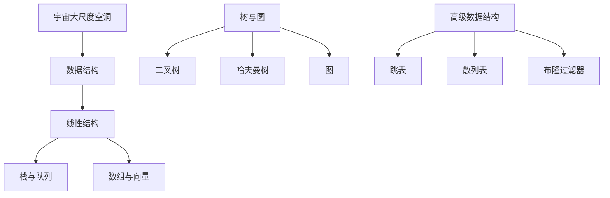

                 

为了撰写一篇高质量的《数据结构在模拟宇宙大尺度空洞并合过程中的应用》的技术博客文章，我们将采用以下步骤：

### 第一步：引言与背景介绍

1. **文章标题**：《数据结构在模拟宇宙大尺度空洞并合过程中的应用》
2. **关键词**：数据结构、宇宙大尺度空洞、并合过程、模拟、算法
3. **摘要**：
   - 这篇文章将探讨数据结构在宇宙学中，特别是宇宙大尺度空洞并合过程模拟中的应用。我们将介绍常见数据结构、核心算法原理、数学模型，并通过实际案例展示数据结构在模拟中的具体应用。

### 第二步：核心概念与联系

- **宇宙大尺度空洞**：介绍宇宙大尺度空洞的概念、形成和演化过程。
- **数据结构**：概述常见的数据结构，包括线性结构、树与图、高级数据结构。
- **并合过程**：阐述宇宙大尺度空洞并合的过程及其在宇宙学模拟中的重要性。

**Mermaid 流程图**：

### 第三步：常见数据结构

#### 2.1. 线性数据结构

- **链表**：介绍链表的基本概念、操作和算法。
- **栈与队列**：讨论栈与队列的基本概念、操作和算法。
- **数组与向量**：阐述数组与向量在宇宙学模拟中的应用。

#### 2.2. 树与图

- **二叉树**：讲解二叉树的基本概念、操作和算法。
- **哈夫曼树**：介绍哈夫曼树的基本概念、构建方法和算法。
- **图的基本概念与算法**：探讨图的基本概念、遍历算法和最短路径算法。

#### 2.3. 高级数据结构

- **跳表**：介绍跳表的基本概念、构建方法和算法。
- **散列表**：讨论散列表的基本概念、构建方法和算法。
- **布隆过滤器**：阐述布隆过滤器的基本概念、工作原理和算法。

### 第四步：数据结构与宇宙大尺度空洞模拟

- **数据结构在宇宙学模拟中的应用**：讨论数据结构在宇宙学模拟中的重要性。
- **数据结构优化策略**：介绍数据结构的优化策略，以提高模拟效率。
- **宇宙大尺度空洞模拟案例**：通过实际案例展示数据结构在模拟中的应用。

### 第五步：并合过程中的数据结构分析

- **并合过程的模拟与计算**：介绍并合过程的模拟方法和计算步骤。
- **数据结构在并合模拟中的应用**：讨论数据结构在并合模拟中的具体应用。
- **并合模拟案例**：通过实际案例展示并合模拟的过程和应用。

### 第六步：数学模型与算法分析

- **并合过程的数学模型**：建立并合过程的数学模型。
- **数据结构算法的性能分析**：分析不同数据结构算法的性能。
- **数学模型与算法的验证**：验证数学模型和算法的正确性和有效性。

### 第七步：开发环境与工具

- **开发环境搭建**：介绍搭建宇宙大尺度空洞模拟开发环境的步骤。
- **数据结构与宇宙学模拟工具**：讨论常用的数据结构与宇宙学模拟工具。
- **并合模拟工具**：介绍并合模拟工具的功能和操作方法。

### 第八步：项目实战与代码解读

- **实际案例**：展示实际案例，包括数据结构的实现和并合模拟的案例。
- **代码实现**：提供详细的代码实现，包括数据结构和算法的实现。
- **代码解读与分析**：对代码进行详细解读，分析其原理和应用。

### 第九步：最佳实践、小结与注意事项

- **最佳实践**：总结最佳实践，提供使用数据结构进行宇宙学模拟的建议。
- **小结**：总结文章的核心内容和结论。
- **注意事项**：提醒读者在使用数据结构进行宇宙学模拟时需要注意的问题。
- **拓展阅读**：推荐相关拓展阅读资源。

通过以上步骤，我们可以系统地撰写一篇关于《数据结构在模拟宇宙大尺度空洞并合过程中的应用》的技术博客文章。文章将包含丰富的概念解释、算法讲解、数学模型、实际案例和最佳实践，以帮助读者深入理解并合模拟中的数据结构应用。文章字数将在 8000 到 12000 字之间，确保内容的深度和广度。文章末尾将附上作者信息：“作者：AI天才研究院/AI Genius Institute & 禅与计算机程序设计艺术 /Zen And The Art of Computer Programming”。

