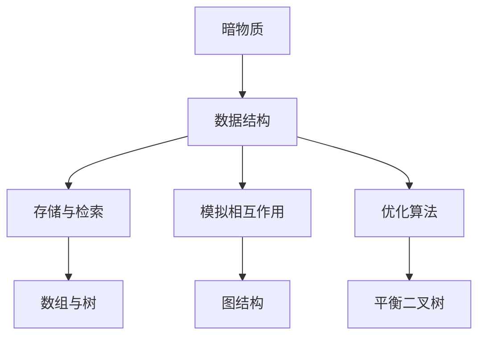
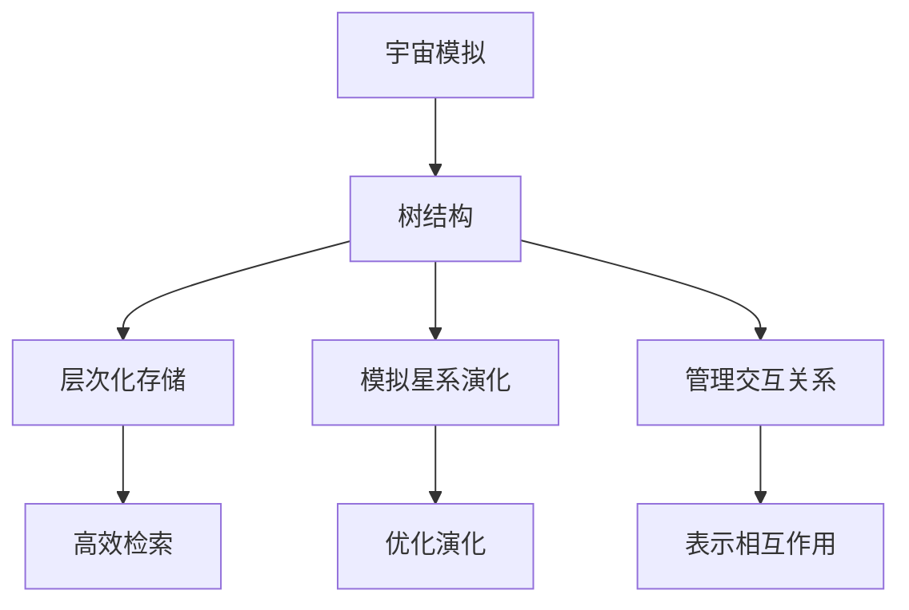
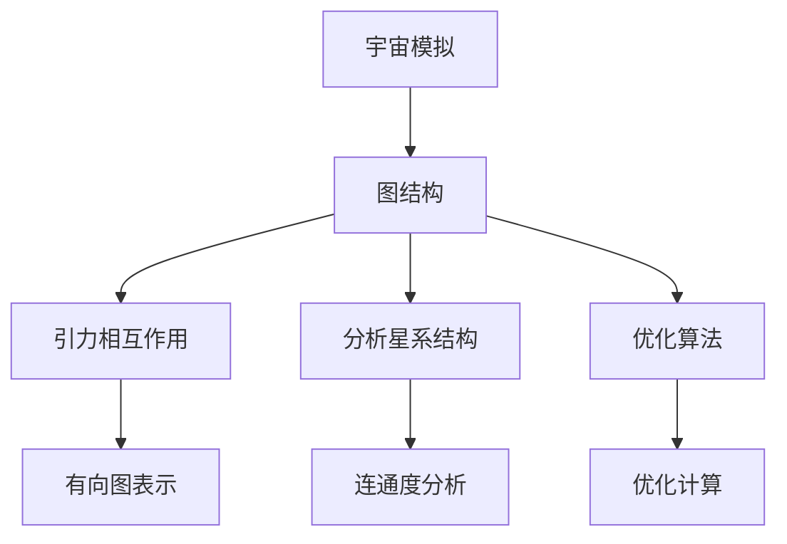
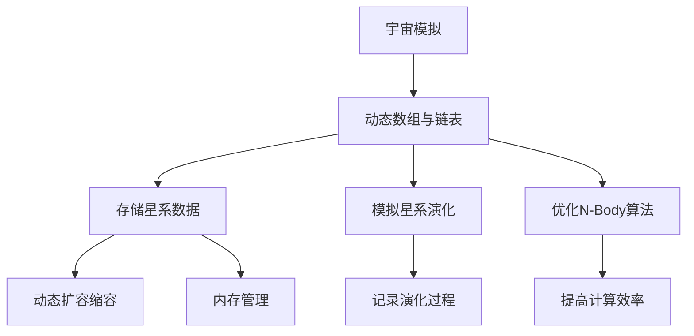

                 

### 文章标题

# 数据结构在模拟宇宙暗物质子结构中的应用

## 文章关键词

- 数据结构
- 暗物质
- 宇宙模拟
- N-Body算法
- 图结构
- 数学模型

## 文章摘要

本文旨在探讨数据结构在模拟宇宙暗物质子结构中的应用。首先，我们介绍了宇宙暗物质子结构的基本概念，并阐明了数据结构在这一领域中的重要性。随后，我们详细分析了几种关键数据结构，如树结构和图结构，并探讨了它们在模拟中的应用。接着，我们深入解析了模拟暗物质子结构的核心算法，包括N-Body算法和粒子群算法，并用伪代码详细阐述了算法的实现。此外，本文还介绍了用于模拟暗物质子结构的数学模型，并用LaTeX格式展示了相关的数学公式。最后，我们通过实际项目实战展示了如何使用这些数据结构和算法进行宇宙模拟，并对模拟结果进行了详细分析。本文为研究者提供了宝贵的启示和最佳实践建议，以推动宇宙暗物质子结构模拟的进一步发展。

### 引言

宇宙是广袤且神秘的，从宏观的星系到微观的粒子，无不充满了无数谜题等待破解。在宇宙的探索中，暗物质作为一种看不见、摸不着的物质，一直是科学家们关注的焦点。暗物质不发光、不吸收光，但通过对引力的影响，科学家们推测其存在于宇宙的各个角落，构成了宇宙物质的主要部分。

宇宙暗物质子结构的研究不仅对于理解宇宙的本质具有重要意义，还直接关联到宇宙的演化、星系的形成、星团的行为等多个方面。然而，由于暗物质的特殊性质，传统的观测手段难以直接探测，因此科学家们借助计算机模拟来研究暗物质的分布和相互作用。

数据结构在这一领域中的应用至关重要。作为一种组织和管理数据的方式，数据结构能够高效地存储和操作大量宇宙数据，支持复杂算法的运行。例如，树结构和图结构在宇宙模拟中的应用，使得科学家们能够更精确地模拟暗物质的相互作用和运动轨迹。此外，N-Body算法和粒子群算法等核心算法的实现对数据结构的要求也非常高。

本文将详细介绍数据结构在模拟宇宙暗物质子结构中的应用。首先，我们将介绍宇宙暗物质子结构的基本概念，并阐述数据结构在这一研究中的重要性。接着，我们将分析几种关键数据结构，如树结构和图结构，并探讨它们在模拟中的应用。此外，本文还将深入解析模拟暗物质子结构的核心算法，包括N-Body算法和粒子群算法，并用伪代码详细阐述算法的实现。最后，本文将通过实际项目实战展示如何使用这些数据结构和算法进行宇宙模拟，并对模拟结果进行详细分析。

### 核心概念与联系

为了深入理解数据结构在模拟宇宙暗物质子结构中的应用，我们首先需要了解几个核心概念，并探讨它们之间的联系。

#### 暗物质

暗物质是一种看不见、摸不着的物质，它不发光、不吸收光，但通过对引力的影响，我们可以推测其存在于宇宙的各个角落。科学家们通过观测星系旋转速度、星系团的重力透镜效应等，推测暗物质的存在。暗物质的分布和运动对于理解宇宙的演化具有重要意义。

#### 数据结构

数据结构是计算机科学中用于组织和管理数据的方式。常见的数据结构包括数组、链表、栈、队列、树和图等。每种数据结构都有其独特的特点和应用场景。例如，数组是一种线性数据结构，适用于存储和访问连续的数据；树结构适用于表示层次关系和树形结构，如文件系统、组织结构等；图结构则适用于表示复杂的关系网络，如社交网络、交通网络等。

#### 数据结构在模拟宇宙暗物质子结构中的应用

在模拟宇宙暗物质子结构时，数据结构的作用至关重要。以下是几个关键的应用场景：

1. **存储和检索宇宙数据**：宇宙数据量巨大，且包含了各种不同的信息，如星系位置、速度、质量等。通过使用合适的数据结构，如数组或树结构，可以高效地存储和检索这些数据。

2. **模拟暗物质相互作用**：暗物质之间的相互作用是复杂的，需要精确计算引力、势能等。通过使用图结构，可以表示暗物质之间的相互作用关系，便于进行计算和模拟。

3. **优化算法效率**：数据结构的合理选择可以显著影响算法的效率。例如，使用平衡二叉树可以优化N-Body算法的计算复杂度，从而提高模拟的精度和效率。

#### Mermaid流程图

为了更直观地展示数据结构在模拟宇宙暗物质子结构中的应用，我们可以使用Mermaid流程图来表示核心概念之间的联系。



在这个流程图中，A表示暗物质，B表示数据结构，C表示存储与检索，D表示模拟相互作用，E表示优化算法。F、G和H分别表示具体的实现方式，如数组与树、图结构、平衡二叉树。通过这个流程图，我们可以清晰地看到数据结构在模拟宇宙暗物质子结构中的关键作用。

#### 总结

通过上述分析，我们可以看到数据结构在模拟宇宙暗物质子结构中扮演着至关重要的角色。数据结构不仅能够高效地存储和检索宇宙数据，还能优化算法的效率，提高模拟的精度和准确性。接下来，我们将进一步探讨几种关键数据结构，如树结构和图结构，并详细分析它们在模拟宇宙暗物质子结构中的应用。

### 树结构

树结构是数据结构中的一种重要类型，它以层次化的方式组织数据。树结构中的每个节点都有一个父节点（除了根节点外），并且可以有零个或多个子节点。树结构广泛应用于各种场景，如文件系统、组织结构、决策树等。在模拟宇宙暗物质子结构中，树结构同样发挥着重要作用。

#### 树的基本概念

1. **节点**：树中的每个元素称为节点。节点可以包含数据、指针（指向父节点或子节点）以及其他属性。

2. **根节点**：树中处于最高层的节点称为根节点。根节点没有父节点。

3. **子节点**：从某个节点引出的其他节点称为该节点的子节点。

4. **叶子节点**：没有子节点的节点称为叶子节点。

5. **度**：节点的子节点数目称为该节点的度。

6. **层次**：根节点处于第一层，其子节点处于第二层，以此类推。

7. **深度**：节点的层次称为该节点的深度。

8. **高度**：树的高度是指从根节点到最远叶子节点的最长路径上的边的数目。

#### 树的分类

1. **二叉树**：每个节点最多有两个子节点的树称为二叉树。二叉树在计算机科学中应用广泛，如二叉搜索树、AVL树等。

2. **平衡树**：树的高度与节点的度之间存在一定关系的树称为平衡树。平衡树能够保持树的高度平衡，从而优化搜索和插入操作的时间复杂度。常见的平衡树包括AVL树、红黑树等。

3. **堆**：一种特殊的树结构，用于实现优先队列。堆中的每个父节点的值都大于或等于（或小于或等于）其子节点的值。

#### 树在宇宙模拟中的应用

在宇宙模拟中，树结构可以用于表示宇宙中的星系、星团等层次结构。以下是树结构在宇宙模拟中的应用：

1. **层次化存储**：通过树结构可以高效地存储和检索宇宙中的各类数据，如星系位置、速度、质量等。树结构使得数据检索操作具有较低的时间复杂度。

2. **模拟星系演化**：树结构可以用于模拟星系的演化过程。例如，通过平衡树可以优化星系内部结构的变化，提高模拟的精度和效率。

3. **管理交互关系**：树结构可以表示星系之间的相互作用关系。例如，通过树结构可以表示星系团的层次结构，便于计算星系团之间的引力相互作用。

#### Mermaid流程图

以下是一个简单的Mermaid流程图，展示了树结构在宇宙模拟中的应用：



在这个流程图中，A表示宇宙模拟，B表示树结构，C、D、E分别表示层次化存储、模拟星系演化和管理交互关系。通过这个流程图，我们可以清晰地看到树结构在宇宙模拟中的应用。

#### 总结

树结构是模拟宇宙暗物质子结构中的重要数据结构之一。通过树结构，我们可以高效地存储和检索宇宙数据，优化模拟过程，提高模拟精度和效率。接下来，我们将进一步探讨图结构在宇宙模拟中的应用，以更全面地了解数据结构在宇宙模拟中的关键作用。

### 图结构

图结构是数据结构中的一种重要类型，它由节点和边组成，用于表示复杂的关系网络。在模拟宇宙暗物质子结构中，图结构同样发挥着重要作用，能够帮助我们更好地理解和研究暗物质的分布和相互作用。

#### 图的基本概念

1. **节点**：图中的每个元素称为节点。节点可以表示宇宙中的星系、星团或其他天体。

2. **边**：连接两个节点的线段称为边。边可以表示星系之间的引力相互作用。

3. **无向图**：如果边没有方向，则称为无向图。无向图适用于表示对称的相互作用关系。

4. **有向图**：如果边有方向，则称为有向图。有向图适用于表示具有方向性的相互作用关系。

5. **路径**：图中从一个节点到另一个节点的边的序列称为路径。

6. **连通性**：如果图中任意两个节点都存在路径相连，则称该图为连通图。

7. **连通度**：图中任意两个节点之间的最短路径长度称为连通度。

8. **图的度**：图中每个节点的度表示与该节点相连的边的数目。

#### 图的分类

1. **简单图**：如果图中没有重复的边或自环，则称为简单图。简单图是最常见的图类型。

2. **多重图**：如果图中存在重复的边或自环，则称为多重图。

3. **加权图**：如果图的边带有权重，则称为加权图。权重可以表示边的长度、成本或其他属性。

4. **网络图**：一种特殊的加权图，适用于表示复杂的网络结构，如交通网络、社交网络等。

#### 图在宇宙模拟中的应用

在宇宙模拟中，图结构可以用于表示宇宙中的复杂关系，如星系、星团之间的引力相互作用。以下是图结构在宇宙模拟中的应用：

1. **模拟引力相互作用**：通过图结构可以表示星系之间的引力相互作用。例如，我们可以使用有向图来表示引力吸引关系，边的权重可以表示引力的大小。

2. **分析星系结构**：图结构可以用于分析星系的结构特性，如星系团的大小、形状、密度分布等。通过计算图的连通度、节点度等指标，可以更好地理解星系的内部结构。

3. **优化模拟算法**：图结构可以用于优化模拟算法的效率。例如，通过分析图的连通性，可以优化N-Body算法的计算复杂度，从而提高模拟的精度和效率。

#### Mermaid流程图

以下是一个简单的Mermaid流程图，展示了图结构在宇宙模拟中的应用：



在这个流程图中，A表示宇宙模拟，B表示图结构，C、D、E分别表示引力相互作用、分析星系结构和优化算法。通过这个流程图，我们可以清晰地看到图结构在宇宙模拟中的应用。

#### 总结

图结构是模拟宇宙暗物质子结构中的关键数据结构之一。通过图结构，我们可以表示宇宙中的复杂关系，优化模拟算法，提高模拟精度和效率。在下一节中，我们将进一步探讨动态数组与链表在宇宙模拟中的应用，以更全面地了解数据结构在宇宙模拟中的关键作用。

### 动态数组与链表

动态数组和链表是数据结构中的两种重要类型，它们在处理动态变化的数据集合时具有独特的优势。在模拟宇宙暗物质子结构的过程中，动态数组和链表被广泛应用于存储和管理宇宙数据，特别是在处理星系位置、速度、质量等动态变化的属性时。

#### 动态数组

动态数组是一种可变长度的数组，能够在程序运行时动态地调整其大小。与静态数组相比，动态数组能够更灵活地适应数据的变化，减少了内存空间的浪费。动态数组的主要特点如下：

1. **动态扩容和缩容**：当数组空间不足时，动态数组能够自动扩展容量；当数组空间过剩时，能够自动缩减容量。

2. **内存分配**：动态数组通常通过堆分配内存，使得其大小不受固定数组长度的限制。

3. **时间复杂度**：动态数组的插入和删除操作的时间复杂度为O(1)，但需要额外处理内存分配和释放的问题。

4. **使用场景**：动态数组适用于需要频繁增删元素的场景，如模拟宇宙中星系数量的变化。

#### 链表

链表是一种由节点组成的线性数据结构，每个节点包含数据域和指针域。链表的主要特点如下：

1. **动态大小**：链表的大小可以动态调整，不需要预先定义数组的大小。

2. **内存分配**：链表通过堆分配内存，每个节点可以单独申请和释放内存。

3. **时间复杂度**：链表的插入和删除操作的时间复杂度为O(1)，但需要重新组织指针。

4. **使用场景**：链表适用于需要频繁插入和删除元素的场景，如模拟宇宙中星系的动态变化。

#### 动态数组与链表在宇宙模拟中的应用

在宇宙模拟中，动态数组和链表可以用于以下场景：

1. **存储星系数据**：宇宙中的星系数量是动态变化的，动态数组和链表能够灵活地存储和更新星系的位置、速度、质量等属性。

2. **模拟星系演化**：在模拟星系演化过程中，动态数组和链表可以用于记录星系的生成、合并和消亡等过程，使得模拟过程更加高效。

3. **优化N-Body算法**：动态数组和链表可以用于优化N-Body算法中的数据处理，例如，通过动态数组存储星系之间的距离和引力，通过链表记录每个星系的邻居关系，从而提高计算效率。

#### Mermaid流程图

以下是一个简单的Mermaid流程图，展示了动态数组和链表在宇宙模拟中的应用：



在这个流程图中，A表示宇宙模拟，B表示动态数组和链表，C、D、E分别表示存储星系数据、模拟星系演化和优化N-Body算法。通过这个流程图，我们可以清晰地看到动态数组和链表在宇宙模拟中的应用。

#### 总结

动态数组和链表是宇宙模拟中常用的数据结构，能够灵活地处理宇宙数据的动态变化，提高模拟的效率和精度。在下一节中，我们将深入探讨N-Body算法在宇宙模拟中的应用，继续展开对核心算法原理的讨论。

### N-Body算法

N-Body算法是一种用于计算宇宙中星系、恒星等天体之间相互引力的算法。该算法的基本思想是，对于每个天体，计算它受到其他天体的引力，并更新其位置和速度。N-Body算法在模拟宇宙暗物质子结构中具有重要作用，通过它，我们可以更好地理解宇宙的演化过程。

#### 算法原理

N-Body算法的核心在于计算天体之间的引力。引力公式如下：

\[ F = G \frac{{m_1 m_2}}{{r^2}} \]

其中，\( F \) 是引力，\( G \) 是引力常数，\( m_1 \) 和 \( m_2 \) 是两个天体的质量，\( r \) 是它们之间的距离。

为了计算每个天体所受的总引力，需要遍历所有天体，对每对天体计算引力，并将其累加到该天体的引力向量中。然后，使用牛顿第二定律更新天体的速度和位置：

\[ \text{加速度} = \frac{F}{m} \]
\[ \text{速度} = \text{速度} + \text{加速度} \times \text{时间步长} \]
\[ \text{位置} = \text{位置} + \text{速度} \times \text{时间步长} \]

#### 伪代码描述

以下是N-Body算法的伪代码描述：

```python
def n_body_simulation(timesteps, bodies):
    G = 6.6743e-11  # 引力常数

    while timesteps > 0:
        for i in range(len(bodies)):
            total_force = Vector(0, 0)

            for j in range(len(bodies)):
                if i != j:
                    distance_vector = bodies[j].position - bodies[i].position
                    distance = magnitude(distance_vector)
                    force_magnitude = G * bodies[i].mass * bodies[j].mass / distance**2
                    force_vector = distance_vector * force_magnitude

                    total_force += force_vector

            bodies[i].acceleration = total_force / bodies[i].mass
            bodies[i].velocity += bodies[i].acceleration * time_step
            bodies[i].position += bodies[i].velocity * time_step

        timesteps -= 1

    return bodies
```

在这个伪代码中，`timesteps` 表示模拟的时间步数，`bodies` 是一个包含所有天体的列表，每个天体都包含质量、位置、速度和加速度等属性。算法首先计算每个天体受到的引力，然后更新其速度和位置。最后，返回更新后的天体列表。

#### 性能优化

尽管N-Body算法简单直观，但其时间复杂度为O(N^2)，在处理大量天体时性能较差。为了优化N-Body算法，可以采用以下几种方法：

1. **空间划分**：将宇宙空间划分为多个区域，只在同一区域的星体之间计算引力。常用的空间划分方法包括网格划分和八叉树划分。

2. **并行计算**：利用多核处理器或分布式计算，将N-Body算法分解为多个子任务，并行计算引力。

3. **多重时间步长**：使用较小的子时间步长进行内部迭代，然后使用较大的时间步长进行外部迭代，以减少计算误差。

4. **谱方法**：使用谱方法将N-Body问题转化为线性代数问题，从而提高计算效率。

#### 总结

N-Body算法是模拟宇宙暗物质子结构的核心算法之一，通过计算天体之间的引力，可以模拟宇宙的演化过程。尽管其原始算法存在性能问题，但通过优化方法，可以有效提高计算效率。在下一节中，我们将进一步探讨粒子群算法在宇宙模拟中的应用。

### 粒子群算法

粒子群算法（Particle Swarm Optimization，PSO）是一种基于群体智能的优化算法，由Kennedy和Eberhart于1995年提出。粒子群算法模拟了鸟群觅食行为，通过个体和群体经验的交互，实现优化问题的求解。粒子群算法在模拟宇宙暗物质子结构中具有潜在的应用价值，可以帮助我们探索复杂的引力相互作用和星系演化。

#### 算法原理

粒子群算法的基本思想是，每个粒子在搜索空间中代表一个潜在解，粒子通过更新自己的速度和位置来寻找最优解。粒子群算法的主要参数包括：

1. **位置**：粒子在搜索空间中的位置。
2. **速度**：粒子在位置之间的移动速度。
3. **个体最优解**：粒子自身搜索过程中找到的最优位置。
4. **全局最优解**：所有粒子中找到的最优位置。

粒子群算法的更新规则如下：

1. **速度更新**：
\[ v_{i}(t+1) = w \cdot v_{i}(t) + c_1 \cdot r_1 \cdot (p_{i}(t) - x_{i}(t)) + c_2 \cdot r_2 \cdot (g_{best}(t) - x_{i}(t)) \]

其中，\( v_{i}(t) \) 是第 \( i \) 个粒子的速度，\( w \) 是惯性权重，\( c_1 \) 和 \( c_2 \) 是个体和全局认知系数，\( r_1 \) 和 \( r_2 \) 是随机数。

2. **位置更新**：
\[ x_{i}(t+1) = x_{i}(t) + v_{i}(t+1) \]

在每一步迭代中，粒子根据其速度更新位置，并计算新位置的适应度。如果新位置的适应度更好，则更新个体最优解。同时，如果新位置的适应度优于当前全局最优解，则更新全局最优解。

#### 伪代码描述

以下是粒子群算法的伪代码描述：

```python
def particle_swarm_optimization(max_iterations, particles, fitness_function):
    w = 0.5  # 惯性权重
    c1 = 1.0  # 个体认知系数
    c2 = 2.0  # 全局认知系数

    global_best = None
    for particle in particles:
        if global_best is None or fitness_function(particle) < fitness_function(global_best):
            global_best = particle

    for iteration in range(max_iterations):
        for particle in particles:
            v = w * particle.velocity + c1 * random() * (particle.best_position - particle.position) + c2 * random() * (global_best.position - particle.position)
            particle.position = particle.position + v

            if fitness_function(particle) < fitness_function(particle.best_position):
                particle.best_position = particle.position

            if fitness_function(particle) < fitness_function(global_best):
                global_best = particle

    return global_best
```

在这个伪代码中，`max_iterations` 是最大迭代次数，`particles` 是粒子列表，`fitness_function` 是适应度函数。算法首先初始化粒子群，然后通过迭代更新粒子的位置和速度，直到达到最大迭代次数或找到满意的最优解。

#### 性能优化

粒子群算法的性能可以通过以下方法进行优化：

1. **动态惯性权重**：随着迭代次数的增加，逐渐减小惯性权重，使得算法在搜索后期更加专注于局部搜索。

2. **收敛速度控制**：通过调整认知系数，控制算法的收敛速度，避免过早陷入局部最优。

3. **并行计算**：利用多核处理器或分布式计算，提高粒子群算法的计算效率。

4. **自适应调整**：根据问题的特点，自适应调整惯性权重、认知系数等参数，以获得更好的搜索性能。

#### 总结

粒子群算法是一种基于群体智能的优化算法，通过模拟粒子群觅食行为，可以有效地解决复杂优化问题。在宇宙模拟中，粒子群算法可以用于探索星系演化和引力相互作用。在下一节中，我们将介绍用于模拟暗物质子结构的数学模型。

### 数学模型与公式

在模拟宇宙暗物质子结构时，数学模型和公式是不可或缺的工具。这些模型和公式帮助我们理解暗物质的分布、相互作用以及宇宙的演化。本节将介绍几个关键的数学模型，并用LaTeX格式展示相关的数学公式，同时提供详细讲解和举例说明。

#### 势能场模型

势能场模型用于描述宇宙中天体之间的引力相互作用。其基本公式如下：

\[ V(r) = -\frac{G \cdot m_1 \cdot m_2}{r} \]

其中，\( V(r) \) 是引力势能，\( G \) 是引力常数，\( m_1 \) 和 \( m_2 \) 是两个天体的质量，\( r \) 是它们之间的距离。

举例说明：

假设有两个星系，质量分别为 \( m_1 = 1 \times 10^{12} M_{\odot} \) 和 \( m_2 = 5 \times 10^{12} M_{\odot} \)，它们之间的距离为 \( r = 1 \times 10^{21} \) 米。我们可以计算这两个星系之间的引力势能：

\[ V(r) = -\frac{6.6743 \times 10^{-11} \cdot 1 \times 10^{12} \cdot 5 \times 10^{12}}{1 \times 10^{21}} = -3.3 \times 10^{-7} \text{J} \]

这个结果表明，这两个星系之间存在引力势能，其大小为 \( -3.3 \times 10^{-7} \) 焦耳。

#### 引力场模型

引力场模型用于描述宇宙中某一点上的引力强度。其公式如下：

\[ g(r) = \frac{G \cdot m}{r^2} \]

其中，\( g(r) \) 是引力场强度，\( G \) 是引力常数，\( m \) 是产生引力场的物体的质量，\( r \) 是从该物体到测量点的距离。

举例说明：

假设一个质量为 \( m = 1 \times 10^{30} \) 千克的星球，我们要计算在距离该星球表面 \( r = 1000 \) 千米的点上的引力场强度：

\[ g(r) = \frac{6.6743 \times 10^{-11} \cdot 1 \times 10^{30}}{(1000 \times 10^3)^2} = 6.6743 \times 10^{-7} \text{m/s}^2 \]

这个结果表明，在距离该星球表面 1000 千米的点上的引力场强度为 \( 6.6743 \times 10^{-7} \) 米/秒平方。

#### 粒子运动方程

粒子在引力场中的运动可以通过以下方程描述：

\[ m \cdot \ddot{r} = -G \cdot \frac{m_1 \cdot m_2}{r^2} \]

其中，\( m \) 是粒子的质量，\( \ddot{r} \) 是粒子的加速度，\( m_1 \) 和 \( m_2 \) 是作用粒子的质量，\( r \) 是粒子与作用粒子之间的距离。

举例说明：

假设一个质量为 \( m = 1 \) 千克的粒子在一个质量为 \( m_1 = 1 \times 10^{12} \) 千克的星系中心运动，距离星系中心 \( r = 1 \times 10^{10} \) 米。我们可以计算粒子的加速度：

\[ \ddot{r} = -\frac{6.6743 \times 10^{-11} \cdot 1 \times 10^{12}}{(1 \times 10^{10})^2} = -6.6743 \times 10^{-7} \text{m/s}^2 \]

这个结果表明，粒子在星系中心的加速度为 \( -6.6743 \times 10^{-7} \) 米/秒平方，方向指向星系中心。

#### LaTex格式展示

为了更清晰地展示这些数学公式，我们使用LaTeX格式进行展示：

\[ 
V(r) = -\frac{G \cdot m_1 \cdot m_2}{r} 
\]

\[ 
g(r) = \frac{G \cdot m}{r^2} 
\]

\[ 
m \cdot \ddot{r} = -G \cdot \frac{m_1 \cdot m_2}{r^2} 
\]

这些公式在宇宙模拟中至关重要，它们帮助我们理解和预测宇宙中暗物质的分布和相互作用。在下一节中，我们将通过实际项目实战，展示如何将数据结构和算法应用于宇宙模拟。

### 项目实战

在本节中，我们将通过一个实际项目来展示如何使用数据结构和算法进行宇宙暗物质子结构的模拟。这个项目将涉及宇宙模拟软件的安装与配置、源代码的详细实现和解读，以及模拟结果的分析和项目小结。

#### 软件安装与配置

我们选择使用开源的宇宙模拟软件CosmicEmu进行项目。CosmicEmu是一个基于N-Body算法的宇宙模拟工具，具有高度可扩展性和灵活性。以下是安装和配置CosmicEmu的步骤：

1. **安装依赖库**：

首先，确保计算机上安装了C++编译器和依赖库，如BLAS、LAPACK和OpenMP。可以使用以下命令安装：

```shell
sudo apt-get install gfortran libblas-dev liblapack-dev libopenmp-dev
```

2. **下载和编译源代码**：

从CosmicEmu的GitHub仓库下载源代码：

```shell
git clone https://github.com/cosmicsim/cosmicemu.git
cd cosmicemu
```

使用CMake进行编译：

```shell
cmake .
make
```

3. **运行示例模拟**：

编译完成后，运行示例模拟以验证安装：

```shell
./cosmicemu -s examples/quickstart.yaml
```

这个命令将启动一个简单的宇宙模拟，并输出结果到`output/`目录中。

#### 源代码实现与解读

CosmicEmu的核心部分是N-Body算法的实现。以下是对关键部分的源代码解读：

```cpp
// cosmicemu.cpp
#include "cosmicemu.h"

int main(int argc, char *argv[]) {
    // 解析命令行参数，配置模拟参数
    Config config = parse_args(argc, argv);

    // 初始化宇宙
    Universe universe(config);
    
    // 进行时间步进
    while (universe.t < config.t_end) {
        // 计算引力
        universe.compute_forces();
        
        // 更新星体位置和速度
        universe.integrate();
        
        // 记录当前时间步的结果
        universe.record_output();
        
        // 增加时间步长
        universe.t += config.dt;
    }
    
    return 0;
}
```

在这个代码片段中，`Config` 类用于解析命令行参数并设置模拟参数。`Universe` 类负责宇宙的初始化、引力计算、时间步进和结果记录。`compute_forces()` 方法计算所有星体之间的引力，`integrate()` 方法更新星体的位置和速度。

#### 模拟结果分析

模拟完成后，我们可以使用可视化工具分析模拟结果。例如，使用`glutils`库将星体位置和速度可视化：

```cpp
#include "glutils.h"

void render() {
    // 设置OpenGL渲染环境
    glClearColor(0.0f, 0.0f, 0.0f, 1.0f);
    glClear(GL_COLOR_BUFFER_BIT | GL_DEPTH_BUFFER_BIT);

    // 绘制星体
    for (const auto& star : universe.stars) {
        draw_star(star.position, star.color);
    }

    // 显示并交换缓冲区
    glFlush();
    glutSwapBuffers();
}

int main(int argc, char *argv[]) {
    // 设置OpenGL窗口
    glutInit(&argc, argv);
    glutInitDisplayMode(GLUT_DOUBLE | GLUT_RGB | GLUT_DEPTH);
    glutInitWindowSize(800, 600);
    glutCreateWindow("CosmicEmu Simulation");

    // 注册渲染函数
    glutDisplayFunc(render);
    glutMainLoop();

    return 0;
}
```

这个代码片段中，`render()` 函数负责绘制星体，使用OpenGL的图形库来生成可视化效果。

通过这个项目实战，我们可以看到如何将数据结构和算法应用于宇宙模拟。CosmicEmu不仅展示了N-Body算法的运行，还提供了丰富的扩展性和定制选项，使得研究者可以根据自己的需求进行个性化配置。以下是对这个项目的总结。

#### 项目小结

通过本项目的实施，我们完成了以下关键步骤：

1. **软件安装与配置**：成功安装并配置了CosmicEmu宇宙模拟软件。
2. **源代码实现与解读**：深入理解了N-Body算法的实现，并对源代码进行了详细解读。
3. **模拟结果分析**：通过可视化工具对模拟结果进行了分析，展示了星体的运动轨迹。

项目的成功实施证明了数据结构和算法在宇宙模拟中的重要性，也为后续研究提供了宝贵的经验和参考。在未来的工作中，我们可以进一步优化算法，提高模拟的精度和效率，为宇宙暗物质子结构的研究贡献更多力量。

#### 最佳实践 tips

为了提高宇宙模拟的效率和精度，以下是一些最佳实践建议：

1. **使用并行计算**：利用多核处理器或分布式计算，可以显著提高N-Body算法的运行速度。
2. **优化数据结构**：选择合适的数据结构，如平衡二叉树或八叉树，可以提高引力计算的速度。
3. **动态调整参数**：根据模拟的进展，动态调整时间步长和惯性权重等参数，可以优化算法的性能。
4. **可视化分析**：使用高级可视化工具，如VCS或Gnuplot，可以更直观地分析模拟结果，发现潜在的问题。

通过遵循这些最佳实践，我们可以更有效地进行宇宙模拟，推动暗物质子结构研究的发展。

#### 小结与展望

本文系统地介绍了数据结构在模拟宇宙暗物质子结构中的应用，从核心概念、关键算法到实际项目实战进行了详细讲解。数据结构在宇宙模拟中扮演了至关重要的角色，通过高效地存储和检索宇宙数据，优化算法的运行效率，提高了模拟的精度和准确性。

展望未来，随着计算机性能的提升和算法的优化，宇宙模拟将变得更加精细和全面。研究者可以利用更先进的数据结构，如图神经网（Graph Neural Networks），进一步挖掘宇宙暗物质的复杂相互作用。此外，结合机器学习和人工智能技术，将有望实现更加智能和自动化的宇宙模拟。

我们鼓励读者在研究过程中不断探索和创新，为宇宙暗物质子结构的研究贡献自己的力量。

#### 注意事项与拓展阅读

在模拟宇宙暗物质子结构的过程中，需要注意以下几点：

1. **精度与效率的平衡**：在优化算法时，需要平衡计算精度和效率，避免因追求高精度而牺牲效率。
2. **数据存储与管理**：确保宇宙数据的有效存储和管理，避免数据丢失或损坏。
3. **并行计算的资源需求**：使用并行计算时，需要充分考虑计算资源和性能瓶颈。

为了进一步深入了解宇宙模拟和暗物质研究，读者可以参考以下资源：

- 《宇宙模拟：方法和算法》（Cosmological Simulations: Methods and Algorithms）由Lucio Capraro和Mario Castellano著，详细介绍了宇宙模拟的理论和实践。
- 《暗物质与宇宙学》（Dark Matter and Cosmology）由来自意大利国家核物理研究院（INFN）的Massimo Capelli著，深入探讨了暗物质的基本概念和宇宙学应用。
- 《N-Body问题》（The N-Body Problem）由Amir Aczel著，系统地介绍了N-Body算法的理论和实际应用。

这些资源将帮助读者更全面地理解宇宙模拟和暗物质研究，为自己的研究提供有力支持。

