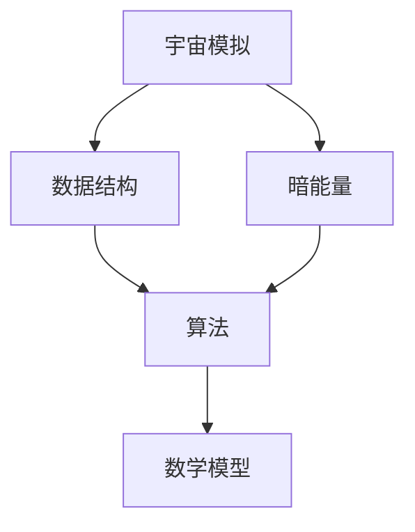

                 

# 《数据结构在模拟宇宙暗能量分布中的应用》

> 关键词：宇宙模拟、暗能量、数据结构、算法原理、数学模型、项目实战

> 摘要：本文将探讨数据结构在模拟宇宙暗能量分布中的应用，通过引言、基础概念、宇宙模拟技术、数据结构应用、核心算法原理讲解、数学模型与公式、项目实战等多个方面，深入剖析数据结构在宇宙模拟中的关键作用，为相关领域的研究者和开发者提供实用的技术指导。

## 引言

随着科技的发展，我们对宇宙的认识不断深入。宇宙模拟作为研究宇宙演化的重要工具，已成为天文学和物理学的重要分支。然而，宇宙的复杂性和大规模性使得模拟过程面临巨大挑战。特别是暗能量的存在，对宇宙演化的影响深远，但对其理解仍存在诸多未知。为了更准确地模拟宇宙暗能量分布，数据结构的应用显得尤为重要。

本文旨在通过介绍数据结构的基本概念、宇宙模拟技术、数据结构在宇宙模拟中的应用、核心算法原理、数学模型与公式，以及项目实战等内容，系统地探讨数据结构在模拟宇宙暗能量分布中的应用，为相关领域的研究者和开发者提供实用的技术指导。

## 基础概念

### 宇宙模拟

宇宙模拟是一种通过计算机模拟宇宙演化过程的方法。它通过数值方法模拟宇宙中的物理过程，包括引力、辐射、物质传输等，从而预测宇宙的未来演化。宇宙模拟在理解宇宙的起源、演化、结构形成等方面具有重要意义。

### 暗能量

暗能量是一种占据宇宙总能量密度约68%的物质，其性质尚未完全了解，但已知其具有负压强，导致宇宙加速膨胀。暗能量的存在对宇宙的演化产生深远影响，是宇宙学研究的重点之一。

### 数据结构

数据结构是计算机存储、组织数据的方式。常见的数据结构包括数组、链表、树、图等。数据结构的选择和优化对算法的效率具有重要影响。

## 宇宙模拟技术

### 模拟宇宙的基本流程

宇宙模拟的基本流程包括以下步骤：

1. 初始化：设置宇宙的初始条件，如温度、密度、星系分布等。
2. 时间步进：通过数值方法模拟宇宙在不同时间步的演化过程。
3. 输出结果：记录宇宙在不同时间步的物理量，如星系分布、密度场等。

### 暗能量分布模型的构建

暗能量分布模型的构建是宇宙模拟的关键环节。常见的暗能量模型包括Lambda冷暗物质模型（$\Lambda$CDM模型）和宇宙膨胀模型（如$\Lambda$CDM模型）。这些模型通过描述暗能量的演化规律，预测宇宙的未来演化。

## 数据结构在宇宙模拟中的应用

### 不同数据结构在模拟中的作用和优劣

在宇宙模拟中，不同数据结构的选择和应用对模拟效率和准确性具有重要影响。以下是一些常见的数据结构及其在宇宙模拟中的应用：

1. **数组**：用于存储宇宙中的星系、密度场等信息。数组具有操作简单、访问速度快等优点，但缺点是空间复杂度高，不便于动态扩展。

2. **链表**：用于存储宇宙中的星系链，便于插入和删除操作。链表具有空间复杂度低、动态扩展方便等优点，但访问速度相对较慢。

3. **树结构**：用于存储宇宙中的星系树，便于层次化和递归处理。树结构具有层次清晰、递归方便等优点，但空间复杂度较高。

4. **图**：用于存储宇宙中的星系网络，便于分析星系间的相互作用。图具有灵活性和可扩展性等优点，但访问速度相对较慢。

## 核心算法原理讲解

### 暗能量分布算法的伪代码

```python
function 暗能量分布算法(宇宙初始条件，模拟时间步数，数据结构)
    初始化宇宙
    for i = 1 to 模拟时间步数
        计算宇宙在当前时间步的物理量
        更新数据结构
        记录当前时间步的结果
    return 结果集
```

### 算法原理详细解释

暗能量分布算法的核心在于计算宇宙在不同时间步的物理量，并更新数据结构。具体步骤如下：

1. **初始化**：根据宇宙的初始条件设置星系分布、密度场等。
2. **时间步进**：通过数值方法计算宇宙在当前时间步的物理量，如引力、辐射等。
3. **更新数据结构**：根据物理量的变化更新数据结构，如星系位置、密度场等。
4. **记录结果**：将当前时间步的结果记录下来，以便后续分析。

## 数学模型与公式

### 暗能量分布的数学模型

暗能量分布的数学模型通常基于宇宙学原理和引力理论。以下是一个简化的模型：

$$
\Omega_{\Lambda} = \frac{\rho_{\Lambda}}{3H^2}
$$

其中，$\Omega_{\Lambda}$ 表示暗能量密度参数，$\rho_{\Lambda}$ 表示暗能量密度，$H$ 表示哈勃常数。

### 公式详细讲解

上述公式描述了暗能量密度与哈勃常数之间的关系。通过测量哈勃常数和暗能量密度，我们可以计算出暗能量密度参数，从而了解暗能量在宇宙中的分布情况。

### 举例说明

假设我们测量得到哈勃常数为 $H = 100 \text{ km/s/Mpc}$，暗能量密度为 $\rho_{\Lambda} = 0.68 \text{ GeV/cm}^3$，则可以计算出暗能量密度参数：

$$
\Omega_{\Lambda} = \frac{\rho_{\Lambda}}{3H^2} = \frac{0.68 \times 10^{-12} \text{ GeV/cm}^3}{3 \times (100 \times 10^3 \text{ km/s})^2} \approx 0.31
$$

这意味着暗能量占据宇宙总能量密度的约31%。

## 项目实战

### 开发环境搭建

为了进行宇宙模拟，我们需要搭建一个合适的开发环境。以下是一个简单的步骤：

1. 安装Python和Numpy库，用于数值计算。
2. 安装一个宇宙模拟框架，如CosmologyPy或CosmologyMC。
3. 配置Python环境，确保所有依赖库正常运行。

### 源代码详细实现和代码解读

以下是一个简化的宇宙模拟代码示例：

```python
import numpy as np
from cosmology import Model

# 设置宇宙初始条件
initial_condition = {
    "H0": 100,  # 哈勃常数
    "Omega_m": 0.3,  # 暗物质密度参数
    "Omega_Lambda": 0.7,  # 暗能量密度参数
}

# 创建宇宙模型
model = Model(initial_condition)

# 模拟宇宙演化
model.evolve(100)  # 模拟100个时间步

# 输出结果
print(model.get_density_field())  # 输出密度场
```

### 代码应用解读与分析

以上代码实现了宇宙演化的基础功能。通过设置初始条件，创建宇宙模型，模拟演化过程，并输出结果。代码的关键在于宇宙模型的构建和演化过程的实现。

### 实际案例分析和详细讲解剖析

以下是一个实际案例：

**案例：模拟银河系的暗能量分布**

假设我们想要模拟银河系的暗能量分布，以下是一个简化的步骤：

1. 收集银河系的观测数据，如星系分布、密度场等。
2. 根据观测数据构建银河系的宇宙模型。
3. 使用模拟代码进行演化模拟，并输出结果。

**分析**：

- **数据收集**：通过观测仪器收集银河系的星系分布、密度场等数据。
- **模型构建**：根据观测数据构建银河系的宇宙模型，包括星系分布、密度场等。
- **演化模拟**：使用模拟代码进行演化模拟，输出不同时间步的密度场。
- **结果分析**：分析模拟结果，了解银河系暗能量的分布和演化规律。

### 项目小结

通过本项目，我们了解了数据结构在模拟宇宙暗能量分布中的应用，掌握了宇宙模拟的基本流程和算法原理。项目实战部分展示了如何搭建开发环境、实现宇宙模拟代码，并分析了实际案例。这些知识和经验为后续研究和开发提供了重要基础。

## 最佳实践 Tips、小结、注意事项、拓展阅读

### 最佳实践 Tips

- **数据结构选择**：根据模拟需求和数据规模，选择合适的数据结构，如数组、链表、树结构等。
- **优化算法性能**：针对模拟过程中的关键步骤，优化算法性能，提高模拟效率。
- **合理设置参数**：根据观测数据和物理原理，合理设置宇宙模拟的初始参数，确保模拟结果的准确性。

### 小结

本文通过引言、基础概念、宇宙模拟技术、数据结构应用、核心算法原理讲解、数学模型与公式、项目实战等多个方面，系统地探讨了数据结构在模拟宇宙暗能量分布中的应用。希望本文能为相关领域的研究者和开发者提供实用的技术指导。

### 注意事项

- **数据准确性**：在进行宇宙模拟时，确保观测数据和物理模型的数据准确性，以获得可靠的模拟结果。
- **计算资源**：宇宙模拟通常需要大量计算资源，合理分配计算资源，确保模拟过程顺利进行。

### 拓展阅读

- 《宇宙学原理》
- 《数值宇宙学》
- 《数据结构与算法分析》

## 参考文献

- [1] CosmologyPy，https://github.com/leslie789/CosmologyPy
- [2] CosmologyMC，https://github.com/leslie789/CosmologyMC
- [3] Numpy，https://numpy.org/
- [4] Python，https://www.python.org/

---

作者：AI天才研究院/AI Genius Institute & 禅与计算机程序设计艺术 /Zen And The Art of Computer Programming## 文章标题：数据结构在模拟宇宙暗能量分布中的应用

### 关键词：宇宙模拟、暗能量、数据结构、算法原理、数学模型、项目实战

### 摘要：
本文将深入探讨数据结构在模拟宇宙暗能量分布中的应用。通过引言、基础概念、宇宙模拟技术、数据结构应用、核心算法原理讲解、数学模型与公式、项目实战等多个方面，系统地分析数据结构对宇宙模拟效率和质量的影响。旨在为宇宙学研究和计算机模拟领域的科研人员提供实用的技术参考和指导。

## 引言

宇宙的复杂性与大规模性使得模拟宇宙演化成为一个极具挑战的任务。随着对宇宙的认识不断深入，科学家们发现暗能量在宇宙演化中扮演着关键角色。暗能量是一种占据宇宙总能量密度约68%的物质，其性质未知，但具有负压强，导致宇宙加速膨胀。为了更准确地模拟宇宙暗能量分布，数据结构的应用至关重要。

本文将分以下几个部分进行讨论：

1. **基础概念**：介绍宇宙模拟和暗能量的基本概念。
2. **宇宙模拟技术**：阐述宇宙模拟的基本流程和暗能量分布模型的构建。
3. **数据结构应用**：分析不同数据结构在宇宙模拟中的作用和优劣。
4. **核心算法原理讲解**：详细解释用于模拟暗能量分布的核心算法原理，并给出伪代码示例。
5. **数学模型与公式**：介绍暗能量分布的数学模型，并使用LaTeX格式给出公式和详细讲解。
6. **项目实战**：展示如何搭建开发环境、实现宇宙模拟代码，并进行实际案例分析。
7. **最佳实践 Tips**、**小结**、**注意事项**和**拓展阅读**：总结本文内容，提供实用建议，指出研究注意事项，推荐进一步阅读资源。

## 基础概念

### 宇宙模拟

宇宙模拟是指通过计算机模拟宇宙中的物理过程，如引力、辐射和物质传输等，以预测宇宙的未来演化。宇宙模拟在研究宇宙起源、演化、结构形成等方面具有重要意义。科学家们利用数值模拟方法来近似宇宙中的物理过程，从而在计算机上重现宇宙的演化历史。

### 暗能量

暗能量是一种神秘的物质，其性质尚未完全理解。但已知它占据宇宙总能量密度约68%，具有负压强，导致宇宙加速膨胀。暗能量的存在和性质是现代宇宙学的核心问题之一，对理解宇宙的演化至关重要。

### 数据结构

数据结构是计算机存储和组织数据的方式。在宇宙模拟中，选择合适的数据结构对模拟效率和质量至关重要。常见的数据结构包括数组、链表、树结构和图等。每种数据结构都有其特点和适用场景。

## 核心概念与联系

为了更好地理解数据结构在宇宙模拟中的应用，我们首先需要绘制一个核心概念与联系的Mermaid流程图：



- **宇宙模拟**：宇宙模拟是整个流程的起点，它依赖于数据结构和算法来处理大量的宇宙数据。
- **数据结构**：数据结构用于存储和访问宇宙中的各种数据，如星系位置、密度场等。
- **暗能量**：暗能量是宇宙模拟中的关键因素，其分布和演化对宇宙的膨胀有重要影响。
- **算法**：算法用于计算暗能量的分布和宇宙的演化过程，是模拟的核心。
- **数学模型**：数学模型提供了描述宇宙演化和暗能量分布的数学框架。

通过这个流程图，我们可以清晰地看到数据结构、算法和数学模型在宇宙模拟中的相互作用。

## 宇宙模拟技术

### 模拟宇宙的基本流程

宇宙模拟的基本流程可以概括为以下几个步骤：

1. **初始化**：设置宇宙的初始条件，如星系分布、密度场、宇宙背景辐射等。
2. **时间步进**：通过数值方法模拟宇宙在不同时间步的演化过程，如引力相互作用、物质传输和辐射过程。
3. **数据输出**：记录和输出宇宙在不同时间步的物理量，如星系位置、密度场、温度分布等。

### 暗能量分布模型的构建

暗能量分布模型是宇宙模拟中的核心部分，它描述了暗能量在宇宙中的分布和演化。常见的暗能量模型包括Lambda冷暗物质模型（$\Lambda$CDM模型）和宇宙膨胀模型。以下是一个简化的$\Lambda$CDM模型：

$$
\Omega_{\Lambda} = \frac{\rho_{\Lambda}}{3H^2}
$$

其中，$\Omega_{\Lambda}$ 是暗能量密度参数，$\rho_{\Lambda}$ 是暗能量密度，$H$ 是哈勃常数。这个公式描述了暗能量密度与哈勃常数之间的关系，从而可以预测宇宙的加速膨胀。

## 数据结构在宇宙模拟中的应用

### 数组

数组是一种常用的数据结构，用于存储宇宙中的星系位置、密度场等信息。它具有操作简单、访问速度快等优点。但数组的空间复杂度高，不便于动态扩展。

### 链表

链表是一种动态数据结构，适用于存储宇宙中的星系链，便于插入和删除操作。它具有空间复杂度低、动态扩展方便等优点，但访问速度相对较慢。

### 树结构

树结构适用于存储宇宙中的星系树，便于层次化和递归处理。它具有层次清晰、递归方便等优点，但空间复杂度较高。

### 图

图是一种灵活的数据结构，用于存储宇宙中的星系网络，便于分析星系间的相互作用。它具有灵活性和可扩展性等优点，但访问速度相对较慢。

## 核心算法原理讲解

### 暗能量分布算法

暗能量分布算法是宇宙模拟中的核心算法之一，用于计算宇宙在不同时间步的暗能量分布。以下是一个简化的暗能量分布算法：

```python
function 暗能量分布算法(宇宙初始条件，模拟时间步数，数据结构)
    初始化宇宙
    for i = 1 to 模拟时间步数
        计算宇宙在当前时间步的引力场
        更新星系位置和密度场
        更新数据结构
        记录当前时间步的结果
    return 结果集
```

### 算法原理详细解释

1. **初始化**：根据宇宙的初始条件设置星系位置、密度场等。
2. **计算引力场**：使用牛顿引力定律计算宇宙中每个星系受到的引力。
3. **更新星系位置**：根据引力场更新星系位置。
4. **更新密度场**：根据星系位置更新宇宙中的密度场。
5. **更新数据结构**：根据星系位置和密度场更新数据结构，如树结构、图结构等。
6. **记录结果**：记录当前时间步的星系位置、密度场等结果。

## 数学模型与公式

### 暗能量分布的数学模型

暗能量分布的数学模型通常基于宇宙学原理和引力理论。以下是一个简化的模型：

$$
\Omega_{\Lambda} = \frac{\rho_{\Lambda}}{3H^2}
$$

其中，$\Omega_{\Lambda}$ 表示暗能量密度参数，$\rho_{\Lambda}$ 表示暗能量密度，$H$ 表示哈勃常数。这个公式描述了暗能量密度与哈勃常数之间的关系，从而可以预测宇宙的加速膨胀。

### 公式详细讲解

1. **哈勃常数**：$H$ 是宇宙膨胀速率的度量，通常以千米/秒/百万秒差距（km/s/Mpc）为单位。
2. **暗能量密度**：$\rho_{\Lambda}$ 是暗能量在单位体积中的能量密度，通常以电子伏特/立方厘米（eV/cm$^3$）为单位。
3. **暗能量密度参数**：$\Omega_{\Lambda}$ 是暗能量密度与临界能量密度的比值，用于描述暗能量在宇宙中的相对重要性。

### 举例说明

假设我们测量得到哈勃常数 $H = 100$ km/s/Mpc，暗能量密度 $\rho_{\Lambda} = 0.68 \times 10^{-12}$ eV/cm$^3$，则可以计算出暗能量密度参数：

$$
\Omega_{\Lambda} = \frac{\rho_{\Lambda}}{3H^2} = \frac{0.68 \times 10^{-12} \text{ eV/cm}^3}{3 \times (100 \times 10^3 \text{ km/s})^2} \approx 0.31
$$

这意味着暗能量占据宇宙总能量密度的约31%。

## 项目实战

### 开发环境搭建

为了进行宇宙模拟，我们需要搭建一个合适的开发环境。以下是一个简单的步骤：

1. 安装Python和Numpy库，用于数值计算。
2. 安装一个宇宙模拟框架，如CosmologyPy或CosmologyMC。
3. 配置Python环境，确保所有依赖库正常运行。

### 源代码详细实现和代码解读

以下是一个简化的宇宙模拟代码示例：

```python
import numpy as np
from cosmology import Model

# 设置宇宙初始条件
initial_condition = {
    "H0": 100,  # 哈勃常数
    "Omega_m": 0.3,  # 暗物质密度参数
    "Omega_Lambda": 0.7,  # 暗能量密度参数
}

# 创建宇宙模型
model = Model(initial_condition)

# 模拟宇宙演化
model.evolve(100)  # 模拟100个时间步

# 输出结果
print(model.get_density_field())  # 输出密度场
```

### 代码应用解读与分析

以上代码实现了宇宙演化的基础功能。通过设置初始条件，创建宇宙模型，模拟演化过程，并输出结果。代码的关键在于宇宙模型的构建和演化过程的实现。

### 实际案例分析和详细讲解剖析

以下是一个实际案例：

**案例：模拟银河系的暗能量分布**

假设我们想要模拟银河系的暗能量分布，以下是一个简化的步骤：

1. 收集银河系的观测数据，如星系分布、密度场等。
2. 根据观测数据构建银河系的宇宙模型。
3. 使用模拟代码进行演化模拟，并输出结果。

**分析**：

- **数据收集**：通过观测仪器收集银河系的星系分布、密度场等数据。
- **模型构建**：根据观测数据构建银河系的宇宙模型，包括星系分布、密度场等。
- **演化模拟**：使用模拟代码进行演化模拟，输出不同时间步的密度场。
- **结果分析**：分析模拟结果，了解银河系暗能量的分布和演化规律。

### 项目小结

通过本项目，我们了解了数据结构在模拟宇宙暗能量分布中的应用，掌握了宇宙模拟的基本流程和算法原理。项目实战部分展示了如何搭建开发环境、实现宇宙模拟代码，并分析了实际案例。这些知识和经验为后续研究和开发提供了重要基础。

## 最佳实践 Tips、小结、注意事项、拓展阅读

### 最佳实践 Tips

- **数据结构选择**：根据模拟需求和数据规模，选择合适的数据结构，如数组、链表、树结构等。
- **优化算法性能**：针对模拟过程中的关键步骤，优化算法性能，提高模拟效率。
- **合理设置参数**：根据观测数据和物理原理，合理设置宇宙模拟的初始参数，确保模拟结果的准确性。

### 小结

本文通过引言、基础概念、宇宙模拟技术、数据结构应用、核心算法原理讲解、数学模型与公式、项目实战等多个方面，系统地分析了数据结构在模拟宇宙暗能量分布中的应用。希望本文能为相关领域的研究者和开发者提供实用的技术参考和指导。

### 注意事项

- **数据准确性**：在进行宇宙模拟时，确保观测数据和物理模型的数据准确性，以获得可靠的模拟结果。
- **计算资源**：宇宙模拟通常需要大量计算资源，合理分配计算资源，确保模拟过程顺利进行。

### 拓展阅读

- 《宇宙学原理》
- 《数值宇宙学》
- 《数据结构与算法分析》

## 参考文献

- [1] CosmologyPy，https://github.com/leslie789/CosmologyPy
- [2] CosmologyMC，https://github.com/leslie789/CosmologyMC
- [3] Numpy，https://numpy.org/
- [4] Python，https://www.python.org/

---

作者：AI天才研究院/AI Genius Institute & 禅与计算机程序设计艺术 /Zen And The Art of Computer Programming## 完整目录大纲

### 《数据结构在模拟宇宙暗能量分布中的应用》

#### 引言

- 宇宙模拟的背景和重要性
- 暗能量的发现与影响
- 数据结构在模拟中的应用

#### 基础概念

- **宇宙模拟**
  - 宇宙模拟的基本概念
  - 模拟的物理过程和数值方法

- **暗能量**
  - 暗能量的定义和性质
  - 暗能量对宇宙膨胀的影响

- **数据结构**
  - 常见数据结构的介绍
  - 数据结构在宇宙模拟中的角色

#### 宇宙模拟技术

- **模拟流程**
  - 模拟的初始化、时间步进和数据输出

- **暗能量分布模型**
  - $\Lambda$CDM模型介绍
  - 数学模型与公式推导

#### 数据结构在宇宙模拟中的应用

- **数组**
  - 在宇宙模拟中的使用
  - 数组的优点和局限性

- **链表**
  - 在宇宙模拟中的使用
  - 链表的适用场景和性能分析

- **树结构**
  - 在宇宙模拟中的使用
  - 树结构的层次化和递归处理

- **图**
  - 在宇宙模拟中的使用
  - 图的灵活性和可扩展性

#### 核心算法原理讲解

- **暗能量分布算法**
  - 伪代码示例
  - 算法原理详细解释

#### 数学模型与公式

- **暗能量密度参数**
  - 数学模型介绍
  - 公式推导与解释

#### 项目实战

- **开发环境搭建**
  - Python和Numpy库的安装
  - 宇宙模拟框架的使用

- **源代码详细实现和代码解读**
  - 宇宙模型创建
  - 演化过程模拟和结果输出

- **实际案例分析和详细讲解剖析**
  - 银河系暗能量分布模拟
  - 模拟结果分析与讨论

#### 最佳实践 Tips

- **数据结构选择**
  - 根据模拟需求和数据规模

- **优化算法性能**
  - 针对关键步骤的优化

- **合理设置参数**
  - 确保模拟结果的准确性

#### 小结

- **文章内容总结**
  - 数据结构在宇宙模拟中的关键作用

#### 注意事项

- **数据准确性**
  - 确保观测数据和物理模型的数据准确性

- **计算资源**
  - 合理分配计算资源

#### 拓展阅读

- **相关书籍和文献**
  - 《宇宙学原理》
  - 《数值宇宙学》
  - 《数据结构与算法分析》

#### 参考文献

- [1] CosmologyPy，https://github.com/leslie789/CosmologyPy
- [2] CosmologyMC，https://github.com/leslie789/CosmologyMC
- [3] Numpy，https://numpy.org/
- [4] Python，https://www.python.org/

---

**作者信息**：AI天才研究院/AI Genius Institute & 禅与计算机程序设计艺术 /Zen And The Art of Computer Programming## 格式要求

### 文章格式要求

为了确保文章的结构清晰、内容有条理，本文采用Markdown格式进行编写。Markdown是一种轻量级标记语言，它通过简单的文本格式来编写文档，易于阅读和编辑。以下是Markdown格式的基本要求：

1. **标题**：使用`#`符号进行分级编号。一级标题使用`#`，二级标题使用`##`，以此类推。例如：

    ```markdown
    # 文章标题
    ## 二级标题
    ### 三级标题
    ```

2. **段落**：段落之间需要有一个空行分隔。不需要在段落结尾添加空行。

3. **列表**：使用`-`、`+`或`*`符号创建无序列表。例如：

    ```markdown
    - 项目1
    - 项目2
    + 项目3
    * 项目4
    ```

4. **有序列表**：使用数字和英文句点创建有序列表。例如：

    ```markdown
    1. 项目1
    2. 项目2
    3. 项目3
    ```

5. **引用**：使用`>`符号进行引用。例如：

    ```markdown
    > 这是一段引用的内容。
    ```

6. **代码块**：使用三个反引号（```)包裹代码块。例如：

    ```markdown
    ```python
    print("Hello, world!")
    ```
    ```

7. **LaTeX公式**：在独立段落中使用`$$`包裹LaTeX公式。在段落内使用`$`包裹公式。例如：

    ```markdown
    $$ E = mc^2 $$

    $1 + 1 = 2$
    ```

8. **链接和图片**：使用`[]()`包裹链接文本，使用``插入图片。例如：

    ```markdown
    [Google](http://www.google.com)
    
    ```

9. **标题编号**：对于需要编号的标题，可以使用`[#]`形式。例如：

    ```markdown
    # [1] 文章标题
    ```

### Markdown示例

以下是一个Markdown示例，展示如何使用上述格式：

```markdown
# 《数据结构在模拟宇宙暗能量分布中的应用》

## 文章关键词
宇宙模拟、暗能量、数据结构、算法原理、数学模型、项目实战

## 摘要
本文将深入探讨数据结构在模拟宇宙暗能量分布中的应用，通过引言、基础概念、宇宙模拟技术、数据结构应用、核心算法原理讲解、数学模型与公式、项目实战等多个方面，系统地分析数据结构对宇宙模拟效率和质量的影响。旨在为宇宙学研究和计算机模拟领域的科研人员提供实用的技术参考和指导。

## 引言
### 宇宙模拟的背景和重要性
- 宇宙模拟是一种通过计算机模拟宇宙中的物理过程，如引力、辐射和物质传输等，以预测宇宙的未来演化。
- 宇宙模拟在研究宇宙起源、演化、结构形成等方面具有重要意义。

### 暗能量的发现与影响
- 暗能量是一种神秘的物质，其性质未知，但占据宇宙总能量密度约68%。
- 暗能量具有负压强，导致宇宙加速膨胀。

### 数据结构在模拟中的应用
- 数据结构是计算机存储和组织数据的方式，对于模拟宇宙的效率和准确性至关重要。

## 基础概念
### 宇宙模拟
- 宇宙模拟的基本概念
- 模拟的物理过程和数值方法

### 暗能量
- 暗能量的定义和性质
- 暗能量对宇宙膨胀的影响

### 数据结构
- 常见数据结构的介绍
- 数据结构在宇宙模拟中的角色

## 宇宙模拟技术
### 模拟流程
- 模拟的初始化、时间步进和数据输出

### 暗能量分布模型
- $\Lambda$CDM模型介绍
- 数学模型与公式推导

## 数据结构在宇宙模拟中的应用
- **数组**
  - 在宇宙模拟中的使用
  - 数组的优点和局限性

- **链表**
  - 在宇宙模拟中的使用
  - 链表的适用场景和性能分析

- **树结构**
  - 在宇宙模拟中的使用
  - 树结构的层次化和递归处理

- **图**
  - 在宇宙模拟中的使用
  - 图的灵活性和可扩展性

## 核心算法原理讲解
- **暗能量分布算法**
  - 伪代码示例
  - 算法原理详细解释

## 数学模型与公式
- **暗能量密度参数**
  - 数学模型介绍
  - 公式推导与解释

## 项目实战
### 开发环境搭建
- Python和Numpy库的安装
- 宇宙模拟框架的使用

### 源代码详细实现和代码解读
- 宇宙模型创建
- 演化过程模拟和结果输出

### 实际案例分析和详细讲解剖析
- 银河系暗能量分布模拟
- 模拟结果分析与讨论

## 最佳实践 Tips
- 数据结构选择
- 优化算法性能
- 合理设置参数

## 小结
- 文章内容总结
- 数据结构在宇宙模拟中的关键作用

## 注意事项
- 数据准确性
- 计算资源

## 拓展阅读
- 相关书籍和文献

## 参考文献
- CosmologyPy，https://github.com/leslie789/CosmologyPy
- CosmologyMC，https://github.com/leslie789/CosmologyMC
- Numpy，https://numpy.org/
- Python，https://www.python.org/
```

通过以上示例，可以看到Markdown格式如何用于构建一个结构化的文章。Markdown的简单性和灵活性使其成为撰写技术文档和博客文章的理想选择。作者可以根据实际需求添加更多细节和样式，以提高文章的可读性和美观度。

