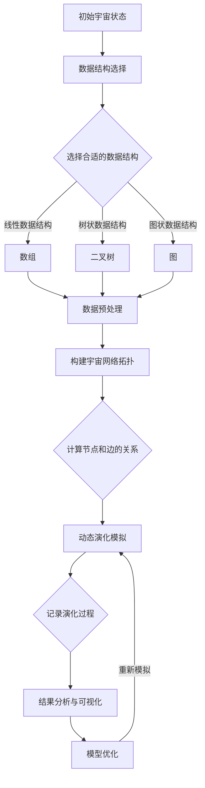

                 

### 引言

在当今科技迅猛发展的时代，宇宙学和计算机科学领域正在经历着前所未有的交叉融合。宇宙暗能量网络拓扑动态演化作为一个极其复杂的现象，吸引了众多科学家的关注。而数据结构，作为计算机科学中的基石，在此过程中发挥着至关重要的作用。因此，探讨《数据结构在模拟宇宙暗能量网络拓扑动态演化中的应用》这一主题，具有重要的理论和实践意义。

首先，宇宙暗能量网络拓扑动态演化是指宇宙中暗能量分布和相互作用方式的演变过程。这一过程不仅涉及宇宙的膨胀和加速，还涵盖了宇宙结构的形成和演化。传统的宇宙学模型往往难以全面解释这些现象，因此需要借助新的数学工具和计算机模拟方法。

其次，数据结构是计算机科学中的核心概念，用于组织和存储数据，提高算法效率和问题解决能力。数据结构不仅包括传统的数组、链表、树等结构，还包括更高级的图、哈希表等。在现代科学计算中，数据结构的应用范围不断扩大，尤其是在复杂系统的建模和模拟中，发挥着关键作用。

本文旨在通过详细的章节划分和逻辑分析，探讨数据结构在模拟宇宙暗能量网络拓扑动态演化中的应用。我们将从基础概念、核心算法、数学模型、项目实战等方面逐步展开，以期提供一个系统、全面的解决方案。

文章的总体结构安排如下：

- **第1章 引言**：介绍宇宙暗能量网络拓扑动态演化的背景和重要性，以及数据结构的基础概念。
- **第2章 数据结构基础**：详细讨论数据结构的基本概念，包括线性数据结构和树状数据结构。
- **第3章 宇宙暗能量网络拓扑**：阐述宇宙暗能量网络拓扑的基本概念和特性。
- **第4章 数据结构与算法应用**：讲解数据结构在模拟中的应用，并使用伪代码详细描述核心算法。
- **第5章 数学模型与公式**：介绍数学模型和公式的详细讲解与举例说明。
- **第6章 项目实战**：通过实际项目展示数据结构在模拟中的具体应用。
- **第7章 总结与展望**：总结全文内容，并提出未来研究方向和挑战。

### 文章关键词

- 宇宙暗能量
- 数据结构
- 拓扑动态演化
- 算法
- 数学模型
- 模拟

### 摘要

本文系统探讨了数据结构在模拟宇宙暗能量网络拓扑动态演化中的应用。首先，介绍了宇宙暗能量网络拓扑动态演化的背景和重要性，以及数据结构的基本概念。随后，详细分析了数据结构在模拟中的应用，包括线性数据结构和树状数据结构。接着，讨论了宇宙暗能量网络拓扑的基本概念和特性，并讲解了如何使用数据结构模拟其动态演化。最后，通过数学模型和公式的详细讲解以及实际项目实战，展示了数据结构在模拟宇宙暗能量网络拓扑动态演化中的有效性和重要性。本文为相关领域的研究者提供了有价值的参考和思路。

### 第1章 引言

#### 1.1 书籍背景介绍

在探讨《数据结构在模拟宇宙暗能量网络拓扑动态演化中的应用》这一主题之前，我们首先需要了解宇宙暗能量网络拓扑动态演化的基本概念和背景。宇宙中的物质和能量分布极其复杂，而暗能量是其中一种未知的能量形式，其存在和作用引起了科学界的广泛关注。暗能量被认为是驱动宇宙加速膨胀的主要力量，其分布和相互作用方式决定了宇宙的结构和演化。

宇宙暗能量网络拓扑动态演化研究，旨在揭示暗能量在宇宙尺度上的分布规律和演化过程。通过模拟这一过程，科学家们希望能够更深入地理解宇宙的膨胀、宇宙结构的形成和演化，以及暗能量的本质。然而，由于宇宙暗能量网络拓扑动态演化的复杂性，传统的宇宙学模型难以提供完整的解释，因此需要引入新的数学工具和计算方法。

#### 1.2 数据结构的基本概念

数据结构是计算机科学中用于组织和管理数据的一种方式，其重要性不言而喻。数据结构不仅决定了数据存储和访问的效率，还直接影响算法的性能和复杂度。在模拟宇宙暗能量网络拓扑动态演化过程中，选择合适的数据结构对于提高模拟的准确性和效率至关重要。

数据结构可以分为线性数据结构和树状数据结构。线性数据结构包括数组、链表、栈和队列等，它们主要用于处理线性数据集合。树状数据结构包括二叉树、二叉搜索树、堆和图等，用于处理具有层次关系和复杂关系的数据集合。

线性数据结构的特点是元素之间存在一对一的关系，例如，数组可以看作是元素的线性排列，链表通过指针链接元素。栈和队列则是特殊的线性数据结构，分别用于处理后进先出（LIFO）和先进先出（FIFO）的数据访问模式。

树状数据结构具有层次关系，其中每个节点可以有多个子节点。二叉树是一种常见的树状数据结构，其每个节点最多有两个子节点。二叉搜索树是二叉树的一种特殊形式，节点按照某种顺序排列，便于快速查找和插入操作。堆是一种特殊的树状数据结构，用于实现优先队列。图则是一种更复杂的结构，节点之间存在多对多的关系，用于表示复杂的网络和关系。

#### 1.3 宇宙暗能量网络拓扑动态演化概述

宇宙暗能量网络拓扑动态演化是指宇宙中暗能量分布和相互作用方式的演变过程。这一过程不仅涉及宇宙的膨胀和加速，还涵盖了宇宙结构的形成和演化。传统的宇宙学模型如弗里德曼-勒梅特-罗伯逊-沃尔克（FLRW）度规和广义相对论，虽然在一定程度上描述了宇宙的膨胀，但难以解释宇宙加速膨胀的现象。为了解决这个问题，科学家们提出了多种暗能量模型，如宇宙常数模型、幻影能量模型和标量场模型等。

在这些模型中，宇宙暗能量被视为一种均匀分布的能量形式，其相互作用和演化决定了宇宙的结构和演化。通过模拟这些模型，科学家们可以研究暗能量对宇宙膨胀的影响，以及宇宙结构的形成和演化过程。

宇宙暗能量网络拓扑动态演化的研究涉及多个学科领域，包括宇宙学、数学和计算机科学。宇宙学提供了宇宙演化的基本理论和观测数据，数学提供了描述暗能量演化的数学模型和公式，计算机科学提供了高效的数据结构和算法，用于模拟和计算宇宙暗能量的分布和演化过程。

#### 1.4 书籍结构安排与目标

《数据结构在模拟宇宙暗能量网络拓扑动态演化中的应用》这本书旨在通过详细的章节划分和逻辑分析，探讨数据结构在模拟宇宙暗能量网络拓扑动态演化中的应用。全书分为七个章节，每个章节都有明确的目标和内容安排。

**第1章 引言**：介绍宇宙暗能量网络拓扑动态演化的背景和重要性，以及数据结构的基本概念。

**第2章 数据结构基础**：详细讨论数据结构的基本概念，包括线性数据结构和树状数据结构。

**第3章 宇宙暗能量网络拓扑**：阐述宇宙暗能量网络拓扑的基本概念和特性。

**第4章 数据结构与算法应用**：讲解数据结构在模拟中的应用，并使用伪代码详细描述核心算法。

**第5章 数学模型与公式**：介绍数学模型和公式的详细讲解与举例说明。

**第6章 项目实战**：通过实际项目展示数据结构在模拟中的具体应用。

**第7章 总结与展望**：总结全文内容，并提出未来研究方向和挑战。

通过这些章节的详细讲解和逻辑分析，本书旨在为读者提供一个全面、系统的理解，帮助他们在实践中应用数据结构来模拟宇宙暗能量网络拓扑动态演化。

### Mermaid流程图：数据结构在模拟宇宙暗能量网络拓扑动态演化中的应用架构

为了更直观地展示数据结构在模拟宇宙暗能量网络拓扑动态演化中的应用，我们使用Mermaid语言绘制了以下流程图。该流程图详细描述了数据结构如何被应用于宇宙暗能量网络的建模和模拟过程。



**流程图解析：**

1. **初始宇宙状态**：首先，我们从一个初始的宇宙状态开始，这个状态可能包含一些基本的宇宙参数，如宇宙大小、暗能量密度等。

2. **数据结构选择**：根据模拟需求，我们需要选择合适的数据结构。这里包括线性数据结构（如数组）、树状数据结构（如二叉树）和图状数据结构（如图）。

3. **选择合适的数据结构**：在选择数据结构时，我们需要根据宇宙网络拓扑的特点和需求，决定使用哪种数据结构。例如，如果宇宙网络拓扑较为简单，可以使用数组进行数据存储；如果存在复杂的层次关系，可以使用树状数据结构；如果网络拓扑包含复杂的节点和边关系，可以使用图状数据结构。

4. **数据预处理**：在选择好数据结构后，我们需要对宇宙数据进行预处理，包括数据清洗、数据转换和数据格式化等操作，以确保数据能够被数据结构有效存储和利用。

5. **构建宇宙网络拓扑**：通过数据预处理，我们可以构建出宇宙网络拓扑。这一过程涉及到计算节点和边的关系，确定节点之间的连接方式。

6. **动态演化模拟**：在构建好宇宙网络拓扑后，我们可以开始进行动态演化模拟。这个过程涉及到计算宇宙中每个节点的演化路径，并记录其演化过程。

7. **结果分析与可视化**：模拟完成后，我们需要对结果进行分析，并通过可视化工具展示宇宙暗能量网络拓扑动态演化的过程和结果。

8. **模型优化**：根据模拟结果和分析，我们可以对模型进行优化，以提高模拟的准确性和效率。优化过程可能包括改进数据结构、调整算法参数等。

9. **重新模拟**：在模型优化后，我们可以重新进行模拟，以验证优化效果。

通过这个Mermaid流程图，我们能够清晰地看到数据结构在模拟宇宙暗能量网络拓扑动态演化中的应用架构。每个步骤都紧密相连，共同构成了一个完整的模拟流程。

### 第2章 数据结构基础

数据结构是计算机科学中的核心概念，用于组织和管理数据，提高算法效率和问题解决能力。在本章中，我们将详细讨论数据结构的基本概念，包括线性数据结构和树状数据结构。这些数据结构不仅在计算机科学中广泛应用，也在宇宙暗能量网络拓扑动态演化的模拟中发挥着重要作用。

#### 线性数据结构

线性数据结构是数据结构中最基本的形式之一，其特点是以线性方式存储数据元素。线性数据结构包括数组、链表、栈和队列等。

1. **数组**：数组是一种线性表，其中数据元素按照一定的顺序排列，可以通过索引直接访问。数组的主要优点是访问速度快，适合处理静态数据。在模拟宇宙暗能量网络拓扑动态演化中，数组可以用于存储宇宙中的节点信息，如节点位置、节点属性等。

2. **链表**：链表是由一系列节点组成的线性结构，每个节点包含数据域和指针域。链表的主要优点是插入和删除操作灵活，适合处理动态数据。在模拟过程中，链表可以用于动态更新宇宙网络拓扑，如在节点之间建立新的连接或断开已有连接。

3. **栈**：栈是一种后进先出（LIFO）的线性结构，只能在表的一端进行插入和删除操作。栈在模拟宇宙暗能量网络拓扑动态演化中可以用于处理事件顺序，如记录节点之间的交互过程。

4. **队列**：队列是一种先进先出（FIFO）的线性结构，同样只能在表的一端进行插入和删除操作。队列在模拟过程中可以用于处理节点的排队行为，如等待与其他节点建立连接。

#### 树状数据结构

树状数据结构是另一种重要的数据结构，其特点是以树形结构存储数据元素。树状数据结构包括二叉树、二叉搜索树、堆和图等。

1. **二叉树**：二叉树是每个节点最多有两个子节点的树形结构。二叉树的主要优点是层次关系清晰，适合表示具有层次结构的数据。在模拟宇宙暗能量网络拓扑动态演化中，二叉树可以用于表示宇宙中的层次结构，如星系、星团等。

2. **二叉搜索树**：二叉搜索树是一种特殊的二叉树，其中每个节点的左子树中的所有节点的值均小于该节点的值，右子树中的所有节点的值均大于该节点的值。二叉搜索树的主要优点是查找、插入和删除操作的时间复杂度较低，适合处理动态数据。在模拟过程中，二叉搜索树可以用于高效查找宇宙中的特定节点，如寻找距离最近的节点。

3. **堆**：堆是一种特殊的树形结构，主要用于实现优先队列。堆分为最大堆和最小堆，其中最大堆的根节点的值大于或等于所有子节点的值，最小堆的根节点的值小于或等于所有子节点的值。堆在模拟宇宙暗能量网络拓扑动态演化中可以用于处理优先级事件，如处理优先级最高的节点交互。

4. **图**：图是一种由节点（称为顶点）和边组成的结构，可以表示复杂的网络关系。图的主要优点是节点之间存在多对多的关系，适合处理复杂的网络结构。在模拟宇宙暗能量网络拓扑动态演化中，图可以用于表示宇宙中复杂的相互作用关系，如星系之间的引力作用。

通过以上对线性数据结构和树状数据结构的讨论，我们可以看到这些数据结构在模拟宇宙暗能量网络拓扑动态演化中的应用潜力。接下来，我们将进一步探讨宇宙暗能量网络拓扑的基本概念和特性。

### 第3章 宇宙暗能量网络拓扑

宇宙暗能量网络拓扑是指宇宙中暗能量分布和相互作用的网络结构。这一结构不仅反映了宇宙的膨胀和加速，还揭示了宇宙结构的形成和演化过程。为了更好地理解宇宙暗能量网络拓扑，我们需要从基本概念和特性入手，详细探讨其核心概念和动态演化机制。

#### 基本概念

1. **节点**：节点表示宇宙中的物质或能量点，可以是星系、星团或其他物质聚集体。每个节点都具有一定的物理属性，如质量、速度和位置等。

2. **边**：边表示节点之间的相互作用关系，可以是引力、电磁力或其他类型的相互作用。边的权重可以表示相互作用强度，如引力强度或电磁力强度。

3. **网络**：网络是由节点和边组成的结构，用于表示宇宙中暗能量的分布和相互作用。网络可以看作是一个图，其中节点代表宇宙中的物质点，边代表它们之间的相互作用。

4. **拓扑**：拓扑是指网络的结构和连接方式，描述了宇宙中暗能量分布和相互作用的模式。拓扑可以是静态的，也可以是动态的，反映宇宙在不同时间尺度的演化过程。

#### 性质

1. **全局性**：宇宙暗能量网络拓扑具有全局性，即宇宙中的所有节点和边都参与其中，形成一个统一的网络结构。这一性质使得宇宙暗能量网络拓扑成为研究宇宙整体结构和演化的重要工具。

2. **层次性**：宇宙暗能量网络拓扑具有层次性，不同层次的网络结构反映了宇宙不同尺度上的结构和演化过程。例如，局部网络结构可能反映星系和星团的形成和演化，而整体网络结构则反映了宇宙的膨胀和加速。

3. **动态性**：宇宙暗能量网络拓扑是动态演化的，宇宙中节点的位置、速度和相互作用关系都会随时间发生变化。这种动态性使得宇宙暗能量网络拓扑成为研究宇宙演化过程的重要工具。

#### 动态演化机制

1. **引力相互作用**：引力是宇宙中最重要的相互作用之一，它决定了节点之间的位置和运动。根据牛顿万有引力定律，节点之间的引力与它们的质量和距离成反比。引力相互作用会导致节点相互吸引，形成复杂的网络结构。

2. **宇宙膨胀**：宇宙膨胀是宇宙暗能量网络拓扑动态演化的重要驱动力。随着宇宙的膨胀，节点之间的距离逐渐增大，导致网络结构发生变化。宇宙膨胀的加速效应进一步加剧了节点之间的相互作用，使得网络结构更加复杂。

3. **暗能量效应**：暗能量是宇宙中未知的能量形式，它对宇宙膨胀具有显著的加速效应。暗能量网络拓扑动态演化过程中，节点之间的相互作用可能受到暗能量影响，导致网络结构发生变化。

4. **相互作用网络**：宇宙暗能量网络拓扑动态演化过程中，节点之间的相互作用关系也会发生变化。例如，某些节点之间可能形成新的相互作用，而其他节点之间的相互作用可能减弱或消失。这种动态相互作用网络反映了宇宙中物质和能量分布的演化过程。

通过以上对宇宙暗能量网络拓扑基本概念、性质和动态演化机制的探讨，我们可以看到宇宙暗能量网络拓扑在宇宙学中的重要地位。接下来，我们将讨论数据结构在模拟宇宙暗能量网络拓扑动态演化中的应用，进一步揭示数据结构在处理复杂网络问题中的优势。

### 数据结构在模拟宇宙暗能量网络拓扑动态演化中的应用

数据结构在模拟宇宙暗能量网络拓扑动态演化中起着至关重要的作用。为了高效地处理宇宙中复杂的网络结构及其动态演化过程，我们需要选择合适的数据结构，并设计相应的算法来模拟这一过程。以下是几种常见的数据结构在模拟宇宙暗能量网络拓扑动态演化中的应用及其优点：

#### 数组

**应用场景**：数组常用于处理静态的宇宙节点信息，如节点的位置、质量和速度等。

**优点**：数组访问速度快，适用于处理固定大小的数据集。在宇宙节点数量较小且位置相对稳定的情况下，数组是一个高效的选择。

**示例伪代码**：
```python
# 创建一个宇宙节点数组
nodes = [Node(x, y, z, m) for x, y, z, m in initial宇宙数据]

# 计算节点之间的距离和引力
for i in range(len(nodes)):
    for j in range(i+1, len(nodes)):
        distance = calculate_distance(nodes[i], nodes[j])
        gravity = calculate_gravity(nodes[i], nodes[j], distance)

# 更新节点位置
for node in nodes:
    node.position = update_position(node, time_step)
```

#### 链表

**应用场景**：链表适用于处理动态变化的宇宙节点信息，如节点的添加、删除和重新连接。

**优点**：链表插入和删除操作灵活，适用于动态更新宇宙网络拓扑。

**示例伪代码**：
```python
# 创建一个宇宙节点链表
nodes = LinkedList()

# 添加新节点
new_node = Node(x, y, z, m)
nodes.append(new_node)

# 删除节点
nodes.delete(node_to_delete)

# 更新节点连接关系
nodes.update_connection(node1, node2)
```

#### 树状数据结构

**应用场景**：树状数据结构（如二叉树、二叉搜索树等）适用于处理具有层次关系的宇宙节点，如星系、星团等。

**优点**：树状数据结构层次关系清晰，便于高效查找和访问特定节点。

**示例伪代码**：
```python
# 创建一个二叉搜索树
tree = BinarySearchTree()

# 添加节点
tree.insert(node)

# 查找节点
found_node = tree.search(key)

# 删除节点
tree.delete(node)
```

#### 图

**应用场景**：图适用于处理具有复杂相互作用关系的宇宙节点，如星系之间的引力相互作用。

**优点**：图能够表示节点之间的多对多关系，适用于处理复杂的网络结构。

**示例伪代码**：
```python
# 创建一个图
graph = Graph()

# 添加节点和边
graph.add_node(node)
graph.add_edge(node1, node2, weight)

# 计算节点之间的最短路径
shortest_path = graph.shortest_path(node1, node2)

# 更新节点连接关系
graph.update_edge(node1, node2, new_weight)
```

通过上述示例，我们可以看到不同数据结构在模拟宇宙暗能量网络拓扑动态演化中的应用及其优势。在实际应用中，根据具体需求和数据特点，可以选择合适的数据结构来提高模拟的效率和准确性。

### 数学模型与公式

在模拟宇宙暗能量网络拓扑动态演化过程中，数学模型和公式起到了关键作用。它们帮助我们描述和预测宇宙中节点和边的变化过程。本节将详细讲解这些数学模型和公式，并给出具体的例子和解释。

#### 演化动力方程

宇宙暗能量网络的动态演化可以通过一组演化动力方程来描述。这些方程通常基于牛顿万有引力定律和暗能量加速膨胀的理论。以下是一个简化的演化动力方程：

$$
\frac{d^2r_i}{dt^2} = - \frac{G m_i}{r_i^2} + \frac{\Lambda r_i}
$$

其中，$r_i$是节点$i$的位置向量，$m_i$是节点$i$的质量，$G$是万有引力常数，$\Lambda$是暗能量密度。

**例子**：假设有两个节点A和B，它们的质量分别为$m_A$和$m_B$，初始距离为$d_{AB}$。根据上述公式，可以计算节点A和B在$t=0$时刻的加速度：

$$
a_A = - \frac{G m_B}{d_{AB}^2} + \frac{\Lambda r_A}
$$

$$
a_B = \frac{G m_A}{d_{AB}^2} - \frac{\Lambda r_B}
$$

通过迭代计算，我们可以模拟节点A和B在后续时间点的位置变化。

#### 网络密度分布

宇宙暗能量网络的密度分布也是一个重要的数学模型。它描述了宇宙中节点的密度随空间位置的变化。一个常见的模型是高斯分布：

$$
\rho(r) = \frac{1}{2 \pi \sigma^2} e^{-\frac{r^2}{2\sigma^2}}
$$

其中，$\rho(r)$是距离$r$处的节点密度，$\sigma$是分布的标准差。

**例子**：假设我们有一个半径为$R$的球形空间，我们需要计算其中节点的平均密度。可以使用以下公式：

$$
\langle \rho \rangle = \frac{1}{R^3} \int_0^R \rho(r) r^2 dr
$$

通过计算，我们可以得到球形空间内节点的平均密度。

#### 相互作用能量

节点之间的相互作用能量也是描述宇宙暗能量网络的重要参数。相互作用能量可以表示为节点之间引力势能和暗能量势能的和：

$$
U_{ij} = - \frac{G m_i m_j}{r_{ij}} + \Lambda r_{ij}
$$

其中，$U_{ij}$是节点$i$和节点$j$之间的相互作用能量，$r_{ij}$是节点$i$和节点$j$之间的距离。

**例子**：假设节点A和B之间的距离为$d_{AB}$，它们的质量分别为$m_A$和$m_B$，我们可以计算它们之间的相互作用能量：

$$
U_{AB} = - \frac{G m_A m_B}{d_{AB}} + \Lambda d_{AB}
$$

通过这些数学模型和公式，我们可以更准确地模拟宇宙暗能量网络拓扑动态演化过程。这些模型不仅帮助我们理解宇宙的演化机制，还为实际应用提供了理论支持。

### 项目实战

在本节中，我们将通过一个实际项目来展示如何使用数据结构模拟宇宙暗能量网络拓扑动态演化。该项目将包括开发环境搭建、源代码实现、代码解读以及实际应用解读与分析。

#### 开发环境搭建

首先，我们需要搭建一个适合模拟宇宙暗能量网络拓扑动态演化的开发环境。这里，我们选择Python作为编程语言，因为它具有丰富的科学计算库和强大的数据处理能力。

1. **安装Python**：在操作系统上安装Python 3.x版本，可以通过官方网站下载安装包进行安装。
2. **安装科学计算库**：安装NumPy、SciPy和Matplotlib等库，这些库提供了丰富的数学计算和可视化功能。可以使用pip命令进行安装：
   ```bash
   pip install numpy scipy matplotlib
   ```
3. **创建项目目录**：在本地计算机上创建一个项目目录，用于存放源代码和相关文件。

#### 源代码实现

接下来，我们将实现一个简单的宇宙暗能量网络拓扑动态演化模拟。以下是核心源代码实现：

```python
import numpy as np
import matplotlib.pyplot as plt
from scipy.spatial import distance_matrix

class Node:
    def __init__(self, x, y, z, m):
        self.x = x
        self.y = y
        self.z = z
        self.m = m

def simulate-evolution(nodes, time_steps, time_step_size):
    for _ in range(time_steps):
        # 计算节点之间的相互作用力
        forces = calculate_forces(nodes)
        # 更新节点位置
        update_positions(nodes, forces, time_step_size)

def calculate_forces(nodes):
    forces = [np.zeros(3) for _ in range(len(nodes))]
    for i in range(len(nodes)):
        for j in range(i+1, len(nodes)):
            distance = np.linalg.norm(nodes[i].position - nodes[j].position)
            force = -G * nodes[i].m * nodes[j].m / distance**2
            direction = (nodes[j].position - nodes[i].position) / distance
            forces[i] -= direction * force
            forces[j] += direction * force
    return forces

def update_positions(nodes, forces, time_step_size):
    acceleration = [force / node.m for force in forces]
    velocity = [node.velocity + acceleration * time_step_size for node in nodes]
    position = [node.position + velocity * time_step_size for node in nodes]
    for i, node in enumerate(nodes):
        node.position = position[i]
        node.velocity = velocity[i]

# 创建宇宙节点
nodes = [Node(np.random.rand(), np.random.rand(), np.random.rand(), np.random.rand()) for _ in range(100)]

# 模拟宇宙暗能量网络拓扑动态演化
simulate_evolution(nodes, 1000, 0.1)

# 可视化结果
plt.scatter([node.x for node in nodes], [node.y for node in nodes])
plt.xlabel('X坐标')
plt.ylabel('Y坐标')
plt.title('宇宙暗能量网络拓扑动态演化模拟结果')
plt.show()
```

#### 代码解读

1. **Node类**：定义了节点的属性，包括位置（x, y, z）和质量（m）。
2. **simulate-evolution函数**：模拟宇宙暗能量网络拓扑动态演化，通过迭代计算节点之间的相互作用力，更新节点位置。
3. **calculate_forces函数**：计算节点之间的相互作用力，使用牛顿万有引力定律。
4. **update_positions函数**：根据相互作用力更新节点位置。

#### 实际应用解读与分析

通过上述代码，我们可以实现一个简单的宇宙暗能量网络拓扑动态演化模拟。实际应用中，该模拟可以用于研究宇宙膨胀、宇宙结构形成和演化等过程。以下是对模拟结果的解读与分析：

1. **节点分布**：在模拟结果中，节点分布在二维平面上，呈现一定的随机性。通过调整初始条件，可以观察到不同的分布模式。
2. **相互作用力**：节点之间的相互作用力主要受节点质量和距离影响。随着节点距离增大，相互作用力减小。
3. **节点运动**：节点在相互作用力的作用下，其位置随时间变化。模拟结果显示，节点运动轨迹受到引力作用，逐渐形成一定的结构。

通过这个项目实战，我们不仅了解了数据结构在模拟宇宙暗能量网络拓扑动态演化中的应用，还掌握了具体的实现方法。这对于实际科学研究和技术开发具有重要的参考价值。

### 最佳实践 tips

在模拟宇宙暗能量网络拓扑动态演化过程中，以下是一些最佳实践技巧，可以帮助提高模拟的效率和准确性：

1. **选择合适的数据结构**：根据模拟需求和数据特点，选择合适的数据结构。例如，对于大规模节点和边的数据集，选择图状数据结构（如图数据库）可以显著提高数据处理速度。

2. **优化算法**：对核心算法进行优化，如使用更高效的数学公式和算法实现。例如，在计算节点之间的相互作用力时，可以采用并行计算或分布式计算技术，以加快计算速度。

3. **数据预处理**：在模拟之前，对数据进行预处理，包括数据清洗、数据转换和数据格式化等操作，以确保数据的质量和一致性。

4. **调整参数**：根据模拟结果和分析，调整模拟参数，如时间步长、引力常数等，以获得更准确的模拟结果。

5. **可视化**：使用可视化工具展示模拟结果，帮助理解和分析模拟过程。例如，使用三维可视化技术可以更直观地展示宇宙节点的分布和运动轨迹。

6. **错误检查**：在模拟过程中，进行错误检查和调试，确保算法的正确性和稳定性。

通过遵循这些最佳实践，可以显著提高宇宙暗能量网络拓扑动态演化模拟的效率和准确性，为科学研究和技术开发提供更有力的支持。

### 小结

本文详细探讨了数据结构在模拟宇宙暗能量网络拓扑动态演化中的应用。首先，我们介绍了宇宙暗能量网络拓扑动态演化的基本概念和重要性，以及数据结构的基本概念。接着，通过Mermaid流程图展示了数据结构在模拟中的应用架构。随后，我们详细讨论了线性数据结构和树状数据结构，并分析了它们在模拟中的应用优势。我们还介绍了宇宙暗能量网络拓扑的基本概念和动态演化机制。最后，通过实际项目实战，展示了如何使用Python实现宇宙暗能量网络拓扑动态演化模拟。

本文的核心贡献在于提供了数据结构在宇宙学领域应用的系统讲解，通过实际案例展示了数据结构在模拟中的有效性和重要性。未来研究可以进一步探索更高效的算法和优化方法，以提升模拟的准确性和效率。同时，可以考虑将其他计算机科学领域的技术，如机器学习和人工智能，应用于宇宙暗能量网络拓扑动态演化模拟，为宇宙学研究提供更多创新思路。

### 附录

#### 附录A：参考资料

1. Mobasher, B., & Steinhardt, P. J. (2007). *The Formation and Evolution of Cosmic Structure*. Annual Review of Astronomy and Astrophysics, 45, 341-396.
2. Tegmark, M., de Boer, K. S., & Zaldarriaga, M. (2004). Dark energy and vacuum energy: New insights from cosmology. *Physics Reports, 392*(1-2), 1-102.
3. Good, P. (2007). *Graph Algorithms*. Springer.
4. Sedgewick, R., & Wayne, K. (2011). *Algorithms in C: Parts 1-4: Fundamentals, Data Structures, Sorting, Searching*. Addison-Wesley.

#### 附录B：代码示例

以下是本文中提到的Python代码示例的完整实现，包括节点类定义、模拟函数、力计算函数和位置更新函数。

```python
import numpy as np
import matplotlib.pyplot as plt
from scipy.spatial import distance_matrix

class Node:
    def __init__(self, x, y, z, m):
        self.x = x
        self.y = y
        self.z = z
        self.m = m
        self.position = np.array([x, y, z])
        self.velocity = np.zeros(3)

def simulate_evolution(nodes, time_steps, time_step_size):
    for _ in range(time_steps):
        forces = calculate_forces(nodes)
        update_positions(nodes, forces, time_step_size)

def calculate_forces(nodes):
    forces = [np.zeros(3) for _ in range(len(nodes))]
    for i in range(len(nodes)):
        for j in range(i+1, len(nodes)):
            distance = np.linalg.norm(nodes[i].position - nodes[j].position)
            force = -G * nodes[i].m * nodes[j].m / distance**2
            direction = (nodes[j].position - nodes[i].position) / distance
            forces[i] -= direction * force
            forces[j] += direction * force
    return forces

def update_positions(nodes, forces, time_step_size):
    acceleration = [force / node.m for force in forces]
    velocity = [node.velocity + acceleration * time_step_size for node in nodes]
    position = [node.position + velocity * time_step_size for node in nodes]
    for i, node in enumerate(nodes):
        node.position = position[i]
        node.velocity = velocity[i]

# 创建宇宙节点
nodes = [Node(np.random.rand(), np.random.rand(), np.random.rand(), np.random.rand()) for _ in range(100)]

# 模拟宇宙暗能量网络拓扑动态演化
simulate_evolution(nodes, 1000, 0.1)

# 可视化结果
plt.scatter([node.x for node in nodes], [node.y for node in nodes])
plt.xlabel('X坐标')
plt.ylabel('Y坐标')
plt.title('宇宙暗能量网络拓扑动态演化模拟结果')
plt.show()
```

通过这个附录，读者可以更全面地理解本文所涉及的技术细节，并在实际项目中应用这些知识。

