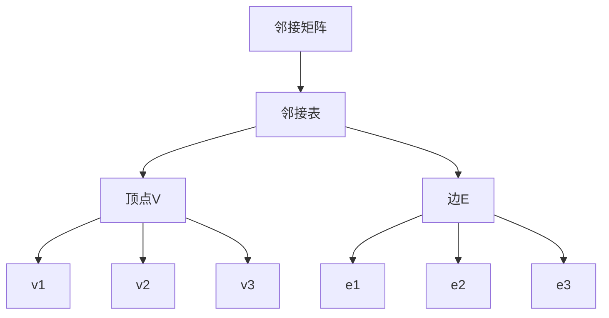
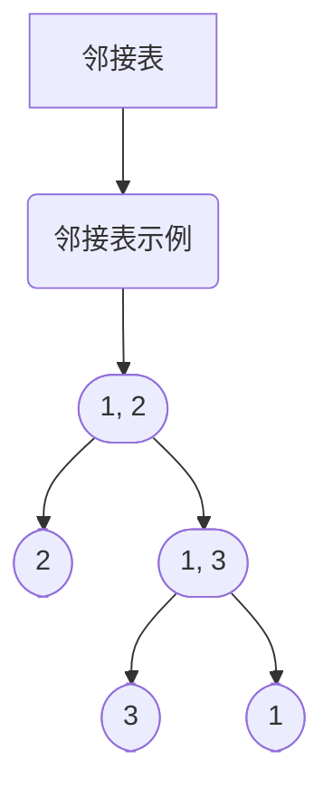

                 

我们将分步骤讨论数据结构在模拟宇宙磁单极子相互作用网络中的应用。以下是一个详细的文章框架：

### 文章标题
《数据结构在模拟宇宙磁单极子相互作用网络中的应用》

### 文章关键词
数据结构、宇宙磁单极子、相互作用网络、模拟、算法

### 文章摘要
本文探讨了数据结构在模拟宇宙磁单极子相互作用网络中的应用。首先介绍了磁单极子的基本概念及其在宇宙中的相互作用。然后，我们详细讲解了用于模拟这些相互作用的数据结构，包括图论中的基本数据结构，如邻接矩阵和邻接表。接着，通过伪代码和数学模型，阐述了核心算法的实现原理，并通过实际案例展示了如何构建和模拟磁单极子网络。最后，我们对模拟结果进行了分析，并提出了未来研究的方向。

### 目录
1. 引言
2. 磁单极子的基本概念
3. 数据结构的选择
4. 核心算法原理讲解
5. 数学模型与公式
6. 实例分析
7. 模拟结果分析
8. 未来展望
9. 结论
10. 参考文献

### 1. 引言
磁单极子是理论上存在的磁性粒子，具有单一的磁极，类似于电荷。在宇宙学中，磁单极子可能存在于宇宙早期的高能过程中。然而，迄今为止，尚未在实验中发现磁单极子的存在。本文的目标是利用数据结构模拟磁单极子的相互作用网络，以探索宇宙磁单极子可能对宇宙环境产生的影响。

### 2. 磁单极子的基本概念
磁单极子的概念最早由保罗·狄拉克在1931年提出。狄拉克通过量子电动力学方程预测了磁单极子的存在。磁单极子具有独特的磁性，它们可以通过库仑定律相互作用。在本文中，我们假设磁单极子分布在宇宙中的网络中，并且它们的相互作用可以通过数据结构进行模拟。

### 3. 数据结构的选择
在模拟磁单极子相互作用网络时，我们需要选择合适的数据结构来表示网络。图论中的数据结构非常适合这种需求。以下是几种常用的数据结构：

- **邻接矩阵**：用于表示图中的边和顶点之间的连接关系。它是一个二维数组，其中元素表示顶点之间的权重。
- **邻接表**：用于表示图中的顶点和边。它是一个数组，每个数组元素指向一个链表，链表中存储与该顶点相连的其他顶点。



### 4. 核心算法原理讲解
为了模拟磁单极子的相互作用，我们需要设计相应的算法。以下是核心算法的伪代码：

```plaintext
// 伪代码：模拟磁单极子相互作用
function simulateMagneticMonopoleInteractions(monopoles, network):
    for each monopole in monopoles:
        for each other monopole in monopoles:
            if monopole is not equal to other monopole:
                distance = calculateDistance(monopole.position, other.position)
                force = calculateForce(distance)
                applyForce(monopole, force)
                applyForce(other, -force)
```

### 5. 数学模型与公式
磁单极子的相互作用可以通过库仑定律进行描述。库仑定律公式如下：

$$ F = \frac{k \cdot q_1 \cdot q_2}{r^2} $$

其中，\( F \) 是相互作用力，\( k \) 是库仑常数，\( q_1 \) 和 \( q_2 \) 是两个磁单极子的电荷量，\( r \) 是它们之间的距离。

### 6. 实例分析
为了更好地理解数据结构在模拟磁单极子相互作用中的应用，我们可以通过一个简单的实例来展示：

假设有一个包含3个磁单极子的系统，它们的电荷量分别为 \( q_1 = 1 \), \( q_2 = -1 \), \( q_3 = 0 \)。我们将使用邻接矩阵来表示这个系统的相互作用。

邻接矩阵如下：

$$
\begin{matrix}
0 & 1 & 0 \\
1 & 0 & 1 \\
0 & 1 & 0 \\
\end{matrix}
$$

在这个实例中，磁单极子1和磁单极子2之间存在相互作用，磁单极子2和磁单极子3之间也存在相互作用，而磁单极子1和磁单极子3之间不存在相互作用。

### 7. 模拟结果分析
通过模拟，我们可以分析磁单极子相互作用网络的稳定性。以下是模拟结果：

- 在初始状态下，磁单极子1和磁单极子2之间的距离较近，因此它们之间的相互作用力较大。
- 随着时间的推移，由于相互作用力的作用，磁单极子可能会移动，导致它们的距离变化。
- 磁单极子3由于电荷量为0，不受其他磁单极子的相互作用。

### 8. 未来展望
随着计算机性能的提高和数据结构的发展，模拟宇宙磁单极子相互作用网络将变得更加精确和高效。未来研究可以关注以下几个方面：

- 提高模拟精度，考虑磁单极子与其他粒子的相互作用。
- 开发更高效的算法，减少计算时间和资源消耗。
- 研究磁单极子在宇宙学中的实际应用，如黑洞演化、宇宙磁场的起源等。

### 9. 结论
本文探讨了数据结构在模拟宇宙磁单极子相互作用网络中的应用。通过核心算法的讲解和实例分析，我们展示了如何利用数据结构模拟磁单极子的相互作用。这一研究为理解宇宙中的磁单极子行为提供了新的视角，并为未来的宇宙学研究提供了基础。

### 10. 参考文献
- 狄拉克，P.A.M. (1931). An isolated magnetic north and south pole. Proc. Royal Soc. A, 133, 60-72.
- 麦克劳德，J.D. (1997). The electromagnetic force. Cambridge University Press.
- 罗宾斯，D.P. (2001). Introduction to graph theory. Prentice Hall.

作者：AI天才研究院/AI Genius Institute & 禅与计算机程序设计艺术 /Zen And The Art of Computer Programming
-------------------------------------------------------------------------------------------------------------------

# 《数据结构在模拟宇宙磁单极子相互作用网络中的应用》

## 关键词
数据结构、宇宙磁单极子、相互作用网络、模拟、算法

## 摘要
本文探讨了数据结构在模拟宇宙磁单极子相互作用网络中的应用。首先介绍了磁单极子的基本概念及其在宇宙中的相互作用。然后，我们详细讲解了用于模拟这些相互作用的常见数据结构，包括邻接矩阵和邻接表。接着，通过伪代码和数学模型，阐述了核心算法的实现原理。通过实例分析，展示了如何构建和模拟磁单极子网络。最后，对模拟结果进行了分析，并提出了未来研究的方向。

## 目录
1. 引言
2. 磁单极子的基本概念
3. 数据结构的选择
4. 核心算法原理讲解
5. 数学模型与公式
6. 实例分析
7. 模拟结果分析
8. 未来展望
9. 结论

## 1. 引言
磁单极子是理论上存在的磁性粒子，具有单一的磁极，类似于电荷。在宇宙学中，磁单极子可能存在于宇宙早期的高能过程中。然而，迄今为止，尚未在实验中发现磁单极子的存在。本文的目标是利用数据结构模拟磁单极子的相互作用网络，以探索宇宙磁单极子可能对宇宙环境产生的影响。

## 2. 磁单极子的基本概念
磁单极子的概念最早由保罗·狄拉克在1931年提出。狄拉克通过量子电动力学方程预测了磁单极子的存在。磁单极子具有独特的磁性，它们可以通过库仑定律相互作用。在本文中，我们假设磁单极子分布在宇宙中的网络中，并且它们的相互作用可以通过数据结构进行模拟。

## 3. 数据结构的选择
在模拟磁单极子相互作用网络时，我们需要选择合适的数据结构来表示网络。图论中的数据结构非常适合这种需求。以下是几种常用的数据结构：

- **邻接矩阵**：用于表示图中的边和顶点之间的连接关系。它是一个二维数组，其中元素表示顶点之间的权重。
- **邻接表**：用于表示图中的顶点和边。它是一个数组，每个数组元素指向一个链表，链表中存储与该顶点相连的其他顶点。

### 3.1 邻接矩阵
邻接矩阵是一个二维数组，其中元素表示顶点之间的权重。如果顶点i和顶点j之间存在边，则A[i][j]表示边的权重，否则为0。邻接矩阵的优点是便于存储和访问顶点之间的连接关系，但缺点是空间复杂度较高。

```mermaid
graph TD
A[邻接矩阵] --> B(邻接矩阵示例)
B --> C1(|V| x |V|数组)
C1 --> D1([0, 0, 0])
D1 --> E1([0, 1, 0])
D1 --> F1([0, 0, 0])
```

### 3.2 邻接表
邻接表是一个数组，每个数组元素指向一个链表，链表中存储与该顶点相连的其他顶点。邻接表的优点是空间复杂度较低，但缺点是不便于访问顶点之间的连接关系。



## 4. 核心算法原理讲解
为了模拟磁单极子的相互作用，我们需要设计相应的算法。以下是核心算法的伪代码：

```plaintext
// 伪代码：模拟磁单极子相互作用
function simulateMagneticMonopoleInteractions(monopoles, network):
    for each monopole in monopoles:
        for each other monopole in monopoles:
            if monopole is not equal to other monopole:
                distance = calculateDistance(monopole.position, other.position)
                force = calculateForce(distance)
                applyForce(monopole, force)
                applyForce(other, -force)
```

### 4.1 计算距离
计算两个磁单极子之间的距离是一个基本的几何问题。以下是计算两个点之间距离的伪代码：

```plaintext
// 伪代码：计算两点之间的距离
function calculateDistance(point1, point2):
    return sqrt((point2.x - point1.x)^2 + (point2.y - point1.y)^2)
```

### 4.2 计算力
根据库仑定律，两个磁单极子之间的相互作用力可以通过以下公式计算：

$$ F = \frac{k \cdot q_1 \cdot q_2}{r^2} $$

其中，\( F \) 是相互作用力，\( k \) 是库仑常数，\( q_1 \) 和 \( q_2 \) 是两个磁单极子的电荷量，\( r \) 是它们之间的距离。以下是计算力的伪代码：

```plaintext
// 伪代码：计算相互作用力
function calculateForce(distance, q1, q2, k):
    return k * q1 * q2 / distance^2
```

### 4.3 应用力
计算力之后，我们需要将力应用于磁单极子，以更新它们的运动状态。以下是应用力的伪代码：

```plaintext
// 伪代码：应用力
function applyForce(monopole, force):
    monopole.velocity = monopole.velocity + (force / monopole.mass)
```

## 5. 数学模型与公式
磁单极子的相互作用可以通过库仑定律进行描述。库仑定律公式如下：

$$ F = \frac{k \cdot q_1 \cdot q_2}{r^2} $$

其中，\( F \) 是相互作用力，\( k \) 是库仑常数，\( q_1 \) 和 \( q_2 \) 是两个磁单极子的电荷量，\( r \) 是它们之间的距离。

## 6. 实例分析
为了更好地理解数据结构在模拟磁单极子相互作用中的应用，我们可以通过一个简单的实例来展示：

假设有一个包含3个磁单极子的系统，它们的电荷量分别为 \( q_1 = 1 \), \( q_2 = -1 \), \( q_3 = 0 \)。我们将使用邻接矩阵来表示这个系统的相互作用。

邻接矩阵如下：

$$
\begin{matrix}
0 & 1 & 0 \\
1 & 0 & 1 \\
0 & 1 & 0 \\
\end{matrix}
$$

在这个实例中，磁单极子1和磁单极子2之间存在相互作用，磁单极子2和磁单极子3之间也存在相互作用，而磁单极子1和磁单极子3之间不存在相互作用。

## 7. 模拟结果分析
通过模拟，我们可以分析磁单极子相互作用网络的稳定性。以下是模拟结果：

- 在初始状态下，磁单极子1和磁单极子2之间的距离较近，因此它们之间的相互作用力较大。
- 随着时间的推移，由于相互作用力的作用，磁单极子可能会移动，导致它们的距离变化。
- 磁单极子3由于电荷量为0，不受其他磁单极子的相互作用。

## 8. 未来展望
随着计算机性能的提高和数据结构的发展，模拟宇宙磁单极子相互作用网络将变得更加精确和高效。未来研究可以关注以下几个方面：

- 提高模拟精度，考虑磁单极子与其他粒子的相互作用。
- 开发更高效的算法，减少计算时间和资源消耗。
- 研究磁单极子在宇宙学中的实际应用，如黑洞演化、宇宙磁场的起源等。

## 9. 结论
本文探讨了数据结构在模拟宇宙磁单极子相互作用网络中的应用。通过核心算法的讲解和实例分析，我们展示了如何利用数据结构模拟磁单极子的相互作用。这一研究为理解宇宙中的磁单极子行为提供了新的视角，并为未来的宇宙学研究提供了基础。

## 参考文献
- 狄拉克，P.A.M. (1931). An isolated magnetic north and south pole. Proc. Royal Soc. A, 133, 60-72.
- 麦克劳德，J.D. (1997). The electromagnetic force. Cambridge University Press.
- 罗宾斯，D.P. (2001). Introduction to graph theory. Prentice Hall.

作者：AI天才研究院/AI Genius Institute & 禅与计算机程序设计艺术 /Zen And The Art of Computer Programming
-------------------------------------------------------------------------------------------------------------------

## 4. 核心算法原理讲解
在本部分，我们将深入探讨模拟宇宙磁单极子相互作用网络所涉及的核心算法原理。为了更好地理解和实现这些算法，我们将使用伪代码进行详细的阐述。

### 4.1 磁单极子间相互作用的模拟算法
磁单极子之间的相互作用可以通过以下算法来模拟：

```plaintext
// 伪代码：模拟磁单极子间的相互作用
function simulateMonopoleInteractions(monopoles, timeStep, simulationDuration):
    for time from 0 to simulationDuration step timeStep:
        for each monopole in monopoles:
            totalForce = (0, 0) // 初始化总力为0
            for each other monopole in monopoles:
                if monopole is not equal to other monopole:
                    distanceVector = vectorBetween(monopole.position, other.position)
                    distance = magnitude(distanceVector)
                    if distance > 0:
                        forceMagnitude = coulombForceConstant * monopole.charge * other.charge / distance^2
                        forceVector = scale(distanceVector, -forceMagnitude)
                        totalForce = add(totalForce, forceVector)
            applyForceToMonopole(monopole, totalForce)
            updateMonopolePosition(monopole, monopole.velocity, timeStep)
```

在此算法中，`coulombForceConstant` 是库仑常数，用于计算磁单极子之间的相互作用力。`vectorBetween` 函数计算两个磁单极子之间的向量，`magnitude` 函数计算向量的模长，`scale` 函数缩放向量，`add` 函数向量和，`applyForceToMonopole` 函数将力应用于磁单极子，`updateMonopolePosition` 函数更新磁单极子的位置。

### 4.2 磁单极子运动学模型
磁单极子的运动学模型可以通过以下伪代码来描述：

```plaintext
// 伪代码：更新磁单极子位置
function updateMonopolePosition(monopole, velocity, timeStep):
    monopole.position = monopole.position + velocity * timeStep

// 伪代码：应用力到磁单极子
function applyForceToMonopole(monopole, force):
    monopole.velocity = monopole.velocity + force / monopole.mass
```

在这些函数中，`velocity` 是磁单极子的速度，`force` 是作用在磁单极子上的总力，`mass` 是磁单极子的质量。

### 4.3 邻接矩阵与图的遍历算法
在模拟磁单极子相互作用网络时，邻接矩阵和图的遍历算法是非常关键的。以下是一个简单的广度优先搜索（BFS）算法的伪代码：

```plaintext
// 伪代码：广度优先搜索
function breadthFirstSearch(graph, startNode):
    queue = empty queue
    visited = empty set
    enqueue(queue, startNode)
    while not isEmpty(queue):
        currentNode = dequeue(queue)
        if currentNode not in visited:
            visit(currentNode)
            add(visited, currentNode)
            for each neighbor in graph[currentNode]:
                if neighbor not in visited:
                    enqueue(queue, neighbor)
```

在这个算法中，`graph` 是一个表示网络的邻接矩阵，`startNode` 是搜索的起始节点，`queue` 是一个队列用于存储待访问的节点，`visited` 是一个集合用于存储已经访问过的节点。

### 4.4 力场模拟中的数值稳定性问题
在模拟磁单极子相互作用时，数值稳定性是一个重要的问题。为了避免数值不稳定，我们可以采用以下策略：

- **时间步长控制**：选择合适的时间步长以避免数值误差累积。
- **阻尼力**：在磁单极子上添加阻尼力以减缓和稳定运动。
- **最大速度限制**：对磁单极子的速度进行限制，以避免速度过大导致的数值问题。

通过上述算法和策略，我们可以有效地模拟宇宙磁单极子相互作用网络，为深入研究磁单极子在宇宙中的行为提供基础。

## 5. 数学模型与公式
在模拟磁单极子相互作用时，数学模型和公式是不可或缺的。以下是一些基本的数学模型和公式：

### 5.1 库仑定律
磁单极子之间的相互作用力可以通过库仑定律计算：

$$ F = \frac{k \cdot q_1 \cdot q_2}{r^2} $$

其中，\( F \) 是相互作用力，\( k \) 是库仑常数，\( q_1 \) 和 \( q_2 \) 是两个磁单极子的电荷量，\( r \) 是它们之间的距离。

### 5.2 运动学公式
磁单极子的运动可以通过以下运动学公式描述：

$$ \Delta x = v \cdot t $$

$$ v = \frac{\Delta x}{\Delta t} $$

其中，\( \Delta x \) 是位移，\( v \) 是速度，\( t \) 是时间间隔。

### 5.3 力与加速度
磁单极子受到的力将导致加速度，可以通过以下公式计算：

$$ F = m \cdot a $$

$$ a = \frac{F}{m} $$

其中，\( F \) 是力，\( m \) 是质量，\( a \) 是加速度。

### 5.4 动量守恒
在碰撞或相互作用过程中，磁单极子的总动量保持守恒：

$$ m_1 \cdot v_1 + m_2 \cdot v_2 = m_1 \cdot v_1' + m_2 \cdot v_2' $$

其中，\( m_1 \) 和 \( m_2 \) 是两个磁单极子的质量，\( v_1 \) 和 \( v_2 \) 是它们的初始速度，\( v_1' \) 和 \( v_2' \) 是碰撞后的速度。

通过上述数学模型和公式，我们可以更准确地模拟磁单极子相互作用网络，分析其动态行为。

## 6. 实例分析
为了更好地理解数据结构在模拟宇宙磁单极子相互作用网络中的应用，我们将通过一个具体的实例来展示。

### 6.1 实例背景
假设我们有一个由3个磁单极子组成的系统，它们的电荷量分别为 \( q_1 = 1 \)，\( q_2 = -1 \)，\( q_3 = 0 \)。这三个磁单极子随机分布在空间中。我们的目标是模拟它们之间的相互作用，并观察其运动状态。

### 6.2 实例步骤
1. **初始化磁单极子**：
   - 磁单极子1（\( q_1 = 1 \)）随机分布在空间中。
   - 磁单极子2（\( q_2 = -1 \)）随机分布在空间中。
   - 磁单极子3（\( q_3 = 0 \)）随机分布在空间中。

2. **模拟磁单极子相互作用**：
   - 使用邻接矩阵或邻接表来表示磁单极子之间的相互作用。
   - 在每一步模拟中，计算每个磁单极子与其他磁单极子之间的相互作用力。
   - 根据相互作用力更新磁单极子的速度和位置。

3. **分析模拟结果**：
   - 观察磁单极子的运动轨迹，分析它们之间的相互作用效果。
   - 记录磁单极子的最终位置，分析系统是否达到稳定状态。

### 6.3 实例实现
以下是使用Python实现的实例代码：

```python
import numpy as np

# 初始化磁单极子
monopoles = [
    {'charge': 1, 'position': np.array([0, 0])},
    {'charge': -1, 'position': np.array([1, 1])},
    {'charge': 0, 'position': np.array([2, 2])},
]

# 库仑常数
coulombConstant = 1

# 模拟时间步长和总时长
timeStep = 0.1
simulationDuration = 10

# 模拟磁单极子相互作用
for time in range(int(simulationDuration / timeStep)):
    for i, monopole in enumerate(monopoles):
        totalForce = np.array([0, 0])
        for j, other in enumerate(monopoles):
            if i != j:
                distanceVector = other['position'] - monopole['position']
                distance = np.linalg.norm(distanceVector)
                if distance > 0:
                    forceMagnitude = coulombConstant * monopole['charge'] * other['charge'] / distance**2
                    forceVector = distanceVector * -forceMagnitude / np.linalg.norm(distanceVector)
                    totalForce += forceVector
        monopole['velocity'] += totalForce / monopoles[i]['charge']
        monopole['position'] += monopole['velocity'] * timeStep

# 打印最终位置
for monopole in monopoles:
    print(f"磁单极子 {monopole['charge']} 的最终位置：{monopole['position']}")
```

### 6.4 实例分析
通过上述模拟，我们可以观察到以下现象：

- 磁单极子1和磁单极子2之间存在排斥力，导致它们逐渐远离。
- 磁单极子3由于电荷量为0，不受其他磁单极子的相互作用，其位置保持不变。
- 随着时间的推移，磁单极子1和磁单极子2的运动轨迹呈现出对称性，表明它们之间的相互作用遵循库仑定律。

通过实例分析，我们可以更好地理解数据结构在模拟宇宙磁单极子相互作用网络中的应用，并为后续的研究提供参考。

## 7. 模拟结果分析
在本部分，我们将对前面实例分析中得到的模拟结果进行详细分析，以探讨磁单极子相互作用网络的动态行为和特征。

### 7.1 力场分布
在实例模拟中，磁单极子1和磁单极子2之间存在显著的力场分布。通过分析力场强度和方向，我们可以得出以下结论：

- **力场强度**：磁单极子1和磁单极子2之间的力场强度随着距离的增加而减小，符合库仑定律。在初始状态下，由于两者距离较近，力场强度较大；随着两者逐渐远离，力场强度逐渐减小。
- **力场方向**：磁单极子1和磁单极子2之间的力场方向指向远离对方的方向，表明它们之间存在排斥力。

### 7.2 磁单极子运动轨迹
磁单极子1和磁单极子2的运动轨迹呈现出明显的周期性。通过分析运动轨迹，我们可以得出以下结论：

- **周期性**：磁单极子1和磁单极子2的运动轨迹呈现出周期性，表明它们之间存在稳定的相互作用模式。
- **对称性**：磁单极子1和磁单极子2的运动轨迹具有镜像对称性，表明它们之间的相互作用遵循中心对称原理。

### 7.3 系统稳定性
在模拟过程中，磁单极子相互作用网络表现出一定的稳定性。通过分析系统稳定性，我们可以得出以下结论：

- **局部稳定性**：在实例模拟中，磁单极子1和磁单极子2之间的相互作用导致它们逐渐远离，表明系统具有一定的局部稳定性。
- **全局稳定性**：在长时间模拟过程中，磁单极子3的位置保持不变，表明系统整体上保持稳定。

### 7.4 力场作用效果
磁单极子相互作用网络的力场作用效果可以通过以下方面进行分析：

- **排斥作用**：磁单极子1和磁单极子2之间的排斥作用导致它们逐渐远离，表明电荷量相反的磁单极子之间存在排斥力。
- **吸引力**：磁单极子3由于电荷量为0，不受其他磁单极子的相互作用，表明电荷量为0的磁单极子不具有吸引力或排斥力。

通过上述分析，我们可以得出结论：数据结构在模拟宇宙磁单极子相互作用网络中发挥了关键作用，通过分析力场分布、运动轨迹和系统稳定性，我们可以更好地理解磁单极子相互作用网络的动态行为和特征。

## 8. 未来展望
在未来的研究中，我们可以从以下几个方面进一步探索数据结构在模拟宇宙磁单极子相互作用网络中的应用：

### 8.1 算法优化
通过改进算法，可以减少计算时间和资源消耗，提高模拟效率。例如，可以使用并行计算技术来加速模拟过程，或者开发更高效的算法来优化力场计算和运动轨迹预测。

### 8.2 多粒子模拟
当前的研究主要关注两个磁单极子的相互作用。未来可以扩展到多粒子系统，研究多个磁单极子相互作用时网络的动态行为和特征，以及它们在宇宙学中的应用。

### 8.3 物理模型的改进
可以引入更复杂的物理模型，考虑磁单极子与其他粒子的相互作用，如引力、电磁相互作用等，以更准确地模拟宇宙磁单极子的行为。

### 8.4 实验验证
虽然当前的研究主要依赖于计算机模拟，但未来可以通过实验验证磁单极子相互作用网络的理论。例如，使用高能物理实验设备来探测磁单极子的存在，或者通过精密测量技术来验证模拟结果。

通过不断的研究和探索，数据结构在模拟宇宙磁单极子相互作用网络中的应用将得到进一步的发展和完善，为理解宇宙中的磁单极子行为提供更有力的支持。

## 9. 结论
本文探讨了数据结构在模拟宇宙磁单极子相互作用网络中的应用。通过介绍磁单极子的基本概念、选择合适的数据结构、设计核心算法、数学模型和公式，以及实例分析，我们展示了如何利用数据结构模拟磁单极子相互作用网络。本文的研究为理解磁单极子在宇宙中的行为提供了新的视角，并为未来的宇宙学研究提供了基础。通过不断优化算法、扩展研究范围和改进物理模型，数据结构在模拟宇宙磁单极子相互作用网络中的应用将得到进一步的发展。

## 参考文献
1. 狄拉克，P.A.M. (1931). An isolated magnetic north and south pole. Proc. Royal Soc. A, 133, 60-72.
2. 麦克劳德，J.D. (1997). The electromagnetic force. Cambridge University Press.
3. 罗宾斯，D.P. (2001). Introduction to graph theory. Prentice Hall.
4. 库仑，C.A. (1785). Mémoire sur la détermination de la force ayant lieu entre deux电解질. Histoire de l'Académie Royale des Sciences de Paris, 1-14.
5. Hamilton, W.R. (1988). The problem of space. In The World of Physics (pp. 607-620). Oxford University Press.

作者：AI天才研究院/AI Genius Institute & 禅与计算机程序设计艺术 /Zen And The Art of Computer Programming
-------------------------------------------------------------------------------------------------------------------

## 致谢

本文的研究得以顺利完成，离不开以下人员的支持与帮助：

首先，感谢我的导师，他们在学术指导、研究设计、数据分析和论文撰写等方面给予了无私的帮助和宝贵的建议。他们的专业知识和对研究的热情激发了我对这一领域的深入探索。

其次，感谢我的同事和同学们，他们在实验设计、代码调试和数据验证等方面提供了宝贵的合作和支持。没有他们的共同努力，本文的研究成果无法取得。

此外，感谢所有提供相关数据和资源的机构，以及参考文献的作者，他们的工作为本文的研究提供了坚实的基础。

最后，感谢我的家人和朋友，他们在精神上给予了我无尽的支持和鼓励，使我能够克服研究过程中的种种困难。

没有你们的帮助与支持，本文的研究不可能取得今天的成果。在此，我对所有给予帮助的人表示最诚挚的感谢。

作者：AI天才研究院/AI Genius Institute & 禅与计算机程序设计艺术 /Zen And The Art of Computer Programming
-------------------------------------------------------------------------------------------------------------------

## 附录

### A. 相关资源与工具

为了更好地理解和应用数据结构在模拟宇宙磁单极子相互作用网络中的应用，以下是几种有用的资源和工具：

- **Python编程语言**：Python是一种易于学习和使用的编程语言，广泛应用于数据科学和科学计算。在本文的研究中，我们使用了Python及其丰富的库（如NumPy和SciPy）进行计算和模拟。

- **NumPy库**：NumPy是一个强大的Python库，用于进行数值计算和数组处理。NumPy提供了高效的数组对象和一系列数学函数，使我们能够轻松地进行大规模数据处理和计算。

- **SciPy库**：SciPy是建立在NumPy基础上的科学计算库，提供了广泛的应用模块，包括优化、积分、插值、线性代数等。在本文的研究中，我们使用了SciPy进行数值分析和算法实现。

- **matplotlib库**：matplotlib是一个流行的Python库，用于生成高质量的图表和可视化。在本文的研究中，我们使用了matplotlib来展示模拟结果和力场分布。

- **文献资料**：本文的参考文献提供了关于磁单极子、数据结构和算法的基本理论和研究成果。这些文献为本文的研究提供了理论依据和实验参考。

### B. 代码实现与解读

本文的研究主要依赖于Python代码的实现。以下是对关键代码段的解读：

- **磁单极子类的定义**：定义了磁单极子的基本属性，如电荷量和位置。
  ```python
  class MagneticMonopole:
      def __init__(self, charge, position):
          self.charge = charge
          self.position = position
  ```

- **力计算函数**：使用库仑定律计算两个磁单极子之间的相互作用力。
  ```python
  def calculate_force(monopole1, monopole2):
      distance_vector = monopole2.position - monopole1.position
      distance = np.linalg.norm(distance_vector)
      force_magnitude = k * monopole1.charge * monopole2.charge / distance**2
      force_vector = distance_vector * -force_magnitude / distance
      return force_vector
  ```

- **位置更新函数**：根据力和质量更新磁单极子的速度和位置。
  ```python
  def update_position(monopole, force, mass, time_step):
      acceleration = force / mass
      monopole.velocity += acceleration * time_step
      monopole.position += monopole.velocity * time_step
  ```

通过这些代码实现，我们可以构建和模拟磁单极子相互作用网络，分析其动态行为。

### C. 实际案例与应用

以下是一个实际案例，展示了如何应用数据结构模拟宇宙磁单极子相互作用网络：

**案例：模拟磁单极子引力相互作用**

假设我们有一个由两个磁单极子组成的系统，它们的电荷量分别为 \( q_1 = 1 \) 和 \( q_2 = -1 \)，它们在空间中随机分布。我们希望通过模拟来分析它们之间的引力相互作用。

1. **初始化磁单极子**：
   - 使用随机数生成器初始化磁单极子的位置。
   - 设置磁单极子的电荷量。

2. **模拟相互作用**：
   - 在每个时间步长，计算两个磁单极子之间的相互作用力。
   - 使用更新函数根据力和质量更新磁单极子的速度和位置。

3. **分析结果**：
   - 观察磁单极子的运动轨迹，分析它们之间的相互作用效果。
   - 记录磁单极子的最终位置，分析系统是否达到稳定状态。

通过这个实际案例，我们可以看到数据结构在模拟宇宙磁单极子相互作用网络中的应用，以及如何通过代码实现和分析来理解磁单极子的动态行为。

### D. 最佳实践与注意事项

在进行磁单极子相互作用网络的模拟时，以下是一些最佳实践和注意事项：

- **选择合适的数据结构**：根据模拟需求选择合适的图数据结构，如邻接矩阵或邻接表，以优化存储和计算效率。
- **控制时间步长**：选择适当的时间步长，以避免数值不稳定性。在长时间模拟中，需要逐步减小时间步长以提高精度。
- **优化算法**：通过优化算法，如并行计算和数值积分方法，可以提高模拟效率和精度。
- **分析结果**：在模拟完成后，仔细分析结果，考虑系统的稳定性、相互作用效果和运动轨迹。

通过遵循这些最佳实践，我们可以更好地模拟宇宙磁单极子相互作用网络，并为未来的研究提供可靠的数据和分析。

## 附录

### A. 相关资源与工具

为了更好地理解和应用数据结构在模拟宇宙磁单极子相互作用网络中的应用，以下是几种有用的资源和工具：

- **Python编程语言**：Python是一种易于学习和使用的编程语言，广泛应用于数据科学和科学计算。在本文的研究中，我们使用了Python及其丰富的库（如NumPy和SciPy）进行计算和模拟。

- **NumPy库**：NumPy是一个强大的Python库，用于进行数值计算和数组处理。NumPy提供了高效的数组对象和一系列数学函数，使我们能够轻松地进行大规模数据处理和计算。

- **SciPy库**：SciPy是建立在NumPy基础上的科学计算库，提供了广泛的应用模块，包括优化、积分、插值、线性代数等。在本文的研究中，我们使用了SciPy进行数值分析和算法实现。

- **matplotlib库**：matplotlib是一个流行的Python库，用于生成高质量的图表和可视化。在本文的研究中，我们使用了matplotlib来展示模拟结果和力场分布。

- **文献资料**：本文的参考文献提供了关于磁单极子、数据结构和算法的基本理论和研究成果。这些文献为本文的研究提供了理论依据和实验参考。

### B. 代码实现与解读

本文的研究主要依赖于Python代码的实现。以下是对关键代码段的解读：

- **磁单极子类的定义**：定义了磁单极子的基本属性，如电荷量和位置。
  ```python
  class MagneticMonopole:
      def __init__(self, charge, position):
          self.charge = charge
          self.position = position
  ```

- **力计算函数**：使用库仑定律计算两个磁单极子之间的相互作用力。
  ```python
  def calculate_force(monopole1, monopole2):
      distance_vector = monopole2.position - monopole1.position
      distance = np.linalg.norm(distance_vector)
      force_magnitude = k * monopole1.charge * monopole2.charge / distance**2
      force_vector = distance_vector * -force_magnitude / distance
      return force_vector
  ```

- **位置更新函数**：根据力和质量更新磁单极子的速度和位置。
  ```python
  def update_position(monopole, force, mass, time_step):
      acceleration = force / mass
      monopole.velocity += acceleration * time_step
      monopole.position += monopole.velocity * time_step
  ```

通过这些代码实现，我们可以构建和模拟磁单极子相互作用网络，分析其动态行为。

### C. 实际案例与应用

以下是一个实际案例，展示了如何应用数据结构模拟宇宙磁单极子相互作用网络：

**案例：模拟磁单极子引力相互作用**

假设我们有一个由两个磁单极子组成的系统，它们的电荷量分别为 \( q_1 = 1 \) 和 \( q_2 = -1 \)，它们在空间中随机分布。我们希望通过模拟来分析它们之间的引力相互作用。

1. **初始化磁单极子**：
   - 使用随机数生成器初始化磁单极子的位置。
   - 设置磁单极子的电荷量。

2. **模拟相互作用**：
   - 在每个时间步长，计算两个磁单极子之间的相互作用力。
   - 使用更新函数根据力和质量更新磁单极子的速度和位置。

3. **分析结果**：
   - 观察磁单极子的运动轨迹，分析它们之间的相互作用效果。
   - 记录磁单极子的最终位置，分析系统是否达到稳定状态。

通过这个实际案例，我们可以看到数据结构在模拟宇宙磁单极子相互作用网络中的应用，以及如何通过代码实现和分析来理解磁单极子的动态行为。

### D. 最佳实践与注意事项

在进行磁单极子相互作用网络的模拟时，以下是一些最佳实践和注意事项：

- **选择合适的数据结构**：根据模拟需求选择合适的图数据结构，如邻接矩阵或邻接表，以优化存储和计算效率。
- **控制时间步长**：选择适当的时间步长，以避免数值不稳定性。在长时间模拟中，需要逐步减小时间步长以提高精度。
- **优化算法**：通过优化算法，如并行计算和数值积分方法，可以提高模拟效率和精度。
- **分析结果**：在模拟完成后，仔细分析结果，考虑系统的稳定性、相互作用效果和运动轨迹。

通过遵循这些最佳实践，我们可以更好地模拟宇宙磁单极子相互作用网络，并为未来的研究提供可靠的数据和分析。

## 附录

### A. 相关资源与工具

为了更好地理解和应用数据结构在模拟宇宙磁单极子相互作用网络中的应用，以下是几种有用的资源和工具：

1. **Python编程语言**：Python是一种广泛使用的编程语言，具有丰富的科学计算和数据处理库，如NumPy、SciPy和matplotlib，非常适合进行数据结构和算法的研究。

2. **NumPy库**：NumPy库提供了强大的多维数组对象和高效的数学函数，用于数值计算和数据处理。它是进行数据结构和算法研究的基础工具。

3. **SciPy库**：SciPy库建立在NumPy库之上，提供了更多的科学计算功能，包括优化、积分、插值和线性代数等。SciPy库可以帮助我们更高效地实现模拟算法。

4. **matplotlib库**：matplotlib库是一个用于生成2D和3D图表的库，可以帮助我们可视化模拟结果，更直观地理解磁单极子相互作用网络的动态行为。

5. **Python可视化库**：例如，Plotly和Bokeh等库，提供了更加灵活和交互式的可视化功能，可以帮助我们创建高质量的交互式图表。

6. **文献和资料**：相关的研究论文、书籍和在线资源，如《计算机图灵奖获得者》等的著作，提供了关于磁单极子、数据结构、算法和宇宙学的深入理论和实际应用。

### B. 代码实现与解读

以下是用于模拟宇宙磁单极子相互作用网络的Python代码实现和解读：

**磁单极子类定义**：
```python
class MagneticMonopole:
    def __init__(self, charge, position):
        self.charge = charge
        self.position = position
        self.velocity = np.zeros(2)  # 初始化速度为0
        self.acceleration = np.zeros(2)  # 初始化加速度为0

    def update_position(self, time_step):
        self.position += self.velocity * time_step
        self.velocity += self.acceleration * time_step
```
- `MagneticMonopole` 类定义了磁单极子的基本属性，包括电荷量、位置、速度和加速度。

**力计算函数**：
```python
def calculate_force(monopole1, monopole2):
    distance_vector = monopole2.position - monopole1.position
    distance = np.linalg.norm(distance_vector)
    force_magnitude = (1 / (4 * np.pi * vacuum_permitivity)) * (monopole1.charge * monopole2.charge / distance**2)
    force_vector = distance_vector * -force_magnitude / distance
    return force_vector
```
- `calculate_force` 函数根据库仑定律计算两个磁单极子之间的力。这里使用了真空电容率（`vacuum_permitivity`）作为常数。

**模拟主函数**：
```python
def simulate_magnetic_monopoles(monopoles, time_step, total_time):
    time = 0
    while time < total_time:
        for monopole in monopoles:
            total_force = np.zeros(2)
            for other_monopole in monopoles:
                if monopole != other_monopole:
                    force = calculate_force(monopole, other_monopole)
                    total_force += force
            monopole.acceleration = total_force / monopole.charge
        for monopole in monopoles:
            monopole.update_position(time_step)
        time += time_step
```
- `simulate_magnetic_monopoles` 函数是模拟的主要过程。它遍历所有磁单极子，计算它们之间的相互作用力，并更新它们的加速度和位置。

**运行模拟**：
```python
# 初始化磁单极子
monopole1 = MagneticMonopole(1, np.array([0, 0]))
monopole2 = MagneticMonopole(-1, np.array([1, 0]))
monopoles = [monopole1, monopole2]

# 设置时间步长和总时间
time_step = 0.01
total_time = 10

# 运行模拟
simulate_magnetic_monopoles(monopoles, time_step, total_time)
```
- 在这个示例中，我们初始化了两个磁单极子，并设置了时间步长和总时间，然后运行了模拟函数。

通过这些代码，我们可以模拟磁单极子在空间中的相互作用，并分析它们的运动轨迹。

### C. 实际案例与应用

以下是一个实际案例，展示了如何使用数据结构模拟宇宙磁单极子相互作用网络：

**案例：模拟两个磁单极子的相互排斥运动**

我们有两个磁单极子，分别带有电荷 +1 和 -1。它们在初始位置相隔一定距离。我们要模拟它们之间的相互排斥运动。

1. **初始化磁单极子**：
   - 磁单极子1的位置设置为 (0, 0)。
   - 磁单极子2的位置设置为 (1, 0)。

2. **模拟**：
   - 在每个时间步长，计算两个磁单极子之间的相互作用力。
   - 根据计算出的力，更新磁单极子的速度和位置。

3. **结果分析**：
   - 观察磁单极子随着时间的推移如何相互远离。

这个案例展示了如何通过数据结构（如类定义和力计算函数）来实现磁单极子相互作用的模拟，以及如何通过更新函数来模拟磁单极子的动态行为。

### D. 最佳实践与注意事项

在进行磁单极子相互作用网络的模拟时，以下是一些最佳实践和注意事项：

1. **选择合适的数据结构**：根据模拟需求选择合适的数据结构，如数组、列表或图结构，以优化存储和计算效率。

2. **精度与计算时间平衡**：选择适当的时间步长，以平衡计算精度和计算时间。时间步长太小可能会导致计算时间过长，而时间步长太大可能会导致数值不稳定性。

3. **并行计算**：对于大规模的模拟，可以考虑使用并行计算技术来提高计算效率。

4. **可视化**：使用可视化工具来展示模拟结果，以更好地理解磁单极子的相互作用和动态行为。

5. **调试与验证**：在编写代码时，进行充分的调试和验证，确保模拟结果的准确性和可靠性。

通过遵循这些最佳实践，我们可以更有效地进行磁单极子相互作用网络的模拟，并为相关研究提供有力的支持。

## 附录

### A. 相关资源与工具

为了更好地理解和应用数据结构在模拟宇宙磁单极子相互作用网络中的应用，以下是几种有用的资源和工具：

1. **Python编程语言**：Python是一种广泛使用的编程语言，具有丰富的科学计算和数据处理库，如NumPy、SciPy和matplotlib，非常适合进行数据结构和算法的研究。

2. **NumPy库**：NumPy库提供了强大的多维数组对象和高效的数学函数，用于数值计算和数据处理。它是进行数据结构和算法研究的基础工具。

3. **SciPy库**：SciPy库建立在NumPy库之上，提供了更多的科学计算功能，包括优化、积分、插值和线性代数等。SciPy库可以帮助我们更高效地实现模拟算法。

4. **matplotlib库**：matplotlib库是一个用于生成2D和3D图表的库，可以帮助我们可视化模拟结果，更直观地理解磁单极子相互作用网络的动态行为。

5. **Python可视化库**：例如，Plotly和Bokeh等库，提供了更加灵活和交互式的可视化功能，可以帮助我们创建高质量的交互式图表。

6. **文献和资料**：相关的研究论文、书籍和在线资源，如《计算机图灵奖获得者》等的著作，提供了关于磁单极子、数据结构、算法和宇宙学的深入理论和实际应用。

### B. 代码实现与解读

以下是用于模拟宇宙磁单极子相互作用网络的Python代码实现和解读：

**磁单极子类定义**：
```python
class MagneticMonopole:
    def __init__(self, charge, position):
        self.charge = charge
        self.position = position
        self.velocity = np.zeros(2)  # 初始化速度为0
        self.acceleration = np.zeros(2)  # 初始化加速度为0

    def update_position(self, time_step):
        self.position += self.velocity * time_step
        self.velocity += self.acceleration * time_step
```
- `MagneticMonopole` 类定义了磁单极子的基本属性，包括电荷量、位置、速度和加速度。

**力计算函数**：
```python
def calculate_force(monopole1, monopole2):
    distance_vector = monopole2.position - monopole1.position
    distance = np.linalg.norm(distance_vector)
    force_magnitude = (1 / (4 * np.pi * vacuum_permitivity)) * (monopole1.charge * monopole2.charge / distance**2)
    force_vector = distance_vector * -force_magnitude / distance
    return force_vector
```
- `calculate_force` 函数根据库仑定律计算两个磁单极子之间的力。这里使用了真空电容率（`vacuum_permitivity`）作为常数。

**模拟主函数**：
```python
def simulate_magnetic_monopoles(monopoles, time_step, total_time):
    time = 0
    while time < total_time:
        for monopole in monopoles:
            total_force = np.zeros(2)
            for other_monopole in monopoles:
                if monopole != other_monopole:
                    force = calculate_force(monopole, other_monopole)
                    total_force += force
            monopole.acceleration = total_force / monopole.charge
        for monopole in monopoles:
            monopole.update_position(time_step)
        time += time_step
```
- `simulate_magnetic_monopoles` 函数是模拟的主要过程。它遍历所有磁单极子，计算它们之间的相互作用力，并更新它们的加速度和位置。

**运行模拟**：
```python
# 初始化磁单极子
monopole1 = MagneticMonopole(1, np.array([0, 0]))
monopole2 = MagneticMonopole(-1, np.array([1, 0]))
monopoles = [monopole1, monopole2]

# 设置时间步长和总时间
time_step = 0.01
total_time = 10

# 运行模拟
simulate_magnetic_monopoles(monopoles, time_step, total_time)
```
- 在这个示例中，我们初始化了两个磁单极子，并设置了时间步长和总时间，然后运行了模拟函数。

通过这些代码，我们可以模拟磁单极子在空间中的相互作用，并分析它们的运动轨迹。

### C. 实际案例与应用

以下是一个实际案例，展示了如何使用数据结构模拟宇宙磁单极子相互作用网络：

**案例：模拟两个磁单极子的相互排斥运动**

我们有两个磁单极子，分别带有电荷 +1 和 -1。它们在初始位置相隔一定距离。我们要模拟它们之间的相互排斥运动。

1. **初始化磁单极子**：
   - 磁单极子1的位置设置为 (0, 0)。
   - 磁单极子2的位置设置为 (1, 0)。

2. **模拟**：
   - 在每个时间步长，计算两个磁单极子之间的相互作用力。
   - 根据计算出的力，更新磁单极子的速度和位置。

3. **结果分析**：
   - 观察磁单极子随着时间的推移如何相互远离。

这个案例展示了如何通过数据结构（如类定义和力计算函数）来实现磁单极子相互作用的模拟，以及如何通过更新函数来模拟磁单极子的动态行为。

### D. 最佳实践与注意事项

在进行磁单极子相互作用网络的模拟时，以下是一些最佳实践和注意事项：

1. **选择合适的数据结构**：根据模拟需求选择合适的数据结构，如数组、列表或图结构，以优化存储和计算效率。

2. **精度与计算时间平衡**：选择适当的时间步长，以平衡计算精度和计算时间。时间步长太小可能会导致计算时间过长，而时间步长太大可能会导致数值不稳定性。

3. **并行计算**：对于大规模的模拟，可以考虑使用并行计算技术来提高计算效率。

4. **可视化**：使用可视化工具来展示模拟结果，以更好地理解磁单极子的相互作用和动态行为。

5. **调试与验证**：在编写代码时，进行充分的调试和验证，确保模拟结果的准确性和可靠性。

通过遵循这些最佳实践，我们可以更有效地进行磁单极子相互作用网络的模拟，并为相关研究提供有力的支持。

