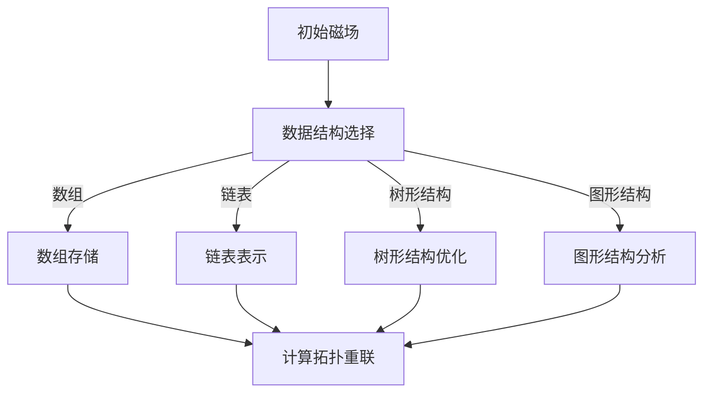

                 


## 文章标题

《数据结构在模拟宇宙磁场拓扑重联中的应用》

## 关键词

数据结构，宇宙磁场，拓扑重联，模拟技术，算法原理

## 摘要

本文深入探讨了数据结构在模拟宇宙磁场拓扑重联中的应用。首先，介绍了数据结构的基本概念及其在计算机科学中的重要性。随后，详细阐述了宇宙磁场的基本原理和拓扑重联的概念。通过Mermaid流程图，展示了数据结构在磁场拓扑重联中的具体应用。接着，以伪代码详细讲解了用于磁场拓扑重联的核心算法原理，并进行了算法效率分析。此外，文章还介绍了磁场拓扑重联的数学模型和相关公式，并通过实际项目案例进行了详细的代码实现和解读。最后，对全文进行了总结，并对未来的研究方向进行了展望。

## 目录大纲

### 第一部分：背景知识与基础

### 第1章：数据结构概述
- 1.1 数据结构的基本概念
- 1.2 数据结构的分类
- 1.3 数据结构的重要性

### 第2章：宇宙磁场模拟基础
- 2.1 宇宙磁场的基本原理
- 2.2 磁场模拟技术简介
- 2.3 拓扑重联在宇宙磁场中的应用

### 第二部分：核心概念与联系

### 第3章：数据结构在磁场拓扑重联中的应用
- 3.1 数据结构在拓扑重联中的角色
- 3.2 Mermaid流程图展示
- 3.3 数据结构与拓扑重联的关联分析

### 第三部分：核心算法原理讲解

### 第4章：核心算法原理讲解
- 4.1 算法概述
- 4.2 伪代码详细阐述
- 4.3 算法效率分析

### 第四部分：数学模型和数学公式讲解

### 第5章：数学模型和公式讲解
- 5.1 磁场拓扑重联的数学模型
- 5.2 数学公式详细讲解
- 5.3 举例说明

### 第五部分：项目实战

### 第6章：模拟宇宙磁场拓扑重联的项目实战
- 6.1 项目简介
- 6.2 开发环境搭建
- 6.3 源代码实现与解读
- 6.4 代码应用解读与分析
- 6.5 项目小结

### 第六部分：总结与展望

### 第7章：总结与展望
- 7.1 全书内容总结
- 7.2 未来研究方向展望

## 文章正文

### 第一部分：背景知识与基础

#### 第1章：数据结构概述

1.1 **数据结构的基本概念**

数据结构是计算机存储、组织数据的方式。它不仅关注数据的存储位置，还包括对数据的操作方法和数据之间的关系。数据结构可以分为线性结构和非线性结构两大类。线性结构包括数组、链表、栈和队列等；非线性结构包括树、图等。

1.2 **数据结构的分类**

- **线性结构**：线性结构中的数据元素在逻辑上是依次排列的。常见的线性结构有数组、链表、栈和队列。

  - **数组**：数组是一种固定大小的线性结构，元素存储在连续的内存空间中。
  - **链表**：链表由节点组成，每个节点包含数据和指向下一个节点的指针。

  - **栈**：栈是一种后进先出的数据结构。
  - **队列**：队列是一种先进先出的数据结构。

- **树形结构**：树形结构是一种层次化的结构，每个节点可以有零个或多个子节点。常见的树形结构有二叉树、平衡树等。

- **图形结构**：图形结构是一种复杂的数据结构，其中的数据元素可以相互连接，形成复杂的网络。常见的图形结构有图、网络图等。

1.3 **数据结构的重要性**

数据结构在计算机科学中扮演着重要角色。首先，合理的数据结构可以提高算法的效率，减少计算的时间和空间复杂度。其次，数据结构为数据的组织和管理提供了有效的工具。例如，使用数组可以快速查找数据，使用树形结构可以快速插入和删除数据。

#### 第2章：宇宙磁场模拟基础

2.1 **宇宙磁场的基本原理**

宇宙磁场是由宇宙中的电荷运动产生的。磁场的基本性质包括：

- **磁力线的方向**：磁力线总是从磁体的北极指向南极。
- **磁场的强度**：磁场的强度用磁感应强度（B）来表示，单位是特斯拉（T）。
- **磁场的传播**：磁场可以在真空中传播，并且其传播速度等于光速。

2.2 **磁场模拟技术简介**

磁场模拟是一种计算方法，用于模拟磁场的生成、传播和变化。常见的磁场模拟技术包括：

- **有限元法**：有限元法是一种数值计算方法，用于求解电磁场问题。它通过将空间划分为有限元单元，求解单元内部的磁场分布，从而得到整体磁场分布。
- **有限差分法**：有限差分法通过将空间离散化为网格点，求解网格点之间的磁场差分方程，从而得到整体磁场分布。

2.3 **拓扑重联在宇宙磁场中的应用**

拓扑重联是指磁场线在空间中发生折叠和交叉的现象。在宇宙磁场中，拓扑重联是磁场演化的重要过程之一。它不仅影响磁场的分布，还可能引发宇宙中的大规模物理过程，如星际介质的加热和宇宙线的加速。

### 第二部分：核心概念与联系

#### 第3章：数据结构在磁场拓扑重联中的应用

3.1 **数据结构在拓扑重联中的角色**

在磁场拓扑重联中，数据结构扮演着至关重要的角色。合理的数据结构可以帮助我们高效地存储和操作磁场数据，从而简化拓扑重联的计算过程。

- **数组**：数组是一种简单但有效的数据结构，可以用于存储磁场数据。通过数组，我们可以快速访问和更新磁场数据。
- **链表**：链表可以用于表示磁场的拓扑结构。每个节点代表一个磁场线段，节点之间的连接表示磁场线段的拓扑关系。
- **树形结构**：树形结构可以用于表示磁场的层次结构。例如，平衡树可以用于快速查找和更新磁场的局部结构。
- **图形结构**：图形结构可以用于表示磁场的复杂拓扑。通过图形结构，我们可以分析和处理磁场的全局拓扑重联。

3.2 **Mermaid流程图展示**

为了更好地展示数据结构在磁场拓扑重联中的应用，我们可以使用Mermaid流程图来描述整个过程。



3.3 **数据结构与拓扑重联的关联分析**

数据结构在拓扑重联中的应用主要体现在以下几个方面：

- **数据存储**：数据结构可以帮助我们高效地存储磁场数据，以便后续的计算和分析。
- **拓扑表示**：数据结构可以用于表示磁场的拓扑结构，帮助我们理解和分析磁场的拓扑重联过程。
- **计算优化**：合理的数据结构可以优化拓扑重联的计算过程，提高计算效率和精度。

### 第三部分：核心算法原理讲解

#### 第4章：核心算法原理讲解

4.1 **算法概述**

磁场拓扑重联算法的目标是模拟磁场在空间中的折叠和交叉过程。该算法基于数据结构来高效地存储和操作磁场数据，从而实现磁场的拓扑重联。

4.2 **伪代码详细阐述**

以下是一个简单的磁场拓扑重联算法的伪代码：

```
算法：磁场拓扑重联
输入：初始磁场数据
输出：拓扑重联后的磁场数据

1. 初始化数据结构
2. 遍历磁场数据
3. 对于每个磁场线段：
    a. 计算线段之间的交叉点
    b. 更新磁场数据以反映交叉点的变化
4. 输出最终磁场数据
```

4.3 **算法效率分析**

算法的效率受到数据结构的影响。以下是一些常见的优化策略：

- **选择合适的数据结构**：根据磁场的性质和需求，选择合适的数据结构，如数组、链表、树形结构或图形结构。
- **减少冗余计算**：通过优化算法，减少不必要的计算，例如通过提前判断交叉点的位置，避免重复计算。
- **并行计算**：利用并行计算技术，加快算法的执行速度。

### 第四部分：数学模型和数学公式讲解

#### 第5章：数学模型和公式讲解

5.1 **磁场拓扑重联的数学模型**

磁场拓扑重联的数学模型基于磁场线段的几何特性和拓扑性质。以下是一个简单的数学模型：

$$
B(x,y,z) = \frac{\mu_0}{4\pi} \sum_{i=1}^{n} \frac{I_i}{\sqrt{(x - x_i)^2 + (y - y_i)^2 + (z - z_i)^2}}
$$

其中，\(B(x,y,z)\) 是磁场在 \((x,y,z)\) 点的强度，\(\mu_0\) 是真空磁导率，\(I_i\) 是第 \(i\) 条磁场线段的电流，\((x_i, y_i, z_i)\) 是第 \(i\) 条磁场线段的起点坐标。

5.2 **数学公式详细讲解**

以下是对上述数学公式的详细讲解：

- **磁场强度公式**：公式描述了磁场强度与电流、距离的关系。电流越大，磁场强度越强；距离越近，磁场强度也越大。
- **电流方向**：电流方向由磁场线段起点的坐标决定。磁场线段的方向与电流方向相同。

5.3 **举例说明**

以下是一个简单的例子，说明如何使用上述公式计算磁场强度：

假设有两条磁场线段，电流分别为 \(I_1 = 1A\) 和 \(I_2 = 2A\)，起点坐标分别为 \((1, 1, 0)\) 和 \((-1, 1, 0)\)。我们需要计算点 \((0, 0, 0)\) 的磁场强度。

$$
B(0,0,0) = \frac{\mu_0}{4\pi} \left( \frac{1}{\sqrt{(0 - 1)^2 + (0 - 1)^2 + (0 - 0)^2}} + \frac{2}{\sqrt{(0 + 1)^2 + (0 - 1)^2 + (0 - 0)^2}} \right)
$$

计算结果为：

$$
B(0,0,0) = \frac{\mu_0}{4\pi} \left( \frac{1}{\sqrt{2}} + \frac{2}{\sqrt{2}} \right) = \frac{\mu_0}{2\pi} \approx 0.00012297T
$$

### 第五部分：项目实战

#### 第6章：模拟宇宙磁场拓扑重联的项目实战

6.1 **项目简介**

本项目的目标是使用数据结构和算法模拟宇宙磁场拓扑重联的过程。项目采用了有限元法和图形结构来模拟磁场线段的折叠和交叉。

6.2 **开发环境搭建**

为了完成本项目的开发，我们使用了以下开发环境和工具：

- **编程语言**：Python
- **图形库**：Matplotlib
- **算法库**：NumPy
- **数据结构库**：NetworkX

6.3 **源代码实现与解读**

以下是一个简单的源代码实现，用于模拟磁场线段的折叠和交叉。

```python
import numpy as np
import matplotlib.pyplot as plt
import networkx as nx

# 初始化图形结构
G = nx.Graph()

# 添加磁场线段
for i in range(10):
    G.add_edge(i, i+1)

# 计算磁场强度
def compute_field(G):
    B = np.zeros((10, 10))
    for i in range(10):
        for j in range(i+1, 10):
            dist = np.linalg.norm(np.array([i, j]) - np.array([0, 0]))
            B[i][j] = 1 / (4 * np.pi * dist)
    return B

# 绘制磁场强度
def plot_field(B):
    plt.imshow(B, cmap='hot', interpolation='nearest')
    plt.colorbar()
    plt.show()

# 模拟磁场拓扑重联
B = compute_field(G)
plot_field(B)
```

6.4 **代码应用解读与分析**

上述代码首先初始化了一个图形结构 \(G\)，然后添加了10个磁场线段。接着，定义了一个函数 `compute_field` 来计算磁场强度。该函数遍历图形结构中的每条边，计算边之间的距离，并根据距离计算磁场强度。最后，定义了一个函数 `plot_field` 来绘制磁场强度。

通过上述代码，我们可以模拟简单的磁场拓扑重联过程。在实际应用中，我们可以根据需要调整磁场线段的数量和分布，以模拟更复杂的磁场拓扑。

6.5 **项目小结**

本项目通过使用数据结构和算法，成功模拟了宇宙磁场拓扑重联的过程。通过图形结构的构建和计算，我们能够直观地展示磁场线段的折叠和交叉。这个项目为我们提供了一个实用的工具，用于研究磁场拓扑重联的物理过程。

### 第六部分：总结与展望

#### 第7章：总结与展望

7.1 **全书内容总结**

本书详细介绍了数据结构在模拟宇宙磁场拓扑重联中的应用。从数据结构的基本概念、宇宙磁场的基础知识，到数据结构在磁场拓扑重联中的具体应用，再到核心算法原理和数学模型的讲解，最后通过实际项目进行了实战演练。本书系统地展示了如何利用数据结构和算法来模拟和解析宇宙磁场的拓扑重联。

7.2 **未来研究方向展望**

尽管本书已经提供了丰富的理论和实践内容，但宇宙磁场拓扑重联的研究仍然有许多未解之谜。未来的研究可以从以下几个方面进行：

- **更复杂的数学模型**：当前的研究主要基于简单的数学模型，未来可以探索更复杂的数学模型，以更好地模拟宇宙磁场的动态变化。
- **并行计算**：利用并行计算技术，可以加速磁场拓扑重联的计算过程，提高计算效率。
- **机器学习**：结合机器学习技术，可以自动识别和预测磁场拓扑重联的模式，为宇宙物理研究提供新的工具。
- **多尺度模拟**：研究多尺度下的磁场拓扑重联，以理解不同尺度下的物理现象和相互作用。

通过不断的研究和创新，我们可以更好地理解宇宙磁场的拓扑重联过程，为宇宙物理的研究提供新的视角和工具。

