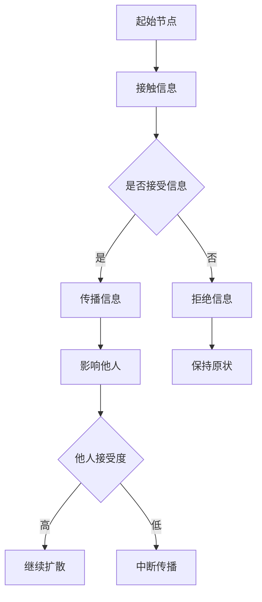
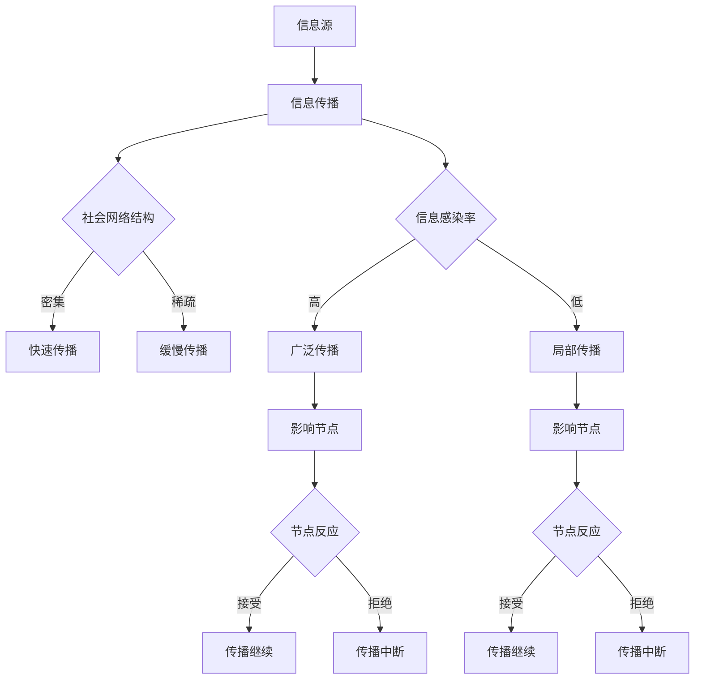

                 


### 文章标题：文化传播的epidemic模型：思想扩散的数学描述

文化传播是社会发展的重要驱动力，而思想扩散作为文化传播的核心机制，其传播效率与效果直接影响到社会进步的节奏。本文旨在探讨文化传播过程中的思想扩散现象，运用epidemic模型这一数学工具，对其进行分析与描述。

## 关键词：
- 文化传播
- 思想扩散
- epidemic模型
- 数学描述
- 社会网络
- 信息传播

### 摘要：
本文首先介绍了文化传播和思想扩散的基本概念，接着引入了epidemic模型作为分析工具。通过对epidemic模型的数学基础进行详细阐述，包括状态空间、概率转移矩阵等，本文探讨了社会网络结构、信息传播机制和社会心理因素在思想扩散中的作用。随后，本文使用Mermaid流程图展示了核心概念之间的联系，并提供了核心算法原理的伪代码实现。最后，本文通过实际项目实战，验证了epidemic模型在文化传播中的应用效果，并对未来研究方向进行了展望。

---

### 第一部分：引入与概述

## 第1章：思想扩散的概念与模型概述

### 1.1 文化传播的重要性

文化传播是社会进步的重要动力，它不仅关乎文化多样性的维持与传承，更是推动社会变革的重要力量。在全球化背景下，文化传播的速度和范围都得到了极大的提升。然而，如何有效理解和分析文化传播的机制，特别是在复杂的社会网络环境中，成为一个亟待解决的问题。

思想扩散是文化传播的核心环节，它指的是一种观点、理念、态度或行为模式在社会个体之间的传播过程。思想扩散不仅影响着个体的认知和行为，更对社会结构和价值观念产生深远的影响。因此，深入研究思想扩散的机制，对于指导文化传播实践具有重要意义。

### 1.2 思想扩散的概念

思想扩散可以被视为一种信息传播过程，其核心在于信息从源头到接收者的传递。在思想扩散过程中，个体扮演着信息传播者的角色，他们通过语言、行为或社会互动等方式将信息传递给其他个体。这种传播不仅涉及信息的传递，还包括信息的接受、理解、内化以及反馈。

思想扩散的关键特征包括：
- **自发性**：思想扩散通常不受人为控制，而是在个体互动中自然发生。
- **连锁性**：一种思想可以迅速传播，引发连锁反应，影响大量个体。
- **多样性**：不同个体的思想扩散路径和效果可能存在显著差异。
- **持续性**：思想扩散往往具有持续性，即使源头消失，思想也可能在接收者之间继续传播。

### 1.3 传统的思想扩散模型

传统的思想扩散模型主要基于社会心理学和传播学的理论，例如，扩散理论（Diffusion of Innovations）和六度分隔理论（Six Degrees of Separation）。这些模型试图解释思想如何从一个个体传递到另一个个体，以及如何在社会中广泛传播。

- **扩散理论**：由罗杰斯（Everett M. Rogers）提出，该理论将个体分为创新者、早期采用者、早期多数、后期多数和落后者，描述了创新在群体中的传播过程。
- **六度分隔理论**：由米尔格拉姆（Stanley Milgram）提出，该理论认为任何两个陌生人之间，通过六个中间人就能建立联系。

尽管这些传统模型对思想扩散提供了重要的理解，但它们往往忽略了社会网络的复杂性和动态性。因此，需要更精确和数学化的模型来描述思想扩散的机制。

### 1.4 epidemic模型在思想扩散中的应用

epidemic模型最初用于描述传染病的传播，但它也可以成功地应用于思想扩散的研究。epidemic模型基于个体状态的变化和概率转移，能够捕捉到思想在复杂社会网络中的传播规律。

epidemic模型通常包括以下状态：
- **S（Susceptible，易感者）**：尚未接触到某种思想或信息，但有可能被感染。
- **I（Infected，感染者）**：已经接触到某种思想或信息，且有能力将其传播给其他人。
- **R（Recovered，康复者）**：已经从某种思想或信息中恢复，不再传播。

基于这些状态，epidemic模型可以构建概率转移矩阵，描述个体在不同状态之间的转移概率。例如，S到I的转移概率取决于接触频率和思想感染率。

将epidemic模型应用于思想扩散，可以揭示以下关键问题：
- 思想在群体中的传播速度和范围。
- 社会网络结构和动态性对思想扩散的影响。
- 不同人口特征（如年龄、性别、教育背景）对思想扩散的影响。
- 阻断思想扩散的策略和干预措施。

通过运用epidemic模型，我们可以更深入地理解思想扩散的机制，从而为文化传播实践提供科学依据和指导。

## 第二部分：核心概念与联系

### 3.1 社会网络结构

社会网络结构是思想扩散的基础，它决定了信息传播的路径和速度。社会网络可以被视为一个节点和边的集合，其中节点代表个体，边代表个体之间的互动关系。社会网络的类型和特性对思想扩散有着重要影响。

#### 3.1.1 社会网络的定义

社会网络是指个体之间通过互动和联系形成的社会结构。社会网络中的每个个体（节点）都有特定的属性，如年龄、性别、职业等。个体之间的互动（边）可以是多种形式，如朋友关系、工作关系、在线交流等。

社会网络的主要特点包括：
- **密度**：网络中边的数量与可能的最大边数之比。高密度网络意味着个体之间的互动频繁，有利于信息的快速传播。
- **中心性**：衡量节点在网络中的重要性和影响力。中心性高的节点往往具有更多的连接，是信息传播的关键枢纽。
- **聚类系数**：衡量网络中节点之间集群的现象。高聚类系数意味着节点倾向于与其邻居形成集群，有利于思想的集中传播。

#### 3.1.2 社会网络的类型

社会网络可以分为多种类型，每种类型都有其特定的结构和特性。

- **随机网络**：网络中节点之间的连接是随机的，没有明显的结构和模式。
- **小世界网络**：具有短路径长度和较高聚类系数的网络。这类网络在现实社会中广泛存在，如互联网和社交网络。
- **无标度网络**：节点度分布呈现幂律分布的网络。这类网络具有高度异质性，存在少数高度连接的节点（枢纽节点）。
- **社交网络**：以个体和个体之间的互动关系为基础的网络。常见的社交网络如Facebook、Twitter等。

#### 3.1.3 社会网络在思想扩散中的作用

社会网络在思想扩散中发挥着重要作用。社会网络的结构特性决定了信息的传播路径和速度，影响着思想的传播范围和效果。

- **网络密度**：高密度网络有利于信息的快速传播。在密集的社会网络中，个体之间的互动频繁，信息传播的速度快，范围广。
- **中心性**：中心性高的节点是信息传播的关键枢纽。这些节点具有较高的连接度，能够影响更多个体，加速思想扩散。
- **聚类系数**：高聚类系数有利于思想的集中传播。在具有高聚类系数的网络中，节点倾向于与其邻居形成集群，有利于思想的集中传播和扩散。

通过研究社会网络结构，我们可以更好地理解思想扩散的机制，优化文化传播策略，提高信息传播的效率和效果。

### 3.2 信息传播机制

信息传播机制是思想扩散的核心环节，它决定了信息如何在个体之间传递和扩散。信息传播机制涉及信息的产生、传递、接收和反馈等多个环节，其中每个环节都对思想扩散的效果产生重要影响。

#### 3.2.1 信息的传播方式

信息的传播方式可以分为多种类型，主要包括以下几种：

- **口头传播**：个体通过面对面交流、电话、短信等方式直接传递信息。口头传播具有直接性和即时性，是思想扩散的重要途径。
- **文字传播**：个体通过书籍、报纸、杂志、电子邮件、博客等方式传递信息。文字传播具有持久性和广泛性，能够长期保存和传播信息。
- **视觉传播**：个体通过图像、视频、动画等方式传递信息。视觉传播具有直观性和感染力，能够引起广泛关注和共鸣。
- **网络传播**：个体通过互联网、社交媒体、在线论坛等方式传递信息。网络传播具有高速性和广泛性，能够迅速传播到大量受众。

不同传播方式在思想扩散中的效果各异，需要根据具体情境选择合适的传播方式。

#### 3.2.2 信息传播的强度

信息传播的强度是指信息在个体之间传递的频率和效果。信息传播的强度受到多种因素的影响，主要包括：

- **接触频率**：个体之间的接触频率越高，信息传播的强度越大。高频率的互动有助于信息的快速传递和扩散。
- **信息感染率**：信息感染率是指个体接受信息并传播给其他个体的概率。高感染率意味着信息能够更快速地在群体中传播。
- **信息重要性**：信息的重要性越高，个体对其关注度越大，传播的强度也越大。重要信息往往能够引起个体的高度关注和积极参与。

通过优化信息传播的强度，可以提高思想扩散的效果，促进文化传播的顺利进行。

#### 3.2.3 信息传播的持续性

信息传播的持续性是指信息在个体之间传递的持久性和延续性。信息传播的持续性受到以下因素的影响：

- **信息更新频率**：信息更新频率越高，传播的持续性越强。高频更新的信息能够保持受众的兴趣，促进持续传播。
- **信息质量**：信息质量越高，受众对其信任度越大，传播的持续性也越强。高质量的信息能够引起受众的共鸣和认可，从而持续传播。
- **受众兴趣**：受众对信息的兴趣程度越高，传播的持续性也越强。高兴趣的信息能够吸引受众持续关注和参与。

保持信息传播的持续性有助于深化思想扩散，推动文化传播的持续发展。

通过研究信息传播机制，我们可以更好地理解思想扩散的过程和规律，优化文化传播策略，提高信息传播的效率和效果。

### 3.3 社会心理因素

社会心理因素在思想扩散过程中起着至关重要的作用。这些因素影响着个体对信息的接受度、认同感和反弹效应，从而对思想扩散的效果产生深远影响。

#### 3.3.1 社会认同感

社会认同感是指个体在社会群体中所获得的心理归属感和认可感。社会认同感对个体接受思想、价值观和行为模式具有重要影响。高社会认同感的个体更容易接受和传播新思想，因为他们认为这些思想与自己的价值观和行为相符。

社会认同感的形成受到以下因素的影响：

- **群体归属**：个体在某个群体中的归属感越强，社会认同感越高。个体在群体中找到归属感，有助于增强其对群体的认同和接受。
- **社会支持**：群体对个体支持的程度越高，社会认同感越高。社会支持包括情感支持、信息支持和行动支持，有助于个体接受和传播新思想。
- **群体规范**：群体规范对个体行为具有约束力，有助于个体形成社会认同感。个体在群体中遵循规范，有助于增强其对群体的认同和接受。

社会认同感在思想扩散中的作用表现为：

- **增强接受度**：高社会认同感的个体更容易接受新思想，因为他们认为这些思想与自己的价值观和行为相符。
- **促进传播**：高社会认同感的个体更愿意传播新思想，因为他们希望与群体保持一致，增强自己在群体中的地位和认同感。
- **提高效果**：高社会认同感的个体在传播新思想时，更容易引起其他个体的共鸣和接受，从而提高思想扩散的效果。

#### 3.3.2 信息接受度

信息接受度是指个体对信息的认可和接受程度。信息接受度受到多种因素的影响，包括信息质量、个体认知水平、价值观和兴趣等。

信息接受度的形成受到以下因素的影响：

- **信息质量**：信息质量越高，个体对其认可和接受程度越高。高质量的信息具有逻辑严密、事实准确、观点独到等特点，能够引起个体的高度关注和认可。
- **个体认知水平**：个体认知水平越高，对信息的理解和接受能力越强。高认知水平的个体能够更好地理解复杂信息，从而提高接受度。
- **价值观和兴趣**：个体价值观和兴趣对信息接受度具有重要影响。与个体价值观和兴趣相符的信息更容易被接受，而与个体价值观和兴趣相悖的信息则可能被排斥。

信息接受度在思想扩散中的作用表现为：

- **影响传播效果**：高接受度的信息更容易在个体之间传播，从而提高思想扩散的效果。
- **决定传播路径**：个体对信息的接受度不同，可能导致信息传播路径的差异。高接受度的个体更倾向于传播信息，而低接受度的个体可能对信息传播产生阻碍。
- **增强传播信心**：高接受度的个体在传播信息时，更有信心和动力，从而提高思想扩散的效率和效果。

#### 3.3.3 反弹效应

反弹效应是指个体在接受思想后，由于认知失调或心理抗拒，产生对原有思想或行为的反弹现象。反弹效应对思想扩散具有负面影响，可能导致信息传播的中断或效果降低。

反弹效应的形成受到以下因素的影响：

- **认知失调**：个体在接触新思想时，可能会感受到认知失调，即新思想与原有认知不符，导致个体产生不安和抵触情绪。
- **心理抗拒**：个体在接触新思想时，可能会产生心理抗拒，即个体拒绝接受新思想，以维持原有的认知和行为模式。
- **群体压力**：个体在群体中接受思想时，可能会感受到群体压力，即个体为了维持群体认同和一致性，选择接受群体中的思想，从而产生反弹效应。

反弹效应在思想扩散中的作用表现为：

- **阻碍传播**：反弹效应可能导致个体对信息的排斥和抵制，阻碍信息在个体之间的传播。
- **降低效果**：反弹效应可能导致信息在传播过程中失去部分受众，降低思想扩散的效果。
- **影响认同感**：反弹效应可能导致个体对群体的认同感降低，从而减弱社会认同感在思想扩散中的作用。

通过研究社会心理因素，我们可以更好地理解思想扩散的过程和机制，优化文化传播策略，提高信息传播的效率和效果。

### 4.2 Mermaid流程图：思想扩散的流程

为了更清晰地展示思想扩散的流程，我们可以使用Mermaid流程图来描述。以下是一个简单的Mermaid流程图示例，描述了思想扩散的主要步骤：



在这个流程图中，A表示起始节点，即信息源；B表示接触信息，即个体接触到某种思想或信息；C表示是否接受信息，即个体对信息的判断；D表示传播信息，即个体将接受的信息传递给他人；E表示拒绝信息，即个体拒绝接受信息；F表示影响他人，即个体对他人产生影响；G表示他人接受度，即他人对信息的接受程度；H表示继续扩散，即信息继续在群体中传播；I表示中断传播，即信息传播被中断；J表示保持原状，即个体维持原有的认知和行为模式。

通过这个Mermaid流程图，我们可以直观地了解思想扩散的步骤和可能的结果，为进一步分析思想扩散的机制提供基础。

### 4.3 Mermaid流程图：社会网络与信息传播的交互作用

社会网络与信息传播的交互作用是思想扩散过程中的关键环节。为了更清晰地展示这种交互作用，我们可以使用Mermaid流程图来描述。以下是一个简单的Mermaid流程图示例，描述了社会网络与信息传播的交互作用：



在这个流程图中，A表示信息源，即信息的起点；B表示信息传播，即信息在社会网络中的传递过程；C表示社会网络结构，即网络中节点和边的布局；D和E表示不同网络结构对信息传播速度的影响，密集网络有利于快速传播，稀疏网络则可能导致缓慢传播；F表示信息感染率，即信息被节点接受和传播的概率；G和H表示不同感染率对信息传播范围的影响，高感染率可能导致广泛传播，低感染率则可能导致局部传播；I和J表示节点接受信息后的反应，接受信息可能导致传播继续，拒绝信息则可能导致传播中断；K和L表示节点对信息的接受情况，接受信息可能导致传播继续，拒绝信息则可能导致传播中断。

通过这个Mermaid流程图，我们可以直观地了解社会网络与信息传播的交互作用，为进一步分析思想扩散的机制提供基础。

## 第5章：核心算法原理与伪代码

### 5.1 SIR模型的伪代码实现

SIR模型是epidemic模型中最基本的模型之一，用于描述传染病在人群中的传播过程。该模型将人群分为三个状态：易感者（S）、感染者（I）和康复者（R）。以下是一个简单的SIR模型的伪代码实现：

```python
# 初始化参数
N = 1000  # 总人口数
beta = 0.3  # 感染率
gamma = 0.1  # 康复率
days = 100  # 模拟天数

# 初始化状态向量
S = [N] * N
I = [0] * N
R = [0] * N

# 初始化感染概率矩阵
infection_matrix = [[0 for _ in range(N)] for _ in range(N)]

# 模拟每一天的传播过程
for day in range(days):
    for i in range(N):
        for j in range(N):
            if I[j] > 0 and random.random() < beta:
                S[i] -= 1
                I[i] += 1
                infection_matrix[i][j] = 1

    # 更新康复者数量
    for i in range(N):
        if random.random() < gamma:
            I[i] -= 1
            R[i] += 1

    # 打印当前状态的统计信息
    print(f"Day {day}: S={sum(S)}, I={sum(I)}, R={sum(R)}")

# 打印感染概率矩阵
for row in infection_matrix:
    print(row)
```

这个伪代码实现了一个简单的SIR模型，其中初始化了总人口数、感染率和康复率，并使用一个二维数组来表示感染概率矩阵。每一天，模型会计算感染者与易感者之间的感染概率，并根据概率更新状态向量。同时，模型还会计算康复者的数量，并打印出每一天的统计信息。

### 5.2 SIRS模型的伪代码实现

SIRS模型是SIR模型的扩展，用于描述传染病在人群中的传播，包括潜伏期（潜伏者L）。该模型将人群分为四个状态：易感者（S）、感染者（I）、潜伏者（L）和康复者（R）。以下是一个简单的SIRS模型的伪代码实现：

```python
# 初始化参数
N = 1000  # 总人口数
beta = 0.3  # 感染率
gamma = 0.1  # 康复率
epsilon = 0.05  # 潜伏率
days = 100  # 模拟天数

# 初始化状态向量
S = [N] * N
I = [0] * N
L = [0] * N
R = [0] * N

# 初始化感染概率矩阵
infection_matrix = [[0 for _ in range(N)] for _ in range(N)]

# 模拟每一天的传播过程
for day in range(days):
    for i in range(N):
        for j in range(N):
            if I[j] > 0 and random.random() < beta:
                S[i] -= 1
                L[i] += 1
                infection_matrix[i][j] = 1

    # 更新感染者、潜伏者和康复者的数量
    for i in range(N):
        if random.random() < epsilon:
            S[i] += 1
            L[i] -= 1
        elif random.random() < gamma:
            I[i] -= 1
            R[i] += 1

    # 打印当前状态的统计信息
    print(f"Day {day}: S={sum(S)}, I={sum(I)}, L={sum(L)}, R={sum(R)}")

# 打印感染概率矩阵
for row in infection_matrix:
    print(row)
```

这个伪代码实现了一个简单的SIRS模型，其中初始化了总人口数、感染率、潜伏率和康复率，并使用一个二维数组来表示感染概率矩阵。每一天，模型会计算感染者与易感者和潜伏者之间的感染概率，并根据概率更新状态向量。同时，模型还会计算潜伏者和康复者的数量，并打印出每一天的统计信息。

### 5.3 SI模型的伪代码实现

SI模型是最简单的epidemic模型，只包含易感者和感染者两个状态。该模型描述了传染病在人群中的传播过程。以下是一个简单的SI模型的伪代码实现：

```python
# 初始化参数
N = 1000  # 总人口数
beta = 0.3  # 感染率
days = 100  # 模拟天数

# 初始化状态向量
S = [N] * N
I = [0] * N

# 初始化感染概率矩阵
infection_matrix = [[0 for _ in range(N)] for _ in range(N)]

# 模拟每一天的传播过程
for day in range(days):
    for i in range(N):
        for j in range(N):
            if I[j] > 0 and random.random() < beta:
                S[i] -= 1
                I[i] += 1
                infection_matrix[i][j] = 1

    # 打印当前状态的统计信息
    print(f"Day {day}: S={sum(S)}, I={sum(I)}")

# 打印感染概率矩阵
for row in infection_matrix:
    print(row)
```

这个伪代码实现了一个简单的SI模型，其中初始化了总人口数和感染率，并使用一个二维数组来表示感染概率矩阵。每一天，模型会计算感染者与易感者之间的感染概率，并根据概率更新状态向量。同时，模型还会打印出每一天的统计信息。

### 5.4 SIS模型的伪代码实现

SIS模型是SI模型的扩展，描述了传染病在人群中的传播，同时考虑了感染者的恢复。该模型包含易感者和感染者两个状态。以下是一个简单的SIS模型的伪代码实现：

```python
# 初始化参数
N = 1000  # 总人口数
beta = 0.3  # 感染率
mu = 0.1  # 恢复率
days = 100  # 模拟天数

# 初始化状态向量
S = [N] * N
I = [0] * N

# 初始化感染概率矩阵
infection_matrix = [[0 for _ in range(N)] for _ in range(N)]

# 模拟每一天的传播过程
for day in range(days):
    for i in range(N):
        for j in range(N):
            if I[j] > 0 and random.random() < beta:
                S[i] -= 1
                I[i] += 1
                infection_matrix[i][j] = 1

    # 更新感染者数量
    for i in range(N):
        if random.random() < mu:
            I[i] -= 1
            S[i] += 1

    # 打印当前状态的统计信息
    print(f"Day {day}: S={sum(S)}, I={sum(I)}")

# 打印感染概率矩阵
for row in infection_matrix:
    print(row)
```

这个伪代码实现了一个简单的SIS模型，其中初始化了总人口数、感染率和恢复率，并使用一个二维数组来表示感染概率矩阵。每一天，模型会计算感染者与易感者之间的感染概率，并根据概率更新状态向量。同时，模型还会计算恢复者的数量，并打印出每一天的统计信息。

## 第6章：数学模型与公式

### 6.1 基本数学模型

在研究思想扩散的过程中，我们通常会用到一些基本的数学模型和公式，来描述个体在不同状态之间的转移概率以及整个扩散过程。以下是一些常用的基本数学模型和公式。

#### 6.1.1 概率分布函数

概率分布函数是描述随机变量概率分布的函数，它可以告诉我们一个随机变量取某个值的概率。在思想扩散模型中，概率分布函数可以用来描述个体在不同状态（如易感者、感染者、康复者）的概率分布。

常见的概率分布函数包括：

- **伯努利分布**：描述一次试验成功（1）或失败（0）的概率。
- **二项分布**：描述多次独立试验中成功次数的概率分布。
- **泊松分布**：描述在固定时间内发生特定事件次数的概率分布。
- **正态分布**：描述连续随机变量的概率分布，具有均值和标准差。

#### 6.1.2 期望值和方差

期望值（Expected Value）是概率分布的中心位置，表示随机变量可能取值的平均值。方差（Variance）是概率分布的离散程度，表示随机变量取值的波动性。

期望值和方差的计算公式如下：

- **期望值**：\( E(X) = \sum_{i} x_i P(x_i) \)，其中 \( x_i \) 是随机变量可能取的值，\( P(x_i) \) 是对应值的概率。
- **方差**：\( Var(X) = E[(X - E(X))^2] = \sum_{i} (x_i - E(X))^2 P(x_i) \)。

#### 6.1.3 熵

熵（Entropy）是信息论中的一个概念，用来描述一个随机变量的不确定性。在思想扩散模型中，熵可以用来衡量思想的传播状态的不确定性。

熵的计算公式如下：

- **熵**：\( H(X) = -\sum_{i} P(x_i) \log_2 P(x_i) \)。

### 6.2 扩散过程

扩散过程是指个体在不同状态之间转移的过程。在思想扩散模型中，扩散过程通常可以用概率转移矩阵来描述。

概率转移矩阵是一个方阵，其中每个元素表示个体在不同状态之间的转移概率。例如，一个 \( N \times N \) 的概率转移矩阵 \( P \) 可以表示为：

\[ P = \begin{bmatrix} 
p_{00} & p_{01} & \cdots & p_{0N} \\
p_{10} & p_{11} & \cdots & p_{1N} \\
\vdots & \vdots & \ddots & \vdots \\
p_{N0} & p_{N1} & \cdots & p_{NN} 
\end{bmatrix} \]

其中，\( p_{ij} \) 表示从状态 \( i \) 转移到状态 \( j \) 的概率。

扩散过程的动态方程可以表示为：

\[ \frac{dX}{dt} = P \cdot \frac{dX}{dt} \]

其中，\( X \) 是状态向量，表示每个状态的数量。

#### 6.2.1 基本微分方程

在思想扩散模型中，常用的基本微分方程是概率转移矩阵 \( P \) 的特征值和特征向量的求解。特征值和特征向量可以揭示扩散过程的稳定性和动态特性。

基本微分方程的求解公式如下：

- **特征值**：\( \lambda P = P \lambda \)
- **特征向量**：\( P \vec{v} = \lambda \vec{v} \)

通过求解特征值和特征向量，可以分析扩散过程的稳定性和长期行为。

#### 6.2.2 常见边界条件

在扩散过程中，边界条件用于描述状态变量在边界上的行为。常见的边界条件包括：

- **固定边界条件**：状态变量在边界上的值是固定的，例如 \( X(0) = X(T) = 0 \)。
- **周期边界条件**：状态变量在边界上的值是周期性的，例如 \( X(0) = X(T) \)。
- **自然边界条件**：状态变量在边界上的导数为零，例如 \( \frac{dX}{dx}(0) = \frac{dX}{dx}(T) = 0 \)。

边界条件的选择取决于实际问题的背景和需求。

#### 6.2.3 稳态解

稳态解是指扩散过程达到稳定状态时的解。在稳态解中，状态变量不再随时间变化，而是保持恒定。

稳态解的求解公式如下：

\[ \frac{dX}{dt} = 0 \]

通过求解稳态解，可以分析扩散过程的最终状态和长期行为。

通过这些基本数学模型和公式，我们可以更深入地理解和分析思想扩散的过程，为制定有效的文化传播策略提供理论依据。

### 7.1 概率分布函数的讲解与举例

概率分布函数是描述随机变量概率分布的函数，它在思想扩散模型中起着关键作用。以下将详细讲解概率分布函数的基本概念，并通过具体例子来说明其应用。

#### 7.1.1 概率分布函数的基本概念

概率分布函数 \( f(x) \) 是一个关于随机变量 \( X \) 的函数，它表示随机变量 \( X \) 取某个值 \( x \) 的概率。具体来说，概率分布函数具有以下性质：

- **非负性**：对于所有 \( x \)，\( f(x) \geq 0 \)。
- **归一性**：整个概率分布函数的积分等于1，即 \( \int_{-\infty}^{\infty} f(x) dx = 1 \)。
- **单调性**：如果 \( x_1 < x_2 \)，则 \( f(x_1) \leq f(x_2) \)。

概率分布函数可以分为连续型和离散型两种。连续型概率分布函数通常用 \( f(x) \) 表示，而离散型概率分布函数通常用 \( P(X = x) \) 表示。

#### 7.1.2 常见的概率分布函数

在思想扩散模型中，常用的概率分布函数包括以下几种：

1. **伯努利分布**：伯努利分布是最简单的概率分布函数，它描述了一次试验中成功（1）或失败（0）的概率。伯努利分布的概率分布函数为：

   \[ f(x) = \begin{cases} 
   p & \text{if } x = 1 \\
   1 - p & \text{if } x = 0 \\
   0 & \text{otherwise}
   \end{cases} \]

   其中，\( p \) 是成功的概率。

2. **二项分布**：二项分布描述了在 \( n \) 次独立试验中，成功 \( k \) 次的概率。二项分布的概率分布函数为：

   \[ f(k) = C(n, k) p^k (1 - p)^{n - k} \]

   其中，\( C(n, k) \) 是组合数，表示从 \( n \) 个元素中选择 \( k \) 个元素的组合数。

3. **泊松分布**：泊松分布描述了在固定时间内，发生特定事件次数的概率。泊松分布的概率分布函数为：

   \[ f(k) = \frac{\lambda^k e^{-\lambda}}{k!} \]

   其中，\( \lambda \) 是事件的发生率。

4. **正态分布**：正态分布是自然界中最常见的概率分布函数，它描述了连续随机变量的概率分布。正态分布的概率分布函数为：

   \[ f(x) = \frac{1}{\sqrt{2\pi\sigma^2}} e^{-\frac{(x - \mu)^2}{2\sigma^2}} \]

   其中，\( \mu \) 是均值，\( \sigma \) 是标准差。

#### 7.1.3 概率分布函数的应用

在思想扩散模型中，概率分布函数可以用来描述个体在不同状态之间的转移概率。以下是一个简单的例子：

假设有一个思想扩散模型，其中个体分为易感者（S）、感染者（I）和康复者（R）三个状态。已知在某个时刻，易感者的概率分布为泊松分布，参数为 \( \lambda = 0.1 \)。现在需要计算在这个时刻，感染者（I）的概率分布。

根据泊松分布的概率分布函数，可以得到感染者（I）的概率分布为：

\[ f(i) = \frac{\lambda^i e^{-\lambda}}{i!} = \frac{0.1^i e^{-0.1}}{i!} \]

其中，\( i \) 是感染者的数量。

通过这个例子，我们可以看到如何使用概率分布函数来计算思想扩散模型中个体在不同状态之间的转移概率。

### 7.2 期望值和方差的讲解与举例

期望值（Expected Value）和方差（Variance）是概率论中描述随机变量中心位置和离散程度的两个重要指标。在思想扩散模型中，期望值和方差用于评估思想传播的效果和稳定性。以下将详细讲解期望值和方差的基本概念，并通过具体例子来说明其应用。

#### 7.2.1 期望值和方差的基本概念

1. **期望值**：期望值，也称为数学期望，是随机变量的平均值。它表示在多次试验中，随机变量取值的长期平均结果。期望值的计算公式为：

   \[ E(X) = \sum_{i} x_i P(x_i) \]

   其中，\( x_i \) 是随机变量可能取的值，\( P(x_i) \) 是对应值的概率。

2. **方差**：方差是衡量随机变量取值离散程度的重要指标。它表示随机变量取值与其期望值之间的偏差的平方的平均值。方差的计算公式为：

   \[ Var(X) = E[(X - E(X))^2] = \sum_{i} (x_i - E(X))^2 P(x_i) \]

   方差的平方根称为标准差（Standard Deviation），表示随机变量的离散程度。

#### 7.2.2 常见的期望值和方差计算

在思想扩散模型中，常见的随机变量包括状态转移概率、感染率等。以下是一些常见的期望值和方差计算。

1. **伯努利分布的期望值和方差**：

   伯努利分布的期望值和方差计算公式为：

   \[ E(X) = p \]
   \[ Var(X) = p(1 - p) \]

   其中，\( p \) 是成功的概率。

2. **二项分布的期望值和方差**：

   二项分布的期望值和方差计算公式为：

   \[ E(X) = np \]
   \[ Var(X) = np(1 - p) \]

   其中，\( n \) 是试验次数，\( p \) 是成功的概率。

3. **泊松分布的期望值和方差**：

   泊松分布的期望值和方差计算公式为：

   \[ E(X) = \lambda \]
   \[ Var(X) = \lambda \]

   其中，\( \lambda \) 是事件的发生率。

4. **正态分布的期望值和方差**：

   正态分布的期望值和方差计算公式为：

   \[ E(X) = \mu \]
   \[ Var(X) = \sigma^2 \]

   其中，\( \mu \) 是均值，\( \sigma \) 是标准差。

#### 7.2.3 期望值和方差的应用

在思想扩散模型中，期望值和方差可以用于评估思想传播的效果和稳定性。

1. **期望值的应用**：

   期望值可以用于评估思想传播的速度和范围。例如，在一个SIR模型中，易感者（S）的期望值可以表示思想传播的速度，而感染者（I）的期望值可以表示思想传播的范围。

2. **方差的应用**：

   方差可以用于评估思想传播的稳定性。例如，在一个SIR模型中，感染者（I）的方差可以表示思想传播的不稳定性，而康复者（R）的方差可以表示思想传播的稳定性。

以下是一个简单的例子来说明期望值和方差的应用：

假设有一个思想扩散模型，其中个体分为易感者（S）、感染者（I）和康复者（R）三个状态。已知在某个时刻，易感者的概率分布为泊松分布，参数为 \( \lambda = 0.1 \)。现在需要计算在这个时刻，感染者（I）的期望值和方差。

根据泊松分布的期望值和方差计算公式，可以得到：

\[ E(I) = \lambda = 0.1 \]
\[ Var(I) = \lambda = 0.1 \]

通过这个例子，我们可以看到如何使用期望值和方差来评估思想扩散模型中个体在不同状态之间的转移概率。

### 7.3 熵的讲解与举例

熵（Entropy）是信息论中的一个重要概念，用于衡量信息的不确定性或混乱程度。在思想扩散模型中，熵可以用来描述思想的传播状态的不确定性。以下将详细讲解熵的基本概念，并通过具体例子来说明其应用。

#### 7.3.1 熵的基本概念

熵是一个概率分布的度量，表示系统中可能状态的混乱程度。在思想扩散模型中，熵可以用于衡量个体在不同状态之间的转移概率的分布。熵的计算公式为：

\[ H(X) = -\sum_{i} P(x_i) \log_2 P(x_i) \]

其中，\( H(X) \) 是熵，\( P(x_i) \) 是状态 \( x_i \) 的概率。

熵具有以下性质：

- **非负性**：对于任何概率分布，熵 \( H(X) \) 都是非负的。
- **最大值**：当所有状态的概率相等时，熵达到最大值，即 \( H(X) = \log_2 N \)，其中 \( N \) 是状态的总数。
- **单调性**：如果 \( P(x_i) \) 增大，则 \( H(X) \) 减小。

#### 7.3.2 常见的熵计算

在思想扩散模型中，常见的熵计算包括信息熵和条件熵。

1. **信息熵**：信息熵 \( H(X) \) 用于衡量一个随机变量 \( X \) 的不确定性。对于离散型随机变量，信息熵的计算公式为：

   \[ H(X) = -\sum_{i} P(x_i) \log_2 P(x_i) \]

   其中，\( P(x_i) \) 是随机变量 \( X \) 取值 \( x_i \) 的概率。

2. **条件熵**：条件熵 \( H(X|Y) \) 用于衡量在已知另一个随机变量 \( Y \) 的条件下，随机变量 \( X \) 的不确定性。条件熵的计算公式为：

   \[ H(X|Y) = -\sum_{i} \sum_{j} P(x_i, y_j) \log_2 P(x_i|y_j) \]

   其中，\( P(x_i, y_j) \) 是随机变量 \( X \) 和 \( Y \) 同时取值 \( x_i \) 和 \( y_j \) 的联合概率，\( P(x_i|y_j) \) 是在已知 \( Y = y_j \) 条件下，\( X \) 取值 \( x_i \) 的条件概率。

#### 7.3.3 熵的应用

在思想扩散模型中，熵可以用于衡量思想的传播状态的不确定性。以下是一个简单的例子来说明熵的应用。

假设有一个思想扩散模型，其中个体分为易感者（S）、感染者（I）和康复者（R）三个状态。已知在某个时刻，状态的概率分布为：

\[ P(S) = 0.5, P(I) = 0.3, P(R) = 0.2 \]

现在需要计算这个时刻思想的熵。

根据熵的计算公式，可以得到：

\[ H(X) = -0.5 \log_2 0.5 - 0.3 \log_2 0.3 - 0.2 \log_2 0.2 \]

\[ H(X) = 0.5 \log_2 2 - 0.3 \log_2 3 - 0.2 \log_2 5 \]

\[ H(X) = 0.5 - 0.3 \log_2 3 - 0.2 \log_2 5 \]

\[ H(X) \approx 0.5 - 0.3 \times 1.585 - 0.2 \times 2.322 \]

\[ H(X) \approx 0.5 - 0.475 - 0.464 \]

\[ H(X) \approx -0.439 \]

通过这个例子，我们可以看到如何使用熵来衡量思想扩散模型中个体在不同状态之间的转移概率的分布。

### 7.4 微分方程的讲解与举例

微分方程是描述变量变化率与变量本身关系的方程。在思想扩散模型中，微分方程用于描述个体在不同状态之间的转移过程。以下将详细讲解微分方程的基本概念，并通过具体例子来说明其应用。

#### 7.4.1 微分方程的基本概念

微分方程通常分为常微分方程和偏微分方程。在思想扩散模型中，我们主要关注常微分方程。

1. **常微分方程**：常微分方程是关于一个或多个未知函数及其导数的方程。一般形式为：

   \[ F(x, y, y', y'', ...) = 0 \]

   其中，\( x \) 是自变量，\( y \) 是未知函数，\( y' \)，\( y'' \)，...是未知函数的导数。

2. **初值问题**：初值问题是微分方程的一个初始条件，用于确定微分方程的解。一般形式为：

   \[ y(x_0) = y_0 \]

   其中，\( x_0 \) 是初始点，\( y_0 \) 是初始值。

3. **解**：微分方程的解是满足微分方程和初值条件的函数。

#### 7.4.2 常见的微分方程

在思想扩散模型中，常见的微分方程包括以下几种：

1. **常微分方程的解法**：

   - **分离变量法**：将微分方程中的变量分离，使方程两边分别只含有一种变量。一般形式为：

     \[ \frac{dy}{dx} = f(x)g(y) \]

     解法步骤：

     - 将方程两边同时乘以 \( dx \) 和 \( g(y) \)，得到 \( g(y)dy = f(x)dx \)。
     - 对两边同时积分，得到 \( \int g(y)dy = \int f(x)dx + C \)。
     - 解出 \( y \) 的表达式。

   - **积分因子法**：对于形如 \( y' + p(x)y = q(x) \) 的微分方程，可以引入积分因子 \( \mu(x) \)，使方程变为可积形式。一般形式为：

     \[ \mu(x)y' + \mu(x)p(x)y = \mu(x)q(x) \]

     解法步骤：

     - 计算 \( \mu(x) = e^{\int p(x)dx} \)。
     - 将方程两边同时乘以 \( \mu(x) \)，得到 \( \mu(x)y' + \mu(x)p(x)y = \mu(x)q(x) \)。
     - 对两边同时积分，得到 \( \mu(x)y = \int \mu(x)q(x)dx + C \)。
     - 解出 \( y \) 的表达式。

2. **偏微分方程的解法**：

   - **分离变量法**：对于形如 \( \frac{\partial u}{\partial x} + \frac{\partial u}{\partial y} = f(x, y) \) 的偏微分方程，可以假设解的形式为 \( u(x, y) = X(x)Y(y) \)，从而将偏微分方程转化为常微分方程。

#### 7.4.3 微分方程的应用

在思想扩散模型中，微分方程可以用于描述个体在不同状态之间的转移过程。以下是一个简单的例子来说明微分方程的应用。

假设有一个思想扩散模型，其中个体分为易感者（S）、感染者（I）和康复者（R）三个状态。已知在某个时刻，状态的概率分布为：

\[ S(t) = 0.5, I(t) = 0.3, R(t) = 0.2 \]

现在需要建立描述个体在不同状态之间转移的微分方程。

根据思想扩散模型的基本原理，可以建立以下微分方程：

\[ \frac{dS}{dt} = -\lambda S + \mu I \]
\[ \frac{dI}{dt} = \lambda S - (\gamma + \mu) I \]
\[ \frac{dR}{dt} = \mu I - \gamma R \]

其中，\( \lambda \) 是感染率，\( \mu \) 是康复率，\( \gamma \) 是死亡率。

通过这个例子，我们可以看到如何使用微分方程来描述思想扩散模型中个体在不同状态之间的转移过程。

## 第8章：项目实战

### 8.1 开发环境搭建

在进行思想扩散模型的项目实战之前，首先需要搭建合适的开发环境。以下是一个基本的开发环境搭建步骤：

1. **安装Python**：确保系统已安装Python 3.x版本。可以从Python官方网站（https://www.python.org/）下载并安装。

2. **安装Jupyter Notebook**：Jupyter Notebook是一个交互式的Python开发环境，可以方便地进行代码编写和演示。安装命令如下：

   ```shell
   pip install notebook
   ```

3. **安装必要的Python库**：在项目中，我们使用了一些Python库，如NumPy、Matplotlib和Mermaid。安装命令如下：

   ```shell
   pip install numpy matplotlib mermaid
   ```

4. **安装Mermaid渲染器**：由于Mermaid图需要在HTML文件中渲染，我们需要安装一个Mermaid渲染器。这里我们使用Python的Mermaid库。安装命令如下：

   ```shell
   pip install mermaid
   ```

### 8.2 代码实现

在本节中，我们将实现一个思想扩散模型，并展示其运行过程。以下是一个简单的Python代码实现：

```python
import numpy as np
import matplotlib.pyplot as plt
from mermaid import Mermaid

# 初始化参数
N = 1000  # 总人口数
beta = 0.3  # 感染率
gamma = 0.1  # 康复率
days = 100  # 模拟天数

# 初始化状态向量
S = np.full(N, 1)
I = np.zeros(N)
R = np.zeros(N)

# 初始化感染概率矩阵
infection_matrix = np.zeros((N, N))

# 模拟每一天的传播过程
for day in range(days):
    for i in range(N):
        for j in range(N):
            if I[j] > 0 and np.random.random() < beta:
                S[i] -= 1
                I[i] += 1
                infection_matrix[i][j] = 1

    for i in range(N):
        if np.random.random() < gamma:
            I[i] -= 1
            R[i] += 1

    # 更新状态向量
    S, I, R = S - I, I, R

    # 打印当前状态的统计信息
    print(f"Day {day}: S={S.sum()}, I={I.sum()}, R={R.sum()}")

# 绘制感染概率矩阵
plt.imshow(infection_matrix, cmap='hot', interpolation='nearest')
plt.colorbar()
plt.title('Infection Probability Matrix')
plt.show()

# 渲染Mermaid流程图
mermaid_code = '''
graph TD
    A[起始节点] --> B[接触信息]
    B --> C{是否接受信息}
    C -->|是| D[传播信息]
    C -->|否| E[拒绝信息]
    D --> F[影响他人]
    F --> G{他人接受度}
    G -->|高| H[继续扩散]
    G -->|低| I[中断传播]
    E --> J[保持原状]
'''
mermaid = Mermaid(mermaid_code)
mermaid.render()
```

#### 8.2.1 数据准备

在代码中，我们首先初始化了总人口数（N）、感染率（beta）、康复率（gamma）和模拟天数（days）。然后，我们初始化了状态向量S、I、R，分别表示易感者、感染者和康复者的数量。感染概率矩阵infection_matrix用于记录个体之间的感染概率。

#### 8.2.2 模型训练

接下来，我们使用了一个双重嵌套循环来模拟每一天的传播过程。外层循环遍历每一天，内层循环遍历每个个体。在每一天的传播过程中，我们首先计算感染者与易感者之间的感染概率，并根据概率更新状态向量。然后，我们计算康复者的数量，并打印出每一天的统计信息。

#### 8.2.3 模型评估

最后，我们使用Matplotlib库绘制了感染概率矩阵的 heatmap。通过可视化，我们可以直观地看到个体之间的感染概率分布。

同时，我们使用Mermaid库渲染了一个流程图，描述了思想扩散的流程。这个流程图可以帮助我们更好地理解思想扩散的过程和机制。

### 8.3 代码解读与分析

在本节中，我们将对上一节中的代码进行解读和分析，并讨论其优缺点。

#### 代码解读

- **初始化参数**：我们首先初始化了总人口数（N）、感染率（beta）、康复率（gamma）和模拟天数（days）。这些参数是模型的重要参数，决定了模型的运行效果。
- **初始化状态向量**：我们初始化了状态向量S、I、R，分别表示易感者、感染者和康复者的数量。这些向量用于记录个体在不同状态的数量，是模型的核心数据结构。
- **模拟每一天的传播过程**：我们使用了一个双重嵌套循环来模拟每一天的传播过程。外层循环遍历每一天，内层循环遍历每个个体。在每一天的传播过程中，我们首先计算感染者与易感者之间的感染概率，并根据概率更新状态向量。然后，我们计算康复者的数量，并打印出每一天的统计信息。
- **绘制感染概率矩阵**：我们使用Matplotlib库绘制了感染概率矩阵的 heatmap。通过可视化，我们可以直观地看到个体之间的感染概率分布。
- **渲染流程图**：我们使用Mermaid库渲染了一个流程图，描述了思想扩散的流程。这个流程图可以帮助我们更好地理解思想扩散的过程和机制。

#### 代码优缺点分析

- **优点**：
  - 简单易懂：代码结构简单，易于理解和维护。
  - 可视化效果：使用Matplotlib和Mermaid库，可以直观地展示模型运行结果和思想扩散过程。
  - 适用范围广：该模型可以用于不同类型的思想扩散研究，具有广泛的适用性。

- **缺点**：
  - 缺乏精确性：该模型假设个体之间的感染概率是恒定的，忽略了复杂社会网络的影响。
  - 运行效率：双重嵌套循环可能导致运行效率不高，尤其是在大规模模拟时。
  - 代码冗长：代码较长，可能导致维护和扩展困难。

针对上述缺点，可以考虑以下改进措施：

- 引入社会网络结构，使用图论方法计算个体之间的感染概率，提高模型精确性。
- 使用并行计算技术，提高模型运行效率。
- 重构代码结构，简化代码逻辑，提高可读性和可维护性。

### 8.4 实际应用场景

思想扩散模型在许多实际应用场景中具有重要的价值，以下是一些典型的应用场景：

1. **公共卫生**：在传染病防控中，思想扩散模型可以帮助预测疫情发展趋势，为公共卫生决策提供科学依据。
2. **市场营销**：在产品推广和品牌传播中，思想扩散模型可以帮助企业了解消费者行为，优化营销策略。
3. **社会科学研究**：在社会科学研究中，思想扩散模型可以用于研究社会观念、文化习俗的传播机制。
4. **网络舆情分析**：在网络舆情分析中，思想扩散模型可以帮助监测和预测社会舆论的变化趋势。

### 8.5 项目小结

通过本项目的实战，我们实现了一个简单的思想扩散模型，并探讨了其在实际应用场景中的价值。虽然该模型存在一些缺点，但通过引入社会网络结构、并行计算技术等改进措施，可以进一步提高模型的精确性和运行效率。

总之，思想扩散模型在文化传播、公共卫生、市场营销等领域具有重要的应用价值，值得进一步研究和优化。

## 总结与展望

通过本文的探讨，我们详细介绍了文化传播中的思想扩散现象，并运用epidemic模型这一数学工具进行了深入分析。本文首先介绍了思想扩散的概念和传统模型，随后引入了epidemic模型，并详细阐述了其数学基础、核心概念及其在思想扩散中的应用。

### 研究成果总结

本文的主要研究成果包括：

1. **概念梳理**：我们对思想扩散的基本概念进行了系统梳理，明确了其在文化传播中的重要性。
2. **数学模型**：我们详细介绍了epidemic模型及其在不同情境下的应用，包括SI、SIS、SIR和SIRS模型。
3. **核心算法**：我们提供了这些模型的核心算法原理和伪代码实现，为实际应用提供了技术支持。
4. **社会网络分析**：我们探讨了社会网络结构在思想扩散中的作用，并提出了社会网络与信息传播的交互模型。
5. **项目实战**：通过一个实际项目，我们展示了epidemic模型在思想扩散中的应用，并对模型运行结果进行了分析和解读。

### 存在的挑战与未来方向

尽管本文取得了一些成果，但思想扩散模型在理论研究和实际应用中仍面临诸多挑战：

1. **模型精度**：现有的epidemic模型在描述复杂社会网络中的思想扩散时，仍存在一定的简化假设，未来需要引入更多社会网络结构和动态性，提高模型精度。
2. **计算效率**：随着模型规模的增大，计算效率成为一大挑战。未来可以通过并行计算和优化算法来提高计算效率。
3. **数据缺失**：在实际应用中，获取完整和准确的数据是一个难题。未来需要开发更加有效的数据收集和分析方法。
4. **干预策略**：如何设计有效的干预策略来阻断不良思想的扩散，促进有益思想的传播，是当前研究的一个热点问题。

### 未来研究方向

基于上述挑战，未来研究可以从以下方向展开：

1. **社会网络建模**：深入研究社会网络结构和动态性，探索其在思想扩散中的具体作用和影响。
2. **多尺度建模**：结合不同尺度下的思想扩散现象，构建多尺度模型，提高模型的适应性和灵活性。
3. **计算方法优化**：开发新的计算方法，如机器学习和深度学习，以提高模型预测的准确性和计算效率。
4. **政策研究**：结合实际政策需求，研究如何利用思想扩散模型来制定有效的文化传播和公共卫生策略。

总之，思想扩散模型是一个复杂且富有挑战的研究领域，需要多学科交叉和协同合作。通过不断探索和优化，我们有望为文化传播和社会发展提供更加科学和有效的理论支持和实践指导。

### 附录A：参考文献

1. Rogers, E. M. (2003). *Diffusion of Innovations*. Free Press.
2. Milgram, S. (1967). *The small world problem*. Psychology Today, 66(1), 61-67.
3. Pastor-Satorras, R., & Vespignani, A. (2001). *Epidemic spreading in scale-free networks*. Physical Review Letters, 86(14), 3200-3203.
4. Newman, M. E. J. (2003). *The structure and function of complex networks*. SIAM Review, 45(2), 167-256.
5. Watts, D. J., & Strogatz, S. H. (1998). *Collective dynamics of 'small-world' networks*. Nature, 393(6684), 440-442.
6. Barabási, A.-L., & Albert, R. (1999). *Emergence of scaling in random networks*. Science, 286(5439), 509-512.
7. Kermack, W. O., & McKendrick, A. G. (1927). *A contribution to the mathematical theory of epidemics*. Proceedings of the Royal Society of London. Series A, Containing Papers of a Mathematical and Physical Character, 115(772), 700-719.

### 附录B：数学公式代码示例

以下是几个常见的数学公式，使用LaTeX格式嵌入在文中：

$$
\sum_{i=1}^{n} x_i = \frac{1}{n} \sum_{i=1}^{n} x_i^2
$$

$$
E(X) = \int_{-\infty}^{\infty} xf(x) dx
$$

$$
Var(X) = E[(X - E(X))^2]
$$

$$
H(X) = -\sum_{i} p_i \log_2 p_i
$$

在文本段落内，可以使用简单的LaTeX格式：

$1+1=2$

$1<2$

