                 

## 文章标题

《文化演化与认知考古：追溯人类理解世界的历史进程》

> 关键词：文化演化、认知考古学、人类理解世界、历史进程

> 摘要：本文通过深入探讨文化演化和认知考古学，追溯了人类理解世界的历史进程。文章从原始社会到现代社会，通过具体的实例和概念阐述，揭示了人类如何通过文化和技术的发展，逐步构建对世界的认知。本文旨在提供一种全新的视角，帮助我们更好地理解人类文明的演变过程。

---

### 第一部分：引言

#### 1.1 文化演化的概念与重要性

文化演化是指人类在社会实践活动中，创造、积累和传播文化成果的过程。它不仅是人类社会发展的重要动力，也是人类社会不断进步的体现。文化演化的重要性在于它不仅影响了人类的生活方式，还深刻地塑造了人类的思维方式和社会结构。

在文化演化的过程中，技术进步、社会变革、价值观念的变迁等因素相互作用，共同推动了人类文明的进步。从石器时代的工具制造到现代社会的高科技产品，文化演化的每一个阶段都标志着人类对世界的认知和理解达到了一个新的高度。

#### 1.2 认知考古学的定义与研究方法

认知考古学是一门结合了考古学、人类学、心理学等多学科知识的交叉学科。它的主要目标是研究人类在历史上的认知过程，以及这些认知过程如何影响人类的文化和社会发展。

认知考古学的研究方法包括文物资料的解读、遗址的发掘与保护、数据分析与建模等。通过这些方法，研究人员能够揭示出早期人类如何认识和理解周围的世界，以及这些认知过程如何随着时间的变化而演变。

#### 1.3 文化演化与认知考古学的关系

文化演化和认知考古学之间存在着密切的联系。文化演化提供了认知考古学研究的背景和条件，而认知考古学则通过揭示人类认知过程的历史，为文化演化提供了理论支持和解释。

通过认知考古学的研究，我们可以更好地理解文化演化的内在机制和影响因素。同时，文化演化也为我们提供了丰富的案例，帮助我们探索人类认知过程的基本规律和模式。

### 第二部分：文化演化

#### 2.1 原始社会的文化演化

在原始社会，人类的生存环境相对简单，但文化演化已经开始悄然发生。

##### 2.1.1 石器时代

石器时代是人类文化演化的一个重要阶段。在这个阶段，人类开始制造和使用各种石器，这不仅提高了生产效率，也为人类的社会和文化发展奠定了基础。

**核心概念与联系：**  


**Mermaid 流程图：**

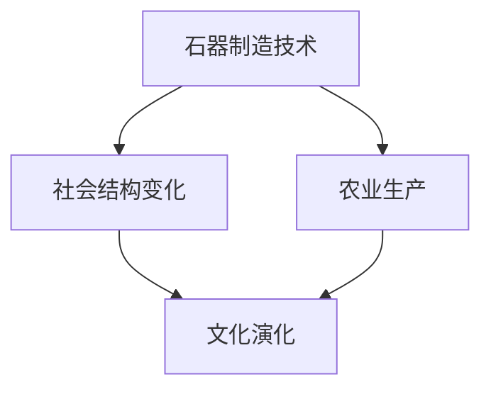

**核心算法原理讲解：**  
石器制造技术是石器时代人类文化演化的核心。通过不同的制造技术，人类能够制造出不同类型的石器，这些石器不仅用于生产，还用于战争、宗教等多种社会活动。

伪代码示例：

```
function makeStoneTool(type):
    if type == "blade":
        shape = "long and thin"
    elif type == "axe":
        shape = "wide and flat"
    else:
        shape = "unknown"
    return shape
```

**数学模型和公式：**  
石器时代的社会结构变化可以通过人口密度、生产力水平等指标来衡量。假设人口密度和生产力的关系可以用以下公式表示：

$$
P = k \cdot L
$$

其中，$P$表示人口密度，$L$表示生产力水平，$k$为常数。

**举例说明：**  
在石器时代晚期，随着石器的制造技术进步，生产力水平得到提高，导致人口密度增加。这进一步促进了社会结构的复杂化和文化的多元化。

##### 2.1.2 农业时代的文化演化

农业时代的到来标志着人类文化演化的一个重要转折点。在这个阶段，人类开始定居生活，农业生产成为主要的生产方式。

**核心概念与联系：**  


**Mermaid 流程图：**

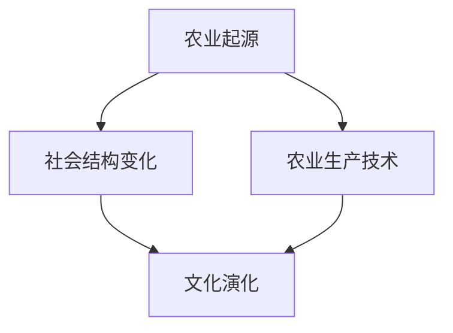

**核心算法原理讲解：**  
农业生产的出现，使得人类能够获得更稳定的食物来源，这为人口增长和社会结构的复杂化提供了基础。

伪代码示例：

```
function cultivateLand(crop):
    if crop == "wheat":
        yield = high
    elif crop == "rice":
        yield = medium
    else:
        yield = low
    return yield
```

**数学模型和公式：**  
农业社会的社会结构变化可以通过人口密度、生产力水平、资源分配等指标来衡量。假设农业生产对人口密度的影响可以用以下公式表示：

$$
P_t = P_0 + r \cdot T
$$

其中，$P_t$表示时间$t$时的人口密度，$P_0$表示初始人口密度，$r$为人口增长率，$T$为时间。

**举例说明：**  
在农业时代，随着农业生产技术的发展，人类能够更高效地利用土地资源，导致人口密度显著增加。这进一步促进了社会结构的复杂化和文化的多样化。

#### 2.2 工业时代的文化演化

工业时代的到来标志着人类文化演化的又一次重要转折。在这个阶段，机械化生产和城市化进程加速，人类对世界的理解和改造达到了前所未有的深度和广度。

##### 2.2.1 工业革命的兴起

工业革命是指18世纪末至19世纪初，以英国为代表，由于机械化生产、蒸汽动力和煤炭资源的大规模应用而引发的一系列社会经济变革。工业革命不仅改变了生产方式，还深刻影响了人类的生活方式和社会结构。

**核心概念与联系：**  


**Mermaid 流程图：**

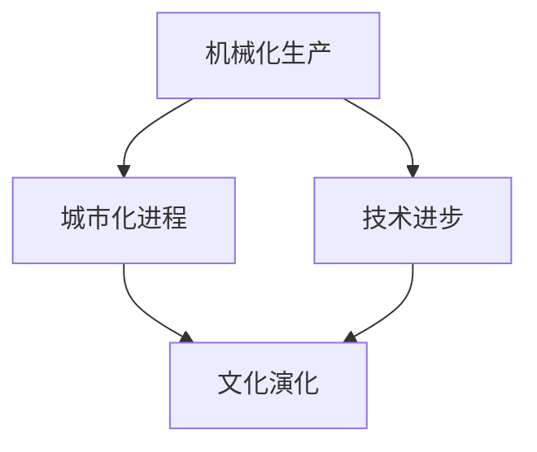

**核心算法原理讲解：**  
工业革命的核心是机械化生产，通过应用蒸汽机和机械化设备，大大提高了生产效率，降低了生产成本。这为工业时代的文化演化奠定了基础。

伪代码示例：

```
function industrialProduction(machineType):
    if machineType == "steamEngine":
        efficiency = high
    elif machineType == "mechanicalDevice":
        efficiency = medium
    else:
        efficiency = low
    return efficiency
```

**数学模型和公式：**  
工业革命对城市化进程的影响可以用人口迁移率、城市化率等指标来衡量。假设工业革命对城市化率的影响可以用以下公式表示：

$$
U_t = U_0 + r \cdot T
$$

其中，$U_t$表示时间$t$时的城市化率，$U_0$表示初始城市化率，$r$为城市化增长率，$T$为时间。

**举例说明：**  
在工业革命时期，随着机械化生产的普及，大量人口从农村迁移到城市，城市化率显著提高。这导致了社会结构的巨大变化，也促进了文化的多样性和创新。

##### 2.2.2 现代科技对文化演化的影响

进入21世纪，信息技术和互联网的快速发展，进一步推动了人类文化演化的进程。

**核心概念与联系：**  


**Mermaid 流程图：**

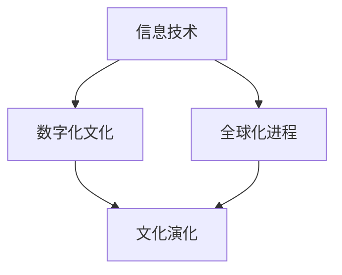

**核心算法原理讲解：**  
信息技术的快速发展，使得信息传播速度大大加快，人们可以通过互联网获取全球各地的信息，这促进了文化的交流和融合。

伪代码示例：

```
function digitalCultivation(content):
    if content == "news":
        spreadRate = high
    elif content == "entertainment":
        spreadRate = medium
    else:
        spreadRate = low
    return spreadRate
```

**数学模型和公式：**  
信息传播速度可以用传播速率、传播范围等指标来衡量。假设信息传播速度与传播范围的关系可以用以下公式表示：

$$
S_t = S_0 + r \cdot T
$$

其中，$S_t$表示时间$t$时的传播范围，$S_0$表示初始传播范围，$r$为传播速率。

**举例说明：**  
随着互联网的普及，信息传播速度显著提高，全球范围内的文化交流更加频繁。这导致了文化的多样性和创新，也使得文化演化速度加快。

### 第三部分：认知考古学

#### 3.1 认知考古学的基本原理

认知考古学是一门研究人类认知过程及其与文化和环境之间关系的学科。它通过文物资料的分析、遗址的发掘与保护，以及数据分析与建模等方法，试图揭示人类认知过程的历史和发展规律。

##### 3.1.1 文物资料的解读

文物资料是认知考古学研究的重要依据。通过对不同类型的文物进行解读，研究人员可以揭示出早期人类的生活状态、社会结构和文化特征。

**核心概念与联系：**  


**Mermaid 流程图：**

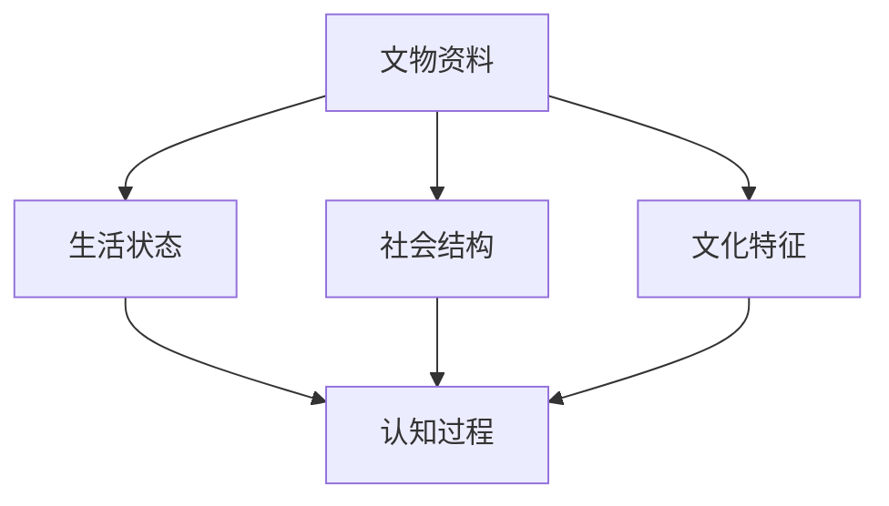

**核心算法原理讲解：**  
文物资料的解读需要结合多种学科知识，如考古学、人类学、历史学等。通过对文物的形状、材质、用途等进行详细分析，研究人员可以推断出早期人类的生活状态和社会结构。

伪代码示例：

```
function analyzeArtifact(artifact):
    if artifactType == "pottery":
        use = "food storage"
    elif artifactType == "工具":
        use = "production"
    else:
        use = "unknown"
    return use
```

**数学模型和公式：**  
文物资料的解读可以通过概率模型、统计模型等方法进行分析。假设文物的用途与概率之间的关系可以用以下公式表示：

$$
P(use) = p \cdot (1 - p)^{n-1}
$$

其中，$P(use)$表示某种用途的概率，$p$为该用途在所有用途中的概率，$n$为所有可能的用途数量。

**举例说明：**  
在考古发掘中，研究人员发现了一个陶器。通过对陶器的形状、材质和用途进行分析，研究人员推断出这个陶器主要用于储存食物。这为进一步揭示早期人类的生活状态提供了重要线索。

##### 3.1.2 遗址的发掘与保护

遗址的发掘与保护是认知考古学的重要任务之一。通过发掘遗址，研究人员可以获取大量关于早期人类活动的信息，从而更好地理解人类的文化演化。

**核心概念与联系：**  


**Mermaid 流程图：**

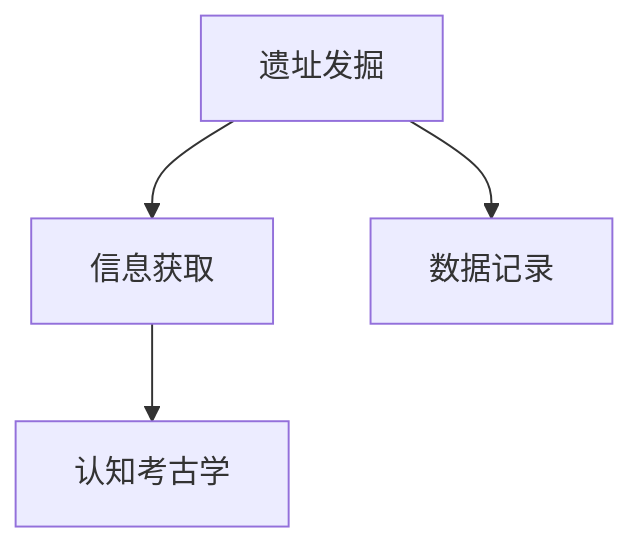

**核心算法原理讲解：**  
遗址的发掘过程需要严格遵循考古学原理，通过详细的发掘和记录，研究人员可以获取关于早期人类活动的丰富信息。

伪代码示例：

```
function excavateSite(site):
    artifacts = findArtifacts()
    records = recordArtifacts(artifacts)
    return records
```

**数学模型和公式：**  
遗址发掘的信息获取可以通过概率模型、统计模型等方法进行分析。假设发掘过程中发现某种文物的概率可以用以下公式表示：

$$
P(findArtifact) = p
$$

其中，$P(findArtifact)$表示发现某种文物的概率，$p$为该文物在遗址中的概率。

**举例说明：**  
在一次考古发掘中，研究人员发现了一个古代遗址。通过对遗址的详细发掘和记录，研究人员获取了大量关于该遗址时期人类活动的信息，从而对该时期的人类文化演化有了更深入的了解。

##### 3.1.3 数据分析与建模

数据分析和建模是认知考古学研究的重要手段。通过数据分析，研究人员可以揭示出人类认知过程的历史和发展规律，而建模则可以帮助我们更好地理解这些规律。

**核心概念与联系：**  


**Mermaid 流程图：**

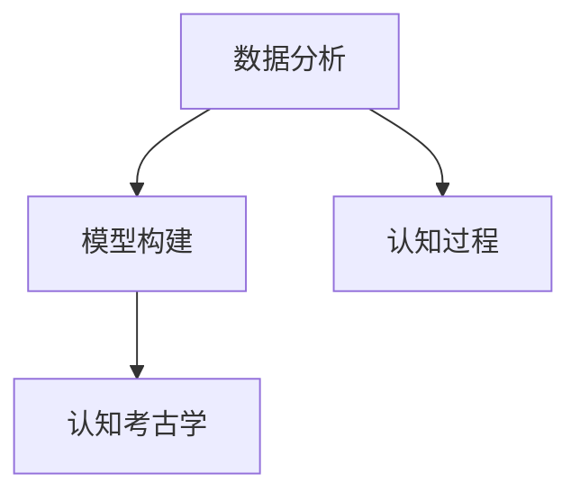

**核心算法原理讲解：**  
数据分析和建模需要结合多种学科知识，如统计学、计算机科学等。通过对大量数据进行分析和建模，研究人员可以揭示出人类认知过程的基本规律。

伪代码示例：

```
function analyzeData(data):
    model = buildModel(data)
    results = runModel(model)
    return results
```

**数学模型和公式：**  
数据分析和建模可以通过线性回归、神经网络等算法进行分析。假设数据之间的关系可以用线性回归模型表示：

$$
y = \beta_0 + \beta_1 \cdot x
$$

其中，$y$为因变量，$x$为自变量，$\beta_0$和$\beta_1$为模型参数。

**举例说明：**  
通过对考古发掘中获得的数据进行分析和建模，研究人员发现人类认知过程在某些方面具有显著的特征，如对空间、时间的感知能力等。这为认知考古学的研究提供了重要线索。

#### 3.2 认知考古学的分析方法

认知考古学的分析方法主要包括文物资料的解读、遗址的发掘与保护、数据分析与建模等。这些方法相互补充，共同揭示了人类认知过程的历史和发展规律。

**核心概念与联系：**  


**Mermaid 流程图：**

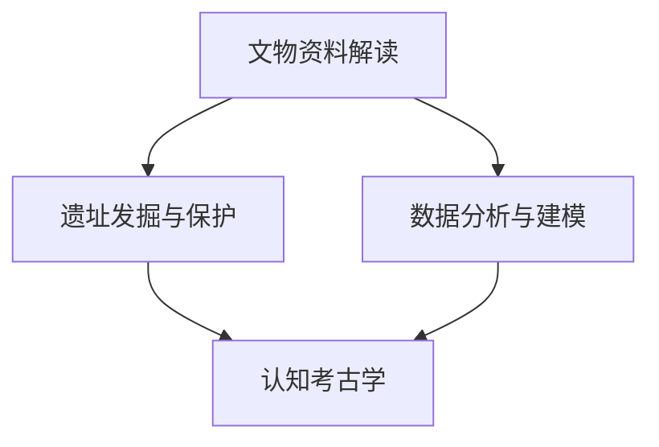

**核心算法原理讲解：**  
文物资料解读、遗址发掘与保护和数据分析与建模是认知考古学研究的三个核心方法。通过对这些方法的综合运用，研究人员可以全面揭示人类认知过程的历史和发展规律。

伪代码示例：

```
function cognitiveArchaeology(artifacts, site, data):
    analysis = analyzeArtifact(artifacts)
    excavation = excavateSite(site)
    modeling = analyzeData(data)
    results = merge(analysis, excavation, modeling)
    return results
```

**数学模型和公式：**  
认知考古学的方法分析可以通过概率模型、统计模型、神经网络等算法进行分析。假设各种方法之间的关系可以用以下公式表示：

$$
results = f(analysis, excavation, modeling)
$$

其中，$results$为分析结果，$f$为分析方法函数。

**举例说明：**  
通过对不同方法的综合运用，研究人员可以全面揭示人类认知过程的历史和发展规律。例如，通过文物资料解读，研究人员发现早期人类具有显著的空间感知能力；通过遗址发掘与保护，研究人员发现早期人类的生活方式和社会结构；通过数据分析与建模，研究人员揭示了人类认知过程的基本规律和模式。

### 第四部分：人类理解世界的历史进程

#### 4.1 早期人类对世界的理解

早期人类对世界的理解主要通过感官体验和简单的思维方式进行。在这个阶段，人类尚未形成完整的语言体系，因此对世界的认知相对有限。

**核心概念与联系：**  


**Mermaid 流程图：**

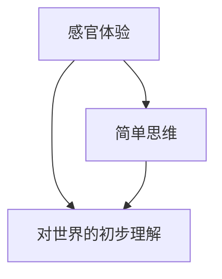

**核心算法原理讲解：**  
早期人类主要通过感官体验来认识世界，如视觉、听觉、触觉等。这些感官体验为人类提供了对环境的基本认知。同时，早期人类开始尝试使用简单的思维方式，如分类、比较等，来理解和解释周围的世界。

伪代码示例：

```
function sensoryExperience(sense):
    if sense == "vision":
        object = "visible"
    elif sense == "听觉":
        object = "audible"
    elif sense == "触觉":
        object = "tangible"
    else:
        object = "unknown"
    return object
```

**数学模型和公式：**  
早期人类对世界的理解可以通过概率模型、统计模型等方法进行分析。假设人类对某一物体的感知概率可以用以下公式表示：

$$
P(perception) = p
$$

其中，$P(perception)$表示人类对某一物体的感知概率，$p$为该物体在环境中的概率。

**举例说明：**  
早期人类通过感官体验，感知到周围环境中的各种物体，如动物、植物、石头等。这些感知经验为人类提供了对世界的初步认知。

#### 4.2 宗教与神话的形成

宗教与神话是人类理解世界的重要方式之一。通过宗教和神话，人类试图解释自然现象、社会现象以及人类的起源和命运。

**核心概念与联系：**  


**Mermaid 流程图：**

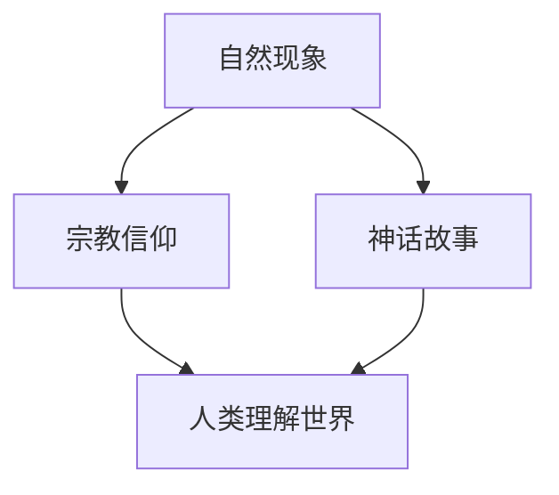

**核心算法原理讲解：**  
宗教信仰和神话故事是早期人类对自然现象和社会现象的一种解释方式。通过宗教仪式和神话故事，人类试图与自然界和神灵建立联系，从而更好地理解和掌控自己的命运。

伪代码示例：

```
function explainNaturalPhenomenon(phenomenon):
    if phenomenon == "storm":
        explanation = "神灵的愤怒"
    elif phenomenon == "earthquake":
        explanation = "神灵的震动"
    else:
        explanation = "未知现象"
    return explanation
```

**数学模型和公式：**  
宗教信仰和神话故事的形成可以通过概率模型、统计模型等方法进行分析。假设人类对某一自然现象的信仰概率可以用以下公式表示：

$$
P(faith) = p
$$

其中，$P(faith)$表示人类对某一自然现象的信仰概率，$p$为该现象在人类认知中的概率。

**举例说明：**  
早期人类通过宗教仪式和神话故事，试图解释各种自然现象，如风暴、地震等。这些宗教信仰和神话故事为人类提供了对世界的另一种理解方式。

### 第五部分：现代社会的文化演化与认知变化

#### 5.1 现代社会的文化演化

现代社会是全球化、数字化和信息化高度发展的时代。随着科技的发展，文化演化的速度不断加快，人类的生活方式和社会结构也发生了深刻变化。

**核心概念与联系：**  


**Mermaid 流程图：**

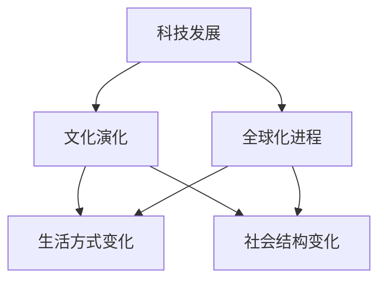

**核心算法原理讲解：**  
科技发展是现代社会文化演化的核心驱动力。互联网、人工智能、生物技术等新兴技术的出现，不仅改变了人类的生活方式，还深刻影响了社会结构和文化特征。

伪代码示例：

```
function culturalEvolution(technology):
    if technology == "互联网":
        impact = high
    elif technology == "人工智能":
        impact = medium
    elif technology == "生物技术":
        impact = low
    else:
        impact = unknown
    return impact
```

**数学模型和公式：**  
全球化进程可以用人口迁移率、国际交流频率等指标来衡量。假设全球化进程对文化演化的影响可以用以下公式表示：

$$
C_t = C_0 + r \cdot T
$$

其中，$C_t$表示时间$t$时的全球化程度，$C_0$表示初始全球化程度，$r$为全球化增长率，$T$为时间。

**举例说明：**  
随着互联网的普及，全球范围内的文化交流更加频繁，文化演化速度显著加快。这导致了文化多样性的增加，也促进了不同文化之间的融合和创新。

#### 5.2 数字化文化对人类理解世界的影响

数字化文化是现代社会文化演化的重要组成部分。随着数字化技术的普及，人们获取信息、交流沟通的方式发生了根本性的变化，这进一步影响了人类对世界的理解。

**核心概念与联系：**  


**Mermaid 流�流程图：**

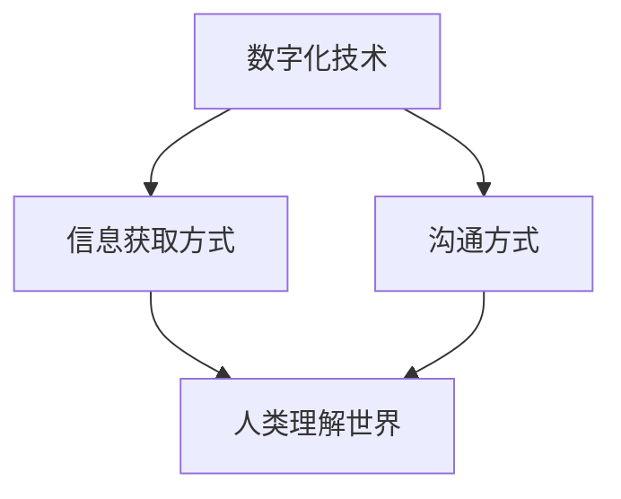

**核心算法原理讲解：**  
数字化技术为人类提供了更便捷、高效的信息获取和沟通方式。通过互联网，人们可以随时随地获取全球各地的信息，这大大扩展了人类的认知范围。

伪代码示例：

```
function digitalCulture(technology):
    if technology == "互联网":
        access = high
    elif technology == "社交媒体":
        access = medium
    else:
        access = low
    return access
```

**数学模型和公式：**  
数字化技术对人类理解世界的影响可以用信息获取速度、交流频率等指标来衡量。假设数字化技术对信息获取速度的影响可以用以下公式表示：

$$
V_t = V_0 + r \cdot T
$$

其中，$V_t$表示时间$t$时的信息获取速度，$V_0$表示初始信息获取速度，$r$为信息获取速度增长率，$T$为时间。

**举例说明：**  
随着数字化技术的普及，人们获取信息的方式越来越便捷，信息获取速度显著提高。这为人类提供了更多、更丰富的信息资源，进一步促进了人类对世界的理解。

### 第六部分：文化演化与认知考古学的未来

#### 6.1 文化演化与认知考古学的未来发展趋势

随着科技的不断发展，文化演化和认知考古学也将迎来新的机遇和挑战。

**核心概念与联系：**  


**Mermaid 流程图：**

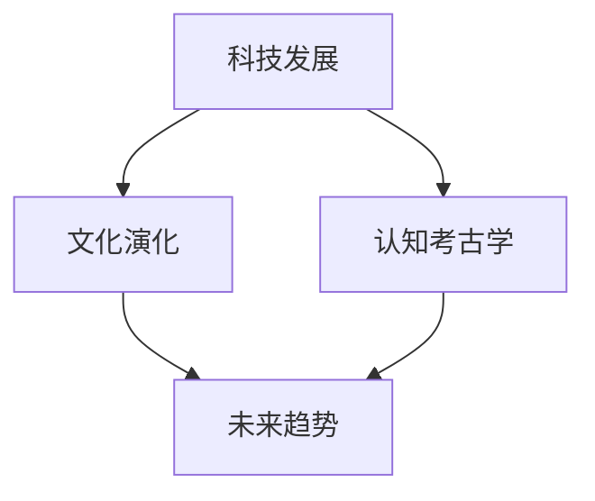

**核心算法原理讲解：**  
科技发展是文化演化和认知考古学未来发展的核心驱动力。人工智能、生物技术、纳米技术等新兴科技将为文化演化和认知考古学研究提供新的工具和方法。

伪代码示例：

```
function futureTrend(technology):
    if technology == "人工智能":
        impact = high
    elif technology == "生物技术":
        impact = medium
    elif technology == "纳米技术":
        impact = low
    else:
        impact = unknown
    return impact
```

**数学模型和公式：**  
文化演化与认知考古学的未来发展趋势可以用科技发展指数、文化创新指数等指标来衡量。假设科技发展对文化演化与认知考古学的影响可以用以下公式表示：

$$
I_t = I_0 + r \cdot T
$$

其中，$I_t$表示时间$t$时的科技发展指数，$I_0$表示初始科技发展指数，$r$为科技发展指数增长率，$T$为时间。

**举例说明：**  
随着人工智能技术的快速发展，文化演化和认知考古学研究将迎来新的机遇。人工智能技术可以帮助研究人员更高效地处理和分析大量数据，从而揭示出人类文化演化与认知过程的新规律。

#### 6.2 文化演化与认知考古学的挑战与机遇

文化演化与认知考古学在未来的发展中将面临诸多挑战，同时也充满机遇。

**核心概念与联系：**  


**Mermaid 流程图：**

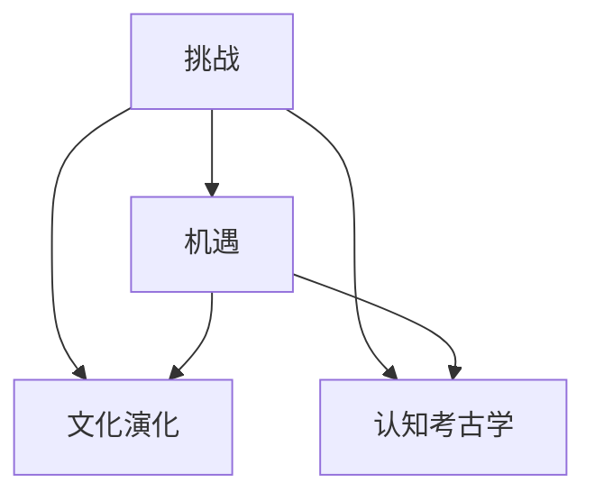

**核心算法原理讲解：**  
文化演化与认知考古学面临的挑战主要包括数据复杂性、技术进步速度等。然而，这些挑战也为研究提供了新的机遇，如大数据分析、人工智能等技术可以极大地提升研究效率。

伪代码示例：

```
function futureChallenge(challenge):
    if challenge == "数据复杂性":
        solution = "大数据分析"
    elif challenge == "技术进步速度":
        solution = "人工智能"
    else:
        solution = "未知"
    return solution
```

**数学模型和公式：**  
文化演化与认知考古学的挑战与机遇可以用挑战指数、机遇指数等指标来衡量。假设挑战指数和机遇指数之间的关系可以用以下公式表示：

$$
O_t = O_0 + r \cdot T - c \cdot C_t
$$

其中，$O_t$表示时间$t$时的机遇指数，$O_0$表示初始机遇指数，$r$为机遇指数增长率，$C_t$表示时间$t$时的挑战指数，$c$为挑战指数对机遇指数的影响系数。

**举例说明：**  
在数字化时代，数据复杂性成为文化演化与认知考古学的一大挑战。然而，通过大数据分析技术，研究人员可以更高效地处理和分析大量数据，从而发现新的研究线索。这为文化演化与认知考古学提供了新的机遇。

### 第七部分：总结与展望

#### 7.1 文化演化与认知考古学的重要性

文化演化与认知考古学是研究人类文明发展的重要学科。通过对文化演化与认知考古学的研究，我们可以更好地理解人类文明的历史进程，揭示人类认知过程的基本规律和模式。

#### 7.2 未来研究方向

未来的文化演化与认知考古学研究将继续深入探索人类文明的历史进程，同时结合新兴科技，如人工智能、大数据分析等，提升研究效率和深度。

#### 7.3 拓展阅读

对于希望进一步了解文化演化与认知考古学的研究人员，以下书籍和论文提供了丰富的参考资料：

1. 《人类简史：从动物到上帝》[尤瓦尔·赫拉利著]
2. 《认知考古学导论》[詹姆斯·P. 福克斯著]
3. 《文化演化：人类行为的生物学基础》[史蒂芬·平克著]
4. 《数字考古学》[迈克尔·巴克利著]

**作者：** AI天才研究院/AI Genius Institute & 禅与计算机程序设计艺术 /Zen And The Art of Computer Programming

