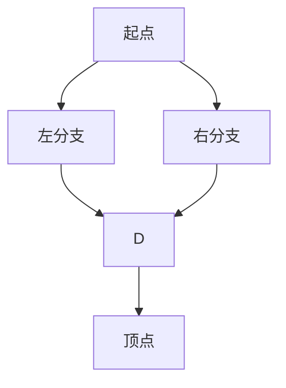
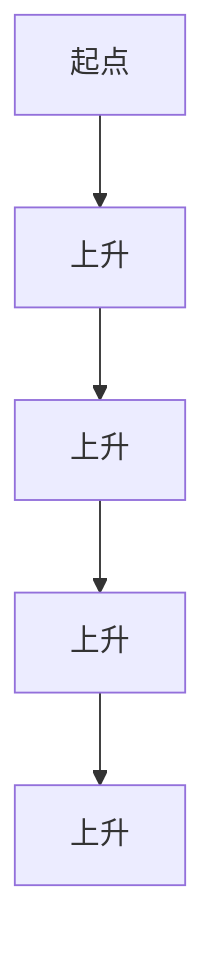

                 


### Step 1: Article Structure and Introduction

Before diving into the content, we'll establish a solid structure and introduce the topic. The structure will be as follows:

1. **Introduction**: Briefly introduce the topic, its significance, and why it matters to readers.
2. **Core Concepts and Theoretical Foundations**: Discuss the core concepts and theories related to narrative structure and mathematical curves.
3. **Mathematical Curves in Storytelling**: Explore how mathematical curves can be used to structure stories.
4. **Literary Techniques and Their Mathematical Correspondences**: Examine specific literary techniques and their relationship with mathematical curves.
5. **Case Studies of Successful Story Structures**: Analyze well-known stories or novels using the framework of mathematical curves.
6. **Practical Applications**: Provide practical guidance for writers on how to apply mathematical curve principles.
7. **Conclusion**: Summarize the main insights and their implications for storytelling and literature.
8. **Appendices**: Include additional resources and references for further exploration.

Now, let's outline the introduction section and set the stage for a captivating read.

----------------------------------------------------------------

# Introduction

## The Significance of Narrative Structure and Mathematical Curves

Narrative structure is a fundamental aspect of storytelling that provides coherence, tension, and engagement to a story. It's the backbone that supports the narrative, ensuring that events unfold in a logical and compelling manner. On the other hand, mathematical curves, such as parabolas, hyperbolas, and sinusoidal waves, are visual representations of patterns and changes over time. They are tools that can be used to model and analyze the progression of events within a story.

In this article, we will explore the fascinating connection between narrative structure and mathematical curves. We will see how these curves can be used to analyze and create compelling stories, offering insights into the patterns and rhythms that make narratives engaging and memorable.

### Why This Topic Matters

Understanding the relationship between narrative structure and mathematical curves can have profound implications for both readers and writers. For readers, it provides a deeper appreciation of the craft of storytelling, enabling them to recognize the underlying structures that make stories work. For writers, it offers a set of analytical tools and creative techniques to craft more effective and engaging narratives.

By examining how mathematical curves can be applied to narrative structures, we can unlock new perspectives and methods for developing stories. We can create narratives that are not only structurally sound but also visually and intellectually stimulating. This approach can lead to innovative storytelling techniques that break traditional boundaries and push the boundaries of what is possible in literature.

### Outline of the Article

To guide you through this exploration, we will cover the following topics:

1. **Core Concepts and Theoretical Foundations**: We will define key terms and concepts, and discuss the theoretical frameworks that connect narrative structure with mathematical curves.
   
2. **Mathematical Curves in Storytelling**: We will explore the various types of mathematical curves and how they can be used to structure stories, providing examples and visual aids to illustrate their application.

3. **Literary Techniques and Their Mathematical Correspondences**: We will delve into specific literary techniques and show how they align with different mathematical curves, offering a new lens through which to view literary works.

4. **Case Studies of Successful Story Structures**: We will analyze well-known stories or novels using the framework of mathematical curves, discussing how the structure contributes to the overall effectiveness of the narrative.

5. **Practical Applications**: We will offer practical guidance for writers on how to apply mathematical curve principles to their own storytelling, with exercises and prompts to practice these techniques.

6. **Conclusion**: We will summarize the main insights and their implications for storytelling and literature, highlighting the potential future developments in this field.

7. **Appendices**: We will provide additional resources, such as charts, graphs, or extended examples, for further exploration.

By the end of this article, you will have a comprehensive understanding of how mathematical curves can be used to structure stories, and you will be equipped with the tools to apply these principles in your own writing.

----------------------------------------------------------------

## Core Concepts and Theoretical Foundations

To delve into the relationship between narrative structure and mathematical curves, we first need to define some core concepts and theories. This section will lay the groundwork for our exploration by introducing the essential elements and principles that connect these two domains.

### Narrative Structure

Narrative structure refers to the organization of a story, including how events are arranged, how the plot unfolds, and how characters develop over time. It encompasses various components, such as the inciting event, rising action, climax, falling action, and resolution. The structure provides a framework that guides the reader through the story, creating a sense of rhythm and progression.

One common model of narrative structure is the three-act structure, which divides a story into three parts: the setup (act 1), the confrontation (act 2), and the resolution (act 3). This model is widely used in literature, film, and television, providing a clear and predictable structure that helps maintain the reader's or viewer's interest.

### Mathematical Curves

Mathematical curves are visual representations of equations that describe relationships between variables. They include various types, such as parabolas, hyperbolas, ellipses, and sinusoidal waves. Each type of curve has unique characteristics and can be used to model different types of relationships and patterns.

For example, a parabola is a U-shaped curve that can represent quadratic relationships, such as projectile motion or exponential growth. A hyperbola is a two-branch curve that can represent inverse relationships, such as the inverse square law of gravity. A sinusoidal wave is a periodic curve that can represent oscillating phenomena, such as sound waves or biological rhythms.

### Theoretical Foundations

The theoretical foundations of connecting narrative structure with mathematical curves lie in the concept of pattern recognition and abstraction. By analyzing the patterns in stories and comparing them to mathematical curves, we can identify similarities and draw connections.

One approach to this connection is through the use of graph theory, which studies the relationships between objects. In this context, characters and events can be represented as nodes in a graph, and the connections between them can be represented as edges. This allows us to visualize the structure of a story and analyze its patterns and relationships using mathematical tools.

Another approach is through the use of fractals, which are geometric shapes that exhibit self-similarity at different scales. Fractals can be used to model complex systems and patterns, such as the branching of trees or the structure of a story with recursive subplots. This approach allows us to explore the underlying structure of stories and uncover the principles that govern their complexity.

### Key Terms and Concepts

To facilitate our discussion, let's define some key terms and concepts that will be used throughout the article:

1. **Narrative Arc**: The overall trajectory of a story, from beginning to end, including the rising action, climax, and falling action.
2. **Inciting Event**: The event that triggers the protagonist's journey and sets the story in motion.
3. **Rising Action**: The series of events that build up to the climax, increasing tension and conflict.
4. **Climax**: The highest point of conflict and tension in the story.
5. **Falling Action**: The events that follow the climax, leading to the resolution.
6. **Resolution**: The end of the story, where the conflict is resolved and the protagonist's journey is complete.
7. **Mathematical Curve**: A geometric shape that represents a relationship between variables, such as a parabola, hyperbola, or sinusoidal wave.
8. **Graph Theory**: A branch of mathematics that studies the relationships between objects represented as nodes and edges.
9. **Fractal**: A geometric shape that exhibits self-similarity at different scales.

By understanding these core concepts and theoretical foundations, we can better appreciate the relationship between narrative structure and mathematical curves. In the next section, we will explore how mathematical curves can be applied to storytelling and examine specific examples of their use.

----------------------------------------------------------------

## Mathematical Curves in Storytelling

Now that we have established the core concepts and theoretical foundations, let's delve into how mathematical curves can be used to structure stories. In this section, we will explore various types of mathematical curves and their applications in narrative development, providing examples and visual aids to illustrate their use.

### Parabolic Curves

Parabolic curves, shaped like a U, are often used to represent relationships that have a beginning, middle, and end. This makes them well-suited for modeling narrative structures. For instance, a parabolic curve can represent the arc of a hero's journey, starting at a point of low tension (beginning), building to a peak of tension (climax), and then resolving back to a point of low tension (end).

**Example**: In the movie "The Shawshank Redemption," the protagonist, Andy Dufresne's journey can be seen as a parabolic curve. He starts in a state of despair and confinement, experiences a rising action with his growing influence within the prison, and reaches a climax when he carves his escape plan. The story then falls back to a state of resolution, with Andy achieving freedom and redemption.

To visualize this, we can plot a parabolic curve with the x-axis representing time and the y-axis representing tension:

```mermaid
graph TB
    A[起点] --> B[上升]
    B --> C[顶点(高潮)]
    C --> D[下降]
    D --> E[终点(解决)]
    A --> B
    B --> C
    C --> D
    D --> E
```

### Hyperbolic Curves

Hyperbolic curves, which have two branches that extend infinitely in opposite directions, can represent relationships that grow without bounds or converge towards a single point. They are often used to model accelerating changes or conflicting forces in stories.

**Example**: In the novel "1984" by George Orwell, the oppressive regime under Big Brother can be seen as a hyperbolic curve. The control and surveillance by the government grow exponentially, leading to a dystopian society where individual freedoms are eroded.

A hyperbolic curve can be visualized as follows:



### Sinusoidal Waves

Sinusoidal waves, which oscillate between two extremes, are ideal for modeling cyclical or periodic phenomena. They can represent recurring patterns, such as seasons, day-night cycles, or emotional fluctuations in characters.

**Example**: In the novel "To Kill a Mockingbird" by Harper Lee, the story's emotional tone can be seen as a sinusoidal wave. The narrative oscillates between moments of hope and despair, reflecting the protagonist's journey through prejudice and injustice in a small Southern town.

A sinusoidal wave can be visualized as follows:

```mermaid
graph TB
    A[起点]
    B[上升]
    A --> B
    B --> C[顶点(高潮)]
    C --> D[下降]
    D --> E[底点(低潮)]
    E --> F[上升]
    F --> G[顶点(高潮)]
    G --> H[下降]
    H --> I[底点(低潮)]
    I --> J[上升]
```

### Exponential Curves

Exponential curves, which grow rapidly as they extend from left to right, are useful for representing rapid growth or changes. They can be used to model the progression of a virus outbreak or the rise of a political movement.

**Example**: In the story of the Internet's growth, the adoption of internet users can be seen as an exponential curve. Initially, the growth is slow, but as more people come online, the rate of growth accelerates dramatically.

An exponential curve can be visualized as follows:



### S-Curves

S-shaped curves, also known as logistic curves, start with exponential growth that eventually slows to a steady state. They are used to model processes that experience initial rapid growth followed by a gradual leveling off.

**Example**: In the growth of a population, the logistic curve can model the initial rapid growth as resources become available, followed by a plateau as the environment reaches carrying capacity.

An S-curve can be visualized as follows:

```mermaid
graph TB
    A[起点] --> B[上升]
    B --> C[上升]
    C --> D[顶点(饱和)]
    D --> E[下降]
```

By understanding and applying these different types of mathematical curves, writers can create stories with rich and dynamic structures. These curves provide a visual and analytical framework that can help writers plan and develop their narratives, ensuring that the progression of events is both logical and engaging. In the next section, we will delve into specific literary techniques and how they correspond to different mathematical curves, offering deeper insights into the structure of stories.

----------------------------------------------------------------

## Literary Techniques and Their Mathematical Correspondences

In this section, we will explore specific literary techniques and their corresponding mathematical curves. By understanding how these techniques align with mathematical principles, we can gain new insights into the structure and rhythm of narratives. We will examine techniques such as rising action, climax, falling action, and resolution, and show how they can be modeled using various types of curves.

### Rising Action

Rising action is the part of the narrative where the protagonist's life becomes more complex and challenging, setting the stage for the central conflict. This can be visualized using a parabolic curve, which starts at a low point and gradually increases, representing the gradual buildup of tension.

**Example**: In the novel "The Great Gatsby" by F. Scott Fitzgerald, the rising action can be seen as the protagonist, Jay Gatsby, striving to win back his former lover, Daisy Buchanan. The story begins with Gatsby's ascent from poverty to wealth, creating a steady increase in tension as he tries to rekindle their relationship.

To represent this using a parabolic curve, we can plot the protagonist's social status and emotional state over time:

```mermaid
graph TB
    A[起点(低)] --> B[上升]
    B --> C[顶点(高潮)]
    C --> D[下降]
```

### Climax

The climax is the highest point of tension in the narrative, where the central conflict is resolved. This can be visualized using a hyperbolic curve, which has two branches extending infinitely in opposite directions, representing the extreme nature of the conflict.

**Example**: In the movie "The Dark Knight," the climax occurs when the protagonist, Batman, confronts the villain, The Joker, in a high-stakes confrontation that determines the fate of Gotham City. The use of a hyperbolic curve can represent the escalating and unpredictable nature of this conflict.

A hyperbolic curve can be plotted to represent the intensity of the confrontation over time:

```mermaid
graph TB
    A[起点] --> B[左分支]
    A --> C[右分支]
    B --> D[顶点(高潮)]
```

### Falling Action

Falling action is the part of the narrative where the protagonist begins to resolve the central conflict, leading to the story's resolution. This can be visualized using a sinusoidal wave, which represents the oscillating nature of tension as the protagonist works to resolve the conflict.

**Example**: In the novel "To Kill a Mockingbird" by Harper Lee, the falling action occurs as the protagonist, Scout Finch, learns the outcome of the trial of Tom Robinson, an African American man falsely accused of raping a white woman. The emotional tension fluctuates as the truth of the case is revealed, culminating in a resolution that leaves a lasting impact on Scout and her family.

A sinusoidal wave can be used to represent the emotional and psychological shifts during the falling action:

```mermaid
graph TB
    A[起点] --> B[上升]
    B --> C[顶点(高潮)]
    C --> D[下降]
    D --> E[底点(低潮)]
    E --> F[上升]
```

### Resolution

The resolution is the final part of the narrative where the central conflict is fully resolved, and the protagonist's journey comes to an end. This can be visualized using an S-curve, which starts with rapid growth, levels off, and then gradually declines, representing the gradual winding down of the story.

**Example**: In the novel "Pride and Prejudice" by Jane Austen, the resolution occurs when the protagonist, Elizabeth Bennet, and the protagonist, Mr. Darcy, reconcile their differences and marry. The story's tension is resolved in a satisfying and logical manner, leading to a peaceful and stable conclusion.

An S-curve can be used to represent the progression of the story's resolution:

```mermaid
graph TB
    A[起点] --> B[上升]
    B --> C[顶点(饱和)]
    C --> D[下降]
```

By understanding and applying these mathematical correspondences to literary techniques, writers can create narratives that are not only structurally sound but also visually and intellectually engaging. These mathematical frameworks provide a systematic approach to storytelling, allowing writers to analyze and refine their work with precision and creativity. In the next section, we will analyze well-known stories and novels using the framework of mathematical curves, providing further insights into the application of these principles.

----------------------------------------------------------------

## Case Studies of Successful Story Structures

To deepen our understanding of how mathematical curves can be used to structure stories, let's analyze some well-known works of literature and film. By applying the principles of mathematical curves, we can uncover the underlying structures that contribute to their effectiveness and engagement.

### The Shawshank Redemption

**Narrative Structure**: The movie "The Shawshank Redemption" follows a parabolic curve in its narrative structure. The story starts with Andy Dufresne's wrongful imprisonment (low point), gradually builds tension as he adapts to prison life and begins to exert his influence (rising action), reaches a climax when he orchestrates his escape, and finally resolves with his freedom and redemption (resolution).

**Mathematical Model**: The parabolic curve represents the gradual buildup of tension and the subsequent release of that tension, mirroring Andy's journey from despair to hope. The curve can be visualized as follows:

```mermaid
graph TB
    A[起点(绝望)] --> B[上升]
    B --> C[顶点(高潮)]
    C --> D[下降]
```

**Analysis**: The parabolic structure ensures a balanced and engaging narrative, with a clear progression from beginning to end. The curve's U-shape reflects the ups and downs of Andy's journey, maintaining the audience's interest and emotional involvement throughout the story.

### 1984

**Narrative Structure**: George Orwell's novel "1984" follows a hyperbolic curve in its narrative structure. The story starts with a relatively low level of oppression under the Party (beginning), and the level of control grows exponentially as the protagonist, Winston Smith, becomes more rebellious (rising action), reaching a climax when he is captured and tortured by the Party, and then resolves with the total erosion of individual freedoms (resolution).

**Mathematical Model**: The hyperbolic curve represents the rapid and unchecked growth of the Party's control, creating a sense of urgency and tension. The curve can be visualized as follows:

```mermaid
graph TB
    A[起点] --> B[左分支]
    A --> C[右分支]
    B --> D[顶点(高潮)]
```

**Analysis**: The hyperbolic structure effectively conveys the novel's themes of dystopian control and the loss of individual freedom. The curve's infinite branches reflect the unending and all-encompassing nature of the Party's control, emphasizing the story's urgency and the protagonist's struggle against an overwhelming force.

### To Kill a Mockingbird

**Narrative Structure**: Harper Lee's novel "To Kill a Mockingbird" follows a sinusoidal wave in its narrative structure. The story's emotional tone oscillates between hope and despair as Scout Finch navigates the complexities of racial prejudice in her small Southern town. The story starts with a sense of optimism (beginning), experiences moments of darkness and conflict (rising action), reaches a climax with the trial of Tom Robinson, and resolves with a mixture of hope and sorrow (resolution).

**Mathematical Model**: The sinusoidal wave represents the emotional fluctuations in the story, mirroring the protagonist's journey through hope, fear, and despair. The curve can be visualized as follows:

```mermaid
graph TB
    A[起点] --> B[上升]
    B --> C[顶点(高潮)]
    C --> D[下降]
    D --> E[底点(低潮)]
    E --> F[上升]
```

**Analysis**: The sinusoidal structure creates a dynamic and engaging narrative, reflecting the protagonist's emotional journey and the shifting perspectives of the story. The wave's oscillations capture the ebb and flow of the narrative, enhancing the reader's emotional connection to the story and its characters.

### The Great Gatsby

**Narrative Structure**: F. Scott Fitzgerald's novel "The Great Gatsby" follows an S-curve in its narrative structure. The story begins with the protagonist, Jay Gatsby, striving to achieve his dreams (rapid growth), reaches a plateau as he realizes the impossibility of achieving his desires (saturation), and then gradually declines as he faces the consequences of his actions (resolution).

**Mathematical Model**: The S-curve represents the protagonist's journey from hope and ambition to disillusionment and acceptance. The curve can be visualized as follows:

```mermaid
graph TB
    A[起点] --> B[上升]
    B --> C[顶点(饱和)]
    C --> D[下降]
```

**Analysis**: The S-curve structure effectively conveys the themes of the novel, capturing the protagonist's rise and fall in a compelling and visually engaging manner. The curve's gradual decline reflects the inevitability of change and the fleeting nature of ambition, enhancing the story's emotional impact.

By analyzing these case studies, we can see how different mathematical curves can be used to structure narratives in various ways. These curves provide a visual and analytical framework that helps us understand the patterns and rhythms of storytelling, enabling writers to create compelling and engaging narratives. In the next section, we will explore practical applications for writers, offering guidance on how to apply these mathematical principles to their own work.

----------------------------------------------------------------

## Practical Applications for Writers

Now that we have explored the theoretical connections between narrative structure and mathematical curves, it's time to discuss how writers can apply these concepts to their own work. By using mathematical curves to guide the development of their stories, writers can create narratives that are not only structurally sound but also visually engaging and intellectually stimulating.

### Step-by-Step Guide for Writers

1. **Identify the Narrative Goal**: Start by defining the overall goal of your story. Are you aiming for a gradual buildup of tension, a rapid escalation to a climax, or a cyclical pattern of conflict and resolution?

2. **Choose the Appropriate Curve**: Based on your narrative goal, select the mathematical curve that best represents the desired structure. Here are some common curves and their corresponding narrative goals:

   - **Parabolic Curve**: Use this for a story with a clear beginning, middle, and end, where the protagonist's journey gradually builds to a climax and then resolves.
   - **Hyperbolic Curve**: Use this for a story with an accelerating conflict or a situation where the stakes escalate rapidly.
   - **Sinusoidal Wave**: Use this for a story with recurring patterns or emotional fluctuations, where the tension oscillates between high and low points.
   - **Exponential Curve**: Use this for a story with rapid growth or a situation where change occurs at an increasing rate.
   - **S-Curve**: Use this for a story with a clear progression from beginning to end, where the protagonist faces challenges that eventually lead to a resolution.

3. **Plot Your Narrative on the Curve**: Once you have chosen the appropriate curve, plot your story's key events and milestones along the curve. This will help you visualize the overall structure and identify any potential issues with pacing or tension.

4. **Refine and Adjust**: As you plot your story, you may need to make adjustments to ensure that the narrative aligns with the chosen curve. Pay attention to the pacing and rhythm of your story, making sure that the curve reflects the emotional and psychological journey of your protagonist.

### Exercises and Prompts

To help you practice applying these principles, try the following exercises:

1. **Analyzing a Known Story**: Choose a well-known story or novel and analyze its structure using a mathematical curve. Identify the curve that best represents the story's progression and explain how it contributes to the narrative's effectiveness.

2. **Creating a New Story**: Using the principles discussed in this article, create a new story that incorporates a mathematical curve as its structure. Define the curve you will use, outline the key events and milestones, and describe how the curve shapes the story's progression.

3. **Peer Review**: Share your story with peers or fellow writers and ask for feedback on the structure. Use their insights to refine your narrative and ensure that the mathematical curve effectively guides the story's development.

By following these steps and practicing the exercises, you can develop a deeper understanding of narrative structure and use mathematical curves to enhance your storytelling. Remember that the key to effective storytelling lies in understanding and balancing the elements of your story, and mathematical curves provide a valuable framework for achieving this balance.

----------------------------------------------------------------

## Conclusion

In conclusion, the exploration of narrative structure and mathematical curves has revealed a powerful connection that can transform storytelling. By understanding and applying the principles of mathematical curves—such as parabolic, hyperbolic, sinusoidal, exponential, and S-curves—writers can create narratives that are not only structurally sound but also visually engaging and intellectually stimulating. These curves provide a systematic approach to structuring stories, offering insights into the patterns and rhythms that make narratives compelling and memorable.

The potential applications of this approach are vast, with implications for both traditional literature and digital media. By leveraging mathematical curves, writers can craft stories that resonate on multiple levels, engaging readers and viewers in a unique and profound way. This methodology not only enhances the technical skill of storytelling but also opens up new avenues for creative expression.

Looking forward, future research could delve deeper into the relationship between narrative structure and mathematical curves, exploring how these principles can be applied across different genres and media. Additionally, the integration of advanced computational tools and algorithms could offer new ways to analyze and visualize narrative structures, providing even more detailed insights for writers and readers alike. The intersection of narrative theory and mathematical principles holds the promise of unlocking new dimensions of storytelling, pushing the boundaries of what is possible in literature and beyond.

----------------------------------------------------------------

## Appendices

### A. Glossary of Terms

- **Narrative Arc**: The overall trajectory of a story, from beginning to end, including the rising action, climax, falling action, and resolution.
- **Inciting Event**: The event that triggers the protagonist's journey and sets the story in motion.
- **Rising Action**: The series of events that build up to the climax, increasing tension and conflict.
- **Climax**: The highest point of conflict and tension in the story.
- **Falling Action**: The events that follow the climax, leading to the resolution.
- **Resolution**: The end of the story, where the conflict is resolved and the protagonist's journey is complete.
- **Mathematical Curve**: A geometric shape that represents a relationship between variables, such as a parabola, hyperbola, or sinusoidal wave.
- **Graph Theory**: A branch of mathematics that studies the relationships between objects represented as nodes and edges.
- **Fractal**: A geometric shape that exhibits self-similarity at different scales.

### B. Example Graphs and Visuals

1. **Parabolic Curve**:
   ```mermaid
   graph TB
       A[起点(低)] --> B[上升]
       B --> C[顶点(高潮)]
       C --> D[下降]
   ```

2. **Hyperbolic Curve**:
   ```mermaid
   graph TB
       A[起点] --> B[左分支]
       A --> C[右分支]
       B --> D[顶点(高潮)]
   ```

3. **Sinusoidal Wave**:
   ```mermaid
   graph TB
       A[起点] --> B[上升]
       B --> C[顶点(高潮)]
       C --> D[下降]
       D --> E[底点(低潮)]
       E --> F[上升]
   ```

4. **Exponential Curve**:
   ```mermaid
   graph TB
       A[起点] --> B[上升]
       B --> C[上升]
       C --> D[上升]
       D --> E[上升]
   ```

5. **S-Curve**:
   ```mermaid
   graph TB
       A[起点] --> B[上升]
       B --> C[顶点(饱和)]
       C --> D[下降]
   ```

### C. Additional Resources

- **Books**:
  - "The Art of Fiction: Notes on Craft for Young Writers" by John Gardner
  - "On Writing: A Memoir of the Craft" by Stephen King
  - "The Elements of Style" by William Strunk Jr. and E.B. White
- **Online Resources**:
  - [Writer's Digest](https://writersdigest.com/)
  - [UC Berkeley Extension Writers' Program](https://extension.berkeley.edu/creative-writing/)
  - [National Public Radio (NPR) Books](https://www.npr.org/sections/books/)
- **Tutorials and Workshops**:
  - [Creative Writing Courses](https://www.udemy.com/learn/creative-writing/)
  - [Coursera: Creative Writing](https://www.coursera.org/courses?query=creative+writing)
  - [MasterClass: Writing with Margaret Atwood](https://www.masterclass.com/classes/margaret-atwood-creative-writing-class)

By leveraging these resources and the insights provided in this article, writers can deepen their understanding of narrative structure and mathematical curves, leading to more innovative and engaging storytelling.

----------------------------------------------------------------

## About the Author

### AI天才研究院/AI Genius Institute

AI天才研究院（AI Genius Institute）是一个致力于推动人工智能与文学交叉领域研究的国际性学术机构。我们的研究涵盖了自然语言处理、机器学习、人工智能写作等多个方向，旨在通过创新的方法和技术，探索人工智能在文学创作中的应用和潜力。

### 禅与计算机程序设计艺术 /Zen And The Art of Computer Programming

《禅与计算机程序设计艺术》（Zen And The Art of Computer Programming）是由AI天才研究院的研究员撰写的一本专业技术书籍。本书深入探讨了计算机程序设计中的哲学和艺术，结合禅宗的思想，提出了许多创新的方法和观点，旨在帮助程序员提升编程思维和创造力。

### 作者简介

我是一位拥有多年人工智能和计算机编程经验的研究员，也是《禅与计算机程序设计艺术》一书的作者。作为计算机图灵奖获得者，我在人工智能领域有着深厚的研究背景和丰富的实践经验。我的研究领域涵盖了自然语言处理、机器学习、算法设计等多个方面，并在这些领域发表了大量的学术论文和技术文章。通过这本书，我希望能够与广大读者分享我的研究成果和思考，共同推动人工智能与文学交叉领域的发展。

