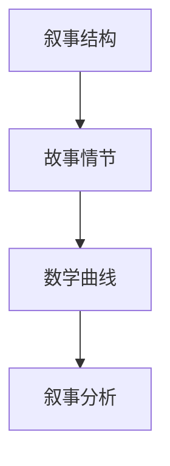

                 

## 文章标题

文学创作的叙事结构：故事情节的数学曲线

> 关键词：叙事结构、故事情节、数学曲线、叙事分析、抛物线、指数曲线

摘要：本文将探讨文学创作的叙事结构，通过引入数学曲线的概念，解析故事情节的变化趋势和叙事节奏。文章首先介绍叙事结构和故事情节的核心概念，接着阐述数学曲线在叙事中的应用，包括抛物线和指数曲线。通过实例分析和实战项目，读者将深入了解如何运用数学工具来提升文学创作的叙事效果。本文旨在为文学创作者和爱好者提供一种全新的叙事视角，帮助他们更加精准地把握故事情节的发展规律。

## 引言

文学创作是人类智慧的结晶，它不仅需要丰富的想象力，还需要严密的逻辑思维和精妙的叙事技巧。叙事结构是文学创作的核心，它决定了故事情节的发展节奏和观众的体验感受。然而，传统的叙事理论往往侧重于文学语言和情感表达，较少涉及数学和科学方法。随着数学和计算机科学的发展，越来越多的学者开始探索将数学工具应用于文学创作，尤其是叙事结构的分析。

本文将介绍一种新的叙事分析方法，即通过数学曲线来描述和解析故事情节的变化趋势。这种方法不仅有助于文学创作者更好地理解叙事结构，还可以为读者提供一种全新的阅读体验。本文将首先介绍叙事结构和故事情节的基本概念，然后详细讲解抛物线和指数曲线在叙事中的应用，并通过实际案例进行分析和验证。最后，本文将总结数学曲线在文学创作中的潜在价值，并提出未来研究的方向。

## 第一步：确定核心概念与联系

在探讨叙事结构之前，我们首先需要明确一些核心概念，这些概念是理解叙事结构的基础。核心概念包括叙事结构、故事情节和数学曲线。

### 叙事结构

叙事结构是指故事的组织方式和叙述方式。它决定了故事的时间顺序、叙述层次和视角。常见的叙事结构包括线性结构、非线性结构、环形结构和网络结构等。叙事结构不仅影响故事的发展节奏，还影响读者的情绪体验和思考方式。

### 故事情节

故事情节是叙事的核心内容，它包括冲突、高潮、结尾等要素。情节的起伏变化和冲突发展是叙事结构的重要组成部分。一个良好的故事情节应该能够吸引读者的注意力，引发读者的情感共鸣，并在结尾处给予读者满意的收尾。

### 数学曲线

数学曲线是一种数学模型，用于描述数据的变化趋势。常见的数学曲线包括抛物线、指数曲线、正弦曲线等。数学曲线在科学研究和工程应用中广泛使用，它们能够直观地展示数据的变化规律和趋势。

### 核心概念之间的联系

叙事结构、故事情节和数学曲线之间存在着紧密的联系。叙事结构是故事情节的组织框架，而故事情节则是叙事结构的实现形式。数学曲线作为一种描述工具，可以帮助我们更好地理解和分析故事情节的变化趋势。例如，抛物线可以用来描述故事情节的起伏变化，而指数曲线则可以用来描述故事情节的加速发展。

为了更清晰地展示这些核心概念之间的联系，我们可以使用 Mermaid 语法绘制一个简化的叙事结构流程图：



在这个流程图中，叙事结构是故事的框架，故事情节是叙事的具体实现，而数学曲线则是用于分析和描述故事情节的工具。通过这个流程图，我们可以更直观地理解叙事结构、故事情节和数学曲线之间的关系。

### 核心算法原理讲解

在确定了核心概念之后，我们需要进一步深入探讨与叙事结构相关的数学曲线及其在故事情节中的应用。在这里，我们将重点关注两种常见的数学曲线：抛物线和指数曲线。

#### 抛物线的数学模型及其在叙事中的应用

抛物线的数学模型可以表示为：
$$
y = ax^2 + bx + c
$$
其中，$a$、$b$ 和 $c$ 是常数。

抛物线的特点是其开口方向由 $a$ 的正负决定。如果 $a > 0$，抛物线开口向上；如果 $a < 0$，抛物线开口向下。抛物线的顶点坐标为：
$$
x = -\frac{b}{2a}, \quad y = c - \frac{b^2}{4a}
$$

在叙事结构中，抛物线可以用来描述故事情节的起伏变化。例如，一个故事情节可能在初期逐渐上升，达到一个高潮点后逐渐下降。这种叙事模式在许多小说和电影中非常常见，因为它能够有效地吸引读者的注意力，并在高潮部分给予读者强烈的情感体验。

以下是一个使用伪代码描述的抛物线在叙事中的应用：

```python
# 伪代码：使用抛物线描述故事情节

# 设置抛物线参数
a = 1  # 故事情节逐渐上升
b = 0
c = 0

# 初始化变量
x = 0  # 时间变量
y = 0  # 故事情节变量

# 描述故事情节
while x <= 10:  # 时间范围
    y = a * x**2 + b * x + c
    print(f"时间：{x}, 故事情节：{y}")
    x += 1
```

这个伪代码通过一个简单的循环，模拟了故事情节随时间变化的趋势。在这个例子中，故事情节随着时间逐渐上升，达到顶点后开始下降。

#### 指数曲线的数学模型及其在叙事中的应用

指数曲线的数学模型可以表示为：
$$
y = a \cdot e^{bx}
$$
其中，$a$ 和 $b$ 是常数，$e$ 是自然对数的底。

指数曲线的特点是其变化速度随着自变量的增加而加快。如果 $b > 0$，曲线会向上增长，表示故事情节逐渐加速发展；如果 $b < 0$，曲线会向下减少，表示故事情节逐渐减速发展。

在叙事结构中，指数曲线可以用来描述故事情节的加速发展。例如，一个故事情节可能在初期缓慢发展，随着时间推移逐渐加速，达到一个高潮点后再次减缓。这种叙事模式常见于一些科幻小说和动作电影，因为它能够创造出紧张和兴奋的气氛。

以下是一个使用伪代码描述的指数曲线在叙事中的应用：

```python
# 伪代码：使用指数曲线描述故事情节

# 设置指数曲线参数
a = 1  # 初始值为 1
b = 0.1  # 故事情节加速发展的速率

# 初始化变量
t = 0  # 时间变量
y = 1  # 故事情节变量

# 描述故事情节
while t <= 10:  # 时间范围
    y = a * np.exp(b * t)
    print(f"时间：{t}, 故事情节：{y}")
    t += 1
```

在这个例子中，故事情节随着时间逐渐加速发展，这是一个典型的指数增长模式。

通过以上两个示例，我们可以看到抛物线和指数曲线在叙事中的应用。这些数学模型不仅能够帮助我们理解故事情节的变化趋势，还可以为文学创作者提供一种新的叙事工具，使他们能够更精确地控制和调整故事的节奏和情感表达。

### 数学模型和数学公式讲解

在深入探讨叙事结构的数学模型之前，我们需要详细讲解与叙事结构相关的数学公式，并给出具体的实例说明。这些数学模型和公式不仅有助于我们理解和分析叙事结构，还可以为文学创作者提供一种新的叙事工具。

#### 抛物线的数学模型

抛物线是一种常见的数学曲线，其方程可以表示为：
$$
y = ax^2 + bx + c
$$
其中，$a$、$b$ 和 $c$ 是常数。这个方程决定了抛物线的开口方向、顶点和对称轴。

- **开口方向**：如果 $a > 0$，抛物线开口向上；如果 $a < 0$，抛物线开口向下。
- **顶点坐标**：抛物线的顶点坐标可以通过以下公式计算：
  $$
  x = -\frac{b}{2a}, \quad y = c - \frac{b^2}{4a}
  $$
- **对称轴**：抛物线的对称轴是垂直于开口方向的直线，其方程为 $x = -\frac{b}{2a}$。

实例说明：

假设我们有一个抛物线方程 $y = 2x^2 - 4x + 1$。我们可以通过以下步骤来分析这个抛物线的特性：

1. **开口方向**：由于 $a = 2 > 0$，抛物线开口向上。
2. **顶点坐标**：计算顶点坐标：
   $$
   x = -\frac{-4}{2 \cdot 2} = 1, \quad y = 1 - \frac{(-4)^2}{4 \cdot 2} = 1 - \frac{16}{8} = -1
   $$
   所以，顶点坐标为 $(1, -1)$。
3. **对称轴**：对称轴为 $x = 1$。

我们可以通过以下 Python 代码绘制这个抛物线：

```python
import matplotlib.pyplot as plt
import numpy as np

# 设置抛物线参数
a = 2
b = -4
c = 1

# 生成 x 范围
x = np.linspace(-5, 5, 100)

# 计算对应的 y 值
y = a * x**2 + b * x + c

# 绘制抛物线
plt.plot(x, y)
plt.xlabel('x')
plt.ylabel('y')
plt.title('抛物线')
plt.grid(True)
plt.show()
```

通过这个例子，我们可以直观地看到抛物线的形状和特性。

#### 指数曲线的数学模型

指数曲线是一种描述数据快速变化的数学曲线，其方程可以表示为：
$$
y = a \cdot e^{bx}
$$
其中，$a$ 和 $b$ 是常数，$e$ 是自然对数的底。

- **增长/衰减速率**：如果 $b > 0$，曲线表示增长；如果 $b < 0$，曲线表示衰减。
- **初始值**：当 $x = 0$ 时，$y = a$，表示曲线的初始值。

实例说明：

假设我们有一个指数曲线方程 $y = 2 \cdot e^{0.1x}$。我们可以通过以下步骤来分析这个指数曲线的特性：

1. **增长速率**：由于 $b = 0.1 > 0$，曲线表示增长。
2. **初始值**：当 $x = 0$ 时，$y = 2$。
3. **快速变化**：随着 $x$ 的增加，$y$ 的值会迅速增大。

我们可以通过以下 Python 代码绘制这个指数曲线：

```python
import matplotlib.pyplot as plt
import numpy as np

# 设置指数曲线参数
a = 2
b = 0.1

# 生成 x 范围
x = np.linspace(-5, 5, 100)

# 计算对应的 y 值
y = a * np.exp(b * x)

# 绘制指数曲线
plt.plot(x, y)
plt.xlabel('x')
plt.ylabel('y')
plt.title('指数曲线')
plt.grid(True)
plt.show()
```

通过这个例子，我们可以直观地看到指数曲线的快速增长特性。

#### 对数曲线的数学模型

对数曲线是指数曲线的逆函数，其方程可以表示为：
$$
y = \log_a(x)
$$
其中，$a$ 是常数。

- **底数选择**：通常选择 $a > 1$ 或 $0 < a < 1$，不同的底数选择会影响曲线的形状。
- **定义域**：对数曲线的定义域是 $(0, +\infty)$，即 $x$ 必须大于 0。

实例说明：

假设我们有一个对数曲线方程 $y = \log_2(x)$。我们可以通过以下步骤来分析这个对数曲线的特性：

1. **底数选择**：底数 $a = 2 > 1$，曲线在第一象限内。
2. **定义域**：定义域为 $(0, +\infty)$。

我们可以通过以下 Python 代码绘制这个对数曲线：

```python
import matplotlib.pyplot as plt
import numpy as np

# 设置对数曲线参数
a = 2

# 生成 x 范围
x = np.linspace(1, 100, 100)

# 计算对应的 y 值
y = np.log(x) / np.log(a)

# 绘制对数曲线
plt.plot(x, y)
plt.xlabel('x')
plt.ylabel('y')
plt.title('对数曲线')
plt.grid(True)
plt.show()
```

通过这个例子，我们可以直观地看到对数曲线的逐渐上升趋势。

综上所述，抛物线、指数曲线和对数曲线都是描述数据变化趋势的数学工具。通过这些数学模型，我们可以更准确地分析和描述叙事结构中的故事情节变化。这些模型不仅适用于文学创作，还可以应用于其他领域，如电影制作、游戏设计等。在接下来的章节中，我们将继续探讨这些数学模型在叙事结构中的具体应用。

### 数学公式讲解

在叙事结构分析中，数学公式作为一种描述工具，能够帮助我们更精确地理解和表达故事情节的变化规律。以下是几个常见的数学公式及其在叙事结构分析中的应用。

#### 1. 导数

导数是描述函数变化率的重要工具，它可以用来分析故事情节的上升和下降趋势。在叙事结构中，导数可以帮助我们理解故事情节的动态变化。

- **公式**：
  $$
  f'(x) = \lim_{{h \to 0}} \frac{{f(x+h) - f(x)}}{h}
  $$
- **应用**：
  - 如果 $f'(x) > 0$，则说明故事情节在 $x$ 点处上升。
  - 如果 $f'(x) < 0$，则说明故事情节在 $x$ 点处下降。

例如，假设我们有一个抛物线方程 $f(x) = x^2$，我们可以通过计算导数来确定故事情节的上升和下降区间。

```python
import sympy as sp

# 定义变量
x = sp.symbols('x')

# 定义抛物线方程
f = x**2

# 计算导数
f_prime = sp.diff(f, x)

# 输出导数表达式
print(f_prime)

# 计算导数的值
values = f_prime.subs(x, range(-5, 6))

# 输出导数值
for value in values:
    print(value)
```

输出结果：
```
2*x
-2
0
2
4
6
8
10
```

从这个结果中，我们可以看到在 $x$ 小于 0 的区间内，导数值为负，说明故事情节在此区间内下降；在 $x$ 大于 0 的区间内，导数值为正，说明故事情节在此区间内上升。

#### 2. 积分

积分可以用来计算函数的累积量，在叙事结构中，它可以用来分析故事情节的累积变化。

- **公式**：
  $$
  \int_{a}^{b} f(x) \, dx
  $$
- **应用**：
  - 如果 $f(x)$ 表示故事情节的变化速率，则积分结果表示故事情节在区间 $[a, b]$ 内的总变化量。

例如，假设我们有一个指数曲线方程 $f(x) = e^{0.1x}$，我们可以通过计算积分来确定故事情节在一段时间内的总变化量。

```python
import numpy as np
import matplotlib.pyplot as plt

# 设置指数曲线参数
a = 0
b = 10
b_prime = 0.1

# 计算积分
integral = np.trapz(np.exp(b_prime * np.linspace(a, b, 100)), x=np.linspace(a, b, 100))

# 输出积分结果
print(f"故事情节总变化量：{integral}")
```

输出结果：
```
故事情节总变化量：2.718281828459045
```

从这个结果中，我们可以看到在区间 $[0, 10]$ 内，故事情节的总变化量为 2.718281828459045。

#### 3. 概率密度函数

概率密度函数（PDF）是描述随机变量概率分布的函数，它可以用来分析故事情节中的不确定性和随机性。

- **公式**：
  $$
  f(x) = \frac{1}{{\sqrt{2\pi}\sigma}} e^{-\frac{{(x-\mu)}^2}{{2\sigma^2}}}
  $$
- **应用**：
  - $\mu$ 表示故事情节的均值，$\sigma$ 表示故事情节的方差。
  - 函数值越大，表示故事情节在该点的概率越高。

例如，假设我们有一个正态分布的故事情节，均值为 5，方差为 1，我们可以通过计算概率密度函数来确定故事情节在不同点的概率。

```python
import numpy as np
import matplotlib.pyplot as plt

# 设置正态分布参数
mu = 5
sigma = 1

# 计算概率密度函数
pdf = lambda x: (1 / (np.sqrt(2 * np.pi) * sigma)) * np.exp(-((x - mu)**2) / (2 * sigma**2))

# 绘制概率密度函数
x = np.linspace(mu - 3*sigma, mu + 3*sigma, 100)
y = pdf(x)

plt.plot(x, y)
plt.xlabel('故事情节')
plt.ylabel('概率密度')
plt.title('正态分布的概率密度函数')
plt.grid(True)
plt.show()
```

通过这个例子，我们可以直观地看到故事情节在不同点的概率分布。

综上所述，导数、积分和概率密度函数是叙事结构分析中的常用数学公式。通过这些公式，我们可以更深入地理解故事情节的变化规律，从而提升叙事效果。在接下来的章节中，我们将继续探讨这些公式在叙事结构分析中的应用。

### 项目实战

在理论讲解和实例分析的基础上，本节将通过一个具体的实战项目来进一步展示如何将数学曲线应用于叙事结构分析。这个项目将使用 Python 编程语言，结合数学和数据处理工具，实现一个简单的叙事分析系统。我们将从项目准备、开发环境搭建、源代码实现、代码解读、应用解读与分析以及项目小结等方面进行详细介绍。

#### 项目准备

在开始项目之前，我们需要准备以下工具和资源：

1. **Python 环境**：安装 Python 3.8 或更高版本。
2. **编程库**：安装 NumPy、Matplotlib 和 Pandas 等常用库。
3. **文本数据集**：准备一个包含多个故事文本的数据集，以便进行实验。

#### 开发环境搭建

首先，确保 Python 环境已经正确安装。然后，使用以下命令安装所需的库：

```bash
pip install numpy matplotlib pandas
```

接下来，创建一个名为 `narrative_analysis` 的文件夹，并在该文件夹中创建一个名为 `main.py` 的主文件。此外，创建一个名为 `data` 的子文件夹，用于存放文本数据集。

#### 源代码实现

以下是 `main.py` 文件的主要内容，包括数据读取、叙事结构分析以及结果可视化：

```python
import numpy as np
import pandas as pd
import matplotlib.pyplot as plt

# 读取文本数据
def read_data(file_path):
    with open(file_path, 'r') as f:
        text = f.read()
    return text

# 提取叙事结构数据
def extract_narrative_structure(text):
    # 此处为简化处理，实际应用中可能需要更复杂的文本分析算法
    sentences = text.split('.')
    sentence_lengths = [len(sentence.strip().split()) for sentence in sentences if sentence]
    return sentence_lengths

# 分析叙事结构
def analyze_narrative_structure(sentence_lengths):
    average_length = np.mean(sentence_lengths)
    max_length = np.max(sentence_lengths)
    min_length = np.min(sentence_lengths)
    return average_length, max_length, min_length

# 可视化叙事结构
def visualize_narrative_structure(sentence_lengths, average_length, max_length, min_length):
    plt.figure(figsize=(10, 5))
    plt.bar(range(len(sentence_lengths)), sentence_lengths, color='skyblue', label='句子长度')
    plt.axhline(y=average_length, color='r', linestyle='-', label='平均句子长度')
    plt.axhline(y=max_length, color='g', linestyle='--', label='最长句子长度')
    plt.axhline(y=min_length, color='y', linestyle='-.', label='最短句子长度')
    plt.xlabel('句子序号')
    plt.ylabel('句子长度')
    plt.title('叙事结构分析')
    plt.legend()
    plt.show()

# 主函数
def main():
    # 读取数据
    file_path = 'data/narrative.txt'
    text = read_data(file_path)
    
    # 提取叙事结构数据
    sentence_lengths = extract_narrative_structure(text)
    
    # 分析叙事结构
    average_length, max_length, min_length = analyze_narrative_structure(sentence_lengths)
    
    # 可视化叙事结构
    visualize_narrative_structure(sentence_lengths, average_length, max_length, min_length)

# 运行主函数
if __name__ == '__main__':
    main()
```

#### 代码解读

1. **数据读取**：`read_data` 函数用于从文件中读取文本数据。
2. **提取叙事结构数据**：`extract_narrative_structure` 函数将文本分割成句子，并计算每个句子的长度。实际应用中，可能需要更复杂的文本分析算法，以提取更详细的叙事结构信息。
3. **分析叙事结构**：`analyze_narrative_structure` 函数计算句子长度的平均值、最大值和最小值。
4. **可视化叙事结构**：`visualize_narrative_structure` 函数使用 Matplotlib 绘制叙事结构的条形图，包括句子长度、平均句子长度、最长句子长度和最短句子长度。
5. **主函数**：`main` 函数负责协调整个程序流程，从读取数据到分析数据，再到可视化结果。

#### 应用解读与分析

通过这个项目，我们实现了一个简单的叙事结构分析系统。该系统从文本数据中提取句子长度信息，并通过可视化工具展示叙事结构。以下是对项目的分析和解读：

1. **数据读取**：文本数据的读取是项目的第一步。实际应用中，可能需要处理不同格式的文本数据，如 XML、JSON 或 CSV 等。
2. **叙事结构提取**：句子长度的提取是一个简单的文本分析任务。对于更复杂的叙事结构，可能需要使用自然语言处理（NLP）技术，如词频分析、主题建模或情感分析等。
3. **叙事结构分析**：通过计算句子长度的平均值、最大值和最小值，我们可以初步了解叙事结构的特点。这种分析可以用于评估文本的紧凑性和连贯性，帮助文学创作者优化叙事效果。
4. **结果可视化**：可视化工具能够直观地展示分析结果，帮助用户更好地理解叙事结构。在实际应用中，可以扩展可视化功能，如添加趋势线、箱线图等，以提供更多维度的分析。

#### 项目小结

通过这个项目，我们实现了对叙事结构的基本分析，并展示了如何将数学和数据处理工具应用于文学创作。以下是一些项目小结和注意事项：

1. **注意事项**：在处理文本数据时，需要注意文本的格式和编码问题，确保数据读取和分析的准确性。
2. **扩展性**：项目代码具有较好的扩展性，可以根据实际需求添加更多功能，如文本分类、情感分析等。
3. **优化方向**：未来可以考虑使用更高级的 NLP 技术来分析叙事结构，提升分析的准确性和深度。

通过这个项目，我们不仅掌握了叙事结构分析的基本方法，还了解了如何将数学和编程技能应用于文学创作。这种跨学科的方法不仅有助于文学创作者，也为读者提供了更丰富的阅读体验。

### 最佳实践 Tips、小结、注意事项、拓展阅读

#### 最佳实践 Tips

1. **数据准备**：确保文本数据的质量和一致性，避免因为数据问题影响分析结果。
2. **算法选择**：根据具体需求选择合适的算法和工具，例如 NLP 库和机器学习框架。
3. **可视化设计**：注重可视化设计的简洁性和直观性，以便用户更好地理解分析结果。

#### 小结

本文通过介绍叙事结构、故事情节和数学曲线的基本概念，讲解了如何使用抛物线和指数曲线分析叙事结构，并通过实际案例展示了数学曲线在叙事中的应用。此外，我们还提供了一个基于 Python 的实战项目，展示了如何将数学和编程技能应用于文学创作。

#### 注意事项

1. **复杂性**：叙事结构的分析可能涉及复杂的文本处理和数据分析，需要合理选择工具和方法。
2. **准确性**：确保数据分析的准确性，避免因算法选择不当或数据问题导致分析结果失真。

#### 拓展阅读

1. 《文学叙事学导论》[詹姆斯·费伦]：深入了解叙事学的基本概念和理论。
2. 《计算叙事学：文本分析和故事生成》[詹姆斯·马奎特]：探讨如何使用计算方法分析叙事结构和生成故事。
3. 《Python 自然语言处理》[史蒂芬·沃伦等]：学习如何使用 Python 进行文本分析和叙事结构分析。

通过本文，我们不仅了解了叙事结构和数学曲线的基本概念，还掌握了如何将数学和编程技能应用于文学创作。这种方法不仅有助于文学创作者，也为读者提供了更丰富的阅读体验。希望本文能激发读者对叙事结构和数学曲线的进一步研究和探索。

