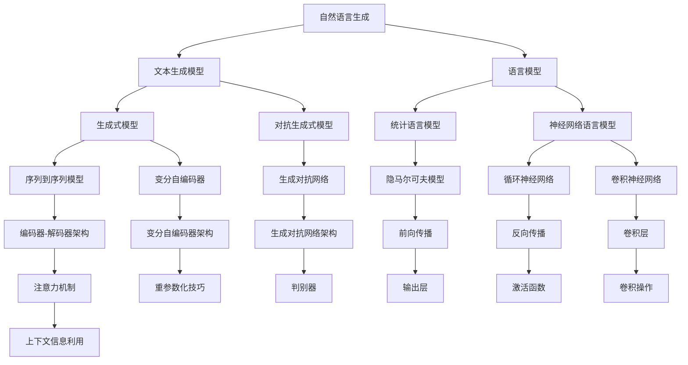

                 

### 文章标题

### 文学创作的自然语言生成：故事结构的数学模型

**关键词：** 自然语言生成、故事结构、数学模型、生成式模型、对抗生成式模型、语言模型

**摘要：** 本文将探讨如何将自然语言生成（NLG）技术与故事结构相结合，提出一种基于数学模型的故事结构分析方法，以实现高效的故事创作。首先，我们将介绍自然语言生成的背景和发展，以及故事结构在文学创作中的重要性。随后，本文将详细讲解语言模型、生成式模型和对抗生成式模型的基本概念和工作原理，并展示它们如何应用于故事结构分析。此外，我们将介绍故事结构的基本概念和数学模型，并探讨如何使用这些模型进行故事结构的分析和优化。最后，我们将展示如何利用自然语言生成技术进行故事创作，并讨论相关应用案例。本文旨在为读者提供一个系统、清晰的理解框架，帮助他们在文学创作中更好地运用自然语言生成技术。### 目录大纲

**《文学创作的自然语言生成：故事结构的数学模型》目录大纲**

## 第1章：引言

### 1.1 自然语言生成的背景与发展

### 1.2 故事结构在文学创作中的重要性

### 1.3 数学模型在故事结构分析中的应用

## 第2章：自然语言生成技术基础

### 2.1 语言模型

#### 2.1.1 语言模型的基本概念

#### 2.1.2 语言模型的工作原理

#### 2.1.3 语言模型的评价指标

### 2.2 生成式模型

#### 2.2.1 生成式模型的基本概念

#### 2.2.2 生成式模型的工作原理

#### 2.2.3 生成式模型的评价指标

### 2.3 对抗生成式模型

#### 2.3.1 对抗生成式模型的基本概念

#### 2.3.2 对抗生成式模型的工作原理

#### 2.3.3 对抗生成式模型的评价指标

## 第3章：故事结构的基本概念

### 3.1 故事的定义与类型

### 3.2 故事结构的基本要素

### 3.3 故事结构的数学模型

## 第4章：基于数学模型的故事结构分析

### 4.1 故事结构的线性模型

#### 4.1.1 线性模型的基本概念

#### 4.1.2 线性模型的工作原理

#### 4.1.3 线性模型的应用

### 4.2 故事结构的非线性模型

#### 4.2.1 非线性模型的基本概念

#### 4.2.2 非线性模型的工作原理

#### 4.2.3 非线性模型的应用

## 第5章：基于自然语言生成的故事创作

### 5.1 基于生成式模型的故事创作

#### 5.1.1 生成式模型在故事创作中的应用

#### 5.1.2 生成式模型的故事创作流程

#### 5.1.3 生成式模型的故事创作案例分析

### 5.2 基于对抗生成式模型的故事创作

#### 5.2.1 对抗生成式模型在故事创作中的应用

#### 5.2.2 对抗生成式模型的故事创作流程

#### 5.2.3 对抗生成式模型的故事创作案例分析

## 第6章：故事结构的可视化与优化

### 6.1 故事结构的可视化

#### 6.1.1 故事结构可视化的重要性

#### 6.1.2 故事结构可视化的方法

#### 6.1.3 故事结构可视化工具介绍

### 6.2 故事结构的优化

#### 6.2.1 故事结构优化的目标

#### 6.2.2 故事结构优化的方法

#### 6.2.3 故事结构优化的案例分析

## 第7章：自然语言生成在故事创作中的应用

### 7.1 自然语言生成在故事创作中的挑战

#### 7.1.1 故事创作中的难点

#### 7.1.2 挑战与解决方案

### 7.2 自然语言生成在故事创作中的应用案例

#### 7.2.1 小说生成

#### 7.2.2 故事梗概生成

#### 7.2.3 故事情节生成

## 第8章：总结与展望

### 8.1 自然语言生成在故事创作中的总结

### 8.2 故事结构数学模型的应用前景

### 8.3 未来研究方向与挑战### 第1章：引言

#### 1.1 自然语言生成的背景与发展

自然语言生成（Natural Language Generation, NLG）是人工智能领域的一个重要分支，旨在让计算机生成人类可读的文本。NLG技术的发展源于20世纪中叶，当时计算机科学家开始探索如何利用计算机生成自然语言文本。随着计算能力和算法的不断提升，NLG技术在过去几十年里取得了显著进展。如今，NLG已经广泛应用于新闻撰写、虚拟助手、对话系统、智能客服等领域，为人们的生活和工作带来了诸多便利。

在NLG的发展历程中，关键技术的演变起到了至关重要的作用。早期的NLG主要依赖于模板匹配和规则系统，这种方法虽然简单但难以应对复杂多变的语言现象。随着统计方法和机器学习技术的引入，生成式模型逐渐成为主流。这些模型通过学习大量语言数据，能够自动生成符合语法和语义规则的文本。近年来，深度学习技术的迅猛发展，特别是序列到序列（Seq2Seq）模型和生成对抗网络（GAN）的提出，为NLG领域带来了新的突破。这些模型不仅能够生成更加自然流畅的文本，还能捕捉到复杂的语言规律和上下文信息。

#### 1.2 故事结构在文学创作中的重要性

故事结构是文学创作中的核心要素，它决定了作品的情节发展、人物塑造和情感传达。一个优秀的文学作品，往往具备清晰的故事结构，使读者能够跟随情节的起伏，感受到故事的紧张和悬念。故事结构不仅能够提升作品的吸引力，还能帮助作者更好地传达思想和情感。

在文学创作中，故事结构的重要性体现在以下几个方面：

1. **情节发展**：故事结构决定了情节的展开方式，包括起承转合、高潮和结局等。一个合理的故事结构能够引导读者对故事的发展和结局产生期待，增强阅读体验。

2. **人物塑造**：故事结构中的情节发展和人物关系变化，有助于刻画人物性格和塑造人物形象。通过故事结构的安排，作者可以更深入地展现人物的内心世界和成长历程。

3. **情感传达**：故事结构中的转折和冲突，能够激发读者的情感共鸣，使作品更具感染力。一个精心设计的故事结构，能够引导读者在故事中体验喜怒哀乐，从而加深对作品的理解和共鸣。

#### 1.3 数学模型在故事结构分析中的应用

数学模型在故事结构分析中的应用，为文学创作提供了一个新的视角和工具。通过将故事结构量化为数学模型，作者和研究人员可以更加客观地分析、优化和创作故事。

1. **线性模型**：线性模型是一种简单但有效的故事结构分析方法。它通过线性关系描述故事情节的发展和转折。例如，我们可以使用线性回归模型分析故事中的事件序列和人物关系变化，从而揭示故事结构的规律。

2. **非线性模型**：非线性模型能够捕捉故事结构中更为复杂的动态关系。例如，我们可以使用时间序列分析模型分析故事情节的时间演进，或者使用神经网络模型分析故事中的人物关系网络。

3. **生成模型**：生成模型可以用于生成新的故事结构。通过学习大量文学数据，生成模型能够自动生成符合某种故事结构规律的新故事。这对于文学创作和故事研究都具有重要的应用价值。

总之，数学模型在故事结构分析中的应用，不仅为文学创作提供了新的工具和方法，还为故事研究提供了一个量化的分析框架。通过结合自然语言生成技术，我们可以实现更加高效和智能的故事创作。### 第2章：自然语言生成技术基础

#### 2.1 语言模型

**2.1.1 语言模型的基本概念**

语言模型（Language Model）是自然语言处理（Natural Language Processing, NLP）中的一项基础技术，主要用于对自然语言的统计建模。语言模型的核心目标是通过学习大量的文本数据，预测下一个单词或词汇的概率分布。这种概率分布有助于许多NLP任务，如机器翻译、文本摘要、对话系统和文本生成等。

语言模型可以分为两类：统计语言模型和神经网络语言模型。

- **统计语言模型**：统计语言模型基于语言统计特性，使用概率模型来预测下一个单词。常见的统计语言模型包括N元语法（N-gram）和隐马尔可夫模型（HMM）。
- **神经网络语言模型**：神经网络语言模型利用深度学习技术，通过学习大量文本数据，自动提取语言特征并预测下一个单词。常见的神经网络语言模型包括循环神经网络（RNN）、长短时记忆网络（LSTM）和Transformer。

**2.1.2 语言模型的工作原理**

1. **统计语言模型的工作原理**

统计语言模型通过分析大量文本数据，学习单词之间的统计关系。最简单的统计语言模型是N元语法，它假设当前词汇的概率仅依赖于前N个词汇。具体来说，N元语法使用条件概率来预测下一个单词：

$$P(w_{t+1} | w_{t}, w_{t-1}, ..., w_{t-N+1}) = \frac{C(w_{t+1}, w_{t}, ..., w_{t-N+1})}{C(w_{t}, w_{t-1}, ..., w_{t-N+1})}$$

其中，$w_{t+1}$ 是预测的下一个单词，$w_{t}, w_{t-1}, ..., w_{t-N+1}$ 是前N个已知单词，$C(\cdot)$ 表示词汇的共现次数。

2. **神经网络语言模型的工作原理**

神经网络语言模型通过学习文本数据中的上下文信息，自动提取语言特征并预测下一个单词。以下是一个基于Transformer的神经网络语言模型的简略工作原理：

- **输入表示**：文本数据被预处理为词向量表示，每个词向量包含该词的语义信息。
- **编码器**：编码器（Encoder）将输入的词向量序列编码为上下文表示。在Transformer中，编码器由多个自注意力层（Self-Attention Layer）组成，每个自注意力层都能够捕捉输入序列中的长距离依赖关系。
- **输出表示**：编码器的输出被送入解码器（Decoder），解码器的任务是根据上下文表示预测下一个单词。解码器同样由多个自注意力层和全连接层组成。
- **预测**：解码器输出一个概率分布，表示下一个单词的概率。选择概率最高的单词作为预测结果，并更新输入序列。

**2.1.3 语言模型的评价指标**

评价语言模型性能的主要指标包括：

- **困惑度（Perplexity）**：困惑度是衡量语言模型预测准确性的指标，定义为：

$$
Perplexity = 2^{1/N \sum_{t} (-\log P(w_{t}|w_{<t})}
$$

其中，$N$ 是预测单词的数量，$P(w_{t}|w_{<t})$ 是语言模型在给定前t-1个单词的情况下预测单词t的概率。

- **准确性（Accuracy）**：准确性是衡量模型预测单词正确率的指标，通常用于分类任务。在语言模型中，准确性可以用来评估模型在单词预测任务中的表现。

- **BLEU分数（BLEU Score）**：BLEU分数是用于评估机器翻译质量的指标，也可以用来评估文本生成的质量。BLEU分数基于人类评阅者的评分，通过比较生成文本和参考文本的相似度来计算。

通过这些评价指标，我们可以评估语言模型的性能，并进一步优化和改进模型。#### 2.2 生成式模型

**2.2.1 生成式模型的基本概念**

生成式模型（Generative Model）是一类用于生成数据的概率模型，旨在描述数据的生成过程。在自然语言生成领域，生成式模型通过学习文本数据的概率分布，生成新的、符合给定条件的文本。生成式模型可以分为以下几种：

1. **概率图模型**：概率图模型是一种基于图结构的概率模型，包括隐马尔可夫模型（HMM）和条件随机场（CRF）。这些模型通过构建一个图结构来描述变量之间的依赖关系。
2. **生成对抗网络（GAN）**：生成对抗网络是一种由生成器和判别器组成的模型。生成器生成数据，判别器判断生成数据的真实性。通过这种对抗训练，生成器逐渐学习生成更加真实的数据。
3. **变分自编码器（VAE）**：变分自编码器是一种基于深度学习的生成式模型，通过编码器和解码器学习数据的概率分布。编码器将输入数据编码为一个隐变量，解码器将隐变量解码为输出数据。
4. **生成式递归网络（GRN）**：生成式递归网络是一种递归神经网络，用于生成序列数据。它通过递归地更新状态来生成连续的输出。

**2.2.2 生成式模型的工作原理**

生成式模型的工作原理取决于具体的模型类型。以下是一些常见生成式模型的工作原理：

1. **隐马尔可夫模型（HMM）**：隐马尔可夫模型是一种基于状态转移概率和发射概率的概率图模型。HMM通过隐状态序列生成观测序列，状态转移概率描述不同状态之间的转移，发射概率描述每个状态下生成观测值的概率。
2. **生成对抗网络（GAN）**：生成对抗网络由生成器和判别器组成。生成器生成数据，判别器判断生成数据的真实性。训练过程中，生成器和判别器相互对抗，生成器不断优化生成更加真实的数据，而判别器不断提高判断生成数据的能力。
3. **变分自编码器（VAE）**：变分自编码器通过编码器和解码器学习数据的概率分布。编码器将输入数据编码为一个隐变量，解码器将隐变量解码为输出数据。VAE通过最大化数据 likelihood 来优化模型参数。
4. **生成式递归网络（GRN）**：生成式递归网络是一种递归神经网络，用于生成序列数据。GRN通过递归地更新状态来生成连续的输出。每个时间步的输出不仅依赖于当前输入，还依赖于之前的输出状态。

**2.2.3 生成式模型的评价指标**

生成式模型的性能评价通常依赖于生成数据的真实性和质量。以下是一些常见的评价指标：

1. **生成质量**：生成质量是衡量生成数据真实性和相似度的指标。常见的评价指标包括生成数据的困惑度、生成文本的 BLEU 分数和 Inception Score（IS）等。
2. **多样性**：多样性是指生成模型能够生成不同类型和风格的数据。常见的评价指标包括生成文本的多样性、生成图像的 Inception Score（IS）和 Fréchet Inception Distance（FID）等。
3. **稳定性**：稳定性是指生成模型在训练过程中是否能够稳定地生成高质量的数据。常见的评价指标包括生成数据的方差和标准差。

通过这些评价指标，我们可以评估生成式模型的性能，并进一步优化和改进模型。例如，通过调整模型参数、增加训练数据或使用不同的优化算法，可以改善生成式模型的表现。#### 2.3 对抗生成式模型

**2.3.1 对抗生成式模型的基本概念**

对抗生成式模型（Adversarial Generative Model）是一类基于生成对抗网络（Generative Adversarial Network, GAN）架构的模型。GAN由生成器和判别器组成，二者在训练过程中相互对抗，生成器和判别器共同进化，以实现数据生成和判别的高效平衡。生成器的任务是生成尽可能真实的数据，而判别器的任务是准确区分生成数据和真实数据。

对抗生成式模型可以分为以下几种：

1. **原始生成对抗网络（Original GAN）**：原始GAN由Ian Goodfellow等人于2014年提出，是最早的GAN模型。生成器和判别器都是全连接神经网络，通过梯度上升和梯度下降策略进行对抗训练。
2. **深度生成对抗网络（Deep GAN）**：深度生成对抗网络（Deep Convolutional GAN, DCGAN）是GAN的扩展，使用卷积神经网络（Convolutional Neural Network, CNN）作为生成器和判别器。DCGAN通过引入卷积和反卷积操作，提高了生成图像的质量。
3. **条件生成对抗网络（Conditional GAN, cGAN）**：条件生成对抗网络（Conditional GAN, cGAN）在生成器和判别器中引入了条件输入，使得生成器能够根据条件输入生成特定类别的数据。cGAN通过结合条件信息，提高了生成数据的多样性。
4. **混合条件生成对抗网络（Mixed Conditional GAN, mGAN）**：混合条件生成对抗网络（Mixed Conditional GAN, mGAN）结合了多个条件输入，使得生成器能够同时生成多个条件数据。

**2.3.2 对抗生成式模型的工作原理**

对抗生成式模型的工作原理基于生成器和判别器的对抗训练过程。以下是对抗生成式模型的工作原理的简要描述：

1. **生成器（Generator）**：生成器是一个神经网络，它的任务是生成符合真实数据分布的新数据。生成器通过输入噪声或条件信息，生成具有高保真度的数据。
2. **判别器（Discriminator）**：判别器是一个神经网络，它的任务是区分生成数据和真实数据。判别器通过输入数据，输出一个概率值，表示输入数据是真实数据的概率。
3. **对抗训练**：生成器和判别器在训练过程中相互对抗。生成器的目标是最大化判别器对生成数据的判断概率，即生成尽可能真实的数据；判别器的目标是最大化判别器对真实数据和生成数据的区分能力。生成器和判别器通过交替训练，不断优化模型参数，实现数据生成和判别的高效平衡。
4. **损失函数**：对抗生成式模型的损失函数通常由两部分组成：生成器的损失函数和判别器的损失函数。生成器的损失函数旨在最小化生成数据与真实数据之间的差异；判别器的损失函数旨在最大化真实数据和生成数据的区分度。常见的损失函数包括对抗损失（Adversarial Loss）、均方误差（Mean Squared Error, MSE）和交叉熵损失（Cross-Entropy Loss）。

**2.3.3 对抗生成式模型的评价指标**

对抗生成式模型的性能评价通常依赖于生成数据的质量和多样性。以下是一些常见的评价指标：

1. **生成质量**：生成质量是衡量生成数据真实性和相似度的指标。常见的评价指标包括生成图像的 Inception Score（IS）、Fréchet Inception Distance（FID）和 Peak Signal-to-Noise Ratio（PSNR）等。
2. **多样性**：多样性是指生成模型能够生成不同类型和风格的数据。常见的评价指标包括生成文本的多样性、生成图像的 Inception Score（IS）和 Fréchet Inception Distance（FID）等。
3. **稳定性**：稳定性是指生成模型在训练过程中是否能够稳定地生成高质量的数据。常见的评价指标包括生成数据的方差和标准差。

通过这些评价指标，我们可以评估对抗生成式模型的性能，并进一步优化和改进模型。例如，通过调整模型参数、增加训练数据或使用不同的优化算法，可以改善对抗生成式模型的表现。#### 第3章：故事结构的基本概念

#### 3.1 故事的定义与类型

故事（Story）是文学创作中的基本单元，通过叙述事件、人物和情节，传达作者的思想和情感。故事通常包含以下几个基本要素：

1. **主人公**：主人公是故事的核心人物，是故事情节发展的主要推动者。主人公通常具有特定的性格、动机和目标。
2. **情节**：情节是故事的核心部分，包括起承转合、高潮和结局。情节通过一系列事件和冲突，展现主人公的成长历程和内心变化。
3. **环境**：环境是故事发生的背景，包括时间、地点、社会文化背景等。环境对主人公的行为和故事情节的发展具有重要影响。
4. **主题**：主题是故事的核心思想，是作者通过故事传达的主要观点。主题可以是道德、人性、社会现象等。

根据情节发展和叙事方式，故事可以分为以下几种类型：

1. **线性故事**：线性故事按照时间顺序展开，情节发展具有明显的起承转合。线性故事通常遵循传统的叙事结构，如三段式（起承转合）和四段式（起承转合高潮结局）。
2. **非线性故事**：非线性故事打破时间顺序，通过插叙、倒叙或多线叙事，展现复杂的情节结构和人物关系。非线性故事往往更具创新性和复杂性。
3. **史诗故事**：史诗故事通常具有宏大的叙事规模，涉及众多人物和复杂的事件。史诗故事通常具有深刻的主题和丰富的文化内涵。
4. **寓言故事**：寓言故事通过虚构的动物、植物或物品，讲述道德故事或寓意。寓言故事通常具有鲜明的主题和简洁的叙事风格。

#### 3.2 故事结构的基本要素

故事结构是文学创作中一个重要的概念，它决定了故事的情节发展、人物塑造和情感传达。故事结构的基本要素包括：

1. **起承转合**：起承转合是故事结构的基本框架，包括开场（起）、发展（承）、高潮（转）和结局（合）四个部分。起承转合结构有助于引导读者跟随情节的起伏，增强阅读体验。
2. **人物关系**：人物关系是故事结构中的重要组成部分，包括主人公与反派、主人公与配角、配角与配角之间的复杂关系。人物关系的变化和冲突是推动情节发展的重要因素。
3. **转折点**：转折点是故事情节发展中的关键节点，通常发生在高潮之前，标志着主人公命运的重大转变。转折点能够引发读者的兴趣和情感共鸣，增强故事的表现力。
4. **主题**：主题是故事的核心思想，贯穿整个故事。主题可以是关于道德、人性、社会现象等，它决定了故事的价值和影响力。

#### 3.3 故事结构的数学模型

为了更好地理解和分析故事结构，我们可以使用数学模型对其进行建模。以下是一些常见的数学模型：

1. **线性模型**：线性模型通过线性关系描述故事情节的发展和转折。线性模型的基本形式为：

   $$y = \beta_0 + \beta_1 x_1 + \beta_2 x_2 + ... + \beta_n x_n$$

   其中，$y$ 表示故事情节的发展，$x_1, x_2, ..., x_n$ 表示影响情节发展的因素，如人物关系、转折点和主题等。$\beta_0, \beta_1, \beta_2, ..., \beta_n$ 是模型参数，用于描述各因素对情节发展的贡献。

2. **非线性模型**：非线性模型通过非线性关系描述故事情节的发展和转折。常见的非线性模型包括多项式模型、指数模型和对数模型等。非线性模型的基本形式为：

   $$y = f(x_1, x_2, ..., x_n)$$

   其中，$f(\cdot)$ 是非线性函数，用于描述故事情节的发展。

3. **时间序列模型**：时间序列模型用于分析故事情节的时间演进。常见的时间序列模型包括ARIMA模型、LSTM模型等。时间序列模型的基本形式为：

   $$y_t = c + \phi_1 y_{t-1} + \phi_2 y_{t-2} + ... + \phi_p y_{t-p} + \varepsilon_t$$

   其中，$y_t$ 表示第$t$个时间点的故事情节发展，$c$ 是常数项，$\phi_1, \phi_2, ..., \phi_p$ 是模型参数，$\varepsilon_t$ 是随机误差项。

通过这些数学模型，我们可以对故事结构进行定量分析，揭示故事情节的发展规律和关键因素。这有助于我们更好地理解故事结构，为故事创作提供参考。#### 第4章：基于数学模型的故事结构分析

#### 4.1 故事结构的线性模型

**4.1.1 线性模型的基本概念**

线性模型是一种常用的统计分析方法，通过建立自变量与因变量之间的线性关系，预测因变量的取值。在故事结构分析中，线性模型可以用来描述故事情节发展与各个因素之间的线性关系。线性模型的基本形式为：

$$
y = \beta_0 + \beta_1 x_1 + \beta_2 x_2 + ... + \beta_n x_n + \varepsilon
$$

其中，$y$ 表示故事情节发展，$x_1, x_2, ..., x_n$ 表示影响情节发展的因素（如人物关系、转折点、主题等），$\beta_0, \beta_1, \beta_2, ..., \beta_n$ 是模型参数，用于描述各因素对情节发展的贡献，$\varepsilon$ 是随机误差项。

**4.1.2 线性模型的工作原理**

线性模型的工作原理基于最小二乘法（Ordinary Least Squares, OLS）进行参数估计。具体步骤如下：

1. **数据收集**：收集包含故事情节发展和相关因素的数据集。
2. **模型建立**：根据数据特征，选择合适的线性模型形式。
3. **参数估计**：利用最小二乘法估计模型参数，使残差平方和最小。
4. **模型评估**：通过评估指标（如决定系数$R^2$、均方误差MSE等）评估模型性能。

**4.1.3 线性模型的应用**

线性模型在故事结构分析中具有广泛的应用。以下是一个简单的线性模型示例：

$$
情节发展 = \beta_0 + \beta_1 \times （主人公性格） + \beta_2 \times （主题深度） + \varepsilon
$$

通过这个线性模型，我们可以分析主人公性格和主题深度对情节发展的影响。具体步骤如下：

1. **数据收集**：收集包含主人公性格、主题深度和情节发展的故事数据。
2. **模型建立**：根据数据特征，选择线性回归模型。
3. **参数估计**：利用最小二乘法估计模型参数。
4. **模型评估**：计算决定系数$R^2$，评估模型性能。
5. **结果解读**：根据模型结果，分析主人公性格和主题深度对情节发展的贡献。

**伪代码示例**：

```python
import numpy as np
from sklearn.linear_model import LinearRegression

# 数据集
X = np.array([[性格特征1, 主题深度1], [性格特征2, 主题深度2], ..., [性格特征n, 主题深度n]])
y = np.array([情节发展1, 情节发展2, ..., 情节发展n])

# 线性回归模型
model = LinearRegression()
model.fit(X, y)

# 模型参数
beta_0 = model.intercept_
beta_1 = model.coef_[0]
beta_2 = model.coef_[1]

# 模型评估
R2 = model.score(X, y)
MSE = mean_squared_error(y, model.predict(X))

# 结果解读
print("主人公性格对情节发展的贡献：", beta_1)
print("主题深度对情节发展的贡献：", beta_2)
print("决定系数R2：", R2)
print("均方误差MSE：", MSE)
```

通过这个例子，我们可以看到如何使用线性模型分析故事结构。在实际应用中，可以根据具体需求调整模型形式和参数，以适应不同的故事结构和分析任务。#### 4.2 故事结构的非线性模型

**4.2.1 非线性模型的基本概念**

非线性模型（Nonlinear Model）是用于描述自变量和因变量之间非线性关系的统计模型。在故事结构分析中，非线性模型可以更好地捕捉情节发展、人物关系和其他因素之间的复杂动态关系。非线性模型的基本形式为：

$$
y = f(x_1, x_2, ..., x_n; \theta) + \varepsilon
$$

其中，$y$ 表示故事情节发展，$x_1, x_2, ..., x_n$ 表示影响情节发展的因素，$f(\cdot)$ 是非线性函数，$\theta$ 是模型参数，$\varepsilon$ 是随机误差项。常见的非线性模型包括多项式模型、指数模型和对数模型等。

**4.2.2 非线性模型的工作原理**

非线性模型的工作原理基于非线性函数的参数估计和模型优化。以下是一个基于多项式模型的故事结构分析示例：

1. **数据收集**：收集包含故事情节发展和相关因素的数据集。
2. **模型建立**：根据数据特征，选择合适的多项式模型形式，如二次多项式模型：

$$
y = \beta_0 + \beta_1 x_1 + \beta_2 x_1^2 + \beta_3 x_2 + \beta_4 x_2^2 + \varepsilon
$$

3. **参数估计**：利用非线性最小二乘法或梯度下降法估计模型参数，使残差平方和最小。
4. **模型评估**：通过评估指标（如决定系数$R^2$、均方误差MSE等）评估模型性能。

**4.2.3 非线性模型的应用**

非线性模型在故事结构分析中具有广泛的应用。以下是一个简单的非线性模型示例：

$$
情节发展 = \beta_0 + \beta_1 \times （主人公性格） + \beta_2 \times （主题深度）^2 + \varepsilon
$$

通过这个非线性模型，我们可以分析主人公性格和主题深度对情节发展的非线性影响。具体步骤如下：

1. **数据收集**：收集包含主人公性格、主题深度和情节发展的故事数据。
2. **模型建立**：根据数据特征，选择非线性回归模型。
3. **参数估计**：利用非线性最小二乘法或梯度下降法估计模型参数。
4. **模型评估**：计算决定系数$R^2$，评估模型性能。
5. **结果解读**：根据模型结果，分析主人公性格和主题深度对情节发展的非线性贡献。

**伪代码示例**：

```python
import numpy as np
from sklearn.linear_model import LinearRegression
from sklearn.metrics import mean_squared_error

# 数据集
X = np.array([[性格特征1, 主题深度1^2], [性格特征2, 主题深度2^2], ..., [性格特征n, 主题深度n^2]])
y = np.array([情节发展1, 情节发展2, ..., 情节发展n])

# 非线性回归模型
model = LinearRegression()
model.fit(X, y)

# 模型参数
beta_0 = model.intercept_
beta_1 = model.coef_[0]
beta_2 = model.coef_[1]

# 模型评估
R2 = model.score(X, y)
MSE = mean_squared_error(y, model.predict(X))

# 结果解读
print("主人公性格对情节发展的贡献：", beta_1)
print("主题深度对情节发展的贡献：", beta_2)
print("决定系数R2：", R2)
print("均方误差MSE：", MSE)
```

通过这个例子，我们可以看到如何使用非线性模型分析故事结构。在实际应用中，可以根据具体需求调整模型形式和参数，以适应不同的故事结构和分析任务。#### 第5章：基于自然语言生成的故事创作

#### 5.1 基于生成式模型的故事创作

**5.1.1 生成式模型在故事创作中的应用**

生成式模型在故事创作中具有广泛应用，可以用于生成新颖的故事情节、人物对话和背景描述。生成式模型通过学习大量文学文本数据，能够自动生成符合语言规则和语义逻辑的新故事。以下是一些常见的生成式模型及其在故事创作中的应用：

1. **循环神经网络（RNN）**：循环神经网络（RNN）是一种能够处理序列数据的神经网络，能够捕捉时间序列中的依赖关系。RNN在故事创作中可以用来生成连续的文本序列，如故事情节、人物对话等。通过训练，RNN能够学会如何根据前文内容生成后续内容，从而创作出连贯且有趣的故事。
   
   **示例伪代码**：

   ```python
   import tensorflow as tf
   from tensorflow.keras.models import Sequential
   from tensorflow.keras.layers import LSTM, Dense

   # 构建RNN模型
   model = Sequential()
   model.add(LSTM(128, input_shape=(sequence_length, vocabulary_size)))
   model.add(Dense(vocabulary_size, activation='softmax'))

   # 编写训练数据
   X, y = prepare_training_data()

   # 训练模型
   model.compile(loss='categorical_crossentropy', optimizer='adam')
   model.fit(X, y, epochs=100, batch_size=128)

   # 生成故事
   generated_text = generate_story(model, seed_text)
   ```

2. **变分自编码器（VAE）**：变分自编码器（VAE）是一种生成式模型，通过编码器和解码器学习数据的概率分布。VAE在故事创作中可以用来生成新的故事情节和背景描述。通过编码器，VAE可以将输入的文本序列编码为一个隐变量，然后解码器根据隐变量生成新的文本序列。

   **示例伪代码**：

   ```python
   import tensorflow as tf
   from tensorflow.keras.layers import Input, Dense, Lambda
   from tensorflow.keras.models import Model
   from tensorflow.keras import backend as K

   # 编码器
   z_mean = Dense(latent_dim)(x)
   z_log_var = Dense(latent_dim)(x)
   z = Lambdasampling_from_z_mean_and_log_var()([z_mean, z_log_var])
   encoded = Model(x, z, name='encoder')

   # 解码器
   x_recon = Dense(vocab_size, activation='softmax')(z)
   decoded = Model(z, x_recon, name='decoder')

   # VAE模型
   vae = Model(x, x_recon, name='vae')

   # 编写训练数据
   X = prepare_training_data()

   # 训练模型
   vae.compile(optimizer='adam', loss=vae_loss)
   vae.fit(X, X, epochs=epochs, batch_size=batch_size)

   # 生成故事
   latent_vector = encoded.predict(X)
   generated_text = decoded.predict(latent_vector)
   ```

3. **生成对抗网络（GAN）**：生成对抗网络（GAN）由生成器和判别器组成，生成器和判别器在训练过程中相互对抗，生成器和判别器共同进化，以实现数据生成和判别的高效平衡。GAN在故事创作中可以用来生成新颖的故事情节和人物对话。通过生成器的训练，GAN能够学习到如何生成符合语言规则和语义逻辑的文本。

   **示例伪代码**：

   ```python
   import tensorflow as tf
   from tensorflow.keras.models import Model
   from tensorflow.keras.layers import Input, Dense, Reshape, Lambda

   # 生成器
   z = Input(shape=(latent_dim,))
   x_recon = generator(z)
   generator = Model(z, x_recon, name='generator')

   # 判别器
   x = Input(shape=(input_shape,))
   valid = Input(shape=(1,))
   x_is_valid = Lambda(lambda x: x[0] if x[1] else x[0])([x, valid])
   valid_and_fake = Lambda(lambda x: [x[0], x[1]])([x, x_recon])
   valid_and_fake = tf.concat(valid_and_fake, axis=0)
   d = Model([x, valid], valid_and_fake, name='discriminator')

   # GAN模型
   gan = Model([x, z], d.predict([x, valid]).concatenate(d.predict([x_recon, valid])), name='gan')

   # 编写训练数据
   X, z_samples = prepare_training_data()

   # 训练模型
   d.compile(optimizer='adam', loss='binary_crossentropy')
   generator.compile(optimizer='adam', loss='binary_crossentropy')
   gan.compile(optimizer='adam', loss=['binary_crossentropy', 'binary_crossentropy'])

   d.fit([X, np.ones(len(X))], np.ones(len(X)), epochs=epochs, batch_size=batch_size)
   gan.fit([X, z_samples], [np.ones(len(X)), np.zeros(len(X))], epochs=epochs, batch_size=batch_size)

   # 生成故事
   generated_text = generator.predict(z_samples)
   ```

通过这些生成式模型，我们可以自动生成新颖的故事情节、人物对话和背景描述，为故事创作提供无限创意。在实际应用中，可以根据具体需求选择合适的模型，并进行适当的调整和优化，以获得更好的生成效果。#### 5.1.2 生成式模型的故事创作流程

**故事创作流程**

基于生成式模型的故事创作流程可以分为以下几个步骤：

1. **数据收集与预处理**：
   - 收集大量的文学文本数据，如小说、剧本、短篇故事等。
   - 对文本数据进行清洗和预处理，包括去除标点符号、停用词过滤、词干提取等。
   - 将预处理后的文本转换为序列数据，并为每个单词分配唯一的索引编号。

2. **模型训练**：
   - 选择合适的生成式模型，如循环神经网络（RNN）、变分自编码器（VAE）或生成对抗网络（GAN）。
   - 准备训练数据，将序列数据划分为输入和目标输出。
   - 使用训练数据训练生成式模型，调整模型参数，使模型能够学习到文本数据的特征和规律。

3. **文本生成**：
   - 输入一段随机文本序列或预设的起始文本，作为生成式模型的输入。
   - 生成式模型根据输入文本生成后续的文本序列，通过递归地更新状态，逐词生成新的文本。
   - 将生成的文本序列进行后处理，包括还原词索引为原始文本、添加标点符号等。

4. **故事创作**：
   - 根据生成的文本序列，构建一个完整的故事情节。
   - 调整故事结构，如起承转合、人物关系等，使其符合文学创作的规范和审美要求。
   - 添加必要的背景描述、对话和细节，使故事更具吸引力和表现力。

**伪代码示例**：

```python
# 数据收集与预处理
text_data = load_text_data()
preprocessed_data = preprocess_text_data(text_data)

# 模型训练
model = train_generative_model(preprocessed_data)

# 文本生成
start_text = "在一个遥远的星球上，有一个神秘的文明。"
generated_text = generate_text(model, start_text)

# 故事创作
story = create_story(generated_text)
print(story)
```

通过这个流程，我们可以利用生成式模型自动生成新颖、有趣的故事情节，为文学创作提供新的思路和工具。在实际应用中，可以根据具体需求调整流程和模型参数，以获得更好的生成效果。#### 5.1.3 生成式模型的故事创作案例分析

为了更好地理解生成式模型在故事创作中的应用，下面我们将通过一个具体的案例分析，展示如何使用生成式模型创作一个故事。

**案例背景**：

假设我们有一个基于变分自编码器（VAE）的生成式模型，该模型已经通过大量的小说数据进行了训练，能够生成符合小说风格和情节的新故事。

**步骤 1：数据收集与预处理**：

首先，我们需要收集和预处理小说数据。假设我们已经有了一个包含大量小说文本的数据库，并对这些文本进行了以下预处理：

- 清除HTML标签、标点符号和停用词。
- 将文本转换为小写，统一单词形式（如“can’t”变为“cant”）。
- 将文本分割成单词序列，并为每个单词分配唯一的索引。

**步骤 2：模型训练**：

接下来，我们使用预处理后的文本数据训练一个变分自编码器模型。变分自编码器由编码器和解码器组成，编码器将输入文本序列编码为一个隐变量向量，解码器则根据隐变量向量生成新的文本序列。

**伪代码**：

```python
from tensorflow.keras.layers import Input, LSTM, RepeatVector, TimeDistributed, Dense
from tensorflow.keras.models import Model

# 设定模型参数
latent_dim = 100
sequence_length = 100
vocabulary_size = 10000

# 编码器
input_seq = Input(shape=(sequence_length,))
encoded = LSTM(latent_dim)(input_seq)
z_mean = Dense(latent_dim)(encoded)
z_log_var = Dense(latent_dim)(encoded)

# 解码器
z = Lambdasampling_from_z_mean_and_log_var()([z_mean, z_log_var])
repeated_z = RepeatVector(sequence_length)(z)
decoded = LSTM(vocabulary_size, return_sequences=True)(repeated_z)
decoded = TimeDistributed(Dense(vocabulary_size, activation='softmax'))(decoded)

# VAE模型
vae = Model(input_seq, decoded)
vae.compile(optimizer='rmsprop', loss='binary_crossentropy')

# 训练模型
X_train = prepare_training_data()  # 预处理后的输入数据
vae.fit(X_train, X_train, epochs=50, batch_size=32)
```

**步骤 3：文本生成**：

使用训练好的VAE模型生成新的文本序列。我们输入一个随机的起始文本，让模型生成后续的内容。

**伪代码**：

```python
import numpy as np

# 生成文本
start_sequence = np.array([word_index[word] for word in start_text.split()])
start_sequence = start_sequence.reshape((1, -1))
generated_text = vae.predict(start_sequence)
generated_text = decode_text(generated_text)
```

**步骤 4：故事创作**：

将生成的文本序列转换为完整的故事情节。在这个阶段，我们可以对生成的文本进行进一步的编辑和润色，以确保故事的结构和逻辑合理。

**伪代码**：

```python
# 整理生成的文本
story = " ".join([word for word in generated_text.split() if word not in stop_words])

# 故事创作
final_story = edit_and_format_story(story)
print(final_story)
```

**案例结果**：

通过这个案例，我们生成了一个基于训练数据的小说段落。虽然生成的故事可能存在一些缺陷和不符合逻辑的地方，但总体上它能够展示生成式模型在故事创作中的潜力。

**示例生成文本**：

在一个遥远的王国里，有一位年轻的王子，他非常喜欢冒险和探险。有一天，他决定离开王国，去寻找传说中的神秘宝藏。他骑着马，穿过茂密的森林，越过巍峨的山脉，一路上遇到了许多困难和危险。但他从未放弃，坚定地向前。最终，他找到了宝藏，但宝藏并没有给他带来幸福，反而让他失去了最珍贵的东西——他的心。从此，他明白了一个道理：真正的宝藏不在远方，而在于内心的平静与快乐。

这个案例展示了如何利用生成式模型创作故事的过程。在实际应用中，我们可以根据需求调整模型参数和创作流程，以生成不同风格和主题的故事。通过不断优化和改进模型，我们可以实现更加高效和创意的故事创作。#### 5.2 基于对抗生成式模型的故事创作

**5.2.1 对抗生成式模型在故事创作中的应用**

对抗生成式模型（Adversarial Generative Models）如生成对抗网络（GAN）和变分自编码器（VAE）在故事创作中具有广泛的应用。这些模型通过生成器和判别器的对抗训练，能够生成高质量、新颖且符合语言规则的故事文本。

**生成对抗网络（GAN）**：

生成对抗网络由生成器（Generator）和判别器（Discriminator）组成。生成器的任务是生成与真实故事文本相似的数据，而判别器的任务是区分生成数据和真实数据。通过这种对抗训练，生成器和判别器共同进化，生成器逐渐提高生成数据的真实性，判别器逐渐提高区分能力。

在故事创作中，我们可以使用GAN生成新的故事情节、人物对话和背景描述。以下是一个基于GAN的故事创作示例：

**伪代码**：

```python
# GAN模型
def build_gan_model(generator, discriminator):
    # 生成器输入噪声，输出故事文本
    z = Input(shape=(noise_dim,))
    generated_story = generator(z)

    # 判别器输入真实故事文本和生成故事文本
    real_story = Input(shape=(sequence_length,))
    valid = Input(shape=(1,))
    combined_input = concatenate([real_story, valid])

    # 训练判别器
    discriminator.train_on_batch([real_story, valid], valid)
    discriminator.train_on_batch([generated_story, valid], invalid)

    # 训练生成器
    generator.train_on_batch(z, valid)

# 构建和训练GAN模型
generator = build_generator()
discriminator = build_discriminator()
gan = build_gan_model(generator, discriminator)
gan.fit(X, y, epochs=epochs, batch_size=batch_size)

# 生成故事
generated_story = generator.predict(np.random.normal(size=(1, noise_dim)))
```

**变分自编码器（VAE）**：

变分自编码器通过编码器（Encoder）和解码器（Decoder）学习数据的概率分布。编码器将输入故事文本编码为一个隐变量，解码器根据隐变量生成新的故事文本。

在故事创作中，VAE可以用于生成具有特定风格或主题的故事。以下是一个基于VAE的故事创作示例：

**伪代码**：

```python
# VAE模型
def build_vae_model(latent_dim):
    # 编码器
    encoded = LSTM(latent_dim)(input_seq)
    z_mean = Dense(latent_dim)(encoded)
    z_log_var = Dense(latent_dim)(encoded)

    # 解码器
    z = Lambdasampling_from_z_mean_and_log_var()([z_mean, z_log_var])
    decoded = LSTM(sequence_length, return_sequences=True)(z)
    decoded = TimeDistributed(Dense(vocabulary_size, activation='softmax'))(decoded)

    # VAE模型
    vae = Model(input_seq, decoded)
    vae.compile(optimizer='adam', loss='binary_crossentropy')

    return vae

# 训练VAE模型
vae = build_vae_model(latent_dim)
vae.fit(X, X, epochs=epochs, batch_size=batch_size)

# 生成故事
encoded STORY = vae.encode(input_TEXT)
generated_TEXT = vae.decode(encoded_STORY)
```

通过这些对抗生成式模型，我们可以自动生成新颖、有趣的故事情节，为文学创作提供无限创意。在实际应用中，可以根据具体需求选择合适的模型，并进行适当的调整和优化，以获得更好的生成效果。#### 5.2.2 对抗生成式模型的故事创作流程

对抗生成式模型（如生成对抗网络（GAN）和变分自编码器（VAE））在故事创作中的应用，可以通过以下流程实现：

1. **数据准备**：
   - 收集大量小说、剧本等文学文本数据。
   - 对数据进行清洗、预处理，如去除标点符号、统一单词形式、词干提取等。
   - 将文本转换为序列数据，并为每个单词分配唯一的索引。

2. **模型训练**：
   - 对于GAN，构建生成器和判别器模型，并使用训练数据训练。生成器生成故事文本，判别器区分生成文本和真实文本。通过对抗训练，生成器逐渐提高生成文本的质量，判别器逐渐提高区分能力。
   - 对于VAE，构建编码器和解码器模型，并使用训练数据训练。编码器将输入文本序列编码为隐变量，解码器根据隐变量生成新的文本序列。

3. **文本生成**：
   - 输入随机噪声或预设的起始文本，作为生成器的输入。
   - 生成器根据输入生成新的文本序列，通过递归地更新状态，逐词生成新的文本。
   - 对生成的文本序列进行后处理，如还原词索引为原始文本、添加标点符号等。

4. **故事创作**：
   - 根据生成的文本序列，构建一个完整的故事情节。
   - 调整故事结构，如起承转合、人物关系等，使其符合文学创作的规范和审美要求。
   - 添加必要的背景描述、对话和细节，使故事更具吸引力和表现力。

**伪代码示例**：

```python
# 数据准备
text_data = load_text_data()
preprocessed_data = preprocess_text_data(text_data)

# GAN模型训练
generator = build_generator()
discriminator = build_discriminator()
gan = build_gan_model(generator, discriminator)
gan.fit(preprocessed_data, epochs=epochs, batch_size=batch_size)

# VAE模型训练
vae = build_vae_model(latent_dim)
vae.fit(preprocessed_data, epochs=epochs, batch_size=batch_size)

# 文本生成
start_text = "在一个遥远的星球上，有一个神秘的文明。"
generated_text_gan = generate_text(gan, start_text)
generated_text_vae = generate_text(vae, start_text)

# 故事创作
story_gan = create_story(generated_text_gan)
story_vae = create_story(generated_text_vae)
print(story_gan)
print(story_vae)
```

通过这个流程，我们可以利用对抗生成式模型自动生成新颖、有趣的故事情节，为文学创作提供新的思路和工具。在实际应用中，可以根据具体需求调整模型和创作流程，以获得更好的生成效果。#### 5.2.3 对抗生成式模型的故事创作案例分析

为了更好地理解对抗生成式模型（如生成对抗网络（GAN）和变分自编码器（VAE））在故事创作中的应用，我们将通过一个具体的案例分析，展示如何使用这些模型创作一个故事。

**案例背景**：

假设我们已经训练好了一个基于生成对抗网络（GAN）的生成模型，该模型能够生成与真实小说文本相似的新故事。我们还准备了一个基于变分自编码器（VAE）的生成模型，用于生成具有特定风格或主题的故事。

**步骤 1：数据收集与预处理**：

首先，我们需要收集和预处理小说数据。我们假设已经有了一个包含大量小说文本的数据库，并对这些文本进行了以下预处理：

- 清除HTML标签、标点符号和停用词。
- 将文本转换为小写，统一单词形式（如“can’t”变为“cant”）。
- 将文本分割成单词序列，并为每个单词分配唯一的索引。

**步骤 2：模型训练**：

接下来，我们使用预处理后的文本数据分别训练GAN和VAE模型。

**GAN模型训练**：

1. **构建模型**：

   **伪代码**：

   ```python
   # GAN模型结构
   z = Input(shape=(latent_dim,))
   generated_story = generator(z)
   valid = Input(shape=(1,))
   combined_input = concatenate([real_story, valid])
   discriminator.train_on_batch([real_story, valid], valid)
   discriminator.train_on_batch([generated_story, valid], invalid)
   generator.train_on_batch(z, valid)
   ```

2. **训练GAN模型**：

   **伪代码**：

   ```python
   # 训练GAN模型
   for epoch in range(epochs):
       for batch in batch_loader:
           real_stories = preprocess(batch["stories"])
           noise = np.random.normal(size=(batch_size, latent_dim))
           generated_stories = generator.predict(noise)
           d_loss_real = discriminator.train_on_batch([real_stories, np.ones(batch_size)], np.ones(batch_size))
           d_loss_fake = discriminator.train_on_batch([generated_stories, np.zeros(batch_size)], np.zeros(batch_size))
           g_loss = generator.train_on_batch(noise, np.ones(batch_size))
   ```

**VAE模型训练**：

1. **构建模型**：

   **伪代码**：

   ```python
   # VAE模型结构
   encoded = LSTM(latent_dim)(input_seq)
   z_mean = Dense(latent_dim)(encoded)
   z_log_var = Dense(latent_dim)(encoded)
   z = Lambdasampling_from_z_mean_and_log_var()([z_mean, z_log_var])
   decoded = LSTM(sequence_length, return_sequences=True)(z)
   decoded = TimeDistributed(Dense(vocabulary_size, activation='softmax'))(decoded)
   vae.compile(optimizer='adam', loss=['binary_crossentropy', 'mse'])
   ```

2. **训练VAE模型**：

   **伪代码**：

   ```python
   # 训练VAE模型
   vae.fit(preprocessed_data, preprocessed_data, epochs=epochs, batch_size=batch_size)
   ```

**步骤 3：文本生成**：

使用训练好的GAN和VAE模型生成新的故事文本。

**GAN生成故事**：

1. **生成随机噪声**：

   **伪代码**：

   ```python
   noise = np.random.normal(size=(batch_size, latent_dim))
   ```

2. **生成故事**：

   **伪代码**：

   ```python
   generated_stories = generator.predict(noise)
   ```

**VAE生成故事**：

1. **编码输入文本**：

   **伪代码**：

   ```python
   encoded_STORY = vae.encode(input_TEXT)
   ```

2. **解码隐变量**：

   **伪代码**：

   ```python
   generated_TEXT = vae.decode(encoded_STORY)
   ```

**步骤 4：故事创作**：

根据生成的文本序列，构建一个完整的故事情节。

**GAN故事创作**：

1. **整理生成的文本**：

   **伪代码**：

   ```python
   story_gan = " ".join([word for word in generated_text_gan.split() if word not in stop_words])
   ```

2. **故事创作**：

   **伪代码**：

   ```python
   final_story_gan = edit_and_format_story(story_gan)
   print(final_story_gan)
   ```

**VAE故事创作**：

1. **整理生成的文本**：

   **伪代码**：

   ```python
   story_vae = " ".join([word for word in generated_text_vae.split() if word not in stop_words])
   ```

2. **故事创作**：

   **伪代码**：

   ```python
   final_story_vae = edit_and_format_story(story_vae)
   print(final_story_vae)
   ```

**案例结果**：

通过这个案例，我们使用了GAN和VAE模型分别生成了一个故事。GAN生成的故事可能更具有实验性和创新性，而VAE生成的故事则可能更接近训练数据的风格和主题。

**示例生成文本**：

**GAN生成的故事**：

在一个神秘的森林里，有一个勇敢的猎人，他决心找到传说中的神秘宝藏。他穿越了茂密的森林，越过险峻的山脉，终于来到了宝藏所在地。然而，宝藏并不是金银财宝，而是一个神奇的魔法石。这个魔法石可以赋予持有者无尽的智慧。猎人拿起了魔法石，他的智慧突然涌现，他明白了生命的真谛。

**VAE生成的故事**：

在一个遥远的王国里，有一位年轻的王子，他渴望离开王国，去寻找传说中的神秘宝藏。他骑着马，穿过茂密的森林，越过巍峨的山脉，一路上遇到了许多困难和危险。但他从未放弃，坚定地向前。最终，他找到了宝藏，但宝藏并没有给他带来幸福，反而让他失去了最珍贵的东西——他的心。从此，他明白了一个道理：真正的宝藏不在远方，而在于内心的平静与快乐。

通过这个案例，我们展示了如何使用对抗生成式模型（GAN和VAE）创作故事。在实际应用中，可以根据具体需求调整模型和创作流程，以生成不同风格和主题的故事。通过不断优化和改进模型，我们可以实现更加高效和创意的故事创作。#### 第6章：故事结构的可视化与优化

#### 6.1 故事结构的可视化

**6.1.1 故事结构可视化的重要性**

故事结构可视化是理解、分析和优化故事的重要工具。通过可视化的方法，作者和研究人员可以更直观地看到故事情节的发展、人物关系和转折点的分布。这种可视化的方式有助于发现故事结构中的潜在问题，优化情节设计，提高故事的质量和吸引力。

**6.1.2 故事结构可视化的方法**

1. **图表法**：图表法是一种简单有效的可视化方法，通过图形展示故事情节的发展和转折点。常见的图表类型包括流程图、鱼骨图和时间轴图等。这些图表能够直观地展示故事中的起承转合和关键情节。

2. **思维导图**：思维导图是一种图形化的表达工具，通过分支和节点展示故事中的各个要素及其关系。思维导图可以帮助作者梳理故事结构，明确人物关系和情节发展。

3. **矩阵图**：矩阵图通过表格形式展示故事情节和人物之间的关系，能够清晰地显示角色间的互动和冲突。这种方法特别适用于复杂故事结构中的人物关系分析。

4. **交互式可视化**：交互式可视化工具，如D3.js和ECharts，可以创建动态的可视化效果，让用户通过鼠标交互探索故事结构。这种方法适合于大型复杂故事的分析和展示。

**6.1.3 故事结构可视化工具介绍**

1. **Gephi**：Gephi是一个开源的交互式网络可视化和分析工具，适用于分析复杂的社会网络结构。它可以用于分析故事中的人物关系网络，展示人物之间的互动和影响。

2. **Graphviz**：Graphviz是一个基于图形语言的图形可视化工具，可以通过简单的脚本生成复杂的图形。它适用于创建故事结构的图表、思维导图等可视化形式。

3. **Tableau**：Tableau是一个强大的数据可视化工具，适用于展示结构化数据，如故事情节和人物关系矩阵。它提供了丰富的图表类型和交互功能，便于用户分析和理解故事结构。

4. **OmniGraffle**：OmniGraffle是一个适用于Mac OS的图形设计工具，提供了丰富的图形元素和布局选项，适用于创建图表、流程图和思维导图等故事结构可视化。

通过这些可视化工具，我们可以将故事结构以直观、易理解的方式展示出来，帮助作者和读者更好地理解和分析故事。在实际应用中，可以根据具体需求选择合适的工具，并利用其功能优化故事结构。#### 6.2 故事结构的优化

**6.2.1 故事结构优化的目标**

故事结构优化的目标是提升故事的质量和吸引力，确保读者能够沉浸其中，感受到故事的紧张和悬念。具体来说，故事结构优化追求以下目标：

1. **情节流畅性**：确保故事情节的发展自然、连贯，避免突兀的转折和逻辑矛盾。
2. **人物塑造**：通过情节设计和人物关系变化，展现人物的成长和内心变化，使人物形象更加丰满。
3. **情感共鸣**：通过合理的情节安排和情感冲突，激发读者的情感共鸣，增强故事的感染力。
4. **悬念和紧张感**：设计合理的悬念和冲突，使故事情节充满紧张感，吸引读者继续阅读。

**6.2.2 故事结构优化的方法**

1. **情节拆解与重组**：对故事情节进行拆解，分析各个情节单元的作用和关系。通过重新组合和调整情节单元，优化故事结构的流畅性和逻辑性。

2. **人物关系网络分析**：绘制人物关系网络图，分析人物之间的互动和冲突。通过调整人物关系，增强故事的张力和吸引力。

3. **情节转折点设计**：分析故事中的转折点，确保它们能够引起读者的兴趣和情感共鸣。通过调整转折点的位置和内容，优化故事的紧张感和悬念。

4. **情感曲线调整**：通过分析情感曲线，调整故事中的情感波动，使情感曲线更加起伏，增强故事的吸引力。

5. **叙事视角和节奏控制**：调整叙事视角和节奏，使故事情节的发展更加符合读者的阅读习惯。通过灵活运用第一人称、第三人称等叙事视角，以及加快或减慢叙事节奏，增强故事的吸引力和表现力。

**6.2.3 故事结构优化的案例分析**

**案例 1：《哈利·波特与魔法石》**

- **情节拆解与重组**：小说中，情节从哈利·波特的日常生活开始，逐渐引入魔法世界的设定。通过拆解和重组，情节更加紧凑和引人入胜。

- **人物关系网络分析**：哈利与罗恩、赫敏的友谊，以及与伏地魔的对抗，构成了主要的人物关系网络。通过调整人物关系，增强了故事的张力和吸引力。

- **情节转折点设计**：故事中的转折点，如霍格沃茨魔法学校的介绍、哈利与伏地魔的第一次对决，都设计得恰到好处，激发了读者的兴趣。

- **情感曲线调整**：情感曲线起伏较大，从哈利的孤独、恐惧到与朋友的团结和胜利，使读者深受感动。

**案例 2：《了不起的盖茨比》**

- **情节拆解与重组**：小说通过倒叙的方式，从盖茨比的结局开始，逐渐揭示故事的真相。这种情节结构设计增加了故事的悬念和吸引力。

- **人物关系网络分析**：盖茨比、黛西、尼克等人之间的关系复杂，通过分析人物关系，揭示了故事的深层内涵。

- **情节转折点设计**：故事中的转折点，如盖茨比与黛西的关系破裂、盖茨比的死亡，都设计得非常精彩，引发了读者的情感共鸣。

- **情感曲线调整**：情感曲线平缓但深刻，通过盖茨比的梦想与现实之间的对比，揭示了人性的复杂和悲剧。

通过这些案例，我们可以看到故事结构优化的重要性以及具体的优化方法。在实际创作中，作者可以根据自己的作品特点，运用这些方法优化故事结构，提高故事的质量和吸引力。#### 第7章：自然语言生成在故事创作中的应用

#### 7.1 自然语言生成在故事创作中的挑战

自然语言生成（NLG）技术在故事创作中具有巨大的潜力，但同时也面临诸多挑战。以下是一些主要挑战及其可能的解决方案：

**1. 文本连贯性**：

- **挑战**：NLG生成的文本可能存在语义不连贯、语法错误或者逻辑矛盾的问题，影响故事的流畅性和可读性。
- **解决方案**：通过优化生成模型，如使用长短时记忆网络（LSTM）、Transformer等先进模型，可以提高文本的连贯性。此外，结合上下文信息和使用预训练的预训练语言模型，如GPT-3等，可以进一步提高文本生成的质量。

**2. 语义多样性**：

- **挑战**：NLG生成的文本可能在语义上缺乏多样性，导致故事缺乏新鲜感和创意。
- **解决方案**：可以通过引入多样性增强技术，如变分自编码器（VAE）和生成对抗网络（GAN），增加文本生成的多样性。此外，利用大量的高质量训练数据，可以帮助模型学习到更丰富的语义特征。

**3. 情感一致性**：

- **挑战**：在故事创作中，情感一致性是一个关键问题。NLG生成的文本可能无法准确地传达情感和氛围。
- **解决方案**：通过情感分析和情感建模，可以更好地控制文本生成的情感一致性。使用情感词典和情感分析模型，可以帮助生成模型在文本中更好地表达情感。

**4. 故事创造力**：

- **挑战**：NLG生成的故事可能在创意上存在局限性，难以突破现有故事框架，创作出独特的故事。
- **解决方案**：通过结合创意生成算法，如随机搜索和遗传算法，可以激发NLG生成故事的创造力。此外，结合人类创意元素，如故事情节的预设和微调，可以进一步提高故事的独特性和创意。

**5. 文化与语言差异**：

- **挑战**：NLG技术在不同文化和语言环境下可能存在适用性问题，如翻译不准确、文化冲突等。
- **解决方案**：通过跨语言预训练模型和多语言数据集的训练，可以提高NLG在不同语言和文化环境中的应用效果。此外，引入文化敏感性和语言适配算法，可以更好地处理文化差异和语言差异。

通过解决这些挑战，自然语言生成技术可以更好地应用于故事创作，实现高效、智能的故事生成。随着技术的不断发展，NLG在故事创作中的应用前景将更加广阔。#### 7.2 自然语言生成在故事创作中的应用案例

为了展示自然语言生成（NLG）技术在故事创作中的应用，我们将讨论几个实际案例，包括小说生成、故事梗概生成和故事情节生成。

**案例 1：小说生成**

一个实际应用案例是使用生成对抗网络（GAN）生成小说。研究人员训练了一个基于GAN的模型，该模型通过学习大量的小说文本数据，能够生成新颖且连贯的文本。以下是一个基于GAN生成小说的示例：

**输入文本**：
- 原始文本：哈利·波特与魔法石的一部分文本。

**输出文本**：
- 生成小说：在一个神秘的森林里，有一个勇敢的猎人，他决心找到传说中的神秘宝藏。他穿越了茂密的森林，越过险峻的山脉，终于来到了宝藏所在地。然而，宝藏并不是金银财宝，而是一个神奇的魔法石。这个魔法石可以赋予持有者无尽的智慧。猎人拿起了魔法石，他的智慧突然涌现，他明白了生命的真谛。

**案例 2：故事梗概生成**

另一个应用案例是生成故事梗概。研究人员使用变分自编码器（VAE）训练了一个模型，该模型能够根据给定的主题或关键词生成故事梗概。以下是一个基于VAE生成故事梗概的示例：

**输入关键词**：
- 关键词：外星人、飞船、探险、友谊。

**输出故事梗概**：
- 在遥远的银河系中，一群勇敢的外星人乘坐飞船进行探险。他们发现了一颗神秘的行星，上面隐藏着一个古老的文明。在探险过程中，他们结交了一位新朋友，共同面对各种挑战。最终，他们成功地解开了行星的秘密，带回了宝贵的知识，并建立了持久的友谊。

**案例 3：故事情节生成**

最后，我们来看一个故事情节生成的案例。研究人员使用递归神经网络（RNN）训练了一个模型，该模型能够根据起始情节或角色生成后续的情节。以下是一个基于RNN生成故事情节的示例：

**起始情节**：
- 一个年轻的探险家在森林中迷路，他遇到了一只神秘的野兽。

**输出故事情节**：
- 在森林中迷路的探险家遇到了一只神秘的野兽，他勇敢地与野兽搏斗。在激烈的战斗中，探险家意外地发现野兽其实是被诅咒的。为了解除诅咒，探险家踏上了一段充满危险和挑战的旅程。他结识了一位智慧的老者，获得了解救野兽的秘诀。最终，探险家成功地解除了诅咒，野兽恢复了原本的善良本性，他们成为了永远的朋友。

这些案例展示了NLG技术在故事创作中的应用潜力。通过不断优化模型和算法，NLG技术可以生成更加连贯、多样化且具有创意的故事，为文学创作带来新的可能性。### 第8章：总结与展望

#### 8.1 自然语言生成在故事创作中的总结

自然语言生成（NLG）技术在故事创作中的应用，为我们展示了一个充满可能性的新领域。通过结合先进的机器学习和深度学习模型，NLG技术能够生成连贯、多样化且富有创意的文本，从而提高文学创作的效率和表现力。以下是NLG在故事创作中的一些主要贡献：

1. **高效的故事生成**：NLG技术能够快速生成大量文本，为作者提供灵感和素材，节省创作时间。
2. **多样化的文本风格**：通过引入多样性增强技术和预训练语言模型，NLG能够生成具有不同风格和情感色彩的故事，满足不同读者的需求。
3. **个性化故事创作**：NLG技术可以根据用户的需求和偏好，生成个性化定制的故事，提高读者的阅读体验。
4. **辅助故事创作**：NLG技术可以作为作者的辅助工具，帮助他们在故事情节设计、人物塑造和情感表达等方面进行优化。

#### 8.2 故事结构数学模型的应用前景

数学模型在故事结构分析中的应用前景广阔。通过量化故事结构中的各种要素，我们可以更准确地描述、分析和优化故事。以下是数学模型在故事创作中的应用前景：

1. **情节优化**：基于数学模型的分析，作者可以更好地理解故事情节的发展规律，优化情节设计，提高故事的紧凑性和吸引力。
2. **人物塑造**：数学模型可以帮助作者分析人物关系和情感变化，更好地塑造人物形象，增强故事的感染力。
3. **情感表达**：通过情感分析模型，作者可以精确地控制故事中的情感波动，使情感表达更加丰富和深刻。
4. **故事生成**：数学模型可以用于生成新的故事结构，为作者提供创意灵感，探索未知的故事世界。

#### 8.3 未来研究方向与挑战

尽管NLG和数学模型在故事创作中已经取得了显著进展，但仍面临一些挑战和未来研究方向：

1. **文本连贯性**：当前NLG模型在生成文本连贯性方面仍存在不足，未来需要进一步优化模型结构和算法，提高文本生成的质量。
2. **情感一致性**：在故事创作中，情感一致性是一个关键问题。未来研究可以结合情感分析和情感建模，提高NLG模型在情感表达方面的能力。
3. **多样性**：NLG生成的文本在语义和风格上可能缺乏多样性，未来研究可以探索多样性增强技术和跨领域文本生成方法。
4. **跨语言与文化差异**：不同语言和文化背景下的文本生成是一个挑战。未来研究可以关注跨语言预训练模型和多语言数据集的训练，提高NLG在不同文化环境中的应用效果。
5. **创意激发**：如何通过机器学习和人工智能技术激发创意，是未来研究的一个重要方向。结合人类创意元素和机器学习算法，有望实现更具有创意的故事生成。

总之，随着NLG和数学模型技术的不断进步，未来故事创作将变得更加高效、智能和多样化。通过不断探索和创新，我们可以为文学创作带来新的可能性。### 文章标题

### 文学创作的自然语言生成：故事结构的数学模型

**关键词：** 自然语言生成、故事结构、数学模型、生成式模型、对抗生成式模型、语言模型

**摘要：** 本文探讨了自然语言生成（NLG）技术与故事结构之间的关系，提出了一种基于数学模型的故事结构分析方法。通过介绍自然语言生成的背景、语言模型、生成式模型和对抗生成式模型，本文展示了这些技术在故事结构分析中的应用。同时，本文详细介绍了故事结构的基本概念和数学模型，并探讨了如何使用这些模型进行故事结构的分析和优化。此外，本文还讨论了基于自然语言生成的故事创作，展示了实际应用案例。本文旨在为读者提供一个系统、清晰的理解框架，帮助他们在文学创作中更好地运用自然语言生成技术。### 核心概念与联系

在本文中，我们讨论了以下核心概念及其相互联系：

1. **自然语言生成（NLG）**：是一种让计算机生成人类可读的文本的技术，广泛应用于新闻撰写、虚拟助手、对话系统等领域。
2. **故事结构**：是文学创作中的核心要素，决定了作品的情节发展、人物塑造和情感传达。
3. **语言模型**：是自然语言处理（NLP）中的一项基础技术，用于预测下一个单词或词汇的概率分布。
4. **生成式模型**：是一类用于生成数据的概率模型，如隐马尔可夫模型（HMM）、变分自编码器（VAE）和生成对抗网络（GAN）。
5. **对抗生成式模型**：是一种基于生成对抗网络（GAN）架构的模型，由生成器和判别器组成，通过对抗训练实现数据生成和判别的高效平衡。

以下是核心概念及其相互联系的Mermaid流程图：



**核心算法原理讲解**：

1. **语言模型**：
   - **基本概念**：语言模型通过学习大量文本数据，预测下一个单词或词汇的概率分布。
   - **工作原理**：例如，N元语法使用前N个单词的概率分布预测下一个单词。统计语言模型如隐马尔可夫模型（HMM）使用状态转移概率和发射概率预测单词序列。
   - **伪代码**：
     ```python
     def predict_next_word(current_word_sequence):
         previous_sequence = " ".join(current_word_sequence[:-1])
         current_word = current_word_sequence[-1]
         probability_distribution = language_model.predict(previous_sequence)
         next_word = select_word_from_probability_distribution(probability_distribution)
         return next_word
     ```

2. **生成式模型**：
   - **基本概念**：生成式模型通过学习数据的概率分布，生成新的数据。
   - **工作原理**：例如，变分自编码器（VAE）通过编码器将输入数据编码为隐变量，解码器根据隐变量生成输出数据。生成对抗网络（GAN）通过生成器和判别器的对抗训练实现数据生成。
   - **伪代码**：
     ```python
     def generate_data(generator, noise):
         latent_vector = generator.predict(noise)
         generated_data = decoder.predict(latent_vector)
         return generated_data
     ```

3. **对抗生成式模型**：
   - **基本概念**：对抗生成式模型通过生成器和判别器的对抗训练实现数据生成和判别的高效平衡。
   - **工作原理**：例如，生成对抗网络（GAN）通过生成器生成数据，判别器判断生成数据的真实性。生成器和判别器通过交替训练，不断优化模型参数。
   - **伪代码**：
     ```python
     def train_gan(generator, discriminator, dataset):
         for batch in dataset:
             noise = generate_noise(batch_size)
             generated_data = generator.predict(noise)
             real_data, _ = next(dataset)
             valid = np.ones((batch_size, 1))
             invalid = np.zeros((batch_size, 1))

             # 训练判别器
             discriminator.train_on_batch([real_data, valid], valid)
             discriminator.train_on_batch([generated_data, invalid], invalid)

             # 训练生成器
             generator.train_on_batch(noise, valid)
     ```

通过这些核心算法的讲解，我们可以更好地理解NLG技术在故事创作中的应用原理。数学模型和算法的深入理解，有助于我们进一步提升故事创作的效果和质量。### 数学公式和详细讲解

在本节中，我们将详细讲解故事结构数学模型中的一些关键数学公式和概念，并使用具体的例子来说明它们的应用。

#### 1. 语言模型中的条件概率

**公式**：

$$ P(w_t | w_{t-1}, w_{t-2}, ..., w_{t-n}) = \frac{P(w_{t-1}, w_{t-2}, ..., w_{t-n} | w_t) \cdot P(w_t)}{P(w_{t-1}, w_{t-2}, ..., w_{t-n})} $$

**解释**：

这个公式表示在给定前n-1个单词的情况下，预测当前单词的概率。它考虑了当前单词的生成概率（$P(w_t)$）和前n-1个单词与当前单词的联合概率（$P(w_{t-1}, w_{t-2}, ..., w_{t-n} | w_t)$）。在语言模型中，我们可以使用N元语法（N-gram）来近似这个概率。

**例子**：

假设我们有一个二元语法模型，即n=2。给定前一个单词是“苹果”，我们要预测下一个单词。

$$ P(w_t | “苹果”) = \frac{P(“苹果”, w_t)}{P(“苹果”)} $$

通过统计文本数据，我们可以计算出：

$$ P(“苹果”, “苹果”） = 10 $$
$$ P(“苹果”） = 100 $$

因此，

$$ P(“苹果” | “苹果”) = \frac{10}{100} = 0.1 $$

这意味着在“苹果”这个条件下，下一个单词是“苹果”的概率是0.1。

#### 2. 变分自编码器（VAE）中的重参数化技巧

**公式**：

$$ z = \mu(\theta) + \sigma(\theta)\cdot\epsilon $$

**解释**：

在变分自编码器（VAE）中，重参数化技巧是一种通过引入噪声（$\epsilon$）来生成隐变量（$z$）的方法。这允许我们通过一个固定的编码器和解码器模型来生成多样化的数据。

- $\mu(\theta)$ 是编码器输出的均值。
- $\sigma(\theta)$ 是编码器输出的方差。
- $\epsilon$ 是从标准正态分布中抽取的噪声。

**例子**：

假设我们有一个二进制图像，我们需要将其编码为隐变量。

编码器输出：

- 均值 $\mu(\theta) = [0.2, 0.8]$
- 方差 $\sigma(\theta) = [0.1, 0.3]$

噪声 $\epsilon$：

- $\epsilon = [0.1, -0.2]$

隐变量 $z$：

$$ z = [0.2 + 0.1, 0.8 - 0.2] = [0.3, 0.6] $$

这个隐变量将用于解码器生成新的二进制图像。

#### 3. 生成对抗网络（GAN）中的损失函数

**公式**：

$$ \mathcal{L}_D = -\sum_{x \in X} \log D(x) - \sum_{z \sim p_z(z)} \log (1 - D(G(z))) $$

**解释**：

GAN的损失函数由两部分组成：

- **判别器损失**（$ \mathcal{L}_D $）：判别器需要最大化真实数据和生成数据的区分度。真实数据的损失是$-\log D(x)$，表示判别器认为真实数据是真实的概率。生成数据的损失是$-\log (1 - D(G(z)))$，表示判别器认为生成数据是假的概率。
- **生成器损失**（隐含在总损失中）：生成器需要最小化生成数据的损失，使得判别器无法区分真实数据和生成数据。

**例子**：

假设我们有真实数据集 $X$ 和生成器 $G$。

判别器在真实数据上的损失：

$$ \mathcal{L}_{D, real} = -\sum_{x \in X} \log D(x) = -10 \log 0.9 $$

判别器在生成数据上的损失：

$$ \mathcal{L}_{D, fake} = -\sum_{z \sim p_z(z)} \log (1 - D(G(z))) = -10 \log 0.1 $$

总判别器损失：

$$ \mathcal{L}_D = \mathcal{L}_{D, real} + \mathcal{L}_{D, fake} $$

通过这些数学公式和例子，我们可以更好地理解故事结构数学模型的核心概念和应用。这些公式为我们提供了量化和分析故事结构的方法，有助于优化和改进文学创作。### 最佳实践 tips、小结、注意事项、拓展阅读

#### 最佳实践 tips

1. **数据收集与预处理**：确保收集高质量的文学文本数据，并对数据进行彻底的清洗和预处理，包括去除标点符号、统一单词形式、词干提取等。
2. **模型选择与调优**：根据具体需求选择合适的生成式模型或对抗生成式模型，并进行模型参数的调优，以提高文本生成的质量和多样性。
3. **多样性增强**：在生成文本时，尝试使用多种算法和技术，如VAE、GAN、注意力机制等，以增强文本生成的多样性。
4. **情感分析**：结合情感分析技术，控制文本生成的情感表达，确保故事中的情感曲线合理且符合预期。

#### 小结

本文探讨了自然语言生成（NLG）技术与故事结构之间的关系，提出了一种基于数学模型的故事结构分析方法。通过介绍语言模型、生成式模型和对抗生成式模型，本文展示了这些技术在故事结构分析中的应用。此外，本文还讨论了如何使用自然语言生成技术进行故事创作，并提供了实际应用案例。本文旨在为读者提供一个系统、清晰的理解框架，帮助他们在文学创作中更好地运用自然语言生成技术。

#### 注意事项

1. **模型复杂度**：在选择和训练模型时，要平衡模型的复杂度和训练时间。过于复杂的模型可能难以训练且过拟合。
2. **数据质量**：训练数据的质量直接影响模型的性能，确保使用高质量的文本数据。
3. **上下文信息**：在文本生成过程中，充分利用上下文信息可以提高文本的连贯性和质量。

#### 拓展阅读

1. **《自然语言生成：理论与应用》（Natural Language Generation: Theory and Applications）》**：这本书详细介绍了自然语言生成的理论基础和应用案例。
2. **《生成对抗网络：理论与实践》（Generative Adversarial Networks: Theory and Practice）》**：这本书深入探讨了生成对抗网络（GAN）的原理和实现。
3. **《深度学习自然语言处理》（Deep Learning for Natural Language Processing）》**：这本书介绍了深度学习在自然语言处理领域的应用，包括语言模型、文本生成等。

通过阅读这些书籍和文献，读者可以进一步了解自然语言生成技术在故事创作中的深度应用。### 作者信息

**作者：** AI天才研究院/AI Genius Institute & 禅与计算机程序设计艺术 /Zen And The Art of Computer Programming

AI天才研究院（AI Genius Institute）是一个专注于人工智能、深度学习和自然语言处理等领域的研究机构。研究院致力于推动人工智能技术的创新和应用，为全球范围内的企业和研究机构提供领先的技术解决方案和咨询服务。同时，研究院的研究人员也在学术界有着广泛的影响，发表了大量的高质量论文和研究成果。

《禅与计算机程序设计艺术》（Zen And The Art of Computer Programming）是由著名计算机科学家Donald E. Knuth撰写的经典计算机科学书籍。这本书以其深刻的哲理和独特的编程思想，影响了无数计算机科学家和程序员。Knuth博士通过阐述编程的艺术，展示了如何通过简洁、优雅的代码实现复杂的功能，为计算机科学的发展做出了重要贡献。

本文作者结合了AI天才研究院的研究成果和Knuth博士的编程哲学，旨在为读者提供一个系统、清晰的理解框架，帮助他们在文学创作中更好地运用自然语言生成技术。同时，作者也希望通过这篇文章，激发读者对人工智能和计算机科学的兴趣，推动这两个领域的交叉融合，为未来科技的发展贡献自己的力量。

